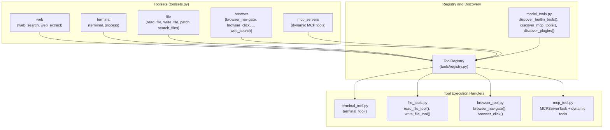
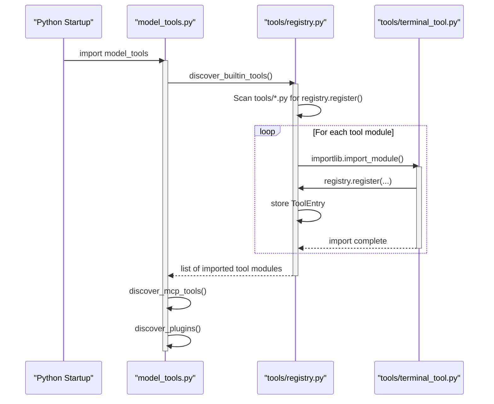
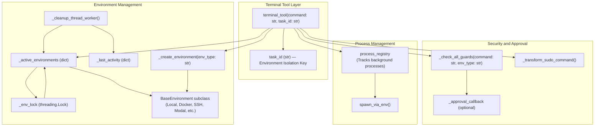
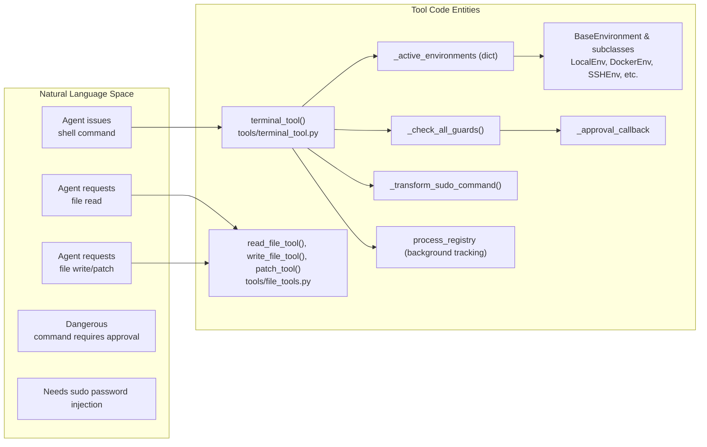
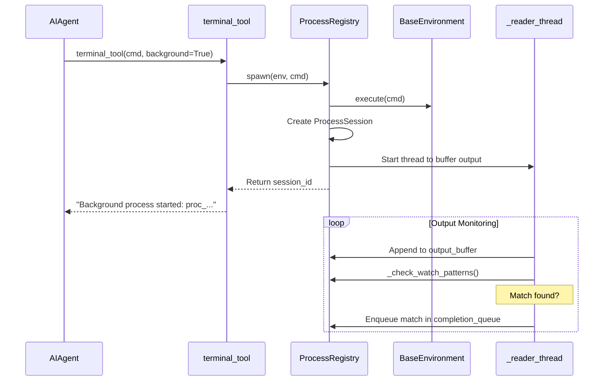
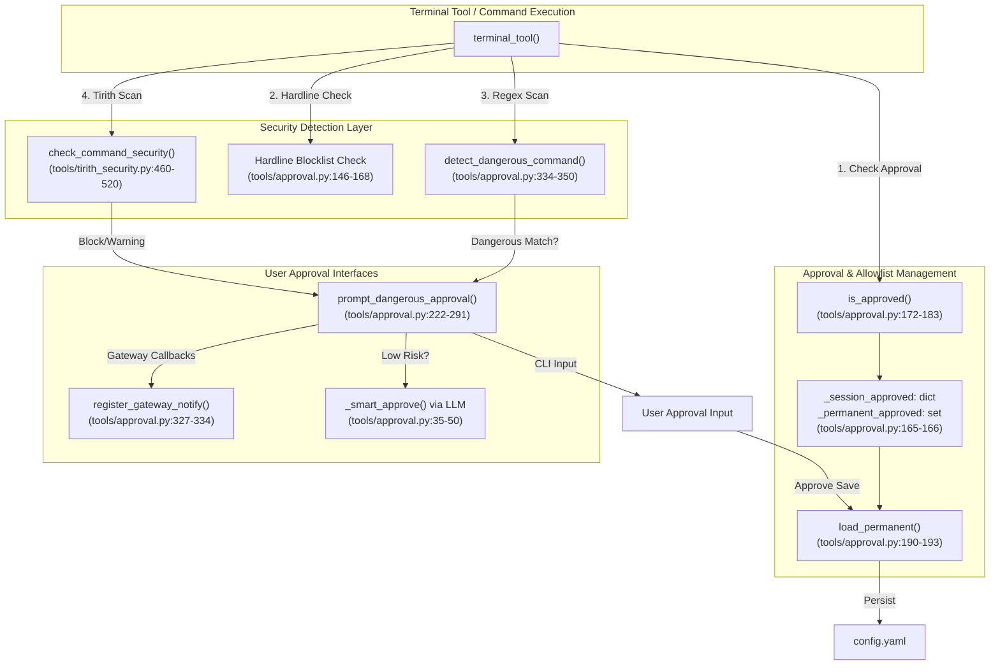
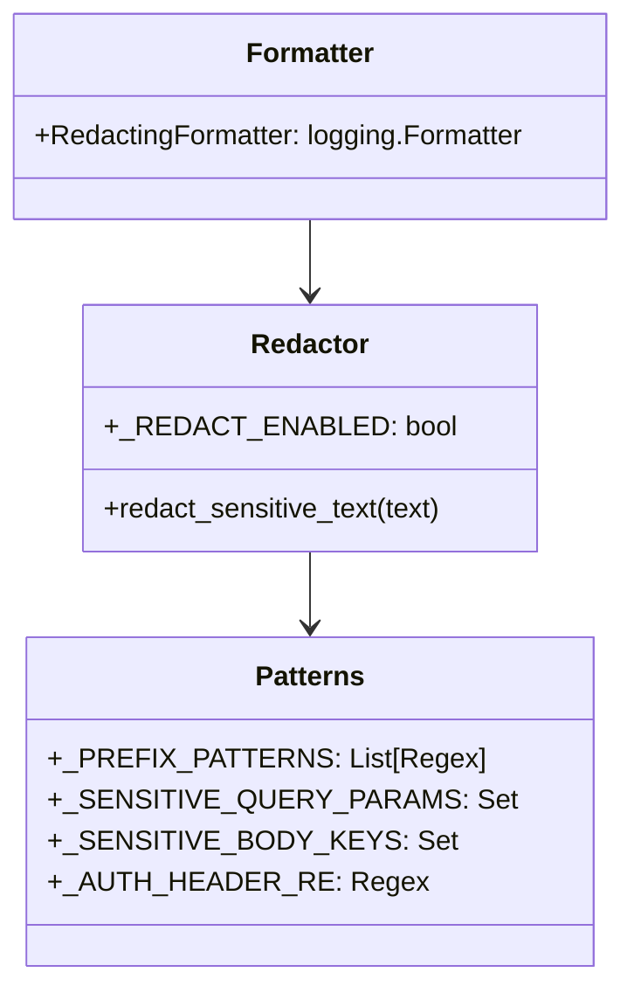
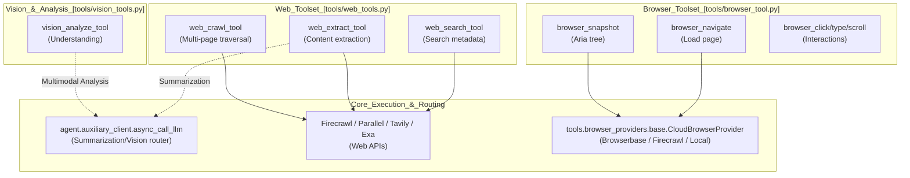
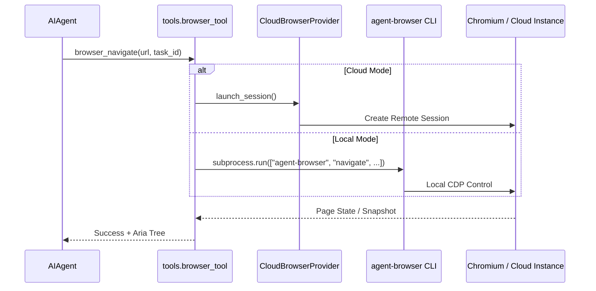
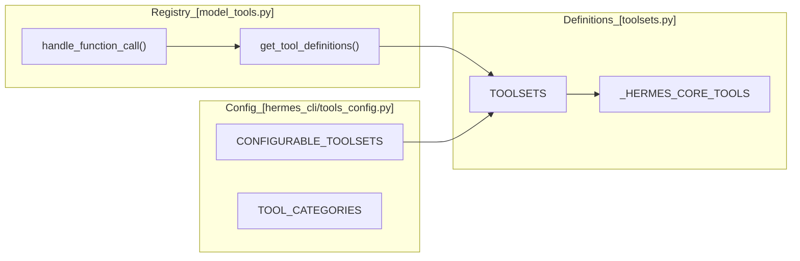

Sources:
[model_tools.py:1-30, 36-125, 135-153](),
[tools/registry.py:1-110, 176-210](),
[toolsets.py:1-224](),
[tools/mcp_tool.py:1-75](),
[tools/__init__.py:18-25](),
[hermes_cli/tools_config.py:30-71](),
[tests/hermes_cli/test_tools_config.py:188-201]()

# Tool Registry and Toolsets


This page documents the Hermes Agent tool registry system, focusing on tool registration, discovery, toolset composition, and platform-specific toolset management. It details how individual tools self-register in the centralized registry, how toolsets group tools for different use cases, and the dynamic aspects such as MCP tool integration and persistent per-platform configuration.

For implementation details of specific tools (terminal, web, vision, etc.), see related leaf pages like **5.2 Terminal and File Operations**, **5.5 Web, Browser, and Vision Tools**, and **5.8 Other Tools**. For secure command approval details, see **5.4 Security and Command Approval**.

---

## Overview

Hermes Agent uses a **centralized tool registry pattern**, where each tool module registers its schema, handler function, toolset category, and runtime availability check at import time [tools/registry.py:1-15](). The registry acts as a unified store for tool metadata and dispatching logic [model_tools.py:1-9](). This decouples the core agent orchestration from individual tool implementations and avoids maintaining redundant data structures.

Toolsets are logical groupings of tools that can be used to enable or disable coherent bundles of functionality (e.g., web research, terminal execution, vision analysis) [toolsets.py:1-24](). Toolsets support composition by including other toolsets, allowing flexible scenario-based configuration [toolsets.py:76-78]().

Sources: [model_tools.py:1-21](), [tools/registry.py:1-15](), [toolsets.py:1-24]()

---

## Architecture

### Component Hierarchy and Data Flow

The system structure is as follows:

- **Tool Modules** (e.g., `tools/terminal_tool.py`) define tool schemas, handlers, and register them on import using `registry.register()` [tools/registry.py:1-15]().
- The **ToolRegistry singleton** (defined in `tools/registry.py`) collects all tool entries, including schemas and handlers, and provides availability checking and dispatching [tools/registry.py:151-167]().
- The **Toolset system** (`toolsets.py`) defines named groups of tools and supports resolving composed toolsets into flat lists of tool names [toolsets.py:240-246]().
- The **Public API layer** (`model_tools.py`) triggers discovery (imports tool modules), fetches filtered tool definitions by enabled toolsets, and exposes `handle_function_call()` for performing tool invocation [model_tools.py:11-21]().
- **Consumers** such as the core agent (`run_agent.py`), CLI (`hermes_cli/chat.py`), messaging gateways (`gateway/gateway_runner.py`), batch runner (`batch_runner.py`), and RL environments consume this API to integrate tool functionality [model_tools.py:11-21]().

**Tool Registry Data Flow**
```mermaid
graph TB
    subgraph "Tool Modules (self-registering)"
        TerminalTool["tools/terminal_tool.py<br/>TERMINAL_SCHEMA<br/>terminal_tool()"]
        FileTool["tools/file_operations.py<br/>READ_FILE_SCHEMA<br/>WRITE_FILE_SCHEMA<br/>read_file_tool()"]
        WebTool["tools/web_tools.py<br/>WEB_SEARCH_SCHEMA<br/>web_search_tool()"]
        VisionTool["tools/vision_tools.py<br/>VISION_SCHEMA<br/>vision_analyze_tool()"]
        BrowserTool["tools/browser_tool.py<br/>BROWSER_SCHEMAS<br/>browser_navigate()"]
    end
    
    subgraph "ToolRegistry (Central Registry)"
        Registry["tools/registry.py<br/>ToolRegistry class<br/>_tools: Dict[str, ToolEntry]<br/>_toolset_checks: Dict[str, Callable]"]
    end
    
    subgraph "Toolset System"
        Toolsets["toolsets.py<br/>TOOLSETS dict<br/>resolve_toolset()"]
    end
    
    subgraph "Public API Layer"
        ModelTools["model_tools.py<br/>discover_builtin_tools()<br/>get_tool_definitions()<br/>handle_function_call()"]
    end
    
    subgraph "Consumers"
        Agent["run_agent.py<br/>AIAgent class"]
        CLI["hermes_cli/chat.py"]
        Gateway["gateway/gateway_runner.py"]
        Batch["batch_runner.py"]
        RL["environments/agent_loop.py"]
    end
    
    TerminalTool -->| "registry.register()" | Registry
    FileTool -->| "registry.register()" | Registry
    WebTool -->| "registry.register()" | Registry
    VisionTool -->| "registry.register()" | Registry
    BrowserTool -->| "registry.register()" | Registry
    
    Registry -->| "provides tool metadata" | ModelTools
    Toolsets -->| "filter & map toolsets to tools" | ModelTools
    
    ModelTools -->| "get_tool_definitions()" | Agent
    ModelTools -->| "get_tool_definitions()" | CLI
    ModelTools -->| "get_tool_definitions()" | Gateway
    ModelTools -->| "get_tool_definitions()" | Batch
    ModelTools -->| "get_tool_definitions()" | RL
    
    Agent -->| "handle_function_call()" | ModelTools
    CLI -->| "handle_function_call()" | ModelTools
    Gateway -->| "handle_function_call()" | ModelTools
    Batch -->| "handle_function_call()" | ModelTools
    RL -->| "handle_function_call()" | ModelTools
    
    ModelTools -->| "registry.dispatch()" | Registry
    Registry -->| "routes to tool handlers" | TerminalTool
    Registry -->| "routes to tool handlers" | FileTool
```

Sources: [model_tools.py:11-21](), [toolsets.py:1-24](), [tools/registry.py:151-167](), [tools/registry.py:77-108]()

---

## Tool Discovery Process

Tools are discovered by dynamically importing tool modules that contain top-level `registry.register()` calls [tools/registry.py:42-55](). The main discovery function `discover_builtin_tools()` scans the `tools/` directory, parses files for `registry.register` usage using AST, then imports valid modules to trigger registration [tools/registry.py:57-74]().

After importing built-in tools, additional MCP tools and plugin tools are discovered by calling:
- `discover_mcp_tools()` from `tools/mcp_tool.py` [model_tools.py:30]()
- `discover_plugins()` from `hermes_cli.plugins` [hermes_cli/tools_config.py:123-124]()

The discovery flow ensures all available tools are registered in the central registry before orchestration begins.

**Discovery Sequence**


### Typical Tool Categories Registered

| Category | Tools Registered |
|---------|------------------|
| Web | `web_search`, `web_extract` [toolsets.py:80-84]() |
| Terminal, Process | `terminal`, `process` [toolsets.py:120-124]() |
| File | `read_file`, `write_file`, `patch`, `search_files` [toolsets.py:174-178]() |
| Vision/Image | `vision_analyze`, `image_generate` [toolsets.py:92-108]() |
| Browser Automation | `browser_navigate`, `browser_click`, `browser_type`, ... [toolsets.py:138-148]() |
| Skills | `skills_list`, `skill_view`, `skill_manage` [toolsets.py:132-136]() |
| Miscellaneous | `text_to_speech`, `todo`, `memory`, `session_search`, `clarify`, `execute_code`, `delegate_task`, `cronjob`, `send_message` [toolsets.py:31-73]() |

Sources: [model_tools.py:11-21](), [tools/registry.py:28-73](), [toolsets.py:31-73]()

---

## Tool Registration

### ToolRegistry and ToolEntry

The core class `ToolRegistry` defined in `tools/registry.py` manages tool metadata and toolset state [tools/registry.py:151-167](). Each tool registers itself using `registry.register()` which creates a `ToolEntry` [tools/registry.py:77-108]().

Key parameters to `register()`:

| Parameter | Description |
|-----------|-------------|
| `name` | Unique tool name (string), e.g., `"terminal"` [tools/registry.py:89]() |
| `toolset` | Toolset group name (string) to which this tool belongs [tools/registry.py:90]() |
| `schema` | JSON schema describing the tool function [tools/registry.py:91]() |
| `handler` | Callable to invoke the tool logic [tools/registry.py:92]() |
| `check_fn` | Optional callable to verify runtime prerequisites [tools/registry.py:93]() |
| `is_async` | Boolean flag indicating if the handler is asynchronous [tools/registry.py:95]() |
| `dynamic_schema_overrides` | Callable returning a dict of schema overrides applied at definition time [tools/registry.py:99-106]() |

### Runtime Availability Checks

Availability checks per toolset or tool allow conditional enabling. The registry caches these checks via `_check_fn_cached` with a TTL of 30 seconds [tools/registry.py:121-141](). This allows dynamic changes (e.g., environment variable updates via `hermes tools`) to propagate without requiring explicit invalidation for every turn [tools/registry.py:110-119]().

### Async Bridging

`model_tools.py` provides `_run_async()` to run async handlers from sync contexts [model_tools.py:82-103](). It uses persistent event loops (via `_get_tool_loop()` and `_get_worker_loop()`) to prevent "Event loop is closed" errors that occur when cached `httpx` or `AsyncOpenAI` clients attempt to close their transport on a dead loop [model_tools.py:45-79]().

Sources: [tools/registry.py:77-190](), [model_tools.py:39-132]()

---

## Toolset System

Toolsets are named groups of tools that simplify enabling/disabling related capabilities [toolsets.py:5-7]().

### Core Toolsets

The `TOOLSETS` dict in `toolsets.py` defines built-in compositions:

| Toolset | Description | Tools Included |
|---------|-------------|----------------|
| `web` | Web research and extraction | `web_search`, `web_extract` [toolsets.py:80-84]() |
| `terminal` | Shell and processes | `terminal`, `process` [toolsets.py:120-124]() |
| `file` | File manipulation | `read_file`, `write_file`, `patch`, `search_files` [toolsets.py:174-178]() |
| `browser` | Browser automation | `browser_navigate`, `browser_snapshot`, `browser_click`, ... [toolsets.py:138-148]() |
| `computer_use`| Background macOS control | `computer_use` [toolsets.py:110-118]() |
| `moa` | Mixture of Agents | `mixture_of_agents` [toolsets.py:126-130]() |

### Toolset Resolution

The function `resolve_toolset(name: str) -> Set[str]` recursively expands a toolset by including listed tools and nested toolsets [toolsets.py:240-246]().

Sources: [toolsets.py:68-152](), [toolsets.py:240-246]()

---

## Model Context Protocol (MCP) Integration

Hermes Agent integrates external tool servers via the **Model Context Protocol (MCP)** [tools/mcp_tool.py:3-7]().

- **Configuration**: Servers are configured in `~/.hermes/config.yaml` under `mcp_servers` [tools/mcp_tool.py:9-48]().
- **Transport**: Supports stdio, HTTP, and SSE transports [tools/mcp_tool.py:49-59]().
- **Discovery**: Each server runs as a long-lived asyncio Task on a dedicated background loop (`_mcp_loop`) [tools/mcp_tool.py:60-64]().
- **Naming**: Discovered tools are registered with the prefix `mcp_{server_name}_` [tests/tools/test_mcp_tool.py:97]().
- **Security**: Credential stripping is performed on error messages returned to the LLM [tools/mcp_tool.py:54]().

Sources: [tools/mcp_tool.py:1-75](), [tests/tools/test_mcp_tool.py:90-100]()

---

## Configuration and Persistence

### Per-Platform Toolset Configuration

Users can toggle toolsets per platform via `hermes tools` [hermes_cli/tools_config.py:5-6](). Toolsets that require API keys trigger provider-aware configuration prompts [hermes_cli/tools_config.py:156-160](). Selections are saved to `~/.hermes/config.yaml` under `platform_toolsets` [hermes_cli/tools_config.py:8-9]().

### Default and Disabled Toolsets

- **Default Off**: Toolsets like `moa`, `homeassistant`, and `rl` are off by default for new installs [hermes_cli/tools_config.py:85]().
- **Platform Restrictions**: Certain toolsets like `discord` are restricted to specific platforms to keep UI menus clean [hermes_cli/tools_config.py:94-97]().
- **Global Disable**: `agent.disabled_toolsets` in `config.yaml` suppresses toolsets across all platforms [tests/hermes_cli/test_tools_config.py:24-37]().

Sources: [hermes_cli/tools_config.py:49-108](), [tests/hermes_cli/test_tools_config.py:24-111]()

---

**Sources:**
- [model_tools.py:1-21,39-132]()
- [tools/registry.py:1-110,125-190]()
- [toolsets.py:1-152,183-246]()
- [tools/mcp_tool.py:1-75]()
- [hermes_cli/tools_config.py:1-110,156-166]()
- [tests/hermes_cli/test_tools_config.py:24-220]()
- [tests/tools/test_mcp_tool.py:90-100]()

# Terminal and File Operations


This page documents the terminal and file operation tools, which provide command execution and filesystem manipulation capabilities. The terminal tool executes shell commands across multiple backend environments, while file tools provide specialized operations for reading, writing, patching, and searching files.

For information about the underlying execution environment backends (local, Docker, SSH, Modal, etc.), see **6.2 Backend Implementations**. For security checks and command approval, see **5.4 Security and Command Approval**. For background process management, see **5.3 Process Management**.

---

## Overview

The terminal and file tools share a common architecture built on the environment abstraction layer. Both tool families:

- Support multiple backend environments (local, Docker, SSH, Singularity, Modal, Daytona, Vercel Sandbox) leveraging environment selection via environment variables [tools/terminal_tool.py:10-15]().
- Provide per-task isolation using a `task_id` parameter to support parallel and nested command execution [tools/terminal_tool.py:863-878]().
- Reuse persistent environment instances to avoid startup overhead and enable caching across multiple calls [tools/terminal_tool.py:886-910]().
- Integrate with a security approval system that prevents execution of dangerous commands by requesting user approval [tools/terminal_tool.py:148-151]().
- Handle password injection for sudo commands transparently, using callbacks and cached credentials [tools/terminal_tool.py:182-301]().

The file tools build on top of the terminal tool environments to provide cross-backend file operations such as reading, writing, patching, and searching files, with additional safeguards and optimizations for large files and to prevent infinite loop scenarios [tools/file_tools.py:10-60]().

**Sources:** [tools/terminal_tool.py:1-34](), [tools/file_tools.py:1-60](), [tools/file_operations.py:1-26]()

---

## Terminal Tool Architecture

The terminal tool (`terminal_tool` function in `tools/terminal_tool.py`) serves as the core tool for executing shell commands across local and remote execution backends, including containerized and cloud sandboxes.

### Core Components and Data Flow

The following diagram maps the major code entities and their relationships involved in terminal command execution:

Terminal Execution Flow

**Sources:** [tools/terminal_tool.py:815-1125](), [tools/terminal_tool.py:398-406](), [tools/terminal_tool.py:515-601](), [tools/terminal_tool.py:119-132]()

- The `terminal_tool` entrypoint receives shell commands and an optional `task_id` to isolate execution contexts [tools/terminal_tool.py:815-820]().
- Active environments are cached in `_active_environments` keyed by `task_id`, guarded by a threading lock (`_env_lock`) to prevent concurrent creation [tools/terminal_tool.py:106-107]().
- The environment factory `_create_environment` instantiates the appropriate backend environment class based on the configured `TERMINAL_ENV` setting [tools/terminal_tool.py:915-950]().
- Before execution, commands are checked for dangerous patterns with `_check_all_guards`. Approvals, if necessary, are requested via the registered approval callback [tools/terminal_tool.py:515-550]().
- Sudo commands have a special handler `_transform_sudo_command` to inject cached or approved passwords transparently [tools/terminal_tool.py:182-200]().
- Commands can run in foreground (blocking) or background (non-blocking) modes. Background processes are tracked via `process_registry` [tools/process_registry.py:135-143]().

---

### Environment Lifecycle and Caching

- When a shell command is executed, the terminal tool first looks up the `_active_environments` cache by `task_id` to reuse an existing shell environment [tools/terminal_tool.py:886-900]().
- If not found, the tool creates a new environment instance via `_create_environment`, which supports backends: local, docker, ssh, singularity, modal, daytona, and vercel_sandbox [tools/terminal_tool.py:915-956]().
- The environment instance manages session state such as working directory, environment variables, and command execution [tools/environments/base.py:1-7]().
- A background cleanup thread `_cleanup_thread_worker` periodically removes stale environments that have been inactive longer than `TERMINAL_LIFETIME_SECONDS` (default 300 seconds) [tools/terminal_tool.py:604-665]().
- The `_last_activity` dictionary tracks timestamps of the last use per environment to aid in cleanup decisions [tools/terminal_tool.py:604-610]().

**Sources:** [tools/terminal_tool.py:886-960](), [tools/terminal_tool.py:604-665]()

---

### Configuration of Terminal Backends

The terminal tool backends are selected and configured via environment variables, providing flexibility and deployment customization.

| Variable | Default | Description | File Reference |
|---|---|---|---|
| `TERMINAL_ENV` | `"local"` | Backend type: `local`, `docker`, `ssh`, `singularity`, `modal`, `daytona`, `vercel_sandbox` | [tools/terminal_tool.py:10-15]() |
| `TERMINAL_MAX_FOREGROUND_TIMEOUT` | `600` (seconds) | Hard cap on command foreground execution timeout | [tools/terminal_tool.py:105-111]() |
| `TERMINAL_DISK_WARNING_GB` | `500` Gigabytes | Disk usage warning threshold to log warnings | [tools/terminal_tool.py:114-119]() |

The environment variable `TERMINAL_ENV` selects which environment backend to use. For example:
- `"local"`: Execute commands directly on the host machine [tools/environments/local.py:1-10]().
- `"docker"`: Execute commands inside Docker containers [tools/environments/docker.py:1-6]().
- `"ssh"`: Execute commands over SSH [tools/environments/ssh.py:1-43]().
- `"modal"`: Execute commands inside Modal cloud sandboxes [tools/terminal_tool.py:13]().

**Sources:** [tools/terminal_tool.py:105-111](), [tools/terminal_tool.py:114-119](), [tools/terminal_tool.py:447-461]()

---

### Foreground vs Background Execution Modes

The terminal tool supports two main execution modes for commands:

#### Foreground Execution (Default)
- The command runs synchronously and blocks until completion or timeout [tools/terminal_tool.py:1000-1020]().
- Output is collected and truncated if exceeding 50,000 characters [tools/terminal_tool.py:1020-1040]().
- Exit code and stderr/stdout merged output are returned as a JSON result [tools/terminal_tool.py:1050-1055]().

#### Background Execution
- Spawns a process asynchronously, registers it in `process_registry` keyed by a session ID [tools/process_registry.py:20-30]().
- Returns immediately with process ID and session info [tools/terminal_tool.py:1057-1114]().
- Useful for long-running commands like servers or watchers [tools/process_registry.py:2-10]().

**Sources:** [tools/terminal_tool.py:991-1124](), [tools/terminal_tool.py:1057-1114]()

---

## File Operations

File tools provide the LLM agent with APIs for reading, writing, patching, and searching files. These tools build on the terminal backends by composing shell command invocations suitable for each environment [tools/file_operations.py:8-10]().

### File Operations Architecture

File manipulations use the `ShellFileOperations` class, which wraps terminal environment shell execution to issue commands like `cat`, `tee`, `patch`, and `rg` (ripgrep) [tools/file_operations.py:12-26]().

The file operations API consists of key methods:

| Method | Description | Return Type |
|---|---|---|
| `read_file(path, offset, limit)` | Reads file content with pagination and line counts | `ReadResult` [tools/file_operations.py:98-111]() |
| `write_file(path, content)` | Writes string content to a file, creating directories if needed | `WriteResult` [tools/file_operations.py:118-125]() |
| `patch_replace(path, old_string, new_string, replace_all)` | Applies fuzzy-match replacement in file content | `PatchResult` [tools/file_operations.py:131-155]() |
| `search_files(query, path, file_glob, regex, offset, limit)` | Search files content using ripgrep or fallback | `SearchResult` [tools/file_operations.py:168-192]() |

**Sources:** [tools/file_operations.py:1-26](), [tools/file_tools.py:169-360]()

---

### Read-Search Loop Detection and Deduplication

The file tools implement mechanisms to detect repeated reads of the same file region to avoid infinite loops:
- A per-task `_read_tracker` cache tracks read calls by `(path, offset, limit)` keys [tools/file_tools.py:189-192]().
- If the same read parameters are called 3 times consecutively, a warning is emitted [tools/file_tools.py:190-200]().
- On 4 or more consecutive repeats of identical reads, the tool returns an error to block potential loops [tools/file_tools.py:200-210]().

**Sources:** [tools/file_tools.py:189-230]()

---

### Security and Write Protection

File writes and patches are protected by a denylist system:
- Static denylist includes critical system files such as `/etc/passwd`, SSH authorized keys, and system directories [tools/file_operations.py:51-53]().
- Writes outside an optional `HERMES_WRITE_SAFE_ROOT` directory are denied [tools/file_operations.py:77-85]().
- The file tools also check if paths are blocked device files (like `/dev/random`) [tools/file_tools.py:69-79]().

**Sources:** [tools/file_operations.py:40-115](), [tools/file_tools.py:90-170]()

---

### Execution Flow Summary

The flow of issuing a terminal or file operation command follows these steps:

1.  **Command/Operation Invocation:** Agent calls `terminal_tool(command, task_id)` or file tool like `read_file_tool(path)` [tools/terminal_tool.py:26-30]().
2.  **Environment Resolution:** The tool looks up or creates a backend environment for the given `task_id` [tools/terminal_tool.py:886-960]().
3.  **Security Checks:** The command or file path is checked via guard functions [tools/terminal_tool.py:198-207]().
4.  **Sudo and Approval Handling:** If necessary, sudo password injection or explicit approval prompts are performed [tools/terminal_tool.py:175-191]().
5.  **Execution Dispatch:** The command is executed synchronously or asynchronously in the environment [tools/terminal_tool.py:991-1120]().
6.  **Result Parsing:** Output, exit codes, diffs, searches, and error messages are captured and serialized as JSON [tools/file_tools.py:180-230]().

---

### Terminal and File Tool Entity Mapping

This diagram illustrates the mapping between Natural Language concepts and their corresponding code entities.

Tool and Entity Mapping

**Sources:** [tools/terminal_tool.py:800-1125](), [tools/file_tools.py:140-250]()

---

## Summary

The terminal and file operation tools constitute foundational runtime components enabling Hermes agent to perform robust, sandboxed command execution and safe filesystem manipulations. They leverage a multi-backend environment abstraction for flexibility and a security system for permission safety.

**Sources:**
- [tools/terminal_tool.py:1-132](), [tools/terminal_tool.py:398-610](), [tools/terminal_tool.py:886-960](), [tools/terminal_tool.py:991-1125]()
- [tools/file_tools.py:1-60](), [tools/file_tools.py:189-230](), [tools/file_tools.py:350-390]()
- [tools/file_operations.py:1-26](), [tools/file_operations.py:74-135]()
- [tools/fuzzy_match.py:1-83](), [tools/fuzzy_match.py:119-157]()
- [tools/patch_parser.py:1-29]()

# Process Management


## Purpose and Scope

Process Management in Hermes Agent governs the spawning, tracking, and lifecycle management of background processes. This is crucial for managing long-running tasks such as servers, watchers, or continuous builds without blocking the agent's core conversation or tool execution loop [tools/process_registry.py:4-10]().

The heart of this system is the `ProcessRegistry`, an in-memory, thread-safe registry of background processes that tracks their status, buffers output logs, supports blocking waits with interrupt handling, process killing, and crash recovery through checkpointing [tools/process_registry.py:135-152]().

Background processes execute through the environment interface (local, Docker, Modal, SSH, Singularity, Daytona, Vercel Sandbox), ensuring process isolation and sandboxing where applicable [tools/process_registry.py:12-14]().

## Background vs Foreground Execution

The `terminal` tool (`tools/terminal_tool.py`) supports two modes of command execution, controlled by the `background` parameter [tools/terminal_tool.py:32-33]():

| Mode           | Behavior                                                          | Return Value                   |
|----------------|-------------------------------------------------------------------|--------------------------------|
| **Foreground** | Blocks until the command finishes or times out (Max 600s by default) [tools/terminal_tool.py:105-112]() | Command output + exit code      |
| **Background** | Spawns process via `ProcessRegistry.spawn` and returns immediately [tools/process_registry.py:19-20]() | Unique Session ID (`proc_...`) |

## ProcessRegistry Architecture

The `ProcessRegistry` maintains two dictionaries keyed by unique session IDs:
- `_running`: Currently active background processes [tools/process_registry.py:154]().
- `_finished`: Recently completed processes retained for a time-to-live period [tools/process_registry.py:155]().

### Code Association Diagram: Registry and Sessions

This diagram maps the logical concept of a "background task" to the specific classes and tracking mechanisms used in the codebase.

```mermaid
graph TB
    subgraph "Natural Language Space"
        "Agent starts a server" --> "Background Task"
        "Agent checks logs" --> "Process Polling"
    end

    subgraph "Code Entity Space: tools/process_registry.py"
        Registry["ProcessRegistry Class"]
        Session["ProcessSession (dataclass)"]
        
        subgraph "Storage"
            Running["_running: Dict[str, ProcessSession]"]
            Finished["_finished: Dict[str, ProcessSession]"]
        end

        subgraph "Key Operations"
            Spawn["spawn() / spawn_local()"]
            Poll["poll()"]
            Kill["kill_process()"]
            Reconcile["_reconcile_local_exit()"]
        end
    end

    subgraph "External Entities"
        Popen["subprocess.Popen (local)"]
        Env["BaseEnvironment (remote/sandbox)"]
    end

    Spawn --> Session
    Session --> Running
    Running --> Reconcile
    Reconcile --> Popen
    Poll --> Running
    Poll --> Finished
    Kill --> Env
```
**Sources:**
- [tools/process_registry.py:89-132]()
- [tools/process_registry.py:153-171]()
- [tools/process_registry.py:415-437]()
- [tools/process_registry.py:722-760]()

## ProcessSession Data Structure

Each background process is encapsulated as a `ProcessSession` dataclass [tools/process_registry.py:89-133]():

| Field             | Description |
|-------------------|-------------|
| `id`              | Unique session ID (e.g., `proc_xxxxxxxxxxxx`) |
| `command`         | Original command string |
| `task_id`         | Sandbox/terminal environment isolation key |
| `pid`             | OS process ID (local only) |
| `process`         | `subprocess.Popen` handle (local only) |
| `output_buffer`   | Rolling 200KB window of stdout/stderr [tools/process_registry.py:57]() |
| `exited`          | Boolean exit state |
| `exit_code`       | Final exit code (None if running) |
| `watch_patterns`  | List of regex/strings to trigger notifications |
| `notify_on_complete` | If True, enqueues event on process exit [tools/process_registry.py:113]() |

## Spawn and Execution Flow

### Local Process Spawning
When `TERMINAL_ENV=local`, `ProcessRegistry` spawns processes using `subprocess.Popen` or `ptyprocess` [tools/process_registry.py:173-225](). It uses `_sanitize_subprocess_env` to ensure Hermes-managed secrets (like API keys) do not leak into the spawned shell [tools/environments/local.py:147-175]().

### Sandbox Spawning (Docker, Modal, SSH, etc.)
For remote backends, the command is passed to the environment's `execute` method. Background execution is managed via `spawn_via_env` which tracks the process using environment-specific PIDs or handles [tools/process_registry.py:227-268]().

### Sequence Diagram: Background Spawn Lifecycle


**Sources:**
- [tools/terminal_tool.py:32-34]()
- [tools/process_registry.py:173-268]()
- [tools/process_registry.py:270-345]()
- [tools/process_registry.py:635-675]()

## Process Monitoring and Notifications

### Watch Patterns and Rate Limiting
The registry supports `watch_patterns`. If the process output matches a regex, the system enqueues a notification [tools/process_registry.py:115-116](). To prevent flooding, strict rate limits are applied:
- **Per Session:** At most one match every 15 seconds (`WATCH_MIN_INTERVAL_SECONDS`) [tools/process_registry.py:67]().
- **Strike System:** Matches arriving during the cooldown count as "strikes". After 3 strikes, watching is disabled for that session [tools/process_registry.py:68-69]().
- **Global Breaker:** Max 15 notifications per 10 seconds across all processes [tools/process_registry.py:72-73]().

### Completion Notifications
If `notify_on_complete` is enabled, the registry pushes a payload to the `completion_queue` when the process exits [tools/process_registry.py:100-101](). This payload includes the `exit_code` and a truncated output log [tools/process_registry.py:677-720]().

## Lifecycle Management and Cleanup

### Resource Pruning
- **Output Limit:** Buffers are capped at 200KB (`MAX_OUTPUT_CHARS`) [tools/process_registry.py:57]().
- **Retention:** Finished processes are kept for 30 minutes (`FINISHED_TTL_SECONDS`) [tools/process_registry.py:58]().
- **Process Cap:** The registry tracks a maximum of 64 processes concurrently [tools/process_registry.py:59]().

### Crash Recovery
The registry maintains a `processes.json` checkpoint file [tools/process_registry.py:54](). Upon restart, the registry attempts to recover sessions. Recovered sessions are marked as `detached=True` because the original pipe handles are lost, but they can still be polled or killed [tools/process_registry.py:104](), [tools/process_registry.py:772-834]().

### Local Orphaned-Pipe Reconciliation
A specific safety mechanism, `_reconcile_local_exit()`, handles cases where a direct child process exits but a descendant holds the pipe open (orphaned pipe). The registry checks the `Popen.poll()` status directly rather than relying solely on the reader thread EOF [tools/process_registry.py:722-760]().

## Process Tool API Summary

| Tool Action | Internal Implementation |
|-------------|-------------------------|
| `poll`      | Checks `_running` or `_finished` and returns status/preview [tools/process_registry.py:415-437](). |
| `wait`      | Blocks with a timeout, polling `session.exited` and handling user interrupts [tools/process_registry.py:439-490](). |
| `read_log`  | Returns paginated output from `output_buffer` [tools/process_registry.py:492-514](). |
| `kill`      | Sends SIGTERM/SIGKILL locally or executes a kill command in the sandbox [tools/process_registry.py:516-550](). |
| `write`     | Pipes data to the process's `stdin` [tools/process_registry.py:552-574](). |

**Sources:**
- [tools/process_registry.py:57-75]()
- [tools/process_registry.py:415-633]()
- [tools/process_registry.py:722-760]()
- [tools/process_registry.py:772-834]()

# Security and Command Approval


## Purpose and Scope

The Security and Command Approval system is a safeguard layer in Hermes Agent designed to intercept and manage the execution of potentially dangerous commands issued by the AI or users. It balances flexibility and security by detecting destructive or risky operations and requiring explicit user approval before execution, thus preventing accidental system damage, unauthorized actions, or malicious code execution.

This system employs multiple overlapping mechanisms to provide a comprehensive approval workflow:

1.  **Dangerous Command Detection**: Uses a curated set of regex patterns to identify commands posing high-risk operations (e.g., recursive deletion, permission changes, self-termination). This is implemented in the `tools.approval` module [tools/approval.py:1-9]().
2.  **Tirith Security Scanner**: Integrates with an external Rust-based security scanner named Tirith to analyze commands at a deeper content level, detecting more subtle threats like homograph URLs, pipe-to-interpreter, terminal injection, and other complex attack vectors.
3.  **Approval States and Session Management**: Tracks approval status on a per-session basis using thread-safe context-local storage, supporting one-time, per-session, and permanent approvals [tools/approval.py:26-33]().
4.  **Approval UI/Callbacks**: Supports interactive CLI prompts as well as asynchronous approval via the messaging Gateway with explicit blocking and notification callbacks [tools/approval.py:300-307]().
5.  **Allowlist and YOLO Mode**: Supports a permanent allowlist loaded from config files for known safe commands and a YOLO shortcut mode to bypass approvals within a session [tools/approval.py:352-361]().
6.  **Hardline Blocklist**: A "floor" below YOLO mode that unconditionally blocks catastrophic commands (like `rm -rf /` or raw block device writes) in host-damaging environments [tools/approval.py:146-168]().
7.  **Secret Redaction**: Automatically masks API keys, tokens, and credentials in logs and tool outputs to prevent accidental exfiltration [agent/redact.py:1-8]().

Sources: [tools/approval.py:1-9](), [tools/approval.py:23-56](), [tools/approval.py:146-168](), [agent/redact.py:1-8]()

---

## System Architecture

The security and approval subsystem fits into the Hermes tool execution pathway as a gatekeeper between the agent issuing commands and their actual execution on the host system.

### Architecture Flow Diagram



Sources: [tools/approval.py:165-350](), [tests/tools/test_approval.py:9-18](), [tools/approval.py:146-168]()

---

## Dangerous Command Detection

Hermes uses a curated set of regex patterns to scan commands for destructive or suspicious operations. 

### Key Patterns and Sensitive Targets
The system identifies sensitive paths that trigger approval even when referenced via shell expansions like `$HOME` or `~`.

- **Sensitive Targets**: Includes `.ssh/` directories, `.env` files, `config.yaml`, shell RC files (`.bashrc`, `.zshrc`), and credential files like `.netrc` or `.pgpass` [tools/approval.py:117-145]().
- **Hardline Blocklist**: Commands like `mkfs`, `dd` to block devices, or kernel `shutdown`/`reboot` are unconditionally blocked in local/SSH environments, even if YOLO mode is active [tools/approval.py:146-170]().

### Detection Logic
- `detect_dangerous_command(command: str)`: Returns `(is_dangerous, key, description)`. It normalizes the command by removing ANSI escapes and Unicode normalization [tools/approval.py:334-350]().
- **Smart Approval**: For low-risk commands, the system can use an auxiliary LLM via `_smart_approve()` to automatically grant permission, reducing user friction [tools/approval.py:35-50](), [tests/tools/test_approval.py:31-44]().

Sources: [tools/approval.py:117-170](), [tools/approval.py:334-350](), [tests/tools/test_approval.py:31-44]()

---

## Secret Redaction

To prevent sensitive information from leaking into logs, terminal outputs, or gateway messages, Hermes implements a comprehensive redaction system in `agent/redact.py`.

### Redaction Entities



- **Known Prefixes**: Detects keys for OpenAI (`sk-`), GitHub (`ghp_`), AWS (`AKIA`), Stripe, Slack, and more [agent/redact.py:69-106]().
- **Contextual Detection**: Identifies secrets in environment assignments (`KEY=value`), JSON fields (`"token": "..."`), and Authorization headers [agent/redact.py:108-125]().
- **Format**: Short tokens (< 18 chars) are fully masked. Longer tokens preserve the first 6 and last 4 characters for debugging [agent/redact.py:6-8]().
- **Configuration**: Redaction is ON by default but can be disabled via `HERMES_REDACT_SECRETS=false` or config [agent/redact.py:58-67]().

Sources: [agent/redact.py:6-125](), [tests/agent/test_redact.py:19-61]()

---

## Environment and Credential Passthrough

When running in sandboxed environments (Docker, SSH, Modal), Hermes manages which host-side credentials and environment variables are allowed to "leak" into the sandbox.

### Credential File Mounting
- **Registry**: Skills can declare `required_credential_files` which are then registered for mounting [tools/credential_files.py:8-19]().
- **Security**: The system rejects absolute paths and path traversal (`..`) to ensure only files within `HERMES_HOME` are mounted [tools/credential_files.py:60-93]().
- **Implementation**: `get_credential_file_mounts()` aggregates files from skill declarations and `terminal.credential_files` in `config.yaml` [tools/credential_files.py:176-188]().

### Environment Variable Passthrough
- **Allowlist**: Variables declared in skill frontmatter (`required_environment_variables`) or user config are passed to sandboxes [tools/env_passthrough.py:1-18]().
- **Provider Blocklist**: Hermes-managed provider credentials (like `OPENAI_API_KEY`) are explicitly blocked from passthrough to prevent malicious skills from exfiltrating the agent's own keys [tools/env_passthrough.py:48-67](), [tools/env_passthrough.py:90-98]().

Sources: [tools/credential_files.py:8-102](), [tools/env_passthrough.py:1-98]()

---

## Approval Modes: Cron and YOLO

### Cron Approval Mode
For scheduled tasks (cron jobs), interactive approval is impossible. The behavior is governed by `approvals.cron_mode` [tests/tools/test_cron_approval_mode.py:1-12]().
- **Modes**: `deny` (default, blocks dangerous commands) or `approve` (allows them) [tests/tools/test_cron_approval_mode.py:30-85]().
- **Detection**: Triggered when `HERMES_CRON_SESSION` is present [tools/approval.py:111-115]().

### YOLO Mode
- **Global**: Enabled via `--yolo` or `HERMES_YOLO_MODE=1` [tests/tools/test_yolo_mode.py:36-56]().
- **Session-Scoped**: The `/yolo` gateway command enables bypass only for the active chat session [tests/tools/test_yolo_mode.py:155-166]().
- **Constraint**: YOLO mode cannot bypass the **Hardline Blocklist** patterns [tests/tools/test_yolo_mode.py:63-69]().

Sources: [tests/tools/test_cron_approval_mode.py:1-85](), [tests/tools/test_yolo_mode.py:36-166](), [tools/approval.py:111-115]()

# Web, Browser, and Vision Tools


This document covers the tools that enable web interaction, browser automation, and visual analysis: web search and extraction [tools/web_tools.py:10-14](), automated browser control [tools/browser_tool.py:5-9](), and image understanding [tools/vision_tools.py:9-11](). These tools leverage the auxiliary client pattern [agent/auxiliary_client.py:68-70]() to perform side tasks like summarization and vision analysis without bloating the main conversation context.

---

## Architecture Overview

The following diagram bridges the natural language tool definitions used by the agent to the underlying code entities and external service backends.

**Natural Language to Code Entity Mapping**



Sources: [tools/web_tools.py:10-41](), [tools/browser_tool.py:5-50](), [tools/vision_tools.py:9-29](), [agent/auxiliary_client.py:68-70]()

---

## Web Tools

Web tools provide search, extraction, and crawling capabilities. The system supports multiple backends, selected via `web.backend` or capability-specific overrides like `web.search_backend` in `config.yaml` [tools/web_tools.py:121-175]().

### Backend Providers

| Backend | Capability | Environment Variable / Requirement |
|---------|------------|----------------------|
| **Firecrawl** | Search, Extract, Crawl | `FIRECRAWL_API_KEY` [tools/web_tools.py:138-140]() |
| **Parallel** | Search, Extract | `PARALLEL_API_KEY` [tools/web_tools.py:139]() |
| **Tavily** | Search, Extract, Crawl | `TAVILY_API_KEY` [tools/web_tools.py:140]() |
| **Exa** | Search, Extract | `EXA_API_KEY` [tools/web_tools.py:141]() |
| **SearXNG** | Search | `SEARXNG_URL` [tools/web_tools.py:142]() |
| **Brave Search** | Search | `BRAVE_SEARCH_API_KEY` [tools/web_tools.py:143]() |
| **DuckDuckGo** | Search | `duckduckgo-search` package [tools/web_tools.py:144]() |

Sources: [tools/web_tools.py:108-150](), [tools/web_tools.py:178-189]()

### Tool Implementation Details

1.  **`web_search_tool`**: Returns metadata (title, URL, description). It supports result limiting and provider-specific parameters [tools/web_tools.py:34]().
2.  **`web_extract_tool`**: Fetches full page content. It uses `async_call_llm` to summarize the text into markdown if the content exceeds `SNAPSHOT_SUMMARIZE_THRESHOLD` to save context tokens [tools/web_tools.py:23-24]().
3.  **`web_crawl_tool`**: Initiates site-wide crawls with specific instructions, primarily supported by Firecrawl and Tavily [tools/web_tools.py:13-14]().

Sources: [tools/web_tools.py:10-41](), [tools/browser_tool.py:175]()

---

## Browser Automation

The browser toolset provides a headless environment for interacting with dynamic websites. It supports **Browserbase** (cloud), **Browser Use** (cloud), **Firecrawl** (cloud), and **Local Chromium** [tools/browser_tool.py:5-9]().

### Browser Command Flow



Sources: [tools/browser_tool.py:52-90](), [tools/browser_tool.py:143-162]()

### Key Features
*   **Accessibility Tree**: Uses `agent-browser`'s `ariaSnapshot` for a text-based representation of the page, optimized for LLMs [tools/browser_tool.py:11-12]().
*   **Ref Selectors**: Interactive elements are assigned reference IDs (e.g., `@e1`) that the agent uses for `browser_click` and `browser_type` [tools/browser_tool.py:23]().
*   **Session Isolation**: Browser sessions are isolated per `task_id` and automatically cleaned up via `atexit` and signal handlers [atexit:52-63](), [tools/browser_tool.py:21]().
*   **Auto-Local Routing**: For security and connectivity, URLs targeting private/LAN addresses (e.g., `localhost`, `192.168.x.x`) automatically bypass cloud providers and use a local Chromium sidecar [website/docs/user-guide/features/browser.md:91-100]().
*   **Camofox Support**: An optional local anti-detection backend using a Firefox fork with fingerprint spoofing, accessible via `CAMOFOX_URL` [tools/browser_tool.py:92-98]().

Sources: [tools/browser_tool.py:11-50](), [tools/browser_tool.py:171-175]()

---

## Vision Analysis Tools

The `vision_analyze_tool` provides multimodal understanding of images [tools/vision_tools.py:10]().

### Implementation Logic
1.  **Validation**: Validates image URLs and enforces SSRF protection to block private/internal addresses [tools/vision_tools.py:76-104]().
2.  **Download**: Downloads images using `httpx.AsyncClient` with a hard size limit of 50MB to prevent decompression bombs or OOM errors [tools/vision_tools.py:73](), [tools/vision_tools.py:129-143]().
3.  **Processing**: Detects MIME types (PNG, JPEG, GIF, WEBP, BMP, SVG) [tools/vision_tools.py:107-126]() and converts images to base64 data URLs for API transmission [tools/vision_tools.py:31]().
4.  **Inference**: Routes the analysis to the auxiliary vision client, which can use OpenRouter, Anthropic, or OpenAI-compatible endpoints [tools/vision_tools.py:5-7]().

Sources: [tools/vision_tools.py:5-18](), [tools/vision_tools.py:71-143]()

---

## Tool Configuration and Registry

Tools are configured via the `hermes tools` CLI, which manages API keys and provider selection [hermes_cli/tools_config.py:1-10]().

**Tool Configuration Mapping**


Sources: [model_tools.py:1-21](), [toolsets.py:31-73](), [hermes_cli/tools_config.py:54-80]()

### Toolset Composition
*   **`web`**: Includes `web_search` and `web_extract` [toolsets.py:80-84]().
*   **`browser`**: Comprises a full suite of automation tools (`navigate`, `snapshot`, `click`, `type`, `scroll`, `back`, `press`, `get_images`, `vision`, `console`, `cdp`, `dialog`) plus `web_search` [toolsets.py:138-148]().
*   **`vision`**: Specifically provides `vision_analyze` [toolsets.py:92-96]().

Sources: [toolsets.py:78-206]()