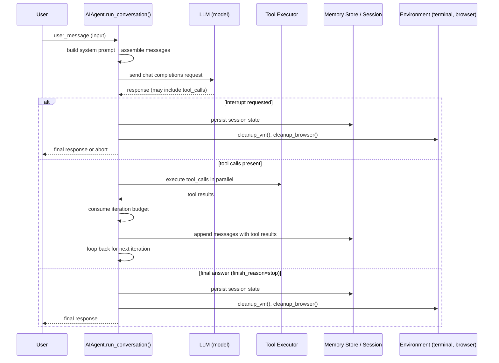
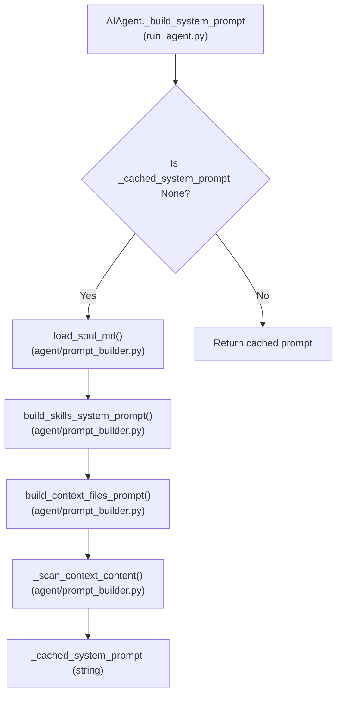
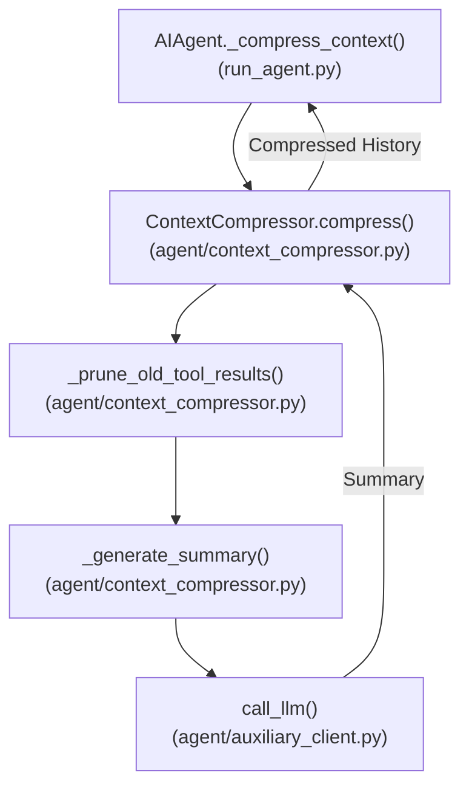
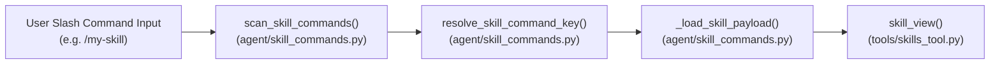
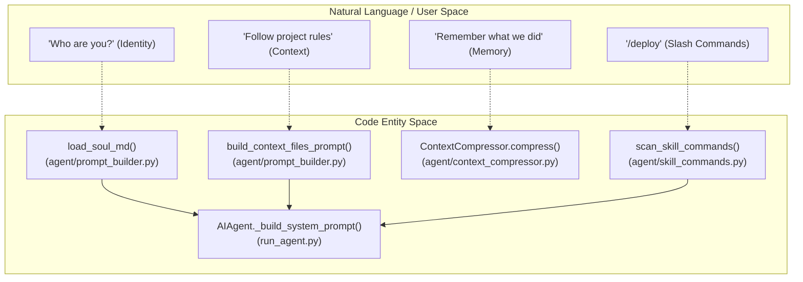
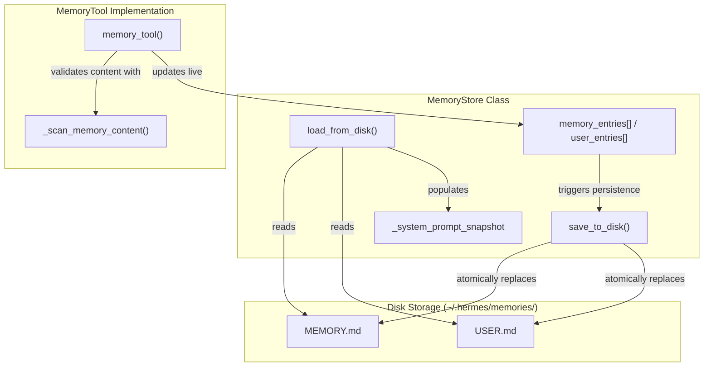
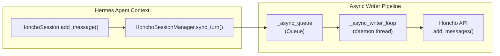

Sources: [`run_agent.py:8440-9120`]()

---

# Notes on Key Implementation Points

- The entire agent lifecycle for a conversation is in the async-aware, interruptible `_interruptible_api_call()` method.
- `ContextCompressor` ensures the token budget is respected by compressing old messages dynamically on exceeding thresholds [`agent/context_compressor.py:1-18`]().
- Tool execution hooks into the `model_tools.handle_function_call()` centralized dispatch [`run_agent.py:125`]().
- The `IterationBudget` supports partial refunds necessary for nested subagent workflows [`run_agent.py:4615-4680`]().

Sources: [`run_agent.py:8440-9120`](), [`agent/context_compressor.py:1-18`](), [`run_agent.py:125`](), [`run_agent.py:4615-4680`]()

# Context and Prompt Management


This page explains how the `AIAgent` constructs the system prompt, manages contextual inputs from project files such as `SOUL.md`, dynamically injects user-specified context, and manages LLM context window limits through resolution and compression. It covers the implementations, data flow, and key functions/classes responsible for these tasks.

---

## System Prompt Assembly

The central function for constructing the system prompt is `AIAgent._build_system_prompt()` in [run_agent.py:349-405](). This method assembles a layered prompt including the agent's identity, behavioral instructions, tools, skills, and contextual project files.

### Implementation and Data Flow

- **Caching:** The system prompt is cached in `self._cached_system_prompt` to avoid repeated costly rebuilds. It is invalidated when factors like directory changes or context compression occur [run_agent.py:355-360]().
- **Stateless Assembly Modules:** The detailed composition logic lives in [agent/prompt_builder.py]() as pure functions that return string snippets.
- **Composition Order:**

| Layer | Source / Function | Conditional Inclusion |
|---|---|---|
| Agent Identity | `load_soul_md()` or fallback `DEFAULT_AGENT_IDENTITY` | Always [agent/prompt_builder.py:134-142]() |
| Memory Guidance | `MEMORY_GUIDANCE` prompt snippet | If `memory` enabled [agent/prompt_builder.py:150-168]() |
| Session Search | `SESSION_SEARCH_GUIDANCE` snippet | If `session_search` enabled [agent/prompt_builder.py:170-185]() |
| Skills Guidance | `SKILLS_GUIDANCE` snippet | If `skill_manage` enabled [agent/prompt_builder.py:187-200]() |
| Tool Use Enforcement | `TOOL_USE_ENFORCEMENT_GUIDANCE` | For specific models in `TOOL_USE_ENFORCEMENT_MODELS` [agent/prompt_builder.py:202-218]() |
| Skills Index | `build_skills_system_prompt()` generates a compact skill directory | If skills exist [agent/prompt_builder.py:228-348]() |
| Project Context Files | `build_context_files_prompt(cwd)` to include instructions from project files | Unless `skip_context_files` set [agent/prompt_builder.py:350-384]() |
| Platform Hint | `PLATFORM_HINTS[platform]` to provide environment context | If `platform` specified [agent/prompt_builder.py:448-462]() |

### System Prompt Build Logic



**Sources:** [agent/prompt_builder.py:134-218](), [agent/prompt_builder.py:228-348](), [agent/prompt_builder.py:350-384](), [run_agent.py:349-405]()

---

## Context Files and Persona (SOUL.md)

### Context Discovery and Security

Hermes Agent discovers context and persona information hierarchically using project files for situational grounding:

- **Persona (`SOUL.md`):** Defines the agent's personality and core identity. It is loaded via `load_soul_md()` which checks `${HERMES_HOME}/SOUL.md` [agent/prompt_builder.py:404-416](). If missing, it falls back to `DEFAULT_SOUL_MD` defined in [hermes_cli/default_soul.py:5-10]().
- **Project Context Files:** The `build_context_files_prompt()` function searches for instructions in the following order:
  1. `.hermes.md` or `HERMES.md`: Native project config (searches up to git root) [agent/prompt_builder.py:89-110]().
  2. `AGENTS.md`: Common agent instruction file.
  3. `.cursorrules` or `.cursor/rules/*.mdc`: Cursor compatibility [agent/prompt_builder.py:350-384]().
- **Security Scanning:** All context content passes through `_scan_context_content()` which uses `_CONTEXT_THREAT_PATTERNS` to detect invisible unicode, "ignore previous instructions" injections, or secret exfiltration patterns [agent/prompt_builder.py:36-73]().

### Context File Size Limit
Context files are truncated at `CONTEXT_FILE_MAX_CHARS` (20,000 characters) via `_truncate_content()` to prevent prompt bloat [agent/prompt_builder.py:431-446]().

**Sources:** [agent/prompt_builder.py:35-110](), [agent/prompt_builder.py:404-446](), [hermes_cli/default_soul.py:5-10]()

---

## Context Window Management and Compression

Hermes manages long conversations approaching model limits using the `ContextCompressor` class [agent/context_compressor.py:51]().

### Compression Workflow
- **Trigger:** Compression activates in the `AIAgent` loop when token usage exceeds a configured threshold (typically 50-85% of window) [run_agent.py:650-680]().
- **Tool Result Pruning:** Older tool output messages are replaced with `[Old tool output cleared...]` placeholders via `_prune_old_tool_results()` to save space while maintaining the conversation structure [agent/context_compressor.py:152-185]().
- **Summarization:** The "compressible middle" (history between the first few turns and the most recent `protect_last_n` messages) is summarized by an auxiliary model into structured sections: Goals, Progress, Decisions, Files, and Next Steps [agent/context_compressor.py:8-14]().

### Data Flow for Compression



**Sources:** [agent/context_compressor.py:51-185](), [run_agent.py:650-680](), [agent/auxiliary_client.py:41-150]()

---

## Skills Integration in System Prompts

Skills are procedural instructions packaged with metadata and source code, integrated efficiently into prompts.

### Skill Indexing (`build_skills_system_prompt()`)
- Scans the skills directory (usually `~/.hermes/skills/`) and builds an index of names and descriptions [agent/prompt_builder.py:228-348]().
- The index informs the LLM about available capabilities without embedding full skill source code upfront, preserving context space.

### Skill Activation via Slash Commands
User inputs like `/axolotl` trigger skill lookups via `scan_skill_commands()` [agent/skill_commands.py:9-13]().



### Skill Message Building
`_build_skill_message()` formats the payload, performing:
1. **Template Substitution:** Injecting session variables into the skill text [agent/skill_commands.py:128-130]().
2. **Inline Shell Expansion:** Executing commands defined in the skill markdown via `_expand_skill_shell_commands()` [agent/skill_commands.py:131-133]().
3. **Config Injection:** Resolving `metadata.hermes.config` requirements from the user's `config.yaml` [agent/skill_commands.py:73-109]().

**Sources:** [agent/prompt_builder.py:228-348](), [agent/skill_commands.py:9-170](), [tools/skills_tool.py:85-101]()

---

## Summary Diagram: Natural Language Concepts to Code Entities

This diagram bridges the conceptual "Space" of user features to the specific "Code Entities" that implement them.



**Sources:** [agent/prompt_builder.py:1-462](), [agent/skill_commands.py:1-170](), [run_agent.py:349-405](), [agent/context_compressor.py:51-185]()

# Memory and Sessions


This page documents the memory and session management systems in Hermes Agent, which provide persistent conversation context, agent memory storage, and session management capabilities. The implementations span several layers including file-based memories (`MEMORY.md`, `USER.md`), SQLite-backed session persistence with full-text search, trajectory logging, and session search with LLM-powered summarization.

**Scope:**
- **Memory**: Persistent agent notes and user profiles managed by `MemoryStore`.
- **Sessions**: Conversation context tracking, lifecycle management, and persistence via `SessionDB` (SQLite).
- **Trajectory Logging**: Turn-level data capture for training/batch use cases (separate from session state).
- **Session Search**: Full-text indexed recall and LLM summarization for long-term retrieval.

---

## Memory System

The memory system maintains persistent knowledge for the agent and user across sessions. This is stored in two Markdown files in the memories directory scoped to each profile [tools/memory_tool.py:5-14]().

| File | Purpose | Max Size | Tool Actions |
| :--- | :--- | :--- | :--- |
| `MEMORY.md` | Agent personal notes, facts, and quirks | 2200 chars | add, replace, remove, read |
| `USER.md` | User preferences and profiles | 1375 chars | add, replace, remove, read |

Entries are separated using the `§` (section sign) character and can span multiple lines [tools/memory_tool.py:59-59]().

### `MemoryStore` Class and Frozen Snapshot Pattern

`MemoryStore` manages in-memory representations of these files while applying a **frozen snapshot pattern** to preserve prompt prefix caching between conversation turns [tools/memory_tool.py:107-116]():

- **Snapshot Generation**: On `load_from_disk()`, the contents of `MEMORY.md` and `USER.md` are read and captured into `_system_prompt_snapshot` [tools/memory_tool.py:126-142]().
- **Immutability**: This snapshot is injected into the system prompt on session start and remains immutable during the session to keep the LLM prefix cache stable [tools/memory_tool.py:11-14]().
- **Live Updates**: Mid-session writes via the `memory` tool update the files on disk immediately using atomic replaces and file locks [tools/memory_tool.py:144-180](), but do not modify the current session's system prompt snapshot.
- **Security Scanning**: Memory content is scanned for injection and exfiltration patterns (e.g., role hijacking, credential theft via curl/wget) before being persisted [tools/memory_tool.py:67-104]().

#### Memory and Code Entity Bridge


Sources: [tools/memory_tool.py:55-142](), [tools/memory_tool.py:92-104]()

---

## Session Architecture

Sessions track conversational context and metadata. A session is identified by a unique ID and associated with a `SessionSource` describing its origin [gateway/session.py:71-79]().

### `SessionSource` and Context Injection

Each session tracks its origin via the `SessionSource` dataclass [gateway/session.py:71-94]():
- `platform`: Origin (e.g., `TELEGRAM`, `DISCORD`, `LOCAL`) [gateway/session.py:80-80]().
- `chat_id`: Unique identifier for the chat room or DM [gateway/session.py:81-81]().
- `user_id`: The sender's platform-specific ID [gateway/session.py:84-84]().

This information is used to build a `SessionContext`, which is then injected into the system prompt so the agent understands its environment (e.g., "You are currently in a Telegram DM") [gateway/session.py:160-169]().

### SQLite Session Persistence: `SessionDB`

The `SessionDB` class provides SQLite-backed storage with WAL (Write-Ahead Logging) mode enabled for concurrent access, falling back to DELETE mode on incompatible filesystems like NFS [hermes_state.py:128-161]().

#### Database Schema
The schema includes several key tables [hermes_state.py:15-136]():
- `sessions`: Stores metadata including `model`, `system_prompt`, `token_count`, and `title`.
- `messages`: Stores individual turns with `role`, `content`, and `tool_calls`.
- `messages_fts`: A virtual FTS5 table for fast text search across all session messages [hermes_state.py:11-12]().
- `messages_fts_trigram`: A virtual FTS5 table using a trigram tokenizer for substring search [hermes_state.py:132-136]().

#### Session DB Entity Mapping

```mermaid
erDiagram
    "SessionDB_Class" ||--o{ "sessions_table" : manages
    "sessions_table" {
        TEXT id PK "UUID"
        TEXT source "cli/telegram/etc"
        TEXT user_id
        TEXT model "model_slug"
        TEXT title "human_readable_name"
        REAL started_at
        REAL ended_at
        TEXT end_reason
        INTEGER message_count
        INTEGER tool_call_count
        INTEGER input_tokens
        INTEGER output_tokens
        TEXT billing_provider
        REAL estimated_cost_usd
        TEXT parent_session_id FK
    }

    "sessions_table" ||--o{ "messages_table" : contains
    "messages_table" {
        INTEGER id PK AUTOINCREMENT
        TEXT session_id FK
        TEXT role "user/assistant/tool"
        TEXT content "full_text"
        TEXT tool_call_id
        TEXT tool_calls "JSON"
        TEXT tool_name
        REAL timestamp
        INTEGER token_count
        TEXT finish_reason
        TEXT reasoning
        TEXT reasoning_content
    }

    "messages_table" ||--o{ "messages_fts" : "syncs_via_trigger"
    "messages_fts" {
        TEXT content "indexed_text"
    }

    "sessions_table" }|--o{ "sessions_table" : "parent_session_id"
```
Sources: [hermes_state.py:15-136](), [hermes_state.py:182-205]()

---

## Session Search and Recall

The `session_search_tool` allows the agent to perform long-term conversation recall by querying the SQLite FTS5 index [tools/session_search_tool.py:1-16]().

### Search Execution Flow
1.  **FTS5 Query**: The tool performs a full-text search to find matching messages ranked by relevance [tools/session_search_tool.py:12-14]().
2.  **Context Windowing**: For each matching session, it extracts a transcript and uses `_truncate_around_matches` to center the text around the query terms within a 100k character window [tools/session_search_tool.py:113-128](). This function prioritizes full phrase matches, then proximity of terms, and finally individual term positions [tools/session_search_tool.py:136-166]().
3.  **Auxiliary Summarization**: The truncated text is sent to an auxiliary LLM to summarize the past conversation relative to the current query [tools/session_search_tool.py:5-10](). Concurrency is bounded (default 3) to prevent rate limiting [tools/session_search_tool.py:32-50]().

Sources: [tools/session_search_tool.py:3-16](), [tools/session_search_tool.py:113-172](), [tools/session_search_tool.py:32-50]()

---

## Skills and Procedural Memory

While `MEMORY.md` stores declarative facts, the agent manages **procedural memory** through the `skill_manager_tool`. This tool allows the agent to create reusable "skills" (stored in `~/.hermes/skills/`) [tools/skill_manager_tool.py:5-33]().

-   **Security**: Skills can be subject to a security scan before being saved if `skills.guard_agent_created` is enabled [tools/skill_manager_tool.py:59-75]().
-   **Persistence**: Skills capture "how to do a task" and are globally available to the agent across sessions [tools/skill_manager_tool.py:10-12]().
-   **Protection**: Pinned skills are protected from deletion by the curator or the `skill_manage` tool to prevent irrecoverable loss of valuable procedural knowledge [tools/skill_manager_tool.py:137-161]().

Sources: [tools/skill_manager_tool.py:3-33](), [tools/skill_manager_tool.py:59-75](), [tools/skill_manager_tool.py:137-161]()

# Honcho Integration


Honcho is an AI-native memory system that provides persistent cross-session user modeling. The integration enables Hermes to build a deepening representation of users and contexts across conversations by reasoning about exchanges after they happen, supplementing or replacing local file-based memory (`MEMORY.md`, `USER.md`).

In the current version of Hermes, Honcho is integrated into the unified **Memory Provider Plugin** system [website/docs/user-guide/features/honcho.md:11-13](). This allows Honcho to be selected as the primary memory provider via the `hermes memory setup` wizard or manual configuration [website/docs/user-guide/features/honcho.md:32-42]().

---

## Configuration System

Honcho configuration is managed through a resolution chain that prioritizes instance-local settings over global ones. The `HonchoClientConfig` class in `plugins/memory/honcho/client.py` resolves these settings, allowing for isolated Hermes profiles to maintain distinct Honcho identities. It reads from multiple config sources, prioritizing:

1. Profile-local config path: `$HERMES_HOME/honcho.json` [plugins/memory/honcho/client.py:71-73]()
2. Default profile config: `~/.hermes/honcho.json` [plugins/memory/honcho/client.py:76-78]()
3. Global legacy config: `~/.honcho/config.json` [plugins/memory/honcho/client.py:80]()
4. Environment variables: `HONCHO_API_KEY`, `HONCHO_ENVIRONMENT`, `HONCHO_BASE_URL` [plugins/memory/honcho/client.py:6-7]()

The active host key is derived from the active Hermes profile (e.g., `hermes.<profile>`), allowing multi-profile support with distinct Honcho peers [plugins/memory/honcho/client.py:34-54]().

### Configuration Resolution Diagram

```mermaid
graph TB
    subgraph "Code Entity Space: Config Sources"
        GlobalConfig["~/.honcho/config.json<br/>resolve_global_config_path()"]
        DefaultProfileConfig["~/.hermes/honcho.json"]
        LocalConfig["$HERMES_HOME/honcho.json<br/>resolve_config_path()"]
        EnvVars["Environment Variables<br/>HONCHO_API_KEY, HONCHO_ENVIRONMENT"]
    end

    subgraph "Code Entity Space: Resolution Logic"
        HostBlock["hosts block<br/>(e.g. hermes.coder)<br/>resolve_active_host()"]
        RootFields["Root-level fields<br/>(global defaults)"]
        ResolvedConfig["HonchoClientConfig object"]
    end
    
    GlobalConfig --> DefaultProfileConfig
    DefaultProfileConfig --> LocalConfig
    LocalConfig --> HostBlock
    LocalConfig --> RootFields
    EnvVars --> ResolvedConfig
    
    HostBlock -->|"Highest priority"| ResolvedConfig
    RootFields -->|"Fallback"| ResolvedConfig
    
    ResolvedConfig -->|Checks enabled with is_available()| ActiveManager["HonchoSessionManager"]
    ResolvedConfig -.-> Disabled["Inactive MemoryProvider"]
```
Sources: [plugins/memory/honcho/client.py:34-54](), [plugins/memory/honcho/client.py:56-81]()

### Key Configuration Fields

| Field | Type | Default | Description |
|-------|------|---------|-------------|
| `enabled` | `bool` | `False` | Explicit enable/disable toggle for the Honcho provider [plugins/memory/honcho/client.py:228]() |
| `api_key` | `str` | None | Honcho API key for authentication [plugins/memory/honcho/client.py:220]() |
| `workspace_id`| `str` | `"hermes"` | Logical container of shared context and sessions [plugins/memory/honcho/client.py:219]() |
| `peer_name` | `str` | None | Identity of the user peer (human) [plugins/memory/honcho/client.py:225]() |
| `ai_peer` | `str` | `"hermes"` | Identity of this Hermes AI agent peer [plugins/memory/honcho/client.py:226]() |
| `write_frequency`| `str` or `int` | `"async"` | Controls when conversation turns are flushed [plugins/memory/honcho/client.py:232]() |
| `recall_mode` | `str` | `"hybrid"` | Memory retrieval modes: `hybrid`, `context`, or `tools` [plugins/memory/honcho/client.py:253]() |
| `context_cadence` | `int` | `1` | Minimum turns between fetching base context [plugins/memory/honcho/client.py:254]() |
| `dialectic_cadence`| `int` | `2` | Minimum turns between dialectic reasoning LLM calls [plugins/memory/honcho/client.py:255]() |
| `dialectic_depth` | `int` | `1` | Number of reasoning passes (1-3) [plugins/memory/honcho/client.py:256]() |

Sources: [plugins/memory/honcho/client.py:4-12](), [plugins/memory/honcho/client.py:34-80](), [plugins/memory/honcho/client.py:215-263](), [website/docs/user-guide/features/honcho.md:103-120]()

---

## Session Management

`HonchoSessionManager` orchestrates conversation sessions within Honcho’s AI-native memory. It maintains a local cache of `HonchoSession` objects that represent the session state, including message history. Sessions correspond to conversation contexts such as chat channels or projects, based on `session_strategy` (e.g., `per-directory`, `per-repo`, `per-session`, `global`) [plugins/memory/honcho/session.py:25-66](), [plugins/memory/honcho/session.py:68-135](), [website/docs/user-guide/features/honcho.md:121-125]().

### Session and Message Flow

- When the Hermes agent receives or sends messages, they are added to `HonchoSession` via `add_message()` [plugins/memory/honcho/session.py:42-51]().
- The session manager tracks conversation turns and caches sessions keyed by identifiers like `"telegram:12345"` [plugins/memory/honcho/session.py:97-100]().
- It retrieves or creates a remote Honcho session via `_get_or_create_honcho_session()`, which configures `SessionPeerConfig` for observation toggles [plugins/memory/honcho/session.py:172-192]().
- **Observation Toggles**: Controlled by `user_observe_me`, `user_observe_others`, `ai_observe_me`, and `ai_observe_others` settings [plugins/memory/honcho/session.py:126-129]().

### Session Data Structures Diagram

```mermaid
graph TB
    subgraph "Natural Language Space: Hermes Context"
        SessionKey["Session Key<br/>e.g. 'telegram:12345'"]
        UserMessage["User/Assistant Messages"]
    end

    subgraph "Code Entity Space: HonchoSessionManager"
        GetSession["get_or_create_session(key)"]
        SanitizeID["_sanitize_id(key)"]
        Cache["_cache: Dict[str, HonchoSession]"]
    end

    subgraph "Code Entity Space: Honcho API SDK"
        RemoteSession["honcho.session(session_id)"]
        PeerConfig["SessionPeerConfig<br/>(observation toggles)"]
    end

    subgraph "Code Entity Space: Data Classes"
        HonchoSession["HonchoSession<br/>(Local message cache)"]
    end

    SessionKey --> GetSession
    GetSession --> SanitizeID
    SanitizeID --> RemoteSession
    RemoteSession --> PeerConfig
    RemoteSession --> HonchoSession
    HonchoSession --> Cache
    UserMessage --> HonchoSession.add_message()
```
Sources: [plugins/memory/honcho/session.py:25-100](), [plugins/memory/honcho/session.py:172-205](), [tests/honcho_plugin/test_session.py:19-98](), [website/docs/user-guide/features/honcho.md:121-125]()

---

## Write Frequency Modes

Honcho supports multiple write frequency modes to control how and when conversation turn data is flushed to the persistent memory backend [website/docs/user-guide/features/honcho.md:114]().

- **async (default):** Flush messages in a background thread via `_async_writer_loop`. Non-blocking for the main agent loop [plugins/memory/honcho/session.py:137-147]().
- **turn:** Flush on every turn synchronously.
- **session:** Delay writes until the session ends.
- **N (integer):** Flush every N turns based on `_turn_counter` [plugins/memory/honcho/session.py:105]().

### Async Write Pipeline Diagram


The async thread consumes message batches from the queue and calls `add_messages()` on the Honcho SDK. This prevents blocking the main conversation logic on network latency [plugins/memory/honcho/session.py:137-147]().

Sources: [plugins/memory/honcho/session.py:42-51](), [plugins/memory/honcho/session.py:103-105](), [plugins/memory/honcho/session.py:137-147](), [website/docs/user-guide/features/honcho.md:114]()

---

## Honcho Tools and Dialectic Queries

Honcho exposes a set of memory provider tools through the `HonchoMemoryProvider` interface [plugins/memory/honcho/__init__.py:7-8]().

### Honcho Toolset Summary

| Tool Name         | Description                                                                                                           | Code Reference                         |
|-------------------|-----------------------------------------------------------------------------------------------------------------------|--------------------------------------|
| `honcho_profile`  | Retrieve or update a peer card (curated list of facts: preferences, patterns).                                          | `PROFILE_SCHEMA` [plugins/memory/honcho/__init__.py:36-61]()    |
| `honcho_search`   | Semantic search over stored context; returns raw excerpts ranked by relevance.                                         | `SEARCH_SCHEMA` [plugins/memory/honcho/__init__.py:63-89]()    |
| `honcho_reasoning`| Dialectic reasoning response: asks natural language questions to get synthesized insights using Honcho LLM.             | `REASONING_SCHEMA` [plugins/memory/honcho/__init__.py:91-128]() |
| `honcho_context`  | Retrieve full session context snapshot (summary, representation, card, messages).                                     | `CONTEXT_SCHEMA` [plugins/memory/honcho/__init__.py:130-152]()  |
| `honcho_conclude` | Create or delete persistent factual conclusions about a peer.                                                          | `CONCLUDE_SCHEMA` [plugins/memory/honcho/__init__.py:154-181]() |

Sources: [plugins/memory/honcho/__init__.py:36-181]()

---

### Dialectic Reasoning (Multi-Pass)

Dialectic reasoning enables Honcho to perform multi-round internal LLM synthesis of user memory. The `dialecticDepth` configuration (1–3) controls the number of passes per query [website/docs/user-guide/features/honcho.md:85-95]():

1.  **Pass 0 (Cold/Warm):** Initial assessment. **Cold start** queries focus on general facts; **Warm session** queries prioritize session-scoped context [website/docs/user-guide/features/honcho.md:64-71]().
2.  **Pass 1 (Self-Audit):** Identifies gaps in the initial assessment and synthesizes evidence from recent sessions.
3.  **Pass 2 (Reconciliation):** Checks for contradictions and produces a final synthesis.

Each pass uses a proportional reasoning level (e.g., `minimal` for early passes) unless overridden by `dialecticDepthLevels` [website/docs/user-guide/features/honcho.md:93-95]().

Sources: [website/docs/user-guide/features/honcho.md:64-71](), [website/docs/user-guide/features/honcho.md:85-95]()

---

## Recall and Prefetch Pipeline

Honcho memory is integrated into the agent’s system prompt in various recall modes [plugins/memory/honcho/client.py:84-90]():

-   **hybrid (default):** Automatically injects context and enables Honcho tools.
-   **context:** Auto-inject context only; tools are hidden.
-   **tools:** No auto-injection; tools must be explicitly called.

### Two-Layer Context Injection

Every turn, Honcho constructs two distinct context layers for the system prompt [website/docs/user-guide/features/honcho.md:55-63]():

1.  **Base Context Layer**: Refreshed every `contextCadence` turns. Includes session summary, user representation, and peer card.
2.  **Dialectic Supplement Layer**: Refreshed every `dialecticCadence` turns. LLM-synthesized reasoning about the user's current state.

Both layers are joined and truncated to the `contextTokens` budget [plugins/memory/honcho/client.py:102-110]().

Sources: [plugins/memory/honcho/client.py:4-12](), [plugins/memory/honcho/client.py:34-110](), [plugins/memory/honcho/client.py:215-263](), [plugins/memory/honcho/session.py:25-147](), [plugins/memory/honcho/session.py:172-192](), [plugins/memory/honcho/__init__.py:7-181](), [website/docs/user-guide/features/honcho.md:11-125](), [tests/honcho_plugin/test_session.py:19-98]()