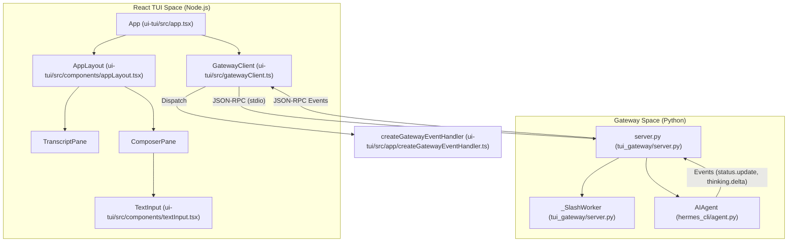
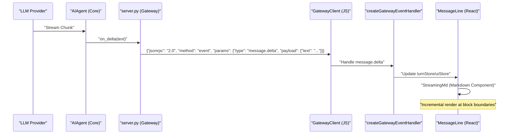

The Hermes Agent TUI is a high-fidelity terminal interface built using **React Ink**. It provides a rich, interactive experience that includes real-time streaming of assistant reasoning (Chain-of-Thought), live tool execution tracking, markdown rendering, and a robust command system. Unlike the default `prompt_toolkit` CLI, the TUI operates on a client-server model where a Node.js frontend communicates with a Python-based JSON-RPC gateway.

## Architecture and Data Flow

The TUI architecture separates the rendering logic from the agent's execution environment. This allows the UI to remain responsive even during heavy computation or long-running tool executions.

### Component Diagram: Frontend to Backend
This diagram illustrates the bridge between the React-based UI components and the Python gateway services.

**Sources:** [ui-tui/src/app.tsx:9-25](), [tui_gateway/server.py:183-211](), [ui-tui/src/app/createGatewayEventHandler.ts:57-141]()

### Communication Protocol
The TUI uses **JSON-RPC 2.0** over standard input/output. The Python gateway redirects standard `print()` calls to `stderr` to prevent protocol corruption, reserving `stdout` exclusively for JSON messages [tui_gateway/server.py:171-175]().

1.  **Requests:** The React frontend sends requests like `session.create` or `session.resume` via the `GatewayClient`.
2.  **Events:** The gateway pushes asynchronous events such as `message.delta` (for live text) and `tool.start` (for execution tracking) [ui-tui/src/app/createGatewayEventHandler.ts:73-74]().
3.  **Slash Commands:** Commands starting with `/` are handled by a dedicated `_SlashWorker` subprocess that maintains its own `HermesCLI` instance to avoid blocking the main dispatcher [tui_gateway/server.py:183-211]().
4.  **Async RPC Dispatch:** To prevent UI hangs, slow handlers (e.g., `session.resume`, `skills.manage`, `slash.exec`) are routed to a `ThreadPoolExecutor` so that inbound RPCs like `session.interrupt` or `approval.respond` can still be processed [tui_gateway/server.py:137-168]().

## Key Components

### 1. The Gateway Server (`tui_gateway/server.py`)
The server manages the lifecycle of agent sessions and acts as a bridge to the `AIAgent`.
- **`_SlashWorker`**: A persistent subprocess that executes CLI commands and returns structured output [tui_gateway/server.py:183-211]().
- **`write_json`**: A thread-safe utility (guarded by `_stdout_lock`) for serializing and sending protocol messages back to the React frontend [tui_gateway/server.py:124-124](), [tests/test_tui_gateway_server.py:35-54]().
- **Panic Logging**: Implements custom `sys.excepthook` and `threading.excepthook` to capture gateway crashes in `tui_gateway_crash.log`, as standard output is reserved for the JSON pipe [tui_gateway/server.py:37-107]().

### 2. The Composer and Input System
The TUI features a sophisticated input area supporting multi-line editing and history.
- **`TextInput`**: A high-performance React component handling terminal-specific input events, including bracketed paste detection, multi-click selection, and UTF-8 grapheme-aware cursor movement [ui-tui/src/components/textInput.tsx:241-265]().
- **`useMainApp`**: Orchestrates the main application state, including history management, terminal resizing, and mouse tracking integration [ui-tui/src/app/useMainApp.ts:73-100]().
- **Input Metrics**: Calculates stable columns and visual height for the composer to ensure the UI doesn't flicker during multi-line expansion [ui-tui/src/components/appLayout.tsx:170-178]().

### 3. Live Execution Tracking (`ToolTrail`)
One of the TUI's primary advantages is the visualization of the agent's internal monologue and tool usage.
- **`StreamingAssistant`**: Renders the current active turn, showing the "Thinking" spinner and live reasoning text [ui-tui/src/components/appLayout.tsx:140-147]().
- **`ToolTrail`**: Displays a tree of tool executions, including subagent delegation and result status [ui-tui/src/components/messageLine.tsx:67-83]().
- **`Spinner`**: Provides visual feedback using braille-based animations (e.g., `helix`, `breathe`, `cascade`) during LLM generation or tool execution [ui-tui/src/components/thinking.tsx:154-174]().
- **`LiveTodoPanel`**: Displays real-time task progress (Pending/In-Progress/Completed) directly beneath the user message that triggered them [ui-tui/src/components/appLayout.tsx:134-134]().

**Sources:** [ui-tui/src/components/thinking.tsx:1-174](), [ui-tui/src/components/appLayout.tsx:89-149]()

## Data Flow: Message Rendering

The following diagram traces how a message moves from the LLM through the system to be rendered as Markdown in the TUI.

**Sources:** [ui-tui/src/app/createGatewayEventHandler.ts:57-141](), [ui-tui/src/components/messageLine.tsx:141-150](), [ui-tui/src/app/turnController.ts:5-40]()

## TUI vs. Default CLI

| Feature | Default CLI (`prompt_toolkit`) | TUI (`--tui`) |
| :--- | :--- | :--- |
| **Rendering Engine** | Procedural ANSI | React-based Virtual DOM (`Ink`) |
| **Reasoning (CoT)** | Hidden or static block | Live streaming animation [ui-tui/src/components/thinking.tsx:154-174]() |
| **Tool Execution** | Sequential log lines | Interactive `ToolTrail` tree [ui-tui/src/components/messageLine.tsx:67-83]() |
| **Multi-line Input** | Basic | Full editor with grapheme support [ui-tui/src/components/textInput.tsx:40-117]() |
| **Architecture** | Single Python process | Node.js Client + Python Gateway [tui_gateway/server.py:171-175]() |
| **Mouse Support** | Limited | Native (Scrolling, Selection, Drag) [ui-tui/src/app/useMainApp.ts:147-188]() |

**Sources:** [ui-tui/src/app/useMainApp.ts:73-200](), [tui_gateway/server.py:137-178]()

## Implementation Details

### Virtual History and Scrolling
To maintain performance with long conversations, the TUI uses a virtualized history system.
- **`useVirtualHistory`**: Calculates which messages are currently in the viewport to avoid rendering thousands of Ink components simultaneously [ui-tui/src/app/useMainApp.ts:18-18]().
- **`ScrollBox`**: A component from `@hermes/ink` that manages the terminal viewport and provides handles for programmatic scrolling (e.g., `stickyScroll` to follow new messages) [ui-tui/src/components/appLayout.tsx:90-101]().
- **Selection and Clipboard**: On macOS, the TUI implements "copy-on-select" because Terminal.app often intercepts Cmd+C; the TUI writes to the system clipboard as soon as a drag operation completes [ui-tui/src/app/useMainApp.ts:151-188]().

### Markdown Rendering
The `Md` and `StreamingMd` components parse Markdown strings and map them to Ink components:
- **`StreamingMd`**: Optimizes rendering by splitting at the last stable block boundary so only the in-flight tail re-tokenizes [ui-tui/src/components/messageLine.tsx:142-146]().
- **ANSI Support**: Assistant messages can contain raw ANSI codes (e.g., from tool outputs), which are rendered via the `Ansi` component [ui-tui/src/components/messageLine.tsx:137-139]().
- **Diff Rendering**: Code patches are rendered as specialized `diff` blocks to separate them from surrounding prose [ui-tui/src/components/messageLine.tsx:169-172]().

**Sources:** [ui-tui/src/components/messageLine.tsx:28-176](), [ui-tui/src/app/useMainApp.ts:147-188](), [ui-tui/src/app/turnController.ts:5-40]()