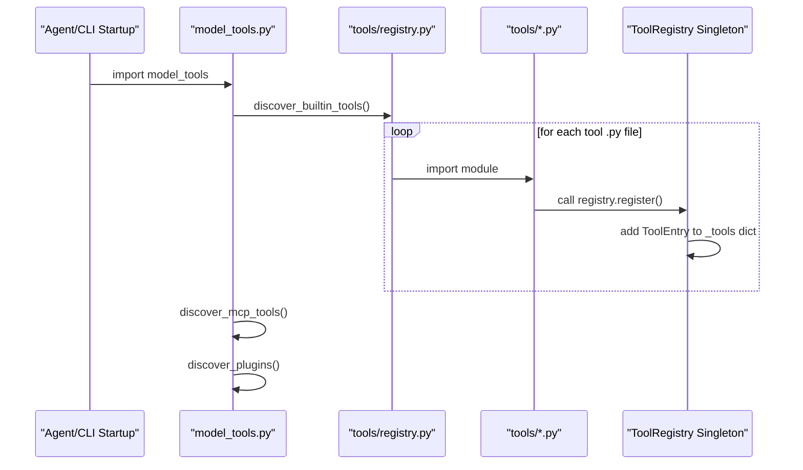
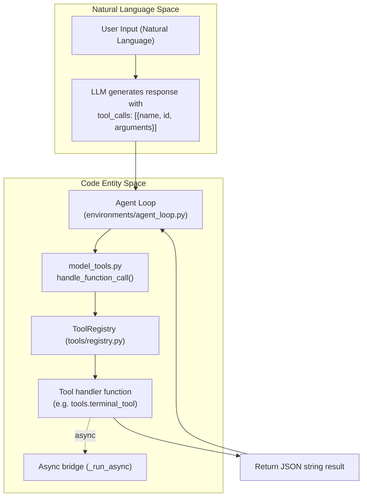

The tool system provides the Hermes Agent with its action capabilities through a structured function-calling architecture. This page introduces the high-level framework of the tool registry, how toolsets are composed and managed, and how tool discovery and execution flow through the system.

Specific technical details about individual tool categories and implementations are delegated to child pages, linked below. This parent page provides the architectural context and explains the integration among major components involved in the Hermes tool system.

## Architecture Overview

The Hermes Agent leverages a **centralized registry pattern** for tools, where each tool module self-registers its schema, handler, and a function to check availability, triggered at module import time.

- The **tool registry singleton** holds metadata and handlers, serving as the definitive source of available tools in the system [tools/registry.py:151-182]().
- The `model_tools.py` module orchestrates tool discovery by importing all tool modules, then exposes a unified API to retrieve tool schemas (for LLM function-calling) and dispatch tool invocations from the agent [model_tools.py:1-21]().
- Toolsets declared in `toolsets.py` group tools by use case or scenario. Toolsets may be composed from individual tools or by including other toolsets recursively, enabling flexible configuration [toolsets.py:78-224]().
- MCP (Model Context Protocol) servers provide dynamically registered external tools that are seamlessly integrated into the same registry to be invoked like built-in tools [tools/mcp_tool.py:3-75]().

This modular design supports both synchronous and asynchronous tools, with robust bridging between sync agent logic and async handlers to optimize external calls [model_tools.py:82-161]().

Sources: [model_tools.py:1-30](), [toolsets.py:1-24](), [tools/registry.py:1-110]()

---

## Tool Registration and Discovery

### Registration

Each tool registers itself by calling `registry.register()` at module load time. This registers metadata including:

- Tool name (string identifier)
- Toolset membership (categorical grouping)
- JSON schema for the tool parameters (OpenAI function calling style)
- Handler function (signature: takes args dict and optional kwargs, returns JSON string)
- Availability check function (returns boolean)
- Metadata like description, emoji icon, async status, and max result size

The registry wraps registered tools in `ToolEntry` objects, maintaining thread-safe snapshots of all tools and their availability checks [tools/registry.py:77-106]().

### Discovery Process

Tool discovery is primarily performed by `model_tools.py` invoking `discover_builtin_tools()` from `tools/registry.py`:

- The discovery imports all tool modules found in the `tools/` directory that contain registrations [tools/registry.py:57-74]().
- MCP tools are discovered separately by importing `tools.mcp_tool` and running dynamic discovery from config [tools/mcp_tool.py:61-69]().
- Additional user or pip-installed plugins are discovered and registered after the core built-in tools [hermes_cli/tools_config.py:109-132]().

Import errors during discovery are logged but do not cause the process to fail, ensuring robustness.

Sources: [model_tools.py:128-147](), [tools/registry.py:28-73](), [hermes_cli/tools_config.py:109-132]()

---

## Tool Structure

Each tool consists of the following elements:

### Schema

Tools specify their parameter interface using OpenAI Function Call schema. This includes:
- Tool name (must be unique)
- JSON Schema `parameters` describing accepted arguments
- Description used for documentation and prompts

### Handler Function

- Signature: `handler(args: dict, **kwargs) -> str`
- Returns a JSON string representing the tool's response.
- Optional kwargs include `task_id`, `user_task`, and `enabled_tools`.

Handlers may be synchronous or asynchronous. The system uses internal bridging via `_run_async` to await async handlers transparently [model_tools.py:82-103]().

### Availability Check

Tools can specify a `check_fn` returning a boolean indicating runtime availability. This allows conditional exposure for tools depending on API keys, environment dependencies (e.g., Docker, Playwright), or platform capabilities [tools/registry.py:126-141]().

For example, file-related tools rely on the terminal backend being available, enforced via `check_file_requirements()` [tools/__init__.py:18-22]().

Sources: [tools/registry.py:77-133](), [model_tools.py:11-20](), [tools/__init__.py:18-25]()

---

## Tool Dispatch Flow

### Invocation Sequence

At runtime, tool calls happen as follows:

- The agent sets `handle_function_call()` as the tool invocation entry point [model_tools.py:13]().
- This function uses `_run_async()` to execute either sync or async handlers correctly [model_tools.py:82-103]().
- The registry dispatches the call to the specific registered handler.
- The handler returns a JSON string, which propagates back to the agent.

Sources: [model_tools.py:11-20](), [model_tools.py:82-125](), [tools/registry.py:100-110]()

---

## Toolsets

Tools are grouped into logical **toolsets** in `toolsets.py` to simplify configuration and filtering. Toolsets may contain tools and/or compose other toolsets [toolsets.py:78-84]().

### Core Toolsets and Composition

| Toolset | Description | Tools Included |
| :------ | :---------- | :------------- |
| `web` | Web research and content extraction tools | `web_search`, `web_extract` |
| `terminal` | Command execution and process management tools | `terminal`, `process` |
| `file` | File manipulation tools | `read_file`, `write_file`, `patch`, `search_files` |
| `browser` | Browser automation for web interaction | `browser_navigate`, `browser_snapshot`, `browser_click`, etc. |
| `vision` | Image analysis and vision tools | `vision_analyze` |
| `code_execution` | Sandboxed Python execution | `execute_code` |
| `rl` | RL training tools for Tinker-Atropos | `rl_list_environments`, `rl_start_training`, etc. |
| `delegation` | Spawn and manage subagents | `delegate_task` |
| `skills` | Access, create, and manage skill documents | `skills_list`, `skill_view`, `skill_manage` |
| `computer_use` | Background macOS desktop control | `computer_use` |

Toolsets are used to aggregate tool schemas and availability status to present relevant functions to the LLM based on user configuration [toolsets.py:31-73]().

Sources: [toolsets.py:31-224]()

---

## Tool Categories and Configuration

Tools are grouped into **categories** for provider-aware configuration (API keys, etc.) and UI toggling in `hermes_cli/tools_config.py` [hermes_cli/tools_config.py:160-180]().

### MCP Tool Integration

Hermes agent supports external tools via the Model Context Protocol (MCP). MCP servers are configured under the `mcp_servers` key in `~/.hermes/config.yaml` [tools/mcp_tool.py:9-48](). These servers define tools which are dynamically discovered, converted to Hermes schema, and registered into the singleton registry [tools/mcp_tool.py:61-69]().

Sources: [hermes_cli/tools_config.py:49-71](), [tools/mcp_tool.py:1-75](), [tests/hermes_cli/test_tools_config.py:188-201]()

---

## Async Tool Support

The `model_tools.py` module implements a robust asynchronous bridge `_run_async(coro)` that ensures asynchronous tool handlers can be called safely from synchronous agent loops [model_tools.py:82-103]():

- Maintains a persistent event loop on the main thread for cached HTTP clients (`_get_tool_loop`) [model_tools.py:45-57]().
- For worker threads (e.g., `delegate_task`), stores thread-local persistent event loops (`_get_worker_loop`) [model_tools.py:60-79]().
- Detects if already running inside an async event loop and runs the async call in a dedicated thread to prevent loop conflicts [model_tools.py:109-161]().

Sources: [model_tools.py:36-125]()

---

## Related Child Pages

- [Tool Registry and Toolsets](#5.1) — Tool registration, discovery, and platform-specific configurations
- [Terminal and File Operations](#5.2) — Terminal and file read/write/patch operations
- [Process Management](#5.3) — Background process spawning and lifecycle
- [Security and Command Approval](#5.4) — Dangerous command detection and approval callbacks
- [Web, Browser, and Vision Tools](#5.5) — Web research, Playwright automation, and vision analysis
- [Code Execution and MCP Tools](#5.6) — Python sandbox and MCP server integration
- [Subagent Delegation](#5.7) — `delegate_task` and subagent spawning
- [Other Tools](#5.8) — Memory, image generation, session search, and skill management

---