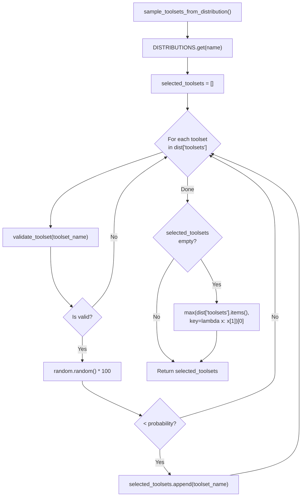
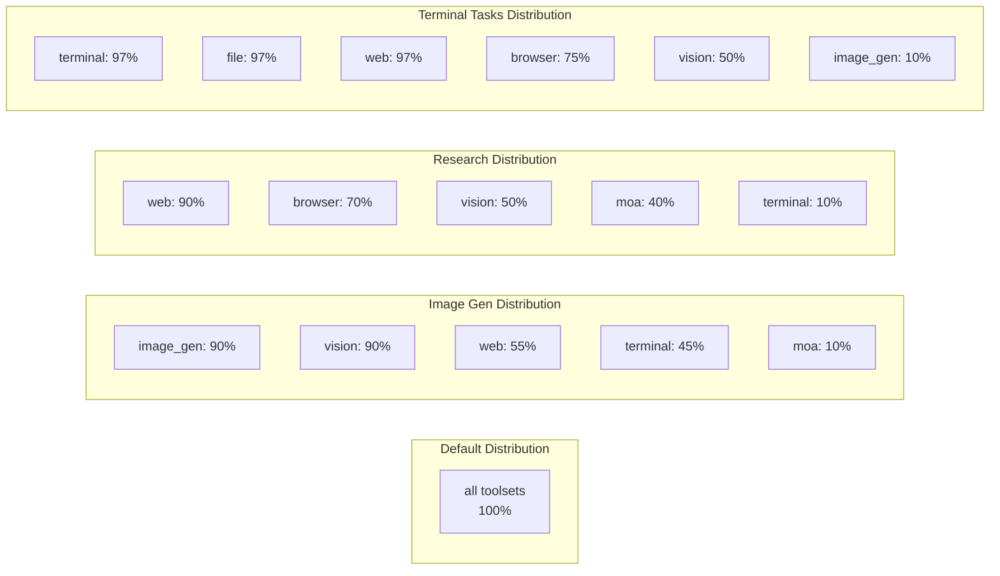
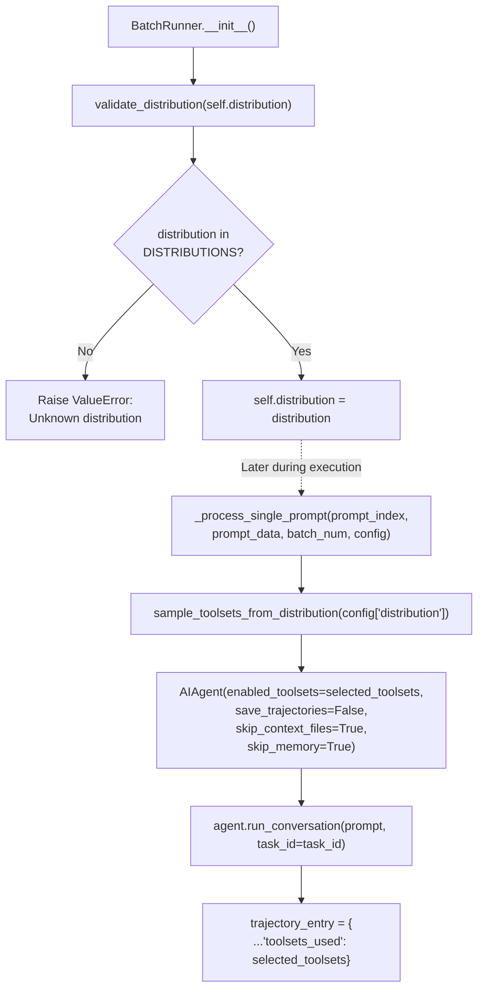

This document describes the toolset distribution system used for probabilistic tool sampling during batch evaluation runs. For information about the batch runner itself, see [Batch Runner](9.1). For details on trajectory format and data generation, see [Data Generation and Trajectories](9.3).

## Purpose and Overview

Toolset distributions enable controlled randomization of tool availability during batch processing. Each distribution defines which toolsets can be sampled and their probability of being selected for any given prompt. This allows the creation of diverse evaluation datasets with varying tool access patterns, simulating real-world scenarios where different tools may or may not be available.

Key characteristics:
- **Independent sampling**: Each toolset is sampled independently based on its probability percentage [toolset_distributions.py:5-7]().
- **Multiple concurrent toolsets**: A single prompt can have access to multiple toolsets simultaneously [toolset_distributions.py:31-41]().
- **Reproducible yet varied**: Different prompts in the same run get different toolset combinations, creating diverse trajectories [batch_runner.py:304-315]().

Sources: [toolset_distributions.py:1-25](), [batch_runner.py:304-315]()

## Distribution Format

A distribution is a dictionary with two fields:
- `description`: Human-readable explanation of the distribution's purpose [toolset_distributions.py:32]().
- `toolsets`: Dictionary mapping toolset names to probability percentages (0-100) [toolset_distributions.py:33-41]().

```python
{
    "description": "Heavy focus on image generation with vision and web support",
    "toolsets": {
        "image_gen": 90,  # 90% chance of inclusion
        "vision": 90,
        "web": 55,
        "terminal": 45,
        "moa": 10
    }
}
```

Probabilities represent independent chances of inclusion. For example, with the `image_gen` distribution:
- Each prompt has a 90% chance of getting `image_gen` tools [toolset_distributions.py:48]().
- Each prompt has a 90% chance of getting `vision` tools [toolset_distributions.py:49]().
- A single prompt could get all five toolsets, none, or any combination.

Sources: [toolset_distributions.py:26-54]()

## Sampling Mechanism

The `sample_toolsets_from_distribution()` function performs independent Bernoulli trials for each toolset defined in the distribution.

### Toolset Sampling Logic


**Fallback guarantee**: If no toolsets are sampled (unlikely with reasonable probabilities), the system automatically selects the toolset with the highest probability to ensure at least one toolset is available [toolset_distributions.py:279-284]().

Sources: [toolset_distributions.py:247-288]()

## Predefined Distributions

The system includes numerous predefined distributions covering common evaluation scenarios [toolset_distributions.py:29-220]():

### General Purpose Distributions

| Distribution | Description | Key Toolsets |
|-------------|-------------|--------------|
| `default` | All tools, all the time | All at 100% [toolset_distributions.py:31-41]() |
| `balanced` | Equal probability for all | All at 50% [toolset_distributions.py:107-118]() |
| `minimal` | Web research only | web: 100% [toolset_distributions.py:121-126]() |

### Task-Focused Distributions

| Distribution | Description | Primary Use Case | Key Probabilities |
|-------------|-------------|------------------|-------------------|
| `image_gen` | Image generation focus | Visual content creation | image_gen: 90%, vision: 90% [toolset_distributions.py:45-54]() |
| `research` | Web research + analysis | Information gathering | web: 90%, browser: 70% [toolset_distributions.py:57-66]() |
| `science` | Scientific computing | Research workflows | web: 94%, terminal: 94%, file: 94% [toolset_distributions.py:69-80]() |
| `development` | Coding tasks | Software development | terminal: 80%, file: 80% [toolset_distributions.py:83-92]() |
| `creative` | Visual arts | Image generation/analysis | image_gen: 90%, vision: 90% [toolset_distributions.py:148-155]() |
| `reasoning` | Complex problem solving | Multi-model reasoning | moa: 90% [toolset_distributions.py:158-165]() |

### Browser and Specialized Distributions

| Distribution | Description | Browser Availability | Notes |
|-------------|-------------|---------------------|-------|
| `browser_use` | Full browser interaction | 100% | Includes web: 80%, vision: 70% [toolset_distributions.py:168-175]() |
| `browser_only` | Pure browser automation | 100% | No other tools [toolset_distributions.py:178-183]() |
| `browser_tasks` | Browser-focused evaluation | 97% | For browser-use-tasks.jsonl [toolset_distributions.py:186-193]() |
| `terminal_tasks` | Terminal evaluation | 97% | For nous-terminal-tasks.jsonl [toolset_distributions.py:196-205]() |
| `mixed_tasks` | Multi-capability evaluation | High browser/terminal | 92% each for primary tools [toolset_distributions.py:208-220]() |

Sources: [toolset_distributions.py:29-220]()

### Distribution Probabilities Visualization


Sources: [toolset_distributions.py:31-220]()

## Integration with Batch Processing

Toolset distributions integrate with the `BatchRunner` at initialization and during the parallel execution loop.

### Batch Runner Distribution Flow


### Initialization Validation

When creating a `BatchRunner`, the distribution name is validated against the registry [batch_runner.py:586-587]():

```python
if not validate_distribution(distribution):
    raise ValueError(f"Unknown distribution: {distribution}. Available: {list(list_distributions().keys())}")
```

### Per-Prompt Sampling

Each worker process gets a fresh sample from the distribution inside `_process_single_prompt()` [batch_runner.py:304-305]():

```python
selected_toolsets = sample_toolsets_from_distribution(config["distribution"])

agent = AIAgent(
    model=config["model"],
    enabled_toolsets=selected_toolsets,  # Sampled toolsets
    # ...
)
```

The sampled toolsets are stored in the final trajectory metadata for downstream analysis [batch_runner.py:349]().

### Command-Line Usage

Specify a distribution when invoking the batch runner [batch_runner.py:19-20]():

```bash