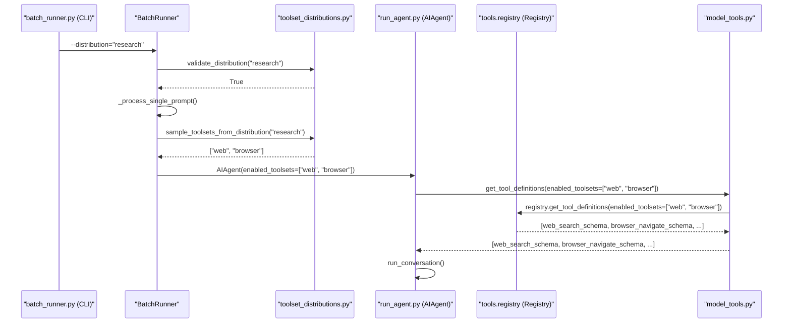
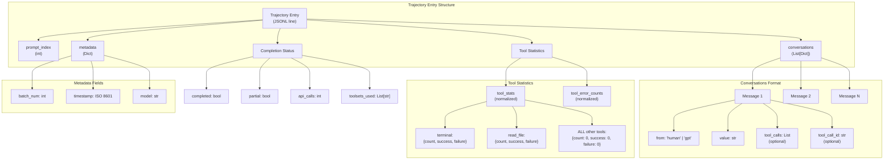
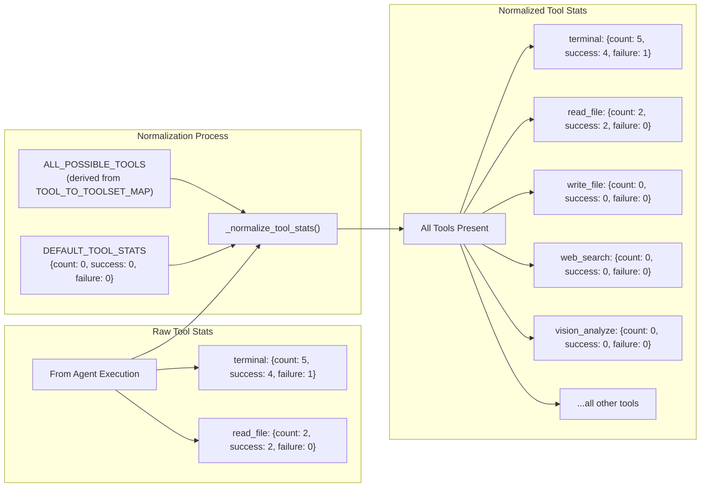
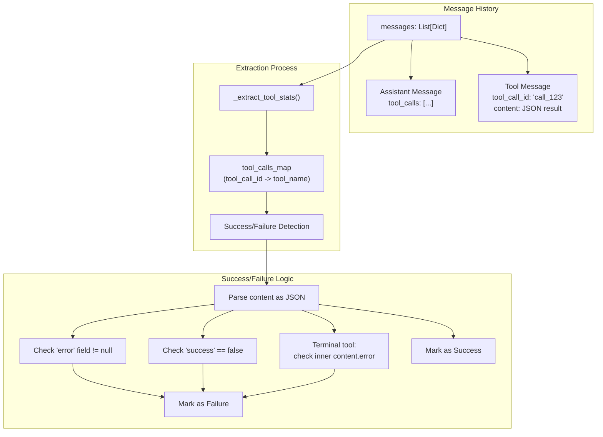
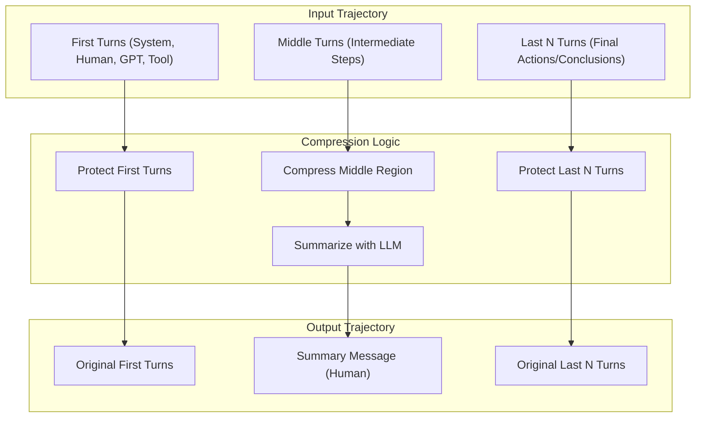

python batch_runner.py --dataset_file=data.jsonl --distribution=image_gen
```

Sources: [batch_runner.py:19-20](), [batch_runner.py:304-358](), [batch_runner.py:586-587]()

## API Reference

### Core Functions

#### `get_distribution(name: str) -> Optional[Dict[str, any]]`
Retrieve a distribution definition by name [toolset_distributions.py:223-234]().

#### `list_distributions() -> Dict[str, Dict]`
Get all available distributions [toolset_distributions.py:237-244]().

#### `sample_toolsets_from_distribution(distribution_name: str) -> List[str]`
Sample toolsets based on a distribution's probabilities [toolset_distributions.py:247-288]().
- Each toolset is sampled independently.
- Random roll for each toolset: `random.random() * 100 < probability`.
- If no toolsets selected, picks the highest probability one as fallback [toolset_distributions.py:279-284]().

#### `validate_distribution(distribution_name: str) -> bool`
Check if a distribution name is valid [toolset_distributions.py:291-301]().

Sources: [toolset_distributions.py:223-301]()

## Toolset Configuration for Batch Runs

The `BatchRunner` uses the sampled toolsets to instantiate the `AIAgent`. This determines which tool backends are initialized. Each toolset maps to specific tool names defined in `toolsets.py` [toolsets.py:68-203]() and discovered in `model_tools.py` [model_tools.py:132-161]().

### Natural Language to Code Entity Space: Toolset Resolution

This diagram bridges the conceptual "toolsets" requested in distributions to the actual Python modules and functions that implement them.

```mermaid
graph TD
    subgraph "Natural_Language_Space"
        D["Distribution: 'image_gen'"]
        T_REQ["Toolset: 'image_gen'"]
    end

    subgraph "Code_Entity_Space"
        TS_DEF["toolsets.py: TOOLSETS['image_gen']"]
        REG["tools.registry: registry"]
        M_TOOLS["model_tools.py: discover_builtin_tools()"]
        
        subgraph "Tool_Modules"
            MOD_IMG["tools/image_generation_tool.py"]
            MOD_WEB["tools/web_tools.py"]
            MOD_TERM["tools/terminal_tool.py"]
            MOD_FILE["tools/file_operations.py"]
            MOD_VISION["tools/vision_tools.py"]
            MOD_BROWSER["tools/browser_tool.py"]
            MOD_MOA["tools/mixture_of_agents_tool.py"]
        end
        
        FUNC_IMG["image_generate()"]
        FUNC_WEB_SEARCH["web_search()"]
        FUNC_WEB_EXTRACT["web_extract()"]
        FUNC_TERM["terminal()"]
        FUNC_FILE_READ["read_file()"]
        FUNC_FILE_WRITE["write_file()"]
        FUNC_VISION_ANALYZE["vision_analyze()"]
        FUNC_BROWSER_NAVIGATE["browser_navigate()"]
        FUNC_MOA["mixture_of_agents()"]
    end

    D -->|references| T_REQ
    T_REQ -->|resolved_by| TS_DEF
    TS_DEF -->|lists_tools| FUNC_IMG
    TS_DEF -->|lists_tools| FUNC_WEB_SEARCH
    TS_DEF -->|lists_tools| FUNC_WEB_EXTRACT
    TS_DEF -->|lists_tools| FUNC_TERM
    TS_DEF -->|lists_tools| FUNC_FILE_READ
    TS_DEF -->|lists_tools| FUNC_FILE_WRITE
    TS_DEF -->|lists_tools| FUNC_VISION_ANALYZE
    TS_DEF -->|lists_tools| FUNC_BROWSER_NAVIGATE
    TS_DEF -->|lists_tools| FUNC_MOA

    M_TOOLS -->|imports| MOD_IMG
    M_TOOLS -->|imports| MOD_WEB
    M_TOOLS -->|imports| MOD_TERM
    M_TOOLS -->|imports| MOD_FILE
    M_TOOLS -->|imports| MOD_VISION
    M_TOOLS -->|imports| MOD_BROWSER
    M_TOOLS -->|imports| MOD_MOA

    MOD_IMG -->|registers| FUNC_IMG
    MOD_WEB -->|registers| FUNC_WEB_SEARCH
    MOD_WEB -->|registers| FUNC_WEB_EXTRACT
    MOD_TERM -->|registers| FUNC_TERM
    MOD_FILE -->|registers| FUNC_FILE_READ
    MOD_FILE -->|registers| FUNC_FILE_WRITE
    MOD_VISION -->|registers| FUNC_VISION_ANALYZE
    MOD_BROWSER -->|registers| FUNC_BROWSER_NAVIGATE
    MOD_MOA -->|registers| FUNC_MOA

    FUNC_IMG -->|stored_in| REG
    FUNC_WEB_SEARCH -->|stored_in| REG
    FUNC_WEB_EXTRACT -->|stored_in| REG
    FUNC_TERM -->|stored_in| REG
    FUNC_FILE_READ -->|stored_in| REG
    FUNC_FILE_WRITE -->|stored_in| REG
    FUNC_VISION_ANALYZE -->|stored_in| REG
    FUNC_BROWSER_NAVIGATE -->|stored_in| REG
    FUNC_MOA -->|stored_in| REG
```



Sources: [toolsets.py:68-203](), [model_tools.py:30-32](), [toolset_distributions.py:26-54](), [tools/__init__.py:1-15](), [tools/browser_tool.py:1-50](), [tools/file_operations.py:1-26](), [tools/web_tools.py:1-41](), [tools/vision_tools.py:1-17]()

### Tool Distribution Data Flow

This diagram traces how a distribution string in the CLI becomes a set of active tools in the `AIAgent`.



Sources: [batch_runner.py:304-358](), [toolset_distributions.py:247-288](), [model_tools.py:12-21]()

## Validation and Safety

The validation system ensures distributions reference valid toolsets and prevents runtime errors:

1. **Distribution existence**: `validate_distribution()` checks if the name exists in `DISTRIBUTIONS` [toolset_distributions.py:291-301]().
2. **Toolset validity**: `validate_toolset()` from the `toolsets` module verifies each toolset name [toolset_distributions.py:24]().
3. **Graceful degradation**: Invalid toolsets are skipped with a warning rather than failing the entire run [toolset_distributions.py:266-268]().

Sources: [toolset_distributions.py:247-301](), [batch_runner.py:586-587]()

# Data Generation and Trajectories


## Purpose and Scope

This page documents the trajectory data format generated by the batch processing system for training and evaluation purposes. Trajectories capture the complete conversation history between the user and the agent, including all tool calls, tool responses, and reasoning content. The format is designed for compatibility with HuggingFace datasets and includes normalized tool usage statistics for consistent schema across all entries.

For information about the batch processing pipeline that generates these trajectories, see [Batch Runner](9.1). For information about how tools are sampled for each prompt, see [Toolset Distributions](9.2).

---

## Trajectory Format Overview

Each trajectory entry represents a complete conversation between the user and the agent, stored in a standardized format compatible with training frameworks and HuggingFace datasets.

Title: Trajectory Structure and Data Flow


The trajectory format uses the `from`/`value` message structure for training compatibility:

-   **`from`**: Either `"human"` (user message) or `"gpt"` (assistant message) [batch_runner.py:461-462]().
-   **`value`**: The message content (string) [batch_runner.py:461-462]().
-   **`tool_calls`**: Present on assistant messages when the model invokes tools [batch_runner.py:142-143]().
-   **`tool_call_id`**: Present on tool response messages to link back to the tool call [batch_runner.py:150-151]().

This structure is created by `AIAgent._convert_to_trajectory_format()` and differs from the OpenAI message format used during agent execution (`role` instead of `from`, `content` instead of `value`).

Sources: [batch_runner.py:457-467](), [batch_runner.py:114-191]()

---

## Tool Statistics Normalization

All trajectory entries include normalized tool statistics with a **consistent schema** across all possible tools. This is required for HuggingFace datasets to load the JSONL files without schema mismatch errors when creating Arrow/Parquet tables.

Title: Normalization of Tool Entities


### Tool Statistics Schema

The `ALL_POSSIBLE_TOOLS` set is automatically derived from `TOOL_TO_TOOLSET_MAP` in `model_tools.py`, ensuring it stays in sync when new tools are added:

[batch_runner.py:61-66]()
```python
# All possible tools - auto-derived from the master mapping in model_tools.py.
# This stays in sync automatically when new tools are added to TOOL_TO_TOOLSET_MAP.
# Used for consistent schema in Arrow/Parquet (HuggingFace datasets) and for
# filtering corrupted entries during trajectory combination.
ALL_POSSIBLE_TOOLS = set(TOOL_TO_TOOLSET_MAP.keys())

# Default stats for tools that weren't used
DEFAULT_TOOL_STATS = {'count': 0, 'success': 0, 'failure': 0}
```

The `_normalize_tool_stats()` function ensures every trajectory entry includes statistics for **all** possible tools, even if they weren't used (zeros). This guarantees schema consistency required by Arrow/Parquet.

Sources: [batch_runner.py:70-98](), [batch_runner.py:101-122](), [model_tools.py:14-18]()

---

## Tool Statistics Extraction

Tool usage statistics are extracted from the message history by analyzing assistant messages (tool calls) and tool messages (tool responses) in `_extract_tool_stats`.

Title: Logic Flow for Statistics Extraction


### Success/Failure Detection

The extraction logic carefully determines whether each tool call succeeded or failed:

1.  **Parse JSON response**: Try to parse the tool response content as JSON [batch_runner.py:168-168]().
2.  **Check error field**: If `error` field exists AND has a non-null value → failure [batch_runner.py:172-173]().
3.  **Terminal tool special handling**: Terminal wraps responses in a `content` field; check inner `content.error` [batch_runner.py:177-182]().
4.  **Non-zero exit codes**: These are not considered failures, as the model can self-correct [batch_runner.py:180-180]().
5.  **`success: false` pattern**: Explicitly marks failure for some tools [batch_runner.py:184-185]().

Sources: [batch_runner.py:125-202]()

---

## Trajectory Compression

Post-processing of completed agent trajectories is handled by the `TrajectoryCompressor` class [trajectory_compressor.py:16-17](). This system compresses trajectories to fit within a target token budget while preserving training signal quality.

Title: Trajectory Compression Strategy


### Compression Strategy
The `TrajectoryCompressor` uses the following rules defined in `CompressionConfig` [trajectory_compressor.py:83-124]():
1.  **Protect first turns**: Keeps system, human, first GPT response, and first tool response [trajectory_compressor.py:9-11]().
2.  **Protect last N turns**: Keeps final actions and conclusions (default `protect_last_n_turns: 4`) [trajectory_compressor.py:98]().
3.  **Compress MIDDLE turns**: Only intermediate turns starting from the 2nd tool response are eligible for compression [trajectory_compressor.py:11]().
4.  **LLM Summarization**: Replaces the compressed region with a single human summary message generated by a model like `google/gemini-3-flash-preview` [trajectory_compressor.py:101]().

The `_effective_temperature_for_model` function [trajectory_compressor.py:59-79]() is used to determine the appropriate temperature setting for the summarization model, handling cases where the model manages temperature server-side (e.g., Kimi) by omitting the `temperature` parameter [trajectory_compressor.py:75-76]().

Sources: [trajectory_compressor.py:1-112](), [trajectory_compressor.py:121-160](), [trajectory_compressor.py:59-79]()

---

## Reasoning Extraction and Metrics

Trajectories capture reasoning content from models that support it. The system handles multiple provider formats for reasoning content through `_extract_reasoning_from_message`.

### Reasoning Metrics
The system tracks reasoning coverage per trajectory in `_extract_reasoning_stats` [batch_runner.py:205-239]():
-   **`total_assistant_turns`**: Total turns by the model [batch_runner.py:229]().
-   **`turns_with_reasoning`**: Number of turns where reasoning was successfully extracted [batch_runner.py:230]().
-   **`has_any_reasoning`**: Boolean flag indicating if any turn in the trajectory contained reasoning [batch_runner.py:232]().

Sources: [batch_runner.py:205-239]()

---

## Trajectory Entry Schema

Each trajectory entry saved to JSONL has the following complete schema:

| Field | Type | Description |
|-------|------|-------------|
| `prompt_index` | `int` | Index of the prompt in the original dataset |
| `conversations` | `List[Dict]` | Message history in `from`/`value` format |
| `metadata` | `Dict` | Batch number, timestamp, model name, and toolsets used |
| `completed` | `bool` | True if agent finished naturally |
| `api_calls` | `int` | Number of LLM API calls made |
| `tool_stats` | `Dict[str, Dict]` | **Normalized** full statistics: `{tool: {count, success, failure}}` |
| `tool_error_counts` | `Dict[str, int]` | **Normalized** simple error counts: `{tool: failure_count}` |
| `reasoning_stats` | `Dict` | Reasoning coverage: `{total_assistant_turns, turns_with_reasoning, ...}` |

Sources: [batch_runner.py:457-467](), [batch_runner.py:70-122]()

---

## File Format and Storage

Trajectories are stored in JSONL (JSON Lines) format. The batch runner supports resuming interrupted runs by scanning existing batch files for completed prompts via `_scan_completed_prompts_by_content`.

### Content-Based Resume
The resume system is content-based rather than index-based, allowing recovery even if dataset indices change:
1.  `_scan_completed_prompts_by_content` scans all `batch_*.jsonl` files [batch_runner.py:722-726]().
2.  Extracts the human prompt text from each trajectory's conversations [batch_runner.py:752-755]().
3.  Dataset is filtered to exclude already-completed prompts [batch_runner.py:791-796]().

Sources: [batch_runner.py:722-798]()

---

## Summary

The trajectory system ensures data quality for training through:
-   **Standardized message format**: `from`/`value` pairs [batch_runner.py:461-462]().
-   **Normalized tool statistics**: Ensures schema consistency for Arrow/Parquet [batch_runner.py:70-122]().
-   **Trajectory Compression**: Intelligent budget management via `TrajectoryCompressor` [trajectory_compressor.py:1-91]().
-   **Reasoning extraction**: Multi-provider support for reasoning content [batch_runner.py:205-239]().
-   **Resume support**: Content-based matching for fault tolerance [batch_runner.py:722-798]().

Sources: [batch_runner.py:1-88](), [trajectory_compressor.py:1-43]()