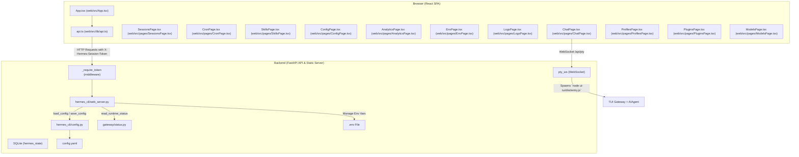

The Hermes Web UI Dashboard provides a comprehensive browser-based interface for managing a Hermes Agent installation. It offers an accessible way to configure the agent, manage API keys and environment variables, oversee active sessions and cron jobs, browse skills and toolsets, and inspect analytics and logs. The dashboard is implemented as a Single Page Application (SPA) using React and Vite, backed by a FastAPI server integrated into the Hermes CLI.

---

## Architecture and Data Flow

The dashboard utilizes a client-server model:

- The **frontend SPA** runs in the user’s browser, providing rich interactive views for agent management.
- The **backend server** is a FastAPI application, implemented in `hermes_cli/web_server.py` [hermes_cli/web_server.py:4](), which exposes RESTful API endpoints and serves the frontend assets.
- The backend interfaces with Hermes’s local data stores such as `config.yaml`, `.env` files, and SQLite databases (e.g., for sessions).
- API requests from the SPA are authenticated via a session token to protect sensitive configuration and secrets.

### Dashboard Component to Code Mapping

This diagram maps UI views and components in the React application to backend services and local data sources:

**Sources:**  
[hermes_cli/web_server.py:67-135](), [web/src/lib/api.ts:21-46](), [web/src/App.tsx:99-154](), [web/src/pages/SessionsPage.tsx:1-50](), [web/src/pages/CronPage.tsx:1-38](), [web/src/pages/SkillsPage.tsx:1-32](), [web/src/pages/AnalyticsPage.tsx:1-27](), [hermes_cli/web_server.py:35-50](), [web/src/pages/ChatPage.tsx:1-17](), [hermes_cli/web_server.py:300-301](), [web/src/pages/ProfilesPage.tsx:1-30](), [web/src/pages/PluginsPage.tsx:1-30](), [web/src/pages/ModelsPage.tsx:1-30]()

---

## FastAPI Backend (`hermes_cli/web_server.py`)

The web server is the core backend component powering the dashboard. It provides both the REST API and the static file server for the React SPA assets.

### Server Initialization and Security

- The FastAPI instance is created in `hermes_cli/web_server.py` (`app = FastAPI(...)`) [hermes_cli/web_server.py:67]().
- On every server start, an ephemeral session token (`_SESSION_TOKEN`) is generated via `secrets.token_urlsafe(32)`. This token is injected into the served HTML and must accompany all sensitive API calls in the `X-Hermes-Session-Token` header or as a Bearer token in `Authorization` header [hermes_cli/web_server.py:74-75, 113-131]().
- CORS middleware restricts allowed origins to `localhost`/`127.0.0.1` only, preventing attacks from malicious remote sites [hermes_cli/web_server.py:90-95]().
- A host header validation middleware (`host_header_middleware`) defends against DNS rebinding attacks by allowing requests only if the `Host` header matches the bound interface or loopback aliases [hermes_cli/web_server.py:150-192, 194-207]().

### Key API Endpoint Groups

The FastAPI app offers endpoints grouped by their functional domain:

| Domain             | Endpoints & Description                                                                     | Source Reference |
| ------------------ | ------------------------------------------------------------------------------------------- | ---------------- |
| **Status**         | `/api/status` returns version, `hermes_home`, and `gateway_platforms` status                | [hermes_cli/web_server.py:103]() |
| **Configuration**  | `/api/config` (GET, PUT), `/api/config/defaults`, `/api/config/schema`, `/api/config/raw`   | [web/src/lib/api.ts:68-92]() |
| **Environment**    | `/api/env` (GET, PUT, DELETE), `/api/env/reveal` (protected secret reveal)                  | [web/src/lib/api.ts:93-116]() |
| **Sessions**       | `/api/sessions` (GET, DELETE), `/api/sessions/{id}/messages`                                | [web/src/lib/api.ts:48-55]() |
| **Cron Jobs**      | `/api/cron/jobs` (GET, POST), `/api/cron/jobs/{id}/pause`, `/resume`, `/trigger`, `/delete` | [web/src/lib/api.ts:119-133]() |
| **Skills**         | `/api/skills` (GET), `/api/skills/toggle` (PUT)                                            | [web/src/lib/api.ts:177-180]() |
| **Analytics**      | `/api/analytics/usage`, `/api/analytics/models`                                            | [web/src/lib/api.ts:64-67]() |
| **Models**         | `/api/model/info`, `/api/model/options`, `/api/model/auxiliary`, `/api/model/set`         | [web/src/lib/api.ts:93-101]() |
| **Profiles**       | `/api/profiles` (GET, POST), `/api/profiles/{name}` (PATCH, DELETE)                       | [web/src/lib/api.ts:158-176]() |
| **Plugins**        | `/api/plugins` (GET), `/api/plugins/install`, `/api/plugins/uninstall`, `/api/plugins/toggle` | [web/src/lib/api.ts:182-190]() |
| **PTY (Chat)**     | `/api/pty` (WebSocket for embedded TUI)                                                     | [hermes_cli/web_server.py:300-301]() |

**Sources:**
[hermes_cli/web_server.py:103](), [web/src/lib/api.ts:68-92](), [web/src/lib/api.ts:93-116](), [web/src/lib/api.ts:48-55](), [web/src/lib/api.ts:119-133](), [web/src/lib/api.ts:177-180](), [web/src/lib/api.ts:64-67](), [web/src/lib/api.ts:93-101](), [web/src/lib/api.ts:158-176](), [web/src/lib/api.ts:182-190](), [hermes_cli/web_server.py:300-301]()

---

### Authentication and Rate Limiting

- **Session Token**: Gated by `_require_token(request)`, which checks for the ephemeral `_SESSION_TOKEN` [hermes_cli/web_server.py:133-135](). Public endpoints like `/api/status` are excluded via `_PUBLIC_API_PATHS` [hermes_cli/web_server.py:102-110]().
- **Secret Reveal Rate Limiting**: The reveal endpoint (used to see API keys) is limited by `_REVEAL_MAX_PER_WINDOW` (5) within `_REVEAL_WINDOW_SECONDS` (30) [hermes_cli/web_server.py:81-84]().
- **Redaction**: Keys are redacted in standard listings using `redact_key`, which shows only the prefix/suffix of long keys [hermes_cli/web_server.py:48-49](), [tests/hermes_cli/test_web_server.py:81-93]().

**Sources:**
[hermes_cli/web_server.py:133-135](), [hermes_cli/web_server.py:102-110](), [hermes_cli/web_server.py:81-84](), [hermes_cli/web_server.py:48-49](), [tests/hermes_cli/test_web_server.py:81-93]()

---

## Frontend React Dashboard

The frontend React project is located in the `web/` directory. It uses Vite as the build tool and Lucide React icons for UI symbology.

### Core UI Structure (`web/src/App.tsx`)

- The `App` component sets up the main SPA layout, the sidebar navigation, and client-side routing via `react-router-dom` [web/src/App.tsx:10-16]().
- **Persistent Chat**: If `isDashboardEmbeddedChatEnabled()` is true, the Chat page is rendered outside the standard `<Routes>` block to maintain the PTY/WebSocket connection during navigation [web/src/App.tsx:77, 114-120](). This allows the terminal to remain active even when navigating to other dashboard pages.
- **Internationalization**: Supports multiple languages (English `en`, Chinese `zh`) via `useI18n` and the `Translations` interface [web/src/i18n/en.ts](), [web/src/i18n/zh.ts](), [web/src/i18n/types.ts]().
- **Plugin Integration**: The `buildNavItems` and `partitionSidebarNav` functions dynamically integrate navigation items from loaded plugins, allowing plugins to extend the dashboard's sidebar [web/src/App.tsx:193-241]().

**Sources:**
[web/src/App.tsx:10-16](), [web/src/App.tsx:77, 114-120](), [web/src/i18n/en.ts](), [web/src/i18n/zh.ts](), [web/src/i18n/types.ts](), [web/src/App.tsx:193-241]()

### Key Pages and Functionality

- **AnalyticsPage**: Visualizes token usage (input/output) using `TokenBarChart` and provides daily breakdowns of API calls and top skills [web/src/pages/AnalyticsPage.tsx:131-222](). It uses `useTableSort` for interactive sorting of data [web/src/pages/AnalyticsPage.tsx:56-90]().
- **SessionsPage**: Features full-text search (FTS5) with match highlighting via `SnippetHighlight` [web/src/pages/SessionsPage.tsx:65-90](). It renders conversation history with `MessageBubble` components that handle Markdown and Tool Call blocks [web/src/pages/SessionsPage.tsx:134-221](). Sessions can be resumed in the embedded chat via the "Resume in Chat" button [web/src/pages/SessionsPage.tsx:142]().
- **ConfigPage**: Allows editing of the agent's configuration through a categorized form or raw YAML [web/src/pages/ConfigPage.tsx:104-125](). Icons for categories are mapped in `CATEGORY_ICONS` [web/src/pages/ConfigPage.tsx:59-87]().
- **EnvPage**: Manages environment variables, including the ability to reveal sensitive API keys (subject to rate limiting) [web/src/pages/EnvPage.tsx:1-30]().
- **CronPage**: Provides an interface to create, pause, resume, trigger, and delete scheduled cron jobs for the agent [web/src/pages/CronPage.tsx:35-46]().
- **SkillsPage**: Displays available skills and allows toggling their enabled/disabled state [web/src/pages/SkillsPage.tsx:33]().
- **ModelsPage**: Displays information about configured models and allows setting model assignments [web/src/pages/ModelsPage.tsx:1-30]().
- **ProfilesPage**: Manages agent profiles, including creating, renaming, and editing SOUL.md files [web/src/pages/ProfilesPage.tsx:1-30]().
- **PluginsPage**: Allows discovery, installation, and management of dashboard and agent plugins [web/src/pages/PluginsPage.tsx:1-30]().
- **ChatPage**: Embeds the `hermes --tui` experience directly into the dashboard using `xterm.js` and a WebSocket connection to the backend's PTY endpoint [web/src/pages/ChatPage.tsx:106](). This allows for a fully interactive terminal experience within the browser.

**Sources:**
[web/src/pages/AnalyticsPage.tsx:131-222](), [web/src/pages/AnalyticsPage.tsx:56-90](), [web/src/pages/SessionsPage.tsx:65-90](), [web/src/pages/SessionsPage.tsx:134-221](), [web/src/pages/SessionsPage.tsx:142](), [web/src/pages/ConfigPage.tsx:104-125](), [web/src/pages/ConfigPage.tsx:59-87](), [web/src/pages/EnvPage.tsx:1-30](), [web/src/pages/CronPage.tsx:35-46](), [web/src/pages/SkillsPage.tsx:33](), [web/src/pages/ModelsPage.tsx:1-30](), [web/src/pages/ProfilesPage.tsx:1-30](), [web/src/pages/PluginsPage.tsx:1-30](), [web/src/pages/ChatPage.tsx:106]()

---

## Summary Diagram: Natural Language (Dashboard UI) ⇄ Code Entity Flow

```mermaid
flowchart TB
  subgraph Dashboard[Dashboard - Browser UI]
    direction TB
    UI_App["App.tsx: Layout & Nav"]
    UI_Session["SessionsPage.tsx: Session Browser"]
    UI_Config["ConfigPage.tsx: Config Editor"]
    UI_Env["EnvPage.tsx: API Key Manager"]
    UI_Cron["CronPage.tsx: Cron Job Scheduler"]
    UI_Analytics["AnalyticsPage.tsx: Usage Analytics"]
    UI_Chat["ChatPage.tsx: Embedded TUI"]
    UI_Profiles["ProfilesPage.tsx: Profile Manager"]
    UI_Plugins["PluginsPage.tsx: Plugin Manager"]
    UI_Models["ModelsPage.tsx: Model Assignment"]
  end

  subgraph Backend[Backend - FastAPI hermes_cli/web_server.py]
    API_Server["FastAPI(app)"]
    Auth_MW["_require_token()"]
    Config_API["/api/config (GET, PUT)"]
    Env_API["/api/env (GET, PUT, DELETE)"]
    Env_Reveal_API["/api/env/reveal (Rate Limited)"]
    Cron_API["/api/cron/jobs (CRUD)"]
    Analytics_API["/api/analytics (GET)"]
    Session_API["/api/sessions (GET, DELETE)"]
    Profiles_API["/api/profiles (CRUD)"]
    Plugins_API["/api/plugins (CRUD)"]
    Models_API["/api/model (GET, POST)"]
    PTY_WS_Endpoint["/api/pty (WebSocket)"]
  end

  subgraph DataLayer[Data Layer]
    ConfigYAML["config.yaml (load_config, save_config)"]
    EnvFile[".env (load_env, save_env_value)"]
    SQLiteDB["state.db (hermes_state)"]
    TUI_Process["`node ui-tui/dist/entry.js`"]
    ProfileFiles["profiles/ (SOUL.md, config.yaml)"]
    PluginDirs["plugins/ (plugin.yaml, scripts)"]
  end

  UI_App -- "HTTP Requests" --> API_Server
  API_Server -- "Auth Middleware" --> Auth_MW

  UI_Session -- "GET /api/sessions" --> Session_API
  Session_API -- "Read/Write" --> SQLiteDB

  UI_Config -- "GET /api/config" --> Config_API
  UI_Config -- "PUT /api/config" --> Config_API
  Config_API -- "Read/Write" --> ConfigYAML

  UI_Env -- "GET /api/env" --> Env_API
  UI_Env -- "PUT /api/env" --> Env_API
  UI_Env -- "DELETE /api/env" --> Env_API
  UI_Env -- "POST /api/env/reveal" --> Env_Reveal_API
  Env_API -- "Read/Write" --> EnvFile
  Env_Reveal_API -- "Read" --> EnvFile

  UI_Cron -- "CRUD /api/cron/jobs" --> Cron_API
  Cron_API -- "Read/Write" --> SQLiteDB

  UI_Analytics -- "GET /api/analytics" --> Analytics_API
  Analytics_API -- "Read" --> SQLiteDB

  UI_Profiles -- "CRUD /api/profiles" --> Profiles_API
  Profiles_API -- "Read/Write" --> ProfileFiles

  UI_Plugins -- "CRUD /api/plugins" --> Plugins_API
  Plugins_API -- "Read/Write" --> PluginDirs

  UI_Models -- "GET /api/model" --> Models_API
  UI_Models -- "POST /api/model/set" --> Models_API
  Models_API -- "Read/Write" --> ConfigYAML

  UI_Chat -- "WebSocket Connection" --> PTY_WS_Endpoint
  PTY_WS_Endpoint -- "Spawns & Communicates" --> TUI_Process
```

**Sources:**  
[web/src/lib/api.ts:21-34](), [hermes_cli/web_server.py:133-135](), [hermes_cli/web_server.py:35-50](), [web/src/pages/AnalyticsPage.tsx:12-18](), [web/src/pages/SessionsPage.tsx:27-33](), [web/src/pages/ConfigPage.tsx:104-125](), [web/src/pages/EnvPage.tsx:1-30](), [web/src/pages/CronPage.tsx:35-46](), [web/src/pages/SkillsPage.tsx:1-32](), [web/src/pages/ChatPage.tsx:106](), [web/src/pages/ProfilesPage.tsx:1-30](), [web/src/pages/PluginsPage.tsx:1-30](), [web/src/pages/ModelsPage.tsx:1-30](), [hermes_cli/web_server.py:300-301]()

---

## Summary Table: Key Frontend Pages and Backend API Endpoints

| Frontend Page      | Path       | Description                        | Key Code Entities (Frontend) | Key Code Entities (Backend) |
|--------------------|------------|------------------------------------|------------------------------|-----------------------------|
| **Sessions**       | `/sessions`| Browse and search agent conversations | `SessionsPage` [web/src/pages/SessionsPage.tsx:51](), `api.getSessions` [web/src/lib/api.ts:66]() | `/api/sessions` [hermes_cli/web_server.py:400]() |
| **Analytics**      | `/analytics`| Usage metrics and token tracking | `AnalyticsPage` [web/src/pages/AnalyticsPage.tsx:34](), `api.getAnalytics` [web/src/lib/api.ts:86]() | `/api/analytics/usage` [hermes_cli/web_server.py:420]() |
| **Models**         | `/models`  | View and assign LLM models         | `ModelsPage` [web/src/App.tsx:64](), `api.getModelInfo` [web/src/lib/api.ts:93]() | `/api/model/info` [hermes_cli/web_server.py:460]() |
| **Config**         | `/config`  | Form and raw YAML configuration | `ConfigPage` [web/src/pages/ConfigPage.tsx:104](), `api.saveConfig` [web/src/lib/api.ts:101]() | `/api/config` [hermes_cli/web_server.py:360]() |
| **Keys**           | `/env`     | Manage API keys and secrets | `EnvPage` [web/src/pages/EnvPage.tsx:29](), `api.revealEnvVar` [web/src/lib/api.ts:128]() | `/api/env` [hermes_cli/web_server.py:378](), `/api/env/reveal` [hermes_cli/web_server.py:389]() |
| **Cron**           | `/cron`    | Manage scheduled agent tasks | `CronPage` [web/src/pages/CronPage.tsx:34](), `api.createCronJob` [web/src/lib/api.ts:141]() | `/api/cron/jobs` [hermes_cli/web_server.py:430]() |
| **Skills**         | `/skills`  | Enable/disable toolsets and skills | `SkillsPage` [web/src/pages/SkillsPage.tsx:33](), `api.toggleSkill` [web/src/lib/api.ts:180]() | `/api/skills` [hermes_cli/web_server.py:450]() |
| **Profiles**       | `/profiles`| Manage agent profiles and SOUL.md | `ProfilesPage` [web/src/App.tsx:66](), `api.getProfiles` [web/src/lib/api.ts:159]() | `/api/profiles` [hermes_cli/web_server.py:470]() |
| **Plugins**        | `/plugins` | Discover and manage plugins        | `PluginsPage` [web/src/App.tsx:67](), `api.getPlugins` [web/src/lib/api.ts:182]() | `/api/plugins` [hermes_cli/web_server.py:480]() |
| **Logs**           | `/logs`    | Real-time log inspection | `LogsPage` [web/src/pages/LogsPage.tsx:29](), `api.getLogs` [web/src/lib/api.ts:78]() | `/api/logs` [hermes_cli/web_server.py:410]() |
| **Chat**           | `/chat`    | Embedded interactive TUI | `ChatPage` [web/src/App.tsx:69]() | `/api/pty` (WebSocket) [hermes_cli/web_server.py:300]() |

**Sources:**  
[web/src/App.tsx:99-154](), [web/src/lib/api.ts:46-190](), [hermes_cli/web_server.py:360-480](), [web/src/pages/AnalyticsPage.tsx:34](), [web/src/pages/ConfigPage.tsx:104](), [web/src/pages/CronPage.tsx:34](), [web/src/pages/EnvPage.tsx:29](), [web/src/pages/LogsPage.tsx:29](), [web/src/pages/SessionsPage.tsx:51](), [web/src/pages/SkillsPage.tsx:33](), [web/src/App.tsx:64](), [web/src/App.tsx:66](), [web/src/App.tsx:67](), [web/src/App.tsx:69](), [hermes_cli/web_server.py:300]()