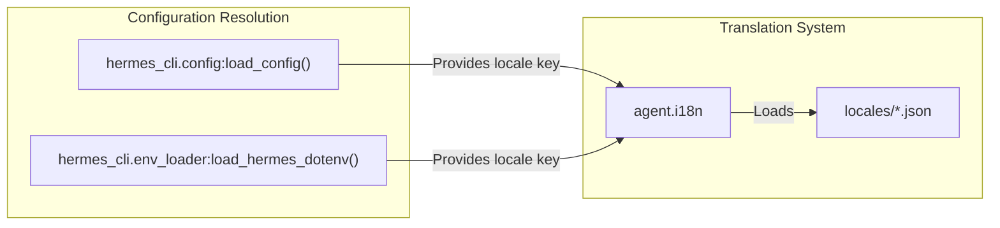
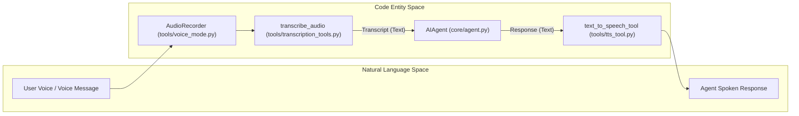
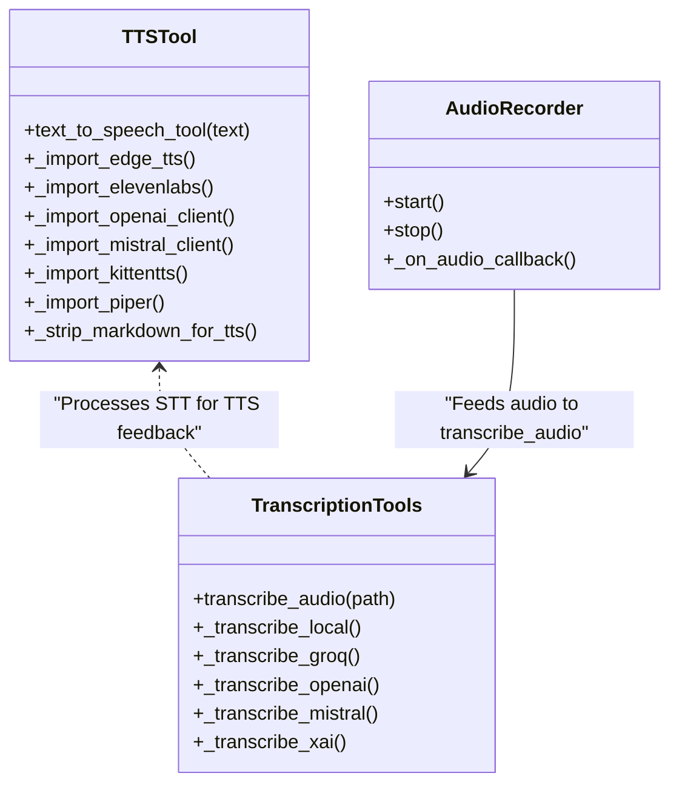
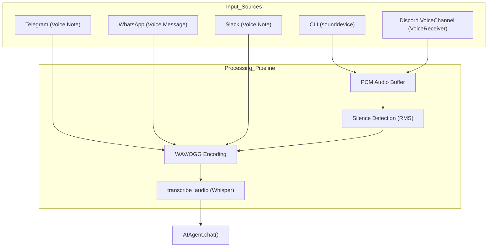
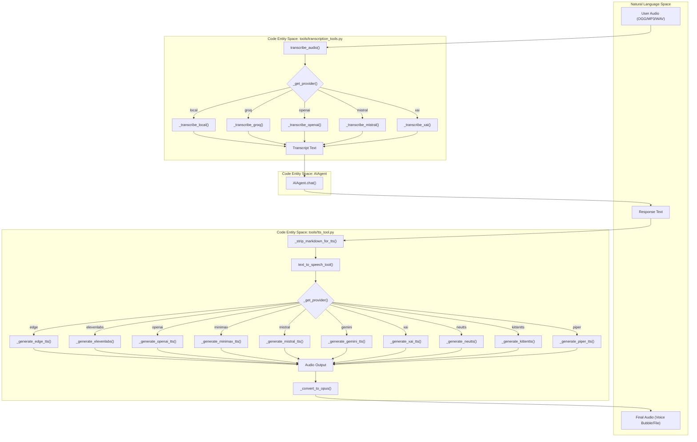
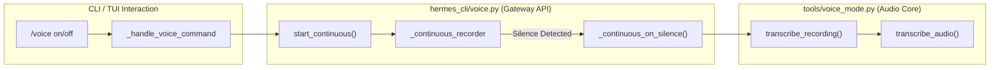
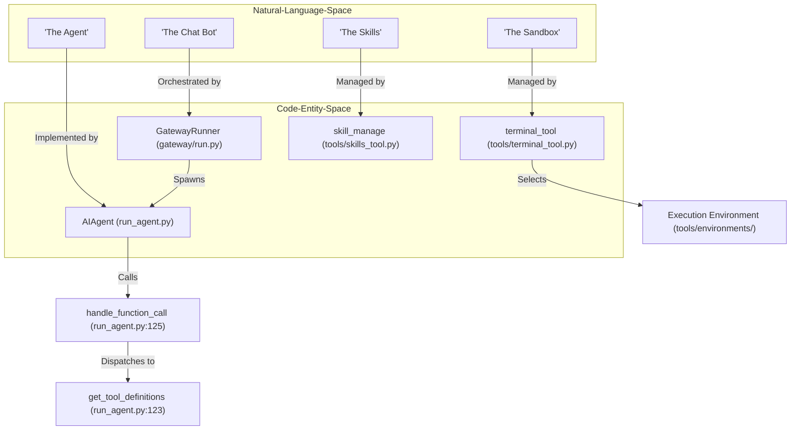
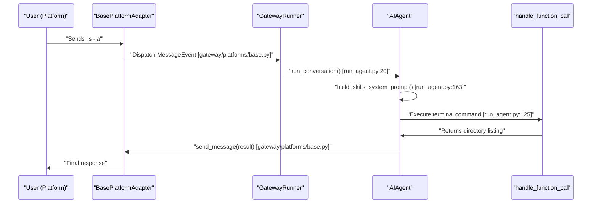

def _telegramize_command_mentions(text: str, platform: Any) -> str:
    """Rewrite slash-command mentions to Telegram-valid command names."""
    # ... logic to ensure translated command mentions remain clickable
```

Sources: `gateway/run.py:68-85`

## Adding New Locale Keys

To add a new message key for translation:

1.  **Choose a Key**: Select a descriptive and unique key, typically following a `component.subcomponent.message_description` convention (e.g., `gateway.usage.limit_reached`).
2.  **Add to `en.json`**: Add the new key and its English translation to `locales/en.json`.
3.  **Add to Other Locale Files**: Add the same key to all other supported language JSON files (`zh.json`, `ja.json`, etc.).
4.  **Use `t()` in Code**: Call the `t()` function in your Python code.
    ```python
    from agent.i18n import t
    # ...
    reply = t("gateway.usage.limit_reached", user=user_id)
    ```

## Locale Resolution

The active locale is resolved at runtime based on the system configuration. The `hermes_cli/config.py` module manages the `config.yaml` and `.env` files which can store user preferences.


Title: "Configuration and Locale Resolution"

Sources: `hermes_cli/config.py:1-29`, `hermes_cli/env_loader.py` (referenced in `run_agent.py:105`), `run_agent.py:111-118`

# Voice and TTS


This page provides a high-level overview of the voice interaction and speech synthesis capabilities of Hermes Agent. The system supports full-duplex voice conversations in the CLI, automated transcription of voice messages on messaging platforms (Telegram, Discord, WhatsApp, Slack, Signal, etc.), and high-quality text-to-speech (TTS) responses across multiple providers.

## Overview of Voice Capabilities

Hermes Agent bridges the gap between natural language speech and the agentic core through a modular pipeline of Speech-to-Text (STT) and Text-to-Speech (TTS) components.

| Feature | Description | Implementation |
|---------|-------------|----------------|
| **Voice Mode** | Real-time, push-to-talk or continuous voice interaction in the CLI. | `tools/voice_mode.py` [tools/voice_mode.py:1-10]() |
| **STT Pipeline** | Multi-provider transcription (Local, Groq, OpenAI, Mistral, xAI). | `tools/transcription_tools.py` [tools/transcription_tools.py:5-16]() |
| **TTS Synthesis** | Multi-provider synthesis (Edge, ElevenLabs, OpenAI, MiniMax, Mistral, Gemini, xAI, NeuTTS, KittenTTS, Piper). | `tools/tts_tool.py` [tools/tts_tool.py:5-15]() |
| **Platform Adapters**| Integration with Discord Voice Channels and messaging voice bubbles. | `gateway/platforms/base.py` [tests/gateway/test_queue_consumption.py:16-20]() |

### System Architecture Flow

The following diagram illustrates how audio data flows from a user into the `AIAgent` and back out as synthesized speech, bridging the "Natural Language Space" to the "Code Entity Space".

**Audio Processing Pipeline**

Sources: [tools/voice_mode.py:1-10](), [tools/transcription_tools.py:22-26](), [tools/tts_tool.py:31-35]()

---

## Voice Mode

Voice Mode allows for a hands-free interaction experience within the terminal. It utilizes `sounddevice` and `numpy` for low-latency audio I/O and implements environment detection to ensure compatibility across SSH, Docker, and WSL [tools/voice_mode.py:88-130]().

*   **Activation:** Controlled via `/voice on` in the CLI. The system uses a `_voice_lock` to protect state changes during concurrent recording and processing [tests/tools/test_voice_cli_integration.py:24-33]().
*   **Environment Support:** Includes specialized support for Termux via `termux-microphone-record` and `termux-api` when PortAudio is unavailable [tools/voice_mode.py:61-85]().
*   **Continuous Mode:** Supports a continuous listening mode that triggers processing when silence is detected based on `SILENCE_RMS_THRESHOLD` [tools/voice_mode.py:191-192]().
*   **Diagnostic Support:** The `detect_audio_environment` function checks for the presence of audio libraries and provides installation hints for missing dependencies [tools/voice_mode.py:55-59](), [tools/voice_mode.py:88-180]().

For details, see [Voice Mode](#11.1).

Sources: [tools/voice_mode.py:1-10](), [tests/tools/test_voice_cli_integration.py:131-147](), [tools/voice_mode.py:191-192]()

---

## TTS and Transcription

The TTS and STT systems are designed for "Zero Config" operation while supporting premium cloud providers for enhanced quality.

### Speech-to-Text (STT)
The transcription system resolves providers in a priority chain: **Local (faster-whisper) > Groq > OpenAI > Mistral > xAI** [tests/tools/test_transcription_tools.py:89-103]().
*   **Local:** Uses `faster-whisper` to run models locally or executes a shell command defined in `HERMES_LOCAL_STT_COMMAND` [tools/transcription_tools.py:81-83](), [tools/transcription_tools.py:156-169]().
*   **Validation:** All audio files are validated for format (mp3, ogg, wav, etc.) and size (max 25MB) before being sent to providers [tools/transcription_tools.py:95-97]().

### Text-to-Speech (TTS)
The `text_to_speech_tool` handles synthesis and automatic conversion. It utilizes `ffmpeg` to convert various outputs to OGG Opus format specifically for Telegram voice bubbles [tools/tts_tool.py:24-26](). It also includes a `_strip_markdown_for_tts` utility to remove bolding, headers, and code blocks so the agent provides a natural spoken response [tests/tools/test_voice_cli_integration.py:46-125]().

**TTS Provider Mapping**
| Provider | Code Entity | Key Features |
|----------|-------------|--------------|
| **Edge TTS** | `_import_edge_tts` | Free, Microsoft Edge neural voices [tools/tts_tool.py:81-84]() |
| **ElevenLabs** | `_import_elevenlabs` | Premium quality, supports `eleven_flash_v2_5` [tools/tts_tool.py:86-89]() |
| **OpenAI** | `_import_openai_client` | High quality, consistent with `gpt-4o-mini-tts` [tools/tts_tool.py:91-94]() |
| **MiniMax TTS** | `DEFAULT_MINIMAX_MODEL` | High-quality with voice cloning [tools/tts_tool.py:139-141]() |
| **Mistral (Voxtral TTS)** | `_import_mistral_client` | Multilingual, native Opus [tools/tts_tool.py:96-99]() |
| **Google Gemini TTS** | `DEFAULT_GEMINI_TTS_MODEL` | 30 prebuilt voices, outputs raw PCM [tools/tts_tool.py:149-155]() |
| **xAI TTS** | `DEFAULT_XAI_VOICE_ID` | Grok voices [tools/tts_tool.py:144-148]() |
| **NeuTTS** | `DEFAULT_PROVIDER` | Local, on-device TTS via `neutts` [tools/tts_tool.py:13]() |
| **KittenTTS** | `_import_kittentts` | Local 25MB model for on-device synthesis [tools/tts_tool.py:107-110]() |
| **Piper** | `_import_piper` | Local, 44 languages, auto-downloads models [tools/tts_tool.py:113-122]() |

**Voice/TTS Class Association**

Sources: [tools/transcription_tools.py:22-26](), [tools/tts_tool.py:5-15](), [tools/voice_mode.py:185-200]()

For details, see [TTS and Transcription](#11.2).

Sources: [tools/tts_tool.py:5-16](), [tools/transcription_tools.py:5-16](), [tools/voice_mode.py:1-10]()

# Voice Mode


Voice Mode provides real-time audio interaction capabilities across the CLI and messaging gateways. It encompasses local microphone capture, speech-to-text (STT) transcription, text-to-speech (TTS) synthesis, and specialized integration with Discord voice channels.

## Architecture Overview

The voice system is divided into two primary execution contexts: the **CLI Voice Mode** (push-to-talk/continuous) and the **Gateway Voice Mode** (asynchronous voice messages and live Discord VC).

### Data Flow: Voice Input to Agent
The following diagram illustrates how raw audio is captured, processed, and delivered to the `AIAgent`.

**Voice Input Pipeline**

Sources: [tools/voice_mode.py:1-10](), [tools/transcription_tools.py:1-27](), [website/docs/user-guide/features/voice-mode.md:27-32](), [website/docs/user-guide/messaging/telegram.md:9-9]()

## Discord Voice Channel Integration

Discord voice support allows the agent to join a Voice Channel (VC), listen to multiple users, and respond with synthesized speech.

### Implementation Details
- **Hardware Requirements**: Requires `discord.py[voice]`, which installs `PyNaCl` for encryption and Opus bindings [website/docs/user-guide/features/voice-mode.md:62-64]().
- **Silence Detection**: The CLI voice mode uses a two-stage algorithm. It first confirms speech by waiting for audio above the `SILENCE_RMS_THRESHOLD` (default 200) for at least 0.3s [tools/voice_mode.py:191-193](). It then triggers end detection after 3.0 seconds of continuous silence [website/docs/user-guide/features/voice-mode.md:145-151]().
- **Continuous Mode**: In the CLI, recording automatically restarts after a reply until 3 consecutive recordings detect no speech or the user interrupts [website/docs/user-guide/features/voice-mode.md:137-140]().

### Voice Mode State Machine
Users can toggle audio behavior via the `/voice` command in the CLI or gateway [website/docs/user-guide/features/voice-mode.md:120-126]().

| Mode | Command | Behavior |
| :--- | :--- | :--- |
| **Off** | `/voice off` | Disables voice features entirely. |
| **On** | `/voice on` | Enables microphone capture and audio replies. |
| **TTS Only** | `/voice tts` | Toggles whether the agent's text replies are spoken aloud [website/docs/user-guide/features/voice-mode.md:124-124](). |
| **Status** | `/voice status` | Displays current activation state [website/docs/user-guide/features/voice-mode.md:125-125](). |

Sources: [website/docs/user-guide/features/voice-mode.md:120-154](), [tools/voice_mode.py:191-200]()

## Speech-to-Text (STT) Pipeline

Transcription is handled by the `transcribe_audio` utility in `tools/transcription_tools.py`. The system supports a provider resolution chain to determine the best available engine [tools/transcription_tools.py:81-93]():

1.  **Local**: Uses `faster-whisper` for on-device inference. It is the default and requires no API keys [tools/transcription_tools.py:7-8]().
2.  **Groq**: High-speed cloud transcription using `whisper-large-v3-turbo` via `GROQ_API_KEY` [tools/transcription_tools.py:9-9]().
3.  **OpenAI**: Cloud Whisper API using `VOICE_TOOLS_OPENAI_KEY` [tools/transcription_tools.py:10-10]().
4.  **xAI**: High accuracy STT with diarization and Inverse Text Normalization via `XAI_API_KEY` [tools/transcription_tools.py:12-13]().
5.  **Mistral**: Mistral Voxtral Transcribe API via `MISTRAL_API_KEY` [tools/transcription_tools.py:11-11]().

### Hallucination Filtering
To combat Whisper's tendency to generate phantom text from silence (e.g., "Thank you for watching"), the system implements a hallucination filter using 26 known phrases and regex patterns [website/docs/user-guide/features/voice-mode.md:164-167]().

Sources: [tools/transcription_tools.py:5-27](), [website/docs/user-guide/features/voice-mode.md:85-102]()

## Text-to-Speech (TTS) and Synthesis

TTS synthesis is provided by `tools/tts_tool.py`, supporting ten backends including local and cloud providers [tools/tts_tool.py:5-16]().

### Backend Selection
The `text_to_speech_tool` resolves the provider based on `config.yaml` [tools/tts_tool.py:28-29](). It enforces per-provider character limits (e.g., 4096 for OpenAI, 15000 for xAI) to prevent API errors [tools/tts_tool.py:170-176]().

**TTS Code Entity Map**
```mermaid
classDiagram
    class "TTS_Tool" {
        +text_to_speech_tool(text)
        +PROVIDER_MAX_TEXT_LENGTH
    }
    class "ElevenLabs_Backend" {
        +_import_elevenlabs()
        +DEFAULT_ELEVENLABS_MODEL_ID
    }
    class "NeuTTS_Backend" {
        +DEFAULT_NEUTTS_MODEL
    }
    class "Edge_TTS" {
        +_import_edge_tts()
        +DEFAULT_EDGE_VOICE
    }
    class "OpenAI_TTS" {
        +_import_openai_client()
        +DEFAULT_OPENAI_MODEL
    }
    class "MiniMax_TTS" {
        +DEFAULT_MINIMAX_MODEL
    }
    class "Mistral_TTS" {
        +_import_mistral_client()
        +DEFAULT_MISTRAL_TTS_MODEL
    }
    class "Gemini_TTS" {
        +DEFAULT_GEMINI_TTS_MODEL
    }
    class "XAI_TTS" {
        +DEFAULT_XAI_VOICE_ID
    }
    class "KittenTTS_Backend" {
        +_import_kittentts()
        +DEFAULT_KITTENTTS_MODEL
    }
    class "Piper_Backend" {
        +_import_piper()
        +DEFAULT_PIPER_VOICE
    }

    "TTS_Tool" --> "ElevenLabs_Backend" : "elevenlabs"
    "TTS_Tool" --> "NeuTTS_Backend" : "neutts"
    "TTS_Tool" --> "Edge_TTS" : "edge (default)"
    "TTS_Tool" --> "OpenAI_TTS" : "openai"
    "TTS_Tool" --> "MiniMax_TTS" : "minimax"
    "TTS_Tool" --> "Mistral_TTS" : "mistral"
    "TTS_Tool" --> "Gemini_TTS" : "gemini"
    "TTS_Tool" --> "XAI_TTS" : "xai"
    "TTS_Tool" --> "KittenTTS_Backend" : "kittentts"
    "TTS_Tool" --> "Piper_Backend" : "piper"
```
Sources: [tools/tts_tool.py:5-35](), [tools/tts_tool.py:128-161](), [tools/tts_tool.py:170-181]()

## CLI Voice Controller

The voice mode in the CLI handles the local hardware interface and provides feedback via beeps and audio level bars [website/docs/user-guide/features/voice-mode.md:128-139]().

- **Detection**: `detect_audio_environment` performs checks for SSH, Docker, and WSL (requiring `PULSE_SERVER`) to ensure hardware access is possible [tools/voice_mode.py:88-125]().
- **Termux Support**: Specialized support for `termux-microphone-record` allows voice mode on Android devices if the Termux:API app is installed [tools/voice_mode.py:61-85]().
- **Streaming TTS**: When enabled, the agent speaks its reply sentence-by-sentence as it generates text. It strips markdown formatting and `<think>` blocks before synthesis [website/docs/user-guide/features/voice-mode.md:156-163]().
- **Parameters**: Captures audio at 16kHz mono (Whisper native rate) in 16-bit PCM format [tools/voice_mode.py:185-188]().

Sources: [tools/voice_mode.py:32-48](), [tools/voice_mode.py:88-180](), [website/docs/user-guide/features/voice-mode.md:106-163]()

# TTS and Transcription


Hermes Agent provides a multi-modal audio pipeline supporting Text-to-Speech (TTS) synthesis and Speech-to-Text (STT) transcription. This system enables voice-based interaction across the CLI, messaging platforms (Telegram, Discord, WhatsApp, Slack, and Signal), and specialized environments like Discord voice channels.

## Architecture and Data Flow

The audio subsystem is decoupled from the core agent logic, functioning as a set of utility tools and background processors. The following diagram illustrates how audio data moves from a user's voice input to the agent's synthesized response, mapping system processes to specific code entities.

**Audio Pipeline Data Flow (Code Entity Mapping)**

Sources: [tools/tts_tool.py:1-35](), [tools/transcription_tools.py:1-27]()

## Text-to-Speech (TTS) Synthesis

The TTS system is managed by `tools/tts_tool.py`. It supports multiple backends ranging from free cloud-based neural voices to high-fidelity premium providers and local on-device synthesis.

### Supported Backends
| Provider | Implementation Function | Key Features |
| :--- | :--- | :--- |
| **Edge TTS** | `_generate_edge_tts` | Default, free, uses Microsoft Edge neural voices. [tools/tts_tool.py:81-84](), [tools/tts_tool.py:190-213]() |
| **ElevenLabs** | `_generate_elevenlabs` | Premium, highest quality, supports streaming via `eleven_flash_v2_5`. [tools/tts_tool.py:86-89](), [tools/tts_tool.py:221-255]() |
| **OpenAI TTS** | `_generate_openai_tts` | Paid, high quality, uses `gpt-4o-mini-tts` or `tts-1`. [tools/tts_tool.py:91-94](), [tools/tts_tool.py:258-301]() |
| **MiniMax TTS** | `_generate_minimax_tts` | High-quality with voice cloning support. [tools/tts_tool.py:101-103](), [tools/tts_tool.py:304-348]() |
| **Mistral (Voxtral)** | `_generate_mistral_tts` | Multilingual, native Opus support, high quality. [tools/tts_tool.py:96-99](), [tools/tts_tool.py:351-413]() |
| **Google Gemini** | `_generate_gemini_tts` | Controllable voices, 30 prebuilt options. [tools/tts_tool.py:111-118](), [tools/tts_tool.py:514-577]() |
| **xAI TTS** | `_generate_xai_tts` | Grok voices, high quality. [tools/tts_tool.py:104-105](), [tools/tts_tool.py:416-462]() |
| **NeuTTS** | `_generate_neutts` | Local, on-device synthesis via `neutts_cli`. [tools/tts_tool.py:465-511]() |
| **KittenTTS** | `_generate_kittentts` | Local 25MB int8 model, fast and lightweight. [tools/tts_tool.py:107-110](), [tools/tts_tool.py:580-618]() |
| **Piper** | `_generate_piper_tts` | Local, on-device neural VITS, 44 languages. [tools/tts_tool.py:113-119](), [tools/tts_tool.py:621-648]() |

### Implementation Details
- **Markdown Stripping**: Before synthesis, `_strip_markdown_for_tts` removes structural characters (bold, italics, code blocks) and `<think>` blocks to ensure the spoken output is natural. [tools/tts_tool.py:651-700]()
- **Character Limits**: Providers have specific input caps (e.g., OpenAI 4096, xAI 15k). These are resolved via `_resolve_max_text_length`. [tools/tts_tool.py:132-187]()
- **Format Conversion**: Platforms like Telegram require Opus-encoded OGG files for native voice bubbles. The `_convert_to_opus` function utilizes `ffmpeg` to transform MP3 or WAV outputs into the required format. [tools/tts_tool.py:703-729]()
- **Audio Caching**: Synthesized files are stored in the `cache/audio` directory (defaulting to `~/.hermes/cache/audio`). [tools/tts_tool.py:157-161]()

Sources: [tools/tts_tool.py:5-16](), [tools/tts_tool.py:81-117](), [website/docs/user-guide/features/tts.md:105-125]()

## Speech-to-Text (STT) Transcription

The transcription system in `tools/transcription_tools.py` provides a unified interface for converting audio files into text.

### Provider Resolution
The system uses a priority-based resolution chain defined in `_get_provider` [tools/transcription_tools.py:163-278]():
1. **Local (faster-whisper)**: Preferred for privacy and cost. [tools/transcription_tools.py:179-181]()
2. **Local Command**: Uses a system binary (e.g., `whisper`) if found in the path. [tools/transcription_tools.py:182-183]()
3. **Groq**: High-speed cloud transcription (requires `GROQ_API_KEY`). [tools/transcription_tools.py:201-203]()
4. **OpenAI**: Paid cloud transcription (requires `VOICE_TOOLS_OPENAI_KEY`). [tools/transcription_tools.py:205-210]()
5. **Mistral**: Multilingual transcription using Voxtral models. [tools/transcription_tools.py:211-216]()
6. **xAI**: High accuracy STT with diarization support. [tools/transcription_tools.py:217-222]()

### Transcription Dispatch
The primary entry point is `transcribe_audio(file_path)`. It performs the following:
- **Validation**: `_validate_audio_file` checks file existence, format (MP3, OGG, WAV, etc.), and size against `MAX_FILE_SIZE` (25MB). [tools/transcription_tools.py:349-376]()
- **Dispatch**: Dispatches to the resolved provider function (e.g., `_transcribe_local` or `_transcribe_openai`). [tools/transcription_tools.py:732-759]()

Sources: [tools/transcription_tools.py:5-27](), [tools/transcription_tools.py:64-84](), [tools/transcription_tools.py:95-97]()

## Voice Mode and TUI Gateway

Hermes Agent features a dedicated Voice Mode for interactive sessions, implemented in `tools/voice_mode.py` and exposed via the TUI gateway.

### Voice Environment Detection
Before activating voice mode, `detect_audio_environment()` checks for system compatibility, including SSH detection, Docker container detection, and WSL PulseAudio bridge status. [tools/voice_mode.py:88-180]()

### Usage Modes
- **Push-to-Talk**: Manually bounded capture using `start_recording` and `stop_and_transcribe`. [tools/voice_mode.py:300-301](), [tools/voice_mode.py:310-311]()
- **Continuous (VAD)**: Voice Activity Detection (VAD) loop that auto-stops on silence, transcribes, and restarts. It includes a feedback guard (`_tts_playing` Event) to prevent the agent from transcribing its own TTS output. [tools/voice_mode.py:313-314]()

**Voice Mode State Management (Code Entity Mapping)**

Sources: [tools/voice_mode.py:1-10](), [tests/tools/test_voice_cli_integration.py:131-148](), [hermes_cli/voice.py:12-20]()

## Messaging Gateway Integration

The voice system is integrated across the Messaging Gateway to handle multi-platform audio delivery and queue management.

### Voice Message Processing
When a voice message arrives at the gateway, it is enriched with a transcription before being passed to the agent.
- **Enrichment**: The gateway calls the transcription tool and handles cases where STT is disabled or providers are missing. [tools/transcription_tools.py:15-16]()
- **Queued Voice**: Messages sent via the `/queue` command preserve their media metadata (URLs and types) while waiting for the agent to complete its current task. [tests/gateway/test_queue_consumption.py:84-102]()

### Platform Specifics
- **Telegram**: Automatically handles OGG Opus voice messages for native voice bubbles. [tools/tts_tool.py:15-16]()
- **Config Management**: The gateway honors `stt.enabled: false` from `config.yaml`, skipping the transcription pipeline entirely if configured. [tests/gateway/test_stt_config.py:20-33]()

Sources: [tools/transcription_tools.py:15-16](), [tools/tts_tool.py:15-17](), [website/docs/user-guide/features/tts.md:31-39](), [tests/gateway/test_queue_consumption.py:84-102](), [tests/gateway/test_stt_config.py:20-33]()

# Glossary


This page defines codebase-specific terminology, architectural concepts, and domain jargon used throughout the Hermes Agent project. It serves as a technical reference for onboarding engineers to map natural language concepts to specific code entities.

## Core Architectural Terms

### 1. AIAgent
The central orchestration class responsible for the conversation loop, tool execution, and state management. It acts as the "brain" that coordinates between the LLM, the tool registry, and the execution environments.
*   **Implementation:** `AIAgent` class in [run_agent.py:193-200]()
*   **Key Responsibility:** Managing the iterative loop where the LLM can call multiple tools before responding to the user. [run_agent.py:3-14]()

### 2. Toolset
A logical grouping of tools (e.g., `web`, `terminal`, `files`). Toolsets allow for granular capability management and security scoping.
*   **Implementation:** `get_toolset_for_tool` and `get_tool_definitions` in [run_agent.py:122-127]() (imported from `model_tools.py`)
*   **Usage:** Defined in `config.yaml` and resolved at runtime to provide the LLM with specific function definitions via the registry. [cli.py:9-13]()

### 3. Iteration Budget
A thread-safe mechanism that limits the number of LLM "turns" or tool-calling iterations allowed per request to prevent infinite loops or excessive API costs.
*   **Implementation:** `enforce_turn_budget` function in [run_agent.py:135-135]() (imported from `tools/tool_result_storage.py`)
*   **Subagent Delegation:** Subagents spawned via `delegate_task` typically share or receive a portion of the iteration budget. [run_agent.py:163-164]()

### 4. Gateway
The multi-platform messaging service that allows Hermes to communicate over Telegram, Discord, Slack, etc. It translates platform-specific events into a unified format.
*   **Implementation:** `GatewayRunner` in [gateway/run.py:5-7]()
*   **Lifecycle:** Manages the startup of all configured platform adapters and the background cron scheduler. [gateway/run.py:1-14]()

---

## Technical Mapping: From Concept to Code

The following diagram bridges the gap between high-level system concepts and the specific Python classes or files that implement them.

### System Entity Mapping

**Sources:** [run_agent.py:122-187](), [gateway/run.py:1-42](), [hermes_cli/main.py:1-44]()

---

## Domain Jargon & Abbreviations

| Term | Definition | Code Pointer |
| :--- | :--- | :--- |
| **ACP** | Agent Client Protocol. A standard for connecting agents to IDEs like VS Code or Zed. | [hermes_cli/main.py:40-40]() |
| **Auxiliary Client** | A secondary LLM client router used for side tasks (vision, compression, web extraction) to save costs on the primary model. | [agent/auxiliary_client.py:1-41]() |
| **Context Compression** | Automatic summarization of conversation history via `ContextCompressor` when approaching token limits. | [run_agent.py:160-160]() |
| **Dialectic** | A Honcho-specific term for reasoning processes where the agent reflects on interactions. | [hermes_cli/main.py:25-28]() |
| **SOUL.md** | A Markdown file defining the agent's core identity and personality. | [run_agent.py:163-163]() and [hermes_cli/config.py:151-151]() |
| **Tirith** | Security integration for scanning commands and detecting dangerous patterns. | [run_agent.py:177-183]() |
| **Trajectory** | A log of reasoning, tool calls, and results, used for training or diagnostics. | [run_agent.py:184-187]() |
| **Credential Pool** | Mechanism to manage multiple API keys for rotation and fallback. | [agent/auxiliary_client.py:102-102]() and [hermes_cli/setup.py:46-58]() |

---

## Data Flow: Message Processing

The following diagram illustrates how a user message travels from a messaging platform through the Gateway and into the Core Agent.

### Message Trajectory

**Sources:** [run_agent.py:17-21](), [gateway/run.py:1-42](), [gateway/platforms/base.py:1-80]()

---

## Execution Environment Backends

Hermes supports multiple backends for executing terminal commands. The choice is governed by `TERMINAL_ENV` or `terminal.backend` in `config.yaml`.

| Backend | Description | Implementation |
| :--- | :--- | :--- |
| **local** | Executes directly on the host machine. | [hermes_cli/config.py:129-129]() |
| **docker** | Runs commands inside a Docker container for isolation. | [run_agent.py:128-128]() |
| **modal** | Serverless cloud execution via Modal sandboxes. | [run_agent.py:128-128]() |
| **ssh** | Executes commands on a remote server via SSH. | [hermes_cli/config.py:129-129]() |
| **singularity** | High-performance container backend (Apptainer). | [run_agent.py:128-128]() |
| **daytona** | Cloud development environment backend integration. | [run_agent.py:128-128]() |

**Sources:** [hermes_cli/config.py:129-129](), [run_agent.py:128-128]()

---

## Configuration Hierarchy

Hermes resolves its configuration using a specific precedence order:
1.  **CLI Arguments:** Passed directly to the CLI entry point (e.g., `--toolsets`). [cli.py:9-14]()
2.  **config.yaml:** User settings stored in `~/.hermes/config.yaml`. Authoritative for terminal and auxiliary settings. [hermes_cli/config.py:5-13]()
3.  **Environment Variables:** Loaded from `.env` via `load_hermes_dotenv`. [run_agent.py:105-118]()
4.  **Defaults:** Fallback values defined in the configuration module. [hermes_cli/setup.py:134-146]()

### Profile Management
Hermes supports multiple configuration profiles. The active profile shifts the `HERMES_HOME` directory, swapping the entire configuration context.
*   **Implementation:** `_apply_profile_override` in [hermes_cli/main.py:119-160]()
*   **Resolution:** Handled before main imports to ensure all modules use the correct path. [hermes_cli/main.py:111-118]()

**Sources:** [hermes_cli/config.py:1-13](), [run_agent.py:105-118](), [cli.py:1-14](), [hermes_cli/main.py:111-160]()