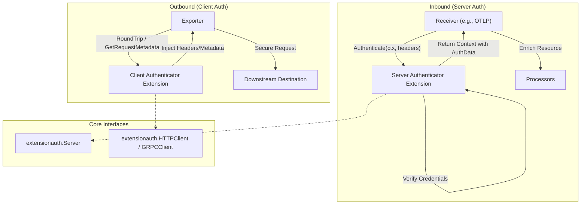
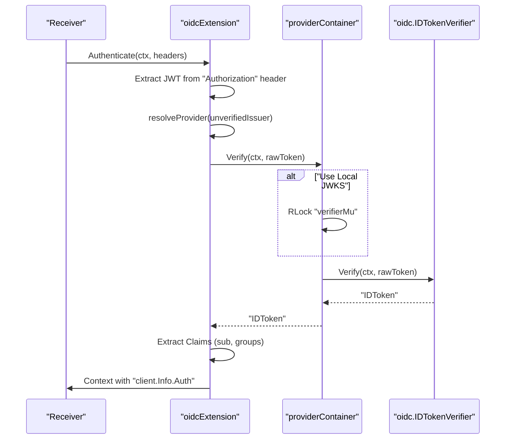
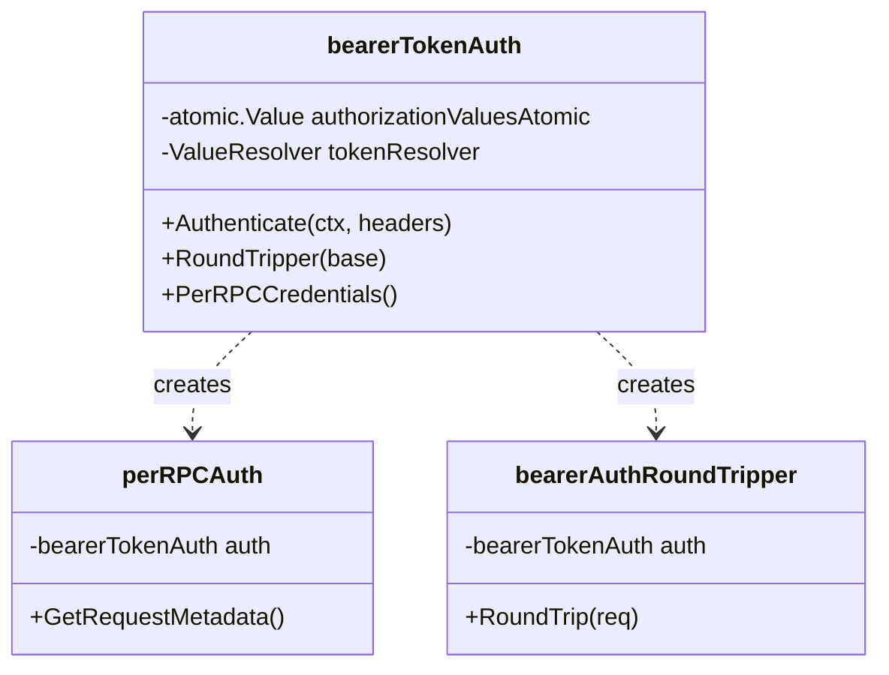
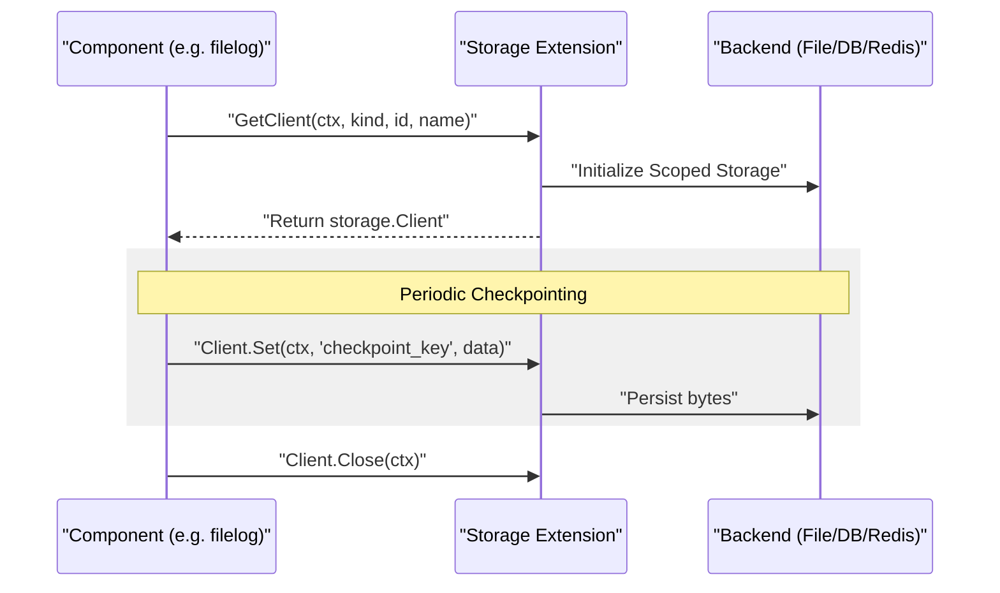

Authentication extensions in the OpenTelemetry Collector Contrib repository provide a modular ecosystem for securing telemetry data pipelines. These components implement the `extensionauth.Server`, `extensionauth.HTTPClient`, and `extensionauth.GRPCClient` interfaces, allowing them to verify incoming requests in receivers or attach credentials to outgoing requests in exporters.

## Overview and Architecture

The authentication framework separates the security logic from the communication protocols (HTTP/gRPC). Extensions are registered in the `service.extensions` section and then referenced by name within a receiver's or exporter's `auth` configuration.

### Data Flow and Interaction

The following diagram illustrates how an authentication extension interacts with the Collector's pipeline components.

**Authentication Integration Flow**

Sources: [extension/oidcauthextension/extension.go:33-36](), [extension/oidcauthextension/extension.go:158-165](), [extension/bearertokenauthextension/bearertokenauth.go:43-47]()

---

## OIDC Authenticator Extension (`oidcauthextension`)

The OIDC extension implements `extensionauth.Server` to verify OpenID Connect tokens (JWTs) against one or more identity providers.

### Implementation Details
The extension uses the `oidcExtension` struct to manage `providerContainers`. Each container holds a verifier and an HTTP client for fetching discovery documents or JWKS files [extension/oidcauthextension/extension.go:38-46]().

*   **Provider Matching:** The extension decodes the `iss` (issuer) claim from the unverified JWT to determine which configured provider should handle the verification [extension/oidcauthextension/extension.go:191-207]().
*   **Public Key Handling:** It supports [OpenID Connect Discovery](https://openid.net/specs/openid-connect-discovery-1_0.html) or local JWKS files via the `public_keys_file` setting. If a file is used, the extension watches it for changes using `fsnotify` and reloads keys automatically [extension/oidcauthextension/extension.go:63-85]().
*   **Claims Propagation:** Upon successful verification, claims (like `sub` and `groups`) are added to the `client.Info` in the context [extension/oidcauthextension/extension.go:219-235](). These can be accessed later by processors using `from_context` [extension/oidcauthextension/README.md:87-118]().

**OIDC Verification Logic**

Sources: [extension/oidcauthextension/extension.go:158-235](), [extension/oidcauthextension/extension.go:48-61]()

---

## Bearer Token Extension (`bearertokenauthextension`)

This extension provides a simple mechanism for static token-based authentication.

*   **Role:** Acts as both a client and server authenticator, implementing `extensionauth.Server`, `extensionauth.HTTPClient`, and `extensionauth.GRPCClient` [extension/bearertokenauthextension/bearertokenauth.go:43-47]().
*   **Configuration:** Supports a single `bearer_token`, a list of `tokens`, or a `filename` for reading tokens from disk [extension/bearertokenauthextension/config.go:30-45]().
*   **Token Rotation:** When `filename` is specified, it uses a `credentialsfile.ValueResolver` to watch the file and refresh tokens in memory without restarting the collector [extension/bearertokenauthextension/bearertokenauth.go:85-101]().
*   **Server Authentication:** The `Authenticate` method uses `subtle.ConstantTimeCompare` to securely validate incoming tokens against the allowed list [extension/bearertokenauthextension/bearertokenauth.go:195-215]().

**Bearer Token Code Structure**

Sources: [extension/bearertokenauthextension/bearertokenauth.go:28-58](), [extension/bearertokenauthextension/bearertokenauth.go:178-192]()

---

## OAuth2 Client Authenticator Extension (`oauth2clientauthextension`)

The `oauth2clientauthextension` provides client-side authentication using OAuth 2.0 flows.

### Implementation Details
The extension manages the lifecycle of access tokens, including automatic refreshing before expiration using an `expiry_buffer` [extension/oauth2clientauthextension/extension.go:44-57]().
*   **Grant Types:** Supports `client_credentials` (default) and `jwt-bearer` [extension/oauth2clientauthextension/extension.go:70-80]().
*   **Concurrency:** Uses a buffered channel `sem` of size 1 as a context-aware mutex to protect token refresh logic during concurrent requests [extension/oauth2clientauthextension/extension.go:125-132]().
*   **gRPC Integration:** Implements `credentials.PerRPCCredentials` to inject the `authorization` metadata into outgoing RPCs [extension/oauth2clientauthextension/extension.go:157-169]().

Sources: [extension/oauth2clientauthextension/extension.go:21-26](), [extension/oauth2clientauthextension/extension.go:125-148]()

---

## Azure Authentication Extension (`azureauthextension`)

The `azureauthextension` provides authentication for exporters interacting with Azure services.

### Implementation Details
*   **SDK Integration:** It heavily utilizes the `azidentity` and `azcore` libraries to handle credential resolution [extension/azureauthextension/go.mod:6-7]().
*   **Credential Types:** Supports multiple Azure authentication methods including Managed Identity, Service Principal (with client secret or certificate), and Azure CLI credentials.
*   **Token Refresh:** Leverages the Azure SDK's internal token caching and refresh mechanisms to maintain valid `Bearer` tokens for outgoing HTTP requests [extension/azureauthextension/go.mod:21]().

Sources: [extension/azureauthextension/go.mod:1-22](), [receiver/azureblobreceiver/go.mod:6-9]()

---

## AWS SigV4 Authenticator Extension (`sigv4authextension`)

The `sigv4authextension` enables signing HTTP requests with AWS Signature Version 4. This is essential for interacting with AWS services like Amazon Managed Service for Prometheus (AMP) or AWS X-Ray.

### Implementation Details
*   **Credential Resolution:** Uses the AWS SDK for Go V2 to resolve credentials from environment variables, IAM roles, or configuration files.
*   **Request Signing:** It implements `extensionauth.HTTPClient` to wrap an HTTP `RoundTripper`. Before each request, it signs the headers and payload according to the SigV4 specification.

Sources: [extension/oauth2clientauthextension/go.mod:22-23](), [extension/bearertokenauthextension/README.md:1-10]()

---

## Summary of Authentication Extensions

The contrib repository includes several specialized authenticators to support diverse security requirements:

| Extension | Purpose | Protocols | Key Features |
| :--- | :--- | :--- | :--- |
| `oidcauthextension` | OIDC Server Auth | HTTP/gRPC | JWT verification, discovery, JWKS file watching. |
| `bearertokenauthextension` | Static Token | HTTP/gRPC | Single/multiple tokens, file-based rotation. |
| `oauth2clientauthextension` | OAuth2 Client | HTTP/gRPC | Client Credentials & JWT Bearer flows, auto-refresh. |
| `sigv4authextension` | AWS SigV4 | HTTP | AWS IAM-based request signing. |
| `asapauthextension` | Atlassian ASAP | HTTP | ASAP protocol JWT generation and injection. |
| `azureauthextension` | Azure Auth | HTTP | Managed Identity and Service Principal support [extension/azureauthextension/go.mod:6-7](). |

### Extension Configuration Comparison

| Feature | OIDC | Bearer Token | OAuth2 Client | Azure Auth |
| :--- | :--- | :--- | :--- | :--- |
| **Server Auth** | Yes [extension.go:35]() | Yes [bearertokenauth.go:45]() | No | No |
| **Client Auth** | No | Yes [bearertokenauth.go:46]() | Yes [extension.go:23]() | Yes [extension/azureauthextension/go.mod:16]() |
| **File Watching** | Yes (JWKS) [extension.go:130]() | Yes (Token) [bearertokenauth.go:112]() | No | No |
| **Auto-Refresh** | N/A | Yes (via file) | Yes (via OAuth2) [extension.go:133]() | Yes (SDK-managed) |

Sources: [extension/oidcauthextension/extension.go:33-36](), [extension/bearertokenauthextension/bearertokenauth.go:43-48](), [extension/oauth2clientauthextension/extension.go:21-26](), [extension/azureauthextension/go.mod:1-22]()

# Storage Extensions


Storage extensions provide a mechanism for OpenTelemetry Collector components to persist state across restarts. This is critical for features like checkpointing in log receivers (e.g., `filelogreceiver`) and managing persistent queues in exporters. These extensions implement a common interface that abstracts the underlying storage technology, allowing components to remain agnostic of whether data is stored in a local file, a SQL database, or a remote cache like Redis.

## Architecture and Interface

The storage framework is built around the `storage.Extension` and `storage.Client` interfaces defined in the core Collector's `xextension/storage` package [[extension/storage/filestorage/extension.go:20-20]]().

### Data Flow

When a component (the "Owner") needs to persist data, it requests a `storage.Client` from a configured `storage.Extension`. Each client is scoped to the specific component and an optional partition, ensuring data isolation.

### Storage Hierarchy

| Entity | Role |
| :--- | :--- |
| `Extension` | The top-level component that manages the lifecycle of the storage backend (e.g., opening file handles, connecting to DBs). |
| `Client` | A component-specific handle used to perform CRUD operations. Obtained via `GetClient`. |
| `Operation` | A structure used for `Batch` operations, supporting `Get`, `Set`, and `Delete` types. |

### Component Interaction Diagram

The following diagram illustrates how a component like the `filelogreceiver` interacts with a storage extension to manage its checkpoints.

Title: Storage Client Lifecycle and Checkpointing

Sources: [[extension/storage/dbstorage/extension_test.go:88-94]](), [[extension/storage/dbstorage/extension_test.go:157-161]]()

---

## Implementations

### 1. File Storage (`filestorage`)
The `filestorage` extension persists state to the local file system using a **bbolt** (KV store) backend [[extension/storage/filestorage/README.md:2-4]](). It is the most common implementation for standalone collectors.

*   **Key Features**:
    *   **Compaction**: Supports `on_start` and `on_rebound` (online) compaction to reclaim space after large spikes in data usage (e.g., after a persistent queue is drained) [[extension/storage/filestorage/README.md:52-76]]().
    *   **Integrity**: Includes a `recreate` option that renames corrupted databases and starts fresh to prevent collector crashes [[extension/storage/filestorage/README.md:43-50]]().
    *   **Panic Recovery**: Implements `createClientWithPanicRecovery` to handle bbolt panics during database initialization [[extension/storage/filestorage/extension.go:109-143]]().
    *   **Permissions**: Allows customization of directory creation permissions (default `0750`) via `directory_permissions` [[extension/storage/filestorage/README.md:39-41]]().

### 2. Database Storage (`dbstorage`)
The `dbstorage` extension provides a generic interface to SQL-based backends. It currently supports **SQLite** and **PostgreSQL** [[extension/storage/dbstorage/go.mod:7-19]]().

*   **Implementation Details**:
    *   **SQLite**: Uses `modernc.org/sqlite` (a CGO-free implementation) [[extension/storage/dbstorage/go.mod:19-19]]().
    *   **PostgreSQL**: Uses the `jackc/pgx/v5` driver [[extension/storage/dbstorage/go.mod:7-7]]().
    *   **Concurrency**: Implements concurrent access handling, allowing multiple components to access the client interface simultaneously [[extension/storage/dbstorage/extension_test.go:180-186]]().

### 3. Redis Storage (`redisstorageextension`)
The `redisstorageextension` enables state persistence in a Redis instance, making it suitable for distributed collector deployments where state must survive pod migrations.

*   **Configuration**: Supports standard Redis options including `endpoint`, `password`, and `tls` settings [[extension/storage/redisstorageextension/config.go:18-24]]().
*   **Mocking**: Uses `github.com/go-redis/redismock/v9` for unit testing client interactions [[extension/storage/redisstorageextension/go.mod:6-6]]().

---

## Technical Comparison

| Feature | `filestorage` | `dbstorage` | `redisstorageextension` |
| :--- | :--- | :--- | :--- |
| **Backend** | bbolt (Local File) | SQL (SQLite/Postgres) | Redis (Remote/Local) |
| **CGO Required** | No | No | No |
| **Stability** | Beta [[extension/storage/filestorage/README.md:8-8]]() | Alpha | Alpha |
| **Primary Use Case** | Single-node persistence | Structured local/remote SQL | Distributed/Cloud-native |

Sources: [[extension/storage/filestorage/README.md:8-15]](), [[extension/storage/dbstorage/go.mod:1-20]](), [[extension/storage/redisstorageextension/go.mod:1-10]]()

---

## Implementation Details: `dbstorage`

The `dbstorage` implementation maps the `storage.Client` interface to SQL tables. Each client operation is translated into a SQL query scoped by the component's unique ID.

Title: DBStorage SQL Mapping Architecture
```mermaid
classDiagram
    class "localDBStorage" {
        +GetClient(kind, id, name) Client
        -db *sql.DB
    }
    class "dbStorageClient" {
        +Get(ctx, key)
        +Set(ctx, key, value)
        +Batch(ctx, ops)
        -ownerID string
    }
    "localDBStorage" --> "dbStorageClient" : "creates"
    "dbStorageClient" --> "Database" : "executes SQL"

    note for "Database" "Table Structure (internal):\nkey (TEXT)\nvalue (BLOB)\nowner_id (TEXT)"
```

### Key Functions
*   **`GetClient`**: Validates the component identity and returns a `dbStorageClient` instance configured with an owner ID to partition the data [[extension/storage/dbstorage/extension.go:68-94]]().
*   **`Batch`**: Executes multiple operations within a single SQL transaction. It iterates through `storage.Operation` types and applies them sequentially [[extension/storage/dbstorage/client.go:100-139]]().

Sources: [[extension/storage/dbstorage/extension_test.go:96-155]](), [[extension/storage/dbstorage/client.go]]()

---

## Implementation Details: `filestorage` Client Generation

The `filestorage` extension generates unique file names for each component to ensure isolation.

*   **Naming Convention**: Files are named using the pattern `kind_type_name` (e.g., `receiver_filelog_myreceiver`) [[extension/storage/filestorage/extension.go:70-74]]().
*   **Sanitization**: The `sanitize` function replaces characters like `/` with hex-encoded strings (e.g., `~002F`) [[extension/storage/filestorage/extension.go:163-178]]().
*   **Hashing**: If a sanitized filename exceeds `syscall.ENAMETOOLONG`, the extension falls back to a SHA256 hash [[extension/storage/filestorage/extension.go:83-88]]().

Sources: [[extension/storage/filestorage/extension.go:68-104]]()

---

## Testing Storage Components

The `storagetest` utilities ensure that implementations adhere to the expected behavior of the `storage.Client` interface.

### Integrity Testing
The `testExtensionIntegrity` function is a shared utility used to validate that an extension can:
1.  Handle multiple components simultaneously [[extension/storage/dbstorage/extension_test.go:77-86]]().
2.  Maintain data isolation between these components [[extension/storage/dbstorage/extension_test.go:163-168]]().
3.  Correctly process `Batch` operations involving mixed types (Set/Get/Delete) [[extension/storage/dbstorage/extension_test.go:135-154]]().

### Example: Testing SQLite Integrity
```go
func TestExtensionIntegrityWithSqlite(t *testing.T) {
    dbPath := filepath.Join(t.TempDir(), "foo.db")
    se, err := newSqliteTestExtension(dbPath)
    require.NoError(t, err)
    testExtensionIntegrity(t, se)
}
```
Sources: [[extension/storage/dbstorage/extension_test.go:29-38]](), [[extension/storage/dbstorage/extension_test.go:56-70]]()