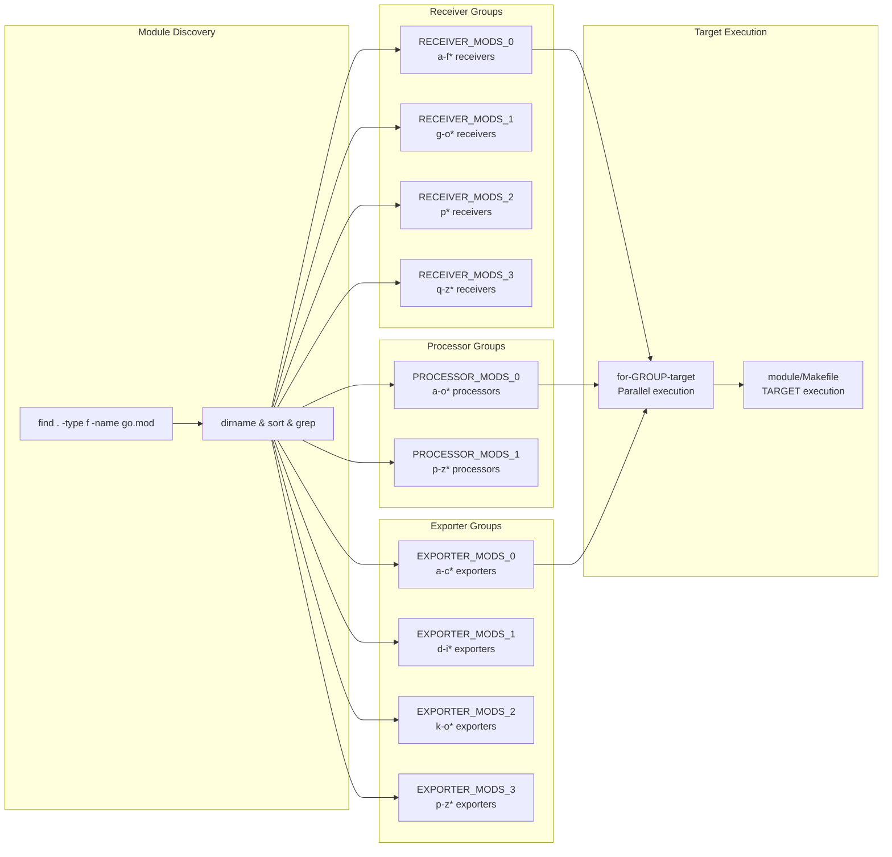

This document covers the comprehensive build infrastructure, development tools, testing frameworks, and quality assurance processes that maintain the repository's health and consistency across 200+ components. The build system orchestrates compilation, testing, linting, code generation, and dependency management for a monorepo containing receivers, processors, exporters, extensions, and connectors.

For information about how individual components are assembled into the final collector binary, see [Collector Binary Assembly](#3). For details on component lifecycle and metadata, see [Component Lifecycle and Stability Management](#1.2). For testing utilities and frameworks, see [Testing Infrastructure and Utilities](#13).

## Build System Architecture

The build infrastructure is organized around a hierarchical Makefile system that delegates tasks to module-specific targets, with development tools managed as Go tool dependencies.

Title: Build System Component Relationships

```mermaid
graph TB
    subgraph "Top Level Build"
        MAKEFILE["Makefile<br/>Module groups & targets"]
        MAKEFILE_COMMON["Makefile.Common<br/>Common targets & variables"]
    end

    subgraph "Development Tools"
        TOOLS_MOD["internal/tools/go.mod<br/>Tool declarations"]
        GOLANGCI["golangci-lint<br/>Code linting"]
        GOFUMPT["gofumpt<br/>Code formatting"]
        MULTIMOD["multimod<br/>Version management"]
        MDATAGEN["mdatagen<br/>Metadata code generation"]
        BUILDER["builder<br/>Collector assembly"]
        CHECKAPI["checkapi<br/>API compatibility"]
        CROSSLINK["crosslink<br/>Module dependencies"]
        CHLOGGEN["chloggen<br/>Changelog management"]
    end

    subgraph "Module Groups"
        RECEIVER_MODS["RECEIVER_MODS_0-3<br/>70+ receiver modules"]
        PROCESSOR_MODS["PROCESSOR_MODS_0-1<br/>30+ processor modules"]
        EXPORTER_MODS["EXPORTER_MODS_0-3<br/>50+ exporter modules"]
        EXTENSION_MODS["EXTENSION_MODS<br/>20+ extension modules"]
        CONNECTOR_MODS["CONNECTOR_MODS<br/>5+ connector modules"]
        INTERNAL_MODS["INTERNAL_MODS<br/>Internal packages"]
        PKG_MODS["PKG_MODS<br/>Public packages"]
        CMD_MODS["CMD_MODS<br/>Command packages"]
    end

    subgraph "Build Outputs"
        OTELCONTRIBCOL["otelcontribcol<br/>Main binary"]
        OTELTESTBEDCOL["oteltestbedcol<br/>Testbed binary"]
        TELEMETRYGEN["telemetrygen<br/>Data generator"]
        OPAMPSUPERVISOR["opampsupervisor<br/>Agent supervisor"]
    end

    MAKEFILE --> MAKEFILE_COMMON
    MAKEFILE --> TOOLS_MOD

    TOOLS_MOD --> GOLANGCI
    TOOLS_MOD --> GOFUMPT
    TOOLS_MOD --> MULTIMOD
    TOOLS_MOD --> MDATAGEN
    TOOLS_MOD --> BUILDER
    TOOLS_MOD --> CHECKAPI
    TOOLS_MOD --> CROSSLINK
    TOOLS_MOD --> CHLOGGEN

    MAKEFILE --> RECEIVER_MODS
    MAKEFILE --> PROCESSOR_MODS
    MAKEFILE --> EXPORTER_MODS
    MAKEFILE --> EXTENSION_MODS
    MAKEFILE --> CONNECTOR_MODS
    MAKEFILE --> INTERNAL_MODS
    MAKEFILE --> PKG_MODS
    MAKEFILE --> CMD_MODS

    BUILDER --> OTELCONTRIBCOL
    BUILDER --> OTELTESTBEDCOL
    MAKEFILE --> TELEMETRYGEN
    MAKEFILE --> OPAMPSUPERVISOR
```


**Sources**: [Makefile:1-50](), [Makefile.Common:1-100](), [internal/tools/go.mod:1-27]()

## Core Build Tools

Development tools are declared using Go 1.25's `tool` directive in [internal/tools/go.mod:5-28](), which allows them to be versioned and managed alongside dependencies.

### Tool Bindings

The build system accesses tools through environment-specific bindings defined in [Makefile.Common:64-91]():

| Tool Variable | Tool Package | Purpose |
|--------------|--------------|---------|
| `MDATAGEN` | `go.opentelemetry.io/collector/cmd/mdatagen` | Generate component boilerplate from `metadata.yaml` |
| `LINT` | `github.com/golangci/golangci-lint/v2/cmd/golangci-lint` | Run comprehensive code linters |
| `GOFUMPT` | `mvdan.cc/gofumpt` | Format Go code with strict rules |
| `MULTIMOD` | `go.opentelemetry.io/build-tools/multimod` | Manage versions across modules |
| `BUILDER` | `go.opentelemetry.io/collector/cmd/builder` | Assemble collector binaries |
| `CHECKAPI` | `go.opentelemetry.io/build-tools/checkapi` | Validate API compatibility |
| `CROSSLINK` | `go.opentelemetry.io/build-tools/crosslink` | Manage replace directives |
| `CHLOGGEN` | `go.opentelemetry.io/build-tools/chloggen` | Generate changelogs |
| `GOVULNCHECK` | `golang.org/x/vuln/cmd/govulncheck` | Scan for known vulnerabilities |
| `GCI` | `github.com/daixiang0/gci` | Organize Go imports |

**Sources**: [Makefile.Common:64-91](), [internal/tools/go.mod:5-28]()

### Linter Configuration

Code quality is enforced through `golangci-lint` with comprehensive rules configured in [.golangci.yml:1-55](). The configuration enables:

**Enabled Linters** [.golangci.yml:28-54]():
- `copyloopvar` - Detect loop variable capture issues
- `errcheck` - Check unhandled errors
- `gocritic` - Comprehensive Go code critic
- `gosec` - Security vulnerability scanner
- `govet` - Standard Go vet checks
- `staticcheck` - Advanced static analysis
- `testifylint` - Testify assertion best practices
- `modernize` - Suggest modern Go idioms

**Formatter Configuration** [.golangci.yml:1-18]():
- `gci` - Import organization with custom sections
- `gofumpt` - Stricter formatting than `gofmt`

**Dependency Guards** [.golangci.yml:175-216]():
- Deny deprecated packages (e.g., `github.com/azure/go-autorest`)
- Enforce use of `sync/atomic` instead of `go.uber.org/atomic`

**Sources**: [.golangci.yml:1-243]()

## Module Organization and Build Targets

The Makefile organizes 200+ Go modules into logical groups for parallel execution [Makefile:36-56]():

Title: Module Grouping and Target Delegation


The grouping strategy enables CI/CD parallelization by splitting large categories (receivers, processors, exporters) into sub-groups that can run concurrently [Makefile:75-98]().

**Sources**: [Makefile:36-56](), [Makefile:75-98]()

## Common Development Tasks

### Code Generation

The `generate` target orchestrates multiple code generation steps [Makefile:172-178]():

```bash
make generate
```

This executes `go generate ./...` and verifies that no uncommitted changes remain. For component-specific generation, `mdatagen` is used to create boilerplate code from `metadata.yaml` [Makefile.Common:70]().

**Sources**: [Makefile:172-178](), [Makefile.Common:70](), [internal/tools/go.mod:22]()

### Testing

Test execution is organized by scope and coverage requirements [Makefile.Common:118-147]():

| Target | Purpose | Options |
|--------|---------|---------|
| `test` | Run unit tests | `GOTESTSUM` with race detection |
| `test-with-cover` | Unit tests + coverage | Outputs to `coverage/unit` directory |
| `test-with-junit` | Unit tests + JUnit XML | Results in `JUNIT_OUT_DIR` |
| `integration-test` | Run integration tests | Tagged with `integration` |

Test parallelization configuration [Makefile.Common:33-40]():
- **Parallel tests**: 4 concurrent test packages
- **Timeout**: 900s (15 minutes) for unit tests
- **Race detector**: Enabled by default (except on Windows ARM64)

**Sources**: [Makefile.Common:118-147](), [Makefile.Common:33-40]()

### Dependency Management

The repository uses `crosslink` and `multimod` to manage dependencies across the monorepo [Makefile:143-146]().

```bash
make gotidy
```

This processes modules in topological order from `internal/tidylist/tidylist.txt` to ensure `go mod tidy` converges correctly [Makefile:167-171]().

**Sources**: [Makefile:143-171](), [internal/tools/go.mod:20]()

## CI/CD Pipeline Architecture

The GitHub Actions workflows implement a comprehensive multi-platform testing strategy with matrix-based parallelization.

### Main Workflow: build-and-test.yml

The primary CI pipeline [.github/workflows/build-and-test.yml:1-24]() handles:
- **CI Scope Computation**: Dynamically determines which modules to test based on changed files using `compute-ci-scope.sh` [.github/workflows/build-and-test.yml:63-144]().
- **Linting Matrix**: Runs `golangci-lint` across OS/Group matrix [.github/workflows/build-and-test.yml:150-167]().
- **Unit Testing**: Parallelized execution of tests across OS and component groups.

**Sources**: [.github/workflows/build-and-test.yml:1-167]()

### Platform-Specific Testing

- **Windows**: Comprehensive unit testing on `windows-2025` and `windows-11-arm` [.github/workflows/build-and-test-windows.yml:81-82]().
- **E2E Tests**: Kubernetes integration tests using `kind` clusters for specific components like `k8sclusterreceiver` and `resourcedetectionprocessor` [.github/workflows/e2e-tests.yml:101-150]().
- **CodeQL**: Security analysis running on macOS [.github/workflows/codeql-analysis.yml:12-46]().

**Sources**: [.github/workflows/build-and-test-windows.yml:81-82](), [.github/workflows/e2e-tests.yml:101-150](), [.github/workflows/codeql-analysis.yml:12-46]()

## Code Quality Gates

### Validation Checks

The CI pipeline enforces multiple quality requirements including metadata validation and API compatibility checks.

| Check | Tool | Purpose |
|-------|------|---------|
| `mdatagen` | `mdatagen` | Validate `metadata.yaml` and generated code [Makefile.Common:70]() |
| `checkapi` | `checkapi` | Ensure backward compatibility [Makefile.Common:90]() |
| `tidylist` | `crosslink` | Validate module topological ordering [Makefile:156-163]() |
| `chlog-validate` | `chloggen` | Verify changelog entry formatting [.github/workflows/changelog.yml:71-75]() |

**Sources**: [Makefile.Common:70-90](), [Makefile:156-163](), [.github/workflows/changelog.yml:71-75]()

### Changelog Management

Changes require a `.chloggen/*.yaml` entry, validated via the `chloggen` tool [.github/workflows/changelog.yml:57-75](). The workflow also includes a link checker for changelog previews [.github/workflows/changelog.yml:81-86]().

**Sources**: [.github/workflows/changelog.yml:57-86](), [internal/tools/go.mod:16]()

### Flaky Test Detection

The build system automatically creates GitHub issues for flaky tests detected during main branch runs [.github/workflows/build-and-test-windows.yml:149-172](). This is powered by the `issuegenerator` tool [internal/tools/go.mod:19]().

**Sources**: [.github/workflows/build-and-test-windows.yml:149-172](), [internal/tools/go.mod:19]()

---
For details on the Makefile-based build system and specific developer tools, see [Build Tools and Development Workflow](#2.1).
For an explanation of the GitHub Actions workflows and platform-specific testing, see [CI/CD Pipeline and Multi-Platform Testing](#2.2).
For details on component ownership, code quality enforcement, and changelog management, see [Component Ownership and Code Quality](#2.3).