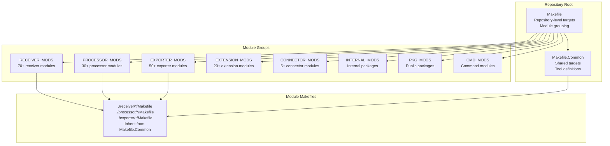
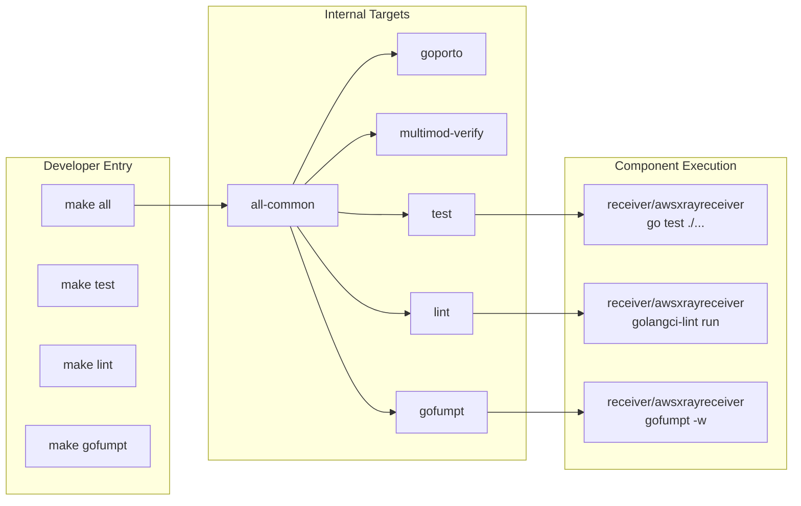
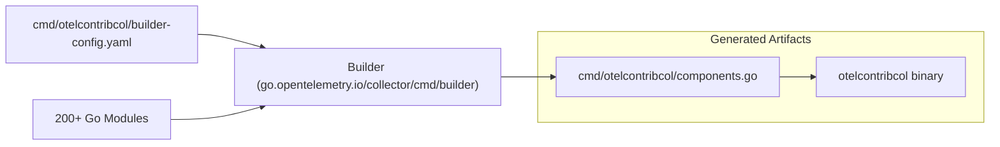

This page documents the Makefile-based build system and development tooling infrastructure that supports the development and maintenance of 200+ Go modules across receivers, processors, exporters, extensions, and connectors. It covers the essential tools declared in `internal/tools/go.mod`, common development tasks executed through Make targets, code generation processes, and dependency management workflows.

For information about CI/CD pipelines and automated testing, see **2.2 CI/CD Pipeline and Multi-Platform Testing**. For component ownership and quality enforcement mechanisms, see **2.3 Component Ownership and Code Quality**.

---

## Build System Architecture

The repository uses a two-tier Makefile system: [Makefile:1-27]() provides repository-specific targets and module grouping logic, while [Makefile.Common:1-11]() defines reusable targets that individual modules inherit. This architecture enables both repository-wide operations (e.g., `make all`) and module-specific execution (e.g., building only receiver modules).

### Repository Build Structure
Title: Makefile Tier Architecture

Sources: [Makefile:1-27](), [Makefile.Common:1-11](), [Makefile:36-56]()

### Module Discovery and Grouping

The Makefile dynamically discovers Go modules using `find` commands and groups them by component type [Makefile:36-56](). Modules are further subdivided alphabetically to enable parallel CI execution:

| Variable | Discovery Pattern | Example Modules |
|----------|------------------|-----------------|
| `RECEIVER_MODS_0` | `./receiver/[a-f]*` | `active_directory_ds`, `awscontainerinsightreceiver` |
| `RECEIVER_MODS_1` | `./receiver/[g-o]*` | `googlecloudpubsubreceiver`, `kafkareceiver` |
| `RECEIVER_MODS_2` | `./receiver/[p]*` | `prometheusreceiver` (Prometheus is special) |
| `RECEIVER_MODS_3` | `./receiver/[q-z]*` | `sqlqueryreceiver`, `zipkinreceiver` |
| `PROCESSOR_MODS_0` | `./processor/[a-o]*` | `attributesprocessor`, `filterprocessor` |
| `PROCESSOR_MODS_1` | `./processor/[p-z]*` | `resourcedetectionprocessor`, `transformprocessor` |

Sources: [Makefile:36-43](), [Makefile:75-98]()

---

## Development Tools

All development tools are declared in [internal/tools/go.mod:5-28]() and managed through Go's tool mechanism. This ensures version consistency across all developers.

### Tool Mapping to Code Entities
Title: Build Tool to Code Entity Mapping

```mermaid
graph LR
    subgraph "Natural Language Space"
        LINT_DESC["Code Linter"]
        GEN_DESC["Code Generator"]
        DEP_DESC["Dependency Manager"]
        TEST_DESC["Test Runner"]
        FORMAT_DESC["Code Formatter"]
        API_CHECK_DESC["API Compatibility Checker"]
        LINK_CHECK_DESC["Cross-module Link Checker"]
    end

    subgraph "Code Entity Space"
        LINT_BIN["github.com/golangci/golangci-lint/v2/cmd/golangci-lint"]
        MDATAGEN_BIN["go.opentelemetry.io/collector/cmd/mdatagen"]
        MULTIMOD_BIN["go.opentelemetry.io/build-tools/multimod"]
        GOTESTSUM_BIN["gotest.tools/gotestsum"]
        BUILDER_BIN["go.opentelemetry.io/collector/cmd/builder"]
        GOFUMPT_BIN["mvdan.cc/gofumpt"]
        CHECKAPI_BIN["go.opentelemetry.io/build-tools/checkapi"]
        CROSSLINK_BIN["go.opentelemetry.io/build-tools/crosslink"]
    end

    LINT_DESC --- LINT_BIN
    GEN_DESC --- MDATAGEN_BIN
    GEN_DESC --- BUILDER_BIN
    DEP_DESC --- MULTIMOD_BIN
    TEST_DESC --- GOTESTSUM_BIN
    FORMAT_DESC --- GOFUMPT_BIN
    API_CHECK_DESC --- CHECKAPI_BIN
    LINK_CHECK_DESC --- CROSSLINK_BIN
```

Sources: [internal/tools/go.mod:5-28](), [Makefile.Common:70-95]()

### Tool Binary Location Strategy

Tools are invoked using `go tool -modfile=internal/tools/go.mod`, ensuring the versions pinned in the tools module are used [Makefile.Common:69]().

| Makefile Variable | Tool Source Path | Purpose |
|-------------------|------------------|---------|
| `MDATAGEN` | `go.opentelemetry.io/collector/cmd/mdatagen` | Generate component metadata code [Makefile.Common:73]() |
| `LINT` | `github.com/golangci/golangci-lint/v2/cmd/golangci-lint` | Run linters with `.golangci.yml` [Makefile.Common:78]() |
| `MULTIMOD` | `go.opentelemetry.io/build-tools/multimod` | Synchronize module versions [Makefile.Common:79]() |
| `BUILDER` | `go.opentelemetry.io/collector/cmd/builder` | Build collector binaries [Makefile.Common:87]() |
| `CROSSLINK` | `go.opentelemetry.io/build-tools/crosslink` | Manage internal replace directives [Makefile.Common:85]() |
| `GOFUMPT` | `mvdan.cc/gofumpt` | Format Go code [Makefile.Common:88]() |
| `CHECKAPI` | `go.opentelemetry.io/build-tools/checkapi` | Check API compatibility [Makefile.Common:93]() |

Sources: [Makefile.Common:69-95](), [internal/tools/go.mod:5-28]()

---

## Common Development Tasks

### Build and Test Workflow

The repository uses a recursive delegation pattern where repository-level targets iterate over module groups and invoke module-specific targets [Makefile:101-105]().

Title: Developer Command Flow

Sources: [Makefile:101-105](), [Makefile.Common:116-119](), [Makefile:152-154]()

### Linter Configuration

The [.golangci.yml:1-55]() file configures `golangci-lint` with dozens of enabled linters. It enforces strict import ordering via `gci` and formatting via `gofumpt` [.golangci.yml:1-18]().

**Depguard Restrictions:**
The system restricts specific packages to maintain quality [.golangci.yml:163-225]():
*   `github.com/azure/go-autorest`: Deprecated (EOL). Please use an alternative Azure SDK [.golangci.yml:167-168]().
*   `go.uber.org/atomic`: Use standard library `sync/atomic` [.golangci.yml:170-171]().
*   `github.com/pkg/errors`: Use standard `errors` or `fmt` [.golangci.yml:173-174]().
*   `math/rand`: Use `math/rand/v2` [.golangci.yml:179-180]().
*   `sigs.k8s.io/yaml`: Use `go.yaml.in/yaml` [.golangci.yml:182-183]().
*   `go.opentelemetry.io/otel/semconv`: Enforces specific `semconv` versions, currently `v1.40.0` is preferred, with older versions allowed temporarily for migration [.golangci.yml:193-216]().

Sources: [.golangci.yml:1-55](), [.golangci.yml:163-225](), [.golangci.yml:190-216]()

---

## Code Generation Processes

### Component Metadata Generation

The `mdatagen` tool is the primary generator for component boilerplate [Makefile.Common:73](). It processes `metadata.yaml` files within component directories to produce stability levels, component information, and automated factory testing code.

Sources: [Makefile.Common:73](), [internal/tools/go.mod:22]()

### Binary Assembly via Builder

The `otelcontribcol` binary is assembled using the OpenTelemetry Collector Builder (`ocb`) based on [cmd/otelcontribcol/builder-config.yaml:1-15]().

Title: Collector Assembly Pipeline

Sources: [cmd/otelcontribcol/builder-config.yaml:9-15](), [Makefile.Common:87]()

---

## Dependency Management via Multimod

Managing dependencies across 200+ modules requires the `multimod` tool to maintain version consistency [Makefile.Common:79]().

### Version Synchronization Logic

1.  **Core Versions:** Versions for core OTel components are pulled from `versions.yaml` [Makefile:10]().
2.  **Tidy List:** Modules are processed in topological order defined in [internal/tidylist/tidylist.txt]() to ensure `go mod tidy` converges [Makefile:168-171]().
3.  **Crosslink:** Ensures `replace` directives point to correct local paths during development [Makefile:158-163](). The `crosslink` tool is used to validate the `tidylist.txt` and `allow-circular.txt` files [Makefile:157-163]().

| Command | Purpose |
|---------|---------|
| `make multimod-verify` | Checks if all modules in a set have the same version [Makefile:101](). |
| `make gotidy` | Runs `go mod tidy` across all modules in topological order [Makefile:167-171](). |
| `make bump-go-version` | Updates the Go version across all modules in the repository [Makefile:173-180](). |
| `make tidylist` | Validates the `internal/tidylist/tidylist.txt` file using `crosslink` [Makefile:156-163](). |

Sources: [Makefile:156-171](), [Makefile:173-180](), [internal/tidylist/tidylist.txt](), [Makefile:157-163]()

---

## Common Development Tasks

| Task | Command |
|------|---------|
| **Format Code** | `make gofumpt` [Makefile.Common:88]() |
| **Lint All** | `make lint` [Makefile.Common:78]() |
| **Run Unit Tests** | `make test` [Makefile.Common:122]() |
| **Generate Code** | `make generate` |
| **Build Binary** | `make otelcontribcol` [Makefile:101]() |
| **Tidy Modules** | `make gotidy` [Makefile:167]() |
| **Update Labels** | `make genlabels` [Makefile:126-148]() |
| **Check API Compatibility** | `make checkapi` [Makefile.Common:93]() |
| **Check Cross-module Links** | `make crosslink` [Makefile.Common:85]() |

Sources: [Makefile:101-171](), [Makefile:126-148](), [Makefile.Common:78-95]()