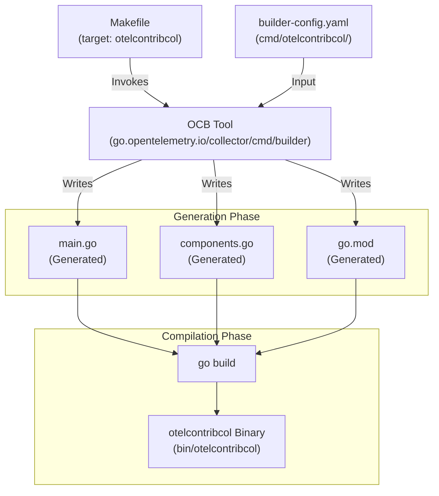
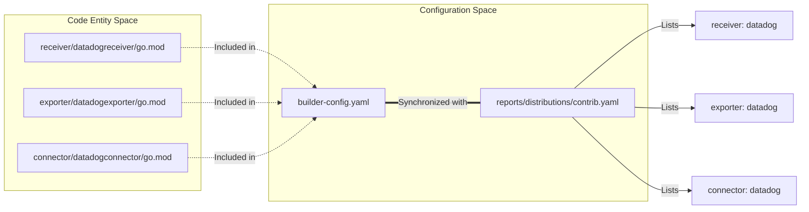

## Purpose and Scope

This page documents the OpenTelemetry Collector Builder configuration system used to assemble custom collector distributions. The builder enables the creation of tailored collector binaries containing only the specific receivers, processors, exporters, extensions, and connectors required for a particular environment.

The repository provides two primary local builder configurations for development and testing: `otelcontribcol` (the full contrib distribution) and `oteltestbedcol` (used for end-to-end testing).

## The OpenTelemetry Collector Builder Tool

The OpenTelemetry Collector Builder (`ocb`) is a command-line utility that generates Go source code and compiles custom collector binaries based on a YAML manifest.

**Key Characteristics:**

| Aspect | Details |
|--------|---------|
| **Tool Location** | `go.opentelemetry.io/collector/cmd/builder` |
| **Contrib Reference** | Managed as a tool dependency in `internal/tools/go.mod` [internal/tools/go.mod:21]() |
| **Makefile Integration** | Invoked via the `$(BUILDER)` variable defined in `Makefile.Common` [Makefile.Common:87]() |
| **Primary Function** | Generates `main.go`, `components.go`, and `go.mod` for a distribution |

The builder tool is explicitly tracked to ensure version consistency across the development environment [Makefile.Common:87]().

Sources: [internal/tools/go.mod:21](), [Makefile.Common:87]()

## Builder Configuration File Structure

The `builder-config.yaml` file defines the distribution's metadata and the specific modules to be included.

### Configuration Schema Example (otelcontribcol)

The `cmd/otelcontribcol/builder-config.yaml` serves as the local manifest for the contrib distribution.

```yaml
dist:
  module: github.com/open-telemetry/opentelemetry-collector-contrib/cmd/otelcontribcol
  name: otelcontribcol
  description: Local OpenTelemetry Collector Contrib binary, testing only.
  version: 0.155.0-dev
  output_path: ./cmd/otelcontribcol

extensions:
  - gomod: github.com/open-telemetry/opentelemetry-collector-contrib/extension/ackextension v0.155.0
  # ... other extensions

exporters:
  - gomod: github.com/open-telemetry/opentelemetry-collector-contrib/exporter/datadogexporter v0.155.0
  # ... other exporters

processors:
  - gomod: github.com/open-telemetry/opentelemetry-collector-contrib/processor/attributesprocessor v0.155.0
  # ... other processors

receivers:
  - gomod: github.com/open-telemetry/opentelemetry-collector-contrib/receiver/datadogreceiver v0.155.0
  # ... other receivers
```

### Configuration Elements

| Section | Purpose | Reference |
|---------|---------|-----------|
| `dist` | Defines binary name, version, and output path | [cmd/otelcontribcol/builder-config.yaml:9-14]() |
| `extensions` | List of extension modules and versions | [cmd/otelcontribcol/builder-config.yaml:16-63]() |
| `exporters` | List of exporter modules and versions | [cmd/otelcontribcol/builder-config.yaml:64-113]() |
| `processors` | List of processor modules and versions | [cmd/otelcontribcol/builder-config.yaml:115-147]() |
| `receivers` | List of receiver modules and versions | [cmd/otelcontribcol/builder-config.yaml:149-254]() |
| `connectors` | List of connector modules and versions | [cmd/otelcontribcol/builder-config.yaml:256-270]() |

**Note:** The local `builder-config.yaml` in this repository is used for development and testing. Official release binaries are built using manifests in the `opentelemetry-collector-releases` repository [cmd/otelcontribcol/builder-config.yaml:1-8]().

Sources: [cmd/otelcontribcol/builder-config.yaml:1-270]()

## Component Assembly and Code Generation

The build process transforms the YAML configuration into a functional Go application.

### Data Flow: From Config to Binary

The following diagram illustrates how the `Makefile` coordinates the builder tool to assemble the `otelcontribcol` binary.

**Title: Collector Assembly Pipeline**


### components.go Generation

The `components.go` file is a critical generated artifact. It registers the factory functions for every component specified in the config. The `Makefile` defines the relative path for this file:

[Makefile:13]() `COMP_REL_PATH=cmd/otelcontribcol/components.go`

When the collector starts, it uses these registered factories to instantiate the pipeline based on the user's runtime configuration YAML.

Sources: [Makefile:13](), [Makefile.Common:87](), [cmd/otelcontribcol/builder-config.yaml:9-14]()

## Distribution Management

The repository maintains metadata about distributions to track component inclusion and stability.

### Distribution Reports

Distribution content is tracked in `reports/distributions/`. For example, `reports/distributions/contrib.yaml` lists all components included in the contrib distribution, categorized by type (connector, exporter, extension, processor, provider, receiver, scraper) [reports/distributions/contrib.yaml:1-259]().

**Title: Distribution Content Mapping**


Sources: [reports/distributions/contrib.yaml:1-259](), [cmd/otelcontribcol/builder-config.yaml:1-270]()

## Module Versioning and Dependency Alignment

Because the repository is a monorepo with hundreds of modules, keeping versions in sync is a complex task managed by the build system.

### versions.yaml and Module Sets

The `versions.yaml` file defines `module-sets` that group related modules together for synchronized versioning. For example, the `contrib-base` set includes the root module and various command/extension modules [versions.yaml:4-87]().

### Dependency Tidy and Topological Sorting

To ensure that `go mod tidy` converges across all modules, the repository uses `internal/tidylist/tidylist.txt`. This file lists modules in topological order [Makefile:163-164]().

The `gotidy` target iterates through this list to maintain dependency health:
[Makefile:167-172]()

```bash
# Example of tidying logic
for mod in $(cat internal/tidylist/tidylist.txt); do
    echo "Tidying $mod";
    (cd $mod && rm -rf go.sum && $(GOCMD) mod tidy -compat=$(GO_COMPAT_VERSION) && $(GOCMD) get toolchain@none) || exit $?;
done
```

Sources: [versions.yaml:4-87](), [Makefile:156-172](), [internal/tidylist/tidylist.txt]()

## Build Workflow Integration

The `Makefile` provides standardized targets for building the local distributions.

| Target | Description |
|--------|-------------|
| `make otelcontribcol` | Builds the full contrib collector binary [Makefile:101]() |
| `make oteltestbedcol` | Builds the collector used for testbed E2E testing [Makefile:108]() |

The `otelcontribcol` binary is frequently used in Docker-based deployments for testing, as seen in various `Dockerfile` examples throughout the repository [exporter/loadbalancingexporter/example/Dockerfile:6-17](), [exporter/clickhouseexporter/example/Dockerfile:10]().

Sources: [Makefile:101](), [Makefile:108](), [exporter/loadbalancingexporter/example/Dockerfile:6-17](), [exporter/clickhouseexporter/example/Dockerfile:10]()