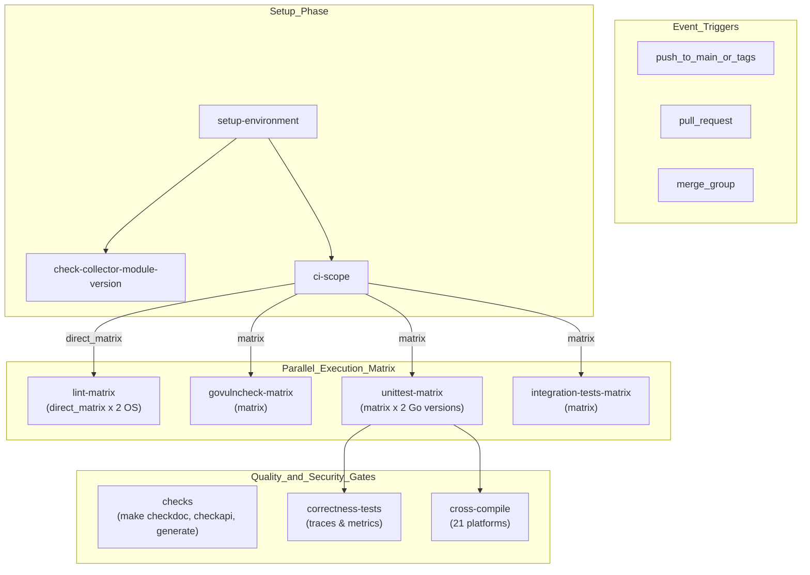
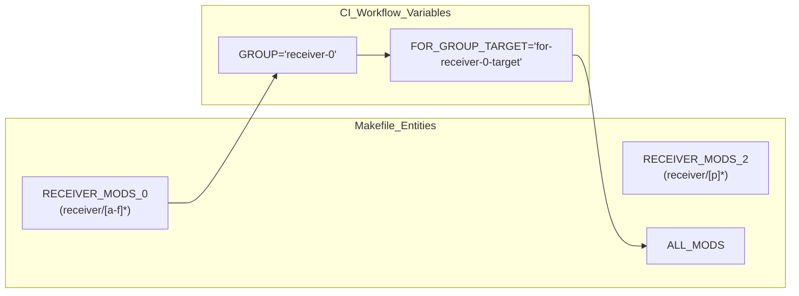

## Purpose and Scope

This document describes the continuous integration and deployment infrastructure for the `opentelemetry-collector-contrib` repository. It covers GitHub Actions workflows that execute multi-platform builds, parallelized test suites, artifact management, and automated release processes. The pipeline is designed to handle a massive monorepo containing over 200 Go modules, ensuring that changes to shared internal packages or individual components do not break the ecosystem.

## Workflow Architecture

The CI/CD system is organized around several primary workflows that trigger on different events:

| Workflow | Trigger Events | Primary Purpose |
|----------|---------------|-----------------|
| `build-and-test` | push (main), pull_request, merge_group | Core build, lint, and test execution on Linux. |
| `build-and-test-windows` | push (main), pull_request with "Run Windows" label | Windows platform validation (x64 and ARM64). |
| `build-and-test-arm` | push (main), pull_request without "Skip ARM" label | Native ARM64 architecture validation on Linux. |
| `build-and-test-darwin` | push (main), pull_request with "Run Darwin" label | macOS platform validation. |
| `e2e-tests` | push (main), pull_request | Kubernetes end-to-end testing using `kind`. |
| `load-tests` | schedule (twice daily), workflow_dispatch | Performance benchmarking on bare-metal runners. |
| `changelog` | pull_request | Validation of `.chloggen` entries and link checking. |
| `codeql-analysis` | push (main) | Static analysis for security vulnerabilities. |

Sources: [.github/workflows/build-and-test.yml:1-14](), [.github/workflows/build-and-test-windows.yml:1-13](), [.github/workflows/e2e-tests.yml:1-15]()

### Primary Workflow Structure

The primary workflow `build-and-test.yml` uses a complex dependency graph to ensure environment stability before launching expensive parallel matrices.

**Primary Build and Test Flow**

Sources: [.github/workflows/build-and-test.yml:30-150](), [.github/workflows/build-and-test.yml:151-500]()

## Multi-Platform Testing Strategy

### Platform Matrix Configuration
The repository tests on four primary platforms with specific runner configurations to ensure compatibility across the collector's deployment targets.

**Linux (Primary Platform)**
- **Runner**: `ubuntu-24.04` [[.github/workflows/build-and-test.yml:32]()]
- **Go versions**: `oldstable` [[.github/workflows/build-and-test.yml:38]()]
- **Groups**: 16 component groups for parallelization [[.github/workflows/build-and-test.yml:95-112]()]

**Windows**
- **Runners**: `windows-2025`, `windows-11-arm` [[.github/workflows/build-and-test-windows.yml:81]()]
- **Constraints**: `CGO_ENABLED` is disabled for `windows-11-arm` [[.github/workflows/build-and-test-windows.yml:90]()]. Memory usage is limited via `GOGC: 50` and `GOMEMLIMIT: 2GiB` to avoid OOM on runners [[.github/workflows/build-and-test-windows.yml:87-88]()].
- **Port Management**: Executes `win-required-ports.ps1` to ensure port availability in the dynamic range [[.github/workflows/build-and-test-windows.yml:97-98]()].

**ARM64**
- **Runner**: Native ARM runners (specified in `build-and-test-arm.yml`).
- **Strategy**: Runs full unit test matrix natively on ARM hardware to catch architecture-specific alignment or CGO issues.

**macOS (Darwin)**
- **Runners**: `macos-latest` [[.github/workflows/codeql-analysis.yml:13]()].
- **Focus**: Validates components requiring Darwin-specific APIs like the `macosunifiedloggingreceiver`.

### Cross-Compilation Matrix
The `cross-compile` job validates that the `otelcontribcol` binary can be built for a wide array of architectures.

| OS | Architectures |
|----|---------------|
| `linux` | `386`, `amd64`, `arm`, `arm64`, `ppc64le`, `riscv64`, `s390x` |
| `windows` | `386`, `amd64`, `arm64` |
| `darwin` | `amd64`, `arm64` |

Sources: [.github/workflows/build-and-test.yml:478-542]()

## Matrix Parallelization System

### Component Grouping Strategy
The repository uses `compute-ci-scope.sh` to classify PR changes [[.github/workflows/build-and-test.yml:113]()]. It outputs two matrices: `matrix` (modules + transitive dependents) and `direct_matrix` (lint-only for changed files) [[.github/workflows/build-and-test.yml:49-55]()].

| Group Name | Contents |
|------------|----------|
| `receiver-0` to `receiver-3` | Receivers partitioned alphabetically [[.github/workflows/build-and-test.yml:96-99]()] |
| `processor-0`, `processor-1` | Processors partitioned alphabetically [[.github/workflows/build-and-test.yml:100-101]()] |
| `exporter-0` to `exporter-3` | Exporters partitioned alphabetically [[.github/workflows/build-and-test.yml:102-105]()] |
| `extension`, `connector` | Specialized component types [[.github/workflows/build-and-test.yml:106-107]()] |
| `internal`, `pkg` | Shared packages [[.github/workflows/build-and-test.yml:108-109]()] |

### Makefile Delegation
The `Makefile` maps these group names to specific module directories using `find` commands [[Makefile:36-55]()]. If a `GROUP` variable contains a slash (e.g., a specific module path), the Makefile invokes delegation targets directly [[Makefile:17-24]()].

**Code Entity to CI Group Mapping**

Sources: [Makefile:16-56](), [Makefile:75-98]()

## End-to-End and Load Testing

### Kubernetes E2E Matrix
The `e2e-tests.yml` workflow validates components against multiple K8s versions using `kind`.

1. **Build**: Generates collector source and builds `otelcontribcol` [[.github/workflows/e2e-tests.yml:34-36]()].
2. **Docker**: Builds a local Docker image `otelcontribcol:latest` [[.github/workflows/e2e-tests.yml:90]()].
3. **Cluster**: Creates a `kind` cluster with `e2e-kind-config.yaml` [[.github/workflows/e2e-tests.yml:126-131]()].
4. **Test**: Executes `go test -v --tags=e2e` for specific components like `k8sclusterreceiver` or `k8sattributesprocessor` [[.github/workflows/e2e-tests.yml:110-117](), [.github/workflows/e2e-tests.yml:147-149]()].

### Supervisor and Example Testing
- **OpAMP Supervisor**: Runs `make e2e-test` within `cmd/opampsupervisor` [[.github/workflows/e2e-tests.yml:58-61]()].
- **Datadog Examples**: Validates Datadog example configurations using a specific test suite in `internal/datadog/e2e` [[.github/workflows/e2e-tests.yml:72-75]()].

Sources: [.github/workflows/e2e-tests.yml:24-151]()

## Security Scanning and Quality Gates

### Vulnerability and Static Analysis
- **Govulncheck**: Scans all modules for known vulnerabilities using `golang.org/x/vuln/cmd/govulncheck` [[internal/tools/go.mod:25]()] and the `unittest-matrix` in CI.
- **CodeQL**: Performs analysis on `macos-latest` to ensure cross-platform security coverage [[.github/workflows/codeql-analysis.yml:12-13]()]. It forces tracing of the custom build command `make otelcontribcol` [[.github/workflows/codeql-analysis.yml:23-45]()].
- **Scorecard**: Monitors supply-chain security, publishing results to the OpenSSF REST API [[.github/workflows/scorecard.yml:37-55]()].

### Automated Issue Generation
The `issuegenerator` tool is used to manage flaky tests on the `main` branch.
1. **JUnit Generation**: `make gotest-with-junit-and-cover` produces XML reports [[Makefile.Common:147-150]()].
2. **Issue Creation**: `issuegenerator` parses the reports and opens GitHub issues with labels `flaky tests,needs triage` [[.github/workflows/build-and-test-windows.yml:172]()].

Sources: [.github/workflows/build-and-test-windows.yml:149-173](), [internal/tools/go.mod:19]()

## Publishing and Release Workflows

### Changelog Enforcement
The `changelog.yml` workflow requires a YAML entry in `.chloggen/` for every PR unless the "Skip Changelog" label is present [[.github/workflows/changelog.yml:1-10]()].
- **Validation**: Uses `make chlog-validate` [[.github/workflows/changelog.yml:74]()].
- **Link Checking**: Uses `lycheeverse/lychee-action` to validate URLs in the rendered changelog preview [[.github/workflows/changelog.yml:81-86]()].

### Core Dependency Synchronization
The `update-otel.yaml` workflow automates the weekly synchronization with `open-telemetry/opentelemetry-collector`.
- **Process**: Pulls the latest core commit, runs `make update-otel`, and creates a draft PR via `gh pr create` [[.github/workflows/update-otel.yaml:32-71]()].
- **Observability**: Posts failure logs to Slack and creates GitHub issues if the sync fails [[.github/workflows/update-otel.yaml:74-107]()].

Sources: [.github/workflows/update-otel.yaml:1-110](), [.github/workflows/changelog.yml:1-89]()