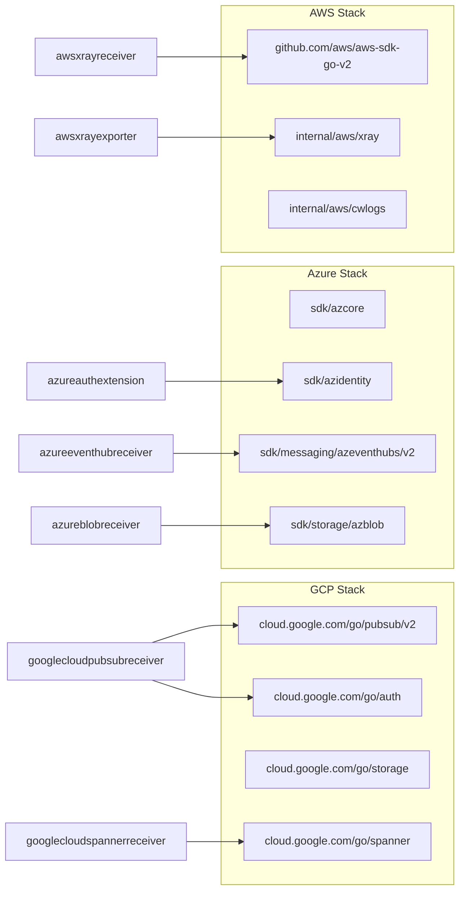

This document provides an overview of cloud provider integrations within the OpenTelemetry Collector Contrib repository. These components enable bidirectional telemetry data flow between the collector and major cloud provider services, including Google Cloud Platform (GCP), Amazon Web Services (AWS), and other cloud platforms.

The repository includes three major cloud integration categories:
- [Google Cloud Platform Components](#8.1) — Document GCP receivers (`googlecloudspannerreceiver`, `googlecloudpubsubreceiver`, `googlecloudpubsubpushreceiver`, `googlecloudmonitoringreceiver`) and exporters (`googlecloudpubsubexporter`, `googlecloudstorageexporter`), GCP event notification processing, authentication, and metadata extraction
- [AWS Integration Components](#8.2) — Document AWS receivers (`awscontainerinsightreceiver`, `awsecscontainermetricsreceiver`, `awsxrayreceiver`), exporters (`awsemfexporter`, `awsxrayexporter`, `awss3exporter`), extensions (`awsecsobserver`, `awsproxy`), ECS/EKS integration patterns, and AWS SDK usage
- [Multi-Cloud Export Support](#8.3) — Document integrations with other cloud providers including Azure (`azureeventhubreceiver`, `azuremonitorreceiver`, `azureblobreceiver`, `azureauthextension`), Alibaba Cloud, Tencent Cloud (`tencentcloudlogserviceexporter`), and Huawei Cloud (`huaweicloudcesreceiver`), covering their authentication mechanisms and export patterns

## Overview

Cloud provider integrations provide specialized receivers, exporters, and extensions that leverage native cloud provider SDKs and APIs to collect, enrich, and export telemetry data. These components handle provider-specific authentication, data transformation, and protocol requirements while maintaining compatibility with the OpenTelemetry data model.

The integrations support various data flow patterns:
- **Ingestion from cloud services** via receivers (e.g., Cloud Spanner metrics, Pub/Sub messages, Azure Event Hubs)
- **Export to cloud services** via exporters (e.g., Pub/Sub topics, Cloud Storage, AWS S3)
- **Monitoring cloud infrastructure** via scraping receivers (e.g., Cloud Monitoring API, Azure Monitor metrics)
- **Automatic resource detection and enrichment** via processors (e.g., `resourcedetectionprocessor` for AWS, GCP, Azure)

Sources: [receiver/googlecloudspannerreceiver/go.mod:1-28](), [receiver/googlecloudpubsubreceiver/go.mod:1-30](), [exporter/googlecloudpubsubexporter/go.mod:1-26](), [receiver/googlecloudmonitoringreceiver/go.mod:1-21]()

## Cloud Provider Component Matrix

The following table summarizes the cloud service integrations available in the repository:

| Cloud Provider | Component Type | Component Name | Primary Dependency | Purpose |
|---------------|---------------|----------------|-------------------|---------|
| Google Cloud | Receiver | `googlecloudspannerreceiver` | `cloud.google.com/go/spanner` | Collect Cloud Spanner metrics |
| Google Cloud | Receiver | `googlecloudpubsubreceiver` | `cloud.google.com/go/pubsub/v2` | Ingest telemetry from Pub/Sub topics |
| Google Cloud | Receiver | `googlecloudmonitoringreceiver` | `cloud.google.com/go/monitoring` | Scrape Cloud Monitoring API metrics |
| Google Cloud | Exporter | `googlecloudpubsubexporter` | `cloud.google.com/go/pubsub/v2` | Export telemetry to Pub/Sub topics |
| Google Cloud | Exporter | `googlecloudstorageexporter` | `cloud.google.com/go/storage` | Export telemetry to Cloud Storage |
| AWS | Receiver | `awsxrayreceiver` | `github.com/aws/aws-sdk-go-v2` | Receive AWS X-Ray traces |
| AWS | Exporter | `awsemfexporter` | `github.com/aws/aws-sdk-go-v2` | Export metrics to AWS CloudWatch EMF |
| AWS | Exporter | `awsxrayexporter` | `github.com/aws/aws-sdk-go-v2` | Export traces to AWS X-Ray |
| AWS | Exporter | `awscloudwatchlogsexporter` | `internal/aws/cwlogs` | Export logs to CloudWatch Logs |
| Azure | Receiver | `azureeventhubreceiver` | `azeventhubs/v2` | Ingest from Azure Event Hubs |
| Azure | Receiver | `azuremonitorreceiver` | `azmetrics` / `armmonitor` | Scrape Azure Monitor metrics |
| Azure | Receiver | `azureblobreceiver` | `azblob` | Receive logs from Azure Blob Storage |
| Azure | Exporter | `azureblobexporter` | `azblob` | Export logs to Azure Blob Storage |
| Azure | Extension | `azureauthextension` | `azidentity` | AAD authentication extension |

Sources: [receiver/googlecloudspannerreceiver/go.mod:6](), [receiver/googlecloudpubsubreceiver/go.mod:6](), [receiver/googlecloudmonitoringreceiver/go.mod:53](), [exporter/googlecloudpubsubexporter/go.mod:6](), [receiver/awsxrayreceiver/go.mod:6-7](), [exporter/azureblobexporter/go.mod:1-10]()

## Architecture Overview

**Cloud Provider Integration Architecture**

```mermaid
graph TB
    subgraph "Cloud Services"
        G_SPAN["Google Cloud Spanner"]
        G_PUBSUB["Google Cloud Pub/Sub"]
        G_MON["Google Cloud Monitoring"]
        G_STORAGE["Google Cloud Storage"]
        AZ_EH["Azure Event Hubs"]
        AZ_MON["Azure Monitor"]
        AZ_BLOB["Azure Blob Storage"]
        AWS_XRAY_SVC["AWS X-Ray Service"]
        AWS_CWL["AWS CloudWatch Logs"]
    end

    subgraph "Collector Receivers"
        GCSR["googlecloudspannerreceiver"]
        GCPR["googlecloudpubsubreceiver"]
        GCMR["googlecloudmonitoringreceiver"]
        AZEHR["azureeventhubreceiver"]
        AZMR["azuremonitorreceiver"]
        AZBR["azureblobreceiver"]
        AWSXR["awsxrayreceiver"]
    end

    subgraph "Collector Core"
        PIPELINE["Pipeline Processing"]
        PDATA["pdata OTLP Model"]
    end

    subgraph "Collector Exporters"
        GCPE["googlecloudpubsubexporter"]
        GCSE["googlecloudstorageexporter"]
        AZBE["azureblobexporter"]
        AWSXE["awsxrayexporter"]
        AWSEMF["awsemfexporter"]
        AWSCWE["awscloudwatchlogsexporter"]
    end

    subgraph "Collector Extensions"
        AZAUTH["azureauthextension"]
    end

    G_SPAN -->|"Query metrics"| GCSR
    G_PUBSUB -->|"Pull/Push"| GCPR
    G_MON -->|"Scrape API"| GCMR
    AZ_EH -->|"Events"| AZEHR
    AZ_MON -->|"Metrics"| AZMR
    AZ_BLOB -->|"Logs"| AZBR
    AWS_XRAY_SVC -->|"Traces"| AWSXR

    GCSR --> PIPELINE
    GCPR --> PIPELINE
    GCMR --> PIPELINE
    AZEHR --> PIPELINE
    AZMR --> PIPELINE
    AZBR --> PIPELINE
    AWSXR --> PIPELINE

    PIPELINE --> PDATA
    PDATA --> PIPELINE

    PIPELINE --> GCPE
    PIPELINE --> GCSE
    PIPELINE --> AZBE
    PIPELINE --> AWSXE
    PIPELINE --> AWSEMF
    PIPELINE --> AWSCWE

    GCPE -->|"Publish"| G_PUBSUB
    GCSE -->|"Upload"| G_STORAGE
    AZBE -->|"Write"| AZ_BLOB
    AWSXE -->|"Send traces"| AWS_XRAY_SVC
    AWSCWE -->|"Logs"| AWS_CWL

    AZAUTH -.->|"Authenticate"| AZEHR
    AZAUTH -.->|"Authenticate"| AZMR
```

Sources: [receiver/googlecloudspannerreceiver/go.mod:10-20](), [exporter/googlecloudpubsubexporter/go.mod:11-20](), [receiver/awsxrayreceiver/go.mod:16-26](), [receiver/azureblobreceiver/go.mod:12-24]()

## Common Integration Patterns

### Cloud SDK Dependencies

Cloud provider integrations utilize official SDKs for authentication and API access. For details, see [Google Cloud Platform Components](#8.1) and [AWS Integration Components](#8.2).

**SDK Dependency Mapping**

Sources: [receiver/googlecloudpubsubreceiver/go.mod:6,34](), [receiver/googlecloudspannerreceiver/go.mod:6](), [receiver/awsxrayreceiver/go.mod:6-7](), [receiver/azureblobreceiver/go.mod:6-9]()

### Authentication Mechanisms

Cloud components support multiple authentication patterns. For details, see [Google Cloud Platform Components](#8.1), [AWS Integration Components](#8.2), and [Multi-Cloud Export Support](#8.3).

**Google Cloud Authentication:**
- Application Default Credentials (ADC) via `cloud.google.com/go/auth` [receiver/googlecloudpubsubreceiver/go.mod:34]()
- OAuth2 adapters via `cloud.google.com/go/auth/oauth2adapt` [receiver/googlecloudpubsubreceiver/go.mod:35]()
- GCE metadata service via `cloud.google.com/go/compute/metadata` [receiver/googlecloudpubsubreceiver/go.mod:36]()

**Azure Authentication:**
- Azure Active Directory (AAD) via `azureauthextension` which uses `github.com/Azure/azure-sdk-for-go/sdk/azidentity` [receiver/azureblobreceiver/go.mod:7]().
- Supports Managed Identity, Service Principals, and Client Secrets via `azcore` [receiver/azureblobreceiver/go.mod:6]().

**AWS Authentication:**
- IAM roles and policies via `github.com/aws/aws-sdk-go-v2`.
- SigV4 authentication for API requests.
- Specialized AWS utility modules like `internal/aws/awsutil`.

Sources: [receiver/googlecloudpubsubreceiver/go.mod:34-36](), [receiver/azureblobreceiver/go.mod:6-7](), [extension/azureauthextension/go.mod:1-10]()

## Component Interfaces

### Receiver Interface Implementation

Cloud receivers implement standard OpenTelemetry Collector receiver interfaces. For details, see [Google Cloud Platform Components](#8.1) and [AWS Integration Components](#8.2).

**Core Receiver Dependencies:**
- `go.opentelemetry.io/collector/receiver` - Base receiver interface [receiver/googlecloudpubsubreceiver/go.mod:18]()
- `go.opentelemetry.io/collector/scraper/scraperhelper` - Used for polling-based receivers like `googlecloudmonitoringreceiver` [receiver/googlecloudmonitoringreceiver/go.mod:17]().
- `go.opentelemetry.io/collector/receiver/receiverhelper` - Used for event-driven receivers like `googlecloudpubsubreceiver` [receiver/googlecloudpubsubreceiver/go.mod:19]().

Sources: [receiver/googlecloudmonitoringreceiver/go.mod:15-17](), [receiver/googlecloudpubsubreceiver/go.mod:18-19](), [receiver/azuremonitorreceiver/go.mod:25-29]()

### Exporter Interface Implementation

Cloud exporters implement standard OpenTelemetry Collector exporter interfaces with robust retry and batching. For details, see [Google Cloud Platform Components](#8.1), [AWS Integration Components](#8.2), and [Multi-Cloud Export Support](#8.3).

**Core Exporter Dependencies:**
- `go.opentelemetry.io/collector/exporter` - Base exporter interface [exporter/googlecloudpubsubexporter/go.mod:17]()
- `go.opentelemetry.io/collector/exporter/exporterhelper` - Provides retry, queuing, and batching functionality [exporter/googlecloudpubsubexporter/go.mod:18]().
- `go.opentelemetry.io/collector/config/configretry` - Standardized exponential backoff retry [exporter/googlecloudpubsubexporter/go.mod:14]().

Sources: [exporter/googlecloudpubsubexporter/go.mod:14,17-18](), [exporter/azureblobexporter/go.mod:1-20]()

## Related Documentation

For detailed implementation information:
- Google Cloud Platform components and authentication patterns: [Google Cloud Platform Components](#8.1)
- AWS integration components: [AWS Integration Components](#8.2)
- Multi-cloud exporters and authentication mechanisms: [Multi-Cloud Export Support](#8.3)