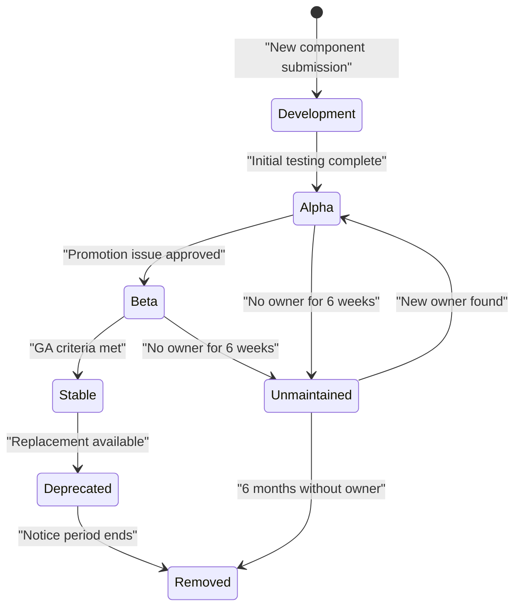
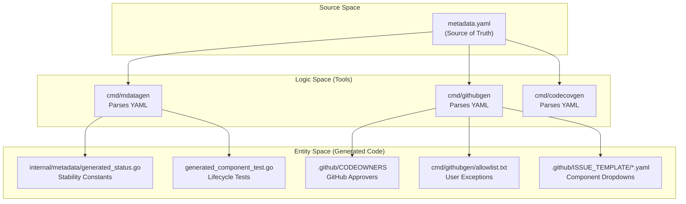

## Purpose and Scope

This document explains how the `opentelemetry-collector-contrib` repository manages component stability levels and lifecycle transitions. It covers the stability level definitions (development, alpha, beta, stable, deprecated, unmaintained), how stability is declared and tracked through metadata, the automated systems that enforce and propagate stability information, and the processes for promoting components through stability levels or managing unmaintained code.

## Stability Level Definitions

The repository follows the OpenTelemetry Collector component stability definitions to categorize the maturity of receivers, processors, exporters, extensions, and connectors. Stability is defined per signal type (traces, metrics, logs, profiles). [README.md:47-52]()

| Stability Level | Meaning | Breaking Changes | Production Use |
|-----------------|---------|------------------|----------------|
| **Development** | Early development, not ready for use | Expected frequently | Not recommended |
| **Alpha** | Publicly available, not production-ready | May occur between minor versions | Not recommended |
| **Beta** | Well-tested, API mostly stable | Minimized, deprecated first | Acceptable with caution |
| **Stable/GA** | Production-ready, stable API | Follow semver, require major version bump | Recommended |
| **Deprecated** | Scheduled for removal | No new features | Migration required |
| **Unmaintained** | No active maintainer, will be removed | No maintenance | Should not use |

A single component may have split stability levels. For example, a component may be **Stable** for traces but **Alpha** for metrics and **Development** for logs. [README.md:47-48]()

Sources: [README.md:47-53](), [receiver/googlecloudspannerreceiver/metadata.yaml:6-9]()

## Component Stability Declaration

### Metadata Definition
The source of truth for a component's status is its `metadata.yaml` file. This file defines the component type, its stability per signal, and its ownership.

```yaml
type: googlecloudspanner

status:
  class: receiver
  stability:
    beta: [metrics]
  distributions: [contrib]
  codeowners:
    active: [dashpole, KiranmayiB, nsj07]
    emeritus: [architjugran, varunraiko, harishbohara11, dsimil]
```

Key fields in the `status` block:
- `class`: The category of the component (e.g., `receiver`, `processor`, `connector`). [receiver/googlecloudspannerreceiver/metadata.yaml:5-5]()
- `stability`: A map where keys are stability levels and values are lists of supported signals. [receiver/googlecloudspannerreceiver/metadata.yaml:6-9]()
- `distributions`: Lists which collector distributions include this component (e.g., `contrib`). [reports/distributions/contrib.yaml:1-4]()
- `codeowners`: Tracks active maintainers and emeritus contributors. [receiver/googlecloudspannerreceiver/metadata.yaml:10-14]()

Sources: [receiver/googlecloudspannerreceiver/metadata.yaml:1-14](), [reports/distributions/contrib.yaml:4-256]()

### Generated Stability Constants
The `mdatagen` tool parses `metadata.yaml` to generate Go constants. This ensures that the component's implementation and the collector's runtime can programmatically query its stability. The generated code resides in an `internal/metadata` package within the component.

```go
// Code generated by mdatagen. DO NOT EDIT.
package metadata

import (
	"go.opentelemetry.io/collector/component"
)

var (
	Type      = component.MustNewType("googlecloudspanner")
	ScopeName = "github.com/open-telemetry/opentelemetry-collector-contrib/receiver/googlecloudspannerreceiver"
)

const (
	MetricsStability = component.StabilityLevelBeta
)
```

Sources: [receiver/googlecloudspannerreceiver/internal/metadata/generated_status.go:1-17]()

## Component Lifecycle Flow

The following diagram illustrates the transition states for a component from initial submission to eventual removal.

### Component State Machine


Sources: [.github/ISSUE_TEMPLATE/unmaintained.yaml:1-10](), [README.md:61-64]()

## Metadata-Driven Automation System

The repository uses a "Metadata as Code" approach. Changes to a single `metadata.yaml` file trigger updates across the entire repository via code generators.

### Data Flow: Metadata to Code Entities


**Automation Tools:**
1. **mdatagen**: Generates component-specific code, including the `component.Type` and stability levels used in factory functions. [receiver/googlecloudspannerreceiver/internal/metadata/generated_status.go:1-17]()
2. **githubgen**: Synchronizes ownership and issue tracking. It updates the `.github/CODEOWNERS` file and the component lists in bug report, feature request, and unmaintained templates. [cmd/githubgen/allowlist.txt:1-6](), [.github/ISSUE_TEMPLATE/bug_report.yaml:18-30](), [.github/ISSUE_TEMPLATE/unmaintained.yaml:17-25]()
3. **codecovgen**: Generates code coverage configurations to ensure per-component tracking. [cmd/codecovgen/:21-21]()

Sources: [.github/CODEOWNERS:1-20](), [cmd/githubgen/allowlist.txt:1-6](), [.github/ISSUE_TEMPLATE/bug_report.yaml:18-30](), [receiver/googlecloudspannerreceiver/internal/metadata/generated_status.go:1-17]()

## Ownership and Accountability

### CODEOWNERS Management
The `.github/CODEOWNERS` file is strictly managed via `githubgen`. It maps directory paths to GitHub handles of active maintainers defined in `metadata.yaml`. All components are also owned by the global `@open-telemetry/collector-contrib-approvers` group to ensure repository health. [CONTRIBUTING.md:144-146]()

```text