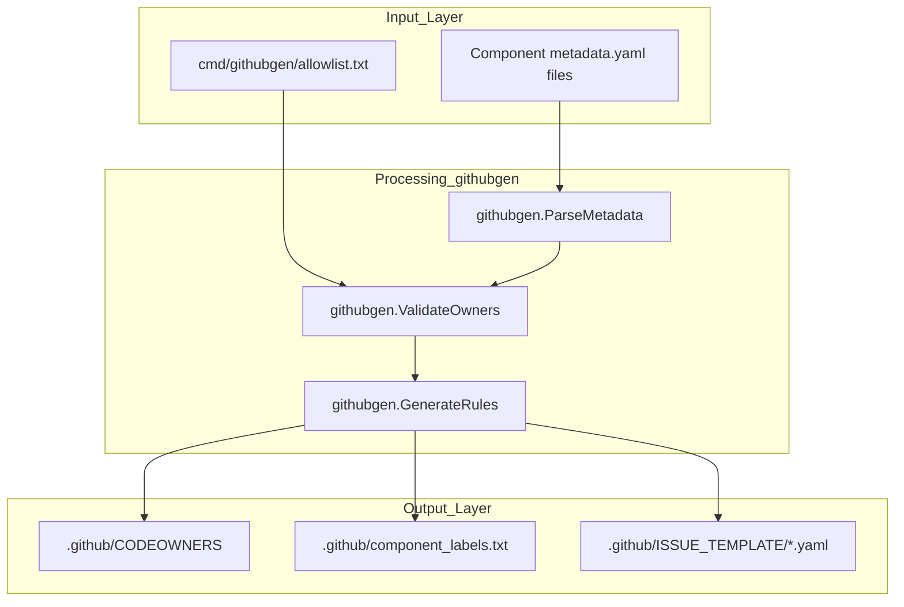
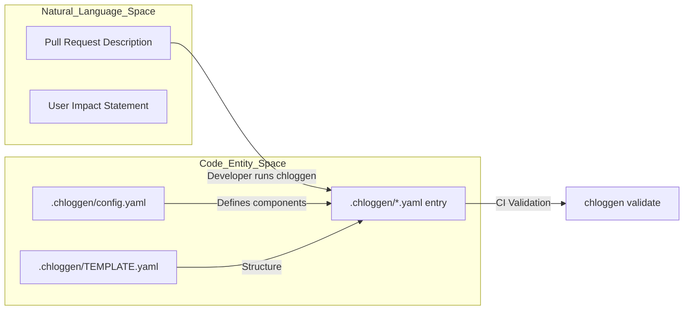
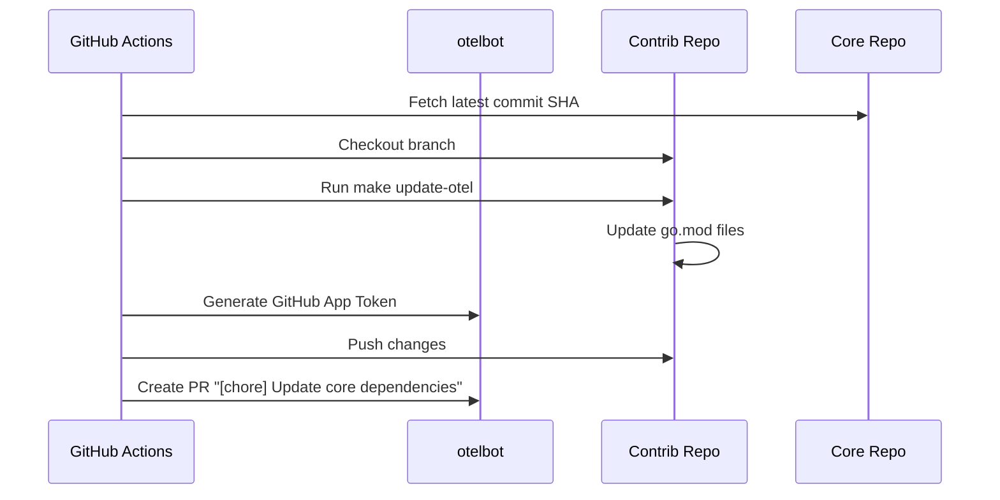
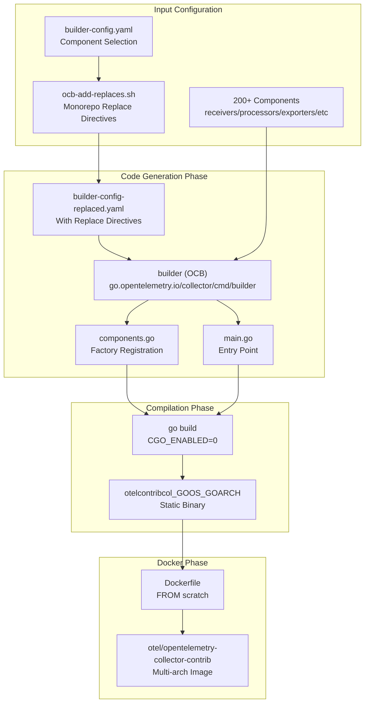
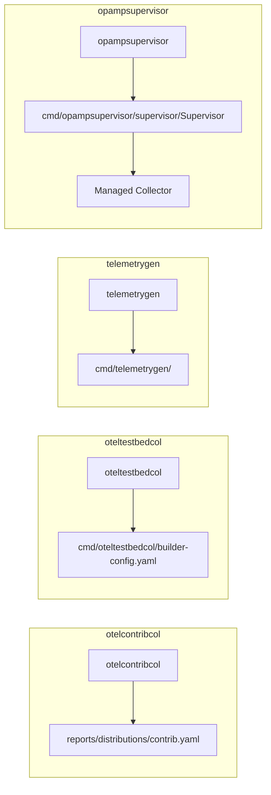
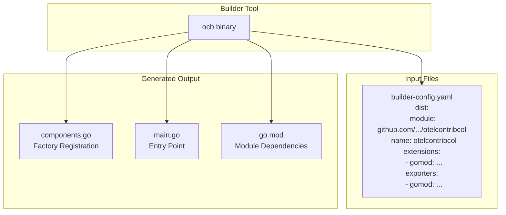
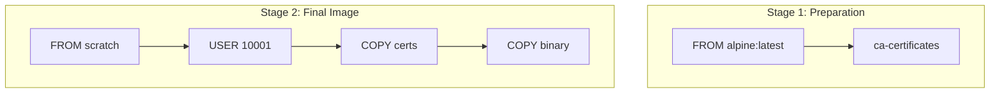
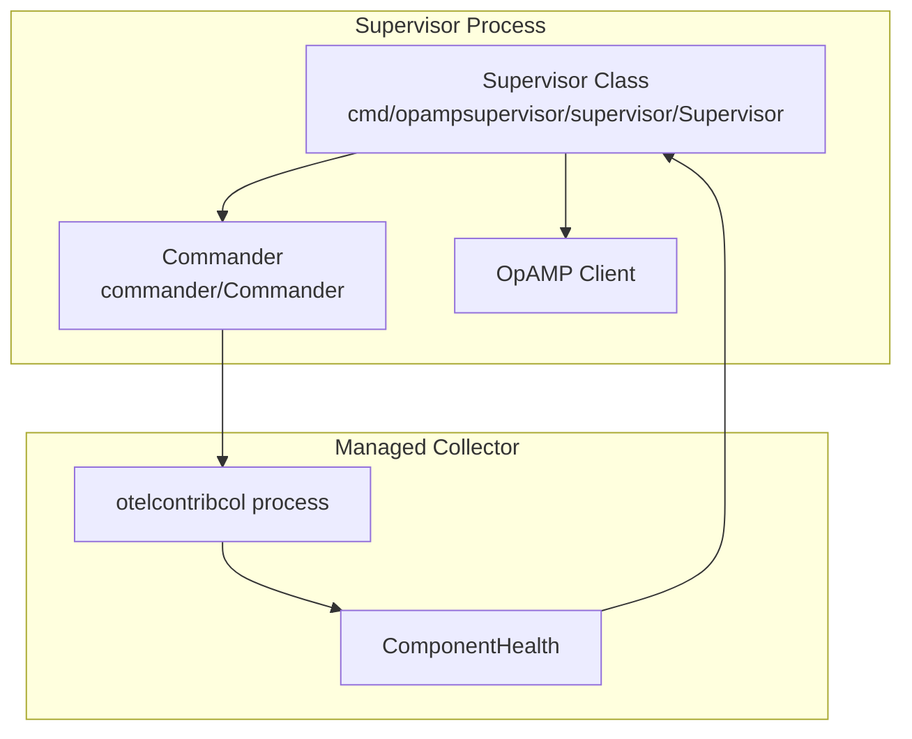

This document explains how component ownership is tracked and enforced in the OpenTelemetry Collector Contrib repository, and the automated quality gates that ensure code maintainability. This page details the implementation of the `CODEOWNERS` system, `ALLOWLIST` management, GitHub label generation, and quality enforcement through linters and changelog management.

## Component Ownership Tracking

Ownership is managed through a decentralized system where each component defines its maintainers in a `metadata.yaml` file. These definitions are then aggregated into global GitHub configuration files.

### metadata.yaml Structure
Every component must include a `metadata.yaml` file that specifies its type, stability levels, and code owners. The `codeowners` section is categorized into `active` and `emeritus` members.

**Sources:** [receiver/googlecloudspannerreceiver/metadata.yaml:1-14](), [processor/coralogixprocessor/metadata.yaml:1-12]()

### CODEOWNERS Generation
The global [.github/CODEOWNERS]() file is not edited manually. It is generated by the `githubgen` tool (defined in [internal/tools/go.mod:18]()) which parses all `metadata.yaml` files and maps component paths to their respective owners. The file starts with a warning that it is code-generated and lists the `collector-contrib-approvers` as the default owners for the entire repository [[.github/CODEOWNERS:1-12]()].

**Sources:** [.github/CODEOWNERS:1-12](), [internal/tools/go.mod:18]()

### Ownership Logic Flow
The following diagram illustrates how ownership data flows from individual components to repository-wide configuration files.

Title: Ownership and Label Generation Data Flow

**Sources:** [.github/CODEOWNERS:1-21](), [cmd/githubgen/allowlist.txt:1-6](), [internal/tools/go.mod:18]()

## Unmaintained Component Management

When a component lacks active maintainers (fewer than 3 active owners), it is subject to the unmaintained component process.

### The ALLOWLIST
The [.github/ALLOWLIST]() file tracks components that are permitted to exist in the repository despite being unmaintained or failing to meet the minimum ownership requirements [[.github/ALLOWLIST:1-36]()]. This serves as a temporary bypass for the `githubgen` validation. Additionally, `cmd/githubgen/allowlist.txt` contains a list of specific GitHub handles allowed to bypass certain ownership checks [[cmd/githubgen/allowlist.txt:1-6]()].

**Sources:** [.github/ALLOWLIST:1-36](), [cmd/githubgen/allowlist.txt:1-6]()

### Unmaintained Workflow
1.  **Detection**: If code owners are unresponsive for 6 weeks, an issue is created using the [.github/ISSUE_TEMPLATE/unmaintained.yaml]() template [[.github/ISSUE_TEMPLATE/unmaintained.yaml:1-10]()].
2.  **Labeling**: The `unmaintained` label is applied.
3.  **Removal**: If no new owners volunteer within 6 months, the component is removed from the repository [[.github/ALLOWLIST:28-36]()].

**Sources:** [.github/ISSUE_TEMPLATE/unmaintained.yaml:1-10](), [.github/ALLOWLIST:28-36]()

## GitHub Label Generation

The repository uses a mapping between file paths and GitHub labels to facilitate automated triaging. This is critical for the issue templates used for bug reports and feature requests.

### Component Labeling
The `githubgen` tool generates [.github/component_labels.txt](), which contains a comprehensive list of labels corresponding to every component in the repository [[.github/component_labels.txt:1-10]()]. These labels are used in GitHub Actions and Issue Templates to ensure the correct maintainers are notified.

| Path | Generated Label |
| :--- | :--- |
| `connector/countconnector/` | `connector/count` |
| `exporter/datadogexporter/` | `exporter/datadog` |
| `receiver/googlecloudspannerreceiver/` | `receiver/googlecloudspanner` |

**Sources:** [.github/component_labels.txt:1-10](), [.github/CODEOWNERS:31-62]()

## Code Quality Enforcement

Quality is enforced through a combination of linting, security analysis, and changelog requirements.

### CI/CD Quality Gates
The `build-and-test` workflow serves as the primary quality gate. It includes a `ci-scope` job that computes which modules need to be tested based on the files changed in a PR [[.github/workflows/build-and-test.yml:63-69]()].

*   **Linting**: The `lint-matrix` job runs `golangci-lint` across Windows and Linux environments for the affected modules [[.github/workflows/build-and-test.yml:150-165]()].
*   **Security Scanning**: `CodeQL Analysis` runs on every push to `main` to identify potential vulnerabilities [[.github/workflows/codeql-analysis.yml:1-48]()].
*   **Supply Chain Security**: The `Scorecard` workflow monitors branch protection, maintenance status, and other security metrics [[.github/workflows/scorecard.yml:1-71]()].

**Sources:** [.github/workflows/build-and-test.yml:63-165](), [.github/workflows/codeql-analysis.yml:1-48](), [.github/workflows/scorecard.yml:1-71]()

### Changelog Management (.chloggen)
Every non-trivial PR targeting the `main` branch must include a changelog entry in the `.chloggen/` directory [[.github/workflows/changelog.yml:1-4]()]. The `changelog` workflow enforces this by checking for new `.yaml` files and validating them against the configuration in [.chloggen/config.yaml]() [[.github/workflows/changelog.yml:56-74]()].

*   **Validation**: The `chlog-validate` target ensures entries follow the schema [[.github/workflows/changelog.yml:73-74]()].
*   **Link Checking**: The workflow renders a preview and uses `lycheeverse/lychee-action` to ensure all links in the changelog entry are valid [[.github/workflows/changelog.yml:77-87]()].

Title: Changelog Entry Generation and Validation

**Sources:** [.chloggen/config.yaml:1-10](), [.github/workflows/changelog.yml:1-87](), [internal/tools/go.mod:16]()

### Dependency and Link Validation
*   **Tidy Dependencies**: The `tidy-dependencies` workflow ensures that `go.mod` and `go.sum` files are up-to-date across all modules in the repository.
*   **Link Validation**: The `check-links` workflow runs `lychee` periodically to find broken links across the entire repository.
*   **Collector Versioning**: The `check-collector-module-version` job ensures that the local `otelcontribcol` matches the expected core collector versions [[.github/workflows/build-and-test.yml:40-47]()].

**Sources:** [.github/workflows/build-and-test.yml:40-47](), [.github/workflows/check-links.yaml:1-20](), [.github/workflows/tidy-dependencies.yml:1-15]()

## Build Infrastructure Quality

The repository manages a massive Go module graph consisting of over 200 modules, requiring specialized synchronization tools.

### Module Synchronization
The `update-otel` workflow automatically synchronizes the contrib repository with the latest source from `open-telemetry/opentelemetry-collector` [[.github/workflows/update-otel.yaml:1-5]()]. It uses `otelbot` to create a PR with the updated dependencies, ensuring the contrib components remain compatible with core collector changes [[.github/workflows/update-otel.yaml:61-71]()].

**Sources:** [.github/workflows/update-otel.yaml:1-71]()

Title: Core Dependency Update Process

**Sources:** [.github/workflows/update-otel.yaml:11-71]()

# Collector Binary Assembly

This document describes the process of assembling custom OpenTelemetry Collector binaries from the contrib repository. It covers the OpenTelemetry Collector Builder (OCB) tool, Makefile build targets, Docker image construction, and the specialized supervisor for remote management.

For information about the build system infrastructure and CI/CD pipelines, see [Build System and Development Infrastructure](#2). For information about the builder configuration file format and component selection, see [Builder Configuration System](#3.1). For information about the OpAMP supervisor that manages collector instances, see [OpAMP Supervisor for Agent Management](#3.2).

## Overview

The OpenTelemetry Collector Contrib repository assembles multiple binary artifacts from hundreds of components. The assembly process uses the OpenTelemetry Collector Builder (OCB) tool to generate Go source code that imports selected components, followed by standard Go compilation to produce executable binaries. The primary binary is `otelcontribcol`, which includes components defined in the distribution manifest.

**Binary Assembly Flow**

The assembly process consists of three phases: code generation using OCB, Go compilation producing static binaries, and Docker image construction for container deployments. Each phase is orchestrated through Makefile targets that handle platform-specific configuration.

Sources: [cmd/otelcontribcol/builder-config.yaml:9-14](), [reports/distributions/contrib.yaml:1-254]()

## Binary Artifacts

The repository produces several primary binary artifacts, each serving a distinct purpose in the OpenTelemetry ecosystem:

| Binary | Purpose | Component Inclusion | Key Features |
|--------|---------|-----------------|--------------|
| `otelcontribcol` | Production collector | Extensive (see `contrib.yaml`) | Standard distribution for Contrib |
| `oteltestbedcol` | Testing collector | Performance focused | Subset for load testing and benchmarks |
| `telemetrygen` | Data generator | N/A | Synthetic trace/metric/log generation |
| `opampsupervisor` | Fleet manager | N/A | Remote configuration, OpAMP protocol support |

**Binary Artifact Relationships**

Each binary serves a specific role: `otelcontribcol` for production deployments, `oteltestbedcol` for performance testing, `telemetrygen` for generating test data, and `opampsupervisor` for managing collector instances via the Open Agent Management Protocol (OpAMP).

Sources: [.github/CODEOWNERS:23-27](), [cmd/opampsupervisor/supervisor/supervisor.go:122-162](), [.chloggen/config.yaml:13-17]()

## Makefile Build Targets

The build process is orchestrated through Makefile targets that invoke the OCB tool and Go compiler with appropriate configuration.

### Code Generation and Binary Compilation

The build system utilizes internal scripts like `ocb-add-replaces.sh` to modify the builder configuration, adding `replace` directives for monorepo modules before OCB generates the collector code. This ensures that the generated binary uses the local versions of components within the repository rather than attempting to fetch them from remote sources.

The compilation typically uses `CGO_ENABLED=0` to produce a fully static binary with no C dependencies, enabling deployment to minimal container images like `scratch`.

Sources: [cmd/otelcontribcol/builder-config.yaml:1-14](), [internal/buildscripts/ocb-add-replaces.sh:1-10]()

## OpenTelemetry Collector Builder (OCB)

The OCB tool is the core component that generates collector binaries from component configurations. It reads a YAML configuration specifying component modules, generates Go code that imports and registers these components with the collector framework, and produces a buildable Go module.

**Builder Tool Architecture**

The `builder-config.yaml` defines the distribution metadata and the list of `receivers`, `processors`, `exporters`, `extensions`, `connectors`, and `providers` to be included in the final binary. For more details on the OCB configuration and generation process, see [Builder Configuration System](#3.1).

Sources: [cmd/otelcontribcol/builder-config.yaml:9-100](), [cmd/oteltestbedcol/builder-config.yaml:1-20]()

## Docker Image Construction

The repository provides Dockerfile templates for each binary artifact, following a multi-stage build pattern optimized for minimal image size.

### Base Image Pattern

All Dockerfiles follow a pattern where a build stage prepares the environment and the final stage uses `FROM scratch` (empty base image) and copies only the necessary certificates and binary.

**Dockerfile Multi-Stage Pattern**

The binary runs as a non-root user (UID 10001) for security. For the `opampsupervisor`, the image includes both the supervisor binary and the managed collector binary.

Sources: [exporter/loadbalancingexporter/example/Dockerfile:1-18](), [exporter/clickhouseexporter/example/Dockerfile:1-11]()

## Multi-Architecture Build Support

The build system supports cross-compilation for multiple operating systems and architectures. The `versions.yaml` file tracks the versioning for the distribution, ensuring consistency across all generated artifacts.

Sources: [cmd/otelcontribcol/builder-config.yaml:13](), [versions.yaml:1-10]()

## OpAMP Supervisor for Agent Management

The `opampsupervisor` is a specialized binary that manages the lifecycle of an OpenTelemetry Collector instance. It implements the `Supervisor` struct to communicate with an OpAMP server for remote configuration and health reporting.

**Supervisor Architecture**

The supervisor handles starting and stopping the collector process via the `commander.Commander`, merging local and remote configurations, and reporting the "effective config" back to the OpAMP server. For details, see [OpAMP Supervisor for Agent Management](#3.2).

Sources: [cmd/opampsupervisor/supervisor/supervisor.go:122-162](), [cmd/opampsupervisor/supervisor/supervisor.go:129-132](), [cmd/opampsupervisor/supervisor/supervisor.go:80-82]()

## Summary

The collector binary assembly process transforms component configurations into deployable artifacts through a pipeline of code generation and compilation. The build system supports multiple architectures and provides specialized binaries for production, testing, and management.

Key build artifacts:
- `otelcontribcol`: The standard production distribution.
- `oteltestbedcol`: Optimized for performance benchmarking.
- `telemetrygen`: Used for generating synthetic telemetry data.
- `opampsupervisor`: Enables remote management of collector fleets.

Sources: [cmd/otelcontribcol/builder-config.yaml:1-14](), [reports/distributions/contrib.yaml:1-5](), [cmd/opampsupervisor/supervisor/supervisor.go:122-129]()