In the OpenTelemetry Collector, a **Connector** is a specialized component that acts as both an Exporter and a Receiver. It bridges two pipeline segments, enabling the output of one pipeline (e.g., traces) to flow as the input for another (e.g., metrics). This capability facilitates advanced pipeline topologies, such as deriving new telemetry signals from existing ones or routing data dynamically based on content.

Connectors are critical building blocks that enable complex data flows and transformations within the collector architecture.

---

## Connector Core Architecture and Purpose

Connectors are implemented as factories producing components that implement specialized creation methods like `CreateTracesToMetrics` [connector/spanmetricsconnector/factory.go:33-33]() or `CreateTracesToTraces` [connector/routingconnector/factory.go:41-41](). They maintain internal state, including caches for resource metrics and aggregation stores, often running background goroutines to flush data downstream at configured intervals [connector/spanmetricsconnector/connector.go:181-195](), [connector/servicegraphconnector/connector.go:160-168]().

### High-Level Data Flow in a Span Metrics Connector

The `spanmetricsconnector` bridges a traces pipeline to a metrics pipeline by consuming spans and producing metrics derived from them.

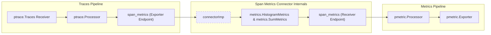

- The `connectorImp` receives trace data, aggregates RED metrics, and periodically triggers `metricsConsumer.ConsumeMetrics` [connector/spanmetricsconnector/connector.go:65-102]().
- Aggregation logic is managed via internal types like `resourceMetrics` which hold histograms and sums [connector/spanmetricsconnector/connector.go:104-111]().

**Sources:** [connector/spanmetricsconnector/factory.go:29-36](), [connector/spanmetricsconnector/connector.go:65-111]()

---

## Metrics-Generating Connectors Overview

Metrics-generating connectors consume one signal type (usually traces) and produce metrics as output. Common use cases include generating RED (Request, Error, Duration) metrics or building service dependency graphs.

| Connector | Primary Function | Major Code Entities |
| :--- | :--- | :--- |
| **spanmetrics** | Aggregates RED metrics (calls, duration, events) from spans. | `connectorImp`, `resourceMetrics`, `metrics.HistogramMetrics` [connector/spanmetricsconnector/connector.go:65-102]() |
| **servicegraph** | Constructs service dependency graphs from traces. | `serviceGraphConnector`, `store.Store`, `metricSeries` [connector/servicegraphconnector/connector.go:66-94]() |
| **count** | Counts occurrences of signals by attributes. | See child page [Metrics-Generating Connectors](#14.1). |
| **signaltometrics** | Generic signal-to-metric conversion. | See child page [Metrics-Generating Connectors](#14.1). |

### Span Metrics Connector
The `spanmetricsconnector` aggregates span data into metrics representing call counts, error counts, and latency histograms [connector/spanmetricsconnector/README.md:35-58](). It supports both `explicit` and `exponential` histograms and allows configuring dimensions extracted from span attributes [connector/spanmetricsconnector/config.go:116-121](). It utilizes a `resourceMetrics` cache to manage state across batches and avoid memory leaks [connector/spanmetricsconnector/connector.go:75-75]().

### Service Graph Connector
The `servicegraphconnector` analyzes traces for parent-child relationships to infer service dependencies [connector/servicegraphconnector/README.md:31-43](). It pairs client/server spans and maintains them in an in-memory `store.Store` until the request pair is complete or expires [connector/servicegraphconnector/connector.go:161-168](). It supports detecting virtual nodes for messaging system interactions and database requests [connector/servicegraphconnector/connector.go:33-40]().

For details, see [Metrics-Generating Connectors](#14.1).

**Sources:** [connector/spanmetricsconnector/README.md:35-58](), [connector/servicegraphconnector/connector.go:137-158](), [connector/spanmetricsconnector/config.go:116-121]()

---

## Routing and Pipeline Control Connectors

Routing connectors govern how telemetry flows between pipelines based on dynamic conditions, supporting multi-pipeline fan-out or conditional processing.

### Bridge: OTTL Context to Routing Logic
The following diagram maps the natural language concept of "Routing" to the code entities that execute it using `ottl` (OpenTelemetry Transformation Language).

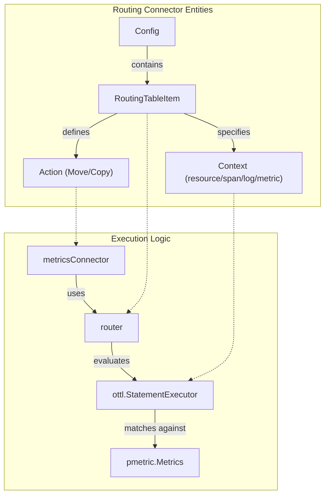

### Routing Connector
The `routingconnector` routes signals based on [OTTL](../pkg/ottl/README.md) statements. It can evaluate conditions across various contexts (e.g., `resource`, `span`, `log`, `metric`, `datapoint`) to either `move` or `copy` data to target pipelines [connector/routingconnector/config.go:119-147](). It supports context inference, allowing users to omit the `context` field if the paths (e.g., `resource.attributes["env"]`) are explicit [connector/routingconnector/README.md:47-60]().

### Datadog Connector
The `datadogconnector` converts OpenTelemetry trace signals into Datadog-specific APM statistics. It acts as a bridge for users sending data to Datadog backends while maintaining OTel-native pipelines.

For details, see [Routing and Pipeline Control Connectors](#14.2).

**Sources:** [connector/routingconnector/config.go:119-147](), [connector/routingconnector/README.md:47-60](), [connector/routingconnector/metrics.go:24-31]()

---

## Relationship and Overview of Connector Roles

Connectors enable complex, modular topologies by decoupling signal ingestion from specialized processing:

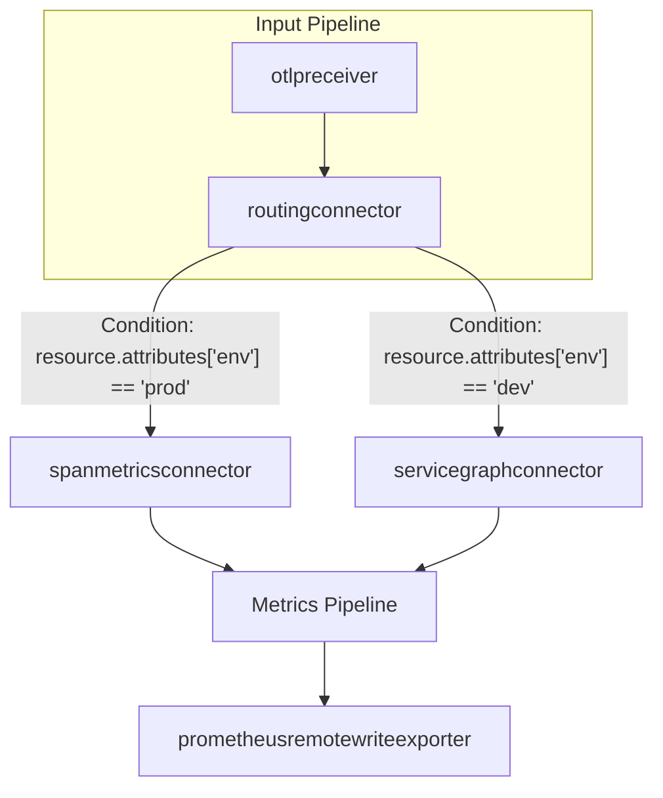

- **Metrics-Generating Connectors**: Synthesize new signals (metrics) from existing ones (traces/logs).
- **Routing Connectors**: Act as traffic controllers, directing signals to the appropriate specialized connectors or exporters based on `RoutingTableItem` configurations [connector/routingconnector/config.go:119-122]().

---

## Key Code Entities and Internal Mechanisms

- **`connectorImp` (spanmetrics)**: The core implementation struct that handles the `ConsumeTraces` logic and manages the `resourceMetrics` cache [connector/spanmetricsconnector/connector.go:65-102]().
- **`serviceGraphConnector`**: Manages the lifecycle of service dependency tracking, including a `metricFlushLoop` for periodic export [connector/servicegraphconnector/connector.go:173-191]().
- **`HistogramMetrics` (internal)**: Interface used by `spanmetricsconnector` to abstract between explicit and exponential histogram implementations [connector/spanmetricsconnector/internal/metrics/metrics.go:20-25]().
- **`router` (routing)**: A generic structure used by `metricsConnector`, `tracesConnector`, and `logsConnector` to evaluate OTTL statements and dispatch data to the correct consumer [connector/routingconnector/router.go:34-42]().

**Sources:** [connector/spanmetricsconnector/connector.go:65-102](), [connector/servicegraphconnector/connector.go:173-191](), [connector/routingconnector/router.go:34-42]()

---

## Further Reading and Child Pages

- **[Metrics-Generating Connectors](#14.1)**: Detailed documentation on `spanmetrics`, `servicegraph`, `signaltometrics`, and `count` connectors.
- **[Routing and Pipeline Control Connectors](#14.2)**: Detailed documentation on the `routingconnector`, `datadogconnector`, and other pipeline flow control components.

# Metrics-Generating Connectors


Metrics-generating connectors are specialized components that bridge pipeline segments by deriving metric signals from other telemetry types such as traces, logs, or metrics. They enable real-time aggregation and transformation within the OpenTelemetry Collector's pipeline without reliance on external processing engines.

## Overview and Data Flow

These connectors consume source signals (e.g., traces) to produce resulting metric signals that reflect derived analytics such as RED metrics (Request, Error, Duration), service dependency graphs, generic signal-to-metric conversions, or count aggregations.

### Generic Data Flow

This diagram illustrates how metrics-generating connectors integrate between trace pipelines and metric pipelines, serving as bridges that convert telemetry types and enrich data flows:

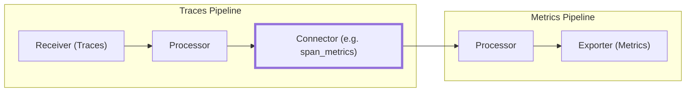

Sources:
[connector/spanmetricsconnector/README.md:14-23](),
[connector/servicegraphconnector/README.md:14-23]()

---

## 1. Span Metrics Connector (`spanmetricsconnector`)

The `spanmetricsconnector` aggregates Request, Error, and Duration (RED) metrics directly from span data. It supersedes the legacy `spanmetrics` processor, aligning more closely with OpenTelemetry specifications and adding features like exponential histograms and flexible configuration.

### Implementation Details

- The core logic is encapsulated in the `connectorImp` struct [connector/spanmetricsconnector/connector.go:65-102](), which manages caching of resource-level metrics and coordinates the conversion of span attributes into metric dimensions.
- **Request Counts:** Computed as the number of spans seen per unique set of dimensions [connector/spanmetricsconnector/README.md:39-45]().
- **Error Counts:** Derived from Request counts filtered for an `Error` Status Code dimension [connector/spanmetricsconnector/README.md:47-51]().
- **Duration:** Computed from the difference between span start and end times, recorded in histograms [connector/spanmetricsconnector/README.md:53-58]().

### Principal Code Entities

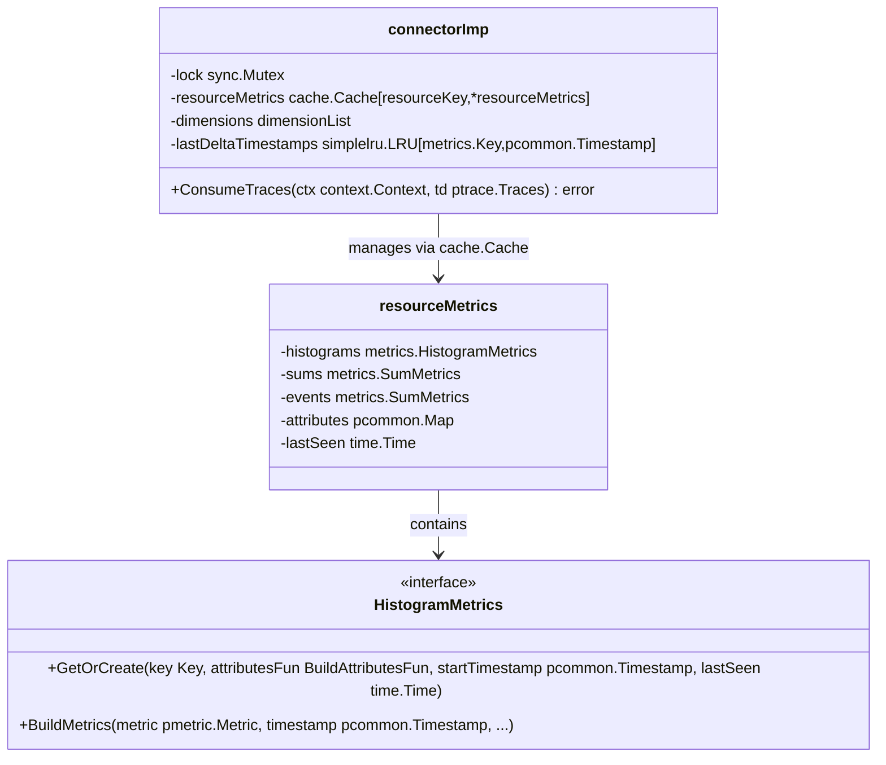

### Configuration and Features

- **Aggregation Temporality:** Supports `AGGREGATION_TEMPORALITY_CUMULATIVE` and `AGGREGATION_TEMPORALITY_DELTA` [connector/spanmetricsconnector/config.go:21-22]().
- **Histograms:** Supports both explicit bucket histograms [connector/spanmetricsconnector/internal/metrics/metrics.go:33-38]() and exponential histograms [connector/spanmetricsconnector/internal/metrics/metrics.go:40-45]().
- **Dimensions:** Core metric labels include `service.name`, `span.name`, `span.kind`, and `status.code` or `otel.status_code` [connector/spanmetricsconnector/README.md:60-67]().
- **Cardinality Control:** Includes `AggregationCardinalityLimit` to prevent memory exhaustion by mapping excessive dimensions to an `otel.metric.overflow` key [connector/spanmetricsconnector/internal/metrics/metrics.go:95-132]().

Feature gates control legacy naming conventions, inclusion of unique `collector.instance.id`, and unit changes (ms to s) [connector/spanmetricsconnector/factory.go:43-49]().

Sources:
[connector/spanmetricsconnector/connector.go:65-102](),
[connector/spanmetricsconnector/connector.go:179-196](),
[connector/spanmetricsconnector/config.go:42-114](),
[connector/spanmetricsconnector/README.md:30-66](),
[connector/spanmetricsconnector/internal/metrics/metrics.go:18-83](),
[connector/spanmetricsconnector/internal/metrics/metrics.go:95-132]()

---

## 2. Service Graph Connector (`servicegraphconnector`)

The `servicegraphconnector` derives service dependency graphs by analyzing trace spans for parent-child and message-passing relationships to map inter-service interactions [connector/servicegraphconnector/README.md:31-33]().

### Relationship Detection and Data Handling

- Identifies edges by pairing spans with complementary `span.kind`:
  - Client spans (`SPAN_KIND_CLIENT`) paired with server spans (`SPAN_KIND_SERVER`) [connector/servicegraphconnector/README.md:52-52]().
  - Producer-consumer relationships for messaging systems [connector/servicegraphconnector/README.md:53-53]().
  - Database request detection via `db.name` attributes [connector/servicegraphconnector/README.md:54-54]().
- Spans are stored temporarily in an in-memory store to await pairing until matched or expired [connector/servicegraphconnector/README.md:56-59]().

### Service Graph Connector Flow

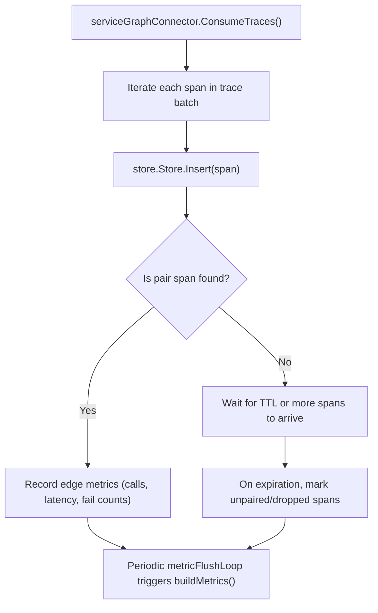

### Key Components and Structures

- **`serviceGraphConnector` struct:** Maintains maps to track request totals (`reqTotal`), failed requests (`reqFailedTotal`), and duration histograms for client and server sides [connector/servicegraphconnector/connector.go:66-94]().
- **`store.Store`:** Internal span pairing storage with TTL and max capacity [connector/servicegraphconnector/connector.go:161-161]().
- **Metric dimensions:** Includes `client`, `server`, and `connection_type` (e.g., `messaging_system`, `database`) [connector/servicegraphconnector/README.md:72-83]().

Sources:
[connector/servicegraphconnector/connector.go:66-94](),
[connector/servicegraphconnector/connector.go:160-171](),
[connector/servicegraphconnector/README.md:48-83](),
[connector/servicegraphconnector/connector_test.go:68-206]()

---

## 3. Signal to Metrics Connector (`signaltometricsconnector`)

The `signaltometricsconnector` allows deriving metrics from any input telemetry signal (traces, logs, metrics, or profiles) using the OpenTelemetry Transformation Language (OTTL).

### OTTL-Based Metric Definition and Aggregation

- Defines metrics in a configuration structure specifying `MetricInfo`:
  - Metric `name`, `type` (sum, gauge, histogram, exponential histogram), and `unit`.
  - `attributes` to extract for metric labels, which may be keys or OTTL expressions.
  - `conditions` evaluated via OTTL to select signals.
- Uses specialized OTTL contexts (e.g. `ottlspan`, `ottllog`, `ottldatapoint`) for each signal type to extract values and attributes for aggregation.

### Component Architecture

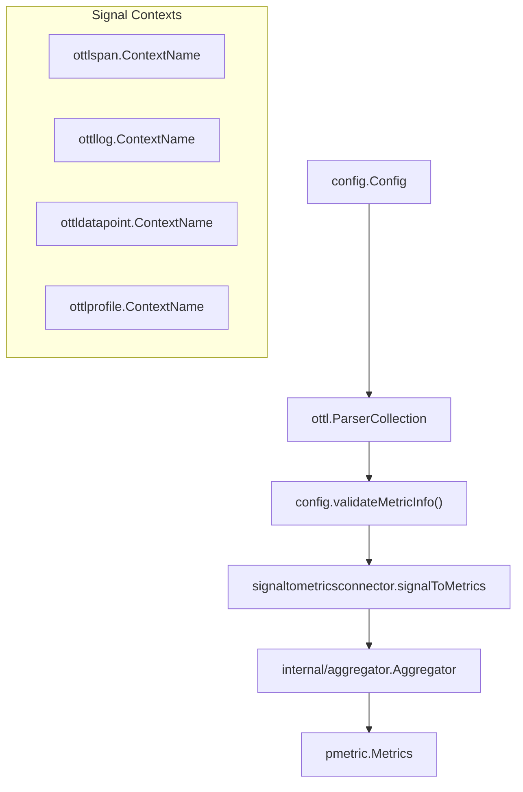

---

## 4. Count Connector (`countconnector`)

The `countconnector` increments counters for received telemetry events (spans, logs, or metrics) and outputs the resulting counts as metrics. It allows filtering events via OTTL expressions to define what should be counted.

---

## Technical Summary Table

| Connector               | Source Signal(s)         | Primary Metric Types        | Key Functional Characteristic                                       |
|------------------------|--------------------------|-----------------------------|---------------------------------------------------------------------|
| `span_metrics`         | Traces                   | Sum, Histogram              | Aggregates RED metrics from spans [connector/spanmetricsconnector/README.md:37-58](). |
| `service_graph`        | Traces                   | Sum, Histogram              | Builds service dependency graphs by pairing spans [connector/servicegraphconnector/README.md:31-33](). |
| `signaltometrics`      | Traces, Logs, Metrics, Profiles | Sum, Gauge, Histogram       | Uses OTTL to define flexible signal-to-metric transformations. |
| `count`                | Spans, Logs, Metrics     | Sum (Counter)               | Counts telemetry occurrence by user-defined criteria. |

Sources:
[connector/spanmetricsconnector/connector.go:65-102](),
[connector/servicegraphconnector/connector.go:66-94](),
[connector/spanmetricsconnector/README.md:37-58]()

# Routing and Pipeline Control Connectors


Routing and pipeline control connectors act as internal traffic controllers within an OpenTelemetry Collector service. They neither receive data from the outside world nor export it externally; instead, they orchestrate the flow of telemetry data between multiple internal pipelines. This enables advanced pipeline topologies such as conditional routing based on content, load balancing, failover, and signal transformation for vendor-specific use cases like computing APM statistics for Datadog.

---

## Routing Connector

The `routingconnector` routes telemetry signals (logs, metrics, traces) to downstream pipelines based on rules expressed in the OpenTelemetry Transformation Language (OTTL). It supports conditional routing using resource attributes, signal attributes, or request metadata, enabling multi-tenant, region-based, or other content-specific routing scenarios.

### Architecture and Data Flow

The routing connector acts simultaneously as an exporter (receives data from an upstream pipeline) and receiver (feeds data into multiple downstream pipelines). It evaluates incoming data against a routing table of OTTL expressions which specify routing conditions and target pipelines.

1.  **Input Telemetry**: Logs, metrics, or traces are ingested via the connector's `ConsumeLogs`, `ConsumeMetrics`, or `ConsumeTraces` methods [connector/routingconnector/logs.go:62](), [connector/routingconnector/metrics.go:63](), [connector/routingconnector/traces.go:62]().
2.  **OTTL Context Selection**: The component supports various OTTL evaluation contexts: `resource`, `span`, `metric`, `datapoint`, `log`, or `request` [connector/routingconnector/config.go:119-121]().
3.  **Condition Evaluation**: For each incoming data entity, the routing table entries are evaluated. Each entry specifies either a `statement` or a `condition` to match [connector/routingconnector/config.go:123-132]().
4.  **Action Handling**:
    *   **move** (default): Matched data are removed from the current batch and routed to the specified pipelines, preventing further matching [connector/routingconnector/config.go:19]().
    *   **copy**: Matched data are copied to the specified pipelines but remain for evaluation by subsequent routes, enabling multi-pipeline routing [connector/routingconnector/config.go:18]().
5.  **Default Pipelines**: Data not matching any routing rule are sent to the `default_pipelines` if configured [connector/routingconnector/config.go:46]().

### Routing Connector - Natural Language to Code Entities

The following diagram maps high-level routing features to specific implementation entities in the `routingconnector` package.

**Routing Implementation Map**
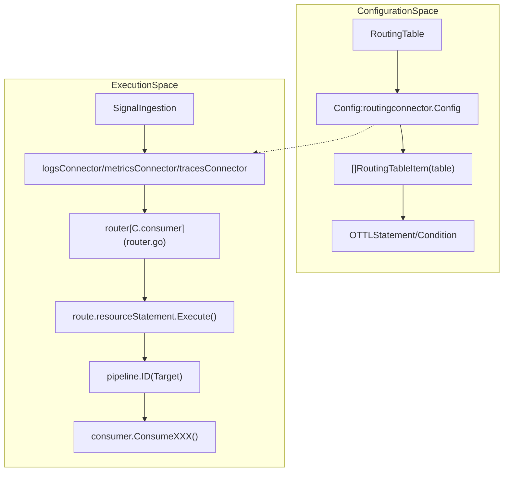
Sources: [connector/routingconnector/config.go:32-52](), [connector/routingconnector/router.go:34-45](), [connector/routingconnector/logs.go:22-29]().

### Implementation Details

The connector is implemented via signal-specific structs that wrap a shared `router`:
*   `metricsConnector`: Manages `pmetric.Metrics` routing using `pmetricutil` [connector/routingconnector/metrics.go:23-30]().
*   `logsConnector`: Manages `plog.Logs` routing using `plogutil` [connector/routingconnector/logs.go:22-29]().
*   `tracesConnector`: Manages `ptrace.Traces` routing using `ptraceutil` [connector/routingconnector/traces.go:22-29]().

The `router` maintains a `routeSlice` containing compiled OTTL statements and the mapping to downstream consumers [connector/routingconnector/router.go:34-45](). It handles the logic of splitting telemetry batches based on whether a resource, record, or request matches a specific route [connector/routingconnector/logs.go:62-157]().

---

## Datadog Connector

The `datadogconnector` is a specialized component that derives APM statistics (metrics) from service traces. This is required for trace-emitting services to appear in the Datadog APM product. It leverages shared Datadog infrastructure from `pkg/datadog` and `internal/datadog` to ensure consistency with the Datadog Agent's behavior.

### Functional Role
*   **Input**: Consumes `traces` from a pipeline.
*   **Output**: Produces `metrics` (APM stats) and can optionally forward the original `traces` to another pipeline.
*   **APM Stats Computation**: It computes request rates, error counts, and latency distributions. This was previously part of the `datadogexporter` but is now handled by the connector to ensure stats are computed before sampling [exporter/datadogexporter/go.mod:29-30](), [connector/datadogconnector/go.mod:6-8]().

### Datadog Connector - Code Entity Mapping

This diagram illustrates the relationship between the connector and the underlying Datadog mapping libraries.

**Datadog Logic and Dependencies**
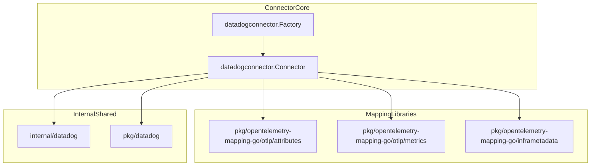
Sources: [connector/datadogconnector/go.mod:6-10](), [exporter/datadogexporter/go.mod:18-20](), [receiver/datadogreceiver/go.mod:15-16]().

### Configuration and Features
*   **Stats Computation**: Leverages `github.com/DataDog/datadog-agent/pkg/trace/stats` to calculate metrics from incoming OTLP spans [receiver/datadogreceiver/go.mod:10]().
*   **Trace Obfuscation**: Uses `github.com/DataDog/datadog-agent/pkg/obfuscate` to ensure sensitive data is removed before processing [receiver/datadogreceiver/go.mod:7]().
*   **Quantile Calculation**: Uses `github.com/DataDog/datadog-agent/pkg/util/quantile` for accurate latency distribution reporting [exporter/datadogexporter/go.mod:25]().

---

## Other Pipeline Control Connectors

The repository includes several other connectors that manage the flow and availability of telemetry data.

### Failover Connector
Routes telemetry to a primary pipeline and automatically switches to secondary pipelines if the primary fails. This ensures high availability of telemetry delivery by detecting consumer errors and redirecting traffic.

### Round Robin Connector
Distributes telemetry batches across multiple downstream pipelines using a round-robin algorithm, enabling load balancing across multiple exporters or processing instances to prevent bottlenecks.

### OTLP JSON Connector
A utility connector that converts internal OTLP data structures into JSON format. This is particularly useful for debugging or for integration with legacy systems that cannot parse Protobuf but can ingest JSON-encoded OTLP data.

---

## Summary of Signal Transitions

| Connector | Input Signal | Output Signal | Primary Use Case |
| :--- | :--- | :--- | :--- |
| `routing` | Traces/Metrics/Logs | Same as input | Content-based routing via OTTL [connector/routingconnector/config.go:32]() |
| `datadog` | Traces | Metrics & Traces | APM stats calculation & trace forwarding [connector/datadogconnector/go.mod:6]() |
| `failover` | Any | Same as input | Pipeline high availability |
| `roundrobin` | Any | Same as input | Pipeline load balancing |
| `otlpjson` | Any | Same as input | JSON serialization of OTLP data |

### Sources
- [connector/routingconnector/config.go:1-146]()
- [connector/routingconnector/router.go:1-120]()
- [connector/routingconnector/logs.go:1-177]()
- [connector/routingconnector/metrics.go:1-209]()
- [connector/routingconnector/traces.go:1-177]()
- [connector/datadogconnector/go.mod:1-27]()
- [exporter/datadogexporter/go.mod:1-50]()
- [receiver/datadogreceiver/go.mod:1-44]()
- [pkg/datadog/go.mod:1-57]()
- [internal/datadog/go.mod:1-20]()

# Observability Platform Integrations


The OpenTelemetry Collector Contrib repository provides a wide array of integrations for major SaaS observability platforms. These components allow users to ingest telemetry from vendor-specific protocols and export OTLP data to these platforms by translating it into their native formats.

This page provides a high-level overview of these integrations. Detailed technical documentation for specific platforms is available in the child pages linked below.

## Splunk Integration

The Splunk integration is a robust ecosystem within the collector, supporting high-performance data ingestion and export using the Splunk HTTP Event Collector (HEC) protocol. It leverages shared internal packages to ensure consistency across the receiver and exporter.

### Architecture and Data Flow

The integration relies on a central translation layer in `pkg/translator/splunk` that maps OpenTelemetry `pdata` structures to Splunk's JSON event format [exporter/splunkhecexporter/client_test.go:44](). This includes handling specialized fields like `index`, `source`, and `sourcetype` [internal/splunk/common.go:13-15](). The exporter and receiver both utilize constants defined in `internal/splunk` to manage HEC-specific headers and metadata labels [internal/splunk/common.go:7-26]().

The following diagram illustrates the relationship between the Splunk components and the shared translation logic:

**Splunk Component Relationship**
```mermaid
graph TD
    subgraph "Splunk_Integration_Components"
        [splunkhecreceiver] --> |"uses"| [translator_splunk]
        [splunkhecexporter] --> |"uses"| [translator_splunk]
        [splunkhecreceiver] --> |"uses"| [internal_splunk]
        [splunkhecexporter] --> |"uses"| [internal_splunk]
    end

    subgraph "Shared_Packages"
        [translator_splunk] --> |"pkg/translator/splunk"| [pdata]
        [internal_splunk] --> |"internal/splunk"| [Common_Constants_Utils]
    end

    subgraph "External_Interface"
        [Splunk_HEC_Endpoint] <--> [splunkhecexporter]
        [Client_App] --> |"HEC_Protocol"| [splunkhecreceiver]
    end
```
*Sources: [receiver/splunkhecreceiver/receiver.go:30-32](), [exporter/splunkhecexporter/client_test.go:43-44](), [internal/splunk/common.go:7-26]()*

### Key Components
*   **splunkhecreceiver**: Implements a HEC-compatible endpoint that accepts logs and metrics [receiver/splunkhecreceiver/receiver.go:85-95](). It supports Gzip compression [receiver/splunkhecreceiver/receiver.go:57-58]() and integration with the `ackextension` for reliable delivery using `handleAck` [receiver/splunkhecreceiver/receiver.go:142-149]().
*   **splunkhecexporter**: Sends telemetry to Splunk via HEC. It manages authentication via `BuildHECAuthHeader` [internal/splunk/common.go:30-32]() and supports batching for logs, metrics, and traces [exporter/splunkhecexporter/client_test.go:88-141]().
*   **pkg/translator/splunk**: Contains the core logic for converting OTLP signals into Splunk events, managing default HEC fields and OpenTelemetry attribute mappings [receiver/splunkhecreceiver/receiver.go:31]().

For details, see [Splunk Integration](#15.1).

## Other Observability Platform Exporters

Beyond Splunk, the repository contains exporters for numerous SaaS vendors. These exporters typically handle authentication, protocol translation, and efficient data transmission.

### SignalFx (Splunk Observability)
The `signalfxexporter` facilitates integration with the SignalFx platform. It uses specific headers such as `X-Sf-Token` for authentication [internal/splunk/common.go:8]() and maps OTLP attributes to SignalFx dimensions and events [exporter/signalfxexporter/README.md:21-26](). It includes a sophisticated `MetricTranslator` to convert OTLP metrics to SignalFx-compatible formats [exporter/signalfxexporter/factory_test.go:124-132]().

### Sumo Logic
The `sumologicexporter` sends logs and metrics to Sumo Logic via HTTP. It supports OTLP, JSON, and text log formats [exporter/sumologicexporter/config.go:40-47](). It can also decompose OTLP Histograms and Summaries into individual metrics for compatibility [exporter/sumologicexporter/config.go:53-57](). The exporter integrates with the `sumologicextension` for authentication and base URL management [exporter/sumologicexporter/exporter.go:181-191]().

### Columnar Transport and Scaling
*   **OTel Arrow**: Components for high-efficiency transport using Apache Arrow to reduce bandwidth via the `otelarrowexporter` and `otelarrowreceiver`.
*   **loadbalancingexporter**: Scales deployments by routing telemetry based on keys like `traceID`, ensuring data consistency at the backend.

### Vendor Exporter Summary

| Platform | Component | Stability (Logs/Metrics/Traces) | Primary Protocol |
| :--- | :--- | :--- | :--- |
| **Sumo Logic** | `sumologicexporter` | Beta / Beta / Beta [exporter/sumologicexporter/metadata.yaml:7]() | HTTP (OTLP/JSON) |
| **SignalFx** | `signalfxexporter` | Beta (Metrics/Logs) / Deprecated (Traces) [exporter/signalfxexporter/README.md:5-6]() | Protobuf / SignalFx |
| **Splunk HEC**| `splunkhecexporter` | Contrib Distribution | HTTP (JSON) |

The following diagram bridges the natural language platform names to their respective code entities:

**Platform to Code Entity Mapping**
```mermaid
graph LR
    subgraph "Platform_Concepts"
        [SignalFx]
        [Sumo_Logic]
        [Splunk_HEC]
    end

    subgraph "Code_Entities"
        [signalfxexporter]
        [sumologicexporter]
        [splunkhecexporter]
        [sumologicextension]
        [MetricTranslator]
    end

    [SignalFx] --- [signalfxexporter]
    [signalfxexporter] --- [MetricTranslator]
    [Sumo_Logic] --- [sumologicexporter]
    [sumologicexporter] --- [sumologicextension]
    [Splunk_HEC] --- [splunkhecexporter]
```
*Sources: [exporter/signalfxexporter/README.md:2-10](), [exporter/sumologicexporter/README.md:2-10](), [exporter/signalfxexporter/factory_test.go:126](), [exporter/sumologicexporter/exporter.go:31]()*

For details, see [Other Observability Platform Exporters](#15.2).

# Splunk Integration


The Splunk integration in the OpenTelemetry Collector Contrib repository provides a comprehensive suite of components for bidirectional telemetry exchange with Splunk platforms. This includes support for the Splunk HTTP Event Collector (HEC) for high-performance data ingestion and export, as well as a specialized receiver for monitoring the operational health of Splunk Enterprise deployments.

This page documents the Splunk HEC (HTTP Event Collector) receiver and exporter, the Splunk Enterprise receiver for admin metrics, the shared `internal/splunk` and `pkg/translator/splunk` packages, and the data transformation between OTLP and Splunk formats.

## Architecture and Components

The integration is built upon shared internal packages and a dedicated translation layer that maps between OpenTelemetry Protocol (OTLP) and Splunk's native event formats.

### Core Component Overview

| Component | Type | Purpose |
| --- | --- | --- |
| `splunkhecexporter` | Exporter | Sends OTLP traces, metrics, and logs to Splunk HEC. |
| `splunkhecreceiver` | Receiver | Accepts Splunk HEC formatted data and converts it to OTLP logs and metrics. |
| `splunkenterprisereceiver` | Receiver | Pulls operational metrics from Splunk Enterprise REST APIs. |
| `pkg/translator/splunk` | Package | Shared logic for converting OTLP signals to/from Splunk event JSON formats. |
| `internal/splunk` | Package | Shared constants, HTTP headers, and utilities used by Splunk components. |

### Data Flow Diagram

The following diagram illustrates how telemetry flows through the Splunk components, utilizing the shared translator and internal packages.

**Splunk Integration Data Flow**
```mermaid
graph TD
    subgraph "ExternalSources"
        [S_HEC]:::external
        [S_ENT]:::external
    end

    subgraph "CollectorComponents"
        [splunkhecreceiver.splunkReceiver]:::code
        [splunkenterprisereceiver.splunkScraper]:::code
        [splunkhecexporter.client]:::code
    end

    subgraph "SharedLogic"
        [pkg/translator/splunk]:::code
        [internal/splunk]:::code
    end

    [S_HEC] -- "HTTP POST (JSON, raw)" --> [splunkhecreceiver.splunkReceiver]
    [splunkhecreceiver.splunkReceiver] -- "Calls translation functions" --> [pkg/translator/splunk]
    [pkg/translator/splunk] -- "Returns pdata logs/metrics" --> [splunkhecreceiver.splunkReceiver]

    [S_ENT] -- "REST API Response" --> [splunkenterprisereceiver.splunkScraper]
    [splunkenterprisereceiver.splunkScraper] -- "Uses HTTP utils & constants" --> [internal/splunk]

    [splunkhecexporter.client] -- "Calls translation functions" --> [pkg/translator/splunk]
    [pkg/translator/splunk] -- "Returns Splunk JSON events" --> [splunkhecexporter.client]
    [splunkhecexporter.client] -- "HTTP POST to Splunk HEC endpoint" --> S_HEC_OUT["Splunk HEC Endpoint"]

    classDef external stroke-dasharray: 2 2
    classDef code font-family:monospace
```

Sources:
- [receiver/splunkhecreceiver/receiver.go:85-95]()
- [receiver/splunkenterprisereceiver/scraper.go:34-41]()
- [internal/splunk/common.go:4-26]()

---

## Splunk HEC Exporter

The `splunkhecexporter` exports OpenTelemetry data (logs, metrics, traces) to a Splunk HTTP Event Collector (HEC) endpoint. It supports batching, header-based token authorization, compression, and configurable payload limits.

### Key Implementation Details

- **Client & Exporter Setup**: The main `client` struct (defined in `exporter/splunkhecexporter/client.go`) encapsulates configuration, logger, telemetry, and buffer management [exporter/splunkhecexporter/client.go:54-65]().
- **Multiple Data Types**: The exporter supports three signals (logs, metrics, traces), each with respective buffer size limits and send logic. It also supports profiling data via `pushProfilesData` [exporter/splunkhecexporter/client.go:173-194]().
- **Batching & Splitting**: The exporter batches data respecting the `MaxContentLength` limits to avoid exceeding HEC payload size constraints. This is managed via the `bufferPool` [exporter/splunkhecexporter/client.go:73-73]().
- **Multi-Metric Format**: An optional feature enabled via `UseMultiMetricFormat` to package multiple metric events into a compact format [exporter/splunkhecexporter/client.go:120-123]().
- **Token Passthrough**: Supports dynamic HEC tokens per resource attribute using the `com.splunk.hec.access_token` label via the `accessTokenForResources` helper [exporter/splunkhecexporter/client.go:95-104]().
- **Compression**: Supports optional gzip compression of payloads to reduce network load, controlled by the `DisableCompression` config [exporter/splunkhecexporter/client.go:73-73]().

### Exporter Internal Structure

**Splunk HEC Exporter Class Map**
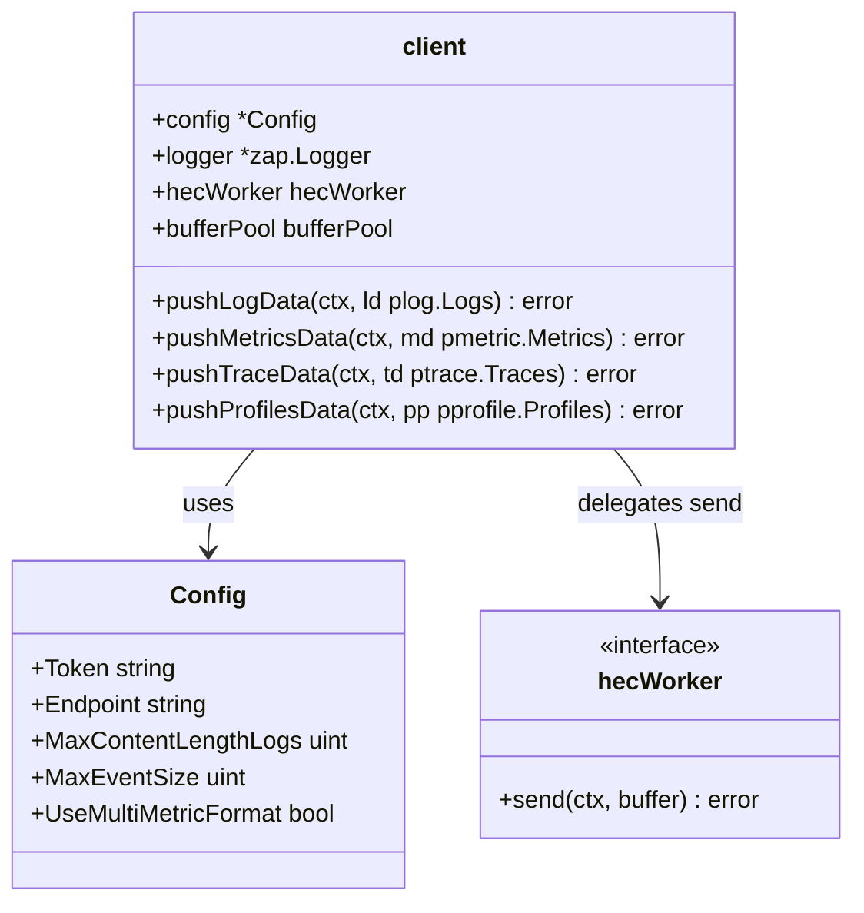

Sources:
- [exporter/splunkhecexporter/client.go:54-194]()
- [internal/splunk/common.go:22-22]()
- [exporter/splunkhecexporter/client_test.go:88-141]()

---

## Splunk HEC Receiver

The `splunkhecreceiver` acts as a Splunk HEC-compatible receiver endpoint. It accepts HTTP POST requests conforming to the HEC protocol and converts incoming events into OpenTelemetry logs and metrics.

### Functional Capabilities

- **Multi-signal Support**: Implements both `receiver.Metrics` and `receiver.Logs` interfaces [receiver/splunkhecreceiver/receiver.go:98-100]().
- **HEC Endpoint Routing**: Configures HTTP handlers for Splunk HEC paths including `/services/collector/raw`, `/services/collector/health`, and `/services/collector/ack` [receiver/splunkhecreceiver/receiver.go:140-156]().
- **Extension Integration**: Integrates with the Collector's `ackextension` to support HEC ACK protocol, providing acknowledgement IDs back to senders [receiver/splunkhecreceiver/receiver.go:142-149]().
- **Request Handling**: Supports both compressed (gzip) and uncompressed payloads. It uses a `sync.Pool` for `gzip.Reader` to optimize performance [receiver/splunkhecreceiver/receiver.go:125-126]().

### Processing Flow Highlights

- Incoming HTTP requests are parsed, decompressed if needed, and decoded [receiver/splunkhecreceiver/receiver.go:125-126]().
- The receiver returns standard HEC responses such as `Success` (code 0) or specific error codes like `Invalid data format` (code 6) [receiver/splunkhecreceiver/receiver.go:39-44]().
- Batched OTLP data is forwarded downstream to the configured consumers [receiver/splunkhecreceiver/receiver.go:88-89]().

Sources:
- [receiver/splunkhecreceiver/receiver.go:85-180]()
- [receiver/splunkhecreceiver/receiver_test.go:120-215]()
- [internal/splunk/common.go:23-25]()

---

## Splunk Enterprise Receiver

The `splunkenterprisereceiver` is a pull-based scraper that collects operational health and performance metrics from a Splunk Enterprise deployment via Splunk REST APIs.

### Scraper Architecture

- Implements a `splunkScraper` struct that performs scraping on intervals [receiver/splunkenterprisereceiver/scraper.go:34-41]().
- Supports multiple concurrent scrape functions (e.g., `scrapeLicenseUsageByIndex`, `scrapeIndexThroughput`, `scrapeHealth`) targeting specific REST endpoints or executing ad-hoc SPL searches defined in `searchDict` [receiver/splunkenterprisereceiver/scraper.go:90-118]().
- The scraper accumulates metrics using a `metadata.MetricsBuilder` generated from `metadata.yaml` [receiver/splunkenterprisereceiver/scraper.go:47-47]().
- Handles search job lifecycle: creating a search, polling for completion (handling HTTP 204 status), and unmarshalling results [receiver/splunkenterprisereceiver/scraper.go:193-232]().

### Metric Categories

- **License Metrics**: `splunk.license.index.usage` broken down by index [receiver/splunkenterprisereceiver/scraper.go:169-250]().
- **Indexer Pipeline**: Metrics about indexer pipe write seconds and CPU seconds [receiver/splunkenterprisereceiver/search_result.go:32-33]().
- **Scheduler and IO**: Completion ratio, run time, and IO stats [receiver/splunkenterprisereceiver/search_result.go:30-34]().
- **Cluster Manager & KV Store**: Status reported from cluster master and KV store introspection [receiver/splunkenterprisereceiver/search_result.go:36-40]().

### Scraper Execution Flow
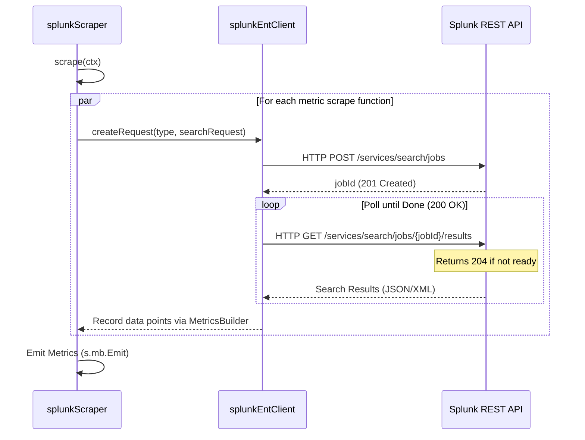

Sources:
- [receiver/splunkenterprisereceiver/scraper.go:84-166]()
- [receiver/splunkenterprisereceiver/search_result.go:26-37]()
- [receiver/splunkenterprisereceiver/metadata.yaml:102-167]()

---

## Data Transformation (OTLP <-> Splunk)

The `pkg/translator/splunk` package provides the core translation logic for converting between OpenTelemetry Protocol (OTLP) data and Splunk HEC event formats.

### Key Translation Features

| OTLP Signal          | Splunk Field(s)                   | Description                               |
|---------------------|---------------------------------|-------------------------------------------|
| LogRecord.Body       | `event`                         | The main content of a Splunk event.       |
| LogRecord.Timestamp  | `time`                          | Unix epoch seconds for event time.        |
| Resource.Attributes  | `host`, `source`, `sourcetype` | Mapped from standard Splunk labels.       |
| Attributes (logs)    | `fields`                        | Additional indexed fields or metadata.    |

### Internal Splunk Constants

The shared `internal/splunk` package provides base constants used consistently by all Splunk components:

| Constant Name           | Value                      | Usage                               |
|-----------------------|----------------------------|-------------------------------------|
| `DefaultSourceTypeLabel` | `"com.splunk.sourcetype"` | Attribute key for Splunk sourcetype.|
| `DefaultSourceLabel`     | `"com.splunk.source"`       | Attribute key for Splunk source.    |
| `DefaultIndexLabel`      | `"com.splunk.index"`        | Attribute key for Splunk index.     |
| `HECTokenHeader`         | `"Splunk"`                  | HTTP authorization header prefix.   |
| `HecTokenLabel`          | `"com.splunk.hec.access_token"` | Resource attribute for dynamic tokens. |

### Translation Package Usage

- The exporter handles conversion of OTLP signals into Splunk events using mappings defined in the `client` and `translator` [exporter/splunkhecexporter/client.go:33-33]().
- The receiver handles incoming JSON events and maps them back to OTLP using the shared translator [receiver/splunkhecreceiver/receiver.go:31-31]().
- The internal package provides `BuildHECAuthHeader` to format the `Authorization: Splunk <token>` header [internal/splunk/common.go:30-32]().

Sources:
- [internal/splunk/common.go:7-32]()
- [exporter/splunkhecexporter/client.go:106-171]()
- [receiver/splunkhecreceiver/receiver.go:31-31]()

---