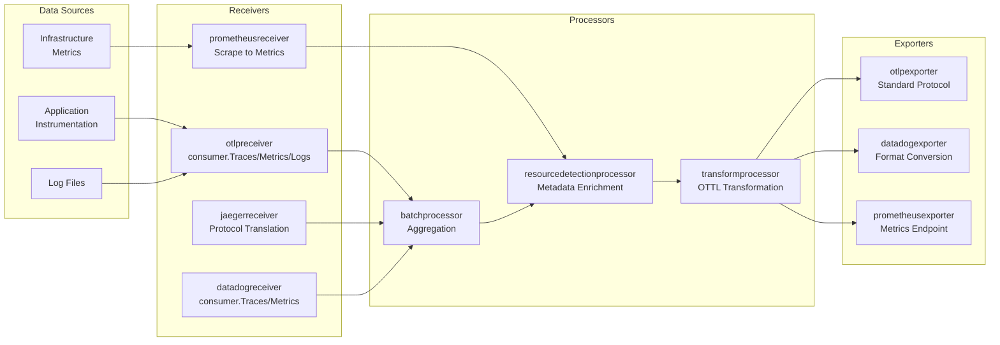
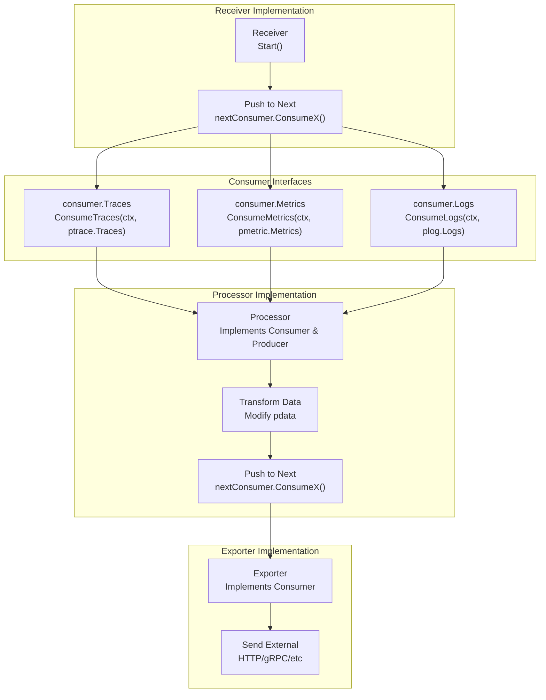
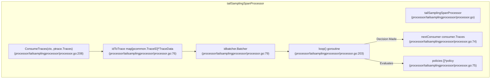
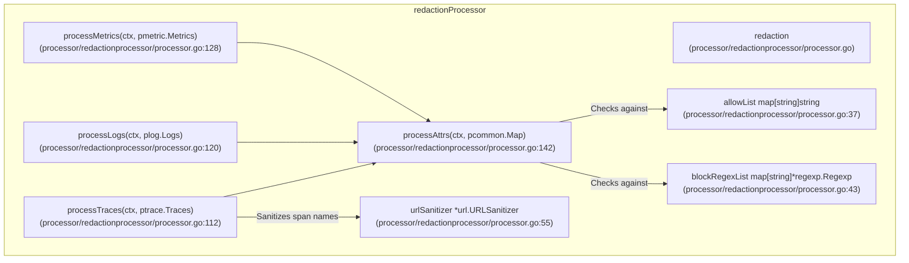
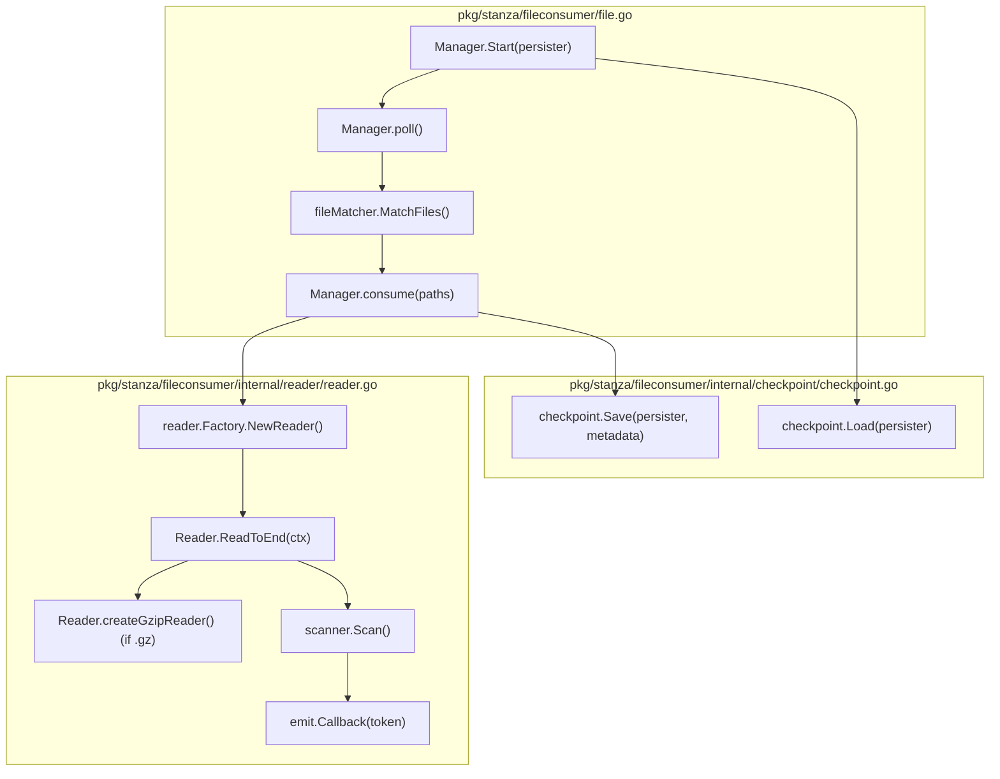
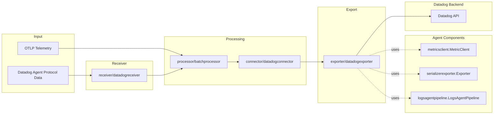
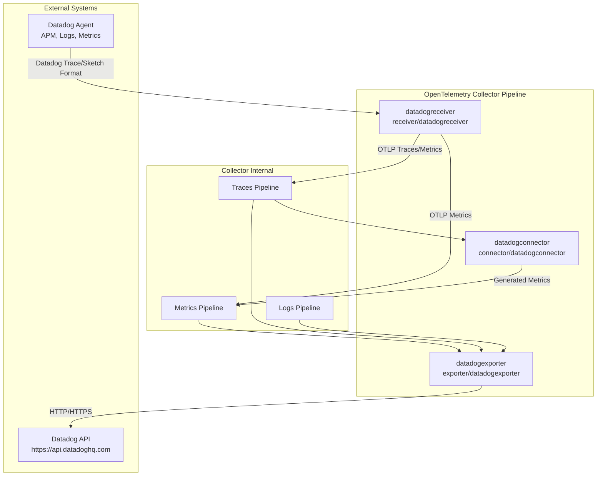
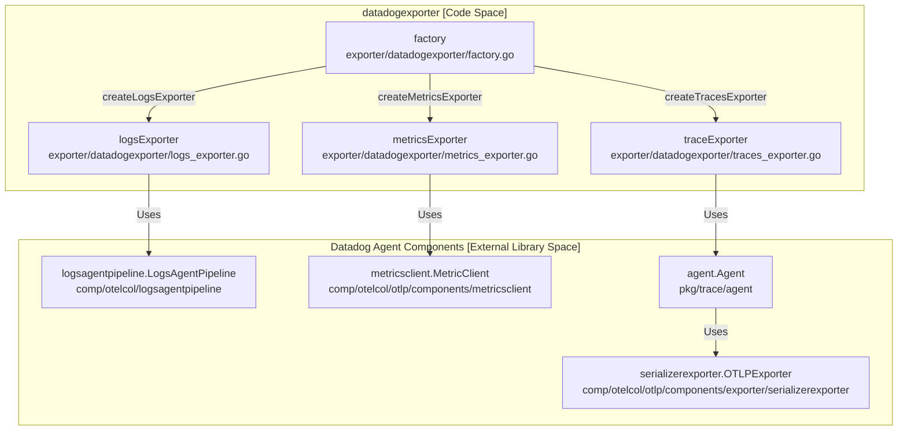
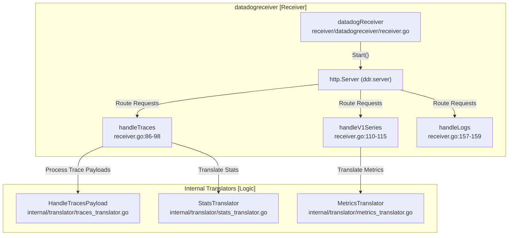

This document describes the data processing pipeline architecture within the OpenTelemetry Collector Contrib repository. It focuses on how telemetry data flows through receivers, processors, and exporters; the consumer interface pattern used to connect components; usage and manipulation of the internal pdata representation; detailed processor integration; and common patterns such as batching, filtering, attribute manipulation, and transformation.

---

## Pipeline Overview

The OpenTelemetry Collector Contrib adopts a pipeline architecture to ingest, process, and export telemetry signals including traces, metrics, and logs. The architecture is composed of *receivers* that ingest data, *processors* that transform or analyze data, and *exporters* that send the processed data to observability backends.



This architecture ensures extensibility and flexibility in how telemetry data is handled and routed through various components.

**Sources:** [processor/tailsamplingprocessor/README.md:17-18](), [processor/transformprocessor/README.md:23-26]()

---

## Consumer Interface Pattern

The Collector employs a *consumer interface* pattern which allows for modular pipeline construction. This pattern relies on consumers to receive telemetry data and enables components to be chained together seamlessly.

- **Receivers** implement their ingestion logic and *push* data via consumer interfaces.
- **Processors** implement both *consumer* and *producer* interfaces, allowing them to receive data, transform it, and forward it.
- **Exporters** implement consumer interfaces and send data externally.

The key consumer interfaces for each data type are:

| Consumer Interface        | Purpose                                |
|--------------------------|--------------------------------------|
| `consumer.Traces`         | Accepts `ptrace.Traces`               |
| `consumer.Metrics`        | Accepts `pmetric.Metrics`             |
| `consumer.Logs`           | Accepts `plog.Logs`                   |
| `consumer.Profiles`       | Accepts `pprofile.Profiles` (less common) |



For example, the `tailSamplingSpanProcessor` implements the `ConsumeTraces` method to receive trace data, process it, then forward sampled traces downstream [processor/tailsamplingprocessor/processor.go:208]().

**Sources:** [processor/tailsamplingprocessor/processor.go:134-136](), [processor/tailsamplingprocessor/processor.go:208](), [processor/redactionprocessor/processor.go:112-112](), [processor/redactionprocessor/processor.go:120-120](), [processor/redactionprocessor/processor.go:128-128]()

---

## pdata Internal Data Model

To facilitate efficient processing and transformation, the Collector uses `pdata` as its internal protocol representation for telemetry data. `pdata` abstracts away the wire format and provides zero-copy access for performance.

### Hierarchical Structure of pdata

Telemetry is arranged in a structured hierarchy per signal type:

| Signal  | Root Type        | Container Hierarchy                                          |
|---------|------------------|-------------------------------------------------------------|
| Traces  | `ptrace.Traces`  | `ResourceSpans` → `ScopeSpans` → `Span`                     |
| Metrics | `pmetric.Metrics` | `ResourceMetrics` → `ScopeMetrics` → `Metric` → `DataPoint` |
| Logs    | `plog.Logs`      | `ResourceLogs` → `ScopeLogs` → `LogRecord`                   |

Each layer allows isolation of attributes and scope, enabling processors to apply transformations and enrichments at different granularity levels.

For example, iterating over traces:

```go
for i := 0; i < traces.ResourceSpans().Len(); i++ {
    rs := traces.ResourceSpans().At(i)
    resourceAttrs := rs.Resource().Attributes()
    for j := 0; j < rs.ScopeSpans().Len(); j++ {
        scopeSpans := rs.ScopeSpans().At(j)
        scopeAttrs := scopeSpans.Scope().Attributes()
        for k := 0; k < scopeSpans.Spans().Len(); k++ {
            span := scopeSpans.Spans().At(k)
            spanAttrs := span.Attributes()
            // Process span attributes...
        }
    }
}
```

This layered structure is utilized in processors such as the tail sampling and redaction processors for efficient access and modification [processor/tailsamplingprocessor/processor_test.go:151-163](), [processor/redactionprocessor/processor.go:113-117](), [processor/redactionprocessor/processor.go:121-125]()

**Sources:** [processor/tailsamplingprocessor/processor_test.go:151-163](), [processor/redactionprocessor/processor.go:113-117](), [processor/redactionprocessor/processor.go:121-125](), [processor/redactionprocessor/processor.go:129-133]()

---

## Processor Integration Architecture

Processors are integral stages that perform transformations or sampling on the data. They are instantiated via factories and wired into the pipeline with their consumer and producer references.

### Tail Sampling Processor

The `tailSamplingSpanProcessor` is a sophisticated processor for sampling traces based on full trace context after all spans have been received. This processor collects spans by trace ID, evaluates sampling policies, and then either samples or drops the trace.

Key components of `tailSamplingSpanProcessor` [processor/tailsamplingprocessor/processor.go:65-101]():

- `idToTrace`: Maps trace IDs to trace metadata and accumulated spans.
- `decisionBatcher`: Collects trace IDs in batches to execute sampling decisions efficiently.
- `policies`: A list of `policy` structs each containing a sampling policy evaluator and metadata.
- `nextConsumer`: The consumer to forward sampled traces downstream.

The processor starts a background goroutine `loop()` for batching and triggering sampling decisions.



This design supports multiple policies including always sample, latency-based, probabilistic, attribute-based, and composite policies with logical operators (`and`, `not`, `drop`) [processor/tailsamplingprocessor/config.go:16-58](). The processor supports two sampling strategies: `trace-complete` (decision after full trace collected) and `span-ingest` (decision during span ingestion) [processor/tailsamplingprocessor/config.go:60-67]().

**Sources:** [processor/tailsamplingprocessor/processor.go:65-101](), [processor/tailsamplingprocessor/processor.go:208](), [processor/tailsamplingprocessor/processor.go:74-79](), [processor/tailsamplingprocessor/processor.go:191-200](), [processor/tailsamplingprocessor/config.go:16-67]()

---

## Common Processing Patterns

### Data Transformation Using OTTL

The `transformprocessor` provides rich, expressive transformations on telemetry data using the OpenTelemetry Transformation Language (OTTL). It can operate on different data contexts such as resources, scopes, spans, logs, and metrics, executing conditional logic and applying modifications [processor/transformprocessor/README.md:23-26]().

### Filtering and Sampling

Processors apply filtering and sampling to reduce telemetry volume or focus on relevant data subsets. The tail sampling processor implements a variety of policies:

- `always_sample`
- `latency`
- `numeric_attribute`
- `probabilistic`
- `status_code`
- `string_attribute`
- `rate_limiting`
- `bytes_limiting`
- `span_count`
- `trace_state`
- `boolean_attribute`
- `ottl_condition`
- Logical composition policies like `and`, `not`, `drop`, and `composite`

These policies are implemented as `samplingpolicy.Evaluator` instances [processor/tailsamplingprocessor/processor.go:41-42]().

### Attribute Manipulation and Redaction

The `redactionprocessor` enforces data privacy and compliance by scrubbing unwanted attributes. It deletes attributes not in the `allowed_keys` list, masks values matching blocked regexes, and sanitizes URLs in attributes [processor/redactionprocessor/README.md:4-7]().

Key internal redaction structures:

- `allowList` for keys permitted
- `ignoreList` for keys bypassing redaction
- `blockRegexList` and `blockKeyRegexList` for matching values and keys to mask/remove
- `urlSanitizer` for sanitizing URL attribute values

Processing pipelines attribute data recursively across traces, logs, and metrics [processor/redactionprocessor/processor.go:35-58]().



**Sources:** [processor/tailsamplingprocessor/config.go:16-67](), [processor/tailsamplingprocessor/processor.go:41-42](), [processor/redactionprocessor/README.md:4-7](), [processor/redactionprocessor/processor.go:35-58](), [processor/transformprocessor/README.md:23-26]()

---

## Error Handling and Back Pressure

Processors must ensure reliable backpressure and error handling under load:

- The `tailSamplingSpanProcessor` uses a buffered channel `workChan` to queue batches for evaluation [processor/tailsamplingprocessor/processor.go:146]().
- If `blockOnOverflow` is enabled, `ConsumeTraces` will block on channel send when at capacity, otherwise it may drop or return errors [processor/tailsamplingprocessor/processor.go:84]().
- The processor maintains memory limits such as `num_traces` to avoid unbounded growth [processor/tailsamplingprocessor/README.md:54]().
- Decision caches for sampled and non-sampled traces enable early release of spans on cache hits, reducing processing load [processor/tailsamplingprocessor/README.md:56-58]().

Error behavior in other processors like the `transformprocessor` can be configured with error modes (`ignore`, `silent`, `propagate`) to control response to transformation errors [processor/transformprocessor/README.md:66-75]().

| Pattern          | Component                 | Logic                                                              |
|------------------|---------------------------|-------------------------------------------------------------------|
| Blocking         | tailsamplingprocessor      | Blocks if `workChan` full and `blockOnOverflow` enabled          |
| Error Propagation| transformprocessor         | Configurable error modes for OTTL execution                       |
| Memory Limits    | tailsamplingprocessor      | Configurable max traces kept in memory                            |
| Decision Cache   | tailsamplingprocessor      | Early release of spans when decision cache hits                   |

**Sources:** [processor/tailsamplingprocessor/processor.go:84-151](), [processor/tailsamplingprocessor/README.md:54-58](), [processor/transformprocessor/README.md:66-75]()

---

This architecture enables the OpenTelemetry Collector Contrib to flexibly process and enrich telemetry signals before exporting them to observability backends, ensuring scalability, data quality, and compliance. The consumer interface pattern and `pdata` internal representation provide a consistent, high-performance framework for component integration. Processors utilize a range of policies and transformations to address common requirements such as sampling, redaction, and format conversion.

# End of Document

# Shared Utility Packages


This section documents the prominent shared utility packages within the `opentelemetry-collector-contrib` repository that provide foundational building blocks and reusable components to facilitate efficient development of various collector components. These packages encompass log file consumption and processing (`pkg/stanza`), testing utilities (`pkg/pdatatest`, `pkg/golden`), probabilistic sampling techniques (`pkg/sampling`), data structure implementations such as exponential histograms (`pkg/expohisto`), format translators (`pkg/translator`), and internal filtering logic (`internal/filter`).

---

## 4.3.1 pkg/stanza (Log Processing Framework)

The `pkg/stanza` package provides a comprehensive framework for log processing, designed around extensible operators including inputs, parsers, and processors. Its design enables robust log ingestion pipelines such as the ones used by the `filelogreceiver` [receiver/filelogreceiver/README.md:1-10](). The package is organized with strong modularity to facilitate scalable log collection and transformation.

### File Consumer Subsystem: pkg/stanza/fileconsumer

The core of file-based log ingestion resides in the `fileconsumer` subpackage. It manages efficient and robust tailing of log files, tracking offsets with fingerprinting for crash resilience and file rotation handling.

#### Key Components

- **Manager** (`Manager` struct): The `Manager` coordinates the lifecycle of file consumption. It periodically polls file system paths using configured glob patterns and manages active readers for the matched files [pkg/stanza/fileconsumer/file.go:33-53]().
  - Uses `fileMatcher` (`matcher.Matcher`) to identify files [pkg/stanza/fileconsumer/file.go:139-143]().
  - Maintains `tracker` (`tracker.Tracker`) for offset and state tracking of files across restarts [pkg/stanza/fileconsumer/file.go:40-41]().
  - Uses `readerFactory` to create `Reader` instances defining actual file reading logic [pkg/stanza/fileconsumer/file.go:38]().
  - Tracks unreadable files and permission errors in `unreadable` map [pkg/stanza/fileconsumer/file.go:52]().

- **Reader** (`Reader` struct): Manages an individual file, including opening, decoding, tokenizing, and reading content until EOF or context cancellation [pkg/stanza/fileconsumer/internal/reader/reader.go:43-68]().
  - Supports multi-encoding via `decoder` for Unicode or binary encodings.
  - Supports gzip compressed logs by wrapping file readers with `gzip.Reader` over a `SectionReader` for streaming decompression [pkg/stanza/fileconsumer/internal/reader/reader.go:134-173]().
  - Maintains `Metadata` which contains file fingerprint, offset, tokenization and flush state [pkg/stanza/fileconsumer/internal/reader/reader.go:30-40]().
  - Employs `contentSplitFunc` (a `bufio.SplitFunc`) to separate byte streams into logical log tokens [pkg/stanza/fileconsumer/internal/reader/reader.go:54]().
  - Emits tokens asynchronously downstream via an `emitFunc` callback.

- **Factory** (`Factory` struct): Responsible for producing configured `Reader` instances, applying settings for encoding, maximum log size, trimming, and header parsing [pkg/stanza/fileconsumer/internal/reader/factory.go:35-56]().
  - Deals with initial offset positioning based on `start_at` behavior (beginning or end of file) [pkg/stanza/fileconsumer/internal/reader/factory.go:149-156]().
  - Detects file type changes (e.g. plaintext → gzip) to correctly adapt reader behavior.
  - Sets up buffering and splitting functions to ensure correct token boundaries and trimming behaviors.

#### Data Flow: Log Ingestion

1. **Polling**: The `Manager` periodically polls the configured filesystem locations at intervals defined by `poll_interval` to check for new or updated files [pkg/stanza/fileconsumer/file.go:116-131]().
2. **File Matching**: Using `matcher.Matcher.MatchFiles()`, files matching include/exclude glob patterns are identified [pkg/stanza/fileconsumer/file.go:139-140]().
3. **Consumption**: The `Manager.consume` method creates new `Reader` instances for unmatched files and resumes reading from existing tracked files [pkg/stanza/fileconsumer/file.go:174-194]().
4. **Reading**: Each `Reader` seeks to its last known offset and reads log content to EOF, splitting stream data into tokens and decoding content accordingly [pkg/stanza/fileconsumer/internal/reader/reader.go:71-131]().
5. **Checkpointing**: The tracked offsets and fingerprints are persisted reliably across restarts through `checkpoint.Save` using an abstracted `operator.Persister` [pkg/stanza/fileconsumer/file.go:106-111]().

**Diagram: File Consumption Lifecycle**



Sources:
- [pkg/stanza/fileconsumer/file.go:33-194]()
- [pkg/stanza/fileconsumer/internal/reader/reader.go:43-173]()
- [pkg/stanza/fileconsumer/internal/reader/factory.go:35-187]()
- [pkg/stanza/fileconsumer/config.go:60-110]()

---

## 4.3.2 Specialized Stanza Operators

### Container Log Parser: pkg/stanza/operator/parser/container

This specialized parser recognizes and processes container runtime log formats automatically, specifically Docker, CRI-O, and Containerd logs [pkg/stanza/operator/parser/container/parser.go:26-38]().

- **Auto-Detection**: Utilizes regular expressions on the log line to detect format (`dockerPattern`, `crioPattern`, `containerdPattern`) and applies the appropriate parser logic [pkg/stanza/operator/parser/container/parser.go:40-45]().
- **Metadata Extraction**: Optionally enriches log entries by extracting Kubernetes pod, namespace, container, and restart count metadata from log file paths using regex extraction [pkg/stanza/operator/parser/container/parser.go:65]().
- **Recombination**: Supports recombining multi-line CRI logs using an internal recombine operator triggered dynamically to merge partial log fragments based on container runtime semantics [pkg/stanza/operator/parser/container/parser.go:117-130]().

The parser seamlessly integrates with the operator framework and can be used to form complex log parsing pipelines.

### Windows Event Log Parser: pkg/stanza/operator/input/windows

For ingestion of Windows native Event Logs:

- Uses native Windows APIs to subscribe to event channels locally or remotely.
- Tracks progress through XML bookmarks persisted between restarts, enabling exactly-once log ingestion.
- Allows filtering and handoff to downstream operators for processing and export.

Sources:
- [pkg/stanza/operator/parser/container/parser.go:60-175]()
- [pkg/stanza/operator/parser/container/config.go:21-54]()

---

## 4.3.3 Testing and Data Utilities

### pkg/pdatatest and pkg/golden

These packages provide robust testing utilities commonly used in component development and integration testing [receiver/filelogreceiver/go.mod:21-25]().

- **pkg/pdatatest**: Offers deep comparison functions tailored for OpenTelemetry protocol data structures (`pdata`), including logs, traces, metrics, and profiles. It produces informative diffs when expected output does not match actual [receiver/filelogreceiver/go.mod:21-25]().
- **pkg/golden**: Facilitates management of "golden files", YAML or JSON files containing expected outputs for end-to-end tests. Provides functions to read and write golden files for trace, metrics, and logs validation [receiver/filelogreceiver/go.mod:99]().

### pkg/translator/prometheusremotewrite

This package implements translators converting OTLP metrics to the Prometheus Remote Write wire format.

- Implements hashing functions to uniquely identify Prometheus time series based on label sets.
- Maps OTLP attributes to Prometheus label names with character escaping and sanitization.
- Supports metrics translation for various Prometheus metric types optimizing compatibility with Prometheus remote write endpoints.

### pkg/expohisto

Implements the exponential histogram data structure used in high-fidelity metric aggregation supporting efficient storage and analysis of distribution data.

- Used by `telemetrygen` for synthetic data generation.
- Used by processors needing precise histogram representations.

---

## 4.3.4 internal/filter (Filtering Logic)

The `internal/filter` package provides generic utilities and predicates for filtering logs, metrics, or traces based on attributes, resource data, or other criteria.

- Used internally by processors and receivers to apply filtering semantics.
- Implements common filter operators like regex matching, strict inclusion/exclusion, and conditional matching.

---

## Code Entity Mapping

The following diagram maps natural language concepts to the specific Go structs and functions in the `pkg/stanza` ecosystem, highlighting key package components relevant for log file consumption and container log parsing.

**Diagram: Stanza Class and Function Mapping**

```mermaid
classDiagram
    class Manager {
        <<pkg/stanza/fileconsumer/file.go>>
        +Start(persister)
        +Stop()
        -poll(ctx)
        -consume(paths)
        -makeReaders(ctx, paths)
    }
    class Reader {
        <<pkg/stanza/fileconsumer/internal/reader/reader.go>>
        +ReadToEnd(ctx)
        +createGzipReader()
        +readHeader(ctx)
        +readContents(ctx)
        Metadata
    }
    class ReaderFactory {
        <<pkg/stanza/fileconsumer/internal/reader/factory.go>>
        +NewReader(file, fp)
        +NewFingerprint(file)
    }
    class ContainerParser {
        <<pkg/stanza/operator/parser/container/parser.go>>
        +ProcessBatch(ctx, entries)
        -detectFormat(entry)
        -parseDocker(body)
        -parseContainerd(body)
        -parseCRIO(body)
    }

    Manager --> ReaderFactory : "uses"
    ReaderFactory --> Reader : "creates Readers"
    Reader --> "Metadata struct" : "composes"
    ContainerParser --|> ParserOperator : "implements Operator interface"
```

Sources:
- [pkg/stanza/fileconsumer/file.go:33-53]()
- [pkg/stanza/fileconsumer/internal/reader/reader.go:43-68]()
- [pkg/stanza/operator/parser/container/parser.go:61-71]()
- [pkg/stanza/fileconsumer/internal/reader/factory.go:35-56]()

---

## Summary of Shared Packages

| Package                         | Purpose                                   | Key Symbols / Types                     |
|-------------------------------|-------------------------------------------|---------------------------------------|
| `pkg/stanza`                   | Log processing framework                   | `entry.Entry`, `operator.Operator`    |
| `pkg/stanza/fileconsumer`      | Log file tailing and ingestion             | `Manager`, `Reader`, `Fingerprint`   |
| `pkg/pdatatest`                | Deep comparison of OTLP pdata structures  | `CompareLogs`, `CompareMetrics`       |
| `pkg/golden`                   | Golden file-based test outputs             | `ReadLogs`, `WriteLogs`                |
| `pkg/translator/prometheusremotewrite` | OTLP to Prometheus Remote Write translation | `MetricToPRW`                         |
| `pkg/expohisto`                | Exponential Histogram data structure       | `ExponentialHistogram`                 |
| `internal/filter`              | Filtering utilities                         | Filtering predicates and matchers     |

Sources:
- [pkg/stanza/go.mod:1-43]()
- [pkg/stanza/fileconsumer/file.go:33-53]()
- [receiver/filelogreceiver/go.mod:21-25]()
- [pkg/stanza/operator/parser/container/parser.go:26-38]()
- [receiver/otlpjsonfilereceiver/go.mod:93-97]()

# Datadog Integration Ecosystem


The Datadog integration provides OpenTelemetry Collector compatibility with the Datadog observability platform. This integration is the most actively developed ecosystem in the repository, featuring a complete set of components that ingest, transform, and export telemetry data using Datadog Agent libraries version `v0.77.0-devel.0.20260213154712-e02b9359151a`.

**Components:**

| Component          | Module                            | Function                                    |
|--------------------|---------------------------------|---------------------------------------------|
| `datadogexporter`  | `exporter/datadogexporter`       | Exports OTLP telemetry to Datadog APIs      |
| `datadogconnector` | `connector/datadogconnector`     | Computes APM statistics from traces         |
| `datadogreceiver`  | `receiver/datadogreceiver`       | Ingests Datadog Agent protocol data         |

The integration embeds Datadog Agent components from `github.com/DataDog/datadog-agent` to handle protocol serialization, compression, and API communication.

**Sources:**
- [exporter/datadogexporter/go.mod:1-50]()
- [connector/datadogconnector/go.mod:1-27]()
- [receiver/datadogreceiver/go.mod:1-44]()

---

## Component Dependencies

### Datadog Agent Library Integration

The three main components integrate with Datadog Agent `v0.77.0-devel.0.20260213154712-e02b9359151a` libraries to perform telemetry-specific operations:

| Component          | Agent Libraries                                                                                                              | Purpose                                          |
|--------------------|------------------------------------------------------------------------------------------------------------------------------|--------------------------------------------------|
| `datadogexporter`  | `comp/otelcol/logsagentpipeline/logsagentpipelineimpl`<br>`comp/otelcol/otlp/components/exporter/logsagentexporter`<br>`comp/otelcol/otlp/components/exporter/serializerexporter`<br>`comp/otelcol/otlp/components/metricsclient` | Log processing pipeline<br>Log export handler<br>Metric/trace serialization<br>Metrics client |
| `datadogconnector` | `comp/otelcol/otlp/components/metricsclient`<br>`pkg/trace`                                                                   | Metrics client<br>Trace sampling and RED metrics calculations |
| `datadogreceiver`  | `pkg/proto`<br>`pkg/obfuscate`<br>`pkg/trace/stats`<br>`pkg/trace/traceutil`                                                 | Protocol definitions<br>Trace obfuscation<br>APM statistics<br>Trace utilities |

**Sources:**
- [exporter/datadogexporter/go.mod:7-25]()
- [receiver/datadogreceiver/go.mod:7-11]()
- [connector/datadogconnector/go.mod:53-57]()

---

### Datadog Protocol Libraries

The integration also depends on several Datadog protocol-related libraries:

| Library                                    | Version     | Used By                 | Function                          |
|--------------------------------------------|-------------|-------------------------|----------------------------------|
| `github.com/DataDog/agent-payload/v5`      | `v5.0.199`  | All components          | Agent protocol payload structures |
| `github.com/DataDog/datadog-api-client-go/v2` | `v2.60.0`   | `datadogexporter`, `datadogreceiver` | Datadog API client                 |
| `github.com/DataDog/datadog-go/v5`          | `v5.8.3`    | `datadogexporter`       | DogStatsD client library          |
| `github.com/DataDog/sketches-go`            | `v1.4.8`    | `datadogreceiver`       | DDSketch metric data structures   |

**Sources:**
- [exporter/datadogexporter/go.mod:6-27]()
- [receiver/datadogreceiver/go.mod:6-13]()
- [connector/datadogconnector/go.mod:31-31]()

---

## Module Dependency Architecture

### Diagram: Component and Library Dependencies

```mermaid
graph TB
    subgraph "Collector Components"
        DDR["receiver/datadogreceiver"]
        DDC["connector/datadogconnector"]
        DDE["exporter/datadogexporter"]
        DDIntTest["exporter/datadogexporter/integrationtest"]
    end

    subgraph "Internal/Shared Modules"
        InternalDD["internal/datadog"]
        CoreInternal["internal/coreinternal"]
        PkgDD["pkg/datadog"]
    end

    subgraph "Datadog Agent v0.77.0-devel"
        LogsPipelineImpl["comp/otelcol/logsagentpipeline/logsagentpipelineimpl"]
        LogsAgentExp["comp/otelcol/otlp/components/exporter/logsagentexporter"]
        SerExp["comp/otelcol/otlp/components/exporter/serializerexporter"]
        MetClient["comp/otelcol/otlp/components/metricsclient"]
        TestUtil["comp/otelcol/otlp/testutil"]
        InfraMetadata["pkg/opentelemetry-mapping-go/inframetadata"]
        OTLPAttribs["pkg/opentelemetry-mapping-go/otlp/attributes"]
        OTLPMetrics["pkg/opentelemetry-mapping-go/otlp/metrics"]
        TraceProto["pkg/proto"]
        Obfuscate["pkg/obfuscate"]
        TraceLib["pkg/trace"]
        TraceStats["pkg/trace/stats"]
        TraceUtil["pkg/trace/traceutil"]
        HostnameInterface["comp/core/hostname/hostnameinterface"]
    end

    subgraph "External Libraries"
        AgentPayload["github.com/DataDog/agent-payload/v5@v5.0.199"]
        APIClient["github.com/DataDog/datadog-api-client-go/v2@v2.60.0"]
        DatadogGo["github.com/DataDog/datadog-go/v5@v5.8.3"]
        Sketches["github.com/DataDog/sketches-go@v1.4.8"]
        Msgp["github.com/tinylib/msgp@v1.6.4"]
    end

    DDR --> InternalDD
    DDR --> CoreInternal
    DDC --> InternalDD
    DDE --> InternalDD
    DDE --> CoreInternal
    InternalDD --> PkgDD
    DDIntTest --> InternalDD
    DDIntTest --> PkgDD

    DDE --> LogsPipelineImpl
    DDE --> LogsAgentExp
    DDE --> SerExp
    DDE --> MetClient
    DDE --> InfraMetadata
    DDE --> OTLPAttribs
    DDE --> OTLPMetrics
    DDE --> HostnameInterface

    DDC --> MetClient
    DDC --> OTLPAttribs
    DDC --> OTLPMetrics

    DDR --> Obfuscate
    DDR --> TraceProto
    DDR --> TraceLib
    DDR --> TraceStats
    DDR --> TraceUtil

    DDIntTest --> TestUtil

    DDR --> AgentPayload
    DDE --> AgentPayload
    DDR --> APIClient
    DDE --> APIClient
    DDE --> DatadogGo
    DDR --> Sketches
    DDR --> Msgp
```



**Sources:**
- [exporter/datadogexporter/go.mod:5-31]()
- [connector/datadogconnector/go.mod:5-8]()
- [receiver/datadogreceiver/go.mod:5-24]()
- [exporter/datadogexporter/integrationtest/go.mod:5-16]()

---

## Datadog Exporter

The `datadogexporter` component is responsible for exporting OpenTelemetry telemetry data to Datadog APIs. It uses Datadog Agent libraries for efficient serialization and compression of telemetry data and supports traces, metrics, and logs.

### Agent Component Integration

The exporter depends on the following Datadog Agent components:

- `comp/otelcol/logsagentpipeline/logsagentpipelineimpl`
- `comp/otelcol/otlp/components/exporter/logsagentexporter`
- `comp/otelcol/otlp/components/exporter/serializerexporter`
- `comp/otelcol/otlp/components/metricsclient`

### Key Dependencies and Usage

| Dependency                             | Version                     | Purpose                                  |
|--------------------------------------|-----------------------------|------------------------------------------|
| `github.com/DataDog/agent-payload/v5` | `v5.0.199`                  | Datadog Agent payload protocols          |
| `github.com/DataDog/datadog-api-client-go/v2` | `v2.60.0`           | Datadog API client for exporting data    |
| `github.com/DataDog/datadog-go/v5`    | `v5.8.3`                    | DogStatsD client library                  |

The exporter also leverages Datadog Agent's OpenTelemetry mapping libraries for accurate OTLP to Datadog data translation.

**Sources:**
- [exporter/datadogexporter/go.mod:6-26]()
- [exporter/datadogexporter/go.mod:18-20]()

---

## Datadog Connector

The `datadogconnector` acts as a bridge between traces and metrics within the collector pipeline by computing Application Performance Monitoring (APM) statistics from trace data. It enables the calculation of RED (Rate, Errors, Duration) metrics from incoming traces prior to export.

### Dependencies

| Dependency                      | Version   | Purpose                          |
|--------------------------------|-----------|----------------------------------|
| `exporter/datadogexporter`      | v0.153.0  | Shared export capabilities        |
| `processor/tailsamplingprocessor` | v0.153.0  | Integration with tail-based sampling |
| `pkg/datadog`                   | v0.153.0  | Shared Datadog utilities          |

This connector enhances telemetry observability by enriching the trace pipeline with derived metrics.

**Sources:**
- [connector/datadogconnector/go.mod:6-8]()

---

## Datadog Receiver

The `datadogreceiver` component enables ingestion of telemetry in Datadog Agent protocol format, allowing the collector to act as a drop-in replacement for the Datadog Agent for trace and metric data collection from Datadog-instrumented applications.

### Key Dependencies

| Dependency                             | Version    | Purpose                                |
|--------------------------------------|------------|----------------------------------------|
| `github.com/DataDog/agent-payload/v5` | `v5.0.199` | Agent protocol payloads deserialization|
| `github.com/DataDog/sketches-go`       | `v1.4.8`   | DDSketch metric data structures        |
| `github.com/tinylib/msgp`              | `v1.6.4`   | MessagePack serialization library      |
| `github.com/vmihailenco/msgpack/v5`    | `v5.4.1`   | MessagePack encoding/decoding           |

The receiver handles complex Datadog payload decoding and trace obfuscation using these libraries.

**Sources:**
- [receiver/datadogreceiver/go.mod:6-24]()

---

## Data Flow Pipeline

### Diagram: Datadog Integration Data Flow



**Pipeline Description:**

1. **Ingestion:**
   The `datadogreceiver` ingests Datadog Agent protocol payloads, decoding complex telemetry formats [receiver/datadogreceiver/go.mod:6-6]().

2. **Processing and Transformation:**
   Trace and metric data are processed through batching and enrichment. The `datadogconnector` computes RED metrics from trace data, producing derived metrics for observability [connector/datadogconnector/go.mod:6-8]().

3. **Export:**
   The `datadogexporter` serializes data using Datadog Agent's `serializerexporter` and exports traces, metrics, and logs to the Datadog platform via HTTP APIs. It leverages the `logsagentpipeline` for log processing and `metricsclient` for metric dispatching [exporter/datadogexporter/go.mod:9-13]().

**Sources:**
- [exporter/datadogexporter/go.mod:9-13]()
- [receiver/datadogreceiver/go.mod:6-6]()

---

## Integration Testing

The `exporter/datadogexporter/integrationtest` module offers end-to-end tests for the Datadog integration. It simulates a complete collector pipeline combining receiver, connector, and exporter, ensuring correctness in transforming and exporting Datadog telemetry.

**Sources:**
- [exporter/datadogexporter/integrationtest/go.mod:1-39]()

---

## Shared Internal Modules

### internal/datadog

The `internal/datadog` module provides internal utilities and abstractions used by all Datadog components, including validation logic, shared metadata providers, and host information extraction.

**Sources:**
- [internal/datadog/metadata.yaml:1-10]()

### pkg/datadog

The public `pkg/datadog` module offers shared APIs, configuration models, and feature gate handling for Datadog components, enabling consistent configuration and interoperability across exporter, receiver, and connector.

**Sources:**
- [pkg/datadog/go.mod:1-57]()
- [pkg/datadog/config/config.go:1-50]()

---

## See Also

- [Datadog Components Architecture](#5.1) — Document the Datadog exporter, connector, and receiver components, their factory implementations, configuration options, OTLP to Datadog mapping strategies, trace and metrics processing, and integration with Datadog Agent components
- [Datadog Module Dependencies and Data Flow](#5.2) — Explain the internal/datadog and pkg/datadog module architecture, dependencies on Datadog Agent packages (config, logging, tagging, forwarding, obfuscation, serialization), OTLP mapping implementations, and the data transformation pipeline from OpenTelemetry to Datadog formats

# Datadog Components Architecture


## Purpose and Scope

This document describes the architecture of the three Datadog integration components in the `opentelemetry-collector-contrib` repository: `datadogexporter`, `datadogreceiver`, and `datadogconnector`. These components enable bidirectional telemetry exchange with Datadog's observability platform and represent one of the most actively developed integrations in the repository.

For information about the module dependencies and OTLP mapping implementation details, see [Datadog Module Dependencies and Data Flow](5.2).

## Component Overview

The Datadog integration consists of three OpenTelemetry Collector components that work together to provide comprehensive telemetry handling:

Title: Datadog Integration Ecosystem

**Sources:** [exporter/datadogexporter/factory.go:141-150](), [receiver/datadogreceiver/receiver.go:70-169](), [connector/datadogconnector/factory.go:1-30]()

| Component       | Type      | Primary Function                                                                                   |
|-----------------|-----------|--------------------------------------------------------------------------------------------------|
| **datadogreceiver**   | Receiver  | Ingests telemetry in Datadog Agent formats (APM traces, sketches, series) and converts to OTLP.   |
| **datadogconnector**  | Connector | Routes traces between pipelines and generates APM metrics (stats) from trace data.               |
| **datadogexporter**   | Exporter  | Exports OTLP telemetry to Datadog API using native Datadog formats.                              |

**Sources:** [exporter/datadogexporter/README.md:2-15](), [receiver/datadogreceiver/README.md:1-15](), [connector/datadogconnector/README.md:1-15]()

## Datadog Exporter Architecture

### Component Structure

The `datadogexporter` converts OpenTelemetry Protocol (OTLP) telemetry data into Datadog's native formats. It is implemented as a factory that creates sub-exporters for metrics, traces, and logs, managing their lifecycle and configuration [exporter/datadogexporter/factory.go:141-150]().

Title: Datadog Exporter Code Entities

**Sources:** [exporter/datadogexporter/factory.go:141-150](), [exporter/datadogexporter/traces_exporter.go:41-54](), [exporter/datadogexporter/factory.go:126-139]()

### Key Functionalities

- **Trace Exporter**: Uses `agent.Agent` from Datadog Agent packages to process OpenTelemetry traces and convert them into Datadog trace formats for export [exporter/datadogexporter/factory.go:126-139](), [exporter/datadogexporter/traces_exporter.go:41-54]().

- **Metrics Exporter**: Translates OTLP metrics into Datadog metrics formats using a metrics client (`metricsclient.MetricClient`) supporting features like delta metric interval inference and histogram mode configuration [exporter/datadogexporter/factory.go:198-243](), [exporter/datadogexporter/metrics_exporter.go:58-123]().

- **Logs Exporter**: Converts OTLP logs into Datadog Logs Agent pipeline format to leverage Datadog's internal log processing infrastructure [exporter/datadogexporter/factory.go:243-274]().

- **Host Metadata Reporting**: The exporter includes a metadata reporter (`inframetadata.Reporter`) that collects and reports host metadata, initialized once per exporter instance and running asynchronously [exporter/datadogexporter/factory.go:98-112](), [exporter/datadogexporter/factory.go:57-61]().

- **API Key Validation and Retry**: On initialization, the exporter validates the provided Datadog API key against the Datadog endpoints and uses a retrier for submitting metrics and metadata [exporter/datadogexporter/traces_exporter.go:70-93](), [exporter/datadogexporter/metrics_exporter.go:109-121]().

- **Feature Gates**: The exporter uses OpenTelemetry Collector's feature gate system to enable or disable features such as metric remapping, APM stats disabling, and histogram behavior [exporter/datadogexporter/factory.go:53-55]().

### Configuration Highlights

- The exporter configuration object is defined in `pkg/datadog/config` and includes API key management, site configuration, host metadata options, and specific configurations for traces, metrics, and logs [pkg/datadog/config/config.go:44-146]().

- Hostname detection has a configurable timeout to prevent blocking health probe responses during startup in Kubernetes environments [pkg/datadog/config/config.go:97-103]().

- The exporter validates required fields such as API key presence and compatibility of metadata and hostname configurations [pkg/datadog/config/config.go:151-182]().

**Sources:** [exporter/datadogexporter/factory.go:15-27](), [exporter/datadogexporter/factory.go:91-96](), [pkg/datadog/config/config.go:44-117](), [exporter/datadogexporter/README.md:100-103]()

## Datadog Receiver Architecture

### Component Structure and Function

The `datadogreceiver` implements a high-performance HTTP server that exposes endpoints mimicking the Datadog Agent's intake API for traces, metrics, logs, and stats, enabling ingestion of telemetry in Datadog native formats. It converts the telemetry into OpenTelemetry (OTLP) pdata formats for consumption by downstream processors or exporters.

Title: Datadog Receiver Data Flow and Components

**Sources:** [receiver/datadogreceiver/receiver.go:40-60](), [receiver/datadogreceiver/receiver.go:70-169](), [receiver/datadogreceiver/internal/translator/traces_translator.go:50-70]()

### Protocol Versions and Features

- The receiver supports multiple Datadog trace API versions: `/v0.3/traces`, `/v0.4/traces`, `/v0.5/traces`, `/v0.7/traces`, and `/api/v0.2/traces` to accommodate backward compatibility [receiver/datadogreceiver/receiver.go:81-103]().

- Metrics ingestion supports v1 and v2 series endpoints, check run events, sketches, distribution points, intake endpoints meant for proxy usage, and stats endpoints [receiver/datadogreceiver/receiver.go:107-151]().

- Logs ingestion supports the `/api/v2/logs` endpoint to receive Datadog native logs format [receiver/datadogreceiver/receiver.go:155-160]().

- The receiver can reconstruct full 128-bit OpenTelemetry Trace IDs from Datadog 64-bit trace IDs and additional metadata tags (`_dd.p.tid`) using an LRU cache for span correlation [receiver/datadogreceiver/internal/translator/traces_translator.go:85-114]().

- Proxy mode support allows routing `/intake` endpoints traffic to Datadog’s official intake API with integrated API key validation and reverse proxy using `httputil.ReverseProxy` [receiver/datadogreceiver/receiver.go:187-207]().

**Sources:** [receiver/datadogreceiver/receiver.go:70-169](), [receiver/datadogreceiver/internal/translator/traces_translator.go:85-114](), [receiver/datadogreceiver/receiver.go:187-207]()

### Cache and Observation

- The `datadogReceiver` maintains a trace ID cache (LRU cache) to keep mappings of 64-bit to 128-bit trace IDs for efficient reconstruction [receiver/datadogreceiver/receiver.go:56-59](), [receiver/datadogreceiver/receiver.go:180-187]().

- Observability is implemented using the Collector's `receiverhelper.ObsReport` to track metrics and lifecycle events [receiver/datadogreceiver/receiver.go:54-60]().

**Sources:** [receiver/datadogreceiver/receiver.go:40-60]()

## Datadog Connector Architecture

The `datadogconnector` serves as an OTLP connector specializing in generating APM statistics (like hits, errors, and latency) from trace data flowing through the Collector pipelines, thereby enabling enhanced telemetry insights closer to Datadog's expectations.

### Implementation Summary

- The connector is created via `connector.NewFactory` with support for trace data [connector/datadogconnector/factory.go:18-28]().

- It processes spans in real-time to produce APM stats metrics, which it outputs to the metrics pipeline – a feature recommended over performing stats generation in the exporter [exporter/datadogexporter/README.md:19-20]().

- The connector uses internal translation to Datadog trace formats before stats computation for consistency and standardization with the official agent [connector/datadogconnector/factory.go:18-28]().

**Sources:** [connector/datadogconnector/factory.go:18-28](), [exporter/datadogexporter/README.md:19-20]()

## Integration and OTLP-to-Datadog Data Mapping

### Attribute and Trace Mapping

- An `attributes.Translator` maps OpenTelemetry semantic conventions into Datadog tags and attributes, providing coherent cross-component tag representation [exporter/datadogexporter/factory.go:91-96]().

- A `source.Provider` abstracts the origin discovery of telemetry (host, container, or orchestrator metadata) used by exporters and receivers for enriched provenance [exporter/datadogexporter/factory.go:84-89]().

- The receiver implements span translators that convert Datadog native trace representations to OTLP `ptrace.Traces`. Span processors for HTTP, database, gRPC, AWS SDK, and internal span types set specific OTel semantic attributes for interoperability [receiver/datadogreceiver/internal/translator/traces_translator.go:50-70]().

- Special handling of 64-bit and 128-bit trace ID reconciliation maintains OpenTelemetry compliance and trace correlation fidelity [receiver/datadogreceiver/internal/translator/traces_translator.go:85-114]().

### Metrics and Logs Mapping

- Metrics are translated between OTLP and Datadog metrics via the `metricsExporter` which applies remapping, delta metric interval inference, histogram aggregation modes, and scrubbers [exporter/datadogexporter/metrics_exporter.go:58-123]().

- Logs leverages the logs agent pipeline from Datadog agent packages to marshal logs for export effectively [exporter/datadogexporter/factory.go:243-274]().

### Integration Testing

- The integration test suite uses a mock Datadog server to verify end-to-end functionality. It spins up an in-process Collector with Datadog receiver, connector, and exporter all wired up.

- Tests validate that OTLP traces sent to the receiver eventually generate the expected DB AgentPayload spans and corresponding StatsPayload APM stats to the exporter reflected at the mock Datadog server [exporter/datadogexporter/integrationtest/integration_test.go:79-148]().

**Sources:** [exporter/datadogexporter/factory.go:18-27](), [exporter/datadogexporter/integrationtest/integration_test.go:78-148](), [receiver/datadogreceiver/internal/translator/traces_translator.go:50-70]()

---