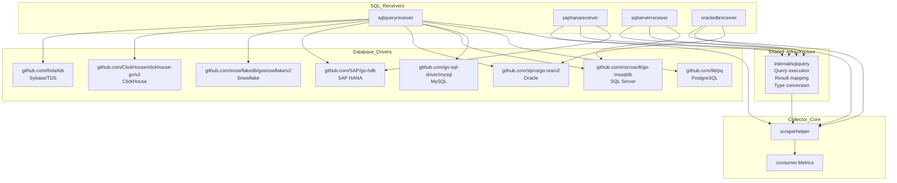
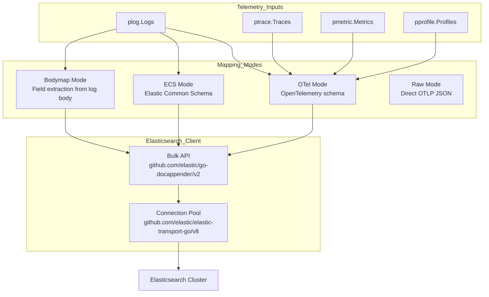

This document covers the database and data store integration capabilities in the `opentelemetry-collector-contrib` repository. These components enable **observability data ingestion** from databases through receivers and allow **exporting telemetry data** to various database and data store targets, including SQL and NoSQL databases, search engines, and time-series stores.

The primary integrations documented here include:

- **SQL Database Receivers**: Receivers that query diverse SQL databases, convert query results into OpenTelemetry metrics, and leverage a shared internal query framework.
- **Elasticsearch Exporter**: A robust exporter supporting multiple data mapping modes, bulk indexing, dynamic routing, and multiple telemetry types (logs, metrics, traces, profiles).
- **NoSQL and Time-Series Data Store Integrations**: Receivers and exporters for MongoDB, Redis, Couchbase, ClickHouse, InfluxDB, and more.

This page provides a high-level overview of these database integration components, highlighting relationships and architectural patterns. Detailed technical information and usage can be found on the child pages linked below.

---

## SQL Database Receiver Ecosystem

Multiple SQL database receivers provide comprehensive monitoring of popular relational and analytical databases. They share foundational code in the `internal/sqlquery` module, which handles SQL query execution, result parsing, and conversion into OpenTelemetry metrics.

### Architecture Overview

This diagram illustrates how each SQL database receiver depends on the corresponding database driver(s) and shares the core SQL query processing logic in the `internal/sqlquery` module. The receivers integrate with the collector's scraper helper framework and output metrics via the `consumer.Metrics` interface.

### SQL Query Receiver

The `sqlqueryreceiver` offers a flexible, generic receiver to collect metrics from multiple SQL databases through custom SQL queries configured by the user:

| Supported Database | Driver Package                             | Import Path                                |
|--------------------|------------------------------------------|--------------------------------------------|
| PostgreSQL         | lib/pq                                   | `github.com/lib/pq`                         |
| MySQL              | go-sql-driver/mysql                       | `github.com/go-sql-driver/mysql`            |
| SQL Server         | microsoft/go-mssqldb                      | `github.com/microsoft/go-mssqldb`          |
| Oracle             | sijms/go-ora/v2                          | `github.com/sijms/go-ora/v2`                |
| SAP HANA           | SAP/go-hdb                              | `github.com/SAP/go-hdb`                      |
| Snowflake          | snowflakedb/gosnowflake/v2               | `github.com/snowflakedb/gosnowflake/v2`     |
| ClickHouse         | ClickHouse/clickhouse-go/v2               | `github.com/ClickHouse/clickhouse-go/v2`    |
| Sybase/TDS         | thda/tds                                | `github.com/thda/tds`                        |

This receiver executes configured SQL queries on the target databases and maps returned results into metrics for OpenTelemetry pipelines.

### Specialized SQL Receivers

The repository also includes specialized receivers optimized for specific databases:

- **SAP HANA Receiver** leverages `github.com/SAP/go-hdb` for connectivity and targets SAP HANA system views for metrics collection.
- **SQL Server Receiver** uses `github.com/microsoft/go-mssqldb` supporting optimized query execution against SQL Server.
- **OracleDB Receiver** employs `github.com/sijms/go-ora/v2` and targets Oracle performance views.

All SQL receivers build upon the `internal/sqlquery` package for query execution and metric conversion.

For detailed architecture, configuration options, and usage, see the child page [SQL Database Receivers](#6.1).

**Sources:**
[receiver/sqlqueryreceiver/go.mod:5-22](), [receiver/saphanareceiver/go.mod:6-9](), [internal/sqlquery/go.mod:1-15]()

---

## Elasticsearch Exporter

The Elasticsearch exporter supports sending logs, traces, metrics, and profiles to Elasticsearch clusters or Elastic Cloud. It is under active development and supports sophisticated functionality around mapping modes, bulk indexing, dynamic routing, and error handling.

### Elasticsearch Exporter Architecture

The exporter supports multiple mapping modes that control how OpenTelemetry Protocol (OTLP) data is transformed into Elasticsearch documents. The bulk API and connection pooling are optimized for performance in sending telemetry data.

### Key Features and Mapping Modes

- **OTel Mode**: Retains OpenTelemetry semantic conventions and field structures for logs, traces, metrics, and profiles.
- **ECS Mode**: Transforms data into the Elastic Common Schema, commonly used for observability data in Elasticsearch.
- **Bodymap Mode**: Extracts fields from the log body map to top-level document properties to facilitate flexible indexing.
- **Raw Mode**: Sends direct OTLP JSON payloads without translation.

### Document Routing and Indexing

Documents are routed and indexed using a prioritized scheme:

1. **Static Routing**: Uses explicit indices configured per data type (`logs_index`, `metrics_index`, `traces_index`).
2. **Dynamic Index Routing**: Routes based on the `elasticsearch.index` attribute on incoming data.
3. **Dynamic Data Stream Routing**: Routes documents to data streams built dynamically from attributes like `data_stream.type`, `data_stream.dataset`, and `data_stream.namespace`.

This flexibility enables targeting data to the proper indices or data streams for efficient storage and querying.

### Performance and Reliability

- Uses the `go-docappender/v2` package for high-performance bulk requests.
- Supports `sending_queue` for asynchronous batching and strategies to balance throughput and resource usage.
- Compression with gzip is enabled by default but configurable.
- Implements robust error handling, retry logic, and integration tests for production readiness.

For comprehensive technical detail and configuration examples, see the child page [Elasticsearch Exporter and Mapping Modes](#6.2).

**Sources:**
[exporter/elasticsearchexporter/README.md:17-117](), [exporter/elasticsearchexporter/go.mod:6-12](), [exporter/elasticsearchexporter/exporter_test.go:50-63]()

---

## NoSQL and Time-Series Data Stores

The repository offers various components that integrate with popular NoSQL and time-series databases to broaden telemetry collection and export capabilities.

### NoSQL Receivers and Exporters

- **MongoDB Receiver**: Gathers metrics and operational data from MongoDB instances.
- **Redis Receiver**: Collects performance and usage metrics from Redis databases.
- **Couchbase Receiver**: Monitors Couchbase clusters similarly.

### Time-Series and Analytical Data Stores

- **ClickHouse**: Receivable via `sqlqueryreceiver` and also included in export options for analytics workflows.
- **InfluxDB Exporter**: Supports exporting metrics in InfluxDB line protocol.
- **Prometheus**: The Prometheus ecosystem includes a dedicated receiver and remote write exporter; see [Prometheus and Metrics Ecosystem](#11) for details.

### Other Integrations

- ZooKeeper: Included as part of data store integrations possibly for coordination metadata.

These integrations follow component design patterns used elsewhere in the collector: a receiver or exporter with defined configuration and often transformation layers converting OTLP protocol to/from native formats.

For full details about these integrations, their configuration, and implementation architecture, see the dedicated child page [NoSQL and Time-Series Data Stores](#6.3).

**Sources:**
[receiver/sqlqueryreceiver/go.mod:6-6](), [receiver/mongodbreceiver/README.md](), [exporter/elasticsearchexporter/go.mod:6-12]()

---

## Testing Infrastructure for Database Integrations

Reliable testing is critical given the diversity and complexity of target database platforms. The project employs:

- **TestContainers**: Spinning up real database instances like PostgreSQL and MySQL for integration tests ensures accuracy against real engine versions [receiver/sqlqueryreceiver/go.mod:21-21]().
- **Golden File Testing**: The `pkg/golden` package is used for verifying telemetry outputs against stored expected results [receiver/saphanareceiver/go.mod:8-8]().
- **`pdatatest` Package**: Enables deep comparison and assertion of OpenTelemetry protocol data structures in unit and integration testing [receiver/sqlqueryreceiver/go.mod:16-16]().
- **Bulk Recorder**: Custom helper in Elasticsearch exporter tests to capture and assert sent bulk request payloads [exporter/elasticsearchexporter/exporter_test.go:52-63]().
- Extensive integration tests for Elasticsearch exporter investigate routing, mapping modes, error handling, and payload compression.

This testing approach ensures the components remain robust and interoperable with various database versions and deployment environments.

---

This overview highlights the key database and data store integrations enabling rich observability data ingestion and export within the OpenTelemetry Collector Contrib repository. For deep technical documentation, configuration examples, and code-level details, please refer to the child pages:

- [SQL Database Receivers](#6.1)
- [Elasticsearch Exporter and Mapping Modes](#6.2)
- [NoSQL and Time-Series Data Stores](#6.3)

---