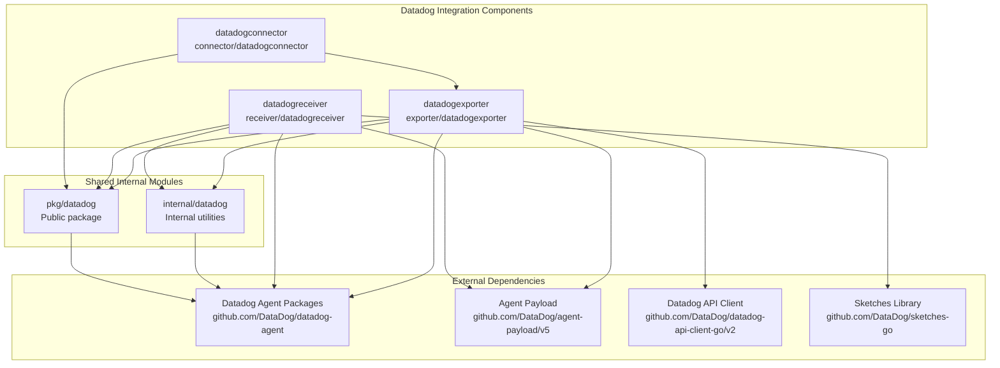
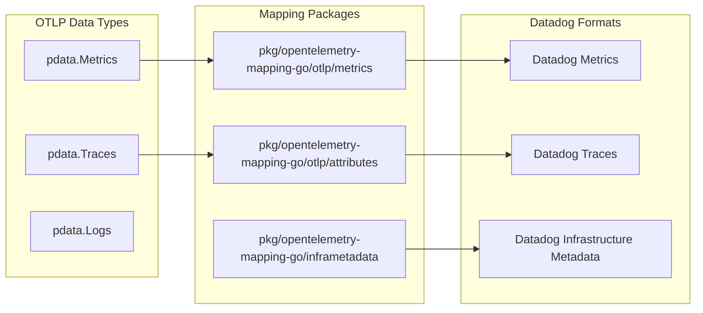
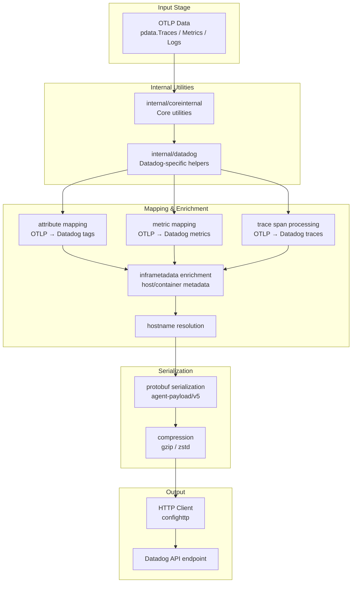
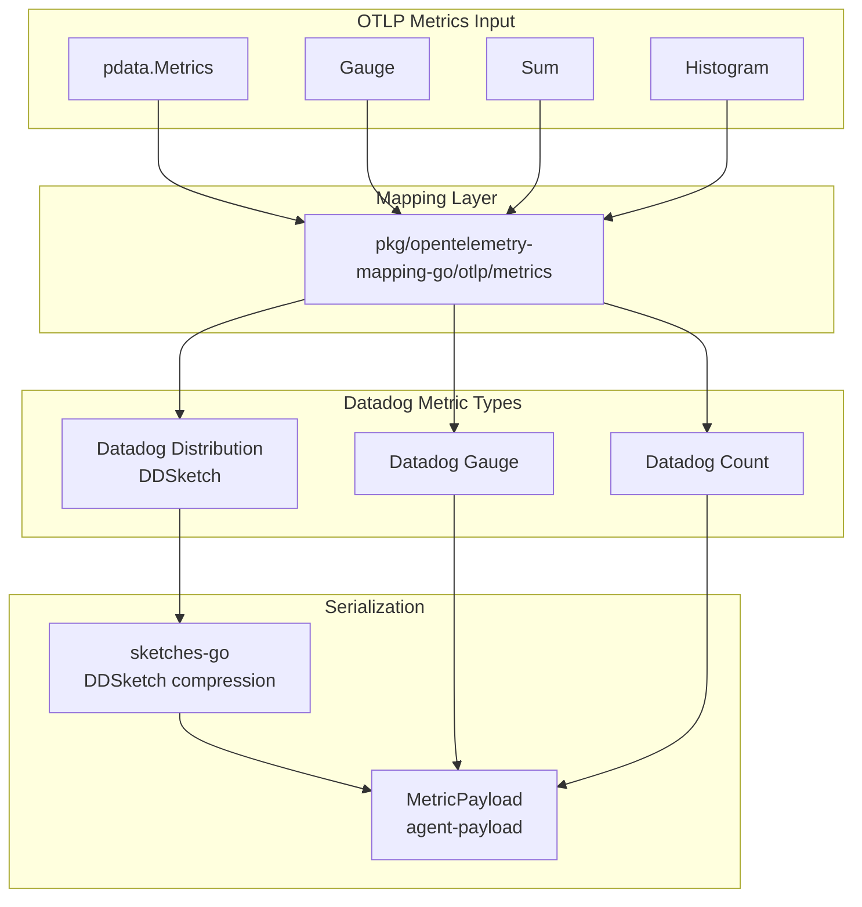
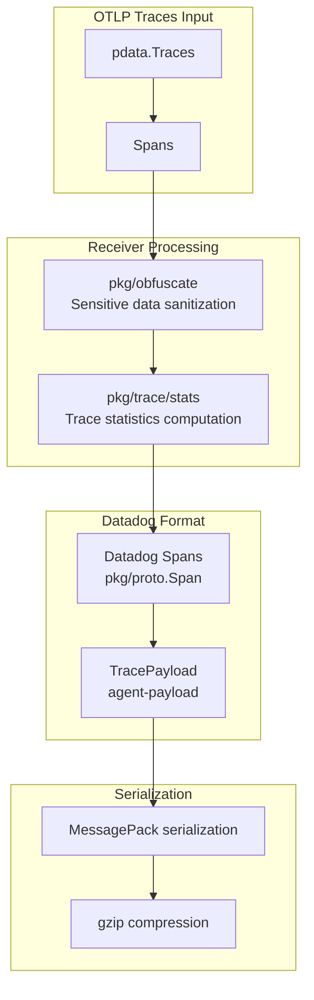
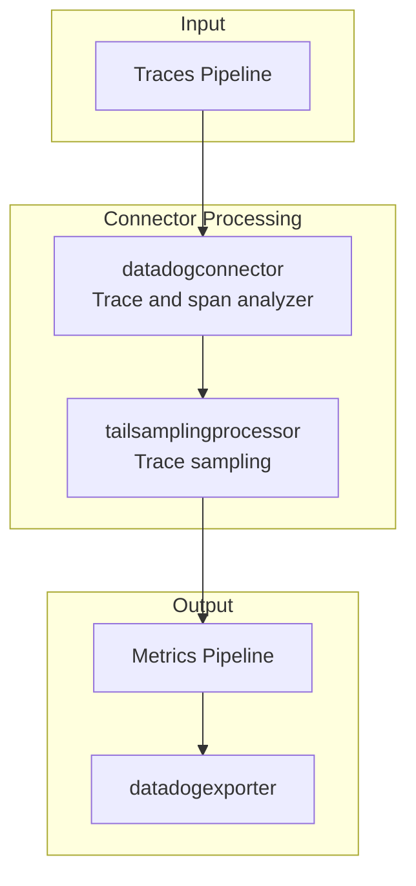

This document explains the shared module dependencies and the data transformation pipeline used by the Datadog integration components (`datadogexporter`, `datadogreceiver`, `datadogconnector`). It covers the internal utility modules, dependencies on Datadog Agent packages (e.g., config, logging, tagging, forwarding, obfuscation, serialization), OTLP mapping implementations, and the complete data flow from OpenTelemetry Protocol (OTLP) format to Datadog's native formats.

For details on the component-specific architecture, see [Datadog Components Architecture]().

## Overview of Shared Modules

The Datadog integration is architected around two shared modules that provide common functionality consumed by exporter, receiver, and connector components.

### Module Hierarchy

This diagram highlights how Datadog integration components depend on shared internal utilities, public `pkg/datadog` packages, and core Datadog Agent libraries for telemetry enrichment, serialization, and communication.

Sources: [exporter/datadogexporter/go.mod:6-30](), [connector/datadogconnector/go.mod:6-7](), [receiver/datadogreceiver/go.mod:6-20]().

### internal/datadog Module

The `internal/datadog` module encapsulates internal helpers and utilities specifically tailored for Datadog integration. It provides platform-specific metadata detection (for AWS, GCP, Kubernetes), hostname validation, and utilities closely integrated with the Datadog Agent ecosystem.

Key characteristics:

| Functionality | Details | Usage |
|---------------|---------|-------|
| **Platform Metadata Detection** | Integrates with AWS SDK, GCP detectors, and Kubernetes config internally | Used to enrich telemetry with cloud and orchestrator metadata |
| **Hostname Validation** | Utilizes Datadog Agent's hostname validation logic | Ensures consistent resource identity across pipelines |
| **Cloud Providers Support** | AWS ECS utilities and Kubernetes config detection | Leverages internal/ aws/ecsutil and internal/k8sconfig |

This module is not exposed publicly and serves as a foundation for higher-level components.

Sources: [internal/datadog/go.mod:7-21](), [exporter/datadogexporter/go.mod:29-29](), [receiver/datadogreceiver/go.mod:16-16]().

### pkg/datadog Module

The `pkg/datadog` module is a public shared package that contains common configurations, constants, and helper types used across Datadog receiver, exporter, and connector components. It covers configuration domains for metrics, traces, and host metadata.

Representative files:

| File | Purpose | Lines |
|-------|---------|-------|
| `pkg/datadog/config/config.go` | Base configuration structures and helpers | [pkg/datadog/config/config.go:1-50]() |
| `pkg/datadog/config/metrics.go` | Datadog metrics-specific configuration | [pkg/datadog/config/metrics.go:1-40]() |
| `pkg/datadog/config/traces.go` | Trace-specific configuration and constants | [pkg/datadog/config/traces.go:1-40]() |
| `pkg/datadog/config/host.go` | Configuration for host metadata enrichment | [pkg/datadog/config/host.go:1-30]() |

This public package provides reusable abstractions for other components to build upon.

Sources: [pkg/datadog/go.mod:1-20](), [exporter/datadogexporter/go.mod:30-30](), [connector/datadogconnector/go.mod:7-7](), [receiver/datadogreceiver/go.mod:19-19]().

## Datadog Agent Package Dependencies

Datadog components rely heavily on the official Datadog Agent packages for internal data representation, protocol handling, serialization, and enrichment capabilities.

### OpenTelemetry Mapping Packages

The conversion from OpenTelemetry's data model (pdata) to Datadog's native internal representations is handled by specialized mapping packages, mostly provided by the Datadog Agent.

The mapping packages:

| Package | Responsibility | Used By |
|---------|----------------|---------|
| `otlp/metrics` | Converts pdata.Metrics to Datadog metrics representations | `datadogexporter` |
| `otlp/attributes` | Maps OTLP attributes to Datadog tags for traces and metrics | `datadogexporter` and `datadogreceiver` |
| `inframetadata` | Enrich metrics and traces with host and orchestrator metadata | `datadogexporter` and `internal/datadog` |

These packages implement core translation logic tuned for Datadog's telemetry data formats.

Sources: [exporter/datadogexporter/go.mod:18-20](), [receiver/datadogreceiver/go.mod:48-49](), [internal/datadog/go.mod:7-8]().

### Protocol and Serialization Packages

The Datadog components utilize packages mainly from the agent repository to handle protocol payloads, compression, and data obfuscation:

| Package | Purpose | Components Using |
|---------|---------|------------------|
| `agent-payload/v5` | Protocol buffer definitions and serialization of agent payloads | Exporter, Receiver, Connector |
| `pkg/proto` | Protobuf message definitions for traces and metrics | Exporter, Receiver, Connector |
| `pkg/obfuscate` | Obfuscation of sensitive data in trace spans | `datadogreceiver` |
| `pkg/trace/stats` | Span statistics computation | `datadogreceiver` |
| `pkg/trace/traceutil` | Trace utilities for manipulation and enhancement | `datadogreceiver` |
| `comp/serializer/logscompression` | Compression for logs payloads (gzip, zstd) | `datadogexporter` |
| `comp/trace/compression/impl-gzip` | Gzip compression for trace payloads | `datadogexporter` |

These dependencies provide foundational agent protocol capabilities and data sanitation.

Sources: [exporter/datadogexporter/go.mod:6-25](), [receiver/datadogreceiver/go.mod:6-11]().

## Data Flow Architecture

This section describes the end-to-end data flow from incoming OTLP signals through transformation layers to outgoing Datadog native payloads.

### Complete Data Flow Pipeline

This pipeline starts with OTLP-formatted telemetry entering the components. It passes through core utilities and Datadog-specific helpers that apply platform metadata. Signals are then mapped into Datadog's internal representation formats enriched with infra metadata and hostname resolution. Finally, data is serialized and compressed before being sent out via configured HTTP clients to Datadog's backend.

Sources: [exporter/datadogexporter/go.mod:28-49](), [exporter/datadogexporter/hostmetadata.go:1-50]().

### Metrics Data Flow

The metrics path performs detailed translation of OTLP metric points to Datadog metric types with support for distribution representations.

The mapping package converts various OTLP metric types (gauges, sums, histograms) into Datadog metric formats, utilizing the DDSketch library (`sketches-go`) for compressing distribution metrics. Finally, metrics are encapsulated into an agent-payload `MetricPayload`.

Sources: [exporter/datadogexporter/go.mod:20-25](), [receiver/datadogreceiver/go.mod:13-13](), [pkg/datadog/config/metrics.go:1-40]().

### Traces Data Flow

The trace pipeline processes OTLP spans with additional obfuscation and statistics before serialization.

Here OTLP traces are converted into Datadog's `pkg/proto.Span` format after applying obfuscation of sensitive fields and computing trace-level statistics. The trace payload is then serialized using MessagePack and compressed using gzip before transmission.

Sources: [receiver/datadogreceiver/go.mod:7-11](), [exporter/datadogexporter/go.mod:22-23](), [pkg/datadog/config/traces.go:1-40]().

## Connector Data Flow

The `datadogconnector` component analyzes trace spans to generate Datadog-style APM statistics which are then fed into the metrics pipeline.

This flow shows how incoming trace data is processed by the `datadogconnector` to emit derived metrics (e.g., APM stats), leveraging tail sampling before forwarding metrics downstream to the exporter.

Sources: [connector/datadogconnector/go.mod:6-8](), [connector/datadogconnector/factory.go:1-30]().

## Integration Test Infrastructure

The Datadog integration test suite uses a combination of real components and mock implementations to validate the full data path from source to Datadog backend.

| Component | Role | Package Reference |
|-----------|------|-------------------|
| `hostmetricsreceiver` | Provides realistic host metrics | `receiver/hostmetricsreceiver` [exporter/datadogexporter/integrationtest/go.mod:14-14]() |
| `datadogconnector` | Validates APM stats generation | `connector/datadogconnector` [exporter/datadogexporter/integrationtest/go.mod:9-9]() |
| `tailsamplingprocessor` | Verifies trace sampling correctness | `processor/tailsamplingprocessor` [exporter/datadogexporter/integrationtest/go.mod:13-13]() |
| `mockdatadogagentexporter` | Mocks Datadog Agent API endpoints for integration tests | `testbed/mockdatasenders` [testbed/go.mod:32-32]() |
| `testutil` | OTLP test helpers from Datadog Agent libraries | `comp/otelcol/otlp/testutil` [internal/datadog/go.mod:6-6]() |

These components enable end-to-end testing scenarios covering metrics and traces in the Datadog integration context.

Sources: [exporter/datadogexporter/integrationtest/go.mod:6-14](), [testbed/go.mod:32-32](), [internal/datadog/go.mod:6-6]().

---

This page has detailed the Datadog integration's shared module dependencies, core data transformation pipeline, key function groups, and how OpenTelemetry signals are eventually converted and exported to Datadog. It also outlined the major dependencies on Datadog Agent libraries and the internal/pkg module split that enables modular and maintainable integration components.