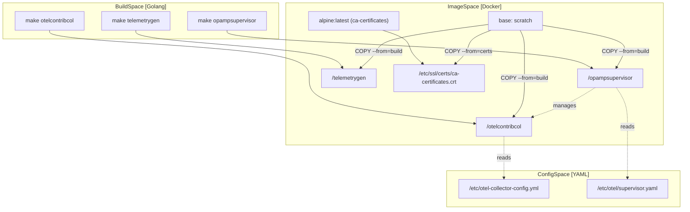
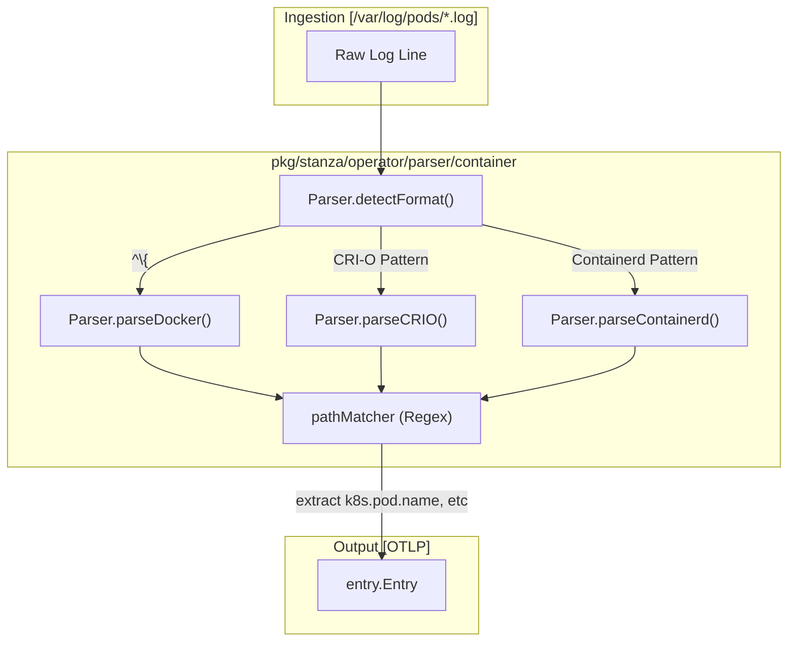

This page documents the deployment patterns for the OpenTelemetry Collector Contrib and its associated ecosystem. It covers Docker container configurations, Kubernetes log processing via the `filelogreceiver`, container log format detection (Docker, CRI-O, containerd), and orchestration examples using Docker Compose.

---

## Container Deployment Architecture

The repository provides Dockerfiles for core collector distributions and specialized management tools. These images follow a consistent security-hardened pattern using minimal base images.

### Core Collector Images

The primary collector binary is packaged into several functional variants:

1.  **otelcontribcol**: The standard distribution containing all contributed components [cmd/otelcontribcol/Dockerfile:1-15]().
2.  **opampsupervisor**: A managed deployment that includes both the OpAMP supervisor and the collector binary for remote lifecycle management [cmd/opampsupervisor/Dockerfile:1-22]().
3.  **telemetrygen**: A utility container for generating synthetic traces, metrics, and logs for testing [cmd/telemetrygen/Dockerfile:1-17]().

### Multi-Stage Build Pattern

All production-grade Dockerfiles utilize a multi-stage build to ensure a minimal attack surface and small image size.

*   **Preparation Stage**: Uses `alpine` to fetch CA certificates and set up filesystem structures [exporter/loadbalancingexporter/example/Dockerfile:8-9]().
*   **Build Stage (Optional)**: Compiles the binary from source, often using `golang` images [exporter/loadbalancingexporter/example/Dockerfile:1-7]().
*   **Final Stage**: Uses `scratch` (an empty base) to host only the statically linked binary and required certificates [exporter/loadbalancingexporter/example/Dockerfile:11-18]().

**Container Entity Relationship Diagram**

**Sources:**
- [exporter/loadbalancingexporter/example/Dockerfile:1-20]()
- [exporter/clickhouseexporter/example/Dockerfile:1-13]()
- [cmd/telemetrygen/Dockerfile:1-17]()
- [cmd/opampsupervisor/Dockerfile:1-22]()
- [cmd/otelcontribcol/Dockerfile:1-15]()

---

## Kubernetes Log Processing

The `filelogreceiver` is the primary component for tailing and parsing logs from files, specifically optimized for Kubernetes environments where logs are stored in `/var/log/pods/` [receiver/filelogreceiver/README.md:2-5]().

### File Log Receiver Implementation

The receiver is built on the `pkg/stanza` framework and uses a `Manager` to orchestrate file discovery and rotation [pkg/stanza/fileconsumer/config.go:111-165]().

**Key Functions and Components:**
*   **`Manager.poll()`**: Periodically checks watched paths for new entries and handles batching [pkg/stanza/fileconsumer/file.go:134-172]().
*   **`Reader.ReadToEnd()`**: The core loop that reads data from a file, handles decompression (gzip), and manages offsets [pkg/stanza/fileconsumer/internal/reader/reader.go:72-131]().
*   **`Reader.createGzipReader()`**: Handles the specific logic for resuming reading from a compressed file by calculating `decompressedBytesToSkip` [pkg/stanza/fileconsumer/internal/reader/reader.go:134-173]().
*   **`Fingerprint`**: To handle file rotation, the receiver reads a small portion of the file (defined by `FingerprintSize`) to uniquely identify it even if renamed [pkg/stanza/fileconsumer/config.go:87](), [pkg/stanza/fileconsumer/internal/reader/reader.go:31]().

### Container Log Format Detection

In Kubernetes, logs are typically written in one of three formats: Docker (JSON), CRI-O, or containerd. The `pkg/stanza/operator/parser/container` package provides an automated way to detect and parse these formats [pkg/stanza/operator/parser/container/parser.go:26-34]().

*   **`Parser.detectFormat()`**: Inspects the log entry to determine if it matches `dockerPattern`, `crioPattern`, or `containerdPattern` [pkg/stanza/operator/parser/container/parser.go:92-99]().
*   **`Parser.ProcessBatch()`**: Efficiently processes batches of logs, separating CRI-based logs for recombination [pkg/stanza/operator/parser/container/parser.go:72-175]().
*   **Metadata Extraction**: Automatically extracts Kubernetes metadata (namespace, pod name, UID, container name) from the file path if `add_metadata_from_filepath` is enabled [pkg/stanza/operator/parser/container/parser.go:65](), [pkg/stanza/operator/parser/container/parser.go:34]().

**Container Log Processing Diagram**

**Sources:**
- [receiver/filelogreceiver/README.md:21-40]()
- [pkg/stanza/fileconsumer/file.go:134-172]()
- [pkg/stanza/fileconsumer/internal/reader/reader.go:72-173]()
- [pkg/stanza/operator/parser/container/parser.go:26-175]()

---

## Docker Compose Examples

Docker Compose is used to demonstrate complex multi-service observability patterns, such as monitoring databases or securing telemetry pipelines.

### Database Observability Pattern

The Couchbase example [examples/couchbase/docker-compose.yaml:1-25]() demonstrates a three-tier observability stack:
1.  **Target Service**: Couchbase Enterprise image [examples/couchbase/docker-compose.yaml:3-11]().
2.  **Collector**: Uses `otel/opentelemetry-collector-contrib` image, mounting a local `otel-collector-config.yaml` [examples/couchbase/docker-compose.yaml:12-16]().
3.  **Backend**: Prometheus for metric storage [examples/couchbase/docker-compose.yaml:19-24]().

### Secure Tracing Pattern

The secure tracing example [examples/secure-tracing/docker-compose.yaml:1-27]() highlights the use of TLS for telemetry transport:
*   **Envoy Proxy**: Configured with certificates (`envoy.crt`, `envoy.key`, `ca.crt`) [examples/secure-tracing/docker-compose.yaml:3-13]().
*   **OTel Collector**: Configured with matching certificates and exposes the OTLP gRPC receiver and health check extension [examples/secure-tracing/docker-compose.yaml:14-24]().

### Specialized Database Test Environments
The repository contains specialized Dockerfiles for integration testing of database receivers:
*   **SQL Server**: Custom image for testing `sqlqueryreceiver` with pre-configured databases [receiver/sqlqueryreceiver/testdata/integration/sqlserver/Dockerfile:1-12]().
*   **Redis Cluster**: Complex multi-port configuration for testing Redis cluster monitoring [receiver/redisreceiver/testdata/integration/Dockerfile.cluster:1-31]().

**Sources:**
- [examples/couchbase/docker-compose.yaml:1-25]()
- [examples/secure-tracing/docker-compose.yaml:1-27]()
- [receiver/sqlqueryreceiver/testdata/integration/sqlserver/Dockerfile:1-12]()
- [receiver/redisreceiver/testdata/integration/Dockerfile.cluster:1-31]()

---

## Deployment Configuration Reference

### Standard Port Exposure

Collector containers consistently expose ports for standard receivers and extensions [exporter/loadbalancingexporter/example/Dockerfile:19]():

| Port | Protocol | Usage |
| :--- | :--- | :--- |
| `4317` | TCP | OTLP gRPC Receiver |
| `4318` | TCP | OTLP HTTP Receiver |
| `13133` | TCP | Health Check Extension |

### Security and Runtime Defaults

*   **Non-Root User**: Containers run as UID `10001` [exporter/loadbalancingexporter/example/Dockerfile:13-14]().
*   **Filesystem**: Final images use `scratch`, containing only the binary and `ca-certificates.crt` [exporter/loadbalancingexporter/example/Dockerfile:11-17]().
*   **Log Processing Parameters**: The `filelogreceiver` defaults to `utf-8` encoding [pkg/stanza/fileconsumer/config.go:36]() and a `500ms` force flush period [pkg/stanza/fileconsumer/config.go:71]().

**Sources:**
- [exporter/loadbalancingexporter/example/Dockerfile:11-19]()
- [pkg/stanza/fileconsumer/config.go:34-77]()
- [examples/secure-tracing/docker-compose.yaml:22-24]()