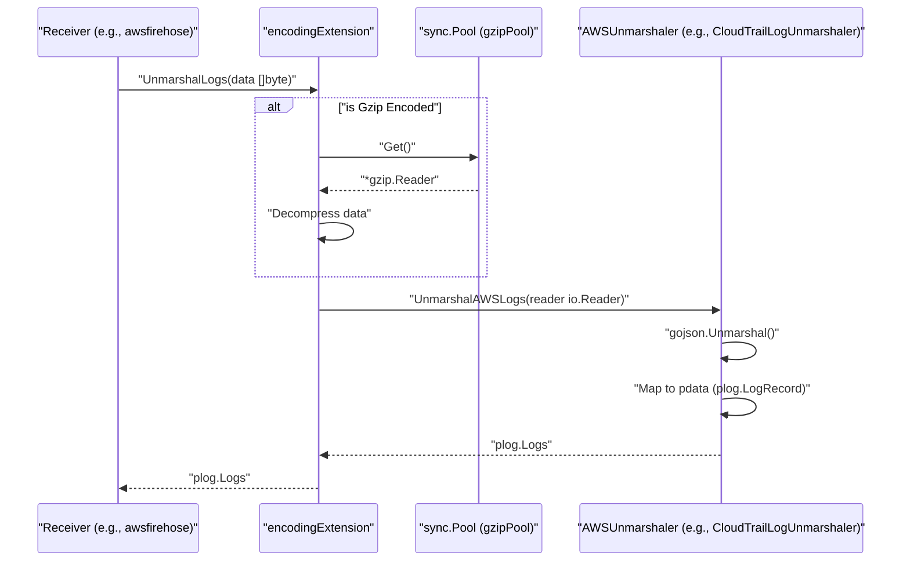
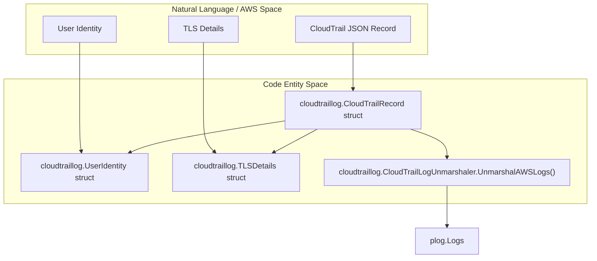
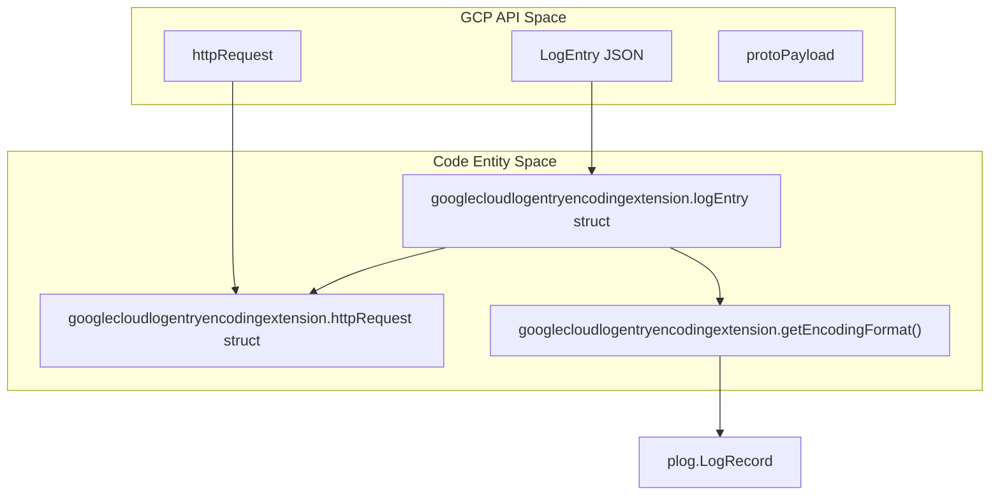
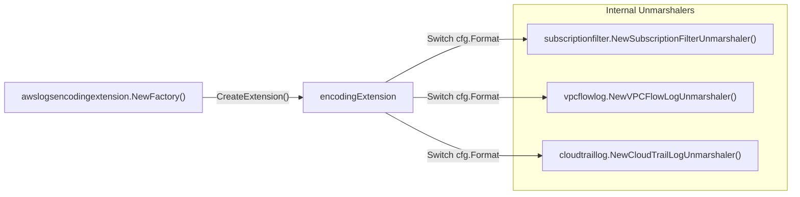

Encoding extensions provide a unified framework within the `opentelemetry-collector-contrib` repository for sharing encoding and decoding logic across different components, such as receivers and exporters. This modularity allows components to support various data formats (e.g., OTLP, Zipkin, Jaeger, Avro, JSON, AWS-specific logs, Google Cloud LogEntry) without reimplementing the unmarshaling logic for each component.

## Architecture and Framework

The encoding framework is defined in the `extension/encoding` module. It establishes standard interfaces that extensions must implement to be used by receivers like `awsfirehose` or `awslambda`.

### Key Interfaces

The framework defines several primary interfaces for handling telemetry data:

*   **`LogsUnmarshalerExtension`**: Specifically for log data, this interface defines the `UnmarshalLogs([]byte) (plog.Logs, error)` method [extension/encoding/awslogsencodingextension/extension.go:41-41]().
*   **`LogsDecoderExtension`**: Used for streaming scenarios where logs need to be decoded from an `io.Reader` [extension/encoding/awslogsencodingextension/extension.go:42-42]().
*   **`AWSUnmarshaler`**: An internal interface used by AWS-specific extensions to handle the nuances of AWS service logs [extension/encoding/awslogsencodingextension/extension.go:49-49]().
*   **`StreamingLogsUnmarshaler`**: An interface for unmarshalers that support `io.Reader` inputs for efficient stream processing [extension/encoding/awslogsencodingextension/internal/unmarshaler/cloudtraillog/unmarshaler.go:32-32]().

### Data Flow Diagram: Decoding AWS Logs

The following diagram illustrates how an encoding extension (specifically the `awslogsencodingextension`) interacts with a receiver to transform raw bytes into OpenTelemetry `plog.Logs`.

**Title: AWS Logs Decoding Sequence**

Sources: [extension/encoding/awslogsencodingextension/extension.go:159-179](), [extension/encoding/awslogsencodingextension/internal/unmarshaler/cloudtraillog/unmarshaler.go:154-165]()

## AWS Logs Encoding Extension

The `awslogsencodingextension` is a specialized implementation designed to unmarshal logs produced by various AWS services into the OpenTelemetry Log model [extension/encoding/awslogsencodingextension/README.md:4-4]().

### Supported Formats

The extension supports a wide array of AWS-specific log formats [extension/encoding/awslogsencodingextension/internal/constants/format.go:7-21]():

| Format Value | AWS Service / Log Type | Description |
|---|---|---|
| `cloudwatch` | CloudWatch Logs | Subscription Filter events [extension/encoding/awslogsencodingextension/README.md:18-18]() |
| `vpcflow` | VPC Flow Logs | Supports plain-text and Parquet formats [extension/encoding/awslogsencodingextension/README.md:19-20]() |
| `s3access` | S3 Access Logs | Amazon S3 server access logs [extension/encoding/awslogsencodingextension/README.md:22-22]() |
| `cloudtrail` | CloudTrail | AWS CloudTrail API call logs [extension/encoding/awslogsencodingextension/README.md:23-23]() |
| `elbaccess` | ELB Access Logs | Supports ALB, NLB, and CLB logs [extension/encoding/awslogsencodingextension/README.md:24-27]() |
| `waf` | WAF Logs | AWS Web Application Firewall logs [extension/encoding/awslogsencodingextension/extension.go:89-89]() |
| `networkfirewall` | Network Firewall | AWS Network Firewall event logs [extension/encoding/awslogsencodingextension/README.md:28-28]() |

### Implementation Detail: CloudTrail Unmarshaling

The CloudTrail unmarshaler demonstrates the mapping of service-specific JSON to OTLP. It handles both standard log records and digest files [extension/encoding/awslogsencodingextension/internal/unmarshaler/cloudtraillog/unmarshaler.go:129-141]().

**Title: CloudTrail to Code Entities Mapping**

Sources: [extension/encoding/awslogsencodingextension/internal/unmarshaler/cloudtraillog/unmarshaler.go:34-119](), [extension/encoding/awslogsencodingextension/internal/unmarshaler/cloudtraillog/unmarshaler.go:154-170]()

### CloudWatch Routing
When multiple CloudWatch log groups feed a single pipeline, this extension can dispatch each envelope to a configured inner encoding extension based on log group or log stream patterns [extension/encoding/awslogsencodingextension/README.md:92-95](). This is configured via `cloudwatch.streams` and supports two payload modes:
*   **`message`**: Dispatches only the `event.message` bytes [extension/encoding/awslogsencodingextension/README.md:121-122]().
*   **`envelope`**: Dispatches the entire CloudWatch subscription envelope raw bytes [extension/encoding/awslogsencodingextension/README.md:128-129]().

## Google Cloud LogEntry Encoding Extension

The `googlecloudlogentryencodingextension` unmarshals Google Cloud [LogEntry](https://cloud.google.com/logging/docs/reference/v2/rest/v2/LogEntry) messages [extension/encoding/googlecloudlogentryencodingextension/README.md:4-4]().

### Supported Log Types
The extension includes specialized parsers for several GCP log types [extension/encoding/googlecloudlogentryencodingextension/log_entry.go:71-93]():
*   **Cloud Audit Logs**: Activity, Data Access, System Event, and Policy logs.
*   **VPC Flow Logs**: Network Management and Compute logs.
*   **Load Balancer Logs**: Global and Regional Application Load Balancer logs.
*   **Network Load Balancer Logs**: Proxy and Passthrough NLB logs.
*   **Cloud DNS Logs**: Query logs.

### Mapping Logic
GCP LogEntry fields are mapped to OTLP log record attributes and fields. For example, `receiveTimestamp` maps to `observedTimeUnixNano`, and `severity` is converted to `severityNumber` and `severityText` [extension/encoding/googlecloudlogentryencodingextension/README.md:49-53]().

**Title: Google Cloud LogEntry Code Mapping**

Sources: [extension/encoding/googlecloudlogentryencodingextension/log_entry.go:96-170](), [extension/encoding/googlecloudlogentryencodingextension/log_entry.go:71-93]()

## Available Encoding Extensions

The repository provides several encoding extensions:

| Extension | Purpose | Implementation Detail |
|---|---|---|
| `otlp` | OpenTelemetry Protocol | Protobuf/JSON encoding for OTLP signals |
| `zipkin` | Zipkin Traces | Support for JSON and Protobuf formats |
| `jaeger` | Jaeger Traces | Support for Jaeger Thrift and Protobuf |
| `avro` | Apache Avro | Binary encoded records |
| `json` | Generic JSON | Flexible mapping for JSON telemetry |
| `text` | Plain Text | Line-delimited or raw text |
| `skywalking` | SkyWalking | Native SkyWalking protocol unmarshaling |

## Internal Logic and Performance

### Memory Management
To handle high-throughput log streams, the AWS extension uses a `sync.Pool` for `gzip.Reader` objects [extension/encoding/awslogsencodingextension/extension.go:52-52](). This reduces GC pressure when processing many compressed payloads from services like CloudWatch Logs [extension/encoding/awslogsencodingextension/extension.go:169-169]().

### Feature Gates
The extensions use feature gates to manage experimental behavior or transitions:
*   `extension.awslogsencoding.vpcflow.start_iso8601`: Enables ISO-8601 format for VPC flow logs [extension/encoding/awslogsencodingextension/extension.go:75-75]().
*   `extension.awslogsencoding.cloudtrail.enable_user_identity_prefix`: Prefixes user identity attributes [extension/encoding/awslogsencodingextension/extension.go:103-103]().

**Title: Extension Factory to Unmarshaler Relationship**

Sources: [extension/encoding/awslogsencodingextension/factory.go](), [extension/encoding/awslogsencodingextension/extension.go:58-128]()

Sources:
* [extension/encoding/awslogsencodingextension/extension.go:1-180]()
* [extension/encoding/awslogsencodingextension/internal/unmarshaler/cloudtraillog/unmarshaler.go:1-170]()
* [extension/encoding/googlecloudlogentryencodingextension/log_entry.go:1-181]()
* [extension/encoding/awslogsencodingextension/README.md:1-135]()
* [extension/encoding/googlecloudlogentryencodingextension/README.md:1-65]()
* [extension/encoding/awslogsencodingextension/internal/constants/format.go:1-21]()