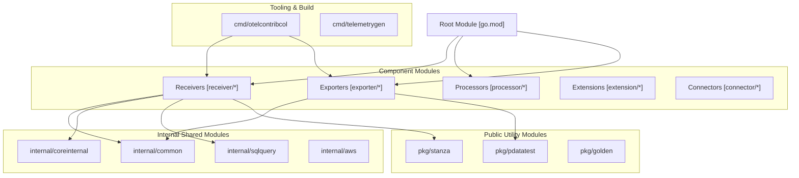
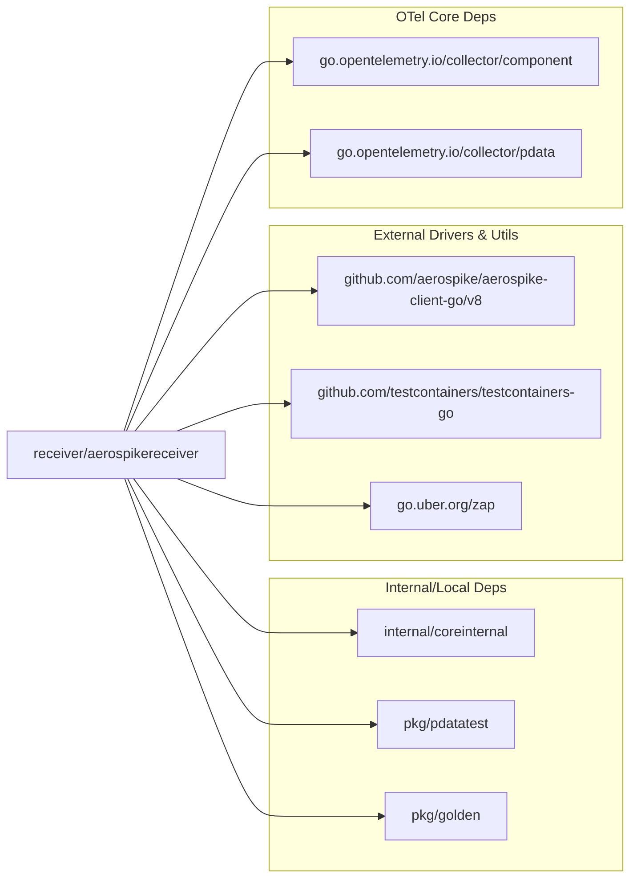

connector/datadogconnector/  @open-telemetry/collector-contrib-approvers @mx-psi @dineshg13 @jade-guiton-dd @IbraheemA
receiver/googlecloudspannerreceiver/ @open-telemetry/collector-contrib-approvers @dashpole @KiranmayiB @nsj07
```

Sources: [.github/CODEOWNERS:12-12](), [.github/CODEOWNERS:32-32](), [.github/CODEOWNERS:214-214](), [CONTRIBUTING.md:144-146]()

### Unmaintained Components and ALLOWLIST
When a component lacks active maintainers or code owners have been unresponsive for 6 weeks, it is moved to "Unmaintained" status. [README.md:61-64]()
- **ALLOWLIST**: The file `cmd/githubgen/allowlist.txt` contains a list of GitHub handles that are permitted to be code owners even if they aren't part of the primary maintainer groups. [cmd/githubgen/allowlist.txt:1-6]()
- **Removal**: The maintainers may downgrade or remove components if they pose a risk to the repository or binary distribution. [README.md:61-62]()

Sources: [.github/ISSUE_TEMPLATE/unmaintained.yaml:1-10](), [cmd/githubgen/allowlist.txt:1-6](), [README.md:61-64]()

## Component Lifecycle Testing

Every component must pass automated lifecycle tests generated by `mdatagen`. These tests verify that the component can start and shutdown cleanly without leaking resources or crashing.

### Generated Lifecycle Test Logic
The `generated_component_test.go` file contains tests that:
1. Initialize the component's `Factory`. [receiver/googlecloudspannerreceiver/factory.go:1-20]()
2. Create the component using default configuration.
3. Execute `Start()` followed by `Shutdown()`.
4. Re-execute `Start()` and `Shutdown()` on a new instance to ensure no global state corruption.

Sources: [receiver/googlecloudspannerreceiver/generated_component_test.go:1-30]()

## Promotion and Deprecation Processes

### Changelog Management
Changes to component stability or major features must be documented via `.chloggen`. This system generates `CHANGELOG.md` (for users) and `CHANGELOG-API.md` (for developers). [CONTRIBUTING.md:61-65]()

1. Create an entry: `make chlog-new`. [CONTRIBUTING.md:70-70]()
2. Validate: `make chlog-validate`. [CONTRIBUTING.md:72-72]()
3. Entries are transcribed and deleted during the release process. [CONTRIBUTING.md:75-76]()

Sources: [CONTRIBUTING.md:59-76](), [.chloggen/config.yaml:1-9]()

### Deprecation and Removal
Components are deprecated when a superior alternative exists or the underlying technology is obsolete. Deprecation is signaled by:
1. Updating `metadata.yaml` stability levels.
2. Adding a changelog entry in the `user` category. [CONTRIBUTING.md:81-81]()
3. Updating issue templates and labels via `githubgen` automation. [.github/ISSUE_TEMPLATE/unmaintained.yaml:1-10]()

Sources: [CONTRIBUTING.md:59-85](), [.chloggen/config.yaml:1-9](), [.github/ISSUE_TEMPLATE/unmaintained.yaml:1-10]()

# Module Dependencies and Internal Architecture


## Purpose and Scope

This document describes the Go module architecture, dependency management, and internal package organization of the `opentelemetry-collector-contrib` repository. It covers the structure of over 200 independent modules, the role of internal shared packages, the use of `replace` directives for monorepo development, and the tooling used to maintain version synchronization across the massive dependency graph.

For information about component lifecycle and code generation, see [Component Lifecycle and Stability Management](). For information about the build system and development tools, see [Build System and Development Infrastructure]().

---

## Go Module Structure Overview

The repository is organized as a **monorepo containing over 200 independent Go modules**. The root `go.mod` file serves as a reference but explicitly states it is not used for building official binaries [go.mod:3-9](). Official distributions like `otelcol-contrib` are assembled using the OpenTelemetry Collector Builder (OCB) based on specific manifests [reports/distributions/contrib.yaml:1-5]().

Each component (receiver, processor, exporter, extension, connector) and shared package maintains its own `go.mod` file. This architecture enables:
- **Selective dependency updates**: Updating a driver in one receiver doesn't force a rebuild of unrelated exporters.
- **Independent versioning**: Components can follow different stability tracks while synchronized via `versions.yaml` [versions.yaml:4-7]().
- **Reduced blast radius**: Dependency conflicts are isolated to specific modules, preventing a single library version conflict from blocking the entire repository.

### Module Distribution Pattern

The following diagram maps the repository's logical structure to the physical module organization:


**Sources:** [go.mod:1-11](), [versions.yaml:18-31](), [cmd/otelcontribcol/builder-config.yaml:16-60]()

---

## Internal Shared Packages Architecture

Internal packages under `internal/*` provide shared functionality restricted by Go's visibility rules to prevent external imports. These are essential for code reuse across the 200+ components.

### internal/common
Provides basic utilities used across multiple component types. It is a foundational dependency for many receivers and exporters [versions.yaml:130](), [.chloggen/config.yaml:129]().

### internal/coreinternal
Contains logic that complements the OpenTelemetry Collector core. It is frequently used for data manipulation or shared helper functions that are not yet ready for the core repository. For example, the `aerospikereceiver` relies on `coreinternal` for its operations [receiver/aerospikereceiver/go.mod:8](), [internal/coreinternal/go.mod:1-5]().

### internal/metadataproviders
Abstracts cloud and orchestration platform metadata retrieval (AWS EC2/ECS, Docker, Kubernetes). This is heavily utilized by the `resourcedetectionprocessor` and various observers to enrich telemetry with environment context [versions.yaml:143](), [.chloggen/config.yaml:142]().

### internal/sqlquery
A specialized internal module providing shared logic for database-centric receivers. It abstracts query execution and result set mapping, used by:
- `sqlqueryreceiver` [reports/distributions/contrib.yaml:227]()
- `sqlserverreceiver` [reports/distributions/contrib.yaml:228]()
- `oracledbreceiver` [reports/distributions/contrib.yaml:203]()

**Sources:** [receiver/aerospikereceiver/go.mod:8](), [versions.yaml:128-148](), [reports/distributions/contrib.yaml:222-225](), [.chloggen/config.yaml:148]()

---

## Public Utility Packages (pkg/*)

Packages under `pkg/*` are designed for public consumption and provide reusable OpenTelemetry logic across the ecosystem.

- **`pkg/stanza`**: The log processing framework used by file-based and journald receivers [versions.yaml:170](), [.chloggen/config.yaml:169]().
- **`pkg/pdatatest`**: A critical testing utility for comparing OTLP `pdata` structures with rich diffing capabilities [receiver/aerospikereceiver/go.mod:9](), [.chloggen/config.yaml:163]().
- **`pkg/golden`**: Handles "golden file" testing, reading/writing expected YAML output for integration tests [receiver/aerospikereceiver/go.sum:77](), [.chloggen/config.yaml:159]().
- **`pkg/translator/*`**: Shared logic for converting between OTLP and proprietary formats (e.g., Prometheus, Jaeger, Splunk) [versions.yaml:174-184](), [.chloggen/config.yaml:173-180]().

**Sources:** [receiver/aerospikereceiver/go.mod:9](), [versions.yaml:153-184](), [.chloggen/config.yaml:150-184]()

---

## Replace Directives and Monorepo Development

The monorepo uses **replace directives** to link modules locally. This allows a component to depend on a sibling module (like an internal package) without requiring that package to be published to a remote registry first.

### Replace Directive Implementation

Example from `receiver/aerospikereceiver/go.mod`:
```go
replace github.com/open-telemetry/opentelemetry-collector-contrib/pkg/pdatatest => ../../pkg/pdatatest
replace github.com/open-telemetry/opentelemetry-collector-contrib/pkg/pdatautil => ../../pkg/pdatautil
replace github.com/open-telemetry/opentelemetry-collector-contrib/internal/coreinternal => ../../internal/coreinternal
replace github.com/open-telemetry/opentelemetry-collector-contrib/pkg/golden => ../../pkg/golden
```
[receiver/aerospikereceiver/go.mod:120-132]()

This pattern ensures that developers can make changes to a shared package (e.g., `pkg/pdatatest`) and immediately test those changes in a dependent component (e.g., `aerospikereceiver`) without versioning overhead. The `ocb-add-replaces.sh` script automates adding these directives during the build process [internal/buildscripts/ocb-add-replaces.sh:1-10]().

**Sources:** [receiver/aerospikereceiver/go.mod:120-132](), [internal/buildscripts/ocb-add-replaces.sh:1-10]()

---

## Dependency Management Tooling

Managing a graph of 200+ modules requires specialized configuration files and automated scripts.

### versions.yaml
This file is the source of truth for module versions across the entire repository. It defines `module-sets` (like `contrib-base`) and lists every module belonging to that set [versions.yaml:4-10](). Tooling like `multimod` uses this file to batch-update versions across all `go.mod` files.

### tidylist.txt
The `internal/tidylist/tidylist.txt` file maintains a list of all modules in the repository. This is used by automated scripts to ensure that commands like `go mod tidy` are run across the entire monorepo to maintain consistency in `go.sum` files [receiver/aerospikereceiver/go.sum:1-118](), [internal/tidylist/tidylist.txt:1-200]().

### Component Mapping and Distribution
The `reports/distributions/contrib.yaml` file tracks which components are included in the standard Contrib distribution. It categorizes them by type (receiver, processor, exporter, etc.), providing a high-level view of the repository's capabilities [reports/distributions/contrib.yaml:4-241]().

**Sources:** [versions.yaml:4-31](), [reports/distributions/contrib.yaml:4-241](), [internal/tidylist/tidylist.txt:1-200]()

---

## Dependency Landscape: External Libraries

Components often pull in heavy external dependencies, which are isolated by the multi-module structure. This prevents "dependency hell" where two different receivers require conflicting versions of the same library.

### Example: aerospikereceiver Dependency Graph
The `aerospikereceiver` demonstrates how a single component manages its specific external drivers alongside internal OTel dependencies:


**Sources:** [receiver/aerospikereceiver/go.mod:5-28](), [receiver/aerospikereceiver/go.sum:11-12]()

### Version Pinning and Retractions
The repository uses `retract` directives in `go.mod` files to prevent the use of problematic versions that were previously released. The root `go.mod` includes retractions for versions like `v0.76.2`, `v0.76.1`, `v0.65.0`, and `v0.37.0` [go.mod:13-18](). Individual components like `aerospikereceiver` also inherit these versioning constraints through the monorepo synchronization process [receiver/aerospikereceiver/go.mod:126-130]().

**Sources:** [go.mod:13-18](), [receiver/aerospikereceiver/go.mod:126-130]()