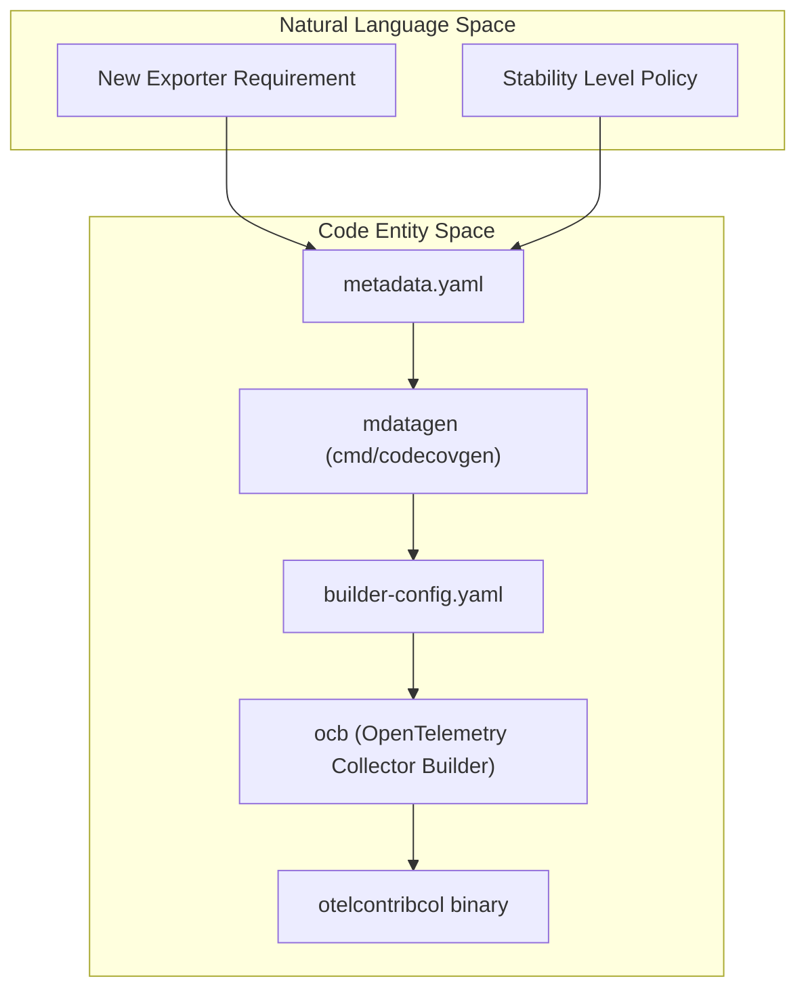
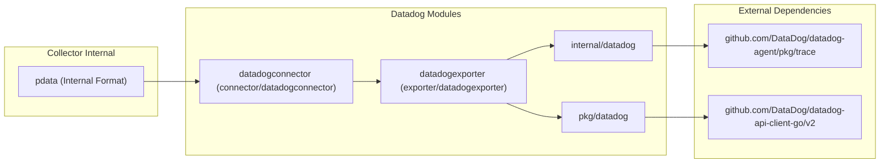

This page defines codebase-specific terms, jargon, and domain concepts used throughout the `opentelemetry-collector-contrib` repository. It serves as a detailed reference for onboarding engineers to understand implementation details, architectural patterns, data flow, and governance unique to this project.

---

## Core Component Types

The OpenTelemetry Collector Contrib repository extends the core collector by providing additional components. The fundamental building blocks are organized as follows:

| Term | Definition | Key Code Pointers |
| :--- | :--- | :--- |
| **Receiver** | Collects and ingests telemetry data from external sources into the collector's internal format. Examples include `kafkareceiver` and `datadogreceiver`. Receivers translate incoming data into `pdata` format. | [receiver/datadogreceiver/go.mod:1-45](), [receiver/kafkareceiver/go.mod:1-10]() |
| **Processor** | Middleware components that transform, filter, sample, or augment telemetry data in the pipeline. For example, `tailsamplingprocessor`. | [exporter/datadogexporter/integrationtest/go.mod:13-13]() |
| **Exporter** | Sends the processed data from the collector to external backends. Exporters handle OTLP to target platform data translation. Includes `datadogexporter` and `kafkaexporter`. | [exporter/datadogexporter/go.mod:1-50](), [exporter/kafkaexporter/go.mod:1-10]() |
| **Extension** | Components that provide auxiliary services (auth, health, storage) but do not process telemetry data directly. | [reports/distributions/contrib.yaml:64-101]() |
| **Connector** | Hybrid components acting as both a receiver and an exporter, used to bridge pipeline segments or to create metrics from other signals (e.g., `datadogconnector`). | [connector/datadogconnector/go.mod:1-27]() |

### Component Factories and Metadata

Each component is instantiated via a `Factory`. The `contrib` distribution includes a massive list of these components categorized by type.

**Sources:**
[reports/distributions/contrib.yaml:4-257](), [connector/datadogconnector/go.mod:1-27]()

---

## Infrastructure and Tooling

### OpenTelemetry Collector Builder (ocb)

The Builder (`ocb`) compiles a custom collector binary with only selected components as specified in the builder configuration (`builder-config.yaml`). It generates `components.go`, auto-registering component factories.

- **otelcontribcol**: The primary distribution configuration. [cmd/otelcontribcol/builder-config.yaml:1-15]()
- **oteltestbedcol**: A specialized distribution for performance and end-to-end testing. [.github/CODEOWNERS:25-25]()

### mdatagen

A code generator tool processing individual component's `metadata.yaml` files. It generates auxiliary code such as telemetry metrics helpers and configuration structures.

- Ownership: [.github/CODEOWNERS:21-27]() (associated with `githubgen` and `codecovgen`)

### chloggen

Manages changelog entries. Contributors add short YAML files under `.chloggen/`, which this tool merges into `CHANGELOG.md`.

- Configuration: [.chloggen/config.yaml:1-5]()

### OpAMP Supervisor

A tool for managing OpenTelemetry Collector instances remotely using the Open Agent Management Protocol (OpAMP). It handles collector configuration and health reporting.

- Ownership: [.github/CODEOWNERS:23-23]()
- Command location: `cmd/opampsupervisor/` [cmd/opampsupervisor/go.mod:1-10]()

### multimod / crosslink / tidylist

Utilities designed to manage the monorepo's extensive Go module graph across 200+ modules.

- Module version tracking: [versions.yaml:1-50]()
- Dependency tidying: [internal/tidylist/tidylist.txt:1-20]()

---

## Data Transformation and Processing

### OTTL (OpenTelemetry Transformation Language)

A domain-specific language designed for flexible, attribute-based transformations on telemetry data.

- **Functions**: Built-in operations like `truncate_all` or `base64encode` used to manipulate telemetry attributes. [pkg/ottl/ottlfuncs/functions.go:1-10](), [pkg/ottl/ottlfuncs/README.md:1-20]()

### Elasticsearch Mapping Modes

The `elasticsearchexporter` supports various mapping modes to translate OTLP data into document structures:
- `none`: Raw mapping.
- `ecs`: Elastic Common Schema.
- `otel`: OpenTelemetry native mapping.
- `bodymap`: Maps the log body specifically.

**Sources:**
[exporter/elasticsearchexporter/config.go:1-50](), [exporter/elasticsearchexporter/model.go:1-30]()

---

## Lifecycle and Governance

### Stability Levels

Each component’s signals (traces, metrics, logs) have independent stability levels (Development, Alpha, Beta, Stable, Deprecated, Unmaintained). These are often tracked via metadata and issue templates.

- Unmaintained tracking: [.github/ISSUE_TEMPLATE/unmaintained.yaml:1-20]()
- Component Labels: [.github/component_labels.txt:1-50]()

### CODEOWNERS and ALLOWLIST

Defines component ownership and identifies components allowed to exist in the repository despite maintenance status.

- **CODEOWNERS**: [.github/CODEOWNERS:1-100]()

---

## Architectural Data Flow

### From Requirement to Binary

This diagram serves to bridge the gap between a technical requirement and the final code entities produced by the build system.

**Sources:**
[cmd/otelcontribcol/builder-config.yaml:1-15](), [.github/CODEOWNERS:21-27](), [reports/distributions/contrib.yaml:1-4]()

---

### Datadog Integration Data Flow

The Datadog integration is one of the most complex in the repository, involving multiple packages and cross-module dependencies on Datadog Agent libraries.

**Sources:**
[exporter/datadogexporter/go.mod:5-32](), [connector/datadogconnector/go.mod:5-9](), [receiver/datadogreceiver/go.mod:5-24]()

---