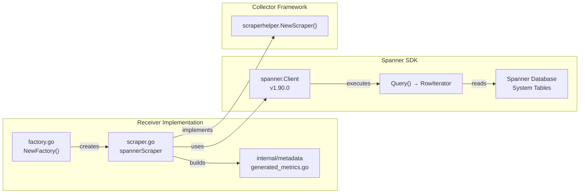
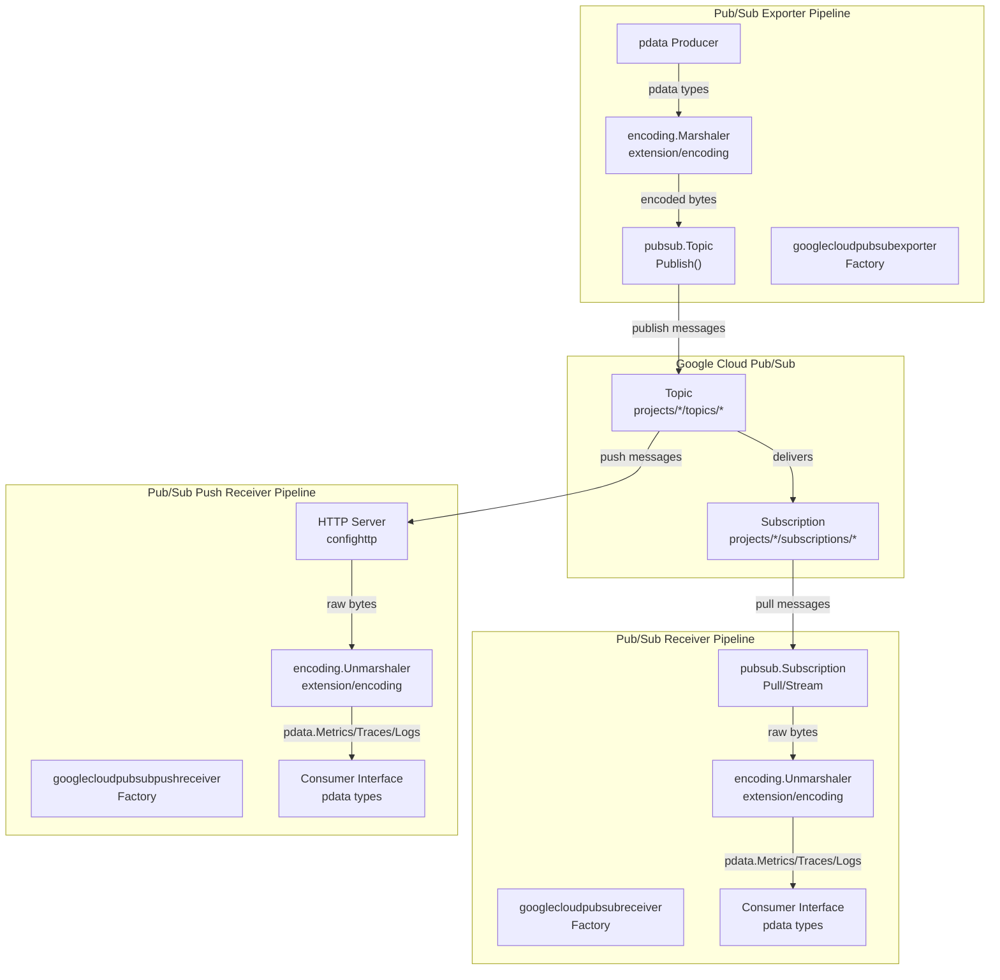
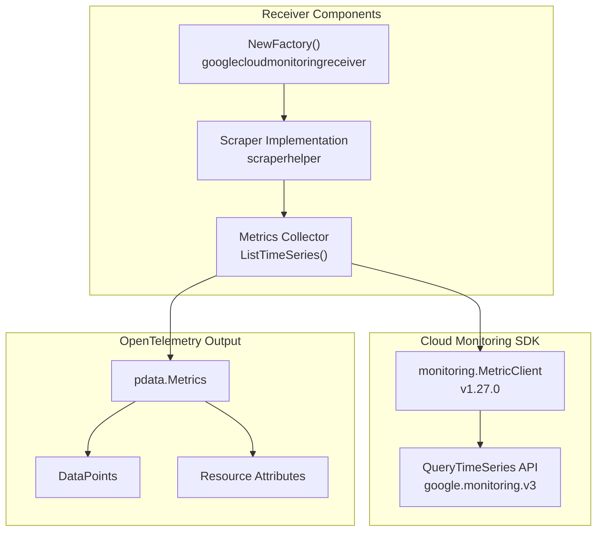
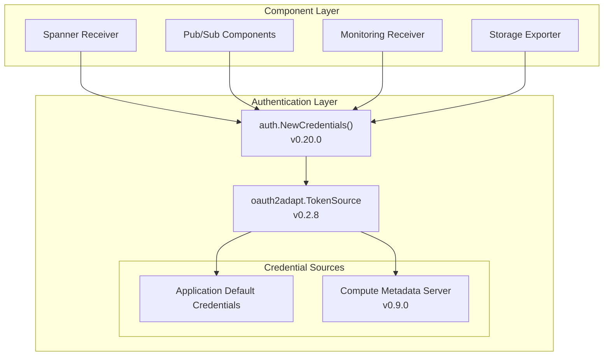
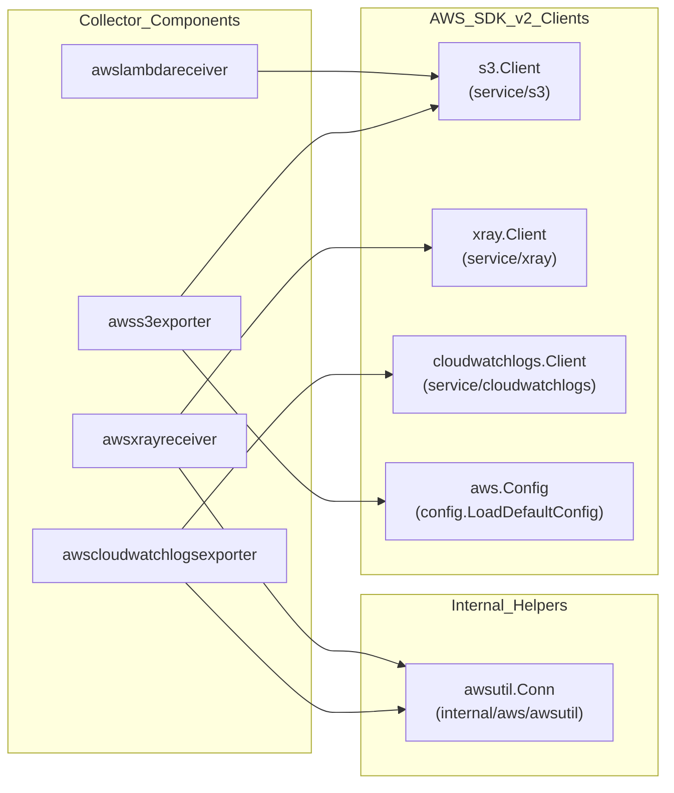
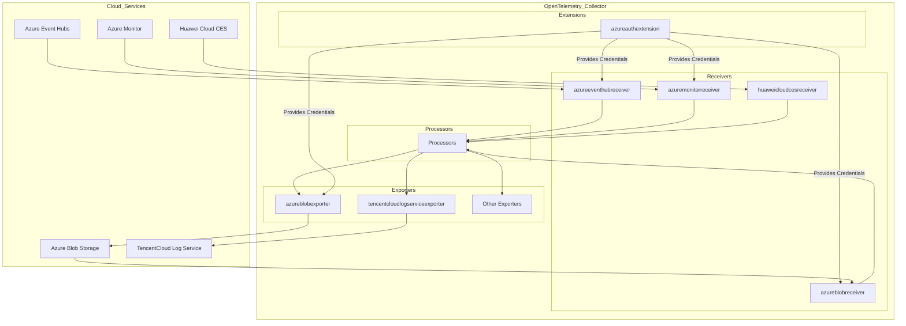
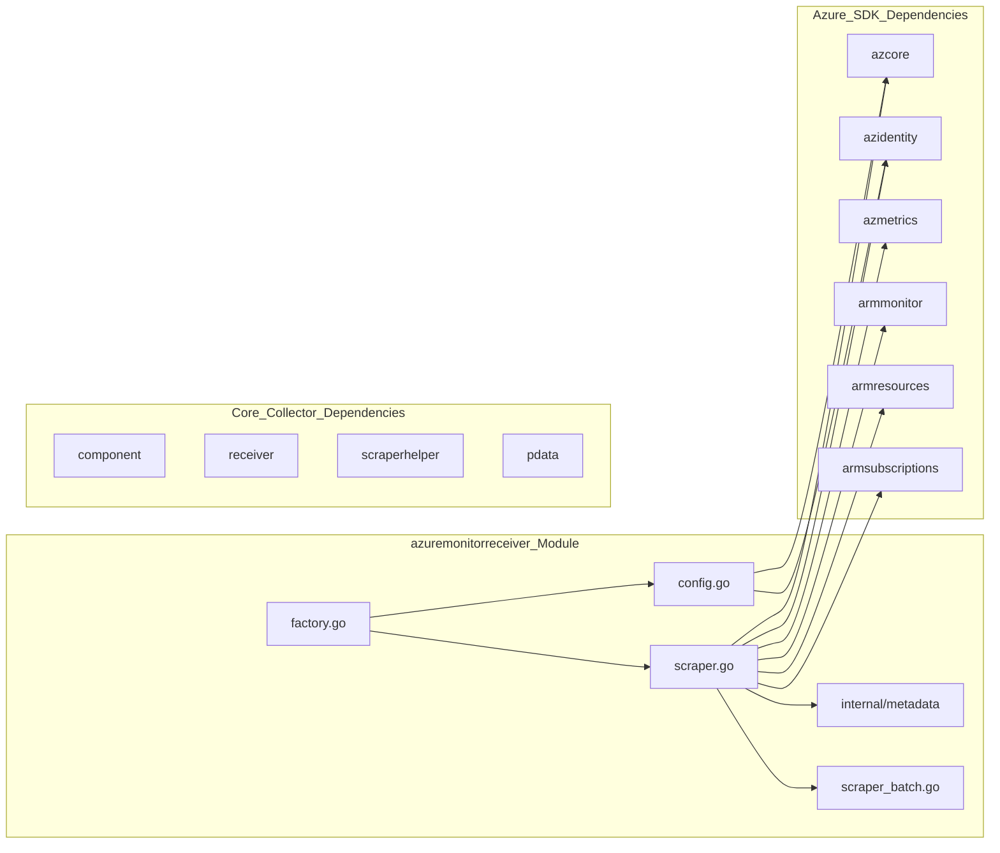
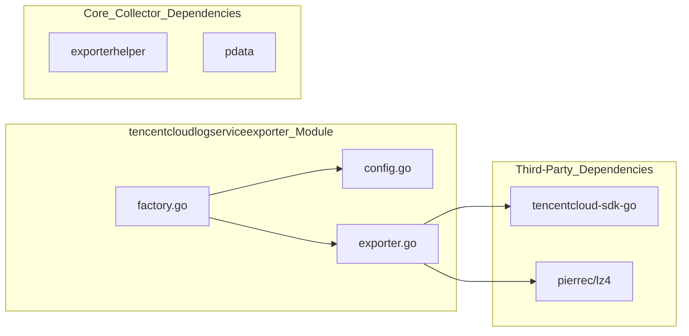

## Purpose and Scope

This document describes the Google Cloud Platform (GCP) integration components available in the `opentelemetry-collector-contrib` repository. The GCP integration provides bidirectional telemetry flow with Google Cloud services through several primary components: a receiver for Cloud Spanner database metrics, a receiver and exporter pair for Pub/Sub messaging, a push-based receiver for Pub/Sub, a receiver for Cloud Monitoring metrics, and an exporter for Cloud Storage. All components share common authentication infrastructure using Google Cloud client libraries and OAuth2.

## Component Architecture

The following diagram shows the GCP components and their relationships to Google Cloud services:

**GCP Component Relationship Diagram**
```mermaid
graph TB
    subgraph "OpenTelemetry Collector"
        [googlecloudspannerreceiver] --> ["Scraper: Spanner Query Metrics"]
        [googlecloudpubsubreceiver] --> ["Consumer: Pub/Sub Messages"]
        [googlecloudpubsubpushreceiver] --> ["HTTP Endpoint: Pub/Sub Push"]
        [googlecloudpubsubexporter] --> ["Publisher: Pub/Sub Messages"]
        [googlecloudmonitoringreceiver] --> ["Scraper: Monitoring API Metrics"]
        [googlecloudstorageexporter] --> ["Writer: GCS Objects"]

        [encoding_extension] --> ["Marshaling/Unmarshaling"]
    end

    subgraph "Google Cloud Services"
        Spanner["Cloud Spanner<br/>cloud.google.com/go/spanner"]
        PubSub["Cloud Pub/Sub v2<br/>cloud.google.com/go/pubsub/v2"]
        Monitoring["Cloud Monitoring API<br/>cloud.google.com/go/monitoring"]
        Storage["Cloud Storage<br/>cloud.google.com/go/storage"]
    end

    subgraph "Authentication Layer"
        AuthLib["cloud.google.com/go/auth v0.20.0<br/>OAuth2 + Metadata Server"]
        OAuth2Adapt["oauth2adapt v0.2.8"]
        MetadataServer["compute/metadata v0.9.0"]
    end

    [googlecloudspannerreceiver] -->|"Query & Poll"| Spanner
    [googlecloudpubsubreceiver] -->|"Subscribe & Pull"| PubSub
    [googlecloudpubsubpushreceiver] -->|"HTTP Push"| PubSub
    [googlecloudpubsubexporter] -->|"Publish"| PubSub
    [googlecloudmonitoringreceiver] -->|"List Time Series"| Monitoring
    [googlecloudstorageexporter] -->|"Write Objects"| Storage

    [googlecloudspannerreceiver] --> AuthLib
    [googlecloudpubsubreceiver] --> AuthLib
    [googlecloudpubsubpushreceiver] --> AuthLib
    [googlecloudpubsubexporter] --> AuthLib
    [googlecloudmonitoringreceiver] --> AuthLib
    [googlecloudstorageexporter] --> AuthLib

    [googlecloudpubsubreceiver] --> [encoding_extension]
    [googlecloudpubsubpushreceiver] --> [encoding_extension]
    [googlecloudpubsubexporter] --> [encoding_extension]

    AuthLib --> OAuth2Adapt
    AuthLib --> MetadataServer
```

**Sources:**
- [receiver/googlecloudspannerreceiver/go.mod:6-26]()
- [receiver/googlecloudpubsubreceiver/go.mod:6-30]()
- [receiver/googlecloudpubsubpushreceiver/go.mod:6-32]()
- [exporter/googlecloudpubsubexporter/go.mod:6-26]()
- [receiver/googlecloudmonitoringreceiver/go.mod:5-21]()
- [exporter/googlecloudstorageexporter/go.mod:6-25]()

## Cloud Spanner Receiver

### Purpose and Implementation

The `googlecloudspannerreceiver` collects performance and operational metrics from Google Cloud Spanner databases by executing SQL queries against system tables and catalog views. It is implemented as a scraper-based receiver using the `scraperhelper` framework [receiver/googlecloudspannerreceiver/go.mod:20-21]().

**Spanner Receiver Implementation Detail**


**Sources:**
- [receiver/googlecloudspannerreceiver/go.mod:6-21]()

### Key Dependencies

| Dependency | Version | Purpose |
|------------|---------|---------|
| `cloud.google.com/go/spanner` | v1.90.0 | Spanner client library [receiver/googlecloudspannerreceiver/go.mod:6]() |
| `github.com/jellydator/ttlcache/v3` | v3.4.1 | TTL caching for query results [receiver/googlecloudspannerreceiver/go.mod:7]() |
| `github.com/mitchellh/hashstructure/v2` | v2.0.2 | Configuration hashing [receiver/googlecloudspannerreceiver/go.mod:8]() |
| `go.opentelemetry.io/collector/scraper/scraperhelper` | v0.155.1 | Scraper framework [receiver/googlecloudspannerreceiver/go.mod:21]() |

**Sources:**
- [receiver/googlecloudspannerreceiver/go.mod:6-21]()

## Pub/Sub Components

### Bidirectional Data Flow

The Pub/Sub components enable bidirectional telemetry flow with Google Cloud Pub/Sub. The `googlecloudpubsubreceiver` and `googlecloudpubsubexporter` share the v2 Pub/Sub client library [receiver/googlecloudpubsubreceiver/go.mod:6]() and encoding extension [receiver/googlecloudpubsubreceiver/go.mod:8]() for marshaling telemetry data. The `googlecloudpubsubpushreceiver` provides an HTTP endpoint for Pub/Sub push subscriptions [receiver/googlecloudpubsubpushreceiver/go.mod:14]().

**Pub/Sub Signal Flow**


**Sources:**
- [receiver/googlecloudpubsubreceiver/go.mod:6-18]()
- [exporter/googlecloudpubsubexporter/go.mod:6-20]()
- [receiver/googlecloudpubsubpushreceiver/go.mod:6-25]()

### Receiver Implementation

The `googlecloudpubsubreceiver` subscribes to Pub/Sub subscriptions and unmarshals messages into OpenTelemetry protocol data using encoding extensions [receiver/googlecloudpubsubreceiver/go.mod:8-18]().

**Key Dependencies:**

| Dependency | Version | Purpose |
|------------|---------|---------|
| `cloud.google.com/go/pubsub/v2` | v2.6.0 | Pub/Sub v2 client [receiver/googlecloudpubsubreceiver/go.mod:6]() |
| `github.com/open-telemetry/opentelemetry-collector-contrib/extension/encoding` | v0.155.0 | Encoding/decoding support [receiver/googlecloudpubsubreceiver/go.mod:8]() |
| `go.opentelemetry.io/collector/receiver/receiverhelper` | v0.155.1 | Receiver utilities [receiver/googlecloudpubsubreceiver/go.mod:19]() |

**Sources:**
- [receiver/googlecloudpubsubreceiver/go.mod:5-30]()

### Exporter Implementation

The `googlecloudpubsubexporter` marshals telemetry data and publishes to Pub/Sub topics with configurable retry and batching using the `exporterhelper` [exporter/googlecloudpubsubexporter/go.mod:18]().

**Key Dependencies:**

| Dependency | Version | Purpose |
|------------|---------|---------|
| `cloud.google.com/go/pubsub/v2` | v2.6.0 | Pub/Sub v2 client [exporter/googlecloudpubsubexporter/go.mod:6]() |
| `github.com/google/uuid` | v1.6.0 | Message ID generation [exporter/googlecloudpubsubexporter/go.mod:7]() |
| `go.opentelemetry.io/collector/config/configretry` | v1.61.1 | Retry configuration [exporter/googlecloudpubsubexporter/go.mod:14]() |

**Sources:**
- [exporter/googlecloudpubsubexporter/go.mod:5-26]()

## Cloud Monitoring Receiver

### Purpose and Metrics Collection

The `googlecloudmonitoringreceiver` scrapes metrics from the Google Cloud Monitoring API by querying time series data for specified metric types [receiver/googlecloudmonitoringreceiver/go.mod:53]().

**Monitoring Receiver Architecture**


**Sources:**
- [receiver/googlecloudmonitoringreceiver/go.mod:53-82]()

### Key Dependencies

| Dependency | Version | Purpose |
|------------|---------|---------|
| `cloud.google.com/go/monitoring` | v1.27.0 | Monitoring API client [receiver/googlecloudmonitoringreceiver/go.mod:53]() |
| `go.opentelemetry.io/collector/scraper/scraperhelper` | v0.155.1 | Scraper framework [receiver/googlecloudmonitoringreceiver/go.mod:17]() |
| `golang.org/x/oauth2` | v0.36.0 | OAuth2 authentication [receiver/googlecloudmonitoringreceiver/go.mod:19]() |

**Sources:**
- [receiver/googlecloudmonitoringreceiver/go.mod:5-21]()

## Cloud Storage Exporter

### Purpose and Implementation

The `googlecloudstorageexporter` writes telemetry data as objects to Google Cloud Storage buckets with configurable partitioning and compression [exporter/googlecloudstorageexporter/go.mod:14]().

**Key Dependencies:**

| Dependency | Version | Purpose |
|------------|---------|---------|
| `cloud.google.com/go/storage` | v1.62.1 | Cloud Storage client [exporter/googlecloudstorageexporter/go.mod:7]() |
| `github.com/lestrrat-go/strftime` | v1.2.0 | Timestamp-based file naming [exporter/googlecloudstorageexporter/go.mod:10]() |
| `github.com/klauspost/compress` | v1.18.7 | Compression support [exporter/googlecloudstorageexporter/go.mod:9]() |
| `go.opentelemetry.io/collector/exporter/xexporter` | v0.155.1 | Experimental exporter features [exporter/googlecloudstorageexporter/go.mod:23]() |

**Sources:**
- [exporter/googlecloudstorageexporter/go.mod:6-25]()

## GCP Log Entry Encoding Extension

The `googlecloudlogentryencodingextension` provides specialized logic for converting between GCP `LogEntry` structures and OpenTelemetry `plog.LogRecord` objects [extension/encoding/googlecloudlogentryencodingextension/log_entry.go:96-130]().

### Metadata Extraction and Mapping

The extension handles complex GCP log metadata including:
- **Project/Resource Identifiers:** Maps `gcp.project`, `gcp.resource_type`, and AppHub metadata [extension/encoding/googlecloudlogentryencodingextension/log_entry.go:32-68]().
- **HTTP Context:** Extracts `httpRequest` fields like `requestMethod`, `status`, and `latency` [extension/encoding/googlecloudlogentryencodingextension/log_entry.go:154-170]().
- **Operation Tracking:** Maps `gcp.operation.id` and producer information [extension/encoding/googlecloudlogentryencodingextension/log_entry.go:147-152]().
- **Log Types:** Specialized parsers for Audit Logs, VPC Flow Logs, and Load Balancer logs [extension/encoding/googlecloudlogentryencodingextension/log_entry.go:71-93]().

**Sources:**
- [extension/encoding/googlecloudlogentryencodingextension/log_entry.go:31-180]()

## Shared Authentication Infrastructure

All GCP components share common authentication mechanisms through `cloud.google.com/go/auth` and `compute/metadata` [receiver/googlecloudpubsubreceiver/go.mod:34-36]().

**GCP Authentication Flow**


**Sources:**
- [receiver/googlecloudspannerreceiver/go.mod:34-36]()
- [receiver/googlecloudpubsubreceiver/go.mod:34-36]()
- [receiver/googlecloudmonitoringreceiver/go.mod:24-26]()
- [exporter/googlecloudstorageexporter/go.mod:34-35]()

## Protocol and API Infrastructure

### Shared gRPC Stack

All GCP components use a standardized gRPC and Google API stack for reliable communication:

| Dependency | Version | Purpose |
|------------|---------|---------|
| `google.golang.org/grpc` | v1.82.0 | gRPC transport [receiver/googlecloudspannerreceiver/go.mod:27]() |
| `google.golang.org/api` | v0.280.0 | Google API client infrastructure [receiver/googlecloudspannerreceiver/go.mod:26]() |
| `google.golang.org/protobuf` | v1.36.11 | Protobuf message handling [receiver/googlecloudpubsubreceiver/go.mod:92]() |
| `github.com/googleapis/gax-go/v2` | v2.22.0 | Google API Extensions [receiver/googlecloudpubsubreceiver/go.mod:7]() |

**Sources:**
- [receiver/googlecloudspannerreceiver/go.mod:26-27]()
- [receiver/googlecloudpubsubreceiver/go.mod:27-29]()
- [receiver/googlecloudmonitoringreceiver/go.mod:79-82]()

# AWS Integration Components


This document covers AWS-specific components in the OpenTelemetry Collector Contrib repository, including receivers, exporters, configuration providers, authentication extensions, and internal utility modules for AWS services.

For general resource detection across multiple cloud providers, see the Resource Detection Processor section. For metadata provider interfaces shared across components, see the Metadata Provider Interfaces section.

## Purpose and Scope

The AWS integration components provide native support for collecting and enriching telemetry from AWS environments:

- **AWS Container Insight Receiver** (`awscontainerinsightreceiver`) - Collects performance metrics from containerized applications on ECS and EKS.
- **AWS ECS Container Metrics Receiver** (`awsecscontainermetricsreceiver`) - Collects ECS container metrics.
- **AWS X-Ray Receiver** (`awsxrayreceiver`) - Receives traces in AWS X-Ray format [receiver/awsxrayreceiver/go.mod:1-11]().
- **AWS EMF Exporter** (`awsemfexporter`) - Exports metrics in Amazon CloudWatch EMF format [exporter/awsemfexporter/go.mod:1-10]().
- **AWS X-Ray Exporter** (`awsxrayexporter`) - Exports traces to AWS X-Ray [exporter/awsxrayexporter/go.mod:1-10]().
- **AWS S3 Exporter** (`awss3exporter`) - Exports telemetry data to Amazon S3 [exporter/awss3exporter/go.mod:1-12]().
- **AWS CloudWatch Logs Exporter** (`awscloudwatchlogsexporter`) - Exports logs to Amazon CloudWatch [exporter/awscloudwatchlogsexporter/go.mod:1-11]().
- **AWS Lambda Receiver** (`awslambdareceiver`) - Receives telemetry from AWS Lambda functions via S3 or direct invocation [receiver/awslambdareceiver/go.mod:1-15]().

## AWS Integration Architecture

The following diagram illustrates the relationship between AWS components and their underlying shared internal modules.

### AWS Component and Internal Module Mapping

```mermaid
graph TD
    subgraph "OpenTelemetry_Collector"
        subgraph "Receivers"
            AWSCI_R["awscontainerinsightreceiver"]
            AWSECS_R["awsecscontainermetricsreceiver"]
            AWSXRAY_R["awsxrayreceiver"]
            AWSLAMBDA_R["awslambdareceiver"]
        end
        subgraph "Exporters"
            AWSEMF_E["awsemfexporter"]
            AWSXRAY_E["awsxrayexporter"]
            AWSS3_E["awss3exporter"]
            AWSCLOUDWATCHLOGS_E["awscloudwatchlogsexporter"]
        end
    end

    subgraph "Internal_AWS_Modules"
        AWSUTIL["internal/aws/awsutil"]
        XRAY_AWS["internal/aws/xray"]
        CWLOGS_AWS["internal/aws/cwlogs"]
        METRICS_AWS["internal/aws/metrics"]
    end

    subgraph "AWS_Services"
        CLOUDWATCH["Amazon CloudWatch"]
        XRAY["AWS X-Ray"]
        S3["Amazon S3"]
        LAMBDA["AWS Lambda"]
    end

    AWSXRAY_R --> XRAY_AWS
    AWSXRAY_E --> XRAY_AWS
    AWSEMF_E --> CWLOGS_AWS
    AWSEMF_E --> METRICS_AWS
    AWSS3_E --> S3
    AWSLAMBDA_R --> S3
    AWSCLOUDWATCHLOGS_E --> CWLOGS_AWS

    AWSEMF_E --> AWSUTIL
    AWSCLOUDWATCHLOGS_E --> AWSUTIL
    AWSXRAY_R --> AWSUTIL
```



**Sources:** [receiver/awsxrayreceiver/go.mod:10-13](), [exporter/awsemfexporter/go.mod:8-11](), [exporter/awscloudwatchlogsexporter/go.mod:10-11](), [internal/aws/xray/go.mod:10](), [receiver/awslambdareceiver/go.mod:9]()

## AWS Receivers

### AWS X-Ray Receiver (`awsxrayreceiver`)

The `awsxrayreceiver` receives trace segments from AWS X-Ray SDKs. It translates these segments into OpenTelemetry spans using shared logic in `internal/aws/xray` [receiver/awsxrayreceiver/go.mod:1-20]().

- **Proxy Support**: Integrates with `internal/aws/proxy` to handle AWS-specific proxy requirements [receiver/awsxrayreceiver/go.mod:10]().
- **SDK**: Uses AWS SDK v2 for X-Ray service interactions [receiver/awsxrayreceiver/go.mod:7]().

### AWS Lambda Receiver (`awslambdareceiver`)

The `awslambdareceiver` acts as an endpoint for AWS Lambda telemetry. It can process logs and traces sent from Lambda environments.

- **S3 Integration**: Can retrieve telemetry stored in S3 by Lambda functions [receiver/awslambdareceiver/internal/s3.go:1-20]().
- **Decoders**: Supports multiple decoding strategies for Lambda payloads via `internal/default_decoders.go` [receiver/awslambdareceiver/internal/default_decoders.go:1-15]().
- **Mocking**: Uses `internal/mock_s3_service.go` for robust testing of S3 interactions [receiver/awslambdareceiver/internal/mock_s3_service.go:1-10]().

## AWS Exporters

### AWS S3 Exporter (`awss3exporter`)

The `awss3exporter` buffers and uploads telemetry to S3. It is designed for high-throughput log and trace archiving.

- **Partitioning**: Logic in `internal/upload/partition.go` determines the S3 key structure based on time and resource attributes [exporter/awss3exporter/internal/upload/partition.go:1-30]().
- **Configuration**: Managed via the `Config` struct, supporting custom `S3PartitionFormat` (strftime style) and `StorageClass` [exporter/awss3exporter/config.go:27-52]().
- **Marshaling**: Supports `otlp_proto`, `otlp_json`, and `body` formats [exporter/awss3exporter/config.go:77-82]().
- **Retries**: Implements AWS-specific retry modes including `standard` and `adaptive` [exporter/awss3exporter/config.go:58-67]().

### AWS EMF Exporter (`awsemfexporter`)

The `awsemfexporter` converts OpenTelemetry metrics into the CloudWatch Embedded Metric Format (EMF), which allows CloudWatch to extract metrics from logs.

- **Resource Enrichment**: Uses `pkg/resourcetotelemetry` to ensure resource attributes are correctly mapped to EMF dimensions [exporter/awsemfexporter/go.mod:12]().
- **Log Streaming**: Utilizes `internal/aws/cwlogs` for efficient log stream management in CloudWatch [exporter/awsemfexporter/go.mod:9]().

### AWS X-Ray Exporter (`awsxrayexporter`)

The `awsxrayexporter` translates OpenTelemetry spans into X-Ray segments and subsegments.

- **Translators**: Contains complex translation logic for HTTP metadata [exporter/awsxrayexporter/internal/translator/http.go:1-20](), AWS resource metadata [exporter/awsxrayexporter/internal/translator/aws_test.go:1-15](), and error causes [exporter/awsxrayexporter/internal/translator/cause.go:1-10]().
- **Segment Management**: Logic in `internal/translator/segment.go` handles the lifecycle of X-Ray segments [exporter/awsxrayexporter/internal/translator/segment.go:1-30]().

## AWS SDK Code Entity Mapping

The following diagram bridges the Natural Language space of AWS services to the specific Code Entities and SDK clients used within the components.

### AWS SDK v2 Code Entity Space



**Sources:** [exporter/awss3exporter/go.mod:7](), [receiver/awsxrayreceiver/go.mod:7](), [exporter/awscloudwatchlogsexporter/go.mod:7](), [internal/aws/awsutil/go.mod:1-10](), [receiver/awslambdareceiver/go.mod:9]()

## Configuration and Validation

AWS components require specific validation logic to ensure compatibility with AWS service limits and naming conventions.

| Component | Key Validation Logic | File Reference |
|---|---|---|
| `awss3exporter` | Validates `StorageClass`, `ACL`, and `Region` | [exporter/awss3exporter/config.go:109-156]() |
| `awslambdareceiver` | Validates S3 bucket and prefix configuration | [receiver/awslambdareceiver/config.go:1-25]() |
| `awsxrayexporter` | Validates X-Ray segment size and attribute limits | [exporter/awsxrayexporter/awsxray.go:1-50]() |

**Sources:** [exporter/awss3exporter/config.go](), [receiver/awslambdareceiver/config.go](), [exporter/awsxrayexporter/awsxray.go]()

# Multi-Cloud Export Support


## Purpose and Scope

This document covers the exporters and receivers for cloud providers and observability platforms beyond Google Cloud Platform and AWS, which are addressed in [8.1 Google Cloud Platform Components]() and [8.2 AWS Integration Components](). The primary focus is on integrations with Azure, Alibaba Cloud, Tencent Cloud, and Huawei Cloud, covering their authentication mechanisms and export patterns.

For information about database exporters (Elasticsearch, ClickHouse), see [6 Database and Data Store Integrations]().

## Multi-Cloud Exporter Landscape

The OpenTelemetry Collector Contrib repository includes exporters and receivers for various cloud providers and observability platforms that extend beyond the major cloud providers. These components enable organizations to send and receive telemetry data to/from their preferred backends regardless of cloud vendor lock-in.

### Supported Cloud Components

| Component | Cloud Provider | Type | Telemetry Types | Primary Use Case |
|---|---|---|---|---|
| `azureeventhubreceiver` | Microsoft Azure | Receiver | Logs, Metrics, Traces | Ingest data from Azure Event Hubs |
| `azuremonitorreceiver` | Microsoft Azure | Receiver | Metrics | Scrape Azure Monitor API for resource metrics |
| `azureblobreceiver` | Microsoft Azure | Receiver | Logs | Ingest logs from Azure Blob Storage |
| `azureauthextension` | Microsoft Azure | Extension | N/A | Authentication for Azure SDK clients |
| `azureblobexporter` | Microsoft Azure | Exporter | Logs, Metrics, Traces | Export data to Azure Blob Storage |
| `tencentcloudlogserviceexporter` | Tencent Cloud | Exporter | Logs, Traces | TencentCloud Log Service (CLS) integration |
| `huaweicloudcesreceiver` | Huawei Cloud | Receiver | Metrics | Scrape Huawei Cloud CES for metrics |

Sources: [receiver/azureblobreceiver/go.mod:6-9](), [receiver/azuremonitorreceiver/go.mod:6-11](), [exporter/tencentcloudlogserviceexporter/go.mod:9](), [receiver/huaweicloudcesreceiver/go.mod:7](), [exporter/azureblobexporter/go.mod:6-8]()

## Architecture Overview

Multi-cloud components follow a common architectural pattern within the OpenTelemetry Collector framework. Receivers ingest data from cloud services, and exporters consume OTLP data from the collector pipeline and transform it into the native format required by the target platform. Extensions provide cross-cutting concerns like authentication.



**Diagram: Multi-Cloud Component Architecture**

Sources: [receiver/azureblobreceiver/go.mod:6-9](), [receiver/azuremonitorreceiver/go.mod:6-11](), [exporter/tencentcloudlogserviceexporter/go.mod:9](), [receiver/huaweicloudcesreceiver/go.mod:7](), [exporter/azureblobexporter/go.mod:6-8](), [extension/azureauthextension/go.mod:6-7]()

## Microsoft Azure Integrations

### Azure Monitor Receiver (`azuremonitorreceiver`)

The `azuremonitorreceiver` scrapes the Azure Monitor API for resource metrics. It supports various authentication methods and allows filtering metrics by subscription, resource group, service, and metric name/aggregation.

#### Module Structure and Dependencies



**Diagram: Azure Monitor Receiver Dependency Graph**

The module declaration is `github.com/open-telemetry/opentelemetry-collector-contrib/receiver/azuremonitorreceiver` [receiver/azuremonitorreceiver/go.mod:1]().

#### Key Dependencies

| Dependency | Version | Purpose |
|---|---|---|
| `github.com/Azure/azure-sdk-for-go/sdk/azcore` | v1.22.0 | Core Azure SDK types and utilities [receiver/azuremonitorreceiver/go.mod:6]() |
| `github.com/Azure/azure-sdk-for-go/sdk/azidentity` | v1.14.0 | Azure Identity client for authentication [receiver/azuremonitorreceiver/go.mod:7]() |
| `github.com/Azure/azure-sdk-for-go/sdk/monitor/query/azmetrics` | v1.3.0 | Azure Monitor Metrics Query client [receiver/azuremonitorreceiver/go.mod:8]() |
| `github.com/Azure/azure-sdk-for-go/sdk/resourcemanager/monitor/armmonitor` | v0.12.0 | Azure Resource Manager client for Monitor resources [receiver/azuremonitorreceiver/go.mod:9]() |
| `go.opentelemetry.io/collector/scraper/scraperhelper` | v0.155.1 | Helper for implementing metric scrapers [receiver/azuremonitorreceiver/go.mod:29]() |

Sources: [receiver/azuremonitorreceiver/go.mod:6-9](), [receiver/azuremonitorreceiver/go.mod:29]()

#### Data Flow and Scrape Logic

The `azureScraper` [receiver/azuremonitorreceiver/scraper.go:131]() is responsible for collecting metrics.
1.  **Load Subscriptions**: It identifies the subscriptions to monitor, either from `subscription_ids` in the config or by discovery via `loadSubscriptions`. [receiver/azuremonitorreceiver/scraper.go:175-176]()
2.  **Load Resources**: For each subscription, it loads the relevant Azure resources using `loadResources`. [receiver/azuremonitorreceiver/scraper.go:178]()
3.  **Load Metric Definitions**: For each resource, it fetches the available metric definitions via `loadMetricsDefinitions`. [receiver/azuremonitorreceiver/scraper.go:184]()
4.  **Load Metric Values**: It scrapes the actual metric values via `loadMetricsValues`. This can be done using the default ARM API or the Data Plane API if `use_batch_api` is enabled. [receiver/azuremonitorreceiver/scraper.go:194](), [receiver/azuremonitorreceiver/README.md:96-100]()

The `scrape` method orchestrates this process, building `pmetric.Metrics` objects using the `MetricsBuilder` [receiver/azuremonitorreceiver/scraper.go:141](). The `azureResource` struct [receiver/azuremonitorreceiver/scraper.go:72-78]() stores resource attributes and tags.

Sources: [receiver/azuremonitorreceiver/scraper.go:131](), [receiver/azuremonitorreceiver/scraper.go:175-194](), [receiver/azuremonitorreceiver/README.md:96-100](), [receiver/azuremonitorreceiver/scraper.go:72-78]()

### Azure Blob Receiver (`azureblobreceiver`)

The `azureblobreceiver` ingests logs from Azure Blob Storage, typically triggered by Event Hub notifications.

#### Key Dependencies

| Dependency | Version | Purpose |
|---|---|---|
| `github.com/Azure/azure-sdk-for-go/sdk/azcore` | v1.22.0 | Core Azure SDK types [receiver/azureblobreceiver/go.mod:6]() |
| `github.com/Azure/azure-sdk-for-go/sdk/messaging/azeventhubs/v2` | v2.0.2 | Event Hubs notification support [receiver/azureblobreceiver/go.mod:8]() |
| `github.com/Azure/azure-sdk-for-go/sdk/storage/azblob` | v1.8.0 | Azure Blob Storage SDK [receiver/azureblobreceiver/go.mod:9]() |

Sources: [receiver/azureblobreceiver/go.mod:6-9]()

### Azure Blob Exporter (`azureblobexporter`)

The `azureblobexporter` exports telemetry data to Azure Blob Storage containers.

#### Key Dependencies

| Dependency | Version | Purpose |
|---|---|---|
| `github.com/Azure/azure-sdk-for-go/sdk/storage/azblob` | v1.8.0 | Azure Blob Storage SDK [exporter/azureblobexporter/go.mod:8]() |
| `go.opentelemetry.io/collector/exporter/exporterhelper` | v0.155.1 | Exporter helper utilities [exporter/azureblobexporter/go.mod:19]() |

Sources: [exporter/azureblobexporter/go.mod:8](), [exporter/azureblobexporter/go.mod:19]()

## Tencent Cloud Log Service Exporter (`tencentcloudlogserviceexporter`)

The `tencentcloudlogserviceexporter` enables sending telemetry data to TencentCloud's Log Service (CLS).

### Module Structure and Dependencies



**Diagram: Tencent Cloud Exporter Dependency Graph**

### Key Dependencies

| Dependency | Version | Purpose |
|------------|---------|---------|
| `github.com/tencentcloud/tencentcloud-sdk-go/tencentcloud/common` | v1.3.103 | TencentCloud API authentication [exporter/tencentcloudlogserviceexporter/go.mod:9]() |
| `github.com/pierrec/lz4` | v2.6.1 | LZ4 compression for payloads [exporter/tencentcloudlogserviceexporter/go.mod:7]() |
| `go.opentelemetry.io/collector/exporter/exporterhelper` | v0.155.1 | Retry logic and queue management [exporter/tencentcloudlogserviceexporter/go.mod:16]() |

Sources: [exporter/tencentcloudlogserviceexporter/go.mod:7-16]()

## Huawei Cloud CES Receiver (`huaweicloudcesreceiver`)

The `huaweicloudcesreceiver` scrapes metrics from Huawei Cloud Cloud Eye Service (CES).

#### Key Dependencies

| Dependency | Version | Purpose |
|---|---|---|
| `github.com/huaweicloud/huaweicloud-sdk-go-v3` | v0.1.202 | Huawei Cloud SDK [receiver/huaweicloudcesreceiver/go.mod:7]() |
| `go.opentelemetry.io/collector/scraper/scraperhelper` | v0.155.1 | Scraper helper implementation [receiver/huaweicloudcesreceiver/go.mod:22]() |

Sources: [receiver/huaweicloudcesreceiver/go.mod:7](), [receiver/huaweicloudcesreceiver/go.mod:22]()

## Common Integration Patterns

### 1. Factory Pattern

Each component implements a factory function for instantiation:

-   **Azure Monitor**: `NewFactory()` [receiver/azuremonitorreceiver/factory.go:24]()
-   **Huawei CES**: `NewFactory()` [receiver/huaweicloudcesreceiver/factory.go:17]()

Sources: [receiver/azuremonitorreceiver/factory.go:24](), [receiver/huaweicloudcesreceiver/factory.go:17]()

### 2. Security and Authentication

Cloud components use `configopaque.String` for sensitive fields like API keys and secrets to prevent accidental exposure in logs.

-   **Azure Monitor**: `configopaque` usage for sensitive configuration [receiver/azuremonitorreceiver/go.mod:14]()
-   **Huawei CES**: Credentials management via `configopaque` [receiver/huaweicloudcesreceiver/go.mod:14]()

Sources: [receiver/azuremonitorreceiver/go.mod:14](), [receiver/huaweicloudcesreceiver/go.mod:14]()

### 3. Testing Infrastructure

Multi-cloud components use comprehensive testing approaches:

-   **Golden Files**: Used by `azuremonitorreceiver` [receiver/azuremonitorreceiver/scraper_test.go:161]() and `huaweicloudcesreceiver` [receiver/huaweicloudcesreceiver/go.mod:8]() to validate metric output.
-   **pdatatest**: Used for deep comparison of OTLP data structures [receiver/azuremonitorreceiver/go.mod:15](), [receiver/huaweicloudcesreceiver/go.mod:9]().
-   **Mocks**: Extensive use of mock clients in tests, such as `newMockClientOptionsResolver` in Azure Monitor [receiver/azuremonitorreceiver/scraper_test.go:131]().

Sources: [receiver/azuremonitorreceiver/scraper_test.go:161](), [receiver/huaweicloudcesreceiver/go.mod:8](), [receiver/azuremonitorreceiver/go.mod:15](), [receiver/huaweicloudcesreceiver/go.mod:9](), [receiver/azuremonitorreceiver/scraper_test.go:131]()