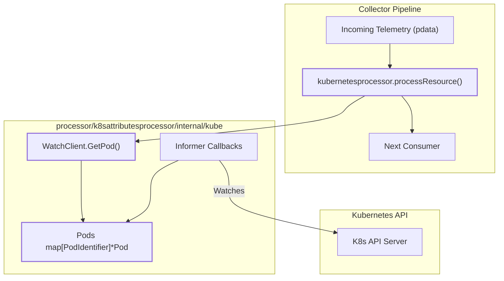
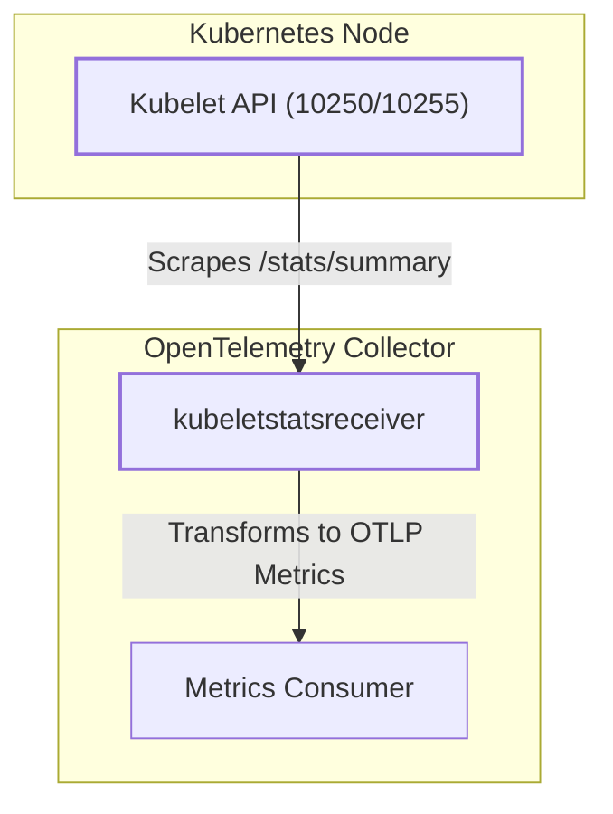
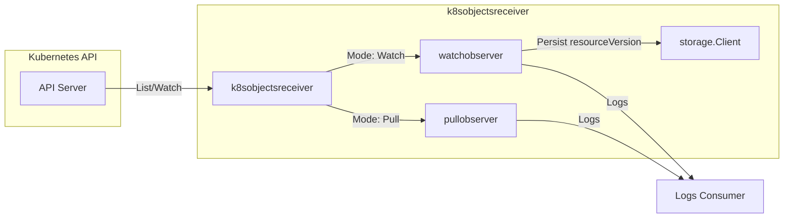
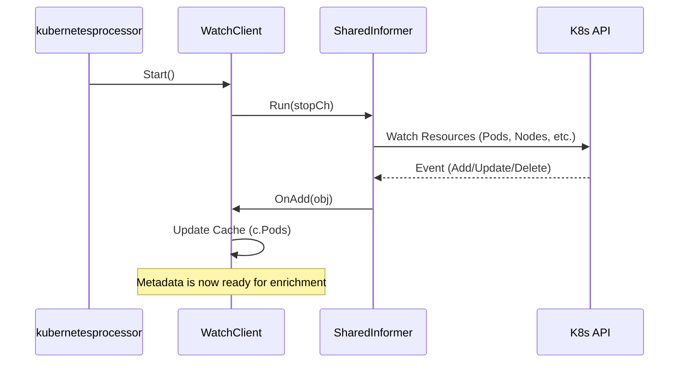

The OpenTelemetry Collector Contrib repository provides a comprehensive suite of components for observing Kubernetes environments. These components range from infrastructure-level metric scrapers to processors that enrich application telemetry with orchestration metadata.

## 1. Kubernetes Attributes Processor (`k8sattributes`)

The `k8sattributesprocessor` is a critical component for linking application telemetry (spans, metrics, logs) with Kubernetes metadata [processor/k8sattributesprocessor/README.md:4-6](). The processor automatically discovers Kubernetes resources (pods), extracts metadata from them, and adds it to telemetry as resource attributes [processor/k8sattributesprocessor/README.md:23-25]().

### Pod Association Logic
The processor identifies which Pod a telemetry signal belongs to using a configurable list of `pod_association` rules [processor/k8sattributesprocessor/README.md:26-28]().

*   **Connection IP**: By default, it associates the incoming connection's IP address to the Pod IP [processor/k8sattributesprocessor/README.md:31-33]().
*   **Resource Attributes**: It can look up metadata based on existing resource attributes like `k8s.pod.ip`, `k8s.pod.uid`, or `k8s.pod.name` [processor/k8sattributesprocessor/README.md:48-60]().

### Data Flow and Implementation
The `kubernetesprocessor` struct maintains the state of the component, including the API configuration and the Kubernetes client [processor/k8sattributesprocessor/processor.go:34-51](). It implements processing methods for all major signals: `processTraces`, `processMetrics`, `processLogs`, and `processProfiles` [processor/k8sattributesprocessor/processor.go:143-180]().

#### System Entity Mapping
The following diagram maps the high-level enrichment process to the internal code structures.

**Processor Enrichment Flow**

Sources: [processor/k8sattributesprocessor/processor.go:184-186](), [processor/k8sattributesprocessor/internal/kube/client.go:59-62]()

## 2. Shared Infrastructure: `internal/k8sconfig` and `internal/kubelet`

Common logic for Kubernetes API interaction and Kubelet communication is centralized in internal modules to ensure consistency.

*   **`internal/k8sconfig`**: Standardizes `APIConfig` for authentication (e.g., `serviceAccount`, `kubeConfig`, or `none`) [processor/k8sattributesprocessor/config.go:21](). It provides `MakeClientBundle` to initialize the `kubernetes.Interface` used by clients [processor/k8sattributesprocessor/internal/kube/client.go:173-175]().
*   **`internal/kubelet`**: Utilized by receivers (like `kubeletstatsreceiver`) to handle communication with the Kubelet API [receiver/kubeletstatsreceiver/go.mod:119]().

Sources: [processor/k8sattributesprocessor/internal/kube/client.go:32](), [processor/k8sattributesprocessor/config.go:15-16](), [processor/k8sattributesprocessor/internal/kube/client.go:173-175]()

## 3. Kubernetes Receivers

The repository includes specialized receivers for different layers of the Kubernetes stack.

### k8sclusterreceiver
This receiver collects cluster-level metrics by watching the Kubernetes API. It transforms API objects into metrics such as `k8s.pod.phase` or resource requests/limits [receiver/k8sclusterreceiver/go.mod:1](). It supports leader election via the `k8sleaderelector` extension to prevent duplicate metric reporting in multi-replica deployments [receiver/k8sclusterreceiver/go.mod:27]().

### kubeletstatsreceiver
The `kubeletstatsreceiver` pulls node and container-level metrics directly from the Kubelet API [receiver/kubeletstatsreceiver/README.md:4-5](). It scrapes the summary API to produce metrics for CPU, memory, network, and filesystem usage [receiver/kubeletstatsreceiver/metadata.yaml:112-246](). The receiver supports various resource attributes including `container.id`, `k8s.pod.name`, and `k8s.node.name` [receiver/kubeletstatsreceiver/metadata.yaml:25-65]().

**Kubelet Stats Receiver Data Flow**

Sources: [receiver/kubeletstatsreceiver/metadata.yaml:1-15](), [receiver/kubeletstatsreceiver/README.md:4-5]()

### k8sobjectsreceiver
The `k8sobjectsreceiver` collects generic objects from the Kubernetes API server [receiver/k8sobjectsreceiver/README.md:4-5](). It supports two modes: `pull` (periodic polling) and `watch` (streaming updates) [receiver/k8sobjectsreceiver/README.md:59-61](). It can persist `resourceVersion` using a `storage` extension to resume watching without data loss [receiver/k8sobjectsreceiver/README.md:78-82]().

**k8sobjectsreceiver Data Flow**

Sources: [receiver/k8sobjectsreceiver/README.md:59-61](), [receiver/k8sobjectsreceiver/README.md:78-82]()

## 4. Internal Architecture of the Watcher

The `WatchClient` in the `k8sattributesprocessor` is the core engine for metadata synchronization. It manages informers for various Kubernetes resources like Pods, Namespaces, Nodes, Deployments, StatefulSets, DaemonSets, Jobs, and ReplicaSets [processor/k8sattributesprocessor/internal/kube/client.go:43-50](). The `WatchClient` stores this information in internal maps, such as `Pods` (keyed by `PodIdentifier`), `Namespaces`, `Nodes`, `Deployments`, etc. [processor/k8sattributesprocessor/internal/kube/client.go:61-94]().

| Entity | Code Identifier | Role |
| :--- | :--- | :--- |
| **Client** | `WatchClient` | Main interface for K8s cluster interaction [processor/k8sattributesprocessor/internal/kube/client.go:37]() |
| **Cache** | `Pods map[PodIdentifier]*Pod` | Thread-safe local cache of pod metadata [processor/k8sattributesprocessor/internal/kube/client.go:61]() |
| **Informer** | `cache.SharedInformer` | K8s tool used to watch resources and update the cache [processor/k8sattributesprocessor/internal/kube/client.go:43]() |
| **Selector** | `selectorsFromFilters` | Converts config into K8s label/field selectors [processor/k8sattributesprocessor/internal/kube/client.go:182]() |

**WatchClient Lifecycle and Data Sync**

Sources: [processor/k8sattributesprocessor/internal/kube/client.go:128-181](), [processor/k8sattributesprocessor/processor.go:119-125]()

## 5. Configuration and Metadata Extraction

The `ExtractConfig` defines what metadata is pulled from Kubernetes objects and added to telemetry [processor/k8sattributesprocessor/config.go:139-166]().

*   **Metadata Fields**: Supports standard fields like `k8s.pod.uid`, `k8s.deployment.name`, and `container.image.name` [processor/k8sattributesprocessor/config.go:140-153](). The `metadata.yaml` for the `k8sattributesprocessor` lists all available resource attributes that can be extracted, including `k8s.cluster.uid`, `k8s.cronjob.name`, `k8s.daemonset.name`, `k8s.job.name`, `k8s.node.uid`, `k8s.pod.hostname`, `k8s.pod.ip`, `k8s.replicaset.name`, `k8s.statefulset.name`, `service.instance.id`, `service.name`, `service.namespace`, and `service.version` [processor/k8sattributesprocessor/metadata.yaml:20-144]().
*   **Labels and Annotations**: Can extract custom labels and annotations using regex or direct key matching [processor/k8sattributesprocessor/config.go:78-95]().
*   **Workload Resolution**: Automatically resolves parent-child relationships, such as finding the `CronJob` name from a `Job` name using regex patterns [processor/k8sattributesprocessor/internal/kube/client.go:103-110]().

Sources: [processor/k8sattributesprocessor/config.go:139-166](), [processor/k8sattributesprocessor/internal/kube/client.go:98-117](), [processor/k8sattributesprocessor/metadata.yaml:20-144]()