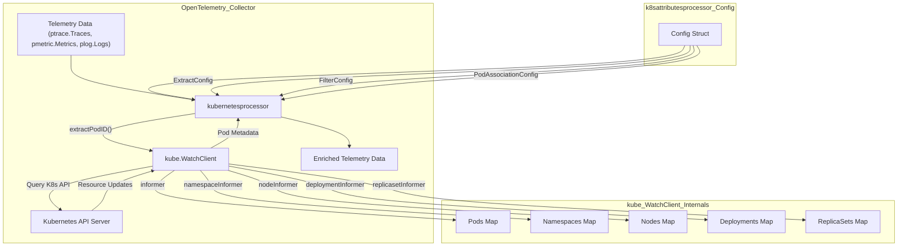
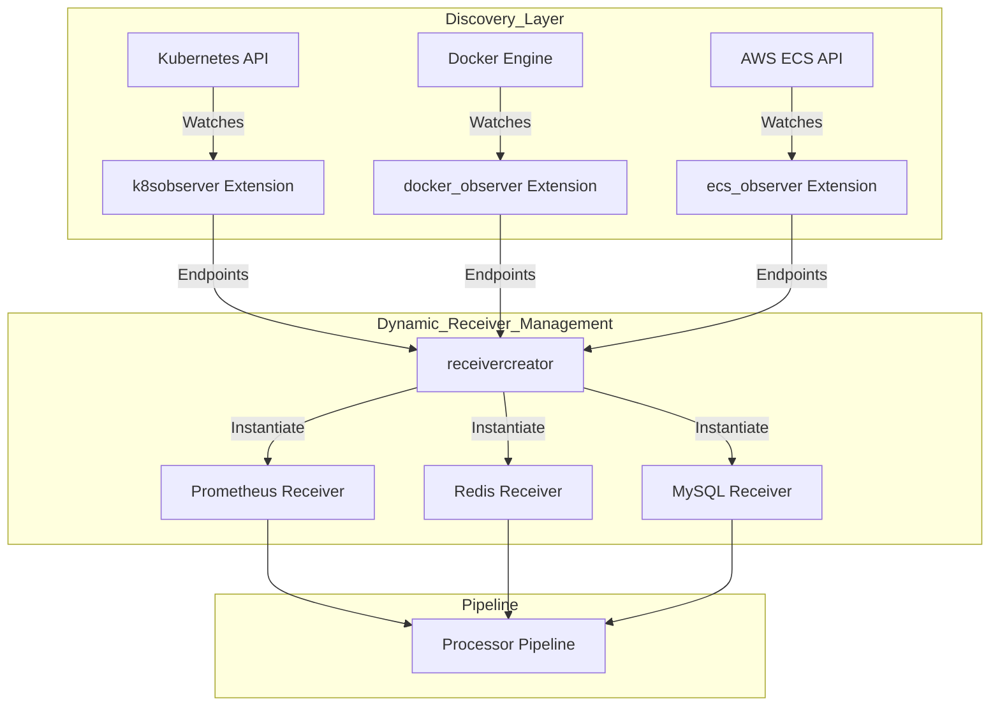

This page provides a high-level overview of the OpenTelemetry Collector Contrib's capabilities for Kubernetes and container observability. It covers how the collector integrates with Kubernetes to collect, enrich, and process telemetry data from various sources within a cluster. This includes specialized receivers for Kubernetes-specific metrics and objects, a powerful processor for enriching telemetry with Kubernetes metadata, and patterns for dynamic endpoint discovery.

For detailed information on specific components and their configurations, please refer to the linked child pages.

## Kubernetes Receivers and Attribute Enrichment

The OpenTelemetry Collector Contrib offers several components designed to collect and enrich telemetry data specifically from Kubernetes environments. These components enable comprehensive observability by gathering cluster-level metrics, node-level statistics, and Kubernetes API objects, while also enriching existing telemetry with valuable Kubernetes metadata.

The `k8sattributesprocessor` is a key component that allows adding Kubernetes metadata to resource attributes for spans, metrics, and logs [processor/k8sattributesprocessor/README.md:4-5](). It automatically discovers Kubernetes resources (pods), extracts metadata, and adds it to the relevant telemetry as resource attributes [processor/k8sattributesprocessor/README.md:24-25](). The processor maintains a record of pod IP addresses, UIDs, and metadata by using the Kubernetes API [processor/k8sattributesprocessor/README.md:25-26](). Associations between telemetry and pods are determined via the `pod_association` configuration, which can use connection IPs or resource attributes like `k8s.pod.ip`, `k8s.pod.name`, or `k8s.pod.uid` [processor/k8sattributesprocessor/README.md:27-61]().

The processor's configuration allows specifying which metadata fields to extract, including `k8s.namespace.name`, `k8s.pod.name`, `k8s.node.name`, and various controller UIDs and names [processor/k8sattributesprocessor/README.md:65-96](). The core logic for interacting with the Kubernetes API resides in the `processor/k8sattributesprocessor/internal/kube` package, particularly the `kube.WatchClient` struct [processor/k8sattributesprocessor/internal/kube/client.go:37-95](). This client manages informers for pods, namespaces, nodes, deployments, statefulsets, daemonsets, jobs, and replicasets to keep track of resource changes [processor/k8sattributesprocessor/internal/kube/client.go:43-50]().

In addition to the processor, dedicated receivers are available:
*   **`k8sclusterreceiver`**: Collects cluster-level metrics by watching Kubernetes API objects [receiver/k8sclusterreceiver/go.mod:1-2]().
*   **`kubeletstatsreceiver`**: Gathers node-level statistics by scraping the Kubelet's `/stats/summary` endpoint [receiver/kubeletstatsreceiver/go.mod:1-2]().
*   **`k8sobjectsreceiver`**: Collects Kubernetes API objects themselves as telemetry data [receiver/k8sobjectsreceiver/go.mod:1-2]().

These components leverage shared internal modules like `internal/k8sconfig` for Kubernetes API client configuration [processor/k8sattributesprocessor/internal/kube/client.go:32-34]() and `internal/kubelet` for Kubelet interaction.

For details, see [Kubernetes Receivers and Attribute Enrichment](#10.1).

### Kubernetes Attributes Processor Data Flow

The following diagram illustrates how the `kubernetesprocessor` interacts with the `kube.WatchClient` to enrich telemetry data.

Sources:
- [processor/k8sattributesprocessor/processor.go:34-51]()
- [processor/k8sattributesprocessor/internal/kube/client.go:37-96]()
- [processor/k8sattributesprocessor/config.go:20-58]()
- [processor/k8sattributesprocessor/README.md:23-28]()

## Observer Pattern and Dynamic Receiver Creation

The OpenTelemetry Collector Contrib employs an "observer" pattern to dynamically discover and configure telemetry sources, particularly in containerized and orchestrated environments. This pattern is crucial for adapting to the ephemeral nature of workloads in Kubernetes, Docker, and other platforms.

The `receivercreator` component is central to this dynamic discovery. It acts as a meta-receiver that can instantiate and manage other receivers based on discovered endpoints. This is achieved by integrating with various "observers" that monitor specific environments for new or removed targets. For instance, a Kubernetes observer (`k8sobserver`) can detect new pods or services [extension/observer/k8sobserver/go.mod:1-2](), and the `receivercreator` can then dynamically configure and start appropriate receivers.

This pattern extends beyond Kubernetes to other container runtimes and orchestration systems, including Docker and ECS, and even host-level processes. The `kafkatopicsobserver` is another specialized observer that monitors Kafka topics, allowing for dynamic configuration of Kafka receivers.

For details, see [Observer Pattern and Dynamic Receiver Creation](#10.2).

### Dynamic Receiver Creation with Observer Pattern

This diagram maps the `receivercreator` logic to the various `observer` extensions that provide endpoint discovery.

Sources:
- [extension/observer/k8sobserver/go.mod:1-2]()
- [receiver/k8sobjectsreceiver/go.mod:1-2]()

## Deployment Patterns and Examples

Deploying the OpenTelemetry Collector in Kubernetes and containerized environments requires specific configurations and strategies to ensure effective telemetry collection. This section outlines common deployment patterns and provides examples for various scenarios.

For Kubernetes, the collector can be deployed as a `DaemonSet` to run on every node, collecting host-level metrics and logs, or as a `Deployment` for cluster-wide services. Log collection from `/var/log/pods` is a common pattern, where the collector can tail log files generated by containers. The `filelog` receiver, often combined with Kubernetes operators, is used for this purpose, capable of detecting container log formats (e.g., Docker, CRI-O, CRI-Containerd).

The `k8sattributesprocessor` supports a `Passthrough` mode which only annotates resources with the pod IP and does not try to extract other metadata, avoiding the need for cluster API access if the collector receives spans directly from services [processor/k8sattributesprocessor/config.go:23-27](). Configuration options such as `wait_for_metadata` and `pod_delete_grace_period` allow tuning the processor's behavior for high-churn environments [processor/k8sattributesprocessor/config.go:45-57]().

For details, see [Deployment Patterns and Examples](#10.3).

Sources:
- [processor/k8sattributesprocessor/config.go:23-27]()
- [processor/k8sattributesprocessor/config.go:45-58]()
- [processor/k8sattributesprocessor/README.md:11-12]()