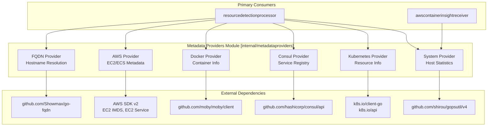
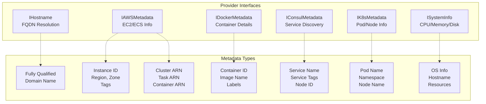
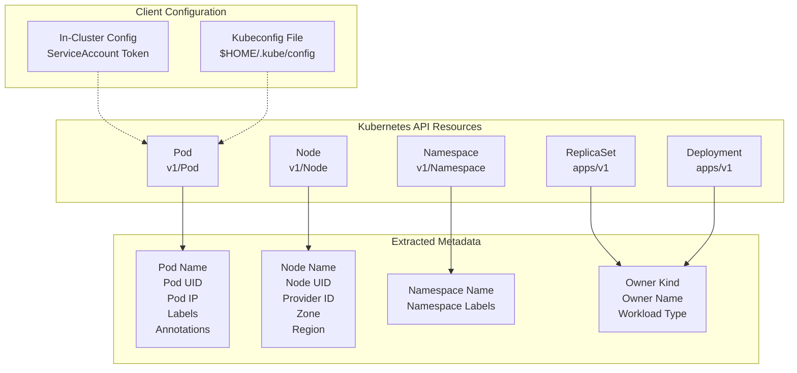
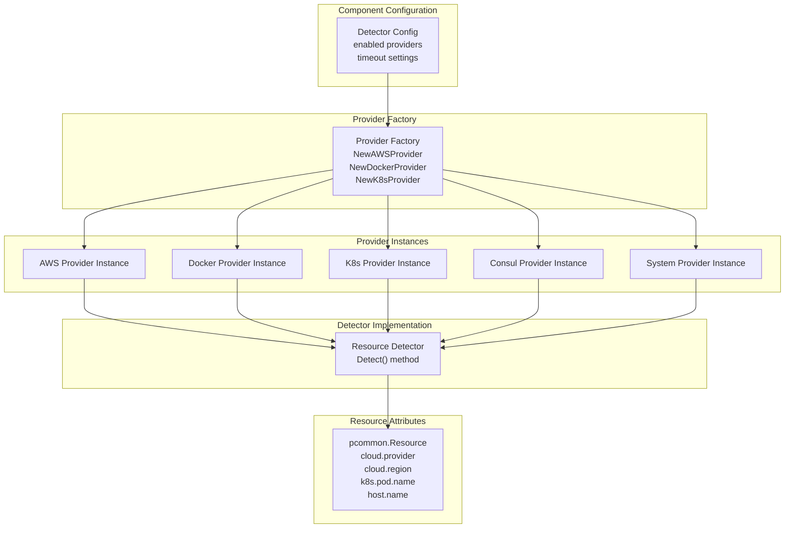
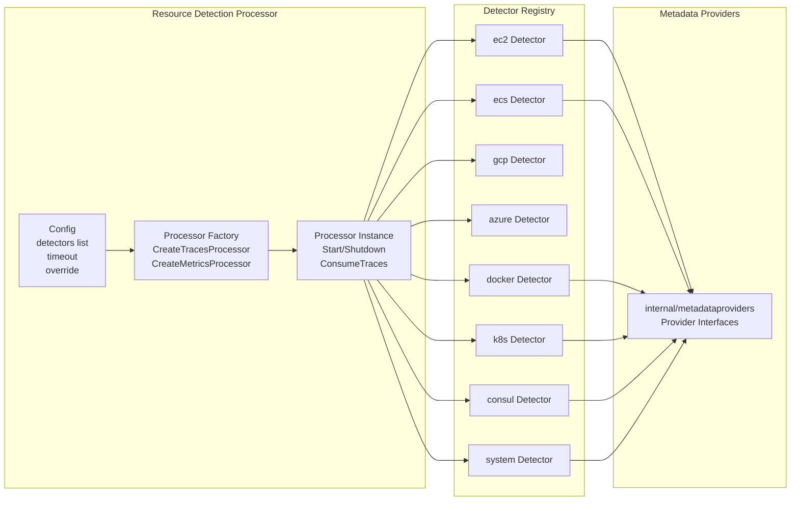

This document describes the `internal/metadataproviders` abstraction layer, which provides standardized interfaces for retrieving metadata from various sources including cloud platforms (AWS, GCP, Azure), container runtimes (Docker), service registries (Consul), orchestration systems (Kubernetes), and local system information. For information about how these providers are consumed by the resource detection processor, see [Resource Detection Processor](#9.1).

## Purpose and Scope

The metadata provider interfaces abstract the complexity of retrieving contextual information from heterogeneous infrastructure environments. Components throughout the collector (particularly the `resourcedetectionprocessor`) use these interfaces to enrich telemetry with environment-specific attributes without depending directly on cloud SDKs, container APIs, or system libraries. This abstraction enables:

1.  **Testability**: Mock implementations for unit testing.
2.  **Modularity**: Swap providers without changing consumer code.
3.  **Consistency**: Unified error handling and data formats across provider types.
4.  **Maintainability**: Centralized metadata retrieval logic.

**Sources**: [internal/metadataproviders/go.mod:1-24](), [processor/resourcedetectionprocessor/go.mod:23]()

## Module Dependencies and Provider Categories

The following diagram illustrates the external dependencies that power each category of metadata provider:



**Sources**: [internal/metadataproviders/go.mod:5-24](), [processor/resourcedetectionprocessor/go.mod:23](), [receiver/awscontainerinsightreceiver/go.mod:16]()

## Provider Interface Architecture

The metadata providers implement specific interfaces tailored to each metadata source. The following diagram maps the conceptual provider types to their implementation patterns:



**Sources**: [internal/metadataproviders/go.mod:1-24](), [processor/resourcedetectionprocessor/go.mod:5-55]()

## FQDN Provider

The FQDN provider resolves the fully qualified domain name for the host. This is essential for network-based resource identification and service mesh integration.

### Dependencies and Implementation

| Dependency | Purpose |
| :--- | :--- |
| `github.com/Showmax/go-fqdn` | Cross-platform FQDN resolution |

The provider wraps the `go-fqdn` library to handle differences across operating systems in hostname resolution, providing a consistent interface that returns the complete domain name rather than just the short hostname.

**Sources**: [internal/metadataproviders/go.mod:6]()

## AWS Metadata Provider

The AWS provider retrieves metadata from EC2 Instance Metadata Service (IMDS) and ECS Task Metadata Endpoint. This enables automatic detection of AWS compute environments.

### AWS SDK Dependencies

| SDK Package | Version | Purpose |
| :--- | :--- | :--- |
| `github.com/aws/aws-sdk-go-v2` | v1.42.0 | Core AWS SDK functionality |
| `github.com/aws/aws-sdk-go-v2/feature/ec2/imds` | v1.18.29 | EC2 Instance Metadata Service client |
| `github.com/aws/aws-sdk-go-v2/service/ec2` | v1.310.0 | EC2 API for describing instances and tags |

### Metadata Retrieved

**EC2 Metadata:**
*   Instance ID
*   Instance type
*   Region and availability zone
*   AMI ID
*   VPC ID and subnet ID
*   Host ID (for dedicated hosts)
*   Instance tags (via EC2 API)

**ECS Metadata:**
*   Cluster ARN
*   Task ARN
*   Task family and version
*   Container ARN
*   Container name

The provider implements retry logic with exponential backoff to handle transient IMDS failures and respects IMDSv2 token-based authentication requirements.

**Sources**: [internal/metadataproviders/go.mod:7-9](), [processor/resourcedetectionprocessor/go.mod:9-12]()

## Docker Metadata Provider

The Docker provider interfaces with the Docker daemon to retrieve container-level metadata. This is particularly useful for containerized collector deployments that need to enrich telemetry with container context.

### Docker Client Configuration

| Dependency | Version | Purpose |
| :--- | :--- | :--- |
| `github.com/moby/moby/client` | v0.5.0 | Docker Engine API client |
| `github.com/moby/moby/api` | v1.55.0 | Docker Engine API types |

### Container Information Extracted

The provider queries the Docker daemon API to extract:

*   **Container ID**: Full SHA256 hash and short ID.
*   **Container name**: User-friendly container name.
*   **Image name and tag**: Including registry information.
*   **Image ID**: SHA256 digest of the image.
*   **Labels**: User-defined metadata key-value pairs.
*   **Network settings**: IP addresses, network modes.
*   **Environment variables**: Container environment (if accessible).
*   **Created time**: Container creation timestamp.

The provider handles socket connection to the Docker daemon (`/var/run/docker.sock` on Unix, named pipe on Windows) and implements timeout mechanisms to prevent blocking operations.

**Sources**: [internal/metadataproviders/go.mod:11-12](), [processor/resourcedetectionprocessor/go.mod:20]()

## Consul Metadata Provider

The Consul provider integrates with HashiCorp Consul's service registry to retrieve service-level metadata. This is valuable in service mesh environments where collectors need to identify themselves within the service topology.

### Consul API Integration

| Dependency | Version | Purpose |
| :--- | :--- | :--- |
| `github.com/hashicorp/consul/api` | v1.32.1 | Consul HTTP API client |

### Service Discovery Metadata

The provider queries the Consul agent API to retrieve:

*   **Service name**: Registered service identifier.
*   **Service ID**: Unique service instance ID.
*   **Service tags**: Metadata tags for classification.
*   **Node ID**: Consul node identifier.
*   **Node name**: Human-readable node name.
*   **Datacenter**: Consul datacenter name.
*   **Service address and port**: Network endpoint information.

The Consul client is configured with connection parameters including:

*   Consul agent address (default: `127.0.0.1:8500`).
*   Token authentication for ACL-enabled clusters.
*   TLS configuration for secure communication.
*   Namespace (Consul Enterprise).

**Sources**: [internal/metadataproviders/go.mod:10]()

## Kubernetes Metadata Provider

The Kubernetes provider uses the Kubernetes client libraries to retrieve metadata about pods, nodes, and cluster resources. This is critical for collectors running in Kubernetes environments.

### Kubernetes Client Dependencies

| Dependency | Version | Purpose |
| :--- | :--- | :--- |
| `k8s.io/client-go` | v0.35.4 | Kubernetes API client |
| `k8s.io/api` | v0.35.4 | Kubernetes API types |
| `k8s.io/apimachinery` | v0.35.4 | Kubernetes API machinery |
| `internal/k8sconfig` | v0.155.0 | Kubernetes client configuration utilities |

### Resource Metadata Extraction



The provider supports two authentication modes:
1.  **In-cluster**: Uses the service account token mounted at `/var/run/secrets/kubernetes.io/serviceaccount/token`.
2.  **Out-of-cluster**: Uses kubeconfig file for development/testing.

**Sources**: [internal/metadataproviders/go.mod:13,21-23](), [processor/resourcedetectionprocessor/go.mod:22]()

## System Information Provider

The System provider uses `gopsutil` to collect host-level system information. This provides platform-independent access to OS and hardware details.

### System Metrics via gopsutil

| Dependency | Version | Purpose |
| :--- | :--- | :--- |
| `github.com/shirou/gopsutil/v4` | v4.26.5 | Cross-platform system information library |

### System Data Categories

The provider retrieves information across multiple subsystems:

**Host Information:**
*   Hostname (short and FQDN).
*   Uptime.
*   Boot time.
*   OS type and version.
*   Platform and platform family.
*   Virtualization system and role.

**CPU Information:**
*   Number of physical/logical cores.
*   CPU model name.
*   CPU architecture.
*   CPU frequency.

**Memory Information:**
*   Total physical memory.
*   Available memory.
*   Used memory percentage.
*   Swap memory statistics.

**Disk Information:**
*   Mounted filesystems.
*   Disk usage statistics.
*   Partition information.

**Network Information:**
*   Network interface names.
*   MAC addresses.
*   IP addresses (IPv4 and IPv6).

The library provides platform-specific implementations for Linux, Windows, macOS, and other Unix systems, abstracting the differences in system call interfaces.

**Sources**: [internal/metadataproviders/go.mod:14](), [processor/resourcedetectionprocessor/go.mod:28](), [receiver/awscontainerinsightreceiver/go.mod:16]()

## Provider Usage Patterns

The following diagram illustrates how components consume metadata providers through dependency injection:



### Initialization Pattern

Components using metadata providers typically follow this pattern:

1.  **Factory creation**: `ResourceProviderFactory` is initialized with a map of `DetectorFactory` functions [processor/resourcedetectionprocessor/internal/resourcedetection.go:37-44]().
2.  **Provider instantiation**: `CreateResourceProvider` instantiates the provider with specific `DetectorType` keys [processor/resourcedetectionprocessor/internal/resourcedetection.go:46-59]().
3.  **Metadata retrieval**: The `Refresh` method triggers `detectResource`, which runs configured `Detector` implementations in parallel goroutines [processor/resourcedetectionprocessor/internal/resourcedetection.go:119-146]().
4.  **Error handling**: `detectResource` uses `backoff.ExponentialBackOff` for retrying failed detections [processor/resourcedetectionprocessor/internal/resourcedetection.go:162-182]().
5.  **Resource enrichment**: `MergeResource` combines detected attributes into a single `pcommon.Resource` [processor/resourcedetectionprocessor/internal/resourcedetection.go:206]().

### Error Handling Strategy

Providers implement graceful degradation:
*   `Refresh` keeps the last successful snapshot if a new refresh attempt fails [processor/resourcedetectionprocessor/internal/resourcedetection.go:132-135]().
*   Returns an error if no detectors succeeded during the detection phase [processor/resourcedetectionprocessor/internal/resourcedetection.go:212-213]().
*   Uses context deadlines provided by the `http.Client` timeout [processor/resourcedetectionprocessor/internal/resourcedetection.go:120-121]().

**Sources**: [processor/resourcedetectionprocessor/internal/resourcedetection.go:101-225]()

## Integration with Resource Detection Processor

The `resourcedetectionprocessor` is the primary consumer of these metadata provider interfaces. The following diagram shows the dependency relationship:



The processor imports `internal/metadataproviders` to access the provider implementations and uses them within platform-specific detectors. Each detector implements the `Detect` method [processor/resourcedetectionprocessor/internal/resourcedetection.go:26]() to retrieve platform-specific attributes.

**Sources**: [processor/resourcedetectionprocessor/go.mod:23](), [processor/resourcedetectionprocessor/internal/resourcedetection.go:23-35]()

## Testing and Mocking

The abstraction layer facilitates unit testing by allowing mock implementations:

### Mock Provider Pattern

Test implementations of provider interfaces return predetermined metadata values, enabling:

1.  **Deterministic tests**: Consistent test results without external dependencies.
2.  **Error scenario testing**: Simulate metadata retrieval failures [processor/resourcedetectionprocessor/internal/resourcedetection_test.go:127-144]().
3.  **Performance testing**: Measure detector logic without network latency.
4.  **Platform-independent tests**: Test cloud detectors on local development machines.

The `internal/metadataproviders` module includes `testify` for assertion and mocking support:

| Test Dependency | Version | Purpose |
| :--- | :--- | :--- |
| `github.com/stretchr/testify` | v1.11.1 | Test assertions and mock utilities |
| `go.uber.org/goleak` | v1.3.0 | Goroutine leak detection |

**Sources**: [internal/metadataproviders/go.mod:15,18](), [processor/resourcedetectionprocessor/internal/resourcedetection_test.go:26-33]()

## Module Replace Directives

The module uses local path replacements for internal dependencies to enable monorepo development:

```go
replace github.com/open-telemetry/opentelemetry-collector-contrib/internal/k8sconfig => ../k8sconfig
```

This allows the metadata providers module to use the latest local version of `internal/k8sconfig` rather than a published version, ensuring consistency during development and simplifying dependency management in the monorepo structure.

**Sources**: [internal/metadataproviders/go.mod:120]()