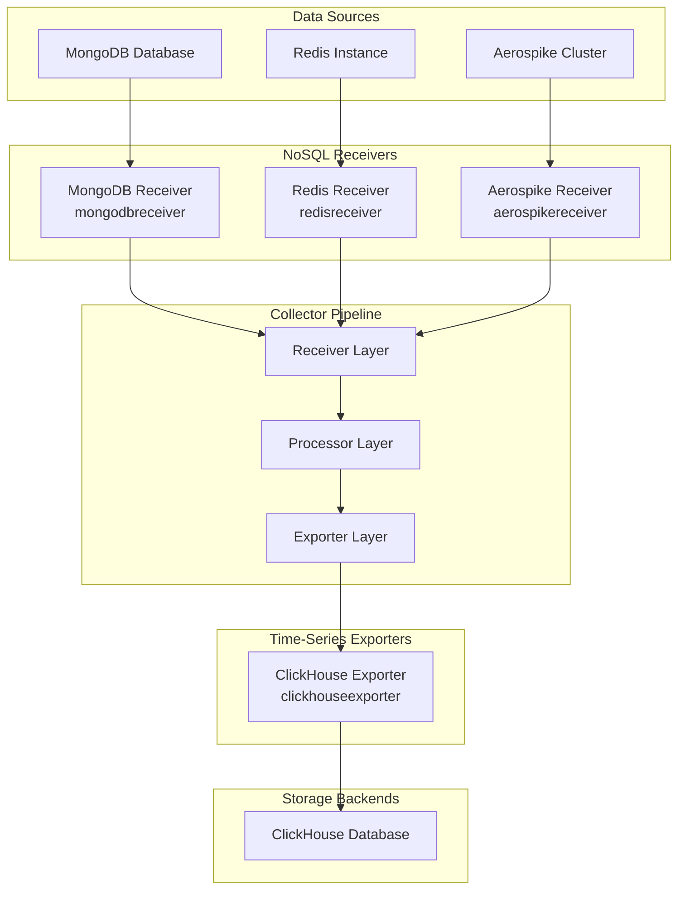
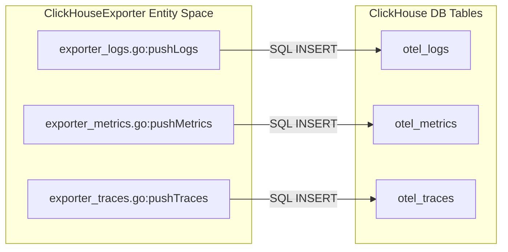
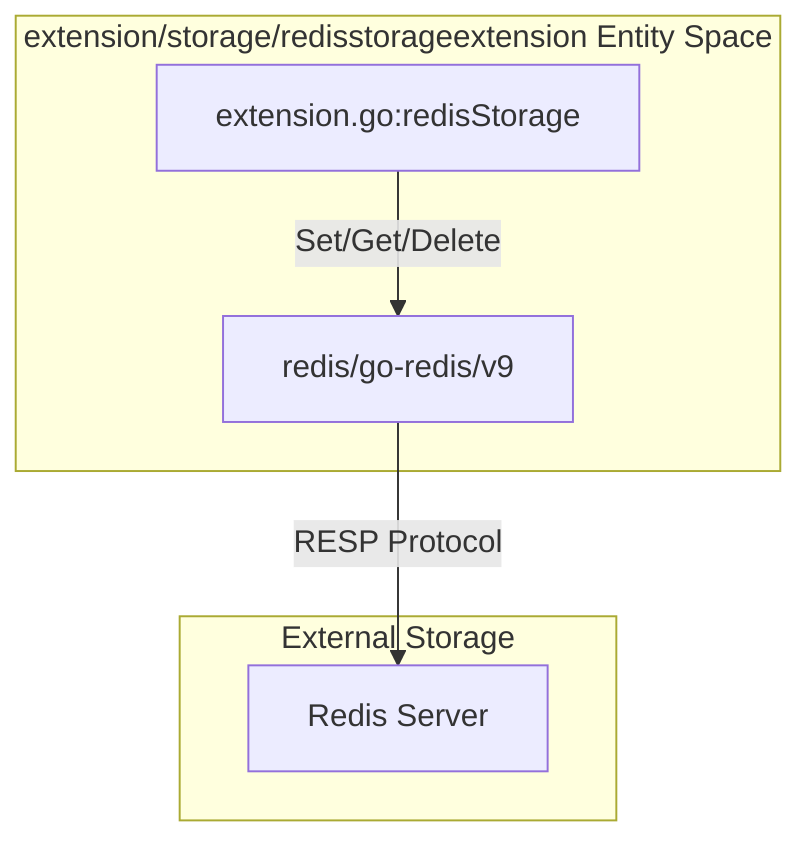
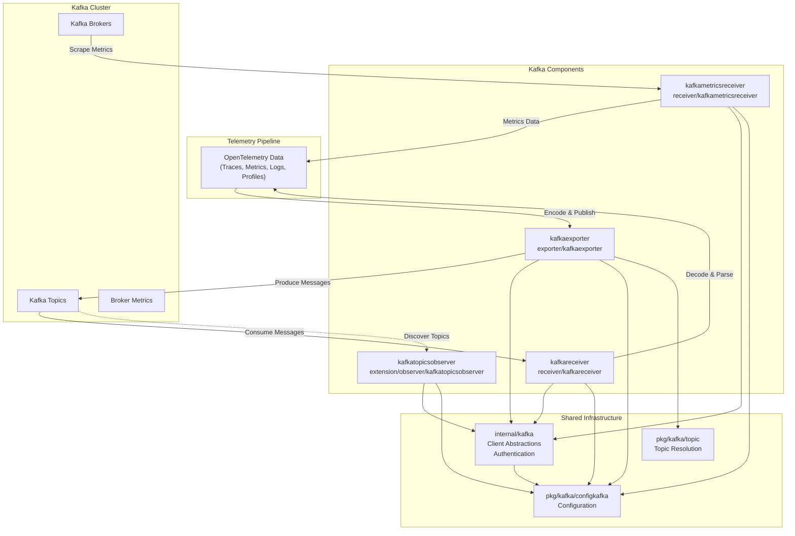
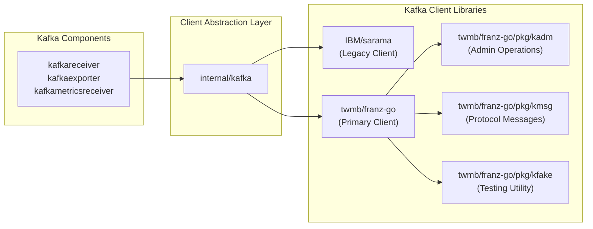
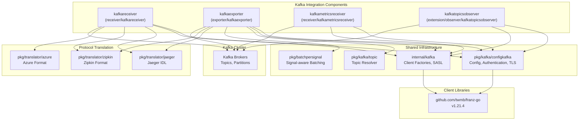
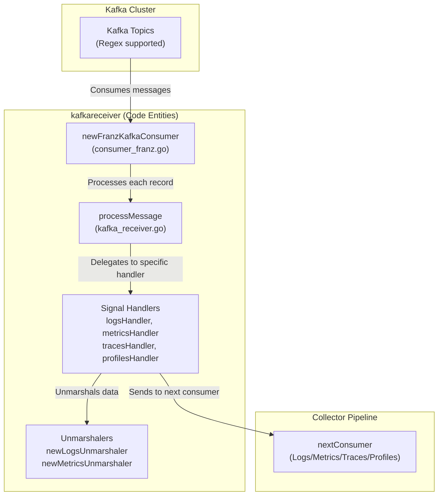
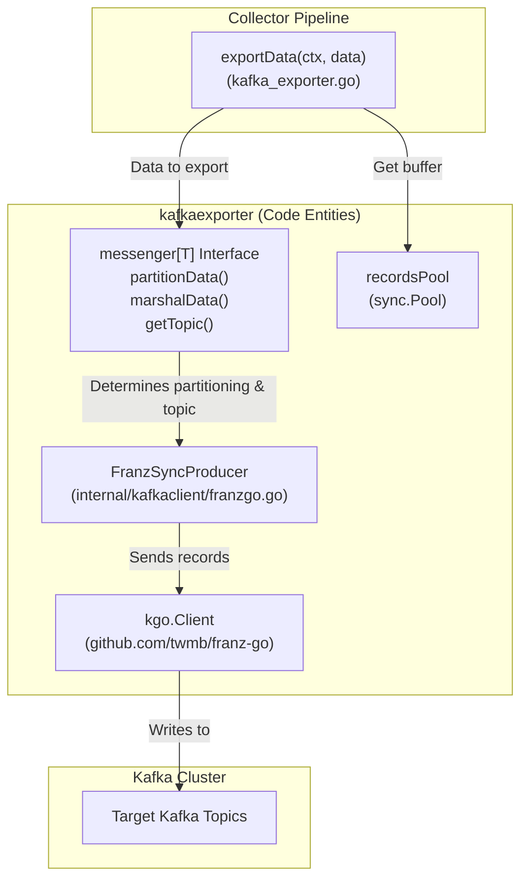

## Purpose and Scope

This page documents the OpenTelemetry Collector Contrib integrations with NoSQL databases and time-series data stores. These integrations enable the collector to both ingest telemetry data from these databases (via receivers) and export processed telemetry to them for storage and analysis (via exporters).

**Covered in this document:**
- MongoDB receiver for metrics collection
- Redis receiver for metrics collection and Redis storage extension
- ClickHouse exporter for traces, metrics, logs, and profiles
- Aerospike receiver for metrics collection
- Database storage extensions (Redis and generic DB storage)

---

## Architecture Overview

NoSQL and time-series database integrations follow the standard OpenTelemetry Collector pattern where receivers pull metrics from database management systems and exporters push processed telemetry data to storage backends.

### Integration Pattern



Sources: [exporter/clickhouseexporter/README.md:21-27](), [receiver/mongodbreceiver/go.mod:1-15]()

---

## NoSQL Database Receivers

### MongoDB Receiver
The MongoDB receiver (`mongodbreceiver`) collects metrics from MongoDB database instances by connecting to the database and querying performance statistics.

*   **Dependencies:** Uses `go.mongodb.org/mongo-driver/v2` for client functionality. [receiver/mongodbreceiver/go.mod:15-15]()
*   **Obfuscation:** Integrates `github.com/DataDog/datadog-agent/pkg/obfuscate` for handling sensitive data in queries. [receiver/mongodbreceiver/go.mod:6-6]()
*   **Capabilities:** Collects database and server-level metrics, supports TLS and authentication via standard collector config modules. [receiver/mongodbreceiver/go.mod:19-21]()

### Redis Receiver
The Redis receiver (`redisreceiver`) monitors Redis instances and clusters by executing commands and parsing the output.

*   **Dependencies:** Depends on `github.com/redis/go-redis/v9`. [receiver/redisreceiver/go.mod:9-9]()
*   **Implementation:** Utilizes `scraper` and `scraperhelper` packages for periodic polling logic. [receiver/redisreceiver/go.mod:24-25]()
*   **Integration Testing:** Uses `testcontainers-go` for automated integration tests against live Redis instances. [receiver/redisreceiver/go.mod:11-11]()

### Aerospike Receiver
The Aerospike receiver (`aerospikereceiver`) collects metrics from Aerospike database clusters.

*   **Dependencies:** Uses `github.com/aerospike/aerospike-client-go/v8`. [receiver/aerospikereceiver/go.mod:6-6]()
*   **Structure:** Implements the `scraper` and `scraperhelper` patterns to periodically poll the cluster. [receiver/aerospikereceiver/go.mod:23-24]()

---

## Time-Series Database Exporters

### ClickHouse Exporter
The ClickHouse exporter (`clickhouseexporter`) writes traces, metrics, logs, and profiles to ClickHouse, optimized for analytical queries.

#### Implementation Detail
The exporter uses a modular design with separate logic for logs, metrics, and traces. It supports high-performance batching as recommended by ClickHouse documentation. [exporter/clickhouseexporter/README.md:31-34]()

| File | Responsibility |
|---|---|
| `factory.go` | Component creation and initialization. [exporter/clickhouseexporter/factory.go:1-20]() |
| `config.go` | Configuration structure including DSN, TTL, and table names. [exporter/clickhouseexporter/config.go:1-30]() |
| `exporter_logs.go` | Logic for inserting OTLP logs into the `otel_logs` table. [exporter/clickhouseexporter/exporter_logs.go:1-40]() |
| `exporter_metrics.go` | Logic for inserting OTLP metrics. [exporter/clickhouseexporter/exporter_metrics.go:1-40]() |
| `exporter_traces.go` | Logic for inserting OTLP traces. [exporter/clickhouseexporter/exporter_traces.go:1-40]() |

#### Schema Management
The exporter uses SQL templates to define table structures. It supports both standard OTLP mappings and a JSON-based schema for flexible attribute storage. [exporter/clickhouseexporter/exporter_logs_json.go:1-20]() [exporter/clickhouseexporter/internal/sqltemplates/logs_table.sql:1-10]()

#### Data Flow (ClickHouse)


Sources: [exporter/clickhouseexporter/go.mod:1-26](), [exporter/clickhouseexporter/README.md:39-49](), [exporter/clickhouseexporter/config_test.go:53-81]()

---

## Storage Extensions

### Redis Storage Extension
The `redisstorageextension` provides a persistent storage backend for collector components (like the `filelog` receiver's checkpointing) using Redis.

*   **Implementation:** Implements the `storage.Extension` interface. [extension/storage/redisstorageextension/extension.go:1-20]()
*   **Testing:** Uses `redismock` for unit testing the storage logic without a live Redis server. [extension/storage/redisstorageextension/go.mod:6-6]()

### DB Storage Extension
The `dbstorage` extension allows using generic database backends for component state storage.

*   **Client Interface:** Defines a standard client for database interactions. [extension/storage/dbstorage/client.go:1-20]()
*   **Persistence:** Enables components to survive restarts by persisting state to a configured database. [extension/storage/dbstorage/README.md:1-10]()



Sources: [extension/storage/redisstorageextension/go.mod:1-20](), [extension/storage/dbstorage/go.mod:1-10]()

---

## Configuration Patterns

### Common Receiver Configuration
Most NoSQL receivers share a common configuration structure for networking and security.

| Feature | Configuration Module | File Reference |
|---|---|---|
| Networking | `confignet.TCPAddr` | [receiver/redisreceiver/go.mod:14]() |
| TLS | `configtls.ClientConfig` | [receiver/mongodbreceiver/go.mod:20]() |
| Authentication | `configopaque.String` | [receiver/mongodbreceiver/go.mod:19]() |

### ClickHouse Exporter Performance
The exporter relies on internal batching via the `sending_queue` rather than an external `batch` processor to prevent data loss. [exporter/clickhouseexporter/README.md:34-34]()

---

## Testing Infrastructure

The repository employs several testing strategies for data stores:

1.  **Integration Tests:** Using `testcontainers-go` to spin up real instances of MongoDB, Redis, or ClickHouse. [exporter/clickhouseexporter/go.mod:11](), [receiver/redisreceiver/go.mod:11]()
2.  **Golden File Testing:** Comparing collected metrics against "golden" YAML files using `pkg/golden`. [receiver/mongodbreceiver/go.mod:11](), [receiver/mongodbreceiver/internal/metadata/testdata/config.yaml:1-10]()
3.  **Data Consistency:** Using `pkg/pdatatest` to ensure OTLP data structures are preserved correctly during export/import. [receiver/redisreceiver/go.mod:8](), [receiver/aerospikereceiver/go.mod:9]()
4.  **Mocking:** Using `redismock` for storage extension testing. [extension/storage/redisstorageextension/go.mod:6]()

Sources: [exporter/clickhouseexporter/integration_test.go:1-50](), [receiver/mongodbreceiver/integration_test.go:1-50]()

# Messaging Systems Integration


## Purpose and Scope

This document describes the messaging system integrations in the OpenTelemetry Collector Contrib repository, focusing on components that enable telemetry data exchange through message queue platforms. The primary integration is Apache Kafka, which provides a complete ecosystem of receiver, exporter, metrics receiver, and topic observer components. Other supported messaging systems include Pulsar, RabbitMQ, NATS, Google Cloud Pub/Sub, and Azure Event Hub.

For detailed Kafka component implementations and configuration patterns, see [Kafka Integration Components](#7.1). For integrations with other messaging systems, see [Other Message Queue Systems](#7.2).

## Kafka Integration Architecture

The Kafka integration is the most comprehensive messaging system integration in the repository, providing bidirectional telemetry flow, metrics collection, and topic observation capabilities.

### Component Ecosystem Diagram



**Sources:**
- [receiver/kafkareceiver/go.mod:11-12]()
- [exporter/kafkaexporter/go.mod:9-12]()
- [receiver/kafkametricsreceiver/go.mod:7-8]()
- [internal/kafka/go.mod:7]()

## Kafka Component Overview

The Kafka integration consists of four primary components that work together to provide comprehensive Kafka integration:

| Component | Type | Module Path | Purpose |
|-----------|------|-------------|---------|
| `kafkareceiver` | Receiver | `receiver/kafkareceiver` | Consumes telemetry data (logs, metrics, traces, profiles) from Kafka topics and converts to OpenTelemetry format [receiver/kafkareceiver/README.md:4-7]() |
| `kafkaexporter` | Exporter | `exporter/kafkaexporter` | Converts OpenTelemetry data to various formats and publishes to Kafka topics [exporter/kafkaexporter/README.md:18-20]() |
| `kafkametricsreceiver` | Receiver | `receiver/kafkametricsreceiver` | Collects Kafka broker and topic metrics for monitoring [receiver/kafkametricsreceiver/go.mod:1]() |
| `kafkatopicsobserver` | Extension | `extension/observer/kafkatopicsobserver` | Discovers and monitors Kafka topics dynamically [extension/observer/kafkatopicsobserver/go.mod:1]() |

**Sources:**
- [receiver/kafkareceiver/go.mod:1]()
- [exporter/kafkaexporter/go.mod:1]()
- [receiver/kafkametricsreceiver/go.mod:1]()
- [extension/observer/kafkatopicsobserver/go.mod:1]()
- [receiver/kafkareceiver/README.md:4-7]()
- [exporter/kafkaexporter/README.md:18-20]()

## Dual Kafka Client Library Architecture

The Kafka integration supports two Kafka client libraries to provide flexibility and compatibility. Modern components have transitioned toward `franz-go` for performance and support for modern Kafka features [receiver/kafkareceiver/README.md:26-27]().

### Client Library Support Diagram



| Library | Version | Module Path | Usage |
|---------|---------|-------------|-------|
| **IBM Sarama** | Indirect | `github.com/IBM/sarama` | Legacy support, wide compatibility. |
| **franz-go** | v1.21.4 | `github.com/twmb/franz-go` | Modern, high-performance client [receiver/kafkareceiver/go.mod:18](). |
| **franz-go/kadm** | v1.18.0 | `github.com/twmb/franz-go/pkg/kadm` | Admin operations (topic management, metadata) [receiver/kafkareceiver/go.mod:19](). |
| **franz-go/kmsg** | v1.13.1 | `github.com/twmb/franz-go/pkg/kmsg` | Kafka protocol message handling [exporter/kafkaexporter/go.mod:20](). |
| **franz-go/kfake** | v0.0.0-20260421215025-4e7a1e1569ac | `github.com/twmb/franz-go/pkg/kfake` | Testing utilities with fake Kafka broker [receiver/kafkareceiver/go.mod:20](). |

**Sources:**
- [receiver/kafkareceiver/go.mod:18-20]()
- [exporter/kafkaexporter/go.mod:18-20]()
- [internal/kafka/go.mod:71-73]()
- [receiver/kafkareceiver/README.md:26-27]()

## Shared Infrastructure Modules

### internal/kafka Module

The `internal/kafka` module provides shared Kafka client management, authentication, and configuration logic used by all Kafka components. It manages specialized authentication like AWS MSK IAM and Kerberos.

**Key Dependencies:**
- **AWS MSK IAM**: `github.com/aws/aws-msk-iam-sasl-signer-go v1.0.4` [internal/kafka/go.mod:6]()
- **Kerberos**: `github.com/jcmturner/gokrb5/v8 v8.4.4` and `github.com/twmb/franz-go/pkg/sasl/kerberos v1.1.0` [internal/kafka/go.mod:10,61]()
- **OAuth2**: `golang.org/x/oauth2 v0.36.0` [internal/kafka/go.mod:18]()

**Sources:**
- [internal/kafka/go.mod:1-87]()

### pkg/kafka/configkafka Module

The `pkg/kafka/configkafka` module defines configuration structures and validation for Kafka connections. It is shared across the receiver [receiver/kafkareceiver/go.mod:12](), exporter [exporter/kafkaexporter/go.mod:11](), and metrics receiver [receiver/kafkametricsreceiver/go.mod:8]().

**Sources:**
- [receiver/kafkareceiver/go.mod:12]()
- [exporter/kafkaexporter/go.mod:11]()
- [receiver/kafkametricsreceiver/go.mod:8]()

## Authentication Mechanisms

The Kafka integration supports multiple authentication mechanisms for secure communication with Kafka clusters:

| Mechanism | Library | Version | Use Case |
|-----------|---------|---------|----------|
| **Kerberos (GSSAPI)** | `github.com/jcmturner/gokrb5/v8` | v8.4.4 | Enterprise single sign-on [internal/kafka/go.mod:61]() |
| **AWS MSK IAM** | `github.com/aws/aws-msk-iam-sasl-signer-go` | v1.0.4 | AWS Managed Streaming for Kafka [internal/kafka/go.mod:6]() |
| **OAuth 2.0** | `golang.org/x/oauth2` | v0.36.0 | Token-based authentication [internal/kafka/go.mod:18]() |

**Sources:**
- [internal/kafka/go.mod:6,10,18,61]()

## Protocol Translation

The Kafka receiver and exporter support multiple telemetry encoding formats for logs, metrics, and traces.

### Supported Encoding Formats

| Format | Direction | Translator Module | Wire Format |
|--------|-----------|-------------------|-------------|
| **OTLP** | Receive + Export | `go.opentelemetry.io/collector/pdata` | Protocol Buffers [receiver/kafkareceiver/go.mod:34]() |
| **Jaeger** | Receive + Export | `pkg/translator/jaeger` | Thrift [receiver/kafkareceiver/go.mod:15]() |
| **Zipkin** | Receive + Export | `pkg/translator/zipkin` | JSON [receiver/kafkareceiver/go.mod:16]() |
| **Azure** | Receive only | `pkg/translator/azure` | Azure-specific format [receiver/kafkareceiver/go.mod:14]() |

**Sources:**
- [receiver/kafkareceiver/go.mod:14-16,34]()
- [exporter/kafkaexporter/go.mod:15-16,37]()

## Kafka Metrics Collection

The `kafkametricsreceiver` component scrapes metrics from Kafka brokers and topics. It uses `franz-go/kadm` for administrative operations to gather metadata and metrics [receiver/kafkametricsreceiver/go.mod:11]().

**Sources:**
- [receiver/kafkametricsreceiver/go.mod:1-29]()

## Other Messaging System Integrations

While Kafka provides the most comprehensive integration, the repository also includes components for other messaging systems:

- **Google Cloud Pub/Sub**: Receiver and exporter for GCP Pub/Sub (see [Google Cloud Platform Components](#8.1)).
- **Azure Event Hub**: Receiver for Azure Event Hub messages (see [Multi-Cloud Export Support](#8.3)).
- **Pulsar, RabbitMQ, NATS**: Documented in detail in [Other Message Queue Systems](#7.2).

For detailed information about these integrations, see [Other Message Queue Systems](#7.2).

# Kafka Integration Components


## Purpose and Scope

This document describes the Kafka integration components in the OpenTelemetry Collector Contrib repository. The Kafka integration provides a comprehensive ecosystem for ingesting telemetry data from Kafka topics, exporting telemetry to Kafka, collecting Kafka cluster metrics, and observing Kafka topic changes.

The integration consists of four main components:
- **Kafka Receiver** (`kafkareceiver`) - Consumes traces, metrics, logs, and profiles from Kafka topics.
- **Kafka Exporter** (`kafkaexporter`) - Publishes traces, metrics, logs, and profiles to Kafka topics.
- **Kafka Metrics Receiver** (`kafkametricsreceiver`) - Collects metrics about Kafka brokers and topics.
- **Kafka Topics Observer** (`kafkatopicsobserver`) - Monitors Kafka topics for dynamic service discovery.

## Component Architecture Overview

The Kafka ecosystem in `opentelemetry-collector-contrib` is built on a shared foundation that leverages the `franz-go` client library for high performance and modern Kafka feature support.



Sources:
- [receiver/kafkareceiver/go.mod:11-18]()
- [exporter/kafkaexporter/go.mod:9-18]()
- [receiver/kafkametricsreceiver/go.mod:7-11]()
- [internal/kafka/go.mod:5-19]()

## Shared Infrastructure

### Configuration Package (pkg/kafka/configkafka)

The `pkg/kafka/configkafka` module provides common configuration structures used by all Kafka components. This centralizes authentication, TLS, compression, and client settings.

**Key Configuration Structures:**

| Configuration Field | Purpose | File Reference |
|-------------------|---------|----------------|
| `Config` | Base Kafka client configuration | [pkg/kafka/configkafka/config.go:27-39]() |
| `Authentication` | SASL/TLS authentication settings | [pkg/kafka/configkafka/config.go:41-49]() |
| `Metadata` | Topic metadata refresh settings | [pkg/kafka/configkafka/config.go:51-55]() |
| `Producer` | Producer-specific configuration | [pkg/kafka/configkafka/config.go:57-70]() |
| `Consumer` | Consumer-specific configuration | [pkg/kafka/configkafka/config.go:72-85]() |

Sources:
- [pkg/kafka/configkafka/config.go:27-85]()

### Internal Kafka Package (internal/kafka)

The `internal/kafka` module implements client factory functions and SASL authentication mechanisms shared across all Kafka components. It primarily uses the `franz-go` client library [internal/kafka/franz_client.go:25]().

**Key Implementation Entities:**
- `NewFranzSyncProducer`: Creates a synchronous producer using the `franz-go` library [internal/kafka/franz_client.go:25]().
- `NewFranzClient`: Creates a generic `franz-go` client for various operations [internal/kafka/franz_client.go:55]().

Sources:
- [internal/kafka/go.mod:1-19]()
- [internal/kafka/franz_client.go:25-55]()

## Kafka Receiver (kafkareceiver)

The Kafka receiver consumes telemetry data (traces, metrics, logs, profiles) from Kafka topics. It utilizes the `franz-go` library for high-performance consumption [receiver/kafkareceiver/README.md:27-28](). It supports consuming from multiple topics using regex by prefixing topics with `^` [receiver/kafkareceiver/README.md:29-31]().

### Implementation Detail: Message Handling

The receiver uses a generic `messageHandler` interface to abstract signal-specific processing logic:

```go
type messageHandler[T plog.Logs | pmetric.Metrics | ptrace.Traces | pprofile.Profiles] interface {
	// unmarshalData unmarshals the message payload into a pdata type
	unmarshalData(data []byte) (T, int, error)
	// consumeData passes the unmarshaled data to the next consumer
	consumeData(ctx context.Context, data T) error
	// getResources returns the resources associated with the unmarshaled data
	getResources(T) iter.Seq[pcommon.Resource]
	// startObsReport starts an observation report
	startObsReport(ctx context.Context) context.Context
	// endObsReport ends the observation report
	endObsReport(ctx context.Context, n int, err error)
	// getUnmarshalFailureCounter returns the appropriate telemetry counter
	getUnmarshalFailureCounter(telBldr *metadata.TelemetryBuilder) metric.Int64Counter
}
```
[receiver/kafkareceiver/kafka_receiver.go:43-69]()

### Receiver Architecture



Sources:
- [receiver/kafkareceiver/kafka_receiver.go:71-177]()
- [receiver/kafkareceiver/README.md:27-36]()
- [receiver/kafkareceiver/consumer_franz.go:1-50]()

## Kafka Exporter (kafkaexporter)

The Kafka exporter publishes telemetry to Kafka. It uses a synchronous producer that blocks and does not batch messages, recommending the use of `batch` and `queued_retry` processors [exporter/kafkaexporter/README.md:18-20]().

### Implementation Detail: Partitioning and Topic Selection

The exporter uses a `messenger` interface to handle signal-specific data partitioning and topic resolution:

```go
type messenger[T any] interface {
	// partitionData returns an iterator yielding partition keys and pdata
	partitionData(T) iter.Seq2[[]byte, T]
	// marshalData marshals a pdata type into zero or more messages
	marshalData(data T, yield func(key, value []byte)) error
	// getTopic returns the topic name for the given context and data
	getTopic(context.Context, T) string
	// getMessageKey returns the Kafka record key derived from client metadata
	getMessageKey(context.Context) []byte
}
```
[exporter/kafkaexporter/kafka_exporter.go:36-53]()

**Key Components:**
- `kafkaExporter.Start`: Initializes the `franz-go` synchronous producer and telemetry builders [exporter/kafkaexporter/kafka_exporter.go:92-131]().
- `kafkaExporter.exportData`: Iterates through partitioned data, marshals it, and sends it via the producer. It utilizes a `recordsPool` to manage `recordsBuffer` instances for memory efficiency [exporter/kafkaexporter/kafka_exporter.go:146-211]().
- `partition_traces_by_id`: Configures the exporter to include the trace ID as the message key in trace messages [exporter/kafkaexporter/README.md:55]().
- `partition_metrics_by_resource_attributes`: Partitions metrics by the hash of sorted resource attributes [exporter/kafkaexporter/README.md:56-57]().

### Exporter Architecture



Sources:
- [exporter/kafkaexporter/kafka_exporter.go:58-131]()
- [exporter/kafkaexporter/kafka_exporter.go:146-211]()
- [exporter/kafkaexporter/README.md:52-59]()
- [exporter/kafkaexporter/internal/kafkaclient/franzgo.go:1-40]()

## Authentication Mechanisms

The Kafka components support a wide array of authentication mechanisms provided via `pkg/kafka/configkafka` and `internal/kafka`.

### Supported Protocols
- **SASL PLAIN**: Simple username/password [exporter/kafkaexporter/README.md:32]().
- **SASL SCRAM**: Supports SHA-256 and SHA-512 via the shared config [pkg/kafka/configkafka/config.go:41-49]().
- **SASL GSSAPI (Kerberos)**: Integrated via `franz-go` and `jcmturner/gokrb5` [internal/kafka/go.mod:10,61]().
- **AWS MSK IAM**: Uses AWS SigV4 for MSK clusters via the `aws-msk-iam-sasl-signer-go` library [internal/kafka/go.mod:6]().
- **OAuth Bearer**: Token-based authentication [internal/kafka/go.mod:18]().

Sources:
- [internal/kafka/go.mod:6-18]()
- [pkg/kafka/configkafka/config.go:41-49]()

## Protocol Translation

The receiver and exporter support various protocol translations to bridge non-OTLP data into the Collector's internal pipeline.

| Protocol | Usage | Library Dependency |
|----------|-------|--------------------|
| **Jaeger** | Traces | `pkg/translator/jaeger` [receiver/kafkareceiver/go.mod:15]() |
| **Zipkin** | Traces | `pkg/translator/zipkin` [receiver/kafkareceiver/go.mod:16]() |
| **Azure** | Logs | `pkg/translator/azure` [receiver/kafkareceiver/go.mod:14]() |

Sources:
- [receiver/kafkareceiver/go.mod:14-16]()
- [exporter/kafkaexporter/go.mod:15-16]()