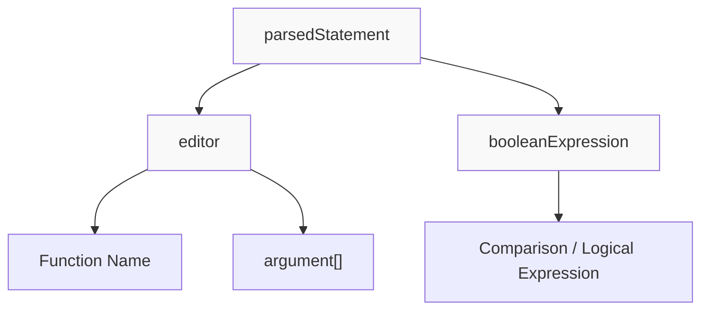
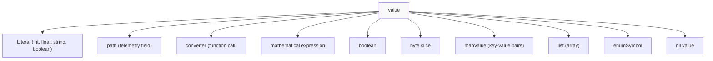
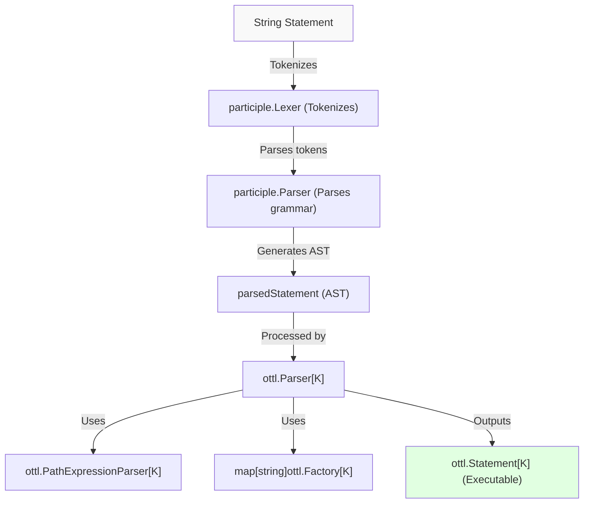
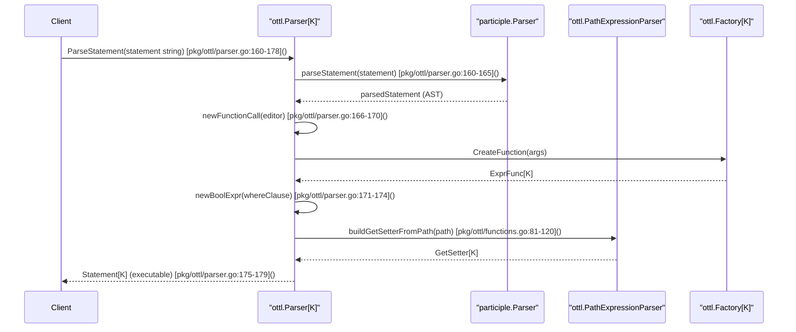
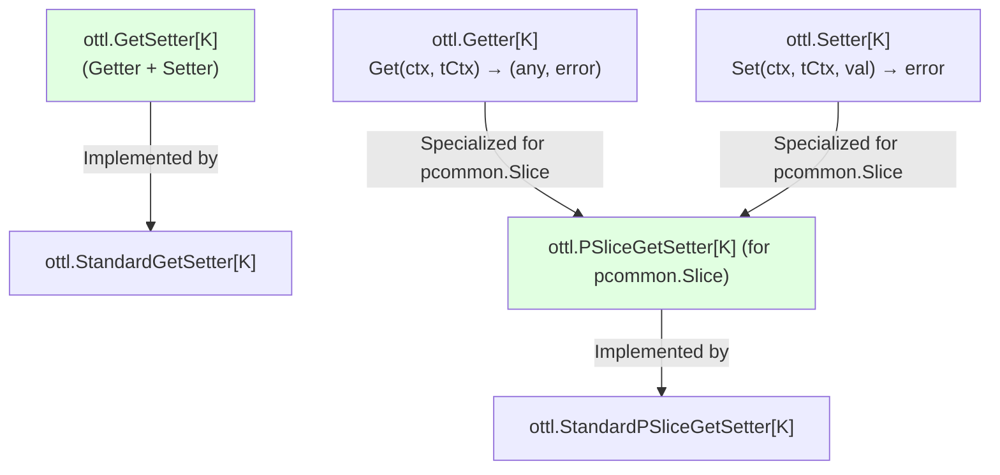
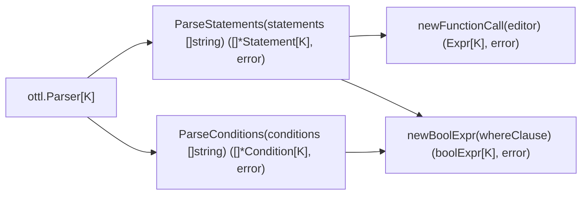

The OpenTelemetry Transformation Language (OTTL) is a domain-specific language designed for transforming telemetry data within the OpenTelemetry Collector. OTTL provides a declarative syntax for filtering, modifying, and routing telemetry data such as traces, metrics, and logs. It enables flexible manipulation through editor function calls combined with conditional expressions.

This document covers the language syntax and grammar, expression evaluation model, built-in functions, context-specific path parsing, and the architecture of the OTTL parser implementation.

---

## Language Overview and Grammar

OTTL statements are composed of editor function calls that manipulate telemetry data, optionally guarded by a `where` clause that provides filtering conditions.

### Statement Structure



- **Editor function**: Lowercase function identifier with positional arguments, e.g. `set(attributes["key"], "value")` [pkg/ottl/parser_test.go:37-48]()
- **Where clause**: Optional boolean expression prefixed by `where`, e.g. `where name == "foo"` [pkg/ottl/parser_test.go:389-390]()
- **Arguments**: Can be literal values, paths, nested function calls (converters), maps, lists, or expressions [pkg/ottl/parser_test.go:40-48]()

### Path Expressions

Paths allow navigating telemetry data fields with dot notation and indexed keys.

Example:

```
resource.attributes["http.method"]
span.events[0].name
```

- **Context**: Prefix indicating the telemetry entity (e.g., `span`, `resource`, `log`) [pkg/ottl/functions.go:185-187]()
- **Field names**: Dot-separated identifiers navigating nested objects [pkg/ottl/functions.go:30-48]()
- **Keys**: Accessing indexed elements using string keys or integer indices with bracket notation, keys may themselves be expressions [pkg/ottl/functions.go:50-76](), [pkg/ottl/functions.go:226-263]()

### Value Types Supported



**Sources:**
[pkg/ottl/parser_test.go:37-133](), [pkg/ottl/functions.go:30-76](), [pkg/ottl/functions.go:185-187]()

---

## Parser Architecture

The OTTL parser converts string statements into executable objects using the `participle` library for parsing the textual grammar.



### Key Parser Components

| Component             | Role                                                      | Source                      |
|-----------------------|-----------------------------------------------------------|-----------------------------|
| `ottl.Parser[K]`        | Main parser parameterized over TransformContext `K`       | [pkg/ottl/parser.go:66-82]()      |
| `PathExpressionParser`  | Converts parsed path AST into runtime GetSetter objects   | [pkg/ottl/functions.go:21-54]()   |
| `EnumParser`            | Resolves string enum symbols to numeric enum values       | [pkg/ottl/functions.go:25-32]()   |
| Function Factories Map  | Registry binding function names to their implementations | [pkg/ottl/parser.go:76-80]()       |

### Parsing Flow Sequence



**Sources:**
[pkg/ottl/parser.go:66-182](), [pkg/ottl/functions.go:33-120]()

---

## Expression System

OTTL expressions rely on a uniform `Getter` and `Setter` interface system to read and modify telemetry data in a type-safe manner at runtime.

### Getter and Setter Interfaces



- **Getter[K]**: Evaluates a path or expression within context `K`, returning a raw value or an error [pkg/ottl/expression.go:38-41]()
- **Setter[K]**: Modifies a telemetry field at runtime [pkg/ottl/expression.go:44-47]()
- **GetSetter[K]**: Combined interface supporting get and set [pkg/ottl/expression.go:51-54]()
- **Typed getters and setters** are provided for common telemetry types (e.g., `pcommon.Slice`) for specialized operations [pkg/ottl/expression.go:239-254]()

### Path Resolution and Runtime Value Access

- The parser builds paths as linked `basePath[K]` nodes, where each node represents a field name, optional keys (for indexing), and links to the next path segment [pkg/ottl/functions.go:81-120]().
- Keys in paths can be string literals, integers, or computed expressions [pkg/ottl/functions.go:160-237]().
- At runtime, `exprGetter` evaluates the expression and applies indexing keys to drill down into nested maps or slices [pkg/ottl/expression.go:70-149]().
- The `GetSetter` implementations support both getting and setting nested values safely, converting data types as needed.

**Sources:**
[pkg/ottl/functions.go:81-120](), [pkg/ottl/functions.go:160-237](), [pkg/ottl/expression.go:75-157]()

---

## Function System

OTTL functions come in two categories:

| Type           | Grammar Convention           | Description                                           |
|----------------|-----------------------------|-------------------------------------------------------|
| **Editors**    | Lowercase start (e.g., `set`, `delete_key`) | Transform telemetry data with potential side effects; usually modify data in-place. [pkg/ottl/ottlfuncs/README.md:38-44]() |
| **Converters** | Uppercase start (e.g., `Base64Encode`, `Coalesce`)  | Supplemental utility functions that compute values or transform inputs without side effects. [pkg/ottl/ottlfuncs/README.md:9-10]() |

### Editor Functions Examples

Some common editors available in OTTL include:

| Function           | Description                                                      |
|--------------------|------------------------------------------------------------------|
| `append`           | Appends value(s) to a slice attribute                             |
| `delete_index`     | Deletes elements by index from slices                             |
| `delete_key`       | Removes keys from `pcommon.Map` objects                           |
| `delete_matching_keys` | Removes all keys matching a regex pattern                      |
| `flatten`          | Flattens nested maps or slices into a flat map                    |
| `keep_matching_keys` | Retains keys matching a regex, deleting others                  |
| `set`              | Sets a value at the specified path                                |
| `truncate_all`     | Truncates string values within a map or slice to a specified limit |

You can see more editor functions documented in [pkg/ottl/ottlfuncs/README.md:46-62]().

### Converter Functions Examples

Converters provide utilities such as:

- Encoding/decoding: `Base64Encode`, `Base64Decode`
- Type checks: `IsList`, `IsBool`, `IsString`
- String manipulations: `ToUpperCase`, `Trim`, `Concat`
- Time extractions: `Hour`, `Minute`, `Second`
- Hashing and hashing-related: `MD5`, `SHA256`, `XXH3`

The exhaustive list is in [pkg/ottl/ottlfuncs/functions.go:38-140]().

### Implementation Principles for Built-in Functions

To ensure security and safety:

- Built-in functions must not access the filesystem, network, or perform I/O operations.
- They can only share data via parameters and return values.
- They must be terminating—no infinite loops allowed.

User-defined functions may not follow these rules, but built-in ones do.
Source: [pkg/ottl/ottlfuncs/README.md:11-22]()

---

## Context-Specific Operations

OTTL functions and paths operate within defined telemetry contexts. The Collector processes multiple signal types — logs, metrics, traces — each with its own context and allowed path expressions. The contexts encapsulate the relevant parts of telemetry batches.

### Notable Context Implementations

| Context  | Context Name | File Path                                               | Supported Path Contexts                          |
|----------|--------------|---------------------------------------------------------|-------------------------------------------------|
| Logs     | `log`        | `pkg/ottl/contexts/ottllog/log.go`                      | `log`, `scope`, `resource`, `otelcol`           |
| Span Events | `spanevent` | `pkg/ottl/contexts/ottlspanevent/span_events.go`         | `spanevent`, `span`, `resource`, `scope`, `otelcol` |
| Datapoints | `datapoint` | `pkg/ottl/contexts/ottldatapoint/datapoint.go`           | `datapoint`, `resource`, `scope`, `metric`, `otelcol` |
| Metrics  | `metric`     | `pkg/ottl/contexts/ottlmetric/metrics.go`                | `metric`, `scope`, `resource`, `otelcol`         |

Each context defines a `TransformContext` structure holding the corresponding pdata entities (e.g., spans, events, metrics) to operate on during transformations.

These contexts manage path parsing, validation, and runtime evaluation inside their respective scopes.

**Sources:**
[pkg/ottl/contexts/ottllog/log.go:44-49,139-145](), [pkg/ottl/contexts/ottlspanevent/span_events.go:41-48,149-156](), [pkg/ottl/contexts/ottldatapoint/datapoint.go:132-140](), [pkg/ottl/contexts/ottlmetric/metrics.go:123-130]()

---

## Parser Implementation Details

The core parser struct, `Parser[K]`, parameterized by the transform context type, is responsible for compiling string statements into executable `Statement[K]` objects.



- `ParseStatements` parses multiple statements and returns executables, collecting errors per statement [pkg/ottl/parser.go:137-155]().
- `Statement.Execute` evaluates the optional condition and executes the function if true, returning any function evaluation results [pkg/ottl/parser.go:33-51]().
- Options like `WithEnumParser` and `WithPathContextNames` enable customization of parsing contexts and enum resolution [pkg/ottl/parser.go:110-130]().

**Sources:**
[pkg/ottl/parser.go:22-56](), [pkg/ottl/parser.go:137-181]()

---