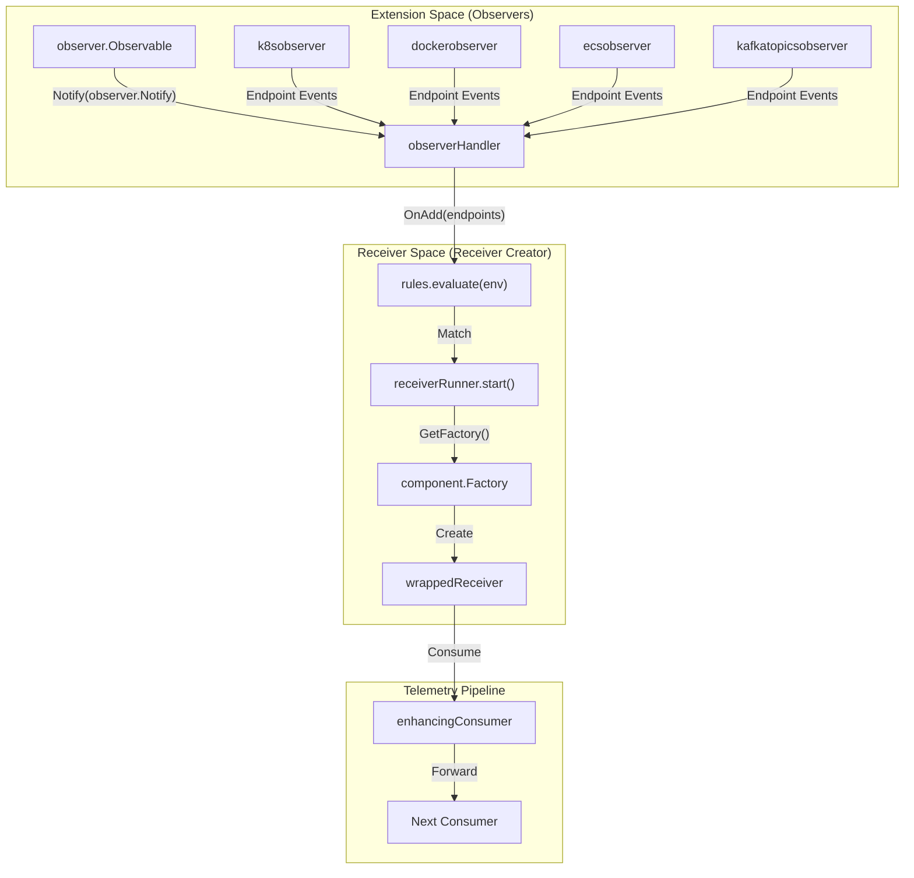
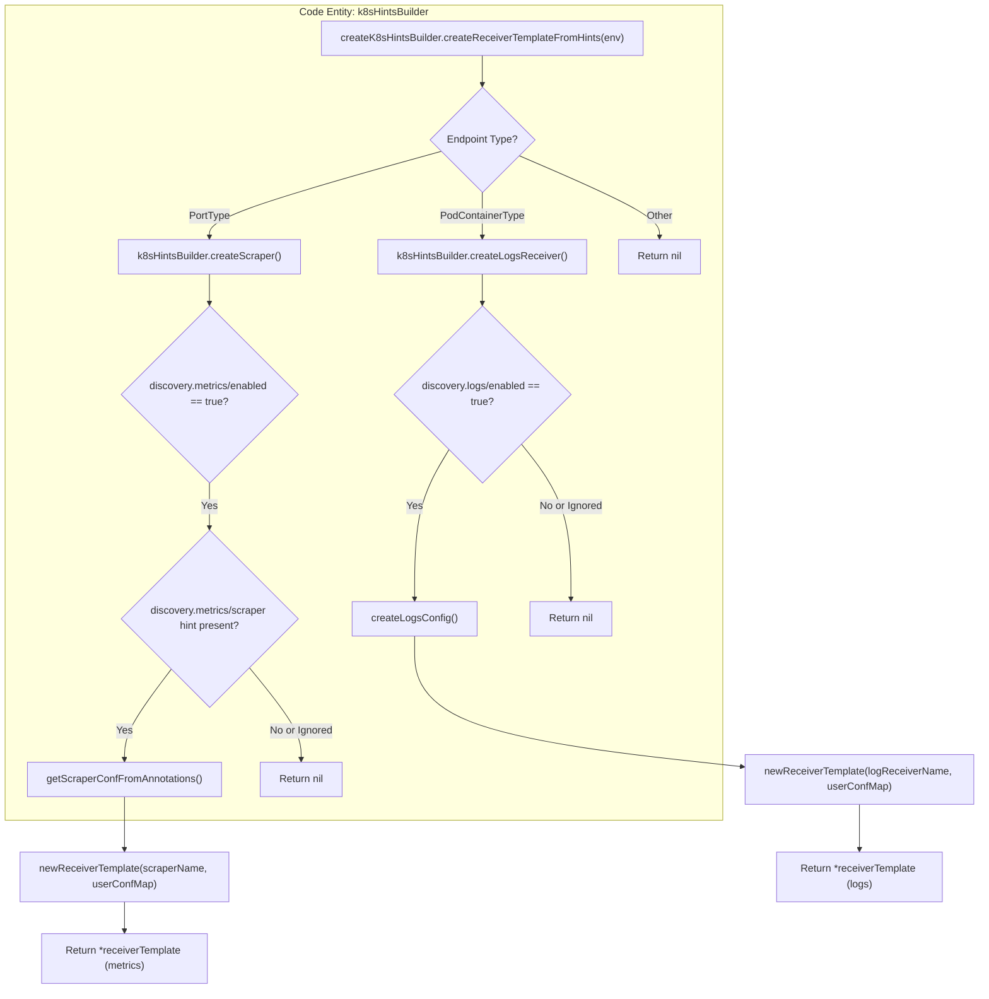

The Observer pattern in the OpenTelemetry Collector Contrib repository enables dynamic discovery of networked endpoints and the automated instantiation of receivers to monitor them. This architecture is primarily composed of **Observers** (extensions that discover targets) and the **Receiver Creator** (a receiver that manages the lifecycle of other receivers based on discovered targets).

## Overview and Architecture

The dynamic receiver creation workflow follows a reactive model:
1.  **Observers** monitor external systems (Kubernetes, Docker, ECS, etc.) and emit events when endpoints are added, changed, or removed [receiver/receivercreator/README.md:23-27]().
2.  The **Receiver Creator** subscribes to these observers [receiver/receivercreator/observerhandler.go:20-30]().
3.  When an endpoint is discovered, the Receiver Creator evaluates configured **Rules** against the endpoint's environment [receiver/receivercreator/observerhandler.go:101-109]().
4.  If a rule matches, a **Receiver Runner** instantiates and starts the target receiver using a template configuration [receiver/receivercreator/runner.go:25-31]().

### Component Interaction Diagram

This diagram maps the natural language concepts of discovery to the specific code entities responsible for the data flow.

Title: Observer and Receiver Creator Data Flow

Sources: [receiver/receivercreator/observerhandler.go:20-46](), [receiver/receivercreator/runner.go:56-65](), [extension/observer/endpoints.go:20-40](), [receiver/receivercreator/README.md:23-27]()

---

## Observer Extensions

Observers are specialized extensions that implement the `Observable` interface. They are responsible for watching a specific environment and maintaining a list of active `Endpoints`.

### Supported Observers
*   **K8s Observer**: Watches the Kubernetes API for Pods, Services, and Nodes [receiver/receivercreator/README.md:24-25]().
*   **Docker Observer**: Monitors the Docker Engine API for container lifecycle events [extension/observer/dockerobserver/go.mod:1-9]().
*   **ECS Observer**: Discovers tasks and services within AWS ECS clusters using the AWS SDK [extension/observer/ecsobserver/go.mod:1-9]().
*   **Host Observer**: Discovers network interfaces and ports on the host machine [receiver/receivercreator/README.md:24-25]().
*   **Kafka Topics Observer**: Monitors Kafka clusters for new or removed topics [receiver/receivercreator/factory.go:75-76]().
*   **CF Garden Observer**: Monitors CloudFoundry Garden containers using the Garden API and CloudFoundry client [extension/observer/cfgardenobserver/go.mod:6-9]().

### Endpoint Environment
Every discovered endpoint provides an `EndpointEnv`, which is a map of metadata used for rule evaluation and configuration templating [extension/observer/endpoints.go:110-120](). For example, a Kubernetes Port endpoint includes:
*   `type`: "port"
*   `pod.name`: The name of the pod.
*   `container.image`: The image running in the container.
*   `port`: The port number [receiver/receivercreator/README.md:112-122]().

Sources: [receiver/receivercreator/README.md:104-160](), [extension/observer/ecsobserver/go.mod:1-15](), [receiver/receivercreator/factory.go:37-79](), [extension/observer/dockerobserver/go.mod:1-9](), [receiver/receivercreator/discovery.go:66-71](), [extension/observer/cfgardenobserver/go.mod:1-15]()

---

## Receiver Creator

The `receiver_creator` is the central engine for dynamic instantiation. It acts as a meta-receiver that does not collect data itself but manages sub-receivers.

### Configuration and Rule Evaluation
The component uses the `expr` language to evaluate rules. Rules are defined in the `receivers` block of the configuration [receiver/receivercreator/README.md:45-50]().

| Field | Description |
| :--- | :--- |
| `watch_observers` | List of observer extension IDs to monitor [receiver/receivercreator/README.md:35-39](). |
| `rule` | An `expr` expression (e.g., `type == "port" && port == 6379`) [receiver/receivercreator/README.md:47-52](). |
| `config` | The YAML configuration for the sub-receiver, supporting backtick interpolation (e.g., ``endpoint: `endpoint`:6379``) [receiver/receivercreator/README.md:54-65](). |

### Dynamic Configuration Merging
When a rule matches, the `receiverRunner` performs the following steps:
1.  **Expand Templates**: Replaces backtick variables in the `config` with values from the `EndpointEnv` [receiver/receivercreator/observerhandler.go:154-158]().
2.  **Factory Lookup**: Retrieves the `rcvr.Factory` for the requested receiver type [receiver/receivercreator/runner.go:61-67]().
3.  **Merge Configs**: Combines the default receiver config, the templated config, and any discovered values (like the target IP) [receiver/receivercreator/runner.go:162-184]().
4.  **Validation**: Ensures the resulting configuration is valid for the target receiver [receiver/receivercreator/runner.go:153-155]().

Sources: [receiver/receivercreator/README.md:33-80](), [receiver/receivercreator/runner.go:138-157](), [receiver/receivercreator/observerhandler.go:148-175](), [receiver/receivercreator/go.mod:6-10]()

---

## Kubernetes Discovery Hints

The Receiver Creator supports an "Auto-Discovery" mode for Kubernetes via **Hints**. Instead of explicit rules in the collector config, it looks for specific annotations on Kubernetes Pods [receiver/receivercreator/discovery.go:21-36]().

### Implementation: `k8sHintsBuilder`
The `k8sHintsBuilder` extracts configuration directly from Pod metadata [receiver/receivercreator/discovery.go:39-43]().

Title: K8s Hint Processing Logic

Sources: [receiver/receivercreator/discovery.go:61-93](), [receiver/receivercreator/discovery.go:111-135](), [receiver/receivercreator/discovery.go:180-200](), [receiver/receivercreator/discovery.go:144-181]()

### Supported Annotations
*   `io.opentelemetry.discovery.metrics/enabled`: Set to `"true"` to enable scraping [receiver/receivercreator/discovery.go:111-113]().
*   `io.opentelemetry.discovery.metrics/scraper`: Specifies the receiver type (e.g., `redis`, `prometheus`) [receiver/receivercreator/discovery.go:115-119]().
*   `io.opentelemetry.discovery.metrics/config`: Inline YAML configuration for the receiver [receiver/receivercreator/discovery.go:185-195]().
*   `io.opentelemetry.discovery.logs/enabled`: Set to `"true"` to enable log collection [receiver/receivercreator/discovery.go:161-163]().
*   `io.opentelemetry.discovery.logs/config`: Inline YAML configuration for the `file_log` receiver [receiver/receivercreator/discovery.go:34-35]().

Sources: [receiver/receivercreator/discovery.go:111-113](), [receiver/receivercreator/discovery.go:115-119](), [receiver/receivercreator/discovery.go:185-195](), [receiver/receivercreator/discovery.go:161-163](), [receiver/receivercreator/discovery.go:21-36]()

---

## Resource Attribute Enrichment

Telemetry emitted by dynamically created receivers is automatically enriched with resource attributes derived from the endpoint [receiver/receivercreator/README.md:92-100](). This is handled by the `enhancingConsumer` [receiver/receivercreator/consumer_test.go:1-25]().

### Default Attribute Mapping
The `receiver_creator` factory defines default mappings for various endpoint types [receiver/receivercreator/factory.go:37-79]():

| Endpoint Type | Default Attributes |
| :--- | :--- |
| `pod` | `k8s.pod.name`, `k8s.pod.uid`, `k8s.namespace.name` |
| `port` | `k8s.pod.name`, `k8s.container.name`, `container.id` |
| `container` | `container.name`, `container.image.name` |
| `pod.container` | `k8s.pod.name`, `k8s.pod.uid`, `k8s.namespace.name`, `container.name`, `k8s.container.name`, `container.image.name`, `container.id` |
| `k8s.service` | `k8s.namespace.name` |
| `k8s.node` | `k8s.node.name`, `k8s.node.uid` |
| `k8s.ingress` | `k8s.namespace.name` |

These mappings ensure that metrics from a dynamically started `redis` receiver are correctly associated with the specific Kubernetes Pod or Docker Container where the instance was discovered.

Sources: [receiver/receivercreator/factory.go:38-76](), [receiver/receivercreator/README.md:104-160](), [receiver/receivercreator/observerhandler.go:176-185]()