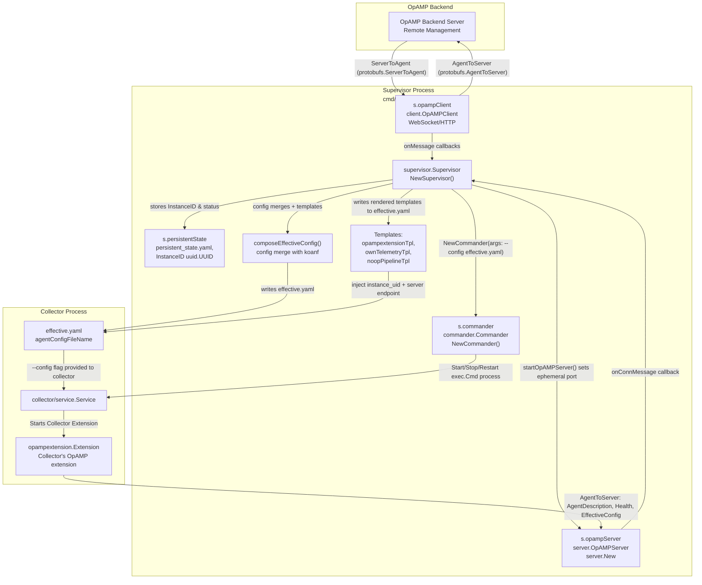
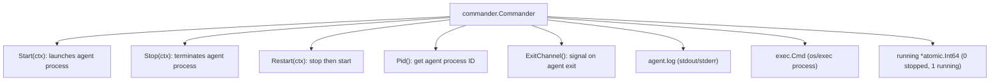
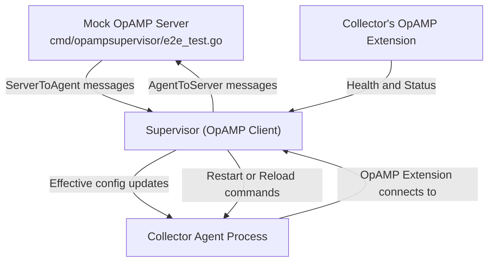
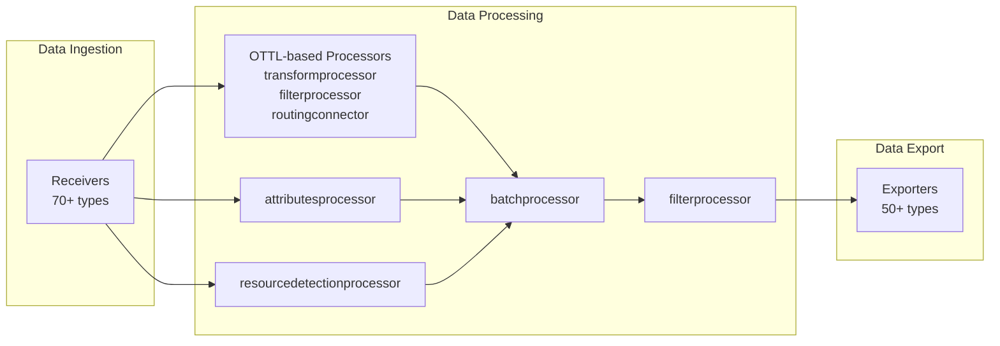
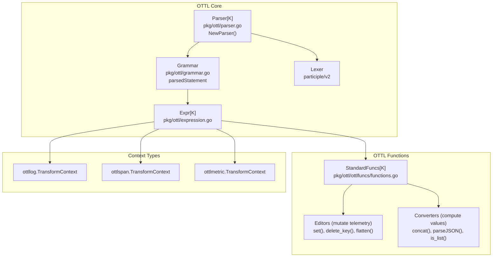
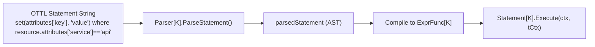
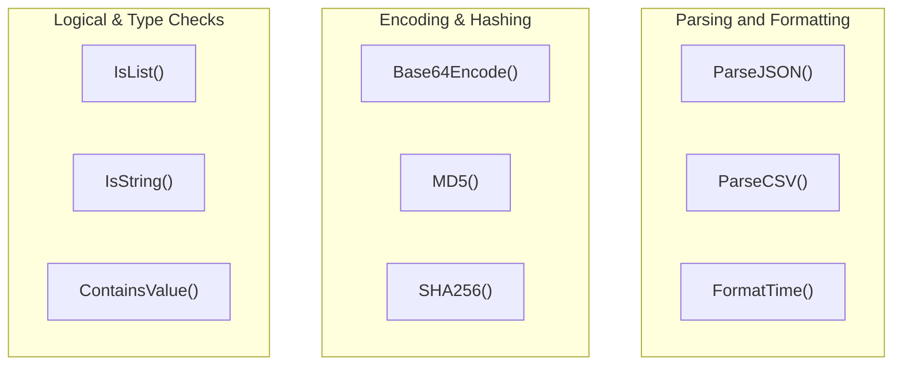

## Purpose and Scope

The OpAMP Supervisor is a standalone management process designed to control OpenTelemetry Collector instances by implementing the [OpAMP (Open Agent Management Protocol)](https://github.com/open-telemetry/opamp-spec) specification. It enables dynamic remote configuration, health monitoring, lifecycle management, and optional package installation/upgrades for Collector agent processes.

This page documents the Supervisor’s implementation in full technical detail: its configuration model, remote collector management, communication protocols, health reporting, remote configuration features, and practical deployment patterns. The Supervisor serves as a critical piece for operating large fleets of OpenTelemetry Collectors under unified remote control.

---

## Dual-Protocol Architecture

The Supervisor uniquely functions as both an OpAMP client and server, managing two communication directions:

- **OpAMP Client:** The Supervisor initiates and maintains a connection to a remote OpAMP backend server. Through this channel it receives remote configurations, control commands, and connection updates.

- **OpAMP Server:** The Supervisor hosts an ephemeral OpAMP server endpoint to which the local Collector’s OpAMP extension connects. It receives effective configuration reports, health data, component statuses, and custom messages from the Collector.

This dual protocol mode allows the Supervisor to coordinate between the backend management plane and the local telemetry agent.

### System Architecture and Code Entities



- The Supervisor’s OpAMP client (`s.opampClient`) connects to the remote backend over WebSocket or HTTP, implemented via the [opamp-go client library](https://github.com/open-telemetry/opamp-go) [supervisor.go:165-166]().
- The Supervisor opens an ephemeral OpAMP server (`s.opampServer`) listening locally for the Collector’s OpAMP extension [supervisor.go:183-185]().
- `opampextensionTpl` is a YAML template dynamically injected in the Collector agent’s config (`effective.yaml`) to configure the OpAMP extension with fields like the Supervisor server endpoint and persistent instance UID [supervisor.go:65-75]().
- The `commander.Commander` manages the Collector process lifecycle: executing, restarting, and termination [commander.go:28-35]().

**Sources:** [cmd/opampsupervisor/supervisor/supervisor.go:60-208](), [cmd/opampsupervisor/supervisor/commander/commander.go:28-35](), [cmd/opampsupervisor/specification/README.md:27-67]()

---

## Core Components

### `Supervisor` Struct

The main orchestrator in `cmd/opampsupervisor/supervisor/supervisor.go` consolidates all internal logic.

| Field | Type | Description |
|-|-|-|
| `opampClient` | `client.OpAMPClient` | Outgoing connection to remote OpAMP backend |
| `opampServer` | `server.OpAMPServer` | Incoming server endpoint for local Collector |
| `commander` | `*commander.Commander` | Manages Collector process lifecycle control |
| `persistentState` | `*persistentState` | Stores persistent supervisor state like Instance UID and configs |
| `effectiveConfig` | `*atomic.Value` | The composed effective YAML config passed to Collector |
| `remoteConfig` | `atomic.Pointer[protobufs.AgentRemoteConfig]` | Last received remote config from backend |
| `agentReady` | `atomic.Bool` | Flags if Agent has started and is healthy |

### `Commander` for Process Control

The `Commander` in `cmd/opampsupervisor/supervisor/commander/commander.go` handles the lifecycle:



- Starts Collector with current `effective.yaml` config; stops or restarts on demand.
- Logs Collector stdout/stderr to `agent.log` in storage directory.

**Sources:** [cmd/opampsupervisor/supervisor/commander/commander.go:28-200]()

---

## Configuration Management

### Configuration Merge Strategy

The Supervisor dynamically merges various config sources into the effective config for the agent:

1. **Local Config Files:** Supervisor config references local YAML files merged as baseline config.
2. **Remote Config:** Configuration pushed from the OpAMP backend if enabled via capability flags.
3. **Injected Templates:** This includes:
   - `opampextensionTpl`: Configuring the agent’s OpAMP extension with Supervisor’s ephemeral server endpoint and instance UID.
   - `ownTelemetryTpl`: Adds agent’s own telemetry reporting to Supervisor, if requested.

This merging is done via the [koanf](https://github.com/knadh/koanf) library in the function `composeEffectiveConfig` [supervisor.go:98-108]().

### Configuration Templates

Several internal YAML templates in Supervisor’s code base are embedded and rendered on demand:

| Template | Purpose | Code reference |
| --- | --- | --- |
| `nooppipeline.yaml` (`noopPipelineTpl`) | Minimal no-operation pipeline for collector bootstrap. | [supervisor.go:65-67]() |
| `opampextension.yaml` (`opampextensionTpl`) | Configuration snippet for Collector’s OpAMP extension. Injects Supervisor server endpoint, instance UID. | [supervisor.go:69-71]() |
| `owntelemetry.yaml` (`ownTelemetryTpl`) | Configures Supervisor’s own telemetry collection in agent if requested. | [supervisor.go:72-75]() |

The effective config is constructed by merging these templates with local and remote config, producing the file passed to the Collector’s `--config` flag.

**Sources:** [cmd/opampsupervisor/supervisor/supervisor.go:60-79](), [cmd/opampsupervisor/supervisor/config/config.go:100-180]()

---

## Supervisor Configuration Format

The Supervisor’s configuration schema is defined in `cmd/opampsupervisor/supervisor/config/config.go`.

| Section | Description | Key Fields |
|--|--|--|
| `Server` | Connects Supervisor to OpAMP backend | `Endpoint` (required URL), `TLS` config, optional `Auth` extension |
| `Agent` | Settings for managed Collector agent process | `Executable` (path to binary), timeouts, restart options |
| `Capabilities` | Protocol capabilities Supervisor supports | Flags for remote config acceptance, health reporting, telemetry, restart commands |
| `Storage` | Local directory to store persistent state and configs | `Directory` (path) |
| `HealthCheck` | HTTP health endpoint for Supervisor itself | `Endpoint` |

Capabilities are translated into `protobufs.AgentCapabilities` bitmask and communicated to the backend.

**Sources:** [cmd/opampsupervisor/supervisor/config/config.go:40-230]()

---

## Lifecycle Management

### Startup Sequencing

- **Bootstrap Mode:** Supervisor initially runs the Collector with a minimal noop pipeline (`nooppipeline.yaml`) during bootstrap to capture the Collector’s assigned instance UID. This UID is critical for ensuring Supervisor-agent identity alignment.
- **UID Validation:** After initial startup, Supervisor verifies that Collector’s reported instance UID matches Supervisor’s persisted UID. Mismatches cause errors to avoid managing the wrong instance.
- **Full Config Start:** Once remote configuration is received and merged, the Collector process is restarted with the full effective configuration (`effective.yaml`).

### Configuration Change Handling

- On receiving a `protobufs.AgentRemoteConfig` via the OpAMP client connection, Supervisor:
  - Stores the config persistently, sets the `remoteConfig` pointer and signals `hasNewConfig` to indicate new config availability.
  - Regenerates the full effective config YAML file to disk.
  - Triggers Collector process reload: either by sending `SIGHUP` (if `UseHUPConfigReload` is enabled) or by restarting the process.
- Health feedback from the Collector is used to verify that new configs are applied successfully within configured timeouts.

### Health Management

- The Collector’s internal OpAMP extension sends health statuses to the Supervisor’s OpAMP server endpoint.
- Supervisor keeps track of the latest health reported and can surface this status to the backend.
- Supervisor can be optionally configured to expose its own health HTTP endpoint for liveness/readiness.

**Sources:** [cmd/opampsupervisor/supervisor/supervisor.go:50-110](), [cmd/opampsupervisor/e2e_test.go:58-86]()

---

## Deployment Patterns

### Using the Supervisor

- The Supervisor runs as a standalone binary, managing one or more Collector agent processes.
- It requires a configuration file specifying:
  - The Collector executable path.
  - The remote backend OpAMP server endpoint.
  - Local storage directory for persistent state and generated config files.
  - Capabilities flags to control supported remote operations.
- Supervisor communicates securely over configured TLS WebSocket or HTTP.
- Collector’s own config includes the `opampextension` configured to connect back to Supervisor’s ephemeral server.

### Testing Infrastructure

The Supervisor is extensively tested using full end-to-end test setups:

- The `cmd/opampsupervisor/e2e_test.go` package implements a mock OpAMP backend server using an in-memory HTTP server with WebSocket support.
- Tests simulate connecting the Supervisor client, starting the Collector agent, and validating config updates and health reporting flows.
- Modes tested include process restart and SIGHUP configuration reloads where supported.
- Health check endpoint and logging are also tested.



**Sources:** [cmd/opampsupervisor/e2e_test.go:50-245]()

---

## Advanced Features

### Custom Messages Forwarding

- Custom OpAMP messages sent from the Collector to the Supervisor’s internal OpAMP server are buffered in `customMessageToServer` channel.
- These messages are forwarded by the Supervisor client to the remote backend transparently.
- This mechanism provides extension hooks for telemetry or control messages beyond standard OpAMP spec messages.

### OpAMP Connection Settings

- The OpAMP backend can send connection settings (e.g., TLS certificates, headers) dynamically to the Supervisor via a special OpAMP message.
- The Supervisor updates its client connection settings without requiring manual reconfiguration or restart.

**Sources:** [cmd/opampsupervisor/supervisor/supervisor.go:160-180](), [cmd/opampsupervisor/supervisor/config/config.go:108-180]()

---

# Summary

The OpAMP Supervisor is a complex orchestrator blending process management, dynamic configuration, live health monitoring, and rich protocol communication via OpAMP. It enables remote operators to flexibly manage OpenTelemetry Collectors at scale, leveraging the dual-role OpAMP protocol client/server design within a single process. Its architecture, code organization, and deployment modes form a robust foundation for agent fleet management with full lifecycle and health control.

---

# References and Sources

- cmd/opampsupervisor/supervisor/supervisor.go:[1-209]()
- cmd/opampsupervisor/supervisor/commander/commander.go:[1-200]()
- cmd/opampsupervisor/supervisor/config/config.go:[1-230]()
- cmd/opampsupervisor/e2e_test.go:[1-245]()
- cmd/opampsupervisor/specification/README.md:[27-67]()
- cmd/opampsupervisor/README.md:[1-142]()

# Data Processing and Transformation


This document provides an overview of the data processing and transformation capabilities in the OpenTelemetry Collector Contrib repository. It explains how telemetry data—traces, metrics, and logs—is manipulated as it flows through the collector pipeline. The primary focus is on the OpenTelemetry Transformation Language (OTTL), the processor pipeline architecture, and shared utility packages that enable advanced telemetry manipulation.

For detailed information on specific topics, see:
- [OTTL Transformation Language](#4.1)
- [Data Processing Pipeline Architecture](#4.2)
- [Shared Utility Packages](#4.3)

---

## Overview of Data Processing

Within the collector, telemetry data processing primarily occurs between ingestion by receivers and export by exporters. Processors serve as modular pipeline components designed to transform, filter, enrich, or aggregate telemetry data. The collector supports both native processing capabilities and user-configurable transformations using the OpenTelemetry Transformation Language (OTTL).



Processors like `transformprocessor` utilize OTTL for fine-grained telemetry modifications, while other processors handle attribute enrichment, batching, or filtering.

**Sources:** [pkg/ottl/ottlfuncs/README.md:1-32]()

---

## OTTL: The Transformation Language

The OpenTelemetry Transformation Language (OTTL) is a domain-specific language implemented in Go for declaratively manipulating telemetry using OpenTelemetry-native constructs. It operates on the Collector’s internal data model (`pdata`) and supports all signal types (traces, metrics, logs, profiles).

### Core Components and Code Entities

The OTTL system bridges human-readable transformation statements into executable code via:



- **Parser[K]**: Parses OTTL string statements and creates executable transformation statements parameterized by context K, representing telemetry type.
- **Grammar & Lexer**: Define the OTTL syntax using the `participle` library.
- **Expr[K]**: Represents executable function expressions.
- **StandardFuncs[K]**: Provides built-in editors and converters.
- **Context Types**: Provide signal-specific path resolution and data access.

**Sources:** [pkg/ottl/parser.go:76-82](), [pkg/ottl/expression.go:25-30](), [pkg/ottl/ottlfuncs/functions.go:11-31](), [pkg/ottl/ottlfuncs/README.md:3-4]()

---

### Parser Implementation and Statement Execution

The OTTL parser transforms statements of the form:

```
function_name(arguments) where condition
```

into executable functions. The `Statement[K]` type encapsulates a function and its optional execution condition.



The `Execute` method evaluates the condition; if true, the transformation function is applied to the telemetry context.

| Code Entity                         | Description                                                  | Location                    |
|-----------------------------------|--------------------------------------------------------------|-----------------------------|
| `Parser[K]`                      | The OTTL parser type parameterized by telemetry context       | `pkg/ottl/parser.go`         |
| `Statement[K]`                   | Holds compiled function and condition; executes transformation | `pkg/ottl/parser.go`         |
| `parsedStatement`                | AST representing the parsed function and condition            | `pkg/ottl/grammar.go`        |
| `Expr[K].Eval()`                 | Runtime invocation of transformation function                  | `pkg/ottl/expression.go`     |

**Sources:** [pkg/ottl/parser.go:22-56](), [pkg/ottl/parser.go:137-181]()

---

### OTTL Functions: Editors and Converters

OTTL bundles two main categories of functions:

- **Editors:** Functions that mutate telemetry data directly, e.g., modifying attributes, deleting keys, or flattening nested maps.
- **Converters:** Functions that compute and return values useful within expressions or as arguments to editors.

#### Editors

Editors have side effects and directly manipulate the underlying telemetry. Common editors include:

| Function Name      | Purpose                                    | Example                                          |
|--------------------|--------------------------------------------|-------------------------------------------------|
| `set()`            | Set a value at a path                       | `set(attributes["env"], "production")`          |
| `delete_key()`     | Remove a key from a map                      | `delete_key(attributes, "user.password")`       |
| `delete_matching_keys()` | Delete map keys matching regex pattern | `delete_matching_keys(resource.attributes, ".*password.*")` |
| `keep_matching_keys()`  | Retain map keys matching regex pattern  | `keep_matching_keys(log.attributes, "^http")`  |
| `flatten()`         | Flatten nested pcommon.Map to single level  | `flatten(log.attributes, prefix="app")`         |
| `append()`          | Append values to arrays                       | `append(log.attributes["tags"], "prod")`        |
| `truncate_all()`    | Truncate all strings in a map                 | `truncate_all(attributes, 4096)`                  |
| `limit()`           | Limit the number of map elements               | `limit(attributes, 100, [])`                       |

#### Converters

Converters are pure functions that compute data such as parsing JSON, base64 encoding, string manipulation, or checking types.



**Sources:** [pkg/ottl/ottlfuncs/README.md:36-63](), [pkg/ottl/ottlfuncs/functions.go:11-142]()

---

### Path Expressions and Contexts

OTTL uses **path expressions** to navigate telemetry data in a context-sensitive way. Paths correspond to hierarchical fields inside telemetry data such as resource attributes, span fields, or log attributes.

| Path Syntax              | Description                              | Examples                                    |
|--------------------------|----------------------------------------|---------------------------------------------|
| `resource.attributes`    | Resource-level attributes map           | `resource.attributes["host.name"]`          |
| `span.name`              | Span-level field                        | `span.name`                                 |
| `attributes["key"]`      | Generic attributes map                  | `attributes["http.status_code"]`            |

Paths resolve into `Getter[K]` and `Setter[K]` interfaces for runtime access and mutation.

| Code Entity            | Description                            | Location                      |
|------------------------|----------------------------------------|-------------------------------|
| `Path[K]`              | Interface representing a telemetry path | `pkg/ottl/functions.go:168-185`  |
| `basePath[K]`          | Implementation of `Path[K]`             | `pkg/ottl/functions.go:189-226`  |
| `GetSetter[K]`         | Getter and Setter combined interface    | `pkg/ottl/expression.go:49-54`     |

The path resolution is context-dependent, allowing signal-specific shape and access.

**Sources:** [pkg/ottl/functions.go:168-226](), [pkg/ottl/expression.go:37-54](), [processor/transformprocessor/README.md:57-62]()

---

## Processor Integration: The Transform Processor

The `transformprocessor` is the primary consumer of OTTL within the collector pipeline. It organizes sets of OTTL statements by telemetry signal type—traces, metrics, logs, and profiles—and executes them sequentially on incoming data.

```yaml
transform:
  error_mode: ignore
  trace_statements:
    - keep_keys(span.attributes, ["service.name"])
    - replace_pattern(span.attributes["http.url"], "password=.*", "password=***")
  log_statements:
    - delete_key(log.attributes, "authorization")
```

### Error Modes

Error handling during statement execution is configurable:

| error_mode | Behavior                                                 |
|------------|-----------------------------------------------------------|
| `ignore`   | Logs errors, continues to next statement (default).       |
| `silent`   | Ignores errors silently, continues.                       |
| `propagate`| Returns error up the pipeline, dropping current data.    |

This allows flexible control over robustness and failure tolerance.

**Sources:** [processor/transformprocessor/README.md:23-34](), [processor/transformprocessor/README.md:66-75]()

---

## Design Principles of OTTL Functions

To ensure safety, reliability, and security, built-in OTTL functions follow these design constraints:

- **No External I/O**: Functions must not perform file system, network, or other I/O operations.
- **Data Encapsulation**: Functions communicate solely through parameters and return values; no shared state or side effects beyond telemetry mutation.
- **Termination**: Functions must terminate reliably; infinite loops are prohibited.

These constraints apply to built-in functions, while user-defined functions may differ.

**Sources:** [pkg/ottl/ottlfuncs/README.md:11-22]()

---

## Summary and Further Reading

This section introduced the central role of data processing and transformation in the OpenTelemetry Collector Contrib repository, focusing on the OTTL language, processor architecture, and shared utility function packages.

Detailed documentation is available in these child pages:

- [OTTL Transformation Language](#4.1): Deep dive into OTTL grammar, syntax, functions, and parser implementation.
- [Data Processing Pipeline Architecture](#4.2): Explains processors, consumer interfaces, pdata transformations, and common patterns like batching and filtering.
- [Shared Utility Packages](#4.3): Documents public utility packages such as `pkg/stanza`, `pkg/sampling`, `pkg/pdatatest`, and internal filtering logic facilitating component development.

---