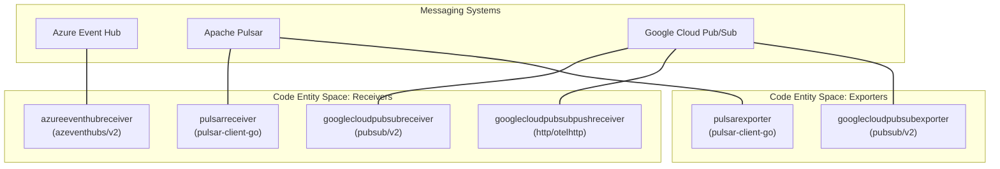
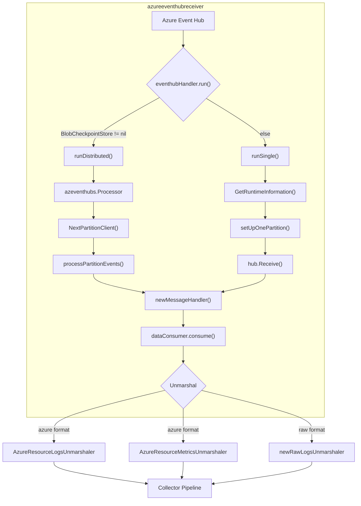
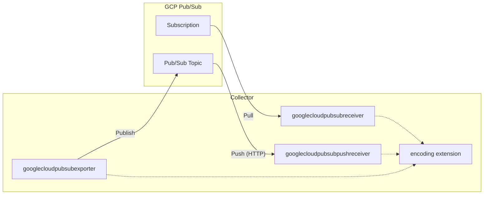
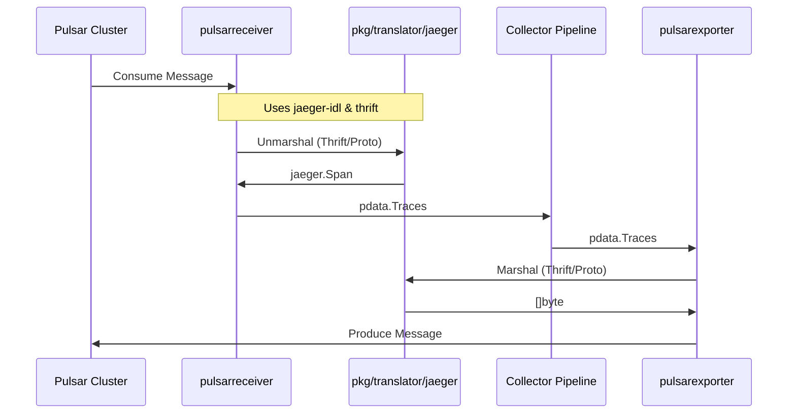

## Purpose and Scope

This document covers message queue system integrations in the `opentelemetry-collector-contrib` repository beyond Kafka, which is documented separately in [7.1 Kafka Integration Components](). The primary focus includes Apache Pulsar, Azure Event Hub, and Google Cloud Pub/Sub, detailing their receiver and exporter implementations, data flows, and configuration approaches. These components allow the collector to act as a bridge between cloud-native messaging infrastructure and OpenTelemetry-compatible observability backends.

For Kafka-specific components (receiver, exporter, metrics receiver, and topics observer), see [7.1 Kafka Integration Components](). For broader cloud provider integrations, see [8.1 Google Cloud Platform Components]() and [8.3 Multi-Cloud Export Support]().

## Message Queue Integration Architecture

The collector interacts with various messaging systems through specialized receivers and exporters. These components typically leverage the native client libraries of the respective messaging systems and often utilize the `pkg/translator` or `extension/encoding` frameworks to handle serialization and protocol conversion.

### Messaging System Code Entity Map
The following diagram bridges the messaging systems to their specific implementation factories and client dependencies within the codebase.

Sources:
- [receiver/azureeventhubreceiver/go.mod:7-12]()
- [receiver/pulsarreceiver/go.mod:6-9]()
- [exporter/pulsarexporter/go.mod:6-9]()
- [receiver/googlecloudpubsubreceiver/go.mod:6-7]()
- [exporter/googlecloudpubsubexporter/go.mod:6-8]()
- [receiver/googlecloudpubsubpushreceiver/go.mod:5-10]()

## Azure Event Hub Integration

The `azureeventhubreceiver` is designed to ingest high-scale streaming data from Azure Event Hubs. It supports ingesting Azure-specific formats like Azure Resource Logs and Metrics, as well as standard OTLP.

### Internal Implementation

The receiver implementation is centered around the `eventhubHandler` [receiver/azureeventhubreceiver/eventhubhandler.go:43](), which manages the lifecycle of the connection to Azure. It supports two primary modes of operation:
1. **Single Consumption**: Consuming from partitions directly. This mode can optionally use a `storage` extension for checkpoint persistence [receiver/azureeventhubreceiver/config.go:31-32]().
2. **Distributed Consumption**: Using the Azure SDK `Processor` [receiver/azureeventhubreceiver/eventhubhandler.go:113-117]() to coordinate partition ownership across multiple collector instances via Azure Blob Storage. This mode is enabled by configuring `blob_checkpoint_store` [receiver/azureeventhubreceiver/config.go:43]().

The `eventhubHandler.run` function [receiver/azureeventhubreceiver/eventhubhandler.go:58-64]() determines the consumption mode based on the configuration.

#### Azure Event Hub Receiver Data Flow

Sources:
- [receiver/azureeventhubreceiver/eventhubhandler.go:58-142]()
- [receiver/azureeventhubreceiver/config.go:105-131]()

### Configuration and Persistence

The receiver can be configured via a connection string [receiver/azureeventhubreceiver/README.md:88-93]() or using the `auth` field for service principal/managed identity authentication [receiver/azureeventhubreceiver/README.md:99-115](). Checkpointing is managed via a `persister` [receiver/azureeventhubreceiver/persister.go:23-28]() which can interface with collector storage extensions [receiver/azureeventhubreceiver/README.md:117-122]().

The `Config` struct [receiver/azureeventhubreceiver/config.go:27-57]() defines the various configuration options. The `Validate` method [receiver/azureeventhubreceiver/config.go:88-134]() ensures that the configuration is valid, checking for mutually exclusive options like `blob_checkpoint_store` with `partition`, `offset`, or `storage`.

Sources:
- [receiver/azureeventhubreceiver/config.go:27-134]()
- [receiver/azureeventhubreceiver/README.md:34-82]()

## Google Cloud Pub/Sub Integration

Google Cloud Pub/Sub components provide scalable messaging for OTLP data, leveraging the `cloud.google.com/go/pubsub/v2` library [receiver/googlecloudpubsubreceiver/go.mod:6]().

### Component Architecture

The Pub/Sub integration consists of three main components:
1. **googlecloudpubsubreceiver**: A pull-based receiver that subscribes to topics [receiver/googlecloudpubsubreceiver/go.mod:1-10]().
2. **googlecloudpubsubpushreceiver**: A push-based receiver that acts as an HTTP endpoint for Pub/Sub push subscriptions [receiver/googlecloudpubsubpushreceiver/go.mod:1-10]().
3. **googlecloudpubsubexporter**: An exporter that publishes OTLP data to Pub/Sub topics [exporter/googlecloudpubsubexporter/go.mod:1-10]().

These components utilize the `extension/encoding` framework [receiver/googlecloudpubsubreceiver/go.mod:8]() to handle different payload formats (e.g., OTLP Proto, OTLP JSON).

### Google Cloud Pub/Sub Data Flow
The following diagram illustrates the interaction between the Collector and GCP Pub/Sub using the pull and push mechanisms.

Sources:
- [receiver/googlecloudpubsubreceiver/go.mod:6-8]()
- [exporter/googlecloudpubsubexporter/go.mod:6-9]()
- [receiver/googlecloudpubsubpushreceiver/go.mod:5-10]()

## Apache Pulsar Integration

Apache Pulsar components provide high-throughput messaging integration using the `pulsar-client-go` library [exporter/pulsarexporter/go.mod:6]().

### Receiver and Exporter Capabilities

The Pulsar integration supports various legacy formats alongside OTLP:
- **Pulsar Receiver**: Can decode Jaeger Proto/Thrift and Zipkin JSON/Thrift messages from Pulsar topics [exporter/pulsarexporter/go.mod:8-11]().
- **Pulsar Exporter**: Can encode OTLP traces into Jaeger format for downstream Pulsar consumers [exporter/pulsarexporter/go.mod:9-11]().

### Pulsar Translation Flow
The following sequence shows how Pulsar components handle translation using the `pkg/translator/jaeger` module.

Sources:
- [exporter/pulsarexporter/go.mod:6-11]()
- [pkg/translator/jaeger/go.mod:1-10]()

## Summary of Integration Components

| System | Receiver Module | Exporter Module | Key Code Entities |
|--------|-----------------|-----------------|-------------------|
| **Azure Event Hub** | `azureeventhubreceiver` | N/A | `eventhubHandler` [receiver/azureeventhubreceiver/eventhubhandler.go:43](), `Config` [receiver/azureeventhubreceiver/config.go:27]() |
| **Apache Pulsar** | `pulsarreceiver` | `pulsarexporter` | `pulsar-client-go` [exporter/pulsarexporter/go.mod:6](), `jaeger-idl` [exporter/pulsarexporter/go.mod:9]() |
| **GCP Pub/Sub** | `googlecloudpubsubreceiver` | `googlecloudpubsubexporter` | `pubsub/v2` [receiver/googlecloudpubsubreceiver/go.mod:6](), `encoding extension` [exporter/googlecloudpubsubexporter/go.mod:9]() |

Sources:
- [receiver/azureeventhubreceiver/go.mod:1-12]()
- [exporter/pulsarexporter/go.mod:1-15]()
- [receiver/googlecloudpubsubreceiver/go.mod:1-10]()
- [exporter/googlecloudpubsubexporter/go.mod:1-10]()