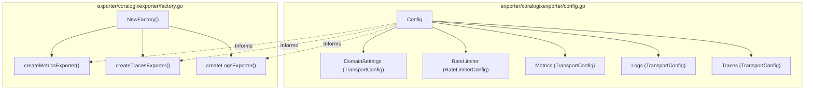
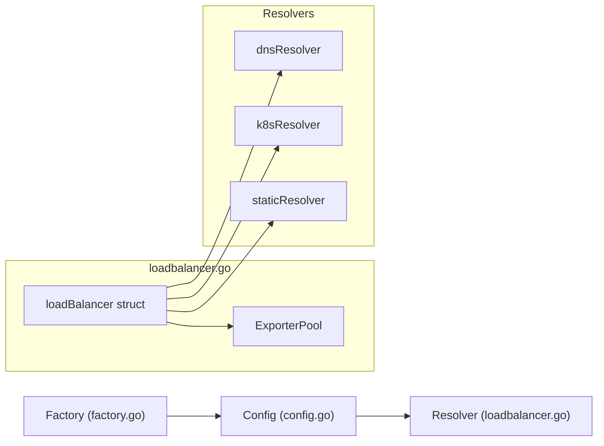

This section documents exporters for major observability platforms beyond Datadog and Elasticsearch. These components enable the OpenTelemetry Collector to interface with SaaS vendors like Splunk (SignalFx), Coralogix, and Sumo Logic, while also providing infrastructure for scaling the collector itself via load balancing and high-performance transport using OTel Arrow.

## 1. Coralogix Exporter

The `coralogixexporter` supports traces, metrics, logs, and profiles. It is designed to work with both gRPC and HTTP transport protocols `[exporter/coralogixexporter/README.md:36-37]()`.

### Implementation Details
The exporter utilizes a `TransportConfig` `[exporter/coralogixexporter/config.go:34-45]()` to manage connection settings for different signals independently.

*   **Multi-Signal Support**: It can route different signals (logs, metrics, traces) to specific endpoints or a unified domain using the `domain` setting `[exporter/coralogixexporter/README.md:132-137]()`.
*   **Dynamic Metadata**: Supports mapping OTLP resource attributes to Coralogix-specific `application_name` and `subsystem_name` via `application_name_attributes` and `subsystem_name_attributes` `[exporter/coralogixexporter/README.md:43-46]()`.
*   **Rate Limiting**: Includes a `RateLimiterConfig` to prevent data bursts from overwhelming the backend `[exporter/coralogixexporter/config_test.go:89-93]()`.
*   **Transport Flexibility**: Supports gRPC (default) and HTTP with protobuf encoding. Note that the `profiles` signal is only supported via gRPC `[exporter/coralogixexporter/README.md:102-102]()`.

### Configuration Mapping
The diagram below shows how the `Config` struct coordinates different transport clients and the factory initialization.

**Diagram: Coralogix Configuration to Client Mapping**

Sources: `[exporter/coralogixexporter/config.go:68-116]()`, `[exporter/coralogixexporter/factory.go:21-45]()`, `[exporter/coralogixexporter/config_test.go:42-95]()`.

---

## 2. Sumo Logic Exporter

The `sumologicexporter` is undergoing an architectural transition to align with standard OTLP practices, moving away from legacy formats like Carbon2 or Graphite `[exporter/sumologicexporter/README.md:18-24]()`.

### Key Features
*   **Format Support**: Supports `otlp`, `json`, and `text` for logs; `otlp` and `prometheus` for metrics `[exporter/sumologicexporter/README.md:88-95]()`.
*   **Histogram Decomposition**: The `decompose_otlp_histograms` option allows converting OTLP Histograms into individual metrics for backends that do not natively support them `[exporter/sumologicexporter/README.md:97-101]()`.
*   **Resource Mapping**: Recommends using the `transformprocessor` (OTTL) to map resource attributes to Sumo Logic metadata fields like `_sourceCategory` `[exporter/sumologicexporter/README.md:49-67]()`.

### Data Export Logic
The `sender` component handles the HTTP POST requests to the Sumo Logic endpoint, managing compression (gzip, deflate, zstd) and sticky sessions `[exporter/sumologicexporter/README.md:82-116]()`.

**Sources:** `[exporter/sumologicexporter/README.md:1-120]()`, `[exporter/sumologicexporter/config.go:1-50]()`.

---

## 3. Load Balancing Exporter

The `loadbalancingexporter` (configured as `load_balancing`) is a specialized exporter used for scaling Collector deployments. It distributes data across multiple backend collectors based on a routing key `[exporter/loadbalancingexporter/README.md:19-22]()`.

### Routing Mechanisms
It ensures that related data reaches the same backend collector, which is essential for tail-based sampling and red-metrics-collectors `[exporter/loadbalancingexporter/README.md:39-41]()`.

| Routing Key | Applicable Signals | Default For |
| :--- | :--- | :--- |
| `traceID` | Spans, Logs | Traces `[exporter/loadbalancingexporter/README.md:35-35]()` |
| `service` | Spans, Logs, Metrics | Logs, Metrics `[exporter/loadbalancingexporter/README.md:35-35]()` |
| `metric` | Metrics | - `[exporter/loadbalancingexporter/README.md:31-31]()` |
| `resource` | Logs, Metrics | - `[exporter/loadbalancingexporter/README.md:30-30]()` |
| `streamID` | Metrics | - `[exporter/loadbalancingexporter/README.md:32-32]()` |
| `attributes` | Spans, Logs, Metrics | - `[exporter/loadbalancingexporter/README.md:33-33]()` |

### Component Architecture
The exporter creates one `otlp` exporter per endpoint discovered via its resolver (Static, DNS, or K8s) `[exporter/loadbalancingexporter/README.md:55-56]()`.

**Diagram: Load Balancer Code Entity Space**

### Key Implementation Entities
*   **`loadBalancer`**: The core struct managing the pool of exporters and the resolver `[exporter/loadbalancingexporter/loadbalancer.go:1-50]()`.
*   **`metricExporterImp`**: Handles metric-specific splitting and routing `[exporter/loadbalancingexporter/metrics_exporter.go:57-100]()`.
*   **`traceExporterImp`**: Handles trace-specific routing based on TraceID or Service Name `[exporter/loadbalancingexporter/trace_exporter.go:1-30]()`.

**Sources:** `[exporter/loadbalancingexporter/README.md:19-75]()`, `[exporter/loadbalancingexporter/metrics_exporter_test.go:57-100]()`, `[exporter/loadbalancingexporter/loadbalancer.go:1-50]()`.

---

## 4. OTel Arrow Exporter & Receiver

The OTel Arrow components provide a high-performance transport mechanism using Apache Arrow's columnar format to reduce bandwidth and CPU usage.

### Implementation Organization
The OTel Arrow implementation is split across several modules to manage the complex dependency on the Arrow libraries:
1.  **`exporter/otelarrowexporter`**: The exporter component that encodes OTLP into Arrow streams `[exporter/otelarrowexporter/go.mod:1-8]()`.
2.  **`receiver/otelarrowreceiver`**: The receiver component that decodes Arrow streams back into OTLP `[receiver/otelarrowreceiver/go.mod:1-9]()`.
3.  **`internal/otelarrow`**: Shared internal utilities for compression and common gRPC handling between the exporter and receiver `[internal/otelarrow/go.mod:1-9]()`.

### Columnar Transport Flow
1.  **Encoding**: The exporter uses the `otel-arrow` Go library to convert `pdata` structures into Arrow record batches `[exporter/otelarrowexporter/go.mod:8-8]()`.
2.  **Stream**: Data is sent over a gRPC stream to maintain state and optimize compression dictionaries `[exporter/otelarrowexporter/go.mod:38-38]()`.
3.  **Decoding**: The receiver reconstructs the original OTLP data for the collector pipeline `[receiver/otelarrowreceiver/go.mod:27-28]()`.

**Sources:** `[exporter/otelarrowexporter/go.mod:1-15]()`, `[receiver/otelarrowreceiver/go.mod:1-15]()`, `[internal/otelarrow/go.mod:1-15]()`.

---

## 5. SignalFx Exporter (Splunk Observability)

The `signalfxexporter` transforms OpenTelemetry metrics, events, and trace correlation into SignalFx-compatible formats.

### Architecture and Data Flow
The exporter manages the translation of OTLP signals into SignalFx Protobuf messages.

*   **Metric Translation**: Mapping rules are defined in `internal/translation/default_translation_rules.yaml` to ensure OTel metrics match SignalFx conventions `[exporter/signalfxexporter/README.md:88-90]()`.
*   **Metadata Management**: Includes a dimension client for managing properties and tags associated with SignalFx dimensions, primarily supporting updates from the `k8s_cluster` receiver `[exporter/signalfxexporter/README.md:23-26]()`.
*   **Configuration**: Requires an `access_token` and either a `realm` or specific `api_url` and `ingest_url` `[exporter/signalfxexporter/README.md:32-37]()`.

### Deprecation Note
Traces functionality in the `signalfxexporter` is currently **deprecated** (as of May 2026) as trace correlation is now supported natively via OTLP `[exporter/signalfxexporter/README.md:5-8]()`.

**Sources:** `[exporter/signalfxexporter/README.md:1-90]()`, `[exporter/signalfxexporter/config.go:1-50]()`.