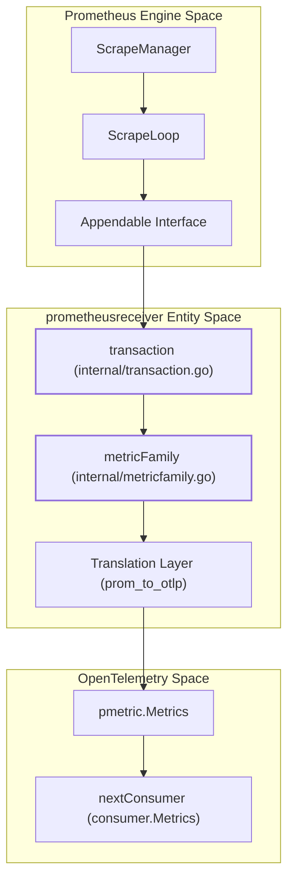
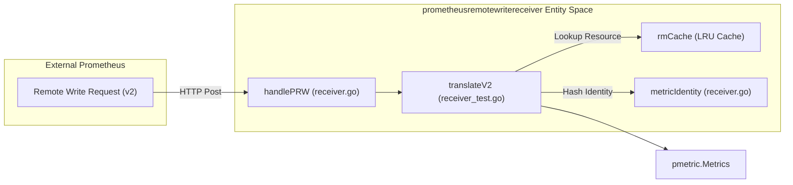
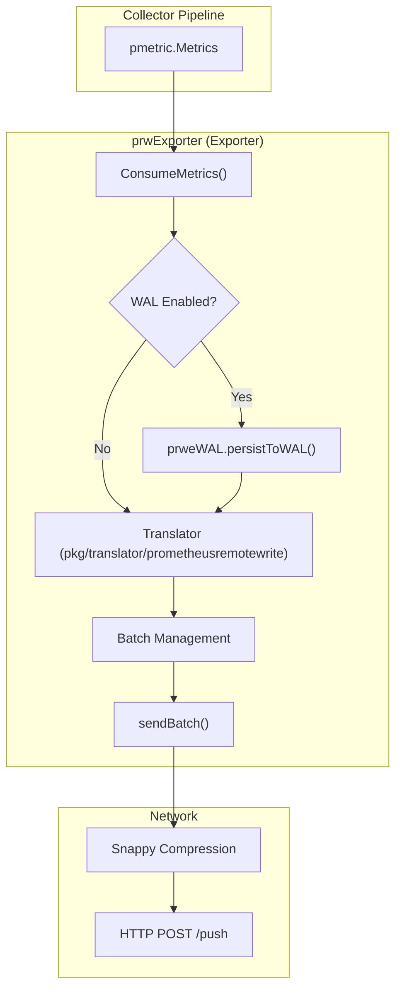
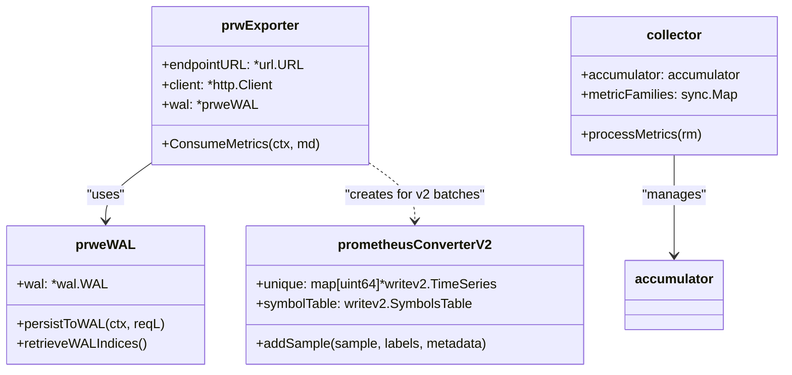
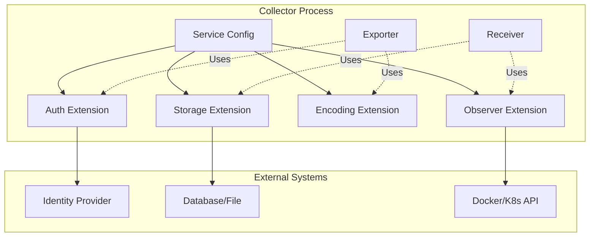
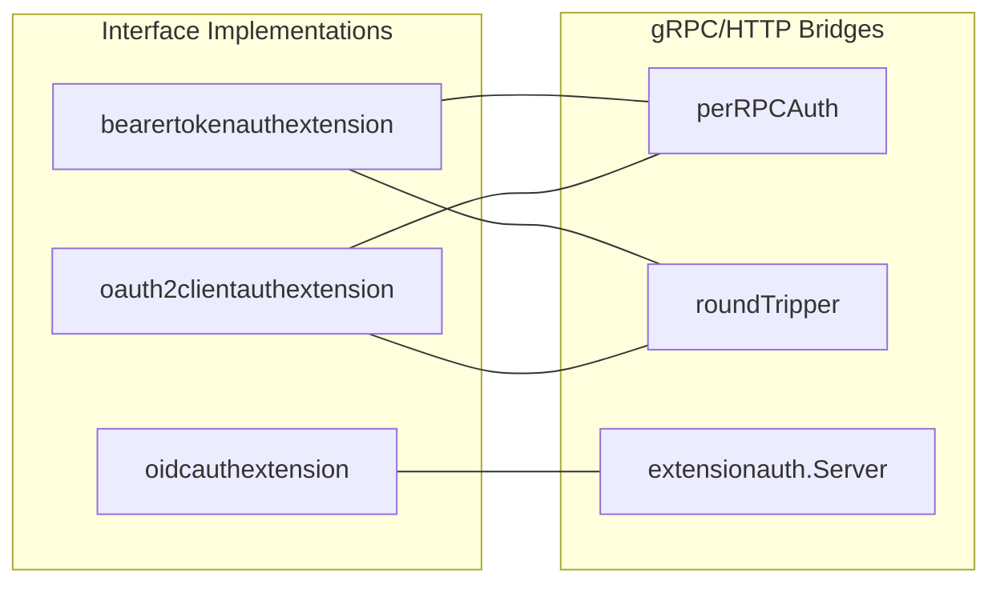
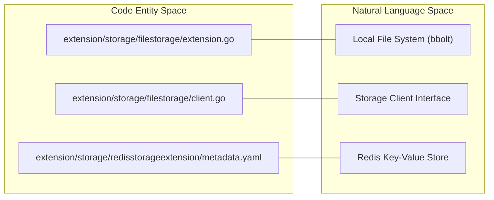

The `prometheusreceiver` is a comprehensive implementation within the OpenTelemetry Collector Contrib repository that allows the collector to act as a fully functional Prometheus scraper. It leverages Prometheus's own scraping engine while providing a high-performance translation layer to convert Prometheus metric families into OpenTelemetry `pmetric.Metrics` [receiver/prometheusreceiver/go.mod:21-22]().

## Architecture and Data Flow

The receiver operates by wrapping the Prometheus scrape manager [receiver/prometheusreceiver/README.md:46-47](). It intercepts scraped samples through a custom storage implementation and translates them into OTLP format before passing them to the next consumer in the pipeline.

### Component Relationship Diagram

This diagram shows how the `prometheusreceiver` integrates Prometheus internal components with the OpenTelemetry Collector's consumer pipeline.


Sources: [receiver/prometheusreceiver/internal/transaction.go:25-45](), [receiver/prometheusreceiver/internal/metricfamily.go:28-40](), [receiver/prometheusreceiver/metrics_receiver.go:30-60]()

## Key Implementation Details

### Target Allocator Integration
The receiver supports integration with the Prometheus Target Allocator, which is commonly used in Kubernetes environments to distribute scrape targets across multiple collector instances [receiver/prometheusreceiver/testdata/config_target_allocator.yaml:1-10](). The `target_allocator` configuration block allows specifying the client configuration to fetch dynamically assigned scrape targets [receiver/prometheusreceiver/README.md:106]().

### Transaction Handling
The core of the scraping logic resides in the `transaction` struct [receiver/prometheusreceiver/internal/transaction.go:25-45](). When Prometheus performs a scrape, it opens a transaction via the `Appender` interface. The `prometheusreceiver` implements this interface to group samples by their metric family.

1.  **Append**: Samples are received and buffered via `Append()` or `AppendExemplar()` calls [receiver/prometheusreceiver/internal/transaction.go:68-80]().
2.  **Commit**: Once the scrape is complete, `Commit()` is called [receiver/prometheusreceiver/internal/transaction.go:138-145]().
3.  **Processing**: The buffered samples are passed to the `metricFamily` processor to be grouped by name and type.
4.  **Translation**: Samples are converted to OTLP metrics using the `metricFamily` logic [receiver/prometheusreceiver/internal/metricfamily.go:100-120]().
5.  **Consumption**: Metrics are sent to the `nextConsumer` [receiver/prometheusreceiver/internal/transaction.go:150-160]().

### Staleness Handling
Prometheus uses a special "staleness marker" (a NaN value with a specific bit pattern) to indicate that a series has disappeared [receiver/prometheusremotewritereceiver/receiver.go:21](). The `prometheusreceiver` handles staleness by tracking active series and marking them as stale if they are no longer present in a scrape [receiver/prometheusreceiver/internal/transaction.go:100-105]().

## Metric Family Processing and Translation

The translation from Prometheus to OTLP is complex due to the differences in data models. This is handled by the `internal/metricfamily.go` package and the shared `pkg/translator/prometheus` package [receiver/prometheusreceiver/go.mod:17]().

| Prometheus Concept | OTLP Mapping | Implementation Detail |
| :--- | :--- | :--- |
| **Gauge** | Gauge | Direct mapping of value and timestamp. |
| **Counter** | Sum (Monotonic) | `_total` suffix is handled; start timestamps are tracked. |
| **Histogram** | Histogram | Buckets and sum/count are aggregated into OTLP Histogram points. |
| **Summary** | Summary | Quantiles are mapped to OTLP Summary value at quantiles. |
| **Labels** | Attributes | `__name__` and `job`/`instance` are treated specially. |

Sources: [receiver/prometheusreceiver/internal/metricfamily.go:50-150](), [pkg/translator/prometheus/constants.go:1-30]()

### Label Handling and Metadata
The receiver processes Prometheus labels into OTLP attributes. It specifically handles:
*   **Job/Instance**: Often mapped to resource attributes depending on configuration [receiver/prometheusreceiver/metrics_receiver_labels_test.go:1-50]().
*   **Metric Relabeling**: The `metric_relabel_configs` option allows filtering and modifying metrics based on their labels before ingestion [receiver/prometheusreceiver/README.md:95-98]().
*   **Trimming Metric Suffixes**: The `trim_metric_suffixes` option (experimental) removes common Prometheus suffixes like `_total` or `_seconds` to align metric names closer to OpenTelemetry conventions [receiver/prometheusreceiver/README.md:107]().

## Prometheus Remote Write Receiver

While the `prometheusreceiver` pulls metrics via scraping, the `prometheusremotewritereceiver` allows the collector to receive metrics pushed from other Prometheus servers using the Remote Write protocol [receiver/prometheusremotewritereceiver/receiver.go:59]().

### Remote Write Translation Flow


Sources: [receiver/prometheusremotewritereceiver/receiver.go:177-205](), [receiver/prometheusremotewritereceiver/receiver_test.go:193-204]()

### Implementation of PRW v2
The receiver supports Prometheus Remote Write v2, which includes metadata and symbolized strings for better efficiency [receiver/prometheusremotewritereceiver/receiver.go:22-23]().
*   **Identity Hashing**: Uses `metricIdentity` to uniquely identify metrics based on `Scope`, `MetricName`, `Unit`, and `Type` [receiver/prometheusremotewritereceiver/receiver.go:95-101](). The `Hash()` function incorporates scope hashing as a foundation, extended with scope and metric fields [receiver/prometheusremotewritereceiver/receiver.go:122-132]().
*   **LRU Caching**: Employs an LRU cache (`rmCache`) to store `pmetric.ResourceMetrics` objects, reducing allocation overhead during high-volume ingestion [receiver/prometheusremotewritereceiver/receiver.go:41-49]().
*   **Scope Handling**: Supports OTel instrumentation scope fields extracted from `otel_scope_*` labels via the `scopeInfo` struct [receiver/prometheusremotewritereceiver/receiver.go:74-79]().

## Configuration Example

The following configuration demonstrates a standard scrape job with multiple targets and a custom scrape interval.

```yaml
receivers:
  prometheus:
    config:
      scrape_configs:
        - job_name: 'otel-collector'
          scrape_interval: 10s
          static_configs:
            - targets: ['localhost:8888']
```
Sources: [receiver/prometheusreceiver/README.md:121-127]()

# Prometheus Remote Write Exporter and Translators


The Prometheus ecosystem integration in the OpenTelemetry Collector Contrib repository provides high-fidelity metrics interoperability between OTLP and Prometheus. This is achieved through the `prometheusremotewriteexporter` for pushing data to Prometheus-compatible backends, the `pkg/translator/prometheusremotewrite` library for data conversion, and the `prometheusexporter` for exposing metrics for scraping.

## 1. Prometheus Remote Write Exporter

The `prometheusremotewriteexporter` converts OTLP metrics into Prometheus TimeSeries and sends them to a remote write endpoint using Snappy-compressed Protobuf over HTTP [exporter/prometheusremotewriteexporter/exporter.go:125-126]().

### 1.1 Architecture and Data Flow
The exporter handles the lifecycle of metric data from OTLP `pmetric.Metrics` to the network wire. It supports both Prometheus Remote Write v1 and v2 protocols [exporter/prometheusremotewriteexporter/exporter.go:141]().

#### Exporter Component Structure
- **`prwExporter`**: The main struct managing the HTTP client, concurrency, and optional WAL [exporter/prometheusremotewriteexporter/exporter.go:126-147]().
- **`buffer`**: A struct containing `protobuf` and `snappy` byte slices, used by `bufferPool` to minimize allocations during Protobuf marshaling and Snappy compression [exporter/prometheusremotewriteexporter/exporter.go:88-91]().
- **`bufferPool`**: A `sync.Pool` of reusable `buffer` objects to minimize allocations during Protobuf marshaling and Snappy compression [exporter/prometheusremotewriteexporter/exporter.go:115-123]().
- **Concurrency Management**: Uses a `batchStatePool` to provide each goroutine with its own state, avoiding contention when multiple workers handle metric batches concurrently [exporter/prometheusremotewriteexporter/exporter.go:143-146]().

#### Data Flow Diagram: OTLP to Prometheus Remote Write

*Sources: [exporter/prometheusremotewriteexporter/exporter.go:125-147](), [exporter/prometheusremotewriteexporter/exporter.go:202-231]()*

### 1.2 Write-Ahead Log (WAL) Support
The exporter includes an optional WAL implementation using the `github.com/tidwall/wal` library to provide durability against crashes or network outages [exporter/prometheusremotewriteexporter/go.mod:18]().

- **Persistence**: Requests are written to the WAL via `persistToWAL` before being acknowledged to the collector pipeline [exporter/prometheusremotewriteexporter/wal_test.go:157]().
- **Indices**: The exporter tracks `FirstIndex` and `LastIndex` to manage replay and truncation [exporter/prometheusremotewriteexporter/wal_test.go:162-166]().
- **Truncation**: The WAL is configured with a `TruncateFrequency` and `BufferSize` to prune old entries from the disk [exporter/prometheusremotewriteexporter/wal_test.go:100-104]().
- **Telemetry**: The WAL records several metrics including `wal_bytes_written`, `wal_lag`, and `wal_write_latency` [exporter/prometheusremotewriteexporter/metadata.yaml:83-129]().

*Sources: [exporter/prometheusremotewriteexporter/wal_test.go:119-179](), [exporter/prometheusremotewriteexporter/metadata.yaml:75-145]()*

## 2. Prometheus Remote Write Translator

The `pkg/translator/prometheusremotewrite` package is the core engine for OTLP-to-Prometheus conversion. It is shared across components to ensure consistent mapping of complex OTLP types.

### 2.1 Label and Signature Management
Prometheus requires a unique set of labels for every TimeSeries. The translator implements:
- **Sanitization**: Metric and label names are sanitized to comply with Prometheus naming conventions via `labelNamer.Build` [pkg/translator/prometheusremotewrite/helper.go:149-152]().
- **Signature Calculation**: The `timeSeriesSignature` function uses `xxhash.Sum64` to create a stable hash of sorted labels, identifying unique TimeSeries [pkg/translator/prometheusremotewrite/helper.go:69-94]().
- **Resource Mapping**: OTLP `service.name` and `service.namespace` are mapped to the Prometheus `job` label, while `service.instance.id` maps to `instance` [pkg/translator/prometheusremotewrite/helper.go:163-179]().

### 2.2 Translation Implementation (v1 and v2)
The translator handles specific OTLP metric types through specialized converters:
- **`FromMetricsV2`**: Converts OTLP to Prometheus Remote Write 2.0 format, supporting native histograms and metadata [pkg/translator/prometheusremotewrite/metrics_to_prw_v2.go:23-33]().
- **`prometheusConverterV2`**: Manages a `SymbolsTable` and handles conflicts where different labels might generate the same signature [pkg/translator/prometheusremotewrite/metrics_to_prw_v2.go:36-48]().
- **Aggregation Temporality**: Only Cumulative temporality is supported; Delta metrics are dropped [pkg/translator/prometheusremotewrite/helper_test.go:26-107]().

| OTLP Type | Prometheus Equivalent | Suffixes / Labels |
| :--- | :--- | :--- |
| Gauge | Gauge | None |
| Sum (Cumulative) | Counter | None |
| Histogram | Histogram | `_bucket` (label `le`), `_count`, `_sum` [pkg/translator/prometheusremotewrite/helper.go:31-35]() |
| Summary | Summary | `_sum`, `_count`, (label `quantile`) [pkg/translator/prometheusremotewrite/helper.go:32-36]() |

*Sources: [pkg/translator/prometheusremotewrite/helper.go:69-94](), [pkg/translator/prometheusremotewrite/metrics_to_prw_v2.go:108-146](), [pkg/translator/prometheusremotewrite/helper_test.go:80-99]()*

## 3. Prometheus Exporter (Scrape Endpoint)

The `prometheusexporter` serves metrics via an HTTP endpoint for scraping by a Prometheus server. Unlike the remote write exporter which pushes data, this component accumulates data and waits for a scrape request.

### 3.1 Collector and Accumulator
The exporter uses a `collector` struct that implements the `prometheus.Collector` interface [exporter/prometheusexporter/collector.go:32-45]().

- **`accumulator`**: Stores the latest state of metrics received via `ConsumeMetrics`. It handles metric expiration via `metricExpiration` to prevent stale data from being served [exporter/prometheusexporter/collector.go:56-61]().
- **`metricNamer` & `labelNamer`**: Configurable components that determine how OTLP names are translated to Prometheus names, supporting various strategies like `underscoreEscapingWithSuffixes` or `noUTF8EscapingWithSuffixes` [exporter/prometheusexporter/collector.go:85-101]().

### 3.2 Conversion Logic
The exporter performs dynamic conversion:
1. **Accumulate**: OTLP `ResourceMetrics` are stored in the `accumulator` [exporter/prometheusexporter/collector.go:173-175]().
2. **Exemplars**: OTLP exemplars are converted to `prometheus.Exemplar`, with `trace_id` and `span_id` converted to hex strings [exporter/prometheusexporter/collector.go:133-164]().
3. **Convert**: Each metric is converted using type-specific functions such as `convertGauge`, `convertSum`, or `convertDoubleHistogram` [exporter/prometheusexporter/collector.go:179-191]().

#### Entity Mapping Diagram

*Sources: [exporter/prometheusremotewriteexporter/exporter.go:126-147](), [pkg/translator/prometheusremotewrite/metrics_to_prw_v2.go:36-48](), [exporter/prometheusexporter/collector.go:32-45]()*

## 4. Configuration and Protocols

### 4.1 Protocol Versions
The system supports multiple versions of the Remote Write protocol:
- **Remote Write v1**: The standard Snappy-compressed Protobuf format using `prompb.WriteRequest` [exporter/prometheusremotewriteexporter/exporter.go:141]().
- **Remote Write v2**: An optimized version using `io.prometheus.write.v2.Request`. It includes support for native histograms and always sends metadata [pkg/translator/prometheusremotewrite/metrics_to_prw_v2.go:23-33]().

### 4.2 Feature Gates and Telemetry
The exporter behavior is controlled by several feature gates defined in `metadata.yaml`:
- **`exporter.prometheusremotewritexporter.EnableMultipleWorkers`**: Spawns multiple goroutines to handle metric batches concurrently [exporter/prometheusremotewriteexporter/metadata.yaml:14-19]().
- **`exporter.prometheusremotewritexporter.enableSendingRW2`**: Enables support for the Remote Write 2.0 protocol [exporter/prometheusremotewriteexporter/metadata.yaml:26-31]().
- **Telemetry**: The exporter reports metrics on sent batches, failed translations, and written samples/histograms/exemplars via the `prwTelemetry` interface [exporter/prometheusremotewriteexporter/exporter.go:40-48]().

*Sources: [exporter/prometheusremotewriteexporter/metadata.yaml:13-32](), [exporter/prometheusremotewriteexporter/exporter.go:55-81](), [pkg/translator/prometheusremotewrite/metrics_to_prw_v2.go:13-16]()*

# Extensions and Cross-Cutting Concerns


Extensions in the OpenTelemetry Collector Contrib repository provide capabilities that are not directly involved in the telemetry data processing pipeline (receivers, processors, exporters) but offer essential cross-cutting functionality. These include authentication mechanisms, persistent storage for component state, data encoding/decoding logic, and discovery mechanisms via the observer pattern.

### Architecture Overview

Extensions are standalone components that can be referenced by other components in the collector configuration. They often implement specific interfaces defined in the core collector to provide services like credential management or state persistence.

The following diagram illustrates how various extension types interact with the collector's core components:

**Extension Integration Pattern**

Sources: [extension/storage/filestorage/extension.go:24-30](), [extension/bearertokenauthextension/bearertokenauth.go:43-48]()

---

## Authentication Extensions

Authentication extensions handle the complexity of securing communications between the collector and external systems. They are primarily used by exporters to authenticate outgoing requests and by receivers to validate incoming telemetry.

Available implementations include:
*   **Bearer Token**: Provides a gRPC `credentials.PerRPCCredentials` implementation and an HTTP `RoundTripper` to inject authorization headers [extension/bearertokenauthextension/bearertokenauth.go:28-36](). It supports reading tokens from files with automatic refresh monitoring via `credentialsfile.ValueResolver` [extension/bearertokenauthextension/bearertokenauth.go:85-104]().
*   **OAuth2 Client**: Implements OAuth2 client credentials and JWT bearer grant types [extension/oauth2clientauthextension/extension.go:70-81](). It manages token lifecycle including caching and refreshing based on an `expiry_buffer` [extension/oauth2clientauthextension/extension.go:125-148]().
*   **OIDC**: Provides OpenID Connect server-side authentication, supporting multiple providers and hot-reloading of JWKS files [extension/oidcauthextension/extension.go:87-135]().
*   **Other Providers**: Includes `asapauthextension` for Atlassian Sisyphus [extension/asapauthextension/README.md:3-5](), SigV4 for AWS, and specialized Azure authentication.

**Authentication Code Entities**

Sources: [extension/bearertokenauthextension/bearertokenauth.go:28-48](), [extension/oauth2clientauthextension/extension.go:21-26](), [extension/oidcauthextension/extension.go:33-36]()

For details, see [Authentication Extensions](#12.1).

---

## Storage Extensions

Storage extensions provide a unified interface for components to persist state across collector restarts. This is critical for features like checkpointing in the `filelog` receiver or managing persistent queues in exporters.

The ecosystem includes several specialized backends:
*   **File Storage**: Uses `bbolt` to persist data to the local filesystem [extension/storage/filestorage/README.md:4-25](). It supports compaction strategies to reclaim space, including `on_start` and `on_rebound` (online compaction) [extension/storage/filestorage/README.md:52-76](). The extension can automatically recreate corrupted databases via the `recreate` option [extension/storage/filestorage/extension.go:106-143]().
*   **Redis Storage**: Leverages Redis for distributed state management [extension/storage/redisstorageextension/metadata.yaml:1-10]().

**Storage Entity Mapping**

Sources: [extension/storage/filestorage/extension.go:24-30](), [extension/storage/filestorage/README.md:4-30](), [extension/storage/redisstorageextension/metadata.yaml:1-10]()

For details, see [Storage Extensions](#12.2).

---

## Encoding Extensions

Encoding extensions allow the collector to decouple data serialization logic from receivers and exporters. This enables multiple components to share the same encoding format without duplicating code.

Key capabilities include:
*   **Standard Formats**: Support for OTLP, Zipkin, Jaeger, Avro, and JSON.
*   **AWS Specialized Encodings**: Includes extensions for CloudWatch Logs and CloudTrail formats.
*   **Cloud Provider Extensions**: Google Cloud log entry encoding extensions for GCP integration.

For details, see [Encoding Extensions](#12.3).

---

## Observer Pattern and Health Monitoring

The repository provides cross-cutting extensions for environment discovery and system health monitoring.

| Component | Role | Code Pointer |
| :--- | :--- | :--- |
| **Health Check V2** | Aggregates component `StatusEvent`s to report collector health via HTTP/gRPC | [extension/healthcheckv2extension/README.md:62-85]() |
| **K8s Leader Elector** | Enables HA configurations by managing leadership in Kubernetes | [extension/k8sleaderelector/config.go:1-15]() |

The `HealthCheckV2` extension maps internal component statuses (Starting, OK, RecoverableError, PermanentError) to protocol-specific status codes [extension/healthcheckv2extension/README.md:70-81](). It allows users to opt-in to error statuses via `include_permanent_errors` and `include_recoverable_errors` configurations [extension/healthcheckv2extension/README.md:114-126]().

Sources: [extension/healthcheckv2extension/README.md:15-30](), [extension/healthcheckv2extension/README.md:62-85](), [extension/k8sleaderelector/config.go:1-15]()