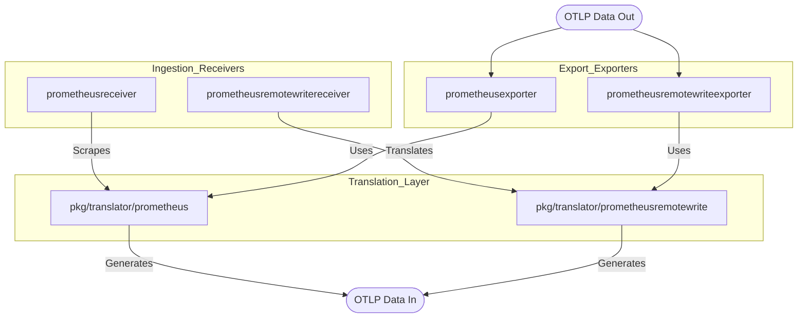
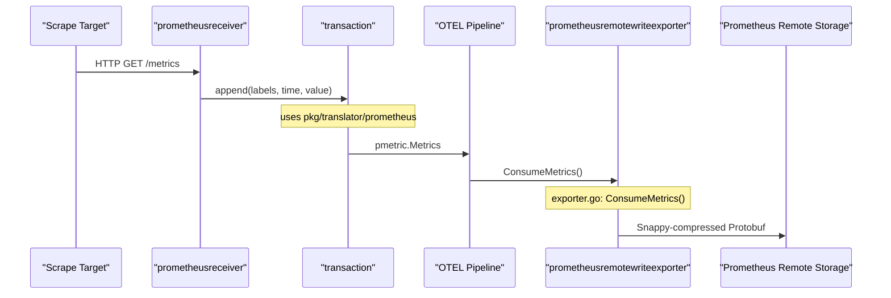

The Prometheus and Metrics Ecosystem within the `opentelemetry-collector-contrib` repository provides a comprehensive suite of components for bidirectional interoperability between OpenTelemetry and Prometheus. This ecosystem enables the collector to act as a Prometheus-compatible scraper, a remote write destination, and a gateway for exporting OTLP metrics to Prometheus-compatible backends.

The integration is built upon shared translation logic and leverages the upstream Prometheus codebase to ensure high fidelity with Prometheus standards [receiver/prometheusreceiver/go.mod:21]().

## Architecture Overview

The ecosystem is centered around three primary data flow patterns: scraping, remote writing, and exporting. These patterns are implemented through specialized components that share a common translation layer.

### Component Interaction Diagram

This diagram illustrates how the various Prometheus components relate to each other and the shared translation libraries.

Sources:
- [receiver/prometheusreceiver/go.mod:17-21]()
- [exporter/prometheusexporter/go.mod:9-15]()
- [exporter/prometheusremotewriteexporter/exporter.go:35-38]()

## Prometheus Receiver and Scraping

The `prometheusreceiver` is a sophisticated component that embeds Prometheus's own scraping engine [receiver/prometheusreceiver/README.md:46-47](). It is designed as a drop-in replacement for a Prometheus server's scraping capabilities, supporting the full `scrape_config` syntax, including service discovery and relabeling rules [receiver/prometheusreceiver/README.md:63-65]().

Key features include:
*   **Target Allocator Integration**: Supports the Prometheus Operator's Target Allocator for sharding scrape targets across multiple collector instances [receiver/prometheusreceiver/README.md:106]().
*   **Staleness Handling**: Manages Prometheus staleness markers to ensure metrics are correctly "retired" in OTLP when targets disappear [receiver/prometheusreceiver/README.md:20]().
*   **Metric Translation**: Converts Prometheus samples into OTLP `pdata.Metrics` via a transaction-based appender that handles metric families and resource mapping [receiver/prometheusreceiver/go.mod:17]().

For details, see [Prometheus Receiver and Scraping](#11.1).

## Prometheus Remote Write and Exporters

The ecosystem supports the Prometheus Remote Write protocol (PRW) for both ingestion and egress. This allows the collector to integrate with the broader Prometheus ecosystem where PRW is the standard for long-term storage and inter-component communication.

### Remote Write Exporter
The `prometheusremotewriteexporter` translates OTLP metrics into Prometheus time series and sends them to a remote endpoint [exporter/prometheusremotewriteexporter/exporter.go:125-126](). It includes a Write-Ahead Log (WAL) to ensure data durability during network outages or backend pressure [exporter/prometheusremotewriteexporter/exporter.go:138](). The exporter leverages the shared `pkg/translator/prometheusremotewrite` library for OTLP-to-Prometheus conversion [exporter/prometheusremotewriteexporter/exporter.go:37]().

### Prometheus Exporter
The `prometheusexporter` serves a different purpose: it hosts an HTTP endpoint that a Prometheus server can scrape. It translates OTLP metrics into the Prometheus text format on-the-fly when the `/metrics` endpoint is accessed [exporter/prometheusexporter/go.mod:11-15](). It depends on the `prometheusreceiver` for shared translation utilities [exporter/prometheusexporter/go.mod:10]().

For details, see [Prometheus Remote Write Exporter and Translators](#11.2).

## Shared Translation Logic

A critical part of the ecosystem is the shared translation logic that ensures consistency across all components.

| Package | Purpose | Implementation Reference |
| --- | --- | --- |
| `pkg/translator/prometheus` | Core OTLP <-> Prometheus mapping | [receiver/prometheusreceiver/go.mod:17]() |
| `pkg/translator/prometheusremotewrite` | OTLP to PRW translation | [exporter/prometheusremotewriteexporter/exporter.go:37]() |
| `github.com/prometheus/otlptranslator` | External translation utility | [exporter/prometheusexporter/go.mod:14]() |

### Data Flow Mapping

The following diagram bridges the natural language concepts of scraping and writing to the specific code entities that handle the transformations.

Sources:
- [receiver/prometheusreceiver/go.mod:17]()
- [exporter/prometheusremotewriteexporter/exporter.go:125-147]()
- [receiver/prometheusreceiver/README.md:46-59]()

## Specialized Receivers

Beyond the standard receiver, the ecosystem includes specialized versions for specific platforms that leverage the `prometheusreceiver` as a dependency:
*   **Simple Prometheus Receiver**: A simplified wrapper designed for easier configuration [receiver/simpleprometheusreceiver/go.mod:6]().
*   **Pure Storage Receivers**: Specialized scrapers for Pure Storage FlashArray (`purefareceiver`) and FlashBlade (`purefbreceiver`) [receiver/purefareceiver/go.mod:7](), [receiver/purefbreceiver/go.mod:7](). These often integrate with authentication extensions like `bearertokenauthextension` [receiver/purefareceiver/go.mod:6]().

Sources:
- [receiver/simpleprometheusreceiver/go.mod:1-10]()
- [receiver/purefareceiver/go.mod:1-10]()
- [receiver/purefbreceiver/go.mod:1-10]()