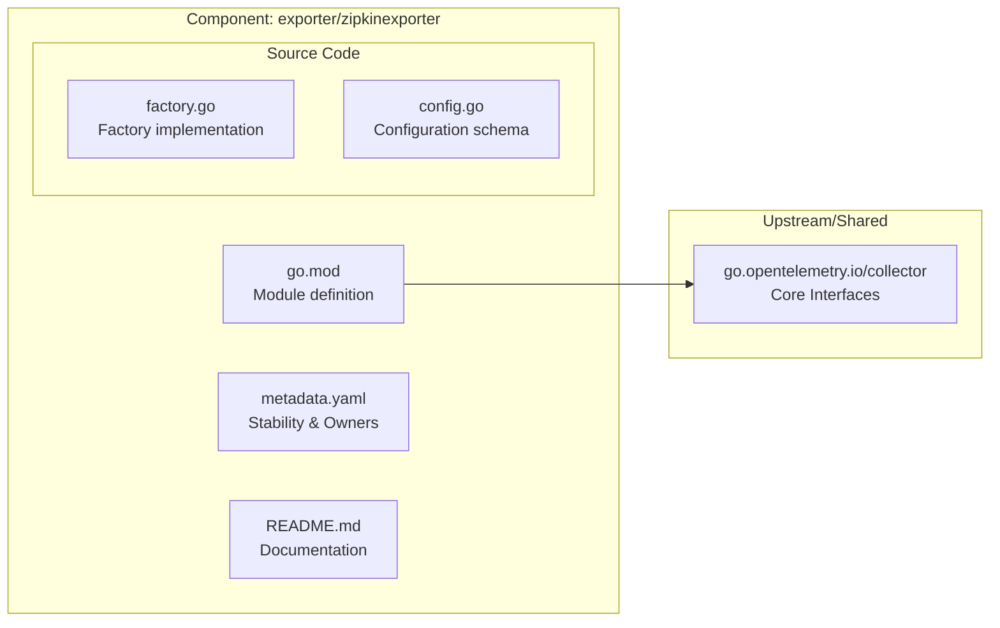

## Overview

The `opentelemetry-collector-contrib` repository is a massive monorepo containing over 200 Go modules [go.mod:1-11](). It serves as the community-driven extension of the OpenTelemetry Collector, housing components that are not part of the core distribution [README.md:41-45](). The repository is organized around a plugin-based architecture categorized into primary component types: **receivers**, **processors**, **exporters**, **extensions**, **connectors**, and **providers** [reports/distributions/contrib.yaml:4-257]().

---

## Top-Level Directory Structure

The repository uses a functional hierarchy to separate distribution binaries, individual component logic, shared internal libraries, and public utility packages.

### Repository Architecture Diagram

The following diagram maps the physical directory structure to the functional spaces of the codebase.

```mermaid
graph TB
    ROOT["Repository Root<br/>github.com/open-telemetry/opentelemetry-collector-contrib"]

    subgraph "Binaries & Tools (cmd/)"
        OTELCOL["cmd/otelcontribcol/<br/>Local contrib binary"]
        TELGEN["cmd/telemetrygen/<br/>Telemetry generator"]
        OPAMP["cmd/opampsupervisor/<br/>Management supervisor"]
        GOLDEN["cmd/golden/<br/>Golden file utility"]
        CODECOV["cmd/codecovgen/<br/>Coverage generator"]
    end

    subgraph "Component Modules"
        RECEIVERS["receiver/<br/>~100 components"]
        PROCESSORS["processor/<br/>~30 components"]
        EXPORTERS["exporter/<br/>~60 components"]
        EXTENSIONS["extension/<br/>~35 components"]
        CONNECTORS["connector/<br/>~15 components"]
    end

    subgraph "Shared Infrastructure"
        INTERNAL["internal/<br/>Private shared logic"]
        PKG["pkg/<br/>Public utility modules"]
        CONFMAP["confmap/provider/<br/>Config providers"]
    end

    ROOT --> OTELCOL
    ROOT --> TELGEN
    ROOT --> OPAMP
    ROOT --> GOLDEN
    ROOT --> CODECOV
    ROOT --> RECEIVERS
    ROOT --> PROCESSORS
    ROOT --> EXPORTERS
    ROOT --> EXTENSIONS
    ROOT --> CONNECTORS
    ROOT --> INTERNAL
    ROOT --> PKG
    ROOT --> CONFMAP
```

**Sources:** [go.mod:1-11](), [.github/CODEOWNERS:21-31](), [reports/distributions/contrib.yaml:4-257](), [.chloggen/config.yaml:11-250]()

### Binary and Tool Directories (`cmd/`)

The `cmd/` directory contains executable programs. While many are for internal repository maintenance, several are key products or development utilities:

| Directory | Purpose | Key Manifest/Owner |
|-----------|---------|-----------|
| `cmd/otelcontribcol/` | A local testing distribution of the Collector Contrib [cmd/otelcontribcol/builder-config.yaml:12-12](). | [cmd/otelcontribcol/builder-config.yaml:1-15]() |
| `cmd/telemetrygen/` | Tool for generating synthetic OTLP traces, metrics, and logs [.github/CODEOWNERS:26-26](). | [.chloggen/config.yaml:16-16]() |
| `cmd/opampsupervisor/` | Implementation of the OpAMP (Open Agent Management Protocol) supervisor [.github/CODEOWNERS:23-23](). | [.chloggen/config.yaml:13-13]() |
| `cmd/golden/` | Utility for managing "golden" test data files used in component validation [.github/CODEOWNERS:22-22](). | [.chloggen/config.yaml:12-12]() |
| `cmd/codecovgen/` | Internal utility for generating code coverage reports [.github/CODEOWNERS:21-21](). | [.chloggen/config.yaml:11-11]() |

**Sources:** [.github/CODEOWNERS:21-26](), [cmd/otelcontribcol/builder-config.yaml:9-14](), [.chloggen/config.yaml:11-16]()

### Component Type Directories

The core functionality of the collector is split into modular types. Every subdirectory within these folders is typically a standalone Go module.

| Type | Directory | Function | Examples |
|------|-----------|----------|----------|
| **Receivers** | `receiver/` | Ingest telemetry from various sources [reports/distributions/contrib.yaml:139-246](). | `receiver/mysql`, `receiver/kafka` |
| **Processors** | `processor/` | Perform data manipulation (filtering, batching, enrichment) [reports/distributions/contrib.yaml:103-133](). | `processor/resourcedetection` |
| **Exporters** | `exporter/` | Send telemetry to backends or storage [reports/distributions/contrib.yaml:18-63](). | `exporter/datadog`, `exporter/elasticsearch` |
| **Extensions** | `extension/` | Provide non-telemetry pipeline capabilities (auth, health, storage) [reports/distributions/contrib.yaml:64-102](). | `extension/basicauth`, `extension/health_check` |
| **Connectors** | `connector/` | Bridge two pipelines, often generating new signals from existing ones [reports/distributions/contrib.yaml:5-17](). | `connector/spanmetrics`, `connector/routing` |
| **Providers** | `confmap/provider/` | Configuration providers for fetching secrets or remote configs [reports/distributions/contrib.yaml:134-138](). | `confmap/provider/s3provider` |

**Sources:** [reports/distributions/contrib.yaml:5-259](), [.github/CODEOWNERS:31-318](), [.chloggen/config.yaml:17-250]()

---

## Component Module Structure

### Standard Component Layout

Components follow a standardized structure to support automated testing and distribution building. This structure is often managed by the `mdatagen` tool which uses `metadata.yaml` as input.

**Key Component Files:**
- **Metadata**: `metadata.yaml` defines stability levels (Alpha, Beta, Stable) for traces/metrics/logs and identifies code owners.
- **Documentation**: Every component requires a `README.md` explaining configuration and usage [README.md:59-59]().
- **Module Definition**: Standalone `go.mod` allows independent versioning and dependency management [versions.yaml:4-30]().

**Sources:** [README.md:59-59](), [versions.yaml:4-30](), [.github/CODEOWNERS:19-318]()

### Internal vs Public Shared Code

The repository enforces a strict distinction between shared code intended for internal use and code available for external consumption:

| Category | Path | Purpose |
|----------|------|---------|
| **Internal** | `internal/` | Private modules used to share code between components in this repo (e.g., `internal/filter`, `internal/k8sconfig`, `internal/sqlquery`). External projects cannot import these due to Go's `internal` package rules [.chloggen/config.yaml:127-148](). |
| **Public** | `pkg/` | Public utility modules designed for external use (e.g., `pkg/ottl`, `pkg/stanza`, `pkg/pdatatest`). These provide common frameworks for component developers [.chloggen/config.yaml:149-183](). |

**Sources:** [.chloggen/config.yaml:127-183](), [.github/CODEOWNERS:141-197]()

---

## Component Management and Governance

### Metadata-Driven Automation

The repository uses `metadata.yaml` files and directory structures as the source of truth for several automated processes:

1.  **CODEOWNERS Generation**: The root `.github/CODEOWNERS` file is autogenerated, aggregating ownership data from component-level definitions [.github/CODEOWNERS:1-10]().
2.  **Issue Template Updates**: The list of components available in GitHub Issue dropdowns is autogenerated using `make generate-gh-issue-templates` [.github/ISSUE_TEMPLATE/bug_report.yaml:18-20]().
3.  **Changelog Tracking**: Changes are tracked via YAML files in `.chloggen/`, categorized by component name to generate the final `CHANGELOG.md` and `CHANGELOG-API.md` [.chloggen/config.yaml:1-9]().

**Sources:** [.github/CODEOWNERS:1-10](), [.github/ISSUE_TEMPLATE/bug_report.yaml:11-20](), [.chloggen/config.yaml:1-9](), [CONTRIBUTING.md:61-66]()

### Ownership and Maintenance

- **Maintainers**: Overall repository health is managed by the `@open-telemetry/collector-contrib-approvers` team [.github/CODEOWNERS:12-12]().
- **Component Owners**: Individual components are assigned to specific users or vendors (e.g., `connector/datadogconnector` is owned by `@mx-psi` and others) [.github/CODEOWNERS:32-32]().
- **Stability Management**: Components transition through lifecycle stages. The `README.md` and `metadata.yaml` track these levels per signal [README.md:47-52](). Unmaintained components are tracked via a specific issue template and may be deprecated if owners are unresponsive for 6 weeks [.github/ISSUE_TEMPLATE/unmaintained.yaml:1-9]().

**Sources:** [.github/CODEOWNERS:12-318](), [README.md:47-52](), [.github/ISSUE_TEMPLATE/unmaintained.yaml:1-9]()

---

## Build System and Dependency Management

### Module Dependency Graph

With over 200 modules, managing the dependency graph is a significant task:

- **Local Testing**: To test changes locally, developers use `make otelcontribcol`, which triggers the OpenTelemetry Collector Builder (OCB) to compile a binary using the local module versions [CONTRIBUTING.md:13-17]().
- **Dependency Tracking**: The `versions.yaml` file tracks version sets (e.g., `contrib-base`) and their member modules to ensure consistency across the repository [versions.yaml:4-30]().
- **Official Distributions**: While this repo provides a testing binary, official distributions are managed in the `opentelemetry-collector-releases` repository [go.mod:3-9]().

### Distribution Assembly

The `cmd/otelcontribcol/builder-config.yaml` manifest defines the composition of the local testing binary. It explicitly lists the `gomod` path and version for every included extension, exporter, processor, and receiver [cmd/otelcontribcol/builder-config.yaml:16-100]().

**Sources:** [CONTRIBUTING.md:13-17](), [cmd/otelcontribcol/builder-config.yaml:16-100](), [go.mod:3-9](), [versions.yaml:4-30]()