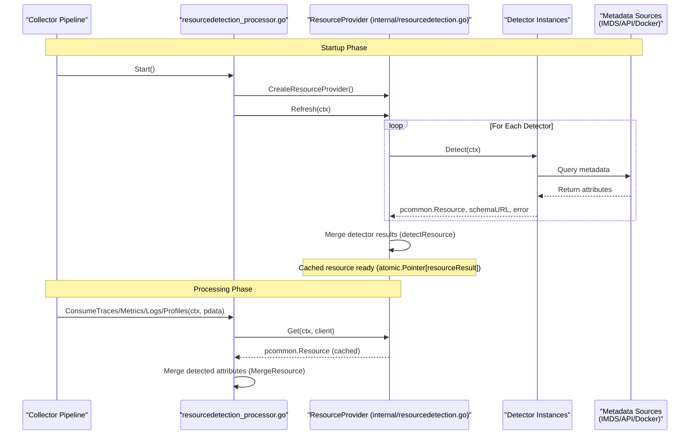
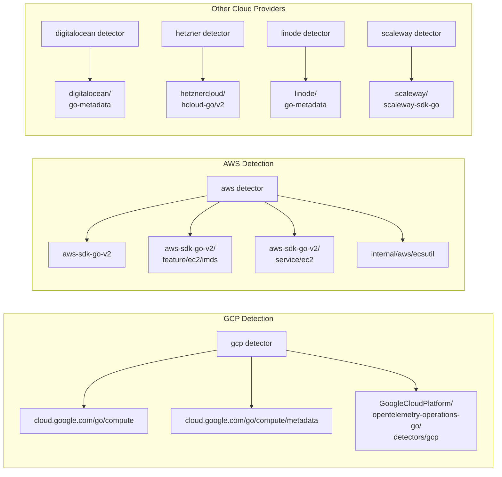
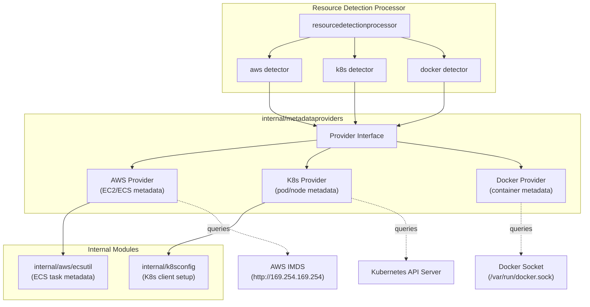
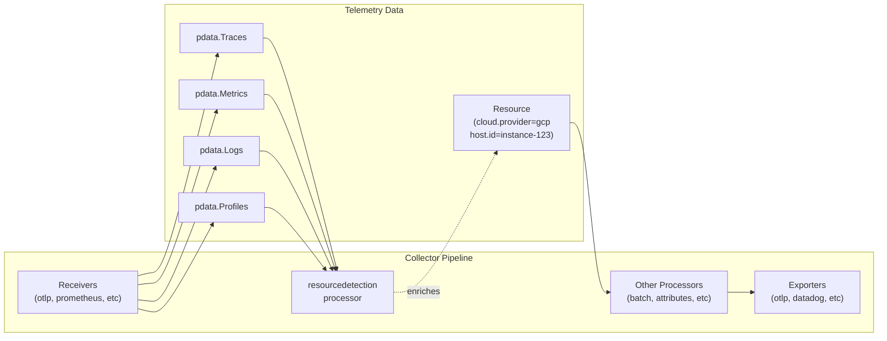

## Purpose and Scope

The `resourcedetectionprocessor` automatically identifies the execution environment where the OpenTelemetry Collector is running and enriches telemetry data with resource attributes describing that environment. This processor detects cloud provider metadata (GCP, AWS, Azure, DigitalOcean, Hetzner, Linode, Scaleway), container runtime information (Docker, Kubernetes), system information, and service discovery metadata (Consul).

For information about the metadata provider abstraction layer used by this processor, see [Metadata Provider Interfaces](#9.2). For AWS container-specific metadata collection, see [AWS Integration Components](#8.2).

## Overview

The `resourcedetectionprocessor` executes a configurable set of detector modules at startup, each querying different metadata sources to populate resource attributes. These attributes are then merged into the resource objects of all telemetry data (traces, metrics, logs, and profiles) passing through the collector pipeline. This allows downstream systems to understand the origin and context of the telemetry without requiring manual configuration.

**Supported Detection Strategies:**
- **Cloud Providers:** GCP Compute Engine/GKE, AWS EC2/ECS/EKS, Azure VM, DigitalOcean Droplets, Hetzner Cloud, Linode, Scaleway
- **Container Platforms:** Docker, Kubernetes
- **System Information:** Hostname, OS details, hardware specs via `gopsutil`
- **Service Discovery:** HashiCorp Consul
- **PaaS:** Heroku Dyno metadata
- **Environment:** `OTEL_RESOURCE_ATTRIBUTES` environment variable

Sources: [processor/resourcedetectionprocessor/go.mod:1-54](), [processor/resourcedetectionprocessor/README.md:18-20](), [processor/resourcedetectionprocessor/metadata.yaml:7-8]()

## Architecture

### Component Structure

```mermaid
graph TB
    subgraph "Resource Detection Processor"
        Factory["factory.go<br/>(creates processor)"]
        Config["config.go<br/>(detector list + settings)"]
        Processor["resourcedetection_processor.go<br/>(implements processorhelper)"]

        subgraph "Detectors"
            EnvDetector["env<br/>(OTEL_RESOURCE_ATTRIBUTES)"]
            GCP["gcp<br/>(GCE/GKE metadata)"]
            AWS["aws<br/>(EC2/ECS/EKS metadata)"]
            Azure["azure<br/>(VM metadata)"]
            Docker["docker<br/>(container info)"]
            K8s["k8s<br/>(pod/node info)"]
            System["system<br/>(OS/hostname)"]
            Consul["consul<br/>(service tags)"]
            DO["digitalocean<br/>(droplet metadata)"]
            Hetzner["hetzner<br/>(cloud metadata)"]
            Linode["linode<br/>(instance metadata)"]
            Scaleway["scaleway<br/>(instance metadata)"]
            Heroku["heroku<br/>(dyno metadata)"]
        end
    end

    subgraph "External Dependencies"
        GCPSDK["cloud.google.com/go/compute/metadata"]
        AWSSDK["aws-sdk-go-v2/feature/ec2/imds"]
        DockerAPI["github.com/moby/moby/api"]
        K8sClient["k8s.io/client-go"]
        ConsulAPI["github.com/hashicorp/consul/api"]
        MetadataProviders["internal/metadataproviders"]
        Gopsutil["github.com/shirou/gopsutil/v4"]
    end

    subgraph "Collector Pipeline"
        Telemetry["pdata.Traces/Metrics/Logs/Profiles"]
        Resource["pdata.Resource"]
    end

    Factory --> Config
    Factory --> Processor
    Config --> EnvDetector
    Config --> GCP
    Config --> AWS
    Config --> Azure
    Config --> Docker
    Config --> K8s
    Config --> System
    Config --> Consul
    Config --> DO
    Config --> Hetzner
    Config --> Linode
    Config --> Scaleway
    Config --> Heroku

    GCP --> GCPSDK
    AWS --> AWSSDK
    AWS --> MetadataProviders
    Docker --> DockerAPI
    K8s --> K8sClient
    Consul --> ConsulAPI
    System --> Gopsutil

    Processor --> Telemetry
    Telemetry --> Resource

    EnvDetector -.->|"merges attributes"| Resource
    GCP -.->|"merges attributes"| Resource
    AWS -.->|"merges attributes"| Resource
    Azure -.->|"merges attributes"| Resource
    Docker -.->|"merges attributes"| Resource
    K8s -.->|"merges attributes"| Resource
    System -.->|"merges attributes"| Resource
    Consul -.->|"merges attributes"| Resource
    DO -.->|"merges attributes"| Resource
    Hetzner -.->|"merges attributes"| Resource
    Linode -.->|"merges attributes"| Resource
    Scaleway -.->|"merges attributes"| Resource
    Heroku -.->|"merges attributes"| Resource
```



**Diagram: Resource Detection Processor Component Architecture**

The processor initializes configured detectors at startup. Each detector queries its respective metadata source (cloud provider IMDS, Docker API, Kubernetes API, etc.) and returns a set of resource attributes. The processor merges these attributes and applies them to all telemetry data, including profiles which are currently in development stability.

Sources: [processor/resourcedetectionprocessor/go.mod:5-54](), [processor/resourcedetectionprocessor/metadata.yaml:1-8]()

### Detection Flow



**Diagram: Resource Detection Flow**

The detection phase occurs once at startup via `Refresh` [processor/resourcedetectionprocessor/internal/resourcedetection.go:119-146](). Each detector runs concurrently with exponential backoff retries [processor/resourcedetectionprocessor/internal/resourcedetection.go:162-183](). Results are merged with conflict resolution rules in `detectResource` [processor/resourcedetectionprocessor/internal/resourcedetection.go:148-225](). During processing, the cached resource attributes are efficiently retrieved using `ResourceProvider.Get` [processor/resourcedetectionprocessor/internal/resourcedetection.go:110-116](). If a refresh fails, the processor attempts to keep the last successful snapshot [processor/resourcedetectionprocessor/internal/resourcedetection.go:127-135]().

Sources: [processor/resourcedetectionprocessor/internal/resourcedetection.go:110-116](), [processor/resourcedetectionprocessor/internal/resourcedetection.go:119-146](), [processor/resourcedetectionprocessor/internal/resourcedetection.go:148-225](), [processor/resourcedetectionprocessor/internal/resourcedetection.go:162-183]()

## Detector Types and Dependencies

### Cloud Provider Detectors



**Diagram: Cloud Provider Detector Dependencies**

Each cloud provider detector uses official SDKs or metadata libraries to query instance metadata services (IMDS). AWS detection additionally integrates with ECS task metadata endpoints via the `internal/aws/ecsutil` module.

Sources: [processor/resourcedetectionprocessor/go.mod:6-12](), [processor/resourcedetectionprocessor/go.mod:14](), [processor/resourcedetectionprocessor/go.mod:18-21](), [processor/resourcedetectionprocessor/go.mod:27]()

### Container and System Detectors

| Detector | Purpose | Key Dependencies | Resource Attributes Detected |
|----------|---------|------------------|------------------------------|
| `env` | Reads `OTEL_RESOURCE_ATTRIBUTES` environment variable | N/A | User-defined attributes |
| `docker` | Container runtime detection | `github.com/moby/moby/api` [processor/resourcedetectionprocessor/go.mod:20]() | `container.id`, `container.name`, `container.image.name` |
| `k8s` | Kubernetes pod/node metadata | `k8s.io/client-go`, `internal/k8sconfig` [processor/resourcedetectionprocessor/go.mod:22]() | `k8s.pod.name`, `k8s.namespace.name`, `k8s.node.name` |
| `system` | OS and hostname | `github.com/shirou/gopsutil/v4` [processor/resourcedetectionprocessor/go.mod:28]() | `host.name`, `os.type`, `os.description` |
| `consul` | Service discovery tags | `github.com/hashicorp/consul/api` [processor/resourcedetectionprocessor/go.mod:17]() | `service.name`, custom tags |
| `heroku` | Heroku dyno metadata | N/A (reads environment variables) | `heroku.app.id`, `service.name`, `service.instance.id`, etc. |

Sources: [processor/resourcedetectionprocessor/go.mod:5-28](), [processor/resourcedetectionprocessor/README.md:28-146]()

## Configuration Structure

The processor accepts a list of detector names in its configuration. Each detector can have optional detector-specific settings:

```yaml
processors:
  resourcedetection:
    detectors: [env, gcp, ec2, docker, system]
    timeout: 5s
    override: false

    # Detector-specific configs
    system:
      hostname_sources: ["os", "dns"]

    ec2:
      resource_attributes:
        cloud.region:
          enabled: true
```

**Configuration Parameters:**
- **`detectors`**: Ordered list of detector names to execute.
- **`timeout`**: Maximum time to wait for all detectors (default: 5s).
- **`override`**: Whether to override existing resource attributes (default: false).
- **`hostname_sources`**: For the system detector, valid options are "dns", "os", "cname", and "lookup" [processor/resourcedetectionprocessor/README.md:64-69]().

Sources: [processor/resourcedetectionprocessor/go.mod:30-54](), [processor/resourcedetectionprocessor/README.md:37-69]()

## Integration with Metadata Providers



**Diagram: Metadata Provider Integration**

The `internal/metadataproviders` module (see [Metadata Provider Interfaces](#9.2)) abstracts environment-specific metadata retrieval. Detectors use these providers to query metadata sources consistently. This abstraction is shared with the `awscontainerinsightreceiver` for code reuse.

Sources: [processor/resourcedetectionprocessor/go.mod:21-23](), [internal/metadataproviders/go.mod:1-24](), [receiver/awscontainerinsightreceiver/go.mod:1-16]()

## Processing Pipeline Integration



**Diagram: Pipeline Integration and Data Enrichment**

The processor operates on `pdata.Traces`, `pdata.Metrics`, `pdata.Logs`, and `pdata.Profiles` via the `processorhelper` interface. It modifies the `Resource()` object of each signal type, adding detected attributes. The processor typically runs early in the pipeline to ensure resource context is available for subsequent processors.

Sources: [processor/resourcedetectionprocessor/go.mod:41-47](), [processor/resourcedetectionprocessor/metadata.yaml:7-8]()

## Key Dependencies and Their Roles

### Cloud Provider SDKs

**Google Cloud Platform:**
- `cloud.google.com/go/compute/metadata` [processor/resourcedetectionprocessor/go.mod:7]() - Queries GCE metadata server.
- `github.com/GoogleCloudPlatform/opentelemetry-operations-go/detectors/gcp` [processor/resourcedetectionprocessor/go.mod:8]() - OTel semantic convention mapping for GCP.

**Amazon Web Services:**
- `github.com/aws/aws-sdk-go-v2/feature/ec2/imds` [processor/resourcedetectionprocessor/go.mod:11]() - EC2 Instance Metadata Service client.
- `github.com/aws/aws-sdk-go-v2/service/ec2` [processor/resourcedetectionprocessor/go.mod:12]() - EC2 API for tag retrieval.
- `github.com/open-telemetry/opentelemetry-collector-contrib/internal/aws/ecsutil` [processor/resourcedetectionprocessor/go.mod:21]() - ECS task metadata endpoint client.

**Other Providers:**
- `github.com/digitalocean/go-metadata` [processor/resourcedetectionprocessor/go.mod:14]() - DigitalOcean metadata service.
- `github.com/hetznercloud/hcloud-go/v2` [processor/resourcedetectionprocessor/go.mod:18]() - Hetzner Cloud API.
- `github.com/linode/go-metadata` [processor/resourcedetectionprocessor/go.mod:19]() - Linode metadata service.
- `github.com/scaleway/scaleway-sdk-go` [processor/resourcedetectionprocessor/go.mod:27]() - Scaleway API.

### Container and Orchestration

- `github.com/moby/moby/api` [processor/resourcedetectionprocessor/go.mod:20]() - Docker Engine API client for container inspection.
- `k8s.io/client-go` [internal/metadataproviders/go.mod:23]() - Kubernetes API client for pod/node metadata.
- `github.com/open-telemetry/opentelemetry-collector-contrib/internal/k8sconfig` [processor/resourcedetectionprocessor/go.mod:22]() - Kubernetes client configuration utilities.

### System and Service Discovery

- `github.com/shirou/gopsutil/v4` [processor/resourcedetectionprocessor/go.mod:28]() - Cross-platform system information library (CPU, memory, OS).
- `github.com/hashicorp/consul/api` [processor/resourcedetectionprocessor/go.mod:17]() - Consul API for service discovery metadata.

Sources: [processor/resourcedetectionprocessor/go.mod:5-28](), [internal/metadataproviders/go.mod:21-23]()

## Testing Infrastructure

The processor uses several testing utilities to ensure reliability across environments:

- `github.com/open-telemetry/opentelemetry-collector-contrib/pkg/golden` [processor/resourcedetectionprocessor/go.mod:24]() - Golden file testing for output validation.
- `github.com/open-telemetry/opentelemetry-collector-contrib/pkg/pdatatest` [processor/resourcedetectionprocessor/go.mod:25]() - pdata comparison utilities.
- `github.com/open-telemetry/opentelemetry-collector-contrib/pkg/xk8stest` [processor/resourcedetectionprocessor/go.mod:26]() - Kubernetes test helpers.
- `go.opentelemetry.io/collector/processor/processortest` [processor/resourcedetectionprocessor/go.mod:46]() - Processor testing utilities.

The processor includes comprehensive unit tests for each detector and integration tests using `consumertest` to validate resource attribute merging. For example, `TestDetect` [processor/resourcedetectionprocessor/internal/resourcedetection_test.go:41-105]() validates the merging logic of multiple detectors, and `TestDetectResource_Parallel` [processor/resourcedetectionprocessor/internal/resourcedetection_test.go:221-249]() ensures concurrent calls to `Get` return cached results after an initial refresh.

Sources: [processor/resourcedetectionprocessor/go.mod:24-26](), [processor/resourcedetectionprocessor/go.mod:46](), [processor/resourcedetectionprocessor/internal/resourcedetection_test.go:41-105](), [processor/resourcedetectionprocessor/internal/resourcedetection_test.go:221-249]()