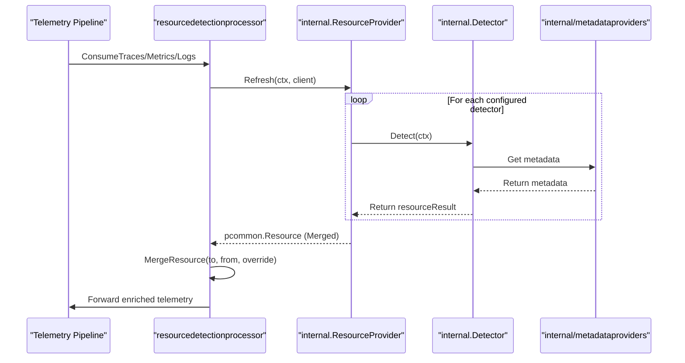
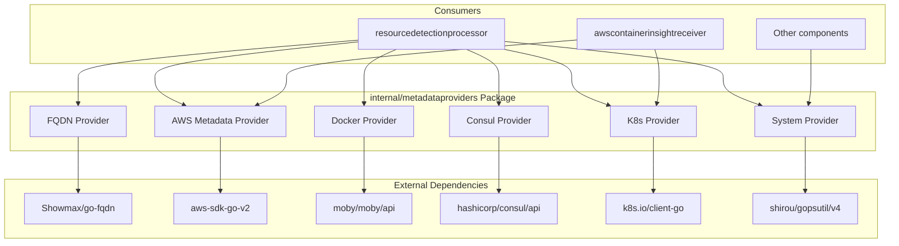

This document covers the resource detection and metadata enrichment capabilities within the `opentelemetry-collector-contrib` repository. These components automatically identify the compute environment where the collector is running and enrich telemetry data with contextual resource attributes such as cloud platform metadata, container information, Kubernetes cluster details, and system properties.

The primary component is the `resourcedetectionprocessor`, which orchestrates multiple platform-specific detectors. Supporting infrastructure is provided by the `internal/metadataproviders` abstraction layer. For information about specific cloud provider receivers that also collect metrics and logs, see [AWS Integration Components](#8.2) and [Google Cloud Platform Components](#8.1).

## Architecture Overview

The resource detection system follows a pluggable detector architecture where each detector targets a specific platform or metadata source.

Title: Resource Detection Architecture

```mermaid
graph TB
    subgraph "Telemetry Pipeline"
        RECEIVERS["Receivers<br/>(OTLP, Jaeger, etc)"]
        RDPROCESSOR["resourcedetectionprocessor"]
        OTHER_PROCESSORS["Other Processors<br/>(batch, attributes, etc)"]
        EXPORTERS["Exporters"]
    end

    subgraph "Resource Detection Processor"
        DETECTOR_ORCHESTRATOR["internal.ResourceProvider"]
        CONFIG["resourcedetectionprocessor.Config"]
    end

    subgraph "Platform Detectors"
        AWS_DETECTOR["AWS EC2/ECS Detector"]
        GCP_DETECTOR["GCP Detector"]
        AZURE_DETECTOR["Azure Detector"]
        DOCKER_DETECTOR["Docker Detector"]
        K8S_DETECTOR["Kubernetes Detector"]
        SYSTEM_DETECTOR["System Detector"]
        CONSUL_DETECTOR["Consul Detector"]
        DO_DETECTOR["DigitalOcean Detector"]
        HETZNER_DETECTOR["Hetzner Detector"]
        LINODE_DETECTOR["Linode Detector"]
        SCALEWAY_DETECTOR["Scaleway Detector"]
    end

    subgraph "Metadata Providers (internal/metadataproviders)"
        FQDN_PROVIDER["FQDN Provider<br/>Showmax/go-fqdn"]
        AWS_PROVIDER["AWS EC2/ECS Provider<br/>aws-sdk-go-v2"]
        DOCKER_PROVIDER["Docker Provider<br/>docker/docker"]
        CONSUL_PROVIDER["Consul Provider<br/>consul/api"]
        K8S_PROVIDER["K8s Provider<br/>client-go"]
        SYSTEM_PROVIDER["System Provider<br/>gopsutil"]
    end

    RECEIVERS --> RDPROCESSOR
    CONFIG --> DETECTOR_ORCHESTRATOR
    RDPROCESSOR --> DETECTOR_ORCHESTRATOR
    RDPROCESSOR --> OTHER_PROCESSORS
    OTHER_PROCESSORS --> EXPORTERS

    DETECTOR_ORCHESTRATOR --> AWS_DETECTOR
    DETECTOR_ORCHESTRATOR --> GCP_DETECTOR
    DETECTOR_ORCHESTRATOR --> AZURE_DETECTOR
    DETECTOR_ORCHESTRATOR --> DOCKER_DETECTOR
    DETECTOR_ORCHESTRATOR --> K8S_DETECTOR
    DETECTOR_ORCHESTRATOR --> SYSTEM_DETECTOR
    DETECTOR_ORCHESTRATOR --> CONSUL_DETECTOR
    DETECTOR_ORCHESTRATOR --> DO_DETECTOR
    DETECTOR_ORCHESTRATOR --> HETZNER_DETECTOR
    DETECTOR_ORCHESTRATOR --> LINODE_DETECTOR
    DETECTOR_ORCHESTRATOR --> SCALEWAY_DETECTOR

    AWS_DETECTOR --> AWS_PROVIDER
    DOCKER_DETECTOR --> DOCKER_PROVIDER
    K8S_DETECTOR --> K8S_PROVIDER
    SYSTEM_DETECTOR --> SYSTEM_PROVIDER
    SYSTEM_DETECTOR --> FQDN_PROVIDER
    CONSUL_DETECTOR --> CONSUL_PROVIDER
```


**Sources:**
- [processor/resourcedetectionprocessor/go.mod:5-55]()
- [internal/metadataproviders/go.mod:1-24]()
- [processor/resourcedetectionprocessor/internal/resourcedetection.go:80-93]()

## Resource Detection Processor

The `resourcedetectionprocessor` is implemented as a standard OpenTelemetry Collector processor that intercepts telemetry data and adds resource attributes before passing it to subsequent pipeline components. For details, see [Resource Detection Processor](#9.1).

### Supported Platform Detectors

The processor supports multiple cloud and infrastructure platforms through specialized detectors:

| Detector | Platform | Key Dependencies | Resource Attributes Detected |
|----------|----------|------------------|------------------------------|
| `ec2` | AWS EC2 | `github.com/aws/aws-sdk-go-v2/feature/ec2/imds` | instance ID, type, region, availability zone |
| `ecs` | AWS ECS | `github.com/open-telemetry/opentelemetry-collector-contrib/internal/aws/ecsutil` | cluster name, task ARN, container ID |
| `gcp` | Google Cloud Platform | `github.com/GoogleCloudPlatform/opentelemetry-operations-go/detectors/gcp` | project ID, instance ID, zone, cluster name |
| `azure` | Microsoft Azure | Native detection logic | subscription ID, resource group, VM ID |
| `docker` | Docker | `github.com/moby/moby/api` | container ID, name, image name, host name |
| `k8s` | Kubernetes | `k8s.io/client-go` | namespace, pod name, node name, cluster name |
| `system` | System Information | `github.com/shirou/gopsutil/v4` | hostname, OS type, architecture |
| `consul` | HashiCorp Consul | `github.com/hashicorp/consul/api` | service name, datacenter, node name |
| `digitalocean` | DigitalOcean | `github.com/digitalocean/go-metadata` | droplet ID, region |
| `hetzner` | Hetzner Cloud | `github.com/hetznercloud/hcloud-go/v2` | server ID, datacenter, availability zone |
| `linode` | Linode | `github.com/linode/go-metadata` | instance ID, region |
| `scaleway` | Scaleway | `github.com/scaleway/scaleway-sdk-go` | instance ID, zone |

**Sources:**
- [processor/resourcedetectionprocessor/go.mod:5-28]()
- [processor/resourcedetectionprocessor/README.md:26-140]()

### Detector Execution Flow

Title: Resource Detection Sequence


The processor executes detectors in the order specified in configuration. Each detector runs independently with a configurable timeout. It uses `github.com/cenkalti/backoff/v5` for exponential backoff retries during the detection phase [processor/resourcedetectionprocessor/internal/resourcedetection.go:161-195](). The `internal.ResourceProvider` manages the lifecycle of these detections, including caching results in an `atomic.Pointer[resourceResult]` [processor/resourcedetectionprocessor/internal/resourcedetection.go:80-93]().

**Sources:**
- [processor/resourcedetectionprocessor/go.mod:13]()
- [processor/resourcedetectionprocessor/internal/resourcedetection.go:101-146]()
- [processor/resourcedetectionprocessor/internal/resourcedetection.go:148-225]()

### Configuration Structure

The processor is configured through standard OpenTelemetry Collector configuration:

```yaml
processors:
  resourcedetection:
    detectors: [env, system, docker, gcp, ec2, ecs]
    timeout: 5s
    override: false

    # Detector-specific configuration
    ec2:
      tags: [Name, Environment]

    system:
      hostname_sources: [os, dns, lookup]
```

Key configuration options:
- `detectors`: Ordered list of detector names to execute.
- `timeout`: Maximum time for detection (default: 5s).
- `override`: Whether to override existing resource attributes.
- Detector-specific sections for customizing individual detectors (e.g., `system`'s `hostname_sources`).

**Sources:**
- [processor/resourcedetectionprocessor/go.mod:30-48]()
- [processor/resourcedetectionprocessor/README.md:37-42]()
- [processor/resourcedetectionprocessor/README.md:57-62]()

## Internal Metadata Providers

The `internal/metadataproviders` package provides a standardized abstraction layer for accessing platform and infrastructure metadata. This separation allows multiple components (processors, receivers, extensions) to share metadata access logic without duplication. For details, see [Metadata Provider Interfaces](#9.2).

### Provider Architecture

Title: Metadata Provider Abstraction


**Sources:**
- [internal/metadataproviders/go.mod:1-24]()
- [processor/resourcedetectionprocessor/go.mod:23]()

### Provider Implementations

The metadata providers abstract away the complexity of interacting with different metadata sources:

| Provider | Purpose | External Dependency |
|----------|---------|---------------------|
| FQDN Provider | Fully qualified domain name resolution | `github.com/Showmax/go-fqdn` |
| AWS EC2 Provider | EC2 instance metadata (IMDS) | `github.com/aws/aws-sdk-go-v2/feature/ec2/imds` |
| AWS ECS Provider | ECS container metadata | `github.com/open-telemetry/opentelemetry-collector-contrib/internal/aws/ecsutil` |
| Docker Provider | Container information | `github.com/moby/moby/api` |
| Consul Provider | Service registry data | `github.com/hashicorp/consul/api` |
| K8s Provider | Kubernetes resource info | `k8s.io/client-go` |
| System Provider | Host system statistics | `github.com/shirou/gopsutil/v4` |

**Sources:**
- [internal/metadataproviders/go.mod:5-21]()

## AWS Platform Detection

AWS detection is split across two primary detectors for different compute environments.

### EC2 Detector

The EC2 detector uses the EC2 Instance Metadata Service (IMDS) to gather information about EC2 instances. It utilizes the `aws-sdk-go-v2` IMDS feature [processor/resourcedetectionprocessor/go.mod:11]().

### ECS Detector

The ECS detector retrieves metadata from the ECS Task Metadata Endpoint. It relies on the shared `internal/aws/ecsutil` package [processor/resourcedetectionprocessor/go.mod:21]().

## GCP Platform Detection

The GCP detector leverages the official OpenTelemetry Operations detector library for Google Cloud [processor/resourcedetectionprocessor/go.mod:8](). It automatically identifies whether it's running on GCE, GKE, Cloud Run, Cloud Functions, or App Engine.

## Container and Orchestration Detection

### Docker Detector

The Docker detector connects to the Docker daemon to retrieve container metadata. It uses the Moby (Docker) API client [processor/resourcedetectionprocessor/go.mod:20](). Official images run as non-root, requiring permission configuration for `/var/run/docker.sock` [processor/resourcedetectionprocessor/README.md:120-129]().

### Kubernetes Detector

The Kubernetes detector queries the Kubernetes API server for pod and node information. It uses the `internal/k8sconfig` for authentication and `k8s.io/client-go` for API interactions [processor/resourcedetectionprocessor/go.mod:22,54]().

## System Detection

The system detector uses `gopsutil` to collect host system information such as OS type, architecture, and hostname [processor/resourcedetectionprocessor/go.mod:28](). It has configurable `hostname_sources` to determine hostname from kernel ("os"), DNS ("dns"), net.LookupCNAME ("cname"), or reverse DNS lookup ("lookup") [processor/resourcedetectionprocessor/README.md:53-90]().

## Resource Attribute Enrichment Process

The final resource attributes are applied to all telemetry passing through the processor. The `MergeResource` function in the internal package handles the logic of combining detected attributes with existing ones based on the `override` configuration [processor/resourcedetectionprocessor/internal/resourcedetection.go:206]().

**Sources:**
- [processor/resourcedetectionprocessor/internal/resourcedetection.go:206]()
- [processor/resourcedetectionprocessor/internal/resourcedetection_test.go:153-184]()

## Integration with Other Components

### AWS Container Insights Receiver

The `awscontainerinsightreceiver` uses similar metadata providers to collect container and Kubernetes metrics, sharing dependencies like `internal/k8sconfig` and `internal/kubelet` [receiver/awscontainerinsightreceiver/go.mod:14-15]().

### Testing Infrastructure

Both the processor and internal providers use comprehensive testing:
- **Golden Files**: Output validation via `pkg/golden` and `pkg/pdatatest` [processor/resourcedetectionprocessor/go.mod:24-25]().
- **K8s Testing**: Kubernetes scenario validation via `pkg/xk8stest` [processor/resourcedetectionprocessor/go.mod:26]().

**Sources:**
- [processor/resourcedetectionprocessor/go.mod:24-26]()
- [internal/metadataproviders/go.mod:15]()