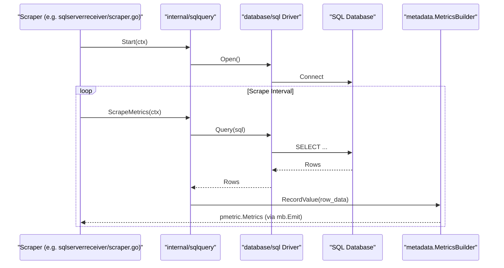
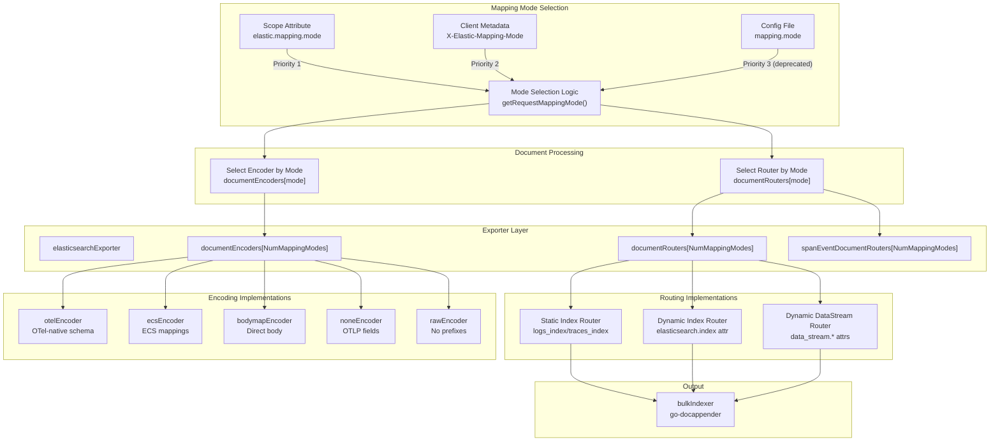
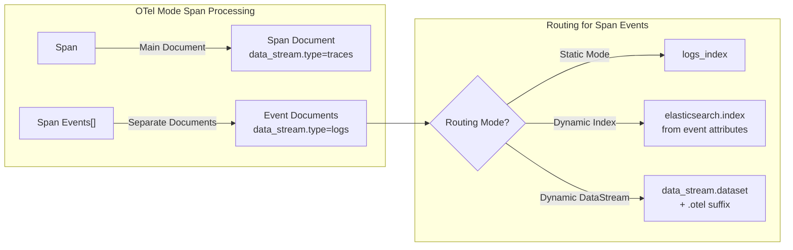
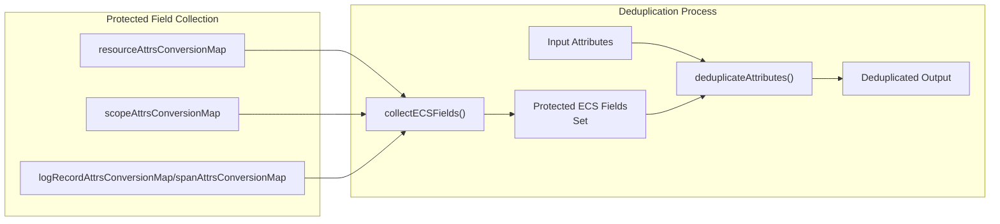
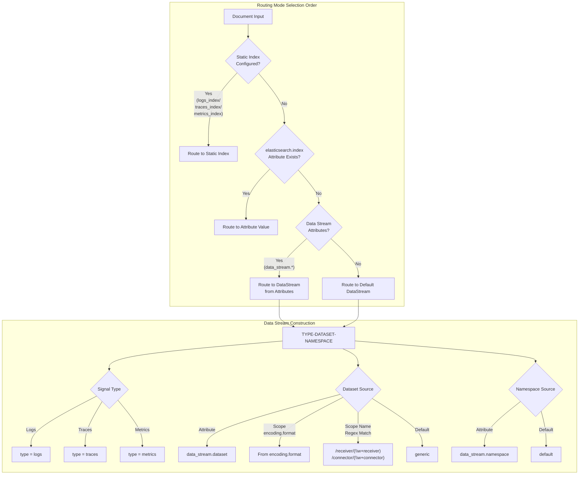
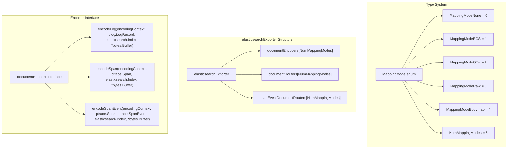

## Purpose and Scope

This document provides a detailed technical overview of the SQL database receiver components within the OpenTelemetry Collector Contrib repository. These receivers gather telemetry data, such as metrics and logs, by executing SQL queries on various supported database engines and transforming the results into OpenTelemetry metric and log signals.

The components include:

- A **generic** `sqlqueryreceiver` that provides a flexible framework to query arbitrary SQL databases using configurable drivers and custom queries.
- Several **specialized** receivers designed for popular SQL databases — namely:
  - `sqlserverreceiver` for Microsoft SQL Server,
  - `oracledbreceiver` for Oracle Database,
  - `saphanareceiver` for SAP HANA,
  - and others like `mysqlreceiver`, `postgresqlreceiver`, and `snowflakereceiver`.
- A shared internal module `internal/sqlquery` implementing common querying, scraping, and telemetry transformation logic used across these receivers.
- Dependencies on specific database drivers and supporting libraries tailored to each database engine.
- Enhanced features such as query obfuscation for security, caching of query state, and detailed resource attribute population for contextual telemetry enrichment.

This page explains the architecture, implementation details, and data flow patterns for SQL receivers and describes integration with the collector’s scraping, telemetry, and logging subsystems.

---

## Architecture Overview

The SQL receivers are organized into a hierarchy of general-purpose and specialized components, with shared infrastructure underpinning query execution and metric construction. Specialized receivers extend the generic foundation by adding database-specific queries, metadata builders, and custom handling like Windows Performance Counters or SQL query obfuscation.

```mermaid
graph TB
    subgraph "Generic Receiver"
        SQLQUERY["sqlqueryreceiver<br/>receiver/sqlqueryreceiver"]
    end

    subgraph "Specialized Receivers"
        SAPHANA["saphanareceiver<br/>receiver/saphanareceiver"]
        SQLSERVER["sqlserverreceiver<br/>receiver/sqlserverreceiver"]
        ORACLE["oracledbreceiver<br/>receiver/oracledbreceiver"]
        MYSQL["mysqlreceiver<br/>receiver/mysqlreceiver"]
        POSTGRES["postgresqlreceiver<br/>receiver/postgresqlreceiver"]
        SNOWFLAKE["snowflakereceiver<br/>receiver/snowflakereceiver"]
    end

    subgraph "Shared Infrastructure"
        INTERNAL_SQL["internal/sqlquery<br/>Query Execution Logic"]
    end

    subgraph "Database Drivers"
        HANA_DRV["github.com/SAP/go-hdb"]
        MSSQL_DRV["github.com/microsoft/go-mssqldb"]
        ORACLE_DRV["github.com/sijms/go-ora/v2"]
        MYSQL_DRV["github.com/go-sql-driver/mysql"]
        PG_DRV["github.com/lib/pq"]
        CLICK_DRV["github.com/ClickHouse/clickhouse-go/v2"]
        SNOW_DRV["github.com/snowflakedb/gosnowflake/v2"]
    end

    subgraph "Advanced Features"
        WINPERF["pkg/winperfcounters<br/>Windows Perf Counters"]
        OBFUSCATE["datadog-agent/pkg/obfuscate<br/>SQL Sanitization"]
    end

    SQLQUERY --> INTERNAL_SQL
    SAPHANA --> HANA_DRV
    SQLSERVER --> INTERNAL_SQL
    SQLSERVER --> MSSQL_DRV
    SQLSERVER --> WINPERF
    SQLSERVER --> OBFUSCATE
    ORACLE --> ORACLE_DRV
    ORACLE --> OBFUSCATE
    SNOWFLAKE --> SNOW_DRV

    SQLQUERY --> HANA_DRV
    SQLQUERY --> MSSQL_DRV
    SQLQUERY --> ORACLE_DRV
    SQLQUERY --> MYSQL_DRV
    SQLQUERY --> PG_DRV
    SQLQUERY --> CLICK_DRV

    INTERNAL_SQL --> "scraperhelper"
    INTERNAL_SQL --> "component"
```

**Sources:** [receiver/sqlqueryreceiver/go.mod:1-41](), [receiver/sqlserverreceiver/go.mod:1-37](), [receiver/saphanareceiver/go.mod:1-29](), [internal/sqlquery/go.mod:1-15](), [receiver/snowflakereceiver/go.mod:1-20]()

---

## Generic SQL Query Receiver

The `sqlqueryreceiver` represents a generic SQL telemetry receiver capable of connecting to various SQL databases through configurable drivers and executing user-defined SQL queries. It offers maximum flexibility by allowing integration with almost any SQL-based system.

### Dependency Drivers and Database Support

The `sqlqueryreceiver` includes dependencies on SQL drivers for a wide range of database engines, which enable connections using Go's database/sql package:

| Database    | Driver Package                                         | Dependency Reference                          |
|-------------|-------------------------------------------------------|-----------------------------------------------|
| ClickHouse  | `github.com/ClickHouse/clickhouse-go/v2`              | [receiver/sqlqueryreceiver/go.mod:6]()        |
| SAP HANA    | `github.com/SAP/go-hdb`                               | [receiver/sqlqueryreceiver/go.mod:7]()        |
| MySQL       | `github.com/go-sql-driver/mysql`                      | [receiver/sqlqueryreceiver/go.mod:9]()        |
| PostgreSQL  | `github.com/lib/pq`                                   | [receiver/sqlqueryreceiver/go.mod:10]()       |
| SQL Server  | `github.com/microsoft/go-mssqldb`                     | [receiver/sqlqueryreceiver/go.mod:11]()       |
| Oracle      | `github.com/sijms/go-ora/v2`                          | [receiver/sqlqueryreceiver/go.mod:18]()       |
| Snowflake   | `github.com/snowflakedb/gosnowflake/v2`               | [receiver/sqlqueryreceiver/go.mod:19]()       |
| Sybase/TDS  | `github.com/thda/tds`                                 | [receiver/sqlqueryreceiver/go.mod:22]()       |

### Internal Integration Details

- Delegates actual query execution and data transformation to the shared internal package `internal/sqlquery`.
- Utilizes `extension/storage` to maintain persistent state, such as the highest collected record index, to avoid duplicate data collection.
- Supports extraction of logs with `pkg/stanza` to process structured log data when queries return logs.
- Supports telemetry configuration for metrics emission and controls for scraping lifecycle and error handling.

**Sources:** [receiver/sqlqueryreceiver/go.mod:1-41]()

---

## Specialized Database Receivers

### SQL Server Receiver

The `sqlserverreceiver` is a specialized receiver engineered for Microsoft SQL Server telemetry collection. It has two primary data collection modes:

- **Direct Querying:** Using T-SQL queries to access SQL Server DMVs (Dynamic Management Views) and system tables for rich instrumentation data.
- **Windows Performance Counters:** On Windows environments, it optionally uses Windows Performance Counters (via `pkg/winperfcounters`) for additional insights.

#### Scraper Architecture

The core scraping component is `sqlServerScraperHelper`, which implements the `scraper.Metrics` and `scraper.Logs` interfaces. It manages database lifecycle, executes queries, and builds telemetry data for the collector pipeline:

- It maintains references to a `metadata.MetricsBuilder` and `metadata.LogsBuilder` for structured metrics and log record creation.
- It uses a SQL client abstraction (`sqlquery.DbClient`) obtained via a `clientProviderFunc` and a database connection provider (`dbProviderFunc`).
- Caches state with an LRU cache for managing metric query offsets and sample collections.
- Uses an internal obfuscator to sanitize sensitive SQL literals for logs.

```mermaid
graph LR
    subgraph "Scraper Logic (sqlserverreceiver/scraper.go)"
        SSH["sqlServerScraperHelper"]
        MB["metadata.MetricsBuilder"]
        LB["metadata.LogsBuilder"]
    end

    subgraph "Query Execution (internal/sqlquery)"
        CLIENT["sqlquery.DbClient"]
        DB["database/sql.DB"]
    end

    subgraph "Security"
        OBF["obfuscator (sqlserverreceiver/obfuscator.go)"]
    end

    SSH --> CLIENT
    CLIENT --> DB
    DB --> OBF
    OBF --> LB
    CLIENT --> MB
    MB --> "pmetric.Metrics"
    LB --> "plog.Logs"
```

**Key Features:**

- **Obfuscation:** The receiver integrates the Datadog Agent obfuscator (`datadog-agent/pkg/obfuscate`) to sanitize query literals before emitting logs to protect sensitive data.
- **Caching:** Uses the LRU cache (`*lru.Cache[string,int64]`) to track processed records and reduce redundant scrapes.
- **Specialized Queries:** Implements functions to generate key T-SQL queries for I/O, performance counters, wait stats, and query text/plans.
- **Service Instance ID:** Computes a unique identifier for the SQL Server instance to provide contextual resource attributes.

**Sources:** [receiver/sqlserverreceiver/scraper.go:41-162](), [receiver/sqlserverreceiver/metadata.yaml:1-51](), [receiver/sqlserverreceiver/go.mod:1-37]()

---

### Oracle Database Receiver

The `oracledbreceiver` collects telemetry from Oracle Database instances by querying multiple system views such as `v$sysstat`, `v$session`, and `v$resource_limit`.

- Uses the official Oracle Go driver (`github.com/sijms/go-ora/v2`).
- Collects an extensive set of system metrics including buffer cache hit ratio, CPU utilization, session counts, and wait event diagnostics.
- Generates logs and query samples by executing specialized SQL templates embedded within the receiver.
- Uses lru caching and metadata builders similar to the SQL Server receiver for efficient telemetry handling.

**Core Scraper Characteristics:**

- Executes base SQL queries for performance counters and system statistics.
- Parses and transforms results into OpenTelemetry metrics with rich resource and attribute context.
- Employs robust error aggregation and scraper helper integration.

**Sources:** [receiver/oracledbreceiver/scraper.go:37-156](), [receiver/oracledbreceiver/go.mod:1-20]()

---

### SAP HANA Receiver

The `saphanareceiver` targets SAP HANA databases and leverages the SAP official Go driver `github.com/SAP/go-hdb` to connect and fetch telemetry.

- Built on top of `scraperhelper` like other receivers.
- Supports TLS configuration and connection parameters designed for SAP HANA environments.
- Uses golden files (`pkg/golden`) and pdata testing (`pkg/pdatatest`) for rigorous output validation.

**Sources:** [receiver/saphanareceiver/go.mod:1-29]()

---

## Shared Internal Module: internal/sqlquery

The `internal/sqlquery` package provides the core querying infrastructure used by all SQL receivers. It abstracts SQL query execution, connection lifecycle, telemetry construction, and integration with the collector scraping framework.

### Key Components

- **DbClient interface:** Defines methods for query execution and result iteration abstracted for flexibility and testability.
- **ClientProviderFunc and DbProviderFunc:** Function types enabling injection of SQL clients and database connections, supporting mocking and extensibility.
- Integration with `scraperhelper` for consistent scraper lifecycle and error handling.
- Centralized telemetry builders to transform raw SQL rows into OTLP metrics and logs.

### Module Dependencies

- Depends on core collector packages like `go.opentelemetry.io/collector/pdata` for metrics and logs PDUs.
- Uses structured logging support from `go.uber.org/zap`.
- Maintains compatibility with `database/sql` and various third-party SQL drivers.

**Sources:** [internal/sqlquery/go.mod:1-15](), [receiver/sqlserverreceiver/scraper.go:43-53]()

---

## Data Flow and Metric Collection

The data flow for metric collection in specialized SQL receivers involves multiple layers from scraper logic down to database interaction and back up to telemetry emission.



- The scraper calls into internal SQL query infrastructure to obtain or create a DB connection.
- Executes configured SQL queries via the database driver.
- Receives rows streamed from the database, which are transformed into metrics and logs.
- Emits OpenTelemetry telemetry (`pmetric.Metrics`, `plog.Logs`) downstream in the collector pipeline.

**Sources:** [receiver/sqlserverreceiver/scraper.go:104-134](), [internal/sqlquery/go.mod:6-12]()

---

## Testing Infrastructure

The SQL receivers have an extensive testing framework ensuring correctness and reliability:

- **Mock Clients:** Usage of mock SQL clients (`mockClient`) and custom database provider functions to simulate various database responses without live DB dependencies.
- **Golden File Tests:** Testing actual metric and log outputs against standardized golden YAML files to ensure consistency and detect regressions.
- **Integration Testing:** Incorporation of `testcontainers-go` to spin up real database containers (such as MSSQL servers) for end-to-end validation in CI pipelines.
- **Feature Gate Tests:** Testing specific feature toggles such as attribute overrides and resource attribute inclusion.
- **Metadata Validation:** Automated verification of generated metrics and logs against `metadata.yaml` schemas using `metadata.MetricsBuilder` and `metadata.LogsBuilder` generated test code.

This extensive testing suite validates behavior across different configurations, query results, and database versions to maintain high quality output.

**Sources:** [receiver/sqlserverreceiver/scraper_test.go:1-160](), [receiver/sqlserverreceiver/metadata.yaml:11-20](), [receiver/sqlserverreceiver/go.mod:13-16]()

---

# Summary

The SQL database receivers within OpenTelemetry Collector Contrib form a layered, extensible system capable of collecting telemetry from a variety of SQL databases. The generic `sqlqueryreceiver` provides a flexible foundation for querying arbitrary databases, while specialized receivers for SQL Server, Oracle, and SAP HANA extend this core with domain-specific queries and telemetry construction features. The shared `internal/sqlquery` module encapsulates common logic to enable consistency and code reuse.

This architecture and implementation approach facilitates secure, robust, and extensible SQL telemetry collection suitable for enterprise observability pipelines.

---

# References

- Generic SQL Query Receiver Dependencies: [receiver/sqlqueryreceiver/go.mod:1-41]()
- SQL Server Receiver Code & Metadata: [receiver/sqlserverreceiver/scraper.go:41-162](), [receiver/sqlserverreceiver/metadata.yaml:1-51](), [receiver/sqlserverreceiver/go.mod:1-37]()
- Oracle DB Receiver Code: [receiver/oracledbreceiver/scraper.go:37-156](), [receiver/oracledbreceiver/go.mod:1-20]()
- SAP HANA Receiver Dependencies: [receiver/saphanareceiver/go.mod:1-29]()
- Shared Internal SQL Query Module: [internal/sqlquery/go.mod:1-15]()
- Testing for SQL Server Receiver: [receiver/sqlserverreceiver/scraper_test.go:1-160]()

# Elasticsearch Exporter and Mapping Modes


## Purpose and Scope

This document describes the Elasticsearch exporter's mapping modes and document routing mechanisms. It explains how OpenTelemetry telemetry data (logs, traces, metrics, profiles) is transformed into Elasticsearch documents and routed to appropriate indices or data streams.

The exporter is API-compatible with Elasticsearch 7.17.x, 8.x, and 9.x [exporter/elasticsearchexporter/README.md:19-21]().

## Mapping Modes Overview

The Elasticsearch exporter supports five mapping modes that control how telemetry data is transformed into Elasticsearch document structures. The mapping mode determines field naming conventions, document structure, and schema compatibility.

| Mapping Mode | Logs | Traces | Metrics | Profiles | Description |
|--------------|------|--------|---------|----------|-------------|
| `otel` | ✓ | ✓ | ✓ | ✓ | OTel-native schema (default, recommended) |
| `ecs` | ✓ | ✓ | ✓ | ✗ | Elastic Common Schema compatibility |
| `bodymap` | ✓ | ✗ | ✗ | ✗ | Direct body mapping for logs |
| `none` | ✓ | ✓ | ✗ | ✗ | Original OTLP field names |
| `raw` | ✓ | ✓ | ✗ | ✗ | Like `none` without prefixes |

The mapping mode is determined by (in order of precedence):
1. Scope attribute `elastic.mapping.mode` [exporter/elasticsearchexporter/exporter.go:117-118]()
2. Client metadata header `X-Elastic-Mapping-Mode` [exporter/elasticsearchexporter/exporter.go:105-108]()
3. Configuration file setting `mapping.mode` (deprecated) [exporter/elasticsearchexporter/config.go:140-141]()

Sources: [exporter/elasticsearchexporter/README.md:169-195](), [exporter/elasticsearchexporter/config.go:135-156](), [exporter/elasticsearchexporter/exporter.go:99-118]()

## Mapping Mode Architecture



**Diagram: Mapping Mode Selection and Document Processing Architecture**

The exporter maintains arrays of encoders and routers indexed by mapping mode enum values [exporter/elasticsearchexporter/exporter.go:43-45](). When processing telemetry data, the exporter selects the appropriate encoder and router based on the resolved mapping mode [exporter/elasticsearchexporter/exporter.go:121-123]().

Sources: [exporter/elasticsearchexporter/exporter.go:33-48](), [exporter/elasticsearchexporter/exporter.go:99-118](), [exporter/elasticsearchexporter/exporter.go:121-123]()

## OTel Mapping Mode (Default)

The `otel` mapping mode is the default and recommended mode. It produces documents in Elastic's "OTel-native" schema, preserving original OTLP attribute names and structure.

### Key Characteristics

- **Requires:** Elasticsearch 8.12+ (uses `require_data_stream` bulk API parameter) [exporter/elasticsearchexporter/README.md:236-238]()
- **Optimal with:** Elasticsearch 8.16+ (contains built-in `otel-data` plugin) [exporter/elasticsearchexporter/README.md:240-241]()
- **Attribute Preservation:** Attributes stored under `attributes.*` namespace [exporter/elasticsearchexporter/README.md:250-252]()
- **Data Stream Fields:** `data_stream.type`, `data_stream.dataset`, `data_stream.namespace` placed at document root [exporter/elasticsearchexporter/README.md:253-255]()
- **Span Events:** Stored as separate documents with `data_stream.type: logs` [exporter/elasticsearchexporter/README.md:256-258]()
- **Dataset Suffix:** Automatically appends `.otel` to `data_stream.dataset` [exporter/elasticsearchexporter/README.md:161-162]()

### Document Structure Example

```json
{
  "@timestamp": "2023-04-19T03:04:05.000000006Z",
  "attributes": {
    "attr.foo": "attr.foo.value"
  },
  "data_stream": {
    "dataset": "attr.dataset.otel",
    "namespace": "resource.attribute.namespace",
    "type": "logs"
  },
  "observed_timestamp": "0.0",
  "resource": {
    "attributes": {
      "resource.attr.foo": "resource.attr.foo.value"
    }
  },
  "scope": {},
  "body": {
    "text": "foo"
  }
}
```

Sources: [exporter/elasticsearchexporter/README.md:236-266](), [exporter/elasticsearchexporter/exporter_test.go:415-421]()

### Span Event Handling



**Diagram: OTel Mode Span Event Document Routing**

In OTel mode, span events are extracted and indexed as separate log documents. This enables querying span events independently while maintaining their association with the parent span [exporter/elasticsearchexporter/model.go:135]().

Sources: [exporter/elasticsearchexporter/README.md:256-258](), [exporter/elasticsearchexporter/README.md:158-162](), [exporter/elasticsearchexporter/model.go:135]()

## ECS Mapping Mode

The `ecs` mapping mode transforms OpenTelemetry Semantic Conventions to Elastic Common Schema (ECS) field names for compatibility with existing Elasticsearch dashboards and queries.

### Attribute Conversion Maps

```mermaid
graph TB
    subgraph "Conversion Process"
        OTEL_ATTR["OTel Semantic Convention<br/>Attributes"]
        CONV_MAPS["Conversion Maps"]
        ECS_FIELDS["ECS Field Names"]
        PROTECTED["Protected ECS Fields"]

        OTEL_ATTR --> CONV_MAPS
        CONV_MAPS --> ECS_FIELDS
        CONV_MAPS --> PROTECTED
    end

    subgraph "Resource Attribute Conversions"
        R1["service.instance.id → service.node.name"]
        R2["deployment.environment → service.environment"]
        R3["host.name → host.hostname"]
        R4["k8s.pod.name → kubernetes.pod.name"]
        R5["cloud.platform → cloud.service.name"]
    end

    subgraph "Log Record Attribute Conversions"
        L1["event.name → event.action"]
        L2["exception.message → error.message"]
        L3["exception.stacktrace → error.stacktrace"]
        L4["exception.type → error.type"]
    end

    subgraph "Span Attribute Conversions"
        S1["db.system → span.db.type"]
        S2["db.namespace → span.db.instance"]
        S3["db.query.text → span.db.statement"]
    end

    CONV_MAPS --> R1
    CONV_MAPS --> R2
    CONV_MAPS --> R3
    CONV_MAPS --> R4
    CONV_MAPS --> R5
    CONV_MAPS --> L1
    CONV_MAPS --> L2
    CONV_MAPS --> L3
    CONV_MAPS --> L4
    CONV_MAPS --> S1
    CONV_MAPS --> S2
    CONV_MAPS --> S3
```



**Diagram: ECS Mode Attribute Conversion Pipeline**

The ECS mode uses three conversion maps defined in `model.go`:
- `resourceAttrsConversionMap` - Resource-level conversions [exporter/elasticsearchexporter/model.go:55-94]()
- `logRecordAttrsConversionMap` - Log record attribute conversions [exporter/elasticsearchexporter/model.go:99-106]()
- `spanAttrsConversionMap` - Span attribute conversions [exporter/elasticsearchexporter/model.go:108-113]()

Sources: [exporter/elasticsearchexporter/model.go:49-94](), [exporter/elasticsearchexporter/model.go:96-113]()

### Deduplication and Dedotting

ECS mode applies two transformations:

1. **Dedotting:** Converts dotted keys to nested objects.
2. **Deduplication:** Removes duplicate fields to prevent Elasticsearch parsing errors.

The deduplication process protects ECS target fields from being overwritten:



**Diagram: ECS Deduplication Pipeline**

Protected ECS fields are pre-computed at initialization for performance [exporter/elasticsearchexporter/model.go:116-127]().

Sources: [exporter/elasticsearchexporter/model.go:35-47](), [exporter/elasticsearchexporter/README.md:224-248]()

## Bodymap Mapping Mode

The `bodymap` mode is specialized for log records only. It directly uses the log record's body field as the complete Elasticsearch document without transformation.

### Constraints and Behavior

- **Logs Only:** Traces, metrics, and profiles are not supported [exporter/elasticsearchexporter/README.md:294-299]()
- **Body Type Requirement:** Log body must be a map (`pcommon.ValueTypeMap`) [exporter/elasticsearchexporter/model.go:129]()
- **Invalid Bodies:** Non-map bodies are dropped with a warning [exporter/elasticsearchexporter/exporter.go:138-141]()

### Special Data Stream Handling

In bodymap mode, the `data_stream.type` field can be dynamically set from attributes (valid values: `logs`, `metrics`) [exporter/elasticsearchexporter/README.md:110]().

Sources: [exporter/elasticsearchexporter/README.md:108-111](), [exporter/elasticsearchexporter/exporter_test.go:99-191]()

## None and Raw Mapping Modes

The `none` and `raw` modes preserve original OTLP field names with minimal transformation.

| Aspect | `none` Mode | `raw` Mode |
|--------|-------------|------------|
| Attribute Prefix | `Attributes.` | No prefix |
| Span Events Prefix | `Events.` | No prefix |
| Field Structure | Nested | Nested |

Sources: [exporter/elasticsearchexporter/README.md:301-327](), [exporter/elasticsearchexporter/model_test.go:37-38]()

## Document Routing System

The Elasticsearch exporter provides three routing modes that determine the target index or data stream for documents.



**Diagram: Document Routing Decision Tree**

### Index Name Sanitization

Data stream names are sanitized to comply with Elasticsearch requirements [exporter/elasticsearchexporter/data_stream_router.go:63-83]():
- Converts to lowercase.
- Replaces invalid characters (`\/*?"<>| ,#:`) with underscores.

Sources: [exporter/elasticsearchexporter/README.md:103-118](), [exporter/elasticsearchexporter/data_stream_router.go:63-83]()

## Encoder and Router Implementation



**Diagram: Encoder and Router Type System**

Implementations are stored in arrays indexed by `MappingMode` enum [exporter/elasticsearchexporter/exporter.go:43-45]().

Sources: [exporter/elasticsearchexporter/model.go:132-137](), [exporter/elasticsearchexporter/exporter.go:43-46]()

## Bulk Indexing and Error Handling

The exporter uses `go-docappender` for bulk indexing strategies [exporter/elasticsearchexporter/bulkindexer.go:20]().

### Queuing and Batching

Default async batching configuration [exporter/elasticsearchexporter/README.md:88-99]():
- `num_consumers`: 10
- `flush_timeout`: 10s
- `min_size`: 1MB
- `max_size`: 5MB

### Error Handling and Retries

The exporter implements sophisticated retry logic for bulk requests:
- **Default Max Retries:** 2 [exporter/elasticsearchexporter/bulkindexer.go:62]().
- **Retry Status Codes:** Configurable via `retry_on_status` [exporter/elasticsearchexporter/bulkindexer.go:102]().
- **Error Hints:** Provides specific hints for known issues like OTel mapping requiring Elasticsearch 8.12+ [exporter/elasticsearchexporter/bulkindexer.go:64-73]().

Sources: [exporter/elasticsearchexporter/README.md:82-101](), [exporter/elasticsearchexporter/bulkindexer.go:62-110]()

## Integration Testing

The exporter includes comprehensive integration tests [exporter/elasticsearchexporter/integrationtest/go.mod:1-8](). These tests use `testbed` and `filestorage` to validate data flow and mapping correctness against live or mocked Elasticsearch instances [exporter/elasticsearchexporter/integrationtest/go.mod:9-12]().

Sources: [exporter/elasticsearchexporter/integrationtest/go.mod:1-36]()