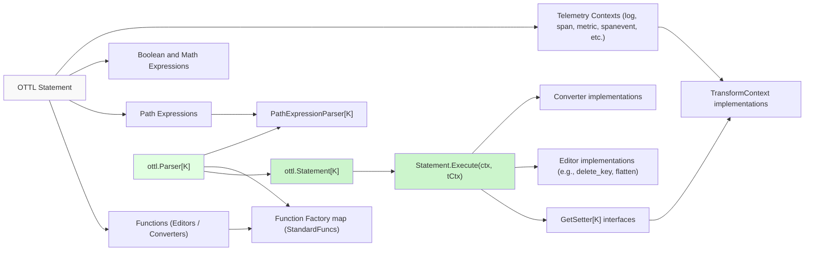
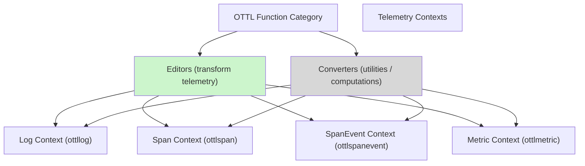

This diagram illustrates the transition from a high-level OTTL statement specification in natural language form to the corresponding code entities involved in parsing, runtime path resolution, and execution of editing or converter functions within specific telemetry contexts.

---

# Summary Diagram: Function Categories and Context Usage

This diagram maps the two primary function types in OTTL—Editors and Converters—and their applicability within different telemetry contexts supported by the Collector's transformations.

---