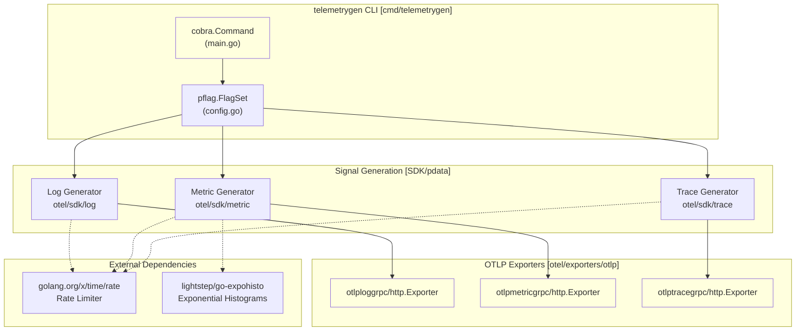
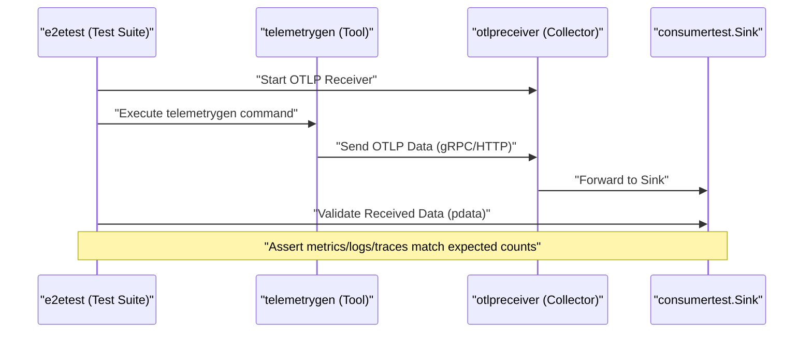
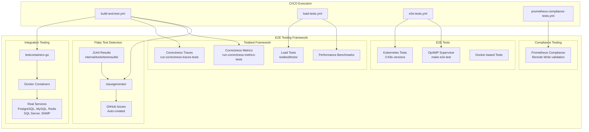
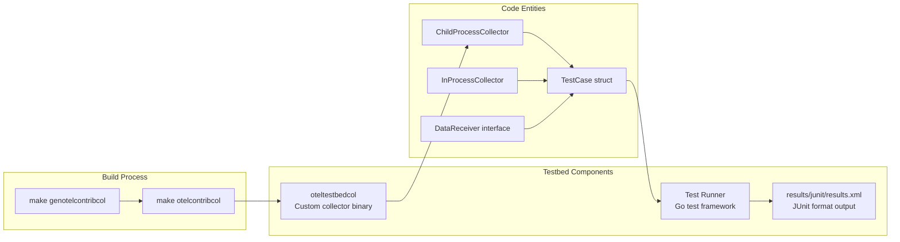
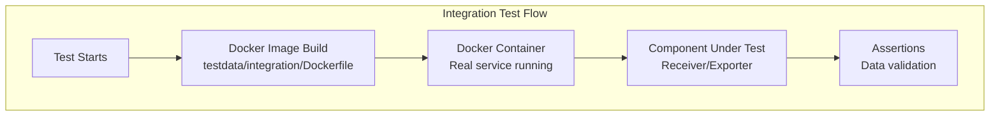
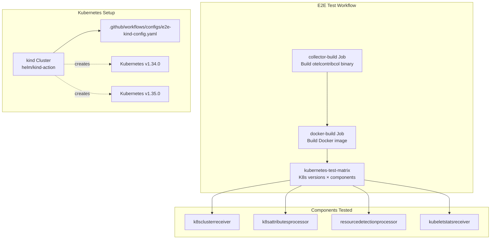
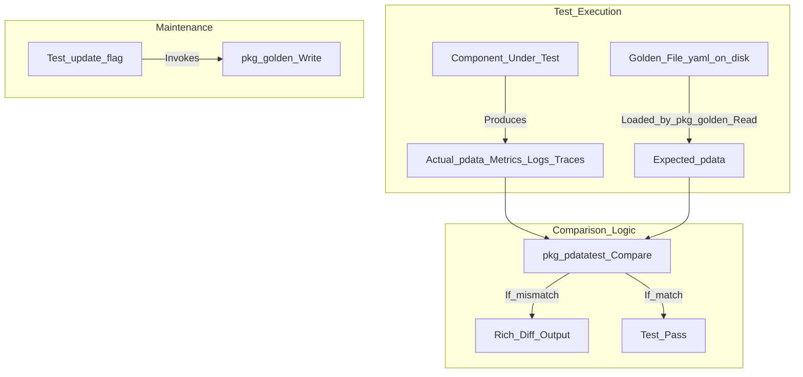
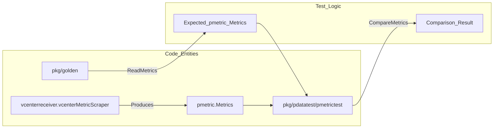

## Purpose and Scope

The `telemetrygen` tool is a command-line utility for generating synthetic OpenTelemetry data (logs, metrics, and traces) to test collector components, validate data pipelines, and perform load testing. It exports telemetry via OTLP over gRPC or HTTP, making it essential for development, testing, and benchmarking scenarios. It is maintained as a separate module within the `opentelemetry-collector-contrib` repository to facilitate easy installation and avoid circular dependencies.

**Sources:** [cmd/telemetrygen/go.mod:1-30](), [cmd/telemetrygen/internal/e2etest/go.mod:1-15]()

## Architecture Overview

The `telemetrygen` tool is structured as a standalone CLI application built on the `spf13/cobra` framework [cmd/telemetrygen/go.mod:7](). It utilizes the OpenTelemetry Go SDK to generate telemetry data and exports it using official OTLP exporters. The tool supports batching, rate limiting, and configurable durations for telemetry generation.

### System Architecture and Code Entities

The following diagram maps the logical components of the generator to their respective code entities and dependencies.



**Sources:** [cmd/telemetrygen/go.mod:5-30](), [cmd/telemetrygen/pkg/metrics/config.go:40-55](), [cmd/telemetrygen/pkg/metrics/worker.go:14-20]()

## Installation and Deployment

### Go Install
The module is specifically configured to be compatible with `go install`. To maintain this compatibility, the `go.mod` file explicitly forbids `replace` statements to ensure that external users can install the tool without needing the entire monorepo structure.

```bash
go install github.com/open-telemetry/opentelemetry-collector-contrib/cmd/telemetrygen@latest
```

**Sources:** [cmd/telemetrygen/go.mod:65-66]()

### Docker Support
The tool can be containerized using the provided Dockerfile, which uses a multi-stage build starting from `alpine` for certificates and resulting in a minimal `scratch` image.

**Sources:** [cmd/telemetrygen/Dockerfile:1-17]()

## Signal Generation Capabilities

`telemetrygen` supports three primary signal types with specific sub-commands: `traces`, `metrics`, and `logs`.

### Batching and Throttling
All signals support batching and rate control through common flags. The `worker` struct in each package manages the simulation loop and enforces these constraints.

* **Rate Limiting**: Implemented using `golang.org/x/time/rate`. [cmd/telemetrygen/pkg/metrics/worker.go:100]()
* **Throttling**: If `--rate` is set to 0, generation is unthrottled (`rate.Inf`). [cmd/telemetrygen/pkg/metrics/metrics.go:54-56]()
* **Batching**: Controlled by `--batch` and `--batch-size`. [cmd/telemetrygen/pkg/logs/worker.go:40-43]()
* **Load Simulation**: Users can specify `--load-size` to append a desired number of string attributes to each signal to increase payload size. [cmd/telemetrygen/pkg/metrics/worker.go:112-116]()

### Signal-Specific Details

| Signal | Command | Key Implementation | Support |
| :--- | :--- | :--- | :--- |
| **Traces** | `traces` | `otel/sdk/trace` | Generates spans with configurable attributes. [cmd/telemetrygen/pkg/traces/config.go:21-28]() |
| **Metrics** | `metrics` | `otel/sdk/metric` | Supports counters, gauges, histograms, and exponential histograms. [cmd/telemetrygen/pkg/metrics/worker.go:123-202]() |
| **Logs** | `logs` | `otel/sdk/log` | Generates log records with configurable severity and body. [cmd/telemetrygen/pkg/logs/logs.go:156-191]() |

**Sources:** [cmd/telemetrygen/pkg/metrics/worker.go:123-202](), [cmd/telemetrygen/pkg/logs/logs.go:156-191](), [cmd/telemetrygen/pkg/metrics/metrics.go:53-60]()

### Exponential Histogram Support

The `telemetrygen` tool supports generating metrics as `ExponentialHistogram` types. This is implemented in the `metrics` package, specifically within the `worker.simulateMetrics` function [cmd/telemetrygen/pkg/metrics/worker.go:182](). When `MetricTypeExponentialHistogram` is selected, the tool uses the `github.com/lightstep/go-expohisto` library to generate realistic exponential histogram data.

A `structure.Float64` histogram is created, updated with random values, and then converted into an `ExponentialHistogramDataPoint` for export via the `expoHistToSDKExponentialDataPoint` utility.

**Sources:** [cmd/telemetrygen/pkg/metrics/worker.go:182-202](), [cmd/telemetrygen/pkg/metrics/config.go:51](), [cmd/telemetrygen/go.mod:6]()

## OTLP Export Protocols

The tool supports both gRPC and HTTP/JSON protocols for exporting OTLP data.

| Protocol | Flag | Default Port | Exporter Implementation |
| :--- | :--- | :--- | :--- |
| **gRPC** | (Default) | 4317 | `otlptracegrpc`, `otlpmetricgrpc`, `otlploggrpc` |
| **HTTP** | `--otlp-http` | 4318 | `otlptracehttp`, `otlpmetrichttp`, `otlploghttp` |

The `createExporter` function in each signal's package is responsible for instantiating the correct OTLP exporter based on the configuration.

**Sources:** [cmd/telemetrygen/pkg/metrics/metrics.go:125-155](), [cmd/telemetrygen/pkg/logs/logs.go:124-154](), [cmd/telemetrygen/pkg/traces/traces.go:124-154]()

## End-to-End Testing (e2etest)

The `e2etest` module within `cmd/telemetrygen/internal/e2etest` is used to validate the tool itself. It sets up a local OTLP receiver and ensures that the data generated by `telemetrygen` is correctly received and parsed.

### E2E Test Flow



### Test Dependencies
The E2E suite relies on core collector testing utilities to provide a realistic environment without a full collector binary.

* `otlpreceiver`: Used to listen for generated data [cmd/telemetrygen/internal/e2etest/go.mod:13]().
* `consumertest`: Provides the `Sink` to capture and inspect `pdata` [cmd/telemetrygen/internal/e2etest/go.mod:12]().
* `componenttest`: Manages the lifecycle of test components [cmd/telemetrygen/internal/e2etest/go.mod:9]().

**Sources:** [cmd/telemetrygen/internal/e2etest/go.mod:1-15]()

## Configuration Summary

The tool is configured primarily via CLI flags, which are mapped to internal structures. Each signal type (metrics, logs, traces) has its own `Config` struct that embeds a common `config.Config` for shared options.

| Flag Category | Examples | Purpose |
| :--- | :--- | :--- |
| **Connection** | `--otlp-endpoint`, `--otlp-insecure` | Define target and security settings. |
| **Load** | `--rate`, `--workers`, `--duration` | Control the volume and concurrency of data. |
| **Protocol** | `--otlp-http`, `--otlp-header` | Toggle between gRPC/HTTP and add metadata. |
| **Signal** | `--metrics`, `--logs`, `--traces` | Set the total count for finite runs. |
| **Metrics Specific** | `--metric-type`, `--aggregation-temporality`, `--unique-timeseries` | Configure metric type, temporality, and unique timeseries generation. [cmd/telemetrygen/pkg/metrics/config.go:45-54]() |
| **Logs Specific** | `--severity-text`, `--severity-number` | Configure log severity. [cmd/telemetrygen/pkg/logs/logs.go:156-160]() |
| **Common** | `--timeout`, `--load-size`, `--allow-export-failures` | Set export timeout, add load to attributes, and control error handling. [cmd/telemetrygen/pkg/metrics/metrics.go:90-93]() |

The `Validate()` method ensures that the provided configuration is valid, checking for mutually exclusive options or invalid values. For example, `metrics.Config.Validate` checks for valid TraceID and SpanID exemplars.

**Sources:** [cmd/telemetrygen/pkg/metrics/config.go:21-30](), [cmd/telemetrygen/pkg/metrics/config.go:80-102](), [cmd/telemetrygen/pkg/logs/config.go:21-29](), [cmd/telemetrygen/pkg/traces/config.go:21-28]()

# End-to-End Testing Framework


The End-to-End Testing Framework provides comprehensive validation of OpenTelemetry Collector Contrib components through multiple testing layers: integration tests using real service containers, correctness validation for telemetry data, load/performance testing via the testbed framework, and Kubernetes-based end-to-end scenarios. This framework ensures components function correctly in realistic environments before merging changes.

For synthetic telemetry generation used across these tests, see [Telemetry Generator (telemetrygen)](13.1).

## Testing Layers Overview



**Sources**: [.github/workflows/build-and-test.yml:1-166](), [.github/workflows/e2e-tests.yml:1-168](), [.github/workflows/load-tests.yml:1-126](), [.github/workflows/prometheus-compliance-tests.yml:1-87]()

## Testbed Framework

The testbed framework provides load testing and correctness validation capabilities for collector components. It generates synthetic telemetry data and measures performance metrics like CPU, memory, and throughput.

### Testbed Architecture

The testbed relies on a specialized collector binary, `oteltestbedcol`, which is generated specifically for testing scenarios [.github/workflows/build-and-test.yml:45-45](). The framework uses several abstractions to orchestrate tests:
* `TestCase`: Defines the lifecycle of a single test run [testbed/testbed/test_case.go:17-40]().
* `DataReceiver`: Represents the component receiving data from the collector [testbed/testbed/receivers.go:20-30]().
* `MockBackend`: Provides a simulated backend for the collector to export to [testbed/testbed/mock_backend.go:23-40]().



### Correctness Tests

Correctness tests validate that telemetry data (traces and metrics) flows through the collector pipeline without corruption or data loss.

*   **Trace Correctness**: Validates trace data integrity and span relationships [testbed/tests/trace_test.go:23-50]().
*   **Metric Correctness**: Validates metric values and label accuracy [testbed/tests/metric_test.go:24-50]().
*   **Log Correctness**: Validates log record preservation and body content [testbed/tests/log_test.go:24-50]().
*   **Scenario Validation**: Uses `scenarios.go` to define standard data flow patterns for cross-component validation [testbed/tests/scenarios.go:15-40]().

**Sources**: [testbed/testbed/child_process_collector.go:19-40](), [testbed/testbed/in_process_collector.go:18-30](), [testbed/testbed/test_case.go:17-40](), [testbed/testbed/validator.go:19-50]()

### Load Testing and Benchmark Tracking

Load tests execute on dedicated high-performance hardware and run on a schedule to track performance regressions.

| Configuration | Value |
|--------------|-------|
| Schedule | `27 0,12 * * *` (twice daily) [.github/workflows/load-tests.yml:9-9]() |
| Benchmark History | GitHub Pages (benchmarks branch) [.github/workflows/load-tests.yml:121-121]() |
| Result Output | `results/junit/results.xml` [.github/workflows/build-and-test.yml:19-19]() |

The `update-benchmarks` job aggregates results and uses the `github-action-benchmark` to maintain a performance history chart [.github/workflows/load-tests.yml:100-126]().

**Sources**: [.github/workflows/load-tests.yml:1-130](), [.github/workflows/build-and-test.yml:19-22]()

## Integration Testing with Containers

Integration tests validate components against real external services using Docker containers.

### Container Integration Pattern

Components often include `testdata/integration` directories containing `Dockerfiles` for their dependencies:
* **Redis**: Uses `Dockerfile.cluster` for cluster-mode testing.
* **SQL Server**: Specialized images for `sqlqueryreceiver`.
* **MongoDB**: Supports multiple versions (6.0, 7.0) for compatibility testing.



**Sources**: [processor/resourcedetectionprocessor/go.mod:20-28](), [receiver/awscontainerinsightreceiver/go.mod:9-16]()

## E2E Testing Infrastructure

End-to-end tests validate complete workflows in realistic deployment environments, particularly Kubernetes clusters using `kind`.

### Kubernetes E2E Test Architecture

The framework uses `kind` (Kubernetes in Docker) to create local clusters for testing. It leverages a matrix strategy to test against multiple Kubernetes versions.



The `kubernetes-test-matrix` job runs tests for various Kubernetes-related components (e.g., `k8sclusterreceiver`, `k8sattributesprocessor`, `resourcedetectionprocessor`) against Kubernetes versions `v1.34.0` and `v1.35.0` [.github/workflows/e2e-tests.yml:101-118](). It loads the locally built `otelcontribcol:latest` image into the `kind` cluster before execution [.github/workflows/e2e-tests.yml:143-145]().

**Sources**: [.github/workflows/e2e-tests.yml:101-151]()

### OpAMP Supervisor E2E Tests

The OpAMP supervisor manages collector instances. E2E tests validate its ability to start and manage collectors using the `make e2e-test` target in the `cmd/opampsupervisor` directory [.github/workflows/e2e-tests.yml:58-61]().

**Sources**: [.github/workflows/e2e-tests.yml:44-63]()

## Golden File Testing Approach

The framework uses a "golden file" approach for output validation via `pkg/golden` and `pkg/pdatatest`. This allows developers to compare complex protocol data structures (metrics, logs, traces) against expected YAML representations stored in the repository.

1.  **Generation**: Developers use `cmd/golden` to generate or update expected output files [.github/workflows/golden.yml:1-20]().
2.  **Validation**: CI runs `make gotest` which compares current component output against the stored golden YAML.
3.  **Diffing**: The framework provides rich diffing to pinpoint exactly which attribute or value changed.

**Sources**: [.github/workflows/golden.yml:1-50](), [processor/resourcedetectionprocessor/go.mod:24-25]()

## Flaky Test Detection and Issue Generation

Intermittent failures are tracked automatically. If a test fails on the `main` branch, the `issuegenerator` tool analyzes JUnit XML results and opens a GitHub issue.

*   **Platform Specifics**: Issues are generated for Windows ARM/x64 [.github/workflows/build-and-test-windows.yml:149-173]() and Linux ARM [.github/workflows/build-and-test-arm.yml:109-130]().
*   **Automation**: The `issuegenerator` tool is invoked with labels `flaky tests,needs triage` [.github/workflows/build-and-test-windows.yml:172-172]().
*   **JUnit Path**: Results are collected from `internal/tools/testresults/` [.github/workflows/build-and-test-arm.yml:124-124]().

**Sources**: [.github/workflows/build-and-test-windows.yml:149-173](), [.github/workflows/build-and-test-arm.yml:109-131]()

# Test Utilities: Golden Files and pdatatest


Testing OpenTelemetry Collector components requires robust mechanisms for comparing complex, nested protocol data (`pdata`) structures and maintaining expected output states. The `opentelemetry-collector-contrib` repository provides two primary utilities for this purpose:

- **`pkg/golden`**: For managing the reading and writing of expected telemetry output files in YAML format, known as "Golden Files".
- **`pkg/pdatatest`**: For performing rich semantic comparisons of `pdata` structures (metrics, logs, traces, profiles) with detailed diff outputs.

This page documents these packages in technical detail, their data flow, key APIs, and their usage together in component integration tests within the contrib repository.

---

## Overview and Data Flow

Integration tests often generate telemetry data as `pdata` structures via receiver or processor components under test. To verify correctness, these outputs are compared against previously saved golden files representing the expected state.

Title: "Golden File Comparison Data Flow"


**Data Flow Details:**
- Tests run the collector component pipeline (e.g., `vcenterreceiver`) generating real telemetry data as `pdata` [receiver/vcenterreceiver/scraper.go:134-147]().
- The golden file is read from disk into expected `pdata` for deterministic comparison [receiver/vcenterreceiver/scraper_test.go:88-89]().
- `pkg/pdatatest` compares the actual to expected data with options to ignore volatile fields like timestamps [receiver/vcenterreceiver/scraper_test.go:90-95]().
- On failure, clear diff output helps developers triage unexpected changes.
- Updating golden files is automated with a flag, facilitating intentional baseline changes.

**Sources:** [receiver/vcenterreceiver/scraper.go:134-147](), [receiver/vcenterreceiver/scraper_test.go:88-95]()

---

## pkg/golden: Golden File Management

The `pkg/golden` package provides utilities to **serialize and deserialize telemetry data in YAML form**, serving as stable baseline files for integration tests. It is a frequent dependency for receivers like `saphanareceiver` [receiver/saphanareceiver/go.mod:8-8](), `sqlserverreceiver` [receiver/sqlserverreceiver/go.mod:12-12](), and `snowflakereceiver` [receiver/snowflakereceiver/go.mod:8-8]().

### Responsibilities

- **Reading Golden Files**: Parses YAML files containing expected OTLP telemetry data and converts them into in-memory `pdata` objects [receiver/vcenterreceiver/scraper_test.go:88-89]().
- **Writing Golden Files**: Serializes `pdata` objects into stable, human-readable YAML to update expected outputs with the test `-update` flag.
- **Supports Multiple Signals**: Metrics, traces, logs, and profiles are supported formats for input/output.

### Key Functions

The package provides specialized functions for each telemetry signal type:
- `ReadMetrics(path string) (pmetric.Metrics, error)`
- `ReadTraces(path string) (ptrace.Traces, error)`
- `ReadLogs(path string) (plog.Logs, error)`
- `WriteMetrics(path string, md pmetric.Metrics) error`
- `WriteTraces(path string, td ptrace.Traces) error`
- `WriteLogs(path string, ld plog.Logs) error`

These functions abstract YAML file IO and conversion to internal representations.

### Test Integration and Usage

- Components produce `pdata` structs during scraping or data processing.
- Tests call `golden.ReadMetrics()` (or analogous functions) to load the baseline file.
- The golden files reside under the component’s `testdata` directory, e.g., `receiver/vcenterreceiver/testdata/metrics/expected.yaml` [receiver/vcenterreceiver/testdata/metrics/expected.yaml:1-10]().

**Sources:** [receiver/saphanareceiver/go.mod:8-8](), [receiver/sqlserverreceiver/go.mod:12-12](), [receiver/snowflakereceiver/go.mod:8-8](), [receiver/vcenterreceiver/scraper_test.go:88-89]()

---

## pkg/pdatatest: Semantic pdata Comparison

Simply using deep equality (`reflect.DeepEqual`) for OpenTelemetry data is often inadequate because of fields that naturally differ per run: timestamps, IDs, and resource ordering. `pkg/pdatatest` provides **rich, semantic comparators** to compare `pdata` structures intelligently.

### Supported Signals and Comparison Entry Points

| Signal Type | Comparison Sub-package | Description |
|-------------|---------------------|-------------|
| Traces      | `ptracetest` | Compares ResourceSpans, ScopeSpans, and Spans |
| Metrics     | `pmetrictest` | Compares ResourceMetrics, ScopeMetrics, and Metric DataPoints [receiver/vcenterreceiver/scraper_test.go:90-95]() |
| Logs        | `plogtest` | Compares ResourceLogs, ScopeLogs, and LogRecords |

### Comparison Options

Comparison is flexible with modular options:

- **IgnoreTimestamps()**: Ignores timestamp fields (`Timestamp`, `StartTimestamp`, `ObservedTimestamp`) to avoid false mismatches [receiver/vcenterreceiver/scraper_test.go:91-92]().
- **IgnoreResourceMetricsOrder()**: Ignores ordering of resources for stable comparisons [receiver/vcenterreceiver/scraper_test.go:93-93]().
- **IgnoreMetricDataPointsOrder()**: Ignores ordering of data points within metrics [receiver/vcenterreceiver/scraper_test.go:94-94]().

### Example API Usage

```go
// Example from vcenterreceiver scraper test
err := pmetrictest.CompareMetrics(expectedMetrics, actualMetrics,
    pmetrictest.IgnoreStartTimestamp(),
    pmetrictest.IgnoreTimestamp(),
    pmetrictest.IgnoreResourceMetricsOrder(),
    pmetrictest.IgnoreMetricDataPointsOrder(),
)
```

**Sources:** [receiver/vcenterreceiver/scraper_test.go:90-95](), [receiver/sqlqueryreceiver/go.mod:16-16](), [receiver/saphanareceiver/go.mod:9-9]()

---

## Integration in Component Tests

The `pkg/golden` and `pkg/pdatatest` packages are heavily used together in integration tests across the repository, particularly for complex receivers like `vcenterreceiver`.

### Integration Test Lifecycle

1. The collector component (e.g., `vcenterreceiver`) is instantiated and performs a scrape [receiver/vcenterreceiver/scraper.go:134-147]().
2. The component produces `pdata` structs (e.g., `pmetric.Metrics`) [receiver/vcenterreceiver/scraper.go:146-146]().
3. The test calls `golden.ReadMetrics()` to load the expected data from golden YAML files in `testdata/` [receiver/vcenterreceiver/scraper_test.go:88-89]().
4. `pmetrictest.CompareMetrics()` (from `pkg/pdatatest`) compares the actual against the expected, ignoring volatile fields [receiver/vcenterreceiver/scraper_test.go:91-95]().
5. On failure, a detailed diff is output via the returned error.

Title: "Integration Test Entity Mapping"


### Component Ownership and Maintenance
Components like `vcenterreceiver` that use these utilities are owned by their respective active maintainers [receiver/vcenterreceiver/metadata.yaml:11-13](). The `pdatatest` package is a shared utility required by numerous database receivers to ensure consistency across complex SQL-based metrics [receiver/sqlqueryreceiver/go.mod:16-16]().

**Sources:** [receiver/vcenterreceiver/scraper_test.go:79-97](), [receiver/vcenterreceiver/metadata.yaml:11-13](), [receiver/sqlqueryreceiver/go.mod:16-16]()

---

## Summary

| Package      | Responsibility                             | Key Usage Pattern                                   |
|--------------|--------------------------------------------|----------------------------------------------------|
| `pkg/golden` | Read/write stable YAML golden files for telemetry | Load expected output datasets as `pdata` from disk; update baselines |
| `pkg/pdatatest` | Compare `pdata` semantically, ignoring volatile fields | Compare actual component output to expected in golden tests with detailed diff |

**Sources:** [receiver/vcenterreceiver/scraper_test.go:88-95](), [receiver/saphanareceiver/go.mod:8-9]()