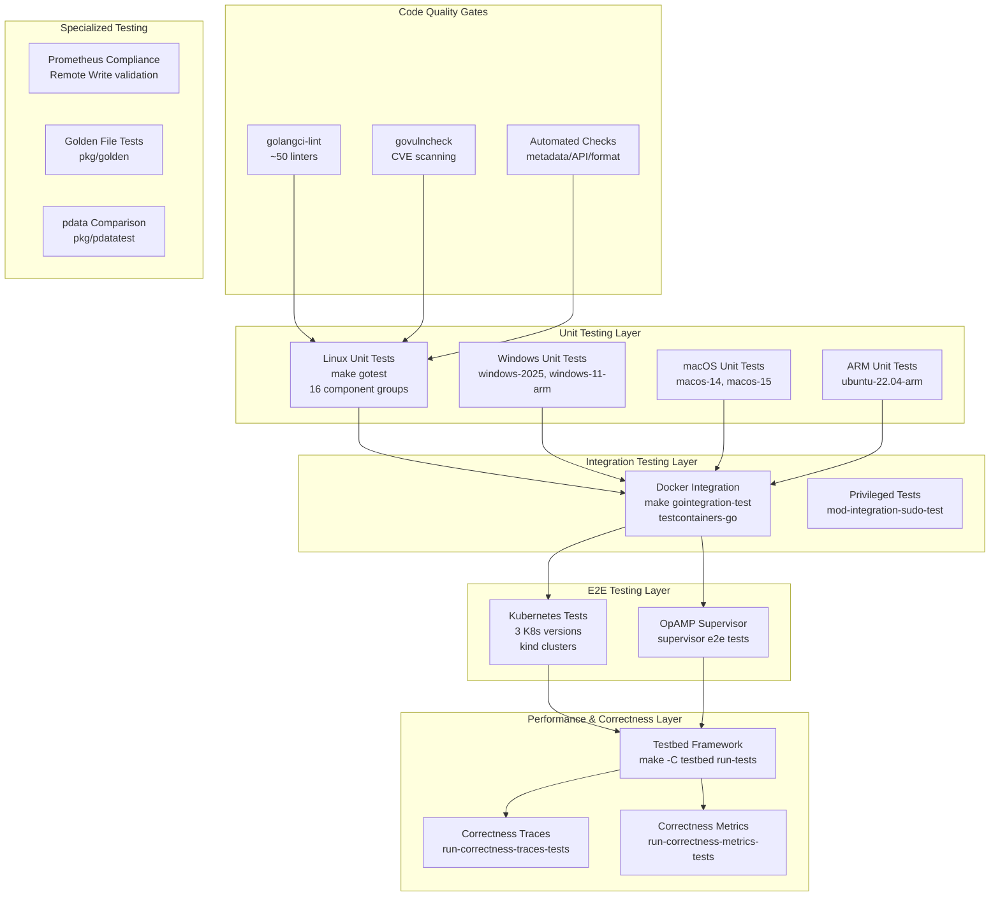
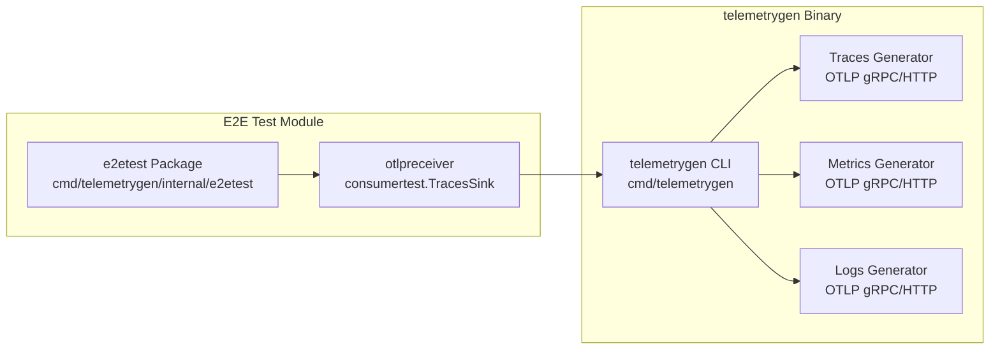
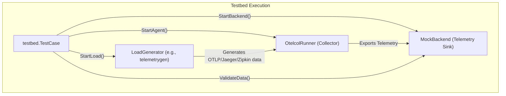
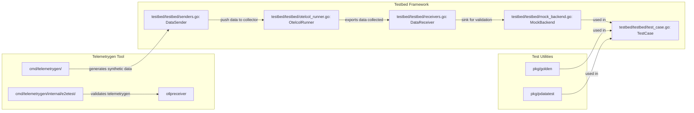

## Purpose and Scope

This document provides an overview of the comprehensive testing infrastructure and utilities employed within the OpenTelemetry Collector Contrib repository. This infrastructure ensures that components meet quality and reliability standards through multiple verification layers, including synthetic telemetry data generation, end-to-end testing, integration testing, and performance benchmarking.

The page serves as a high-level guide to the major testing subsystems and how they interrelate, with pointers to more detailed child pages:

- For the telemetry generation tool and its testing, see [Telemetry Generator (telemetrygen)](#13.1).
- For the end-to-end testing architecture, testbed framework, and Kubernetes-based testing, see [End-to-End Testing Framework](#13.2).
- For test utilities such as golden files and `pdatatest` used in integration tests, see [Test Utilities: Golden Files and pdatatest](#13.3).

---

## Testing Layers and Strategy

The repository employs a layered testing strategy to cover component correctness, integration, resource usage, and behavior under load. Each layer focuses on a particular aspect of validation and combines automated tooling, synthetic data generation, and real deployment scenarios.

### Layered Testing Architecture

This layered approach starts with static analysis and unit testing across Linux, Windows, macOS, and ARM platforms to catch early regressions. It progresses to integration tests running in containers and privileged modes for more realistic environments. End-to-end (E2E) tests execute on Kubernetes clusters to validate real deployment scenarios and remote management via the OpAMP supervisor.

The `testbed` framework plays a central role in performance benchmarking and correctness validation, coordinating load generation, collector execution, and telemetry verification. Specialized tests include Prometheus remote write protocol compliance and golden-file-based output validation.

**Sources:** [.github/workflows/build-and-test.yml:1-631](), [.github/workflows/e2e-tests.yml:1-158](), [.github/workflows/load-tests.yml:1-118]()

---

## Telemetry Generation Tools

### telemetrygen Overview

`telemetrygen` is a dedicated CLI tool designed to generate synthetic OpenTelemetry telemetry signals (traces, metrics, logs). It supports exporting over OTLP gRPC and HTTP with features such as exponential histogram metrics [cmd/telemetrygen/pkg/metrics/worker.go:182-202]().

Key capabilities include:

- **Multi-protocol support**: OTLP exporters over gRPC and HTTP ensuring compatibility with standard collector receivers [cmd/telemetrygen/go.mod:12-18]().
- **Signal Diversity**: Generation of diverse telemetry signals including traces, metrics (with exponential histogram support), and logs [cmd/telemetrygen/go.mod:6-10]().
- **Self-Validation**: Internal e2e tests within the `internal/e2etest` module ensure tool correctness by sending generated telemetry to a real `otlpreceiver` and validating the reception [cmd/telemetrygen/internal/e2etest/go.mod:6-14]().

**Sources:** [cmd/telemetrygen/go.mod:1-30](), [cmd/telemetrygen/internal/e2etest/go.mod:1-15](), [cmd/telemetrygen/pkg/metrics/worker.go:182-202]()

For details, see [Telemetry Generator (telemetrygen)](#13.1).

---

## Testbed Framework

The `testbed` framework is the cornerstone of performance benchmarking and correctness testing. It orchestrates running the OpenTelemetry Collector as a separate process (or in-process), injecting synthetic telemetry, and verifying results and resource usage.

### Core Testbed Components

| Code Entity | File Path | Role |
| :--- | :--- | :--- |
| `TestCase` | [testbed/testbed/test_case.go:22-59]() | Manages test lifecycle: load generation, agent start, validation. |
| `DataSender` | [testbed/testbed/senders.go]() | Interface for synthetic data producers (senders). |
| `DataReceiver` | [testbed/testbed/receivers.go:25-35]() | Interface for receivers that collect data from collector exporters. |
| `MockBackend` | [testbed/testbed/mock_backend.go]() | Sink to receive telemetry, enabling validation. |
| `OtelcolRunner` | [testbed/testbed/otelcol_runner.go]() | Interface for managing the OpenTelemetry Collector execution. |

### Performance Scenario Example

The testbed supports scenarios such as `Scenario10kItemsPerSecond` that simulate sending 10k telemetry data items per second through the collector while resource usage is measured [testbed/tests/scenarios.go:138-194]().

The framework allows for dynamic configuration generation, where the `createConfigYaml` function builds a collector configuration based on the specific `DataSender` and `DataReceiver` used in the test [testbed/tests/scenarios.go:43-135]().

**Sources:** [testbed/testbed/test_case.go:67-129](), [testbed/tests/scenarios.go:138-194](), [testbed/testbed/receivers.go:25-35]()

For detailed architecture and usage, see [End-to-End Testing Framework](#13.2).

---

## Test Utilities: Golden Files and pdatatest

To facilitate precise validation of telemetry data, the repository offers specialized test utilities.

### pkg/pdatatest

The `pdatatest` package enables deep comparisons of OpenTelemetry `pdata` structures representing metrics, logs, traces, and profiles. It provides semantically rich diff outputs that annotate differences and can ignore irrelevant fields (e.g., timestamps).

### pkg/golden

The `golden` package assists with reading and writing reference ("golden") YAML files for expected telemetry output. These golden files serve as canonical references that component tests compare runtime outputs against.

---

## Specialized Integration Tests

Beyond standard testbed scenarios, the repository includes targeted integration tests for specific features:

- **Prometheus Receiver Staleness Markers**: Validates that the Prometheus receiver correctly emits staleness markers when timeseries metrics intermittently disappear. This test runs a full collector instance and checks the output via the `prometheusremotewriteexporter` [receiver/prometheusreceiver/internal/staleness_end_to_end_test.go:45-77]().
- **Elasticsearch Exporter Integration**: Employs a `recreatableOtelCol` test harness to simulate Collector lifecycle events and failures while verifying Elasticsearch exporter behavior [exporter/elasticsearchexporter/integrationtest/collector.go:120-157]().

**Sources:** [receiver/prometheusreceiver/internal/staleness_end_to_end_test.go:45-77](), [exporter/elasticsearchexporter/integrationtest/collector.go:38-101]()

---

## Summary Diagram: Infrastructure to Code Entities

---

## Related Child Pages

- [Telemetry Generator (telemetrygen)](#13.1)
- [End-to-End Testing Framework](#13.2)
- [Test Utilities: Golden Files and pdatatest](#13.3)