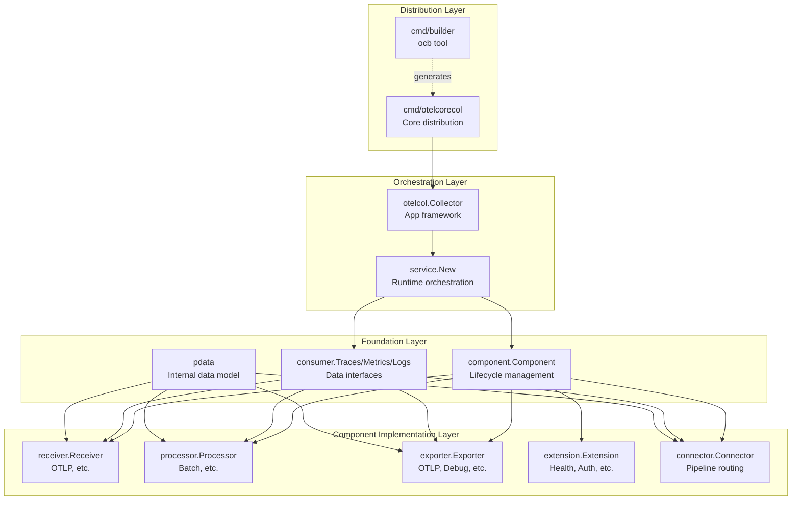
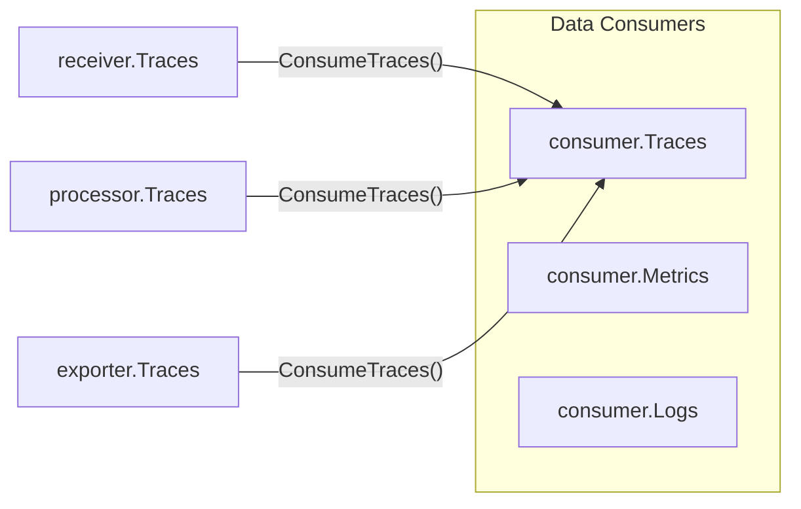

This document describes the overall architectural design of the OpenTelemetry Collector, including its module structure, core abstractions, component model, and runtime organization. For detailed information on specific subsystems, see:

*   Component model and lifecycle: [Component Model](#2.1)
*   Module organization and dependency patterns: [Module Structure and Dependencies](#2.2)
*   Data flow through pipelines: [Pipeline and Data Flow](#2.3)
*   Telemetry data structures: [Telemetry Data Model](#2.4)

## Architectural Overview

The OpenTelemetry Collector is designed as a modular, extensible system for receiving, processing, and exporting telemetry data [README.md:49-53](). The architecture consists of several major layers that work together to provide a flexible observability pipeline.

**Sources**: [README.md:49-62](), [component/component.go:25-62](), [receiver/receiver.go:15-40](), [processor/processor.go:15-31](), [exporter/exporter.go:15-31](), [connector/connector.go:16-62]()

## Multi-Module Repository Structure

The collector is organized as a multi-module Go repository with over 70 modules. This design enables independent versioning and clear dependency boundaries [VERSIONING.md:1-20]().

*   **Root Module**: `go.opentelemetry.io/collector` contains core types.
*   **Component Modules**: Located in `receiver/`, `processor/`, `exporter/`, `extension/`, and `connector/`.
*   **Helper Modules**: Like `exporter/exporterhelper` provide common infrastructure for retries and queuing.
*   **Configuration Modules**: Located in `config/` (e.g., `confighttp`, `configgrpc`).

**Sources**: [README.md:110-118](), [exporter/README.md:5-10](), [processor/README.md:14-16](), [receiver/README.md:8-11]()

## Core Abstractions

The collector architecture is built on fundamental abstractions that define how components interact:

### Component Interface and Lifecycle

The `component.Component` interface defines the core lifecycle that all collector components (receivers, processors, exporters, extensions, and connectors) must fulfill [component/component.go:25-62]().

| Phase | Description | Interface Method |
|-------|-------------|------------------|
| **Creation** | Created via a factory | `Create*` (Factory) |
| **Start** | Component initialization | `Start(ctx, host)` |
| **Running** | Active data processing | N/A |
| **Shutdown** | Graceful termination | `Shutdown(ctx)` |

**Sources**: [component/component.go:14-62](), [component/component.go:182-194]()

### Consumer Interface

The `consumer` package defines how telemetry data flows between components. Receivers translate external data into internal formats and pass them to consumers [receiver/README.md:3-6]().

**Sources**: [receiver/receiver.go:20-40](), [exporter/exporter.go:16-31](), [processor/README.md:38-41]()

### Protocol Data (pdata)

The `pdata` package provides efficient, in-memory representations of telemetry data based on OTLP v1.10.0 [README.md:99-104](). Components use `pdata.Traces`, `pdata.Metrics`, and `pdata.Logs` to pass data through the pipeline [processor/README.md:38-41]().

**Sources**: [README.md:99-104](), [processor/README.md:38-41]()

## Component Pipeline Architecture

Components are organized into pipelines that define how data flows. Each pipeline consists of a receiver, zero or more processors, and one or more exporters [exporter/README.md:50-63]().

*   **Receivers**: Ingest data (e.g., `otlpreceiver`) [receiver/README.md:11]().
*   **Processors**: Transform or filter data (e.g., `batch`, `memory_limiter`) [processor/README.md:15-16]().
*   **Exporters**: Send data to backends (e.g., `otlpexporter`, `debug`) [exporter/README.md:8-10]().
*   **Connectors**: Route data between pipelines [connector/connector.go:16-27]().
*   **Extensions**: Provide cross-cutting concerns like health checks or authentication [component/component.go:95]().

### Data Ownership and Mutation

Ownership of `pdata` is passed through the pipeline. If a processor or exporter declares it `MutatesData` via its `Capabilities`, the pipeline may operate in **Exclusive Ownership** mode, cloning data at fan-out points to ensure safety [processor/README.md:36-79]().

**Sources**: [processor/README.md:36-104](), [exporter/README.md:65-75]()

## Distribution Model

The collector uses a code generation approach for building distributions. The `ocb` (OpenTelemetry Collector Builder) tool generates the entry point and dependency management [docs/release.md:7-9](). The `otelcorecol` is the primary distribution maintained in this repository [docs/release.md:5-9]().

**Sources**: [docs/release.md:7-9](), [CONTRIBUTING.md:20-23]()