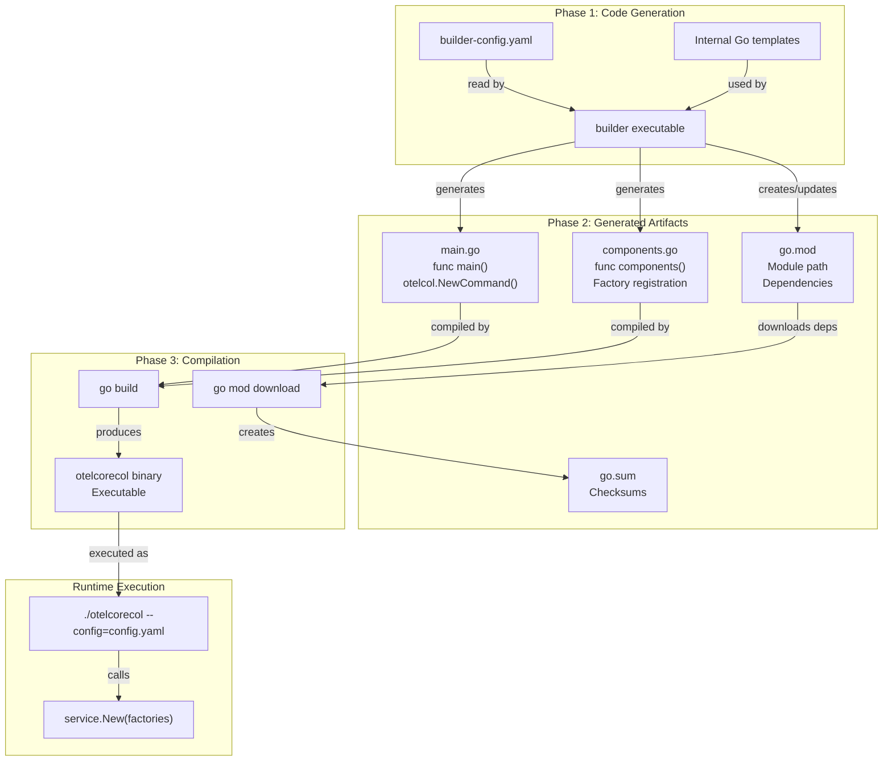
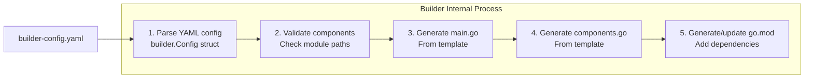

## Overview

This page walks through the complete build process from builder configuration to executable binary, using the `otelcorecol` reference distribution as a concrete example. The build process consists of three main phases:

1.  **Code Generation**: The builder reads a configuration file and generates Go source files (`main.go`, `components.go`).
2.  **Dependency Resolution**: The builder creates or updates `go.mod` with all required component dependencies.
3.  **Compilation**: Standard Go build tools compile the generated code into an executable binary.

The `otelcorecol` distribution in this repository at [cmd/otelcorecol/]() serves as the primary reference implementation, demonstrating how to create a minimal but functional collector distribution.

**Scope**: This page focuses on the mechanics of building a collector distribution. For the builder tool itself, see section 8.1. For builder configuration syntax, see section 8.2. For metadata generation, see section 8.3.

## Important Note on Official Builds

As documented in [cmd/otelcorecol/go.mod:1-6](), the `otelcorecol` code in this repository is **not** used to build official binaries. Official OpenTelemetry Collector Core binaries are built from separate manifests maintained in the `opentelemetry-collector-releases` repository. The code here serves as:

*   A reference implementation for testing the builder.
*   A template for creating custom distributions.
*   Documentation of the build process.

Sources: [cmd/otelcorecol/go.mod:1-6](), [cmd/otelcorecol/builder-config.yaml]()

## Build Process Overview

**Diagram: Complete Build Process from Configuration to Binary**



The builder operates as a standalone Go program that generates source code. It does not directly compile the collector; instead, it generates Go files that are then built using standard Go tooling.

Sources: [cmd/otelcorecol/go.mod:1-6](), [cmd/otelcorecol/builder-config.yaml]()

## Phase 1: Code Generation

### Input: Builder Configuration

The build process starts with a builder configuration file. The `otelcorecol` distribution is defined in [cmd/otelcorecol/builder-config.yaml]().

**Distribution Metadata Fields:**

| Field | Example Value | Purpose |
| :--- | :--- | :--- |
| `dist.name` | `otelcorecol` | Sets the module name and binary name |
| `dist.description` | `OpenTelemetry Collector` | Documentation string |
| `dist.output_path` | `.` | Directory where code is generated |
| `dist.otelcol_version` | `0.156.0` | Version of `otelcol` package to use |
| `dist.go` | `go 1.25.0` | Minimum Go version required |

Sources: [cmd/otelcorecol/builder-config.yaml](), [cmd/otelcorecol/go.mod:3-5]()

### Code Generation Process

**Diagram: Builder Code Generation Steps**



The builder executable reads the configuration file and uses internal templates to generate source code. Key operations:

1.  Parse the YAML configuration into internal configuration structures.
2.  Validate that all referenced component modules exist.
3.  Generate `main.go` from internal templates.
4.  Generate `components.go` with factory registration.
5.  Create or update `go.mod` with all component dependencies.

Sources: [cmd/otelcorecol/builder-config.yaml](), [cmd/otelcorecol/go.mod:1-6]()

## Phase 2: Generated Artifacts

The builder generates source files in the specified `output_path`. All generated files include a header indicating they should not be edited manually.

### go.mod Structure

The generated `go.mod` file declares:

*   **Module Path**: `go.opentelemetry.io/collector/cmd/otelcorecol` [cmd/otelcorecol/go.mod:3]()
*   **Go Version**: `go 1.25.0` [cmd/otelcorecol/go.mod:5]()
*   **Direct Dependencies**: All component modules [cmd/otelcorecol/go.mod:7-34]()

The builder ensures version consistency across all modules. For the `otelcorecol` distribution, modules are categorized into sets:
*   **Stable modules (v1.x)**: e.g., `go.opentelemetry.io/collector/component v1.62.0` [versions.yaml:5-32](), [cmd/otelcorecol/go.mod:8]()
*   **Beta modules (v0.x)**: e.g., `go.opentelemetry.io/collector/service v0.156.0` [versions.yaml:33-101](), [cmd/otelcorecol/go.mod:32]()

Sources: [cmd/otelcorecol/go.mod:1-34](), [versions.yaml:1-101]()

### Component Dependency Example

The `otelcorecol` distribution includes a curated set of core components:

| Category | Component | Module |
| :--- | :--- | :--- |
| **Providers** | `env`, `file`, `http`, `yaml` | `go.opentelemetry.io/collector/confmap/provider/...` [cmd/otelcorecol/go.mod:10-14]() |
| **Receivers** | `otlp`, `nop` | `go.opentelemetry.io/collector/receiver/...` [cmd/otelcorecol/go.mod:30-31]() |
| **Processors** | `batch`, `memory_limiter` | `go.opentelemetry.io/collector/processor/...` [cmd/otelcorecol/go.mod:27-28]() |
| **Exporters** | `otlp`, `debug`, `nop` | `go.opentelemetry.io/collector/exporter/...` [cmd/otelcorecol/go.mod:18-21]() |
| **Extensions** | `zpages`, `memory_limiter` | `go.opentelemetry.io/collector/extension/...` [cmd/otelcorecol/go.mod:23-24]() |
| **Connectors** | `forward` | `go.opentelemetry.io/collector/connector/forwardconnector` [cmd/otelcorecol/go.mod:16]() |

Sources: [cmd/otelcorecol/go.mod:7-34](), [cmd/otelcorecol/builder-config.yaml]()

## Phase 3: Compilation

### Dependency Resolution

After code generation, standard Go tools resolve dependencies:

```bash
cd cmd/otelcorecol
go mod download
```

This command:
1.  Reads `go.mod` to identify all required modules.
2.  Downloads modules from their specified sources.
3.  Generates `go.sum` with cryptographic checksums [cmd/otelcorecol/go.sum:1-83]().

Recent updates to the builder (OCB) ensure that using the `--skip-get-modules` flag will truly leave the `go.mod` file untouched, preventing unintended regeneration during local development flows [CHANGELOG.md:113-116]().

### Binary Compilation

The generated code compiles using standard Go build:

```bash
go build -o otelcorecol .
```

The build process produces a single static binary.

### Build Output Summary

| File | Generated By | Purpose |
| :--- | :--- | :--- |
| [cmd/otelcorecol/builder-config.yaml]() | Developer | Input configuration |
| [cmd/otelcorecol/go.mod]() | Builder | Module dependencies |
| [cmd/otelcorecol/go.sum]() | `go mod download` | Dependency checksums |
| `cmd/otelcorecol/main.go` | Builder | Application entry point |
| `cmd/otelcorecol/components.go` | Builder | Factory registration |
| `cmd/otelcorecol/otelcorecol` | `go build` | Executable binary |

Sources: [cmd/otelcorecol/go.mod:1-6](), [cmd/otelcorecol/go.sum:1-83](), [CHANGELOG.md:113-116]()

## Distribution Examples and Reports

The project maintains different distribution tiers and stability levels.

### Stability Levels
The `versions.yaml` file defines the stability sets for all collector modules:
*   **Stable**: Modules at `v1.62.0` [versions.yaml:5-6]().
*   **Beta**: Modules at `v0.156.0` [versions.yaml:33-34]().

### Component Stability and Changes
Stability status and changes are tracked in the changelog. Recent changes include:
*   Removal of stabilized feature gates like `confighttp.framedSnappy` [CHANGELOG.md:52]().
*   Removal of `configoptional.AddEnabledField` gate [CHANGELOG.md:53]().
*   Removal of `otelcol.printInitialConfig` gate [CHANGELOG.md:56]().
*   Removal of `pdata.enableRefCounting` gate [CHANGELOG.md:58]().

### Distribution Configuration (otelcorecol)
The `otelcorecol` distribution is configured to exclude certain modules that are only used for internal tooling or end-to-end testing, such as `cmd/otelcorecol` itself from the standard versioning tool, and `internal/e2e` [versions.yaml:106-108]().

Sources: [versions.yaml:5-109](), [CHANGELOG.md:50-60]()