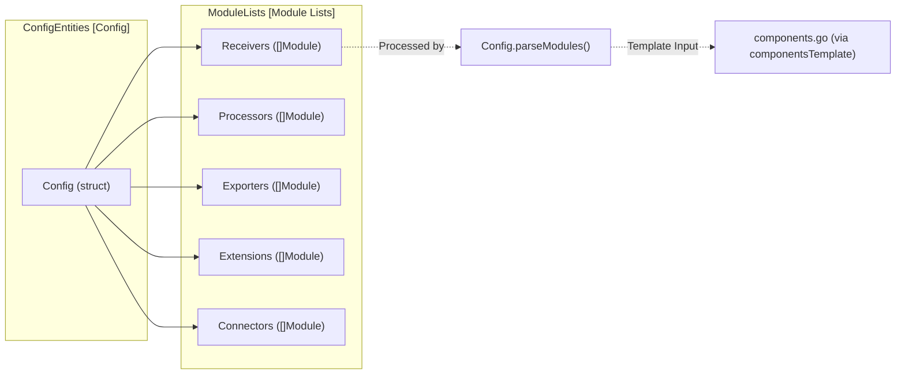

This page documents the structure and options available in the builder configuration file (`builder-config.yaml`), which controls how the OpenTelemetry Collector Builder (`ocb`) generates custom collector distributions. For information about the `ocb` tool itself and command-line usage, see [OpenTelemetry Collector Builder (ocb)](#8.1). For details about the code generation and compilation process, see [Build Process and Distribution Examples](#8.4).

The builder configuration file is a YAML document that specifies which components (receivers, processors, exporters, extensions, connectors) to include in the custom collector binary, along with distribution metadata and build settings.

## Configuration File Structure

The builder configuration file consists of several top-level sections that define different aspects of the collector build. These are mapped to the `Config` struct in the builder's internal logic.

Title: Builder Configuration Data Model

```mermaid
graph TB
    BuilderConfig["Config (struct)"]

    BuilderConfig --> Dist["Distribution (struct)<br/>'dist' key"]
    BuilderConfig --> Components["Component Lists"]
    BuilderConfig --> Telemetry["Telemetry (Module)<br/>'telemetry' key"]
    BuilderConfig --> Confmap["Confmap Settings"]
    BuilderConfig --> Dependencies["Dependency Management"]
    BuilderConfig --> ConfResolver["ConfResolver (struct)<br/>'conf_resolver' key"]

    Components --> Receivers["Receivers []Module"]
    Components --> Processors["Processors []Module"]
    Components --> Exporters["Exporters []Module"]
    Components --> Extensions["Extensions []Module"]
    Components --> Connectors["Connectors []Module"]

    Confmap --> Providers["ConfmapProviders []Module"]
    Confmap --> Converters["ConfmapConverters []Module"]

    Dependencies --> Replaces["Replaces []string"]
    Dependencies --> Excludes["Excludes []string"]

    Dist --> Module["Module (string)"]
    Dist --> Name["Name (string)"]
    Dist --> OutputPath["OutputPath (string)"]
    Dist --> Version["Version (string)"]
    Dist --> BuildOptions["BuildTags, CGoEnabled, etc."]
```

**Sources:** [cmd/builder/internal/builder/config.go:30-59](), [cmd/otelcorecol/builder-config.yaml:9-43]()

## Distribution Settings (dist)

The `dist` section defines metadata and build settings for the generated collector distribution. These settings are represented by the `Distribution` struct in the builder code.

### Distribution Configuration Fields

| Field | Type | Description | Required | Default |
|-------|------|-------------|----------|---------|
| `module` | string | Go module name for the distribution (e.g., `go.opentelemetry.io/collector/cmd/otelcorecol`) | No | `go.opentelemetry.io/collector/cmd/builder` |
| `name` | string | Binary name for the compiled collector | No | Empty |
| `description` | string | Long description for the application | No | Empty |
| `output_path` | string | Directory path where sources and binary are written | No | Temp directory |
| `version` | string | Version string for the custom collector | No | Empty |
| `go` | string | Path to the Go compiler binary | No | `go` from PATH |
| `build_tags` | string | Build tags to pass to `go build` | No | Empty |
| `debug_compilation` | bool | Disable optimizations and keep symbols | No | `false` |
| `cgo_enabled` | bool | Enable CGO for compilation | No | `false` |
| `use_absolute_replace_paths` | bool | Convert relative replace paths to absolute | No | `false` |

**Sources:** [cmd/builder/internal/builder/config.go:69-80](), [cmd/builder/internal/builder/config.go:107-113](), [cmd/otelcorecol/builder-config.yaml:9-13]()

### Build Flags and Compilation

The builder supports customizing compilation flags through command-line arguments or configuration:

- **LDFlags**: Linker flags passed to `go build -ldflags`. By default, the builder uses `-s -w` to strip symbols [cmd/builder/internal/builder/main.go:122-122]().
- **GCFlags**: Compiler flags passed to `go build -gcflags`. When `debug_compilation: true`, this is set to `all=-N -l` to disable optimizations [cmd/builder/internal/builder/main.go:130-130]().
- **CGO**: Controlled by `cgo_enabled`. If disabled, `CGO_ENABLED=0` is set in the environment [cmd/builder/internal/builder/main.go:48-48]().

**Sources:** [cmd/builder/internal/builder/main.go:115-156](), [cmd/builder/README.md:112-125]()

## Module Specification Format

Each component in the builder configuration is specified as a `Module` with the following fields:

### Module Fields

| Field | Description | Required | Inferred From |
|-------|-------------|----------|---------------|
| `gomod` | Go module specification with version (e.g., `github.com/org/module v1.2.3`) | Yes | - |
| `import` | Import path for the Go package | No | First part of `gomod` |
| `name` | Identifier used in generated code | No | Last segment of `import` path |
| `path` | Local filesystem path (creates replace directive) | No | - |

**Parsing Logic:**

The builder parses modules in `parseModules()`:
1. If `import` is empty, it extracts it from the first part of `gomod` [cmd/builder/internal/builder/config.go:264-266]().
2. If `name` is empty, it takes the last path segment from `import` [cmd/builder/internal/builder/config.go:270-272]().
3. If the `name` conflicts with another component, it appends a numeric suffix (e.g., `impl`, `impl2`) [cmd/builder/internal/builder/config.go:276-282]().
4. If `path` is specified and `use_absolute_replace_paths` is true, it converts the path to absolute [cmd/builder/internal/builder/config.go:257-262]().

**Sources:** [cmd/builder/internal/builder/config.go:83-88](), [cmd/builder/internal/builder/config.go:247-291](), [cmd/builder/internal/builder/config_test.go:23-140]()

## Component Lists

The builder configuration includes separate lists for each component type. These lists are iterated over during the generation of `components.go`.

Title: Component Generation Flow

**Sources:** [cmd/builder/internal/builder/config.go:44-54](), [cmd/builder/internal/builder/config.go:170-213](), [cmd/builder/internal/builder/main.go:99-99]()

## Confmap Providers and Converters

The `providers` and `converters` sections specify `confmap` extensions.

### Default Providers
If not specified, the builder includes five default providers for environment variables, files, HTTP, HTTPS, and YAML [cmd/builder/internal/builder/config.go:120-137](). These defaults use the `DefaultStableOtelColVersion` [cmd/builder/internal/builder/config.go:122-135]().

**Sources:** [cmd/builder/internal/builder/config.go:120-137](), [cmd/otelcorecol/main.go:31-37]()

## Telemetry Provider Configuration

The `telemetry` section specifies the telemetry provider for internal collector observability.

### Default Telemetry Provider
The builder configuration allows specifying a custom telemetry module. For the core distribution, it uses `otelconftelemetry` [cmd/otelcorecol/builder-config.yaml:39-41]().

**Sources:** [cmd/builder/internal/builder/config.go:50](), [cmd/otelcorecol/builder-config.yaml:39-41]()

## Dependency Management

The builder supports Go module `replace` and `exclude` directives to manage the dependency graph of the generated collector.

### Replace Directives
The `replaces` section provides a list of `go.mod` replace statements. This is critical for building against local forks or unreleased versions [cmd/otelcorecol/builder-config.yaml:43-125]().

**Sources:** [cmd/builder/internal/builder/config.go:53](), [cmd/otelcorecol/builder-config.yaml:43-125]()

### Exclude Directives
The `excludes` section allows excluding specific module versions from the build graph, mapping directly to Go's `exclude` directive in `go.mod` [cmd/builder/internal/builder/config.go:54]().

**Sources:** [cmd/builder/internal/builder/config.go:54]()

## Configuration Resolution Settings

The `conf_resolver` section controls how the generated collector interprets configuration URIs.

### Default URI Scheme
The `default_uri_scheme` field sets the `CollectorSettings.ConfResolver.DefaultScheme` value, determining how the collector interprets URIs without a scheme (e.g., `${ENV}`) [cmd/builder/internal/builder/config.go:61-66]().

**Sources:** [cmd/builder/internal/builder/config.go:61-66]()

## Version Management

The builder uses two primary version constants to maintain stability during the build process, which are updated during releases.

| Constant | Value | Description |
|----------|-------|-------------|
| `DefaultBetaOtelColVersion` | `v0.156.0` | Default version for beta modules |
| `DefaultStableOtelColVersion` | `v1.62.0` | Default version for stable modules |

**Strict Version Checking:**
By default, the builder performs strict version checking during the `GetModules` phase [cmd/builder/internal/builder/main.go:181-222](). It ensures that the core collector version (`go.opentelemetry.io/collector/otelcol`) and all components match the configured versions after dependency resolution. This can be disabled via the `--skip-strict-versioning` flag [cmd/builder/internal/command.go:83-83]().

**Sources:** [cmd/builder/internal/builder/config.go:21-24](), [cmd/builder/internal/builder/main.go:181-222](), [versions.yaml:4-36]()