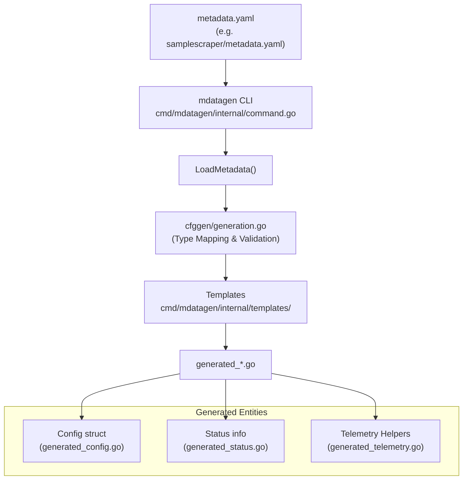
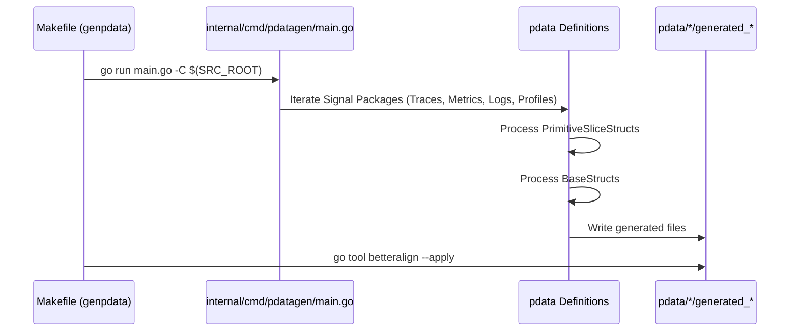
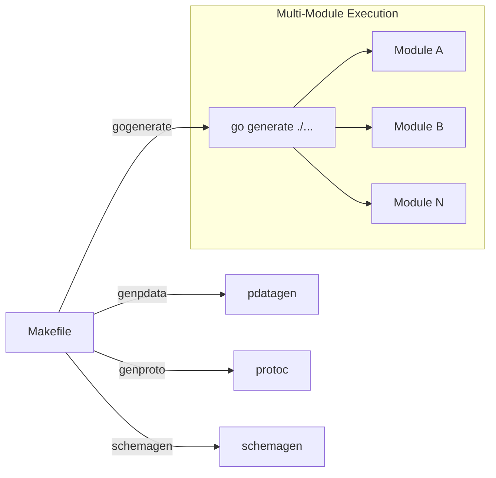
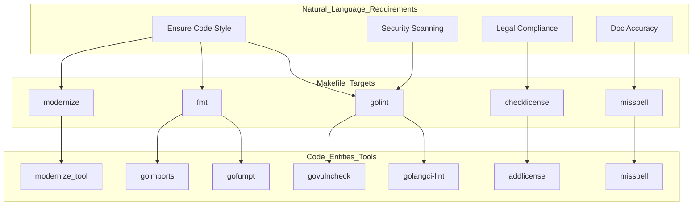
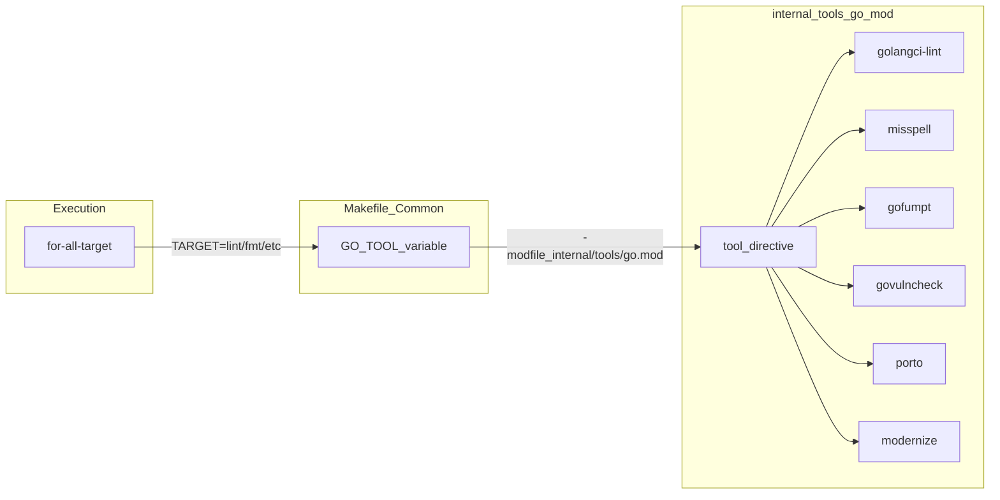
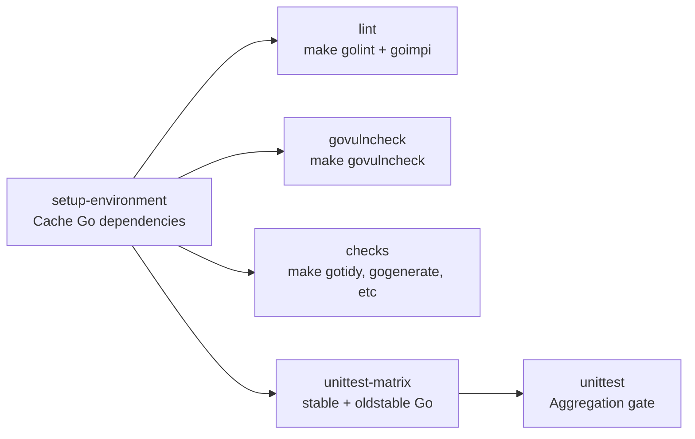
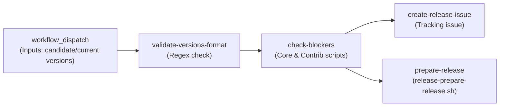

Automated code generation is a fundamental pillar of the OpenTelemetry Collector's architecture. It is used to maintain consistency across dozens of modules, generate high-performance data structures for telemetry signals, and provide boilerplate for component developers.

## Overview of Tooling

The codebase employs several specialized generators, coordinated primarily through the root `Makefile` [Makefile:104-109]().

| Tool | Purpose | Primary Output |
|------|---------|----------------|
| `mdatagen` | Component metadata generation | Metrics, telemetry, config schemas, and boilerplate |
| `pdatagen` | Internal data model generation | Traces, Metrics, Logs, and Profiles structs |
| `apidiff` | API compatibility checking | Reports on breaking changes |
| `protoc` | Protobuf compilation | Go code for internal queue serialization |
| `schemagen` | JSON schema generation | Configuration validation schemas |

Sources: [Makefile:104-109](), [Makefile:191-195](), [Makefile:203-209](), [internal/tools/go.mod:14-25](), [Makefile.Common:110-113]()

## Metadata Generator (mdatagen)

`mdatagen` is the primary tool for component developers. It consumes a `metadata.yaml` file and generates Go code for metrics, telemetry settings, configuration structures, and documentation.

### Implementation and Templates
The tool uses Go's `text/template` package to generate source files from definitions in `cmd/mdatagen/internal/templates/` [cmd/mdatagen/internal/command.go:20](). It parses a component's `metadata.yaml` into a `Metadata` struct via `LoadMetadata` [cmd/mdatagen/internal/command.go:103]() and applies templates based on the metadata content.

Key template-to-output mappings managed in `run(ymlPath string)` [cmd/mdatagen/internal/command.go:78-210]():
- `status.go.tmpl` -> `generated_status.go` [cmd/mdatagen/internal/command.go:114]()
- `telemetry.go.tmpl` -> `generated_telemetry.go` [cmd/mdatagen/internal/command.go:157]()
- `config_from_cfggen.go.tmpl` -> `generated_config.go` [cmd/mdatagen/internal/command.go:206]()
- `documentation.md.tmpl` -> `documentation.md` [cmd/mdatagen/internal/command.go:189]()

### Configuration Generation (cfggen)
A sophisticated sub-system within `mdatagen` is `cfggen`, which handles the generation of Go structs from YAML configuration schemas. It maps YAML types to Go types using `MapGoType` [cmd/mdatagen/internal/cfggen/generation.go:180-195]().

| YAML Type | Go Type | Implementation |
|-----------|---------|----------------|
| `string` | `string` | [cmd/mdatagen/internal/cfggen/generation.go:217-221]() |
| `integer` | `int` | [cmd/mdatagen/internal/cfggen/generation.go:222-223]() |
| `number` | `float64` | [cmd/mdatagen/internal/cfggen/generation.go:224-225]() |
| `boolean` | `bool` | [cmd/mdatagen/internal/cfggen/generation.go:226-227]() |
| `array` | `[]T` | [cmd/mdatagen/internal/cfggen/generation.go:228-233]() |
| `object` | `map[string]T` or `struct` | [cmd/mdatagen/internal/cfggen/generation.go:234-254]() |

It also generates `Validate()` methods for these structs, implementing rules like `minLength`, `maxLength`, `minimum`, `maximum`, and `pattern` via template definitions in `config_from_cfggen.go.tmpl` [cmd/mdatagen/internal/templates/config_from_cfggen.go.tmpl:144-198]().

### Data Flow

Sources: [cmd/mdatagen/internal/command.go:78-210](), [cmd/mdatagen/internal/cfggen/generation.go:180-254](), [cmd/mdatagen/internal/templates/config_from_cfggen.go.tmpl:1-94](), [cmd/mdatagen/internal/samplescraper/metadata.yaml:28-86]()

## pdata Generation (pdatagen)

The `pdata` package contains the internal data model for the Collector. Because the OTLP-based structures for Traces, Metrics, Logs, and Profiles are highly repetitive, they are generated by `pdatagen`.

### Core Logic
The generator logic resides in `internal/cmd/pdatagen/`. It is invoked via the `genpdata` target in the main Makefile [Makefile:191-195](). The generator processes internal data definitions and outputs Go structs that provide a high-performance, zero-allocation-friendly API for telemetry data.

### Signal Generation Process

Sources: [Makefile:191-195](), [internal/tools/go.mod:8]()

## API Compatibility (apidiff)

To ensure stability across the Collector's multi-module structure, the project uses `apidiff` and `checkapi`.

- **apidiff**: A tool from `golang.org/x/exp/cmd/apidiff` used to detect changes in the exported API of a package [internal/tools/go.mod:20]().
- **checkapi**: A wrapper from `go.opentelemetry.io/build-tools/checkapi` that integrates compatibility checks into the CI/CD pipeline [internal/tools/go.mod:14]().

These tools are crucial for maintaining the "Stable" vs "Beta" versioning strategy. Scripts like `gen-apidiff.sh` and `compare-apidiff.sh` automate the process of comparing current branch APIs against a base version [internal/buildscripts/gen-apidiff.sh](), [internal/buildscripts/compare-apidiff.sh]().

## Protobuf Compilation

While the primary data model is handled by `pdata`, some internal components use raw Protobuf for performance or persistence. The `exporterhelper` uses Protobuf for its internal queue serialization [Makefile:199-201]().

The generation is managed via `genproto`:
1. Identifies `.proto` files in `exporter/exporterhelper/internal/queue` [Makefile:199-200]().
2. Uses a Docker-based `protoc` environment (`otel/build-protobuf:0.23.0`) [Makefile:197-201]().
3. Generates Go code with gRPC plugins [Makefile:201-207]().

Sources: [Makefile:196-209]()

## Linting and Quality Control

Code generation is followed by a suite of formatting and linting tools to ensure the generated code meets project standards:
- **gofumpt**: An enforceably stricter version of `gofmt` [internal/tools/go.mod:25](), [Makefile.Common:82-84]().
- **porto**: Adds/updates vanity import comments [internal/tools/go.mod:11](), [Makefile:70-72]().
- **betteralign**: Optimizes struct field alignment to reduce memory footprint, particularly important for `pdata` [internal/tools/go.mod:8](), [Makefile:194]().
- **modernize**: Automatically updates code to use newer Go features (e.g., `slices.Contains`) [internal/tools/go.mod:22](), [Makefile.Common:58-62]().

Sources: [Makefile:70-72](), [Makefile:194](), [Makefile.Common:58-84](), [internal/tools/go.mod:8-25]()

## Build System Integration

The `Makefile` serves as the entry point for all generation tasks. The `for-all-target` pattern allows these tools to be run across the 70+ modules in the repository [Makefile:156-164]().

Sources: [Makefile:104-109](), [Makefile:153-164](), [Makefile.Common:89-91](), [Makefile.Common:110-113]()

### Tool Management
Tools are managed in a dedicated module at `internal/tools/`. This ensures that all developers and CI environments use the exact same versions of the generators [internal/tools/go.mod:1-26](), [Makefile.Common:19-21]().

Sources: [internal/tools/go.mod:1-26](), [Makefile.Common:19-21]()

# Code Quality and Linting

This page details the automated quality assurance systems used in the OpenTelemetry Collector codebase. The project employs a multi-layered approach to ensure code consistency, security, and maintainability across its 70+ Go modules.

## Overview

The repository enforces high code quality through a combination of static analysis, automated formatting, license verification, and spell checking. These checks are integrated into the [Build System and Makefile](9.1) via `Makefile` targets and are mandatory gates in the [GitHub Actions Workflows](10.1).

**Key Components**:
*   **Linter**: `golangci-lint` with 60+ enabled linters [internal/tools/go.mod:9]().
*   **Formatters**: `gofmt`, `goimports`, `gofumpt`, and `porto` [Makefile.Common:54-84]().
*   **Security**: `govulncheck` for dependency vulnerability scanning [Makefile.Common:85-88]().
*   **Metadata**: `checklicense` for legal headers and `misspell` for documentation [Makefile:125-138]().

Sources: [.golangci.yml:1-54](), [Makefile:43-44](), [internal/tools/go.mod:5-26]()

---

## Linting Infrastructure

### golangci-lint Configuration

The primary linting engine is `golangci-lint`, configured in `.golangci.yml`. It is set to run with no issue limits to ensure all violations are reported [.golangci.yml:21-25]().

| Category | Linters | Purpose |
| :--- | :--- | :--- |
| **Correctness** | `errcheck`, `errorlint`, `govet`, `staticcheck` | Catch bugs and API misuse [.golangci.yml:34-45]() |
| **Security** | `gosec` | Detect common security vulnerabilities [.golangci.yml:38]() |
| **Style** | `revive`, `gocritic`, `misspell`, `whitespace` | Enforce project coding standards [.golangci.yml:37-53]() |
| **Performance** | `perfsprint`, `prealloc`, `makezero` | Optimize execution paths [.golangci.yml:43](), [internal/tools/go.mod:54-59]() |
| **Modernization** | `modernize`, `usestdlibvars`, `copyloopvar` | Upgrade code to modern Go idioms [.golangci.yml:31-51]() |

Sources: [.golangci.yml:21-54](), [.golangci.yml:101-233](), [internal/tools/go.mod:9]()

### Custom Enforcement Rules

The project uses `depguard` to restrict the use of specific libraries in favor of preferred alternatives or newer Go standard library features [.golangci.yml:67-99]().

| Denied Package | Preferred Alternative | Reason |
| :--- | :--- | :--- |
| `go.uber.org/atomic` | `sync/atomic` | Use standard library [.golangci.yml:71-72]() |
| `gopkg.in/yaml.v3` | `go.yaml.in/yaml/v3` | Consistent YAML handling [.golangci.yml:73-74]() |
| `github.com/pkg/errors` | `errors` or `fmt` | Standard Go 1.13+ wrapping [.golangci.yml:75-76]() |
| `math/rand` | `math/rand/v2` | Improved performance and API [.golangci.yml:79-80]() |
| `go.opentelemetry.io/proto` | `pdata` | Internal format abstraction [.golangci.yml:98-99]() |

Sources: [.golangci.yml:67-99]()

---

## Code Entity Space: Linting Workflow

The following diagram maps the natural language requirements for code quality to the specific Go tools and Makefile targets that implement them.

**Linting and Formatting Flow**

Sources: [Makefile:84-112](), [Makefile.Common:54-71](), [internal/tools/go.mod:5-26]()

---

## Formatting and Organization

The Collector uses several tools to ensure a unified code style across all modules.

### Formatting Suite
*   **gofmt**: Standard Go code formatting with the `-s` (simplify) flag [Makefile.Common:73-75]().
*   **goimports**: Automatically manages import blocks and sorts them by group (Standard Lib, Third Party, Local) [Makefile.Common:77-79]().
*   **gofumpt**: A stricter version of `gofmt` that enforces additional rules like removing unnecessary empty lines [Makefile.Common:81-83]().
*   **porto**: Manages `go:linkname` and internal package exports to ensure consistency across the multi-module structure [Makefile:70-72]().
*   **modernize**: Automatically applies modern Go idioms such as `slices.Contains` or `strings.Cut` [Makefile.Common:58-62]().

### Import Ordering (impi)
The `impi` tool is used to enforce a specific import hierarchy:
1.  **Standard Library**
2.  **Third-party packages**
3.  **Local packages** (prefixed with `go.opentelemetry.io/collector`)

Sources: [Makefile.Common:93-97](), [internal/tools/go.mod:12]()

---

## Tool Management via internal/tools

The repository uses a dedicated `internal/tools` module to manage development dependencies. This ensures all developers and CI environments use the exact same versions of linters and generators.

**Tool Dependency Architecture**

Starting with Go 1.25, the project uses the native `tool` directive in `go.mod` to track these dependencies [internal/tools/go.mod:5-26](). The `GO_TOOL` variable in the common Makefile allows targets to run these tools without polluting the main module's `go.mod` file [Makefile.Common:19-21]().

Sources: [Makefile.Common:19-21](), [internal/tools/go.mod:1-26]()

---

## Licensing and Metadata

### License Checking
The project requires a specific Apache 2.0 license header on all source files. The `checklicense` target uses `awk` to verify the presence of:
*   `Copyright The OpenTelemetry Authors` [Makefile:128]().
*   `SPDX-License-Identifier: Apache-2.0` [Makefile:129]().

Files that fail this check can be automatically fixed using `make addlicense`, which utilizes the `google/addlicense` tool [Makefile:114-123]().

### Spell Checking
The `misspell` tool is run against all documentation (`.md`) and configuration (`.yaml`) files. It is configured to use **US English** locale [Makefile:136-138](), [.golangci.yml:136-140]().

The project also uses a `cspell` configuration for CI-based spell checking, which includes a custom dictionary of project-specific terms like `pdata`, `confmap`, and `otlp` [.github/workflows/utils/cspell.json:4-316]().

Sources: [Makefile:125-134](), [Makefile:136-138](), [internal/tools/go.mod:10](), [internal/tools/go.mod:7](), [.github/workflows/utils/cspell.json:1-316]()

# CI/CD and Automation

The OpenTelemetry Collector project uses GitHub Actions to provide comprehensive continuous integration and continuous deployment (CI/CD) automation. This system ensures code quality, security, platform compatibility, and release management across the repository's 70+ Go modules.

For information about the build system and Makefile targets used by these workflows, see [Development Workflow](#9). For release process details, see [Release Management](#11).

## Overview of CI/CD Infrastructure

The CI/CD system is built entirely on GitHub Actions workflows located in `.github/workflows/`, with supporting shell scripts in `.github/workflows/scripts/`. The automation encompasses:

- **Code Quality**: Linting, formatting, and code generation validation.
- **Testing**: Unit tests across multiple Go versions and platforms (Linux, Windows, macOS, ARM).
- **Security**: Static analysis with CodeQL, vulnerability scanning (`govulncheck`), and supply-chain security with OpenSSF Scorecard.
- **Compatibility**: API compatibility checks and changelog enforcement.
- **Cross-Repository Integration**: Testing against `opentelemetry-collector-contrib`.
- **Release Automation**: Version management, tracking issue creation, and release preparation.

All workflows use read-only permissions by default [[.github/workflows/build-and-test.yml:11]](), with specific workflows requesting additional permissions only when required for tasks like uploading security events [[.github/workflows/codeql-analysis.yml:18]]() or publishing results [[.github/workflows/scorecard.yml:23-25]]().

**Sources:** [[.github/workflows/build-and-test.yml:1-11]](), [[.github/workflows/codeql-analysis.yml:1-11]](), [[.github/workflows/scorecard.yml:1-15]]()

## Workflow Trigger Patterns

```mermaid
graph TB
    subgraph "Trigger Events"
        PullRequest["Pull Request<br/>(opened, ready_for_review, synchronize, etc)"]
        Push["Push to main"]
        Tags["Tag Push<br/>(v*.*.*)"]
        MergeGroup["Merge Queue<br/>(checks_requested)"]
        Schedule["Scheduled<br/>(cron)"]
        Manual["workflow_dispatch"]
    end

    subgraph "Primary Workflows"
        BuildTest["build-and-test.yml"]
        BuildWindows["build-and-test-windows.yaml"]
        BuildARM["build-and-test-arm.yml"]
        ContribTests["contrib-tests.yml"]
        CodeQL["codeql-analysis.yml"]
        Scorecard["scorecard.yml"]
        Changelog["changelog.yml"]
        APICompat["api-compatibility.yml"]
    end

    subgraph "Special Workflows"
        PrepareRelease["prepare-release.yml"]
        TidyDeps["tidy-dependencies.yml"]
        BuilderInt["builder-integration-test.yaml"]
        BuilderSnap["builder-snapshot.yaml"]
    end

    PullRequest --> BuildTest
    PullRequest --> BuildWindows
    PullRequest --> BuildARM
    PullRequest --> ContribTests
    PullRequest --> CodeQL
    PullRequest --> Changelog
    PullRequest --> APICompat
    PullRequest --> BuilderInt
    PullRequest --> BuilderSnap

    Push --> BuildTest
    Push --> BuildWindows
    Push --> ContribTests
    Push --> CodeQL
    Push --> Scorecard
    Push --> BuilderInt
    Push --> BuilderSnap

    Tags --> BuildTest
    Tags --> BuildWindows
    Tags --> BuildARM
    Tags --> ContribTests

    MergeGroup --> BuildTest
    MergeGroup --> BuildWindows
    MergeGroup --> BuildARM
    MergeGroup --> ContribTests
    MergeGroup --> Changelog
    MergeGroup --> BuilderInt

    Schedule --> Scorecard
    Schedule --> BuilderInt

    Manual --> PrepareRelease
    Manual --> BuilderInt

    PullRequest --> TidyDeps
```

**Workflow Trigger Strategy**

Workflows implement concurrency controls to prevent redundant executions and optimize resource usage. The pattern ensures only one workflow run per branch/PR, canceling in-progress runs when new commits are pushed [[.github/workflows/build-and-test.yml:13-15]](), [[.github/workflows/build-and-test-windows.yaml:12-13]]().

**Sources:** [[.github/workflows/build-and-test.yml:2-15]](), [[.github/workflows/build-and-test-windows.yaml:2-13]](), [[.github/workflows/build-and-test-arm.yml:2-21]](), [[.github/workflows/builder-integration-test.yaml:3-24]]()

## Main Build and Test Workflow

The `build-and-test` workflow [[.github/workflows/build-and-test.yml]]() is the primary quality gate. For deep details on triggers and job dependencies, see [GitHub Actions Workflows](#10.1).

### Workflow Job Structure

**Sources:** [[.github/workflows/build-and-test.yml:17-191]]()

### Setup and Caching Strategy

The `setup-environment` job [[.github/workflows/build-and-test.yml:18-42]]() establishes a shared Go dependency cache:

| Cache Type | Path | Key Pattern |
|------------|------|-------------|
| Go modules/bin | `~/go/bin`, `~/go/pkg/mod` | `go-cache-${{ runner.os }}-${{ runner.arch }}-${{ hashFiles('**/go.sum') }}` |
| Build cache | `~/.cache/go-build` | `unittest-${{ runner.os }}-...-${{ hashFiles('**/go.sum') }}` |

The cache is populated by running `make gomoddownload` [[.github/workflows/build-and-test.yml:41]]() if a cache miss occurs. Subsequent jobs like `lint` [[.github/workflows/build-and-test.yml:43-69]]() and `checks` [[.github/workflows/build-and-test.yml:96-166]]() reuse this initialization.

**Sources:** [[.github/workflows/build-and-test.yml:18-42]](), [[.github/workflows/build-and-test.yml:56-64]](), [[.github/workflows/build-and-test.yml:184-192]]()

### Quality and Validation Checks

The `checks` job [[.github/workflows/build-and-test.yml:96-166]]() performs extensive validation to ensure the repository state is consistent:

- **Module Tidy**: Runs `make gotidy` and verifies no changes [[.github/workflows/build-and-test.yml:132-135]]().
- **Code Generation**: Runs `make gogenerate`, `make genproto`, `make genpdata`, and `make genotelcorecol`, verifying no uncommitted changes are left [[.github/workflows/build-and-test.yml:140-155]]().
- **Metadata/Changelog**: Runs `make generate-chloggen-components` to sync `.chloggen/config.yaml` [[.github/workflows/build-and-test.yml:162-165]]().
- **Linker/Versions**: Runs `make crosslink` and `make multimod-verify` [[.github/workflows/build-and-test.yml:156-161]]().

**Sources:** [[.github/workflows/build-and-test.yml:96-166]]()

## Multi-Platform Testing

The project maintains high confidence in cross-platform support through dedicated runners and cross-compilation checks. For platform coverage details, see [Multi-Platform Testing](#10.2).

- **Windows**: The `build-and-test-windows` workflow runs on `windows-2022`, `windows-2025`, and `windows-11-arm` [[.github/workflows/build-and-test-windows.yaml:22]](). It includes a `windows-service-test` that installs the collector as a service and runs `TestCollectorAsService` with `-tags=win32service` [[.github/workflows/build-and-test-windows.yaml:80-91]]().
- **ARM**: The `build-and-test-arm` workflow utilizes `ubuntu-22.04-arm` and `macos-14` (Apple Silicon) runners [[.github/workflows/build-and-test-arm.yml:27-29]]().
- **Matrix Testing**: The unit test matrix runs across both `stable` and `oldstable` Go versions [[.github/workflows/build-and-test.yml:167-171]]().

**Sources:** [[.github/workflows/build-and-test-windows.yaml:18-98]](), [[.github/workflows/build-and-test-arm.yml:24-73]](), [[.github/workflows/build-and-test.yml:167-171]]()

## Security and Quality Gates

The CI system enforces several security and compatibility gates. For details on CodeQL and Scorecard, see [Security and Quality Gates](#10.3).

- **CodeQL**: Static analysis for Go to identify vulnerabilities [[.github/workflows/codeql-analysis.yml:43-52]]().
- **Vulnerability Scanning**: The `govulncheck` job runs `make govulncheck` to identify known vulnerabilities in dependencies [[.github/workflows/build-and-test.yml:70-94]]().
- **OpenSSF Scorecard**: Evaluates supply-chain security (e.g., branch protection, maintenance) and publishes results [[.github/workflows/scorecard.yml:36-70]]().
- **API Compatibility**: The `api-compatibility` workflow compares the PR branch against `main` using `make apidiff-compare` [[.github/workflows/api-compatibility.yml:51-73]]().
- **Changelog Enforcement**: The `changelog` workflow requires PRs to add a `.yaml` entry to the `.chloggen/` directory, validating it with `make chlog-validate` and checking links [[.github/workflows/changelog.yml:62-88]]().

**Sources:** [[.github/workflows/codeql-analysis.yml:1-53]](), [[.github/workflows/scorecard.yml:1-70]](), [[.github/workflows/api-compatibility.yml:1-73]](), [[.github/workflows/changelog.yml:1-88]]()

## Cross-Repository Testing

To ensure stability for the broader ecosystem, changes are validated against downstream components. For details, see [Cross-Repository Testing](#10.4).

- **Contrib Integration**: The `contrib-tests` workflow clones `opentelemetry-collector-contrib`, runs `make prepare-contrib` to inject the local core changes, and executes a matrix of tests across component groups (e.g., `receiver-0`, `processor`, `exporter-1`) [[.github/workflows/contrib-tests.yml:20-88]]().
- **Builder Validation**: The `builder-integration-test` workflow ensures that the OpenTelemetry Collector Builder (`ocb`) remains functional [[.github/workflows/builder-integration-test.yaml:29-53]]().
- **Builder Snapshots**: The `builder-snapshot.yaml` workflow runs GoReleaser snapshots of the builder on PRs touching `cmd/builder/**` [[.github/workflows/builder-snapshot.yaml:7-10]](), [[.github/workflows/builder-snapshot.yaml:75-84]]().

**Sources:** [[.github/workflows/contrib-tests.yml:1-110]](), [[.github/workflows/builder-integration-test.yaml:1-54]](), [[.github/workflows/builder-snapshot.yaml:1-99]]()

## Release Automation

The project uses `prepare-release.yml` to automate the heavy lifting of version bumps and tracking.

The workflow checks for `release:blocker` labels in both core and contrib repositories and verifies that the current main branch build is passing before proceeding [[.github/workflows/prepare-release.yml:68-101]](). It uses an `otelbot` token to perform the release preparation script [[.github/workflows/prepare-release.yml:153-170]]().

**Sources:** [[.github/workflows/prepare-release.yml:1-171]]()