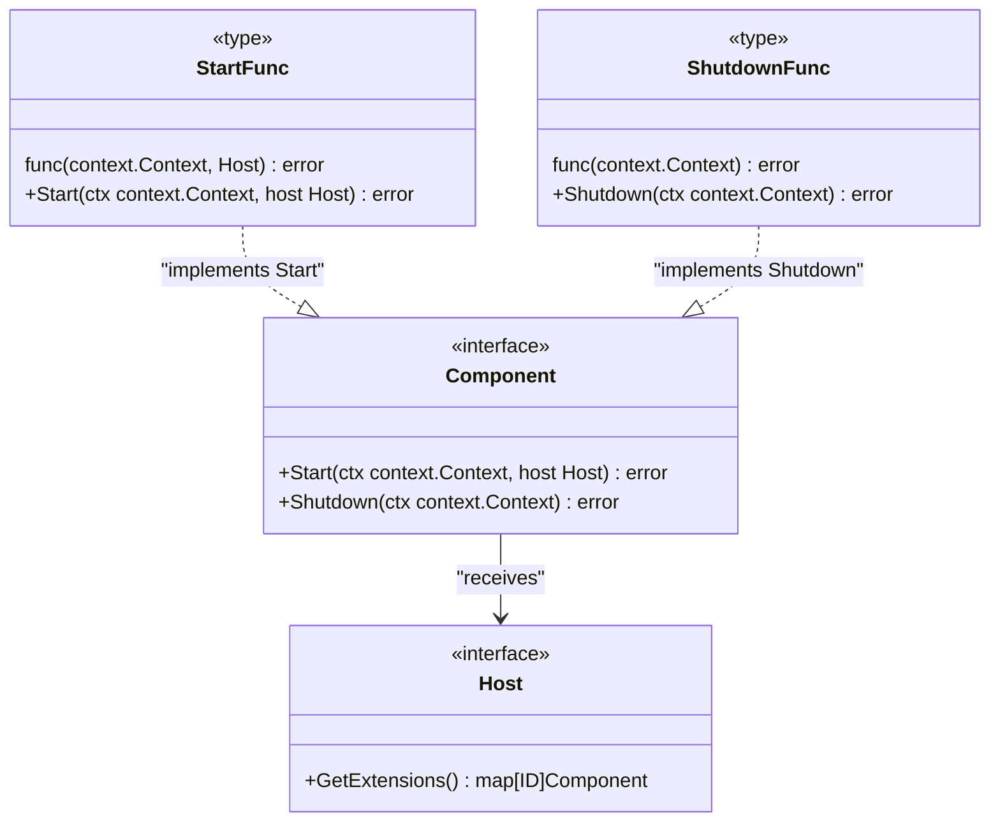
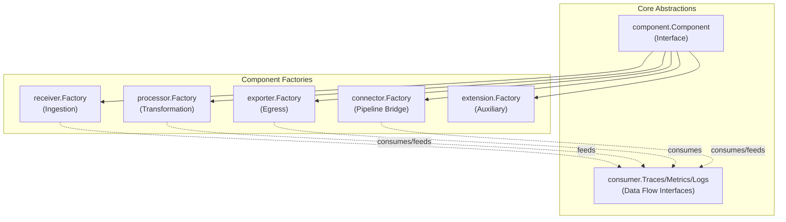

## Purpose and Scope

This document details the **component model** that forms the foundation of the OpenTelemetry Collector architecture. It explains the base `component.Component` interface, lifecycle management, the five component types (receivers, processors, exporters, connectors, extensions), factory patterns for component instantiation, and common interfaces.

For information about how components are assembled into data processing pipelines, see [Pipeline and Data Flow](#2.3). For details on the telemetry data structures components operate on, see [Telemetry Data Model](#2.4). For information about module organization, see [Module Structure and Dependencies](#2.2).

---

## Component Abstraction

The OpenTelemetry Collector uses a **unified component model** where all functional units implement a common set of interfaces. This abstraction enables the service layer to manage diverse component types through a consistent lifecycle and configuration mechanism.

### Base Component Interface

All components implement the `component.Component` interface defined in `component/component.go`. This interface provides the fundamental lifecycle contract:

**Component Lifecycle Interface and Helpers**

**Sources:** [component/component.go:25-62](), [component/component.go:64-84](), [component/host.go:12-23]()

The `Component` interface defines two lifecycle methods:
- **`Start(ctx context.Context, host Host) error`**: Tells the component to start. The `Host` parameter allows communication with the host (typically the service) after `Start()` returns [component/component.go:43]().
- **`Shutdown(ctx context.Context) error`**: Invoked during service shutdown. After this is called, the component should stop accepting data [component/component.go:45-61](). This method must be safe to call even if `Start()` was never called [component/component.go:48-49]().

### Component Identification

Components are uniquely identified by `component.ID`. Component types MUST use `lower_snake_case` naming conventions in configuration (e.g., `memory_limiter` instead of `memorylimiter`) [docs/coding-guidelines.md:12-23]().

**Sources:** [docs/coding-guidelines.md:12-23](), [exporter/exporter.go:36](), [receiver/receiver.go:45](), [extension/extension.go:23]()

---

## Component Types

The collector defines **five component types**, each serving a distinct role in the telemetry pipeline:

**Component Hierarchy and Consumer Associations**

**Sources:** [component/component.go:91-97](), [receiver/receiver.go:15-40](), [processor/processor.go:15-31](), [exporter/exporter.go:15-31](), [connector/connector.go:16-62](), [extension/extension.go:13-18]()

### 1. Receivers
Receivers ingest telemetry data from external sources and convert it into the internal `pdata` format. They feed data to a `consumer.Traces`, `consumer.Metrics`, or `consumer.Logs` [receiver/receiver.go:15-40]().

### 2. Processors
Processors transform, filter, or enrich data. They implement interfaces that combine `component.Component` and the corresponding `consumer` interface (e.g., `processor.Traces`) [processor/processor.go:15-31]().

### 3. Exporters
Exporters send telemetry data to external destinations. Like processors, they implement both the base component and consumer interfaces [exporter/exporter.go:15-31]().

### 4. Connectors
Connectors bridge pipelines, acting as an exporter for one pipeline and a receiver for another. They can bridge different signal types, such as consuming traces and producing metrics [connector/connector.go:16-62]().

### 5. Extensions
Extensions provide auxiliary functionality (e.g., health checks, z-pages) and do not participate directly in the data pipeline [extension/extension.go:13-18]().

---

## Component Lifecycle

A component's lifecycle has four distinct phases [component/component.go:16-21]():
1. **Creation**: Created via its factory's `Create*` call.
2. **Start**: The `Start` method is called to initialize the component.
3. **Running**: The component is operational.
4. **Shutdown**: The `Shutdown` method is called to terminate the component.

### Stability Levels
Components specify stability levels to communicate production readiness [component/component.go:103-118]().

| Level | Description |
|-------|-------------|
| `Development` | Not all pieces are in place; breaking changes frequent [docs/component-stability.md:35-37](). |
| `Alpha` | Ready for limited non-critical workloads [docs/component-stability.md:39-41](). |
| `Beta` | Configuration options stable; minimal breaking changes [docs/component-stability.md:62-64](). |
| `Stable` | General availability; 80%+ test coverage required [docs/component-stability.md:102-117](). |
| `Deprecated` | Will be removed in future releases [component/component.go:166-167](). |

**Sources:** [component/component.go:16-24](), [component/component.go:103-118](), [docs/component-stability.md:25-117]()

---

## Factory Pattern

All components are instantiated via factories. A base `component.Factory` provides the component type and default configuration [component/component.go:182-194]().

### Creation Methods
Type-specific factories provide methods to create components for specific signals.

| Factory Type | Key Creation Methods |
|--------------|----------------------|
| `receiver.Factory` | `CreateTraces`, `CreateMetrics`, `CreateLogs` [receiver/receiver.go:60-88]() |
| `processor.Factory` | `CreateTraces`, `CreateMetrics`, `CreateLogs` [processor/processor.go:51-79]() |
| `exporter.Factory` | `CreateTraces`, `CreateMetrics`, `CreateLogs` [exporter/exporter.go:51-76]() |
| `connector.Factory` | `CreateTracesToTraces`, `CreateTracesToMetrics`, etc. [connector/connector.go:81-115]() |
| `extension.Factory` | `Create` [extension/extension.go:37-46]() |

### Settings and Config
Factories receive `Settings` and a `component.Config`.
- **`component.Config`**: Defines user-provided configuration from YAML [component/config.go:6-13]().
- **`Settings`**: Contains developer-set values like `TelemetrySettings` and `BuildInfo` [receiver/receiver.go:43-54](), [processor/processor.go:34-45]().

**Sources:** [receiver/receiver.go:60-124](), [processor/processor.go:51-109](), [exporter/exporter.go:51-115](), [connector/connector.go:81-118](), [extension/extension.go:37-55]()

---

## Data Ownership and Mutability

Components declare their behavior via `consumer.Capabilities`.
- **Mutation**: Processors and exporters must indicate if they mutate data. This allows the pipeline to determine if data needs to be cloned before being passed to multiple consumers [consumer/consumer.go:12-26]().
- **Naming Conventions**:
    - Configuration structs (YAML-facing) use the `Config` suffix [docs/coding-guidelines.md:69]().
    - Developer-set structs use the `Settings` suffix [docs/coding-guidelines.md:70]().
    - Avoid embedded structs in configuration to prevent unmarshal ambiguity [docs/coding-guidelines.md:73-101]().

**Sources:** [docs/coding-guidelines.md:64-101](), [consumer/consumer.go:12-26]()