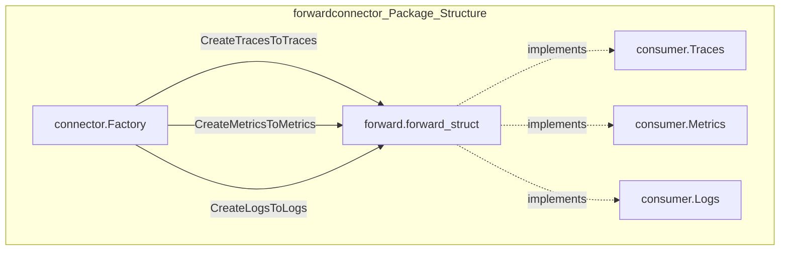
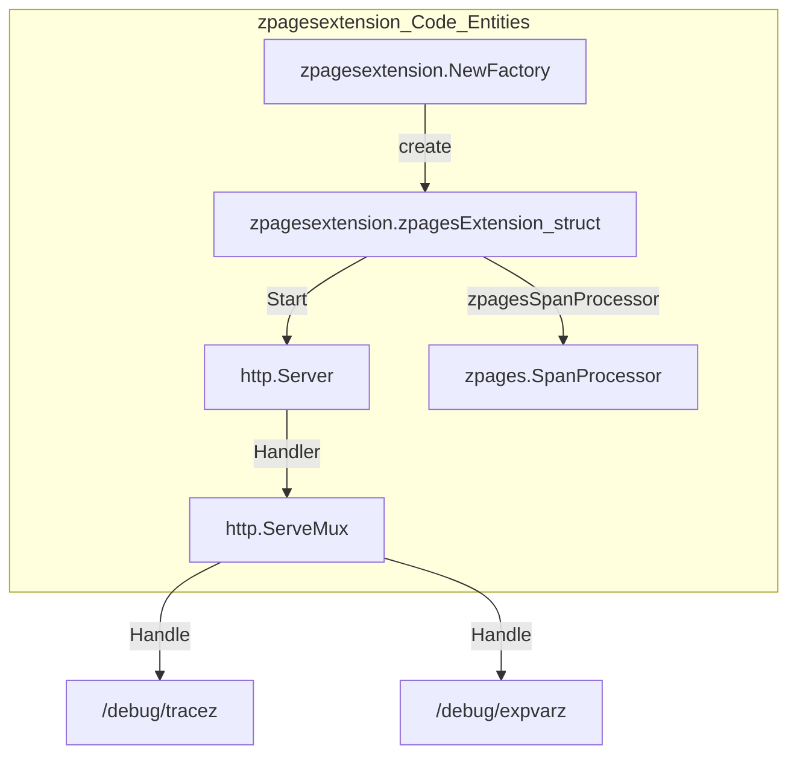
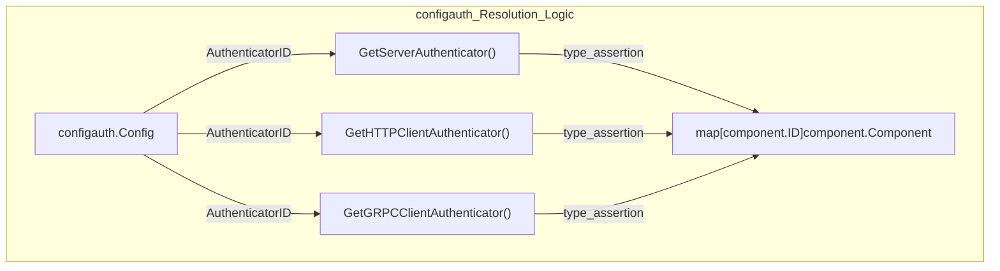
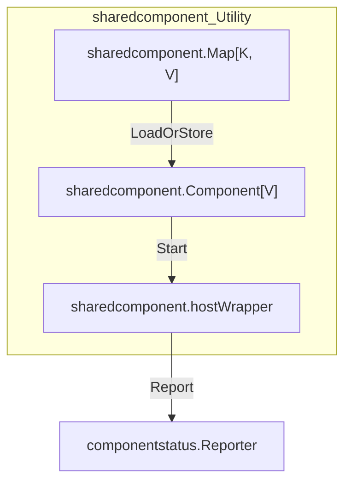

Connectors and extensions are specialized component types that extend the OpenTelemetry Collector's capabilities beyond the core data pipeline. Connectors bridge multiple pipelines, acting as both exporters and receivers to enable inter-pipeline data flow. Extensions provide auxiliary services such as health monitoring, diagnostics, authentication, and resource management. While receivers, processors, and exporters handle the primary data flow, connectors and extensions enable advanced topology patterns and operational capabilities.

## Connectors

Connectors implement both consumer and producer interfaces, allowing them to receive data from one pipeline and emit it into another. This dual nature enables data routing, signal transformation (e.g., traces to metrics), and multi-pipeline architectures.

### Core Connector Interfaces

The connector package defines base interfaces for each signal type combination. These components act as a bridge, where the "exporter" end of Pipeline A is the "receiver" end of Pipeline B.

| Interface | Purpose | Factory Method |
|-----------|---------|----------------|
| `connector.Traces` | Both consumes and produces traces | `CreateTracesToTraces()` |
| `connector.Metrics` | Both consumes and produces metrics | `CreateMetricsToMetrics()` |
| `connector.Logs` | Both consumes and produces logs | `CreateLogsToLogs()` |
| `connector.TracesToMetrics` | Converts traces to metrics | `CreateTracesToMetrics()` |
| `connector.TracesToLogs` | Converts traces to logs | `CreateTracesToLogs()` |

### Forward Connector Implementation

The `forwardconnector` is the canonical connector implementation included in the core collector distribution. It provides simple pass-through functionality for all signal types.

**Forward Connector Data Flow**

The forward connector stores the next consumer in the pipeline and simply forwards all data unchanged. It serves as the default connector for same-type pipeline connections.

Sources: [connector/forwardconnector/forward.go:19-48](), [connector/forwardconnector/forward.go:50-71]()

## Extensions

Extensions are components that provide services outside the telemetry data pipeline. They implement the `extension.Extension` interface and are managed by the service layer. Extensions start before pipelines and shut down after pipelines, ensuring supporting services are available throughout the collector lifecycle.

### Core Extension Implementations

#### zPages Extension
The `zpagesextension` provides a diagnostic web UI and metrics for the collector. It exposes endpoints like `/debug/tracez` and `/debug/expvarz` to inspect the internal state of the collector.

**zPages Implementation Mapping**

The extension uses `confighttp.ServerConfig` for its network settings and defaults to `localhost:55679` [extension/zpagesextension/factory.go:15-17](). During `Start`, it attempts to register its `SpanProcessor` with the `TracerProvider` if it implements the `registerableTracerProvider` interface [extension/zpagesextension/zpagesextension.go:50-70](). It also supports enabling `expvar` for variable monitoring [extension/zpagesextension/zpagesextension_test.go:174-203]().

Sources: [extension/zpagesextension/factory.go:20-35](), [extension/zpagesextension/zpagesextension.go:27-48](), [extension/zpagesextension/zpagesextension.go:50-109](), [extension/zpagesextension/zpagesextension_test.go:54-80]()

#### Authentication Extensions
Authentication extensions provide mechanisms to secure both incoming (receiver) and outgoing (exporter) requests. They are categorized into `Server` (for receivers) and `Client` (for exporters) authenticators.

**configauth Resolution Logic**

Authenticators must implement specific interfaces defined in the `extensionauth` package:
- `extensionauth.Server`: Used by receivers to authenticate incoming requests [config/configauth/configauth.go:35-44]().
- `extensionauth.HTTPClient`: Used by HTTP exporters to add auth headers/logic [config/configauth/configauth.go:49-57]().
- `extensionauth.GRPCClient`: Used by gRPC exporters [config/configauth/configauth.go:62-70]().

Sources: [config/configauth/configauth.go:18-70](), [extension/extensionauth/server.go:14-22](), [extension/extensionauth/client.go:14-25]()

#### Extension Middleware
The `extensionmiddleware` package allows extensions to inject HTTP and gRPC middleware into receivers and exporters. This is often used for cross-cutting concerns like custom logging, request manipulation, or specialized telemetry.

Components use `configmiddleware.Config` to reference these extensions by their `component.ID` [config/configmiddleware/go.mod:1-12](). The resolution logic is similar to the authentication system, where the component looks up the extension in the host's extension map and asserts that it implements the required middleware interface (e.g., `extensionmiddleware.HTTPClient`).

Sources: [config/configmiddleware/go.mod:1-12](), [extension/extensionmiddleware/extensionmiddlewaretest/go.mod:1-11]()

## Shared Components

The `internal/sharedcomponent` package provides a utility for components that need to be reused across multiple signal types or pipelines while sharing a single underlying resource (like a single listener for multiple receivers).

### Shared Map and Lifecycle
The `sharedcomponent.Map` manages the lifecycle of components that are logically "shared".

**Shared Component Utility**

Key behaviors of shared components:
1. **Reference Counting**: The `LoadOrStore` method ensures only one instance is created for a given key. If an instance already exists, it returns the existing one; otherwise, it creates a new one [internal/sharedcomponent/sharedcomponent.go:32-53]().
2. **Idempotent Lifecycle**: `Start` and `Shutdown` use `sync.Once` to ensure the underlying component is only initialized and terminated once, regardless of how many pipelines use it [internal/sharedcomponent/sharedcomponent.go:72-96](), [internal/sharedcomponent/sharedcomponent.go:146-167]().
3. **Status Reporting**: The `hostWrapper` ensures that status events (Starting, OK, Stopping) are coordinated across all consumers of the shared component [internal/sharedcomponent/sharedcomponent.go:110-132]().
4. **Automatic Cleanup**: When the shared component is shut down, it triggers a `removeFunc` that deletes the component from the internal map [internal/sharedcomponent/sharedcomponent.go:45-49](), [internal/sharedcomponent/sharedcomponent.go:164-164]().

Sources: [internal/sharedcomponent/sharedcomponent.go:18-53](), [internal/sharedcomponent/sharedcomponent.go:57-65](), [internal/sharedcomponent/sharedcomponent.go:72-103](), [internal/sharedcomponent/sharedcomponent.go:146-167]()