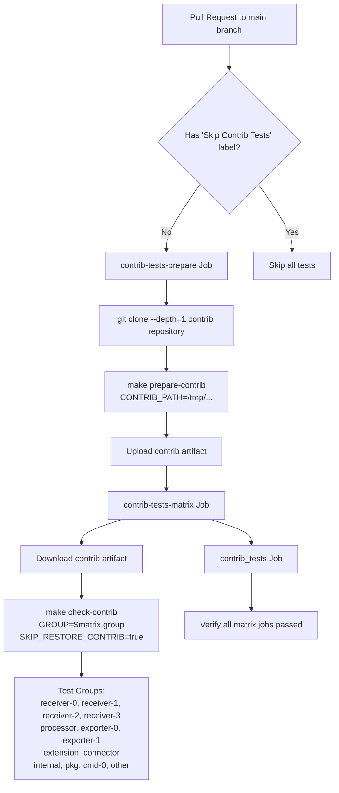
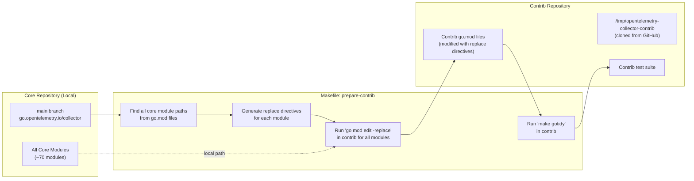
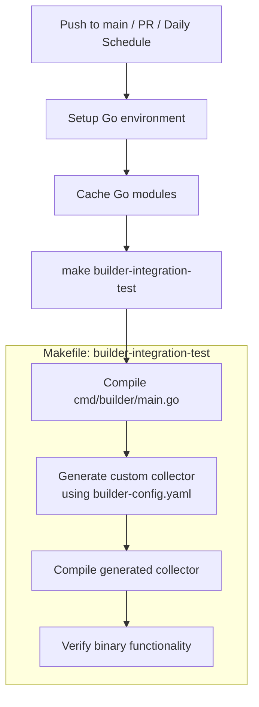
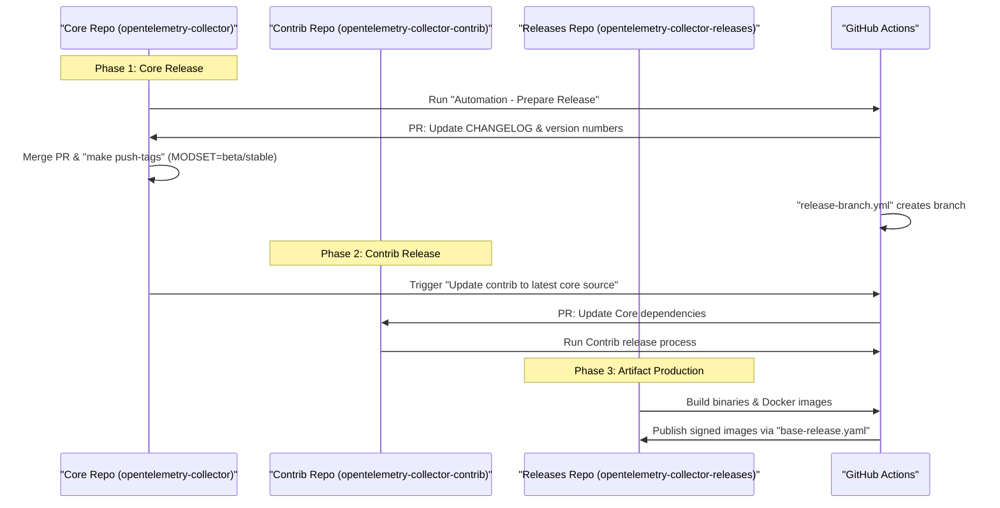
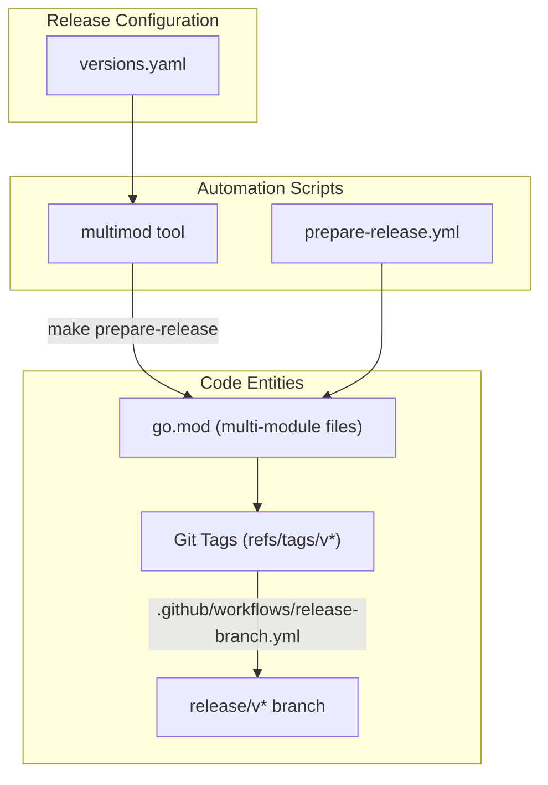
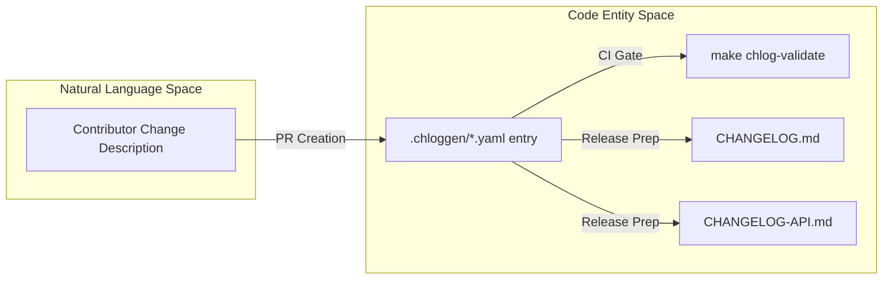

## Purpose and Scope

This document describes the cross-repository testing system that validates changes in the core OpenTelemetry Collector repository against the [opentelemetry-collector-contrib](https://github.com/open-telemetry/opentelemetry-collector-contrib) repository. This system ensures that core API and implementation changes do not break the large number of community-contributed components housed in the contrib repository. Additionally, this page covers integration testing for the OpenTelemetry Collector Builder (ocb) tool.

For information about testing within the core repository itself, see Testing Infrastructure ([9.2]()). For information about the CI/CD workflows used to validate core changes, see CI/CD System ([10.1]()).

## System Overview

The cross-repository testing system temporarily modifies the contrib repository's `go.mod` files to replace all core collector module references with local paths pointing to the current state of the core repository. This allows contrib's test suite to run against proposed changes before they are merged, preventing breaking changes from reaching the main branch.

The system consists of:
- **GitHub Actions workflows**: Orchestrates the testing process and builder validation.
- **Makefile targets**: Manipulates repository state and executes tests via `make prepare-contrib` and `make check-contrib`.
- **Test matrix**: Parallelizes contrib tests across component types.

**Sources:** [.github/workflows/contrib-tests.yml:1-110](), [.github/workflows/builder-integration-test.yaml:1-54]()

## Contrib Tests Workflow Architecture

The `contrib-tests` workflow is a multi-stage pipeline designed to link the two repositories and execute the contrib test suite in parallel.

### Workflow Execution Flow

**Workflow: contrib-tests**

The workflow runs on push to main, pull requests, merge groups, and tag pushes [.github/workflows/contrib-tests.yml:2-11](). It can be skipped by adding the `Skip Contrib Tests` label to a pull request [.github/workflows/contrib-tests.yml:22-22]().

**Sources:** [.github/workflows/contrib-tests.yml:1-110]()

## Repository Linking Process

The linking process ensures that the contrib repository uses the exact code present in the current core PR or commit.

### Code-to-Action Mapping

**Process Flow:**

1.  **Clone Contrib**: The `contrib-tests-prepare` job clones the contrib repository to a temporary path [.github/workflows/contrib-tests.yml:30-31]().
2.  **Module Linking**: The `make prepare-contrib` target is called with `CONTRIB_PATH` to point the contrib modules back to the local core source [.github/workflows/contrib-tests.yml:32-32]().
3.  **Artifact Persistence**: The modified contrib directory is uploaded as a GitHub Action artifact to be shared across the test matrix [.github/workflows/contrib-tests.yml:33-37]().
4.  **Matrix Execution**: Each matrix job downloads the artifact and runs `make check-contrib` for its specific `GROUP` [.github/workflows/contrib-tests.yml:86-88]().

**Sources:** [.github/workflows/contrib-tests.yml:20-89]()

## Test Matrix Strategy

The contrib repository is large. To parallelize testing and reduce total CI time, tests are divided into groups defined in the `contrib-tests-matrix` job [.github/workflows/contrib-tests.yml:45-59]().

| Group | Coverage | Purpose |
|-------|----------|---------|
| `receiver-0` to `receiver-3` | All receiver components | Parallelized receiver testing |
| `processor` | All processor components | Processor testing |
| `exporter-0` to `exporter-1` | All exporter components | Parallelized exporter testing |
| `extension` | All extension components | Extension testing |
| `connector` | All connector components | Connector testing |
| `internal` | Internal packages | Infrastructure testing |
| `pkg` | Shared package code | Library testing |
| `cmd-0` | Command-line tools | Tool testing |
| `other` | Remaining components | Catch-all testing |

**Sources:** [.github/workflows/contrib-tests.yml:39-60]()

## Builder Integration Testing

The repository validates the OpenTelemetry Collector Builder (ocb) tool through the `builder-integration-test.yaml` workflow to ensure that core changes do not break the ability to build custom distributions. This tool is located in `cmd/builder` [.github/workflows/builder-integration-test.yaml:53-53]().

### Integration Test Workflow

The `integration-test` job ensures that the builder can successfully generate and compile a collector distribution using the current code.

This workflow runs on:
- Changes to the main branch [.github/workflows/builder-integration-test.yaml:5-6]().
- PRs touching the repository [.github/workflows/builder-integration-test.yaml:9-10]().
- A daily schedule at 6:17 AM UTC [.github/workflows/builder-integration-test.yaml:13-14]().

The builder's internal logic for module resolution and versioning is tested in `cmd/builder/internal/builder/main_test.go`, including default generation behavior [cmd/builder/internal/builder/main_test.go:140-142]() and version compatibility [cmd/builder/internal/builder/main_test.go:176-257](). The `replaceModules` list in tests defines the core modules that the builder must correctly handle during generation [cmd/builder/internal/builder/main_test.go:40-120]().

**Sources:** [.github/workflows/builder-integration-test.yaml:1-54](), [cmd/builder/internal/builder/main_test.go:1-257]()

## API Compatibility Checks

To prevent breaking changes before they reach the contrib repository or downstream users, the `api-compatibility` workflow compares the API state of the current PR against the `main` branch.

1.  **Checkout-Main**: Clones the base branch [.github/workflows/api-compatibility.yml:22-27]().
2.  **Generate-States**: Runs `make apidiff-build` on the base branch to snapshot the API [.github/workflows/api-compatibility.yml:51-54]().
3.  **Compare-States**: Runs `make apidiff-compare` on the PR branch to identify incompatible changes [.github/workflows/api-compatibility.yml:57-63]().
4.  **Enforcement**: The `Check-States` step fails the CI if breaking changes are detected using the `-c` flag [.github/workflows/api-compatibility.yml:66-72]().

**Sources:** [.github/workflows/api-compatibility.yml:1-73]()

## Summary of Cross-Repo Validation

The following table summarizes the primary cross-repository and integration checks:

| Workflow | Trigger | Primary Action |
|----------|---------|----------------|
| `contrib-tests` | PR, Push, Merge Group | Links contrib to local core and runs contrib tests |
| `builder-integration-test` | PR, Push, Schedule | Runs `make builder-integration-test` to verify `ocb` |
| `api-compatibility` | PR | Compares API state snapshots to prevent breaking changes |
| `build-and-test` | PR, Push, Merge Group | Verifies core `otelcorecol` generation via `make genotelcorecol` [.github/workflows/build-and-test.yml:152-155]() |

**Sources:** [.github/workflows/contrib-tests.yml:1-12](), [.github/workflows/builder-integration-test.yaml:3-20](), [.github/workflows/api-compatibility.yml:1-11](), [.github/workflows/build-and-test.yml:152-155]()

# Release Management

The OpenTelemetry Collector follows a bi-weekly release cadence with automated workflows for version coordination, changelog generation, and artifact publication. The release process spans three repositories (core, contrib, releases) with coordinated release managers and strict version consistency validation.

This document covers:
- **Release Process** ([Release Process](#11.1)) - Workflow automation, release manager roles, and multi-repository coordination.
- **Module Versioning and Stability** ([Module Versioning and Stability](#11.2)) - Dual versioning tracks (stable v1.x vs beta v0.x), version synchronization, and stabilization criteria.
- **Changelog Management** ([Changelog Management](#11.3)) - The `chloggen` system for managing structured changelog entries.

For custom Collector distributions, see [OpenTelemetry Collector Builder (ocb)](#8.1). For module structure, see [Module Structure and Dependencies](#2.2). For CI/CD details, see [CI/CD and Automation](#10).

## 11.1 Release Process

### Release Manager Roles

Release managers are responsible for specific releases on a rotating basis [docs/release.md:13-17](). All core, contrib, and releases approvers serve as release managers to distribute knowledge across the community.

**Responsibilities:**
1. **Pre-Release Checks**: Monitor release blockers labeled `release:blocker` in core, contrib, and releases repositories [docs/release.md:24-25]().
2. **Build Validation**: Ensure the current main branch build successfully passes. This includes ensuring that the latest core does not break contrib by running the "Update contrib to the latest core source" workflow [docs/release.md:28-30]().
3. **Execution**: Trigger automated workflows and perform manual operations like pushing GPG-signed tags [docs/release.md:40-46]().

Sources: [docs/release.md:13-46]()

### Three-Phase Release Workflow

Releases proceed sequentially through three repositories to ensure dependency integrity [docs/release.md:5-9]():

**Diagram: Multi-Repository Release Coordination**

Sources: [docs/release.md:5-64](), [README.md:130-132]()

### Core Release Procedure

The core release manager triggers the `Automation - Prepare Release` workflow, providing candidate version numbers [docs/release.md:32-35]().

**Automation Steps:**
1. **Preparation**: The workflow validates version formats (e.g., major version > 1 for stable) [.github/workflows/prepare-release.yml:40-56]() and checks for blockers.
2. **PR Creation**: It creates a tracking issue and a pull request to update the changelog and version numbers [docs/release.md:34-38]().
3. **Tagging and Branching**: Pushing tags via `make push-tags` triggers the `Automation - Release Branch` workflow, which creates a release branch (e.g. `release/v0.127.x`) from the preparation commit [docs/release.md:40-54]().

Sources: [docs/release.md:26-54](), [.github/workflows/prepare-release.yml:1-171]()

## 11.2 Module Versioning and Stability

### Dual Versioning Tracks

The Collector maintains two parallel versioning tracks defined in `versions.yaml` [versions.yaml:4-33]().

| Module Set | Version Pattern | Stability Level | Example Modules |
|------------|-----------------|-----------------|-----------------|
| **Stable** | `v1.x.y` | API-stable | `pdata`, `component`, `confmap` [versions.yaml:10-12]() |
| **Beta** | `v0.x.y` | Breaking allowed | `otelcol`, `otlpreceiver`, `batchprocessor` [versions.yaml:78-92]() |

Stability levels are documented per component (e.g., `In Development`, `Alpha`, `Beta`, `Stable`) [CONTRIBUTING.md:85-91]().

Sources: [versions.yaml:4-104](), [CONTRIBUTING.md:18-53](), [README.md:106-108]()

### Version Synchronization

The `multimod` tool (verified via `make multimod-verify`) ensures that all modules within a set stay synchronized [.github/workflows/build-and-test.yml:156-157](). The `versions.yaml` file acts as the source of truth for which modules belong to the `stable` and `beta` sets [versions.yaml:4-104]().

**Diagram: Versioning Logic Flow**

Sources: [versions.yaml:4-33](), [docs/release.md:40-54](), [.github/workflows/build-and-test.yml:156-157]()

## 11.3 Changelog Management

### The chloggen System

The Collector uses the `chloggen` system to manage user-facing changes. Direct modification of `CHANGELOG.md` is prohibited and enforced by CI [.github/workflows/changelog.yml:49-60]().

**Workflow:**
1. **Entry Creation**: Contributors add a `.yaml` file to the `.chloggen/` directory [CONTRIBUTING.md:53-55]().
2. **Validation**: CI runs `make chlog-validate` to ensure the YAML format is correct [.github/workflows/changelog.yml:75-79]().
3. **Aggregation**: During release, the entries are rendered into `CHANGELOG.md` (user-facing) and `CHANGELOG-API.md` (developer-facing) [CHANGELOG.md:5-6]().

Sources: [CHANGELOG.md:1-10](), [.github/workflows/changelog.yml:1-88](), [CONTRIBUTING.md:53-55]()

### Release Aggregation

During release preparation, the `Automation - Prepare Release` workflow automates the aggregation of these files into the final changelog files [docs/release.md:34-35]().

**Diagram: Changelog Data Flow**

Sources: [CHANGELOG.md:1-10](), [.github/workflows/changelog.yml:75-82](), [docs/release.md:58]()